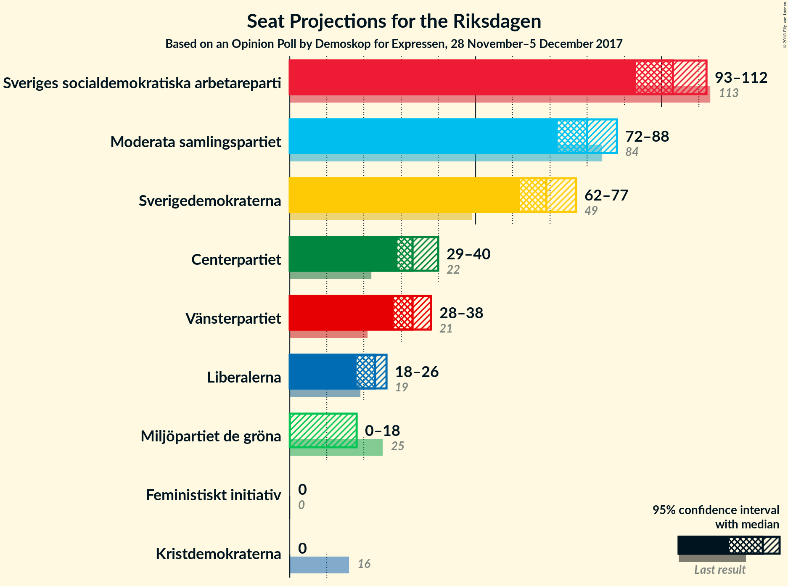
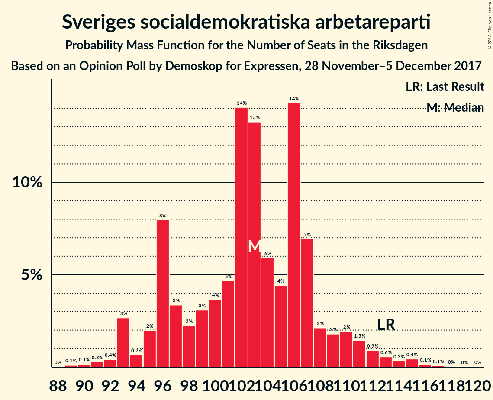
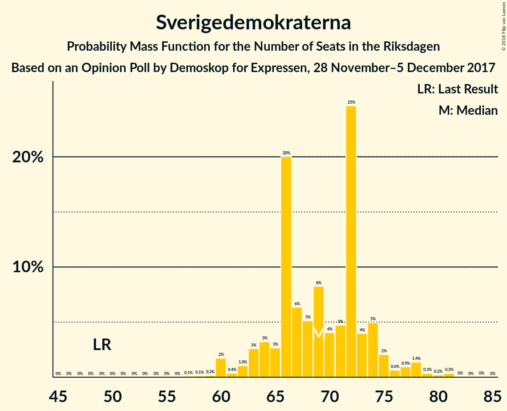
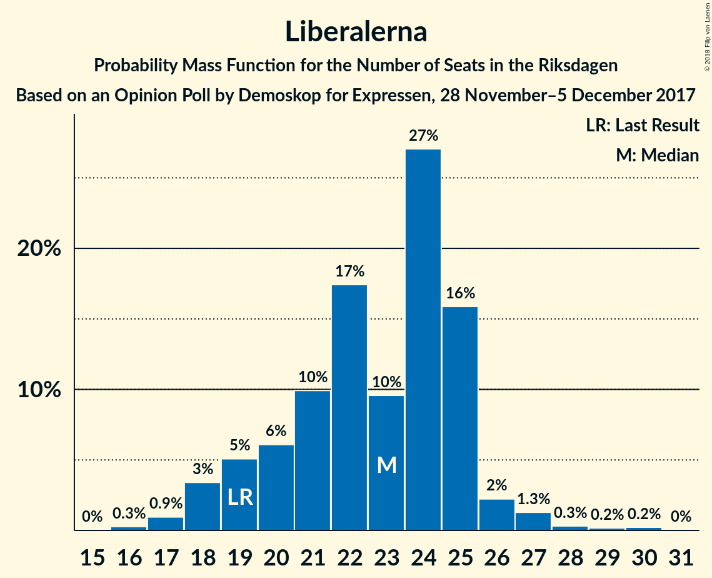

# Opinion Poll by Demoskop for Expressen, 28 November–5 December 2017

<a href="#voting-intentions">Voting Intentions</a> | <a href="#seats">Seats</a> | <a href="#coalitions">Coalitions</a> | <a href="#technical-information">Technical Information</a>

## Voting Intentions

### Confidence Intervals

| Party | Last Result | Poll Result | 80% Confidence Interval | 90% Confidence Interval | 95% Confidence Interval | 99% Confidence Interval |
|:-----:|:-----------:|:-----------:|:-----------------------:|:-----------------------:|:-----------------------:|:-----------------------:|
| Sveriges socialdemokratiska arbetareparti | 31.0% | 27.1% | 25.7–28.6% |25.3–29.0% |25.0–29.4% |24.3–30.1% |
| Moderata samlingspartiet | 23.3% | 20.9% | 19.6–22.3% |19.3–22.6% |19.0–23.0% |18.4–23.6% |
| Sverigedemokraterna | 12.9% | 18.3% | 17.1–19.6% |16.8–19.9% |16.5–20.3% |15.9–20.9% |
| Centerpartiet | 6.1% | 9.1% | 8.2–10.1% |8.0–10.3% |7.8–10.6% |7.4–11.1% |
| Vänsterpartiet | 5.7% | 8.5% | 7.7–9.5% |7.5–9.8% |7.2–10.0% |6.9–10.5% |
| Liberalerna | 5.4% | 5.8% | 5.1–6.6% |4.9–6.8% |4.7–7.0% |4.4–7.5% |
| Miljöpartiet de gröna | 6.9% | 3.9% | 3.4–4.6% |3.2–4.8% |3.1–5.0% |2.8–5.3% |
| Kristdemokraterna | 4.6% | 3.0% | 2.5–3.6% |2.4–3.8% |2.3–3.9% |2.0–4.3% |
| Feministiskt initiativ | 3.1% | 2.2% | 1.8–2.7% |1.7–2.9% |1.6–3.0% |1.4–3.3% |

*Note:* The poll result column reflects the actual value used in the calculations. Published results may vary slightly, and in addition be rounded to fewer digits.

## Seats

### Confidence Intervals

| Party | Last Result | Median | 80% Confidence Interval | 90% Confidence Interval | 95% Confidence Interval | 99% Confidence Interval |
|:-----:|:-----------:|:------:|:-----------------------:|:-----------------------:|:-----------------------:|:-----------------------:|
| <a href="#sveriges-socialdemokratiska-arbetareparti">Sveriges socialdemokratiska arbetareparti</a> | 113 | 103 | 96–107 |95–110 |93–112 |91–115 |
| <a href="#moderata-samlingspartiet">Moderata samlingspartiet</a> | 84 | 80 | 75–85 |73–87 |72–88 |70–91 |
| <a href="#sverigedemokraterna">Sverigedemokraterna</a> | 49 | 69 | 65–74 |63–75 |62–77 |60–80 |
| <a href="#centerpartiet">Centerpartiet</a> | 22 | 33 | 31–38 |30–40 |29–40 |28–42 |
| <a href="#vänsterpartiet">Vänsterpartiet</a> | 21 | 33 | 30–35 |29–37 |28–38 |26–40 |
| <a href="#liberalerna">Liberalerna</a> | 19 | 23 | 20–25 |19–25 |18–26 |17–28 |
| <a href="#miljöpartiet-de-gröna">Miljöpartiet de gröna</a> | 25 | 0 | 0–17 |0–18 |0–18 |0–20 |
| <a href="#kristdemokraterna">Kristdemokraterna</a> | 16 | 0 | 0 |0 |0 |0–16 |
| <a href="#feministiskt-initiativ">Feministiskt initiativ</a> | 0 | 0 | 0 |0 |0 |0 |

### Sveriges socialdemokratiska arbetareparti

*For a full overview of the results for this party, see the [Sveriges socialdemokratiska arbetareparti](party-sverigessocialdemokratiskaarbetareparti.html) page.*

| Number of Seats | Probability | Accumulated | Special Marks |
|:---------------:|:-----------:|:-----------:|:-------------:|
| 88 | 0% | 100% |  |
| 89 | 0.1% | 99.9% |  |
| 90 | 0.1% | 99.8% |  |
| 91 | 0.3% | 99.7% |  |
| 92 | 0.4% | 99.4% |  |
| 93 | 3% | 99.0% |  |
| 94 | 0.7% | 96% |  |
| 95 | 2% | 96% |  |
| 96 | 8% | 94% |  |
| 97 | 3% | 86% |  |
| 98 | 2% | 82% |  |
| 99 | 3% | 80% |  |
| 100 | 4% | 77% |  |
| 101 | 5% | 73% |  |
| 102 | 14% | 69% |  |
| 103 | 13% | 55% | Median |
| 104 | 6% | 41% |  |
| 105 | 4% | 35% |  |
| 106 | 14% | 31% |  |
| 107 | 7% | 17% |  |
| 108 | 2% | 10% |  |
| 109 | 2% | 8% |  |
| 110 | 2% | 6% |  |
| 111 | 1.5% | 4% |  |
| 112 | 0.9% | 3% |  |
| 113 | 0.6% | 2% | Last Result |
| 114 | 0.3% | 1.1% |  |
| 115 | 0.4% | 0.7% |  |
| 116 | 0.1% | 0.3% |  |
| 117 | 0.1% | 0.1% |  |
| 118 | 0% | 0.1% |  |
| 119 | 0% | 0% |  |

### Moderata samlingspartiet

*For a full overview of the results for this party, see the [Moderata samlingspartiet](party-moderatasamlingspartiet.html) page.*

| Number of Seats | Probability | Accumulated | Special Marks |
|:---------------:|:-----------:|:-----------:|:-------------:|
| 66 | 0% | 100% |  |
| 67 | 0% | 99.9% |  |
| 68 | 0.1% | 99.9% |  |
| 69 | 0.3% | 99.8% |  |
| 70 | 0.6% | 99.5% |  |
| 71 | 0.5% | 99.0% |  |
| 72 | 1.2% | 98.5% |  |
| 73 | 3% | 97% |  |
| 74 | 4% | 94% |  |
| 75 | 3% | 91% |  |
| 76 | 13% | 88% |  |
| 77 | 5% | 75% |  |
| 78 | 5% | 70% |  |
| 79 | 4% | 65% |  |
| 80 | 11% | 61% | Median |
| 81 | 16% | 50% |  |
| 82 | 5% | 34% |  |
| 83 | 4% | 29% |  |
| 84 | 7% | 25% | Last Result |
| 85 | 10% | 18% |  |
| 86 | 2% | 8% |  |
| 87 | 2% | 5% |  |
| 88 | 0.9% | 3% |  |
| 89 | 0.4% | 2% |  |
| 90 | 1.3% | 2% |  |
| 91 | 0.3% | 0.7% |  |
| 92 | 0.1% | 0.4% |  |
| 93 | 0.2% | 0.3% |  |
| 94 | 0% | 0% |  |

### Sverigedemokraterna

*For a full overview of the results for this party, see the [Sverigedemokraterna](party-sverigedemokraterna.html) page.*

| Number of Seats | Probability | Accumulated | Special Marks |
|:---------------:|:-----------:|:-----------:|:-------------:|
| 49 | 0% | 100% | Last Result |
| 50 | 0% | 100% |  |
| 51 | 0% | 100% |  |
| 52 | 0% | 100% |  |
| 53 | 0% | 100% |  |
| 54 | 0% | 100% |  |
| 55 | 0% | 100% |  |
| 56 | 0% | 100% |  |
| 57 | 0.1% | 100% |  |
| 58 | 0.1% | 99.9% |  |
| 59 | 0.2% | 99.8% |  |
| 60 | 2% | 99.6% |  |
| 61 | 0.4% | 98% |  |
| 62 | 1.0% | 98% |  |
| 63 | 3% | 96% |  |
| 64 | 3% | 94% |  |
| 65 | 3% | 91% |  |
| 66 | 20% | 88% |  |
| 67 | 6% | 68% |  |
| 68 | 5% | 62% |  |
| 69 | 8% | 57% | Median |
| 70 | 4% | 48% |  |
| 71 | 5% | 44% |  |
| 72 | 25% | 40% |  |
| 73 | 4% | 15% |  |
| 74 | 5% | 11% |  |
| 75 | 2% | 6% |  |
| 76 | 0.6% | 4% |  |
| 77 | 0.9% | 3% |  |
| 78 | 1.4% | 2% |  |
| 79 | 0.3% | 1.0% |  |
| 80 | 0.2% | 0.6% |  |
| 81 | 0.3% | 0.4% |  |
| 82 | 0% | 0.1% |  |
| 83 | 0% | 0.1% |  |
| 84 | 0% | 0% |  |

### Centerpartiet

*For a full overview of the results for this party, see the [Centerpartiet](party-centerpartiet.html) page.*

| Number of Seats | Probability | Accumulated | Special Marks |
|:---------------:|:-----------:|:-----------:|:-------------:|
| 22 | 0% | 100% | Last Result |
| 23 | 0% | 100% |  |
| 24 | 0% | 100% |  |
| 25 | 0% | 100% |  |
| 26 | 0.1% | 100% |  |
| 27 | 0.1% | 99.9% |  |
| 28 | 0.9% | 99.8% |  |
| 29 | 2% | 98.9% |  |
| 30 | 3% | 97% |  |
| 31 | 5% | 94% |  |
| 32 | 32% | 88% |  |
| 33 | 7% | 56% | Median |
| 34 | 12% | 49% |  |
| 35 | 14% | 37% |  |
| 36 | 6% | 22% |  |
| 37 | 3% | 16% |  |
| 38 | 4% | 13% |  |
| 39 | 3% | 8% |  |
| 40 | 3% | 6% |  |
| 41 | 0.7% | 2% |  |
| 42 | 1.3% | 2% |  |
| 43 | 0.2% | 0.3% |  |
| 44 | 0.1% | 0.1% |  |
| 45 | 0% | 0% |  |

### Vänsterpartiet

*For a full overview of the results for this party, see the [Vänsterpartiet](party-vänsterpartiet.html) page.*

| Number of Seats | Probability | Accumulated | Special Marks |
|:---------------:|:-----------:|:-----------:|:-------------:|
| 21 | 0% | 100% | Last Result |
| 22 | 0% | 100% |  |
| 23 | 0% | 100% |  |
| 24 | 0.1% | 100% |  |
| 25 | 0.2% | 99.9% |  |
| 26 | 0.7% | 99.7% |  |
| 27 | 1.1% | 99.0% |  |
| 28 | 2% | 98% |  |
| 29 | 3% | 96% |  |
| 30 | 7% | 93% |  |
| 31 | 10% | 86% |  |
| 32 | 15% | 76% |  |
| 33 | 19% | 62% | Median |
| 34 | 17% | 42% |  |
| 35 | 17% | 25% |  |
| 36 | 3% | 8% |  |
| 37 | 3% | 6% |  |
| 38 | 2% | 3% |  |
| 39 | 0.4% | 1.1% |  |
| 40 | 0.4% | 0.6% |  |
| 41 | 0.2% | 0.2% |  |
| 42 | 0% | 0.1% |  |
| 43 | 0% | 0% |  |

### Liberalerna

*For a full overview of the results for this party, see the [Liberalerna](party-liberalerna.html) page.*

| Number of Seats | Probability | Accumulated | Special Marks |
|:---------------:|:-----------:|:-----------:|:-------------:|
| 15 | 0% | 100% |  |
| 16 | 0.3% | 99.9% |  |
| 17 | 0.9% | 99.7% |  |
| 18 | 3% | 98.7% |  |
| 19 | 5% | 95% | Last Result |
| 20 | 6% | 90% |  |
| 21 | 10% | 84% |  |
| 22 | 17% | 74% |  |
| 23 | 10% | 57% | Median |
| 24 | 27% | 47% |  |
| 25 | 16% | 20% |  |
| 26 | 2% | 4% |  |
| 27 | 1.3% | 2% |  |
| 28 | 0.3% | 0.8% |  |
| 29 | 0.2% | 0.4% |  |
| 30 | 0.2% | 0.3% |  |
| 31 | 0% | 0% |  |

### Miljöpartiet de gröna

*For a full overview of the results for this party, see the [Miljöpartiet de gröna](party-miljöpartietdegröna.html) page.*

| Number of Seats | Probability | Accumulated | Special Marks |
|:---------------:|:-----------:|:-----------:|:-------------:|
| 0 | 55% | 100% | Median |
| 1 | 0% | 45% |  |
| 2 | 0% | 45% |  |
| 3 | 0% | 45% |  |
| 4 | 0% | 45% |  |
| 5 | 0% | 45% |  |
| 6 | 0% | 45% |  |
| 7 | 0% | 45% |  |
| 8 | 0% | 45% |  |
| 9 | 0% | 45% |  |
| 10 | 0% | 45% |  |
| 11 | 0% | 45% |  |
| 12 | 0% | 45% |  |
| 13 | 0% | 45% |  |
| 14 | 0% | 45% |  |
| 15 | 16% | 45% |  |
| 16 | 16% | 29% |  |
| 17 | 6% | 13% |  |
| 18 | 5% | 7% |  |
| 19 | 0.7% | 1.3% |  |
| 20 | 0.4% | 0.5% |  |
| 21 | 0.1% | 0.1% |  |
| 22 | 0% | 0% |  |
| 23 | 0% | 0% |  |
| 24 | 0% | 0% |  |
| 25 | 0% | 0% | Last Result |

### Kristdemokraterna

*For a full overview of the results for this party, see the [Kristdemokraterna](party-kristdemokraterna.html) page.*

| Number of Seats | Probability | Accumulated | Special Marks |
|:---------------:|:-----------:|:-----------:|:-------------:|
| 0 | 98.7% | 100% | Median |
| 1 | 0% | 1.3% |  |
| 2 | 0% | 1.3% |  |
| 3 | 0% | 1.3% |  |
| 4 | 0% | 1.3% |  |
| 5 | 0% | 1.3% |  |
| 6 | 0% | 1.3% |  |
| 7 | 0% | 1.3% |  |
| 8 | 0% | 1.3% |  |
| 9 | 0% | 1.3% |  |
| 10 | 0% | 1.3% |  |
| 11 | 0% | 1.3% |  |
| 12 | 0% | 1.3% |  |
| 13 | 0% | 1.3% |  |
| 14 | 0% | 1.3% |  |
| 15 | 0.5% | 1.2% |  |
| 16 | 0.6% | 0.8% | Last Result |
| 17 | 0.1% | 0.1% |  |
| 18 | 0% | 0% |  |

### Feministiskt initiativ

*For a full overview of the results for this party, see the [Feministiskt initiativ](party-feministisktinitiativ.html) page.*

| Number of Seats | Probability | Accumulated | Special Marks |
|:---------------:|:-----------:|:-----------:|:-------------:|
| 0 | 100% | 100% | Last Result, Median |

## Coalitions

### Confidence Intervals

| Coalition | Last Result | Median | Majority? | 80% Confidence Interval | 90% Confidence Interval | 95% Confidence Interval | 99% Confidence Interval |
|:---------:|:-----------:|:------:|:---------:|:-----------------------:|:-----------------------:|:-----------------------:|:-----------------------:|
| Sveriges socialdemokratiska arbetareparti – Moderata samlingspartiet | 197 | 183 | 93% | 176–191 | 174–192 | 170–194 | 167–197 |
| Moderata samlingspartiet – Sverigedemokraterna | 133 | 149 | 0% | 142–157 | 141–158 | 139–161 | 135–162 |
| Sveriges socialdemokratiska arbetareparti – Vänsterpartiet – Miljöpartiet de gröna – Feministiskt initiativ | 159 | 141 | 0% | 135–151 | 132–153 | 131–155 | 128–158 |
| Sveriges socialdemokratiska arbetareparti – Vänsterpartiet – Miljöpartiet de gröna | 159 | 141 | 0% | 135–151 | 132–153 | 131–155 | 128–158 |
| Moderata samlingspartiet – Centerpartiet – Liberalerna – Kristdemokraterna | 141 | 138 | 0% | 130–143 | 128–145 | 127–147 | 123–152 |
| Moderata samlingspartiet – Centerpartiet – Liberalerna | 125 | 138 | 0% | 130–142 | 128–145 | 127–147 | 123–150 |
| Sveriges socialdemokratiska arbetareparti – Vänsterpartiet | 134 | 136 | 0% | 128–141 | 127–144 | 125–146 | 123–148 |
| Moderata samlingspartiet – Centerpartiet – Kristdemokraterna | 122 | 115 | 0% | 108–120 | 107–123 | 104–124 | 102–129 |
| Moderata samlingspartiet – Centerpartiet | 106 | 114 | 0% | 108–120 | 106–122 | 104–123 | 102–128 |
| Sveriges socialdemokratiska arbetareparti – Miljöpartiet de gröna | 138 | 108 | 0% | 103–119 | 100–121 | 98–123 | 95–126 |

