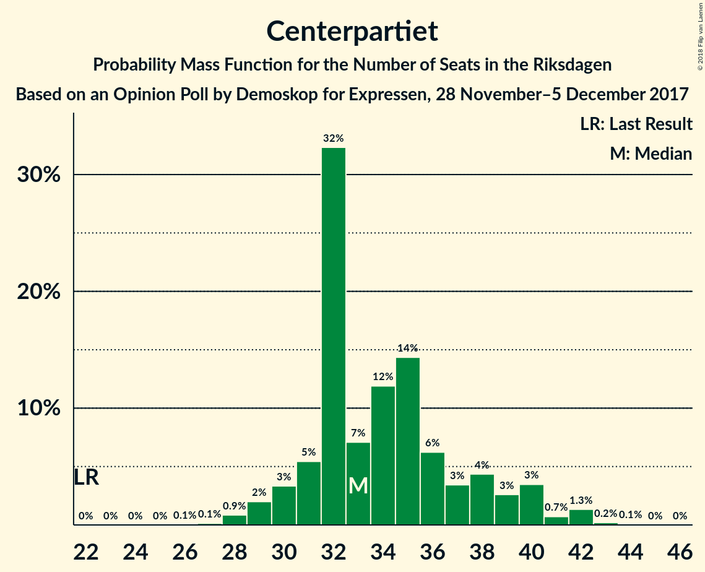
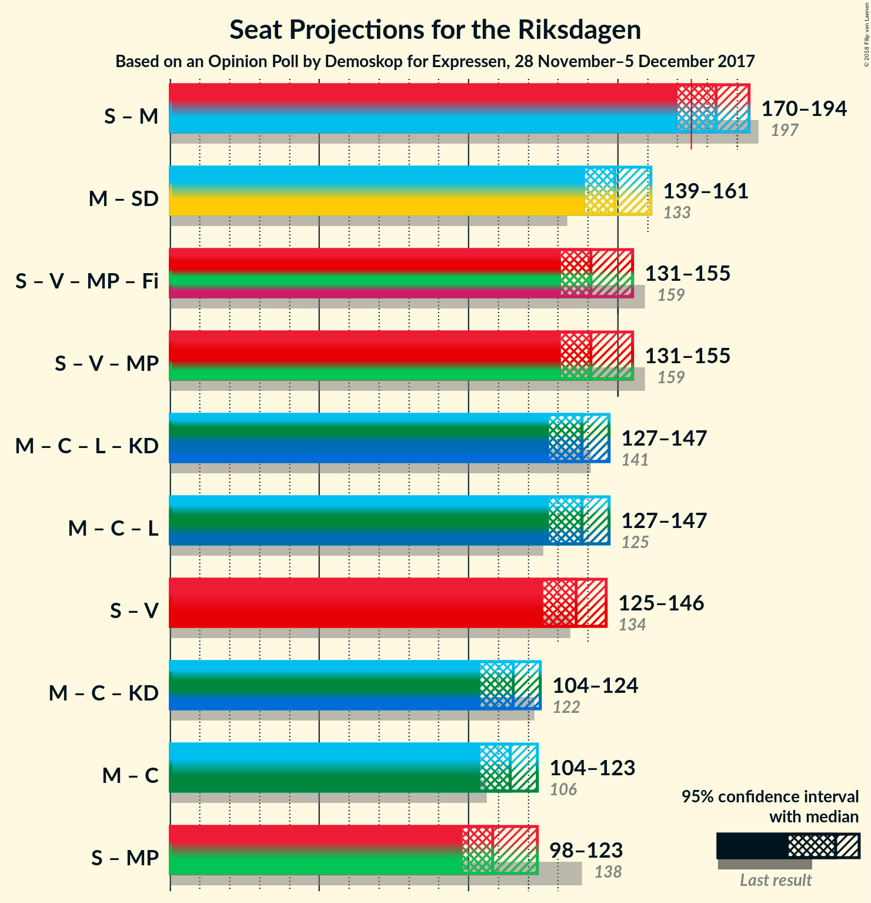

# Opinion Poll by Demoskop for Expressen, 28 November–5 December 2017

<a href="#voting-intentions">Voting Intentions</a> | <a href="#seats">Seats</a> | <a href="#coalitions">Coalitions</a> | <a href="#technical-information">Technical Information</a>

## Voting Intentions

### Confidence Intervals

| Party | Last Result | Poll Result | 80% Confidence Interval | 90% Confidence Interval | 95% Confidence Interval | 99% Confidence Interval |
|:-----:|:-----------:|:-----------:|:-----------------------:|:-----------------------:|:-----------------------:|:-----------------------:|
| Sveriges socialdemokratiska arbetareparti | 31.0% | 27.1% | 25.7–28.6% |25.3–29.0% |25.0–29.4% |24.3–30.1% |
| Moderata samlingspartiet | 23.3% | 20.9% | 19.6–22.3% |19.3–22.6% |19.0–23.0% |18.4–23.6% |
| Sverigedemokraterna | 12.9% | 18.3% | 17.1–19.6% |16.8–19.9% |16.5–20.3% |15.9–20.9% |
| Centerpartiet | 6.1% | 9.1% | 8.2–10.1% |8.0–10.3% |7.8–10.6% |7.4–11.1% |
| Vänsterpartiet | 5.7% | 8.5% | 7.7–9.5% |7.5–9.8% |7.2–10.0% |6.9–10.5% |
| Liberalerna | 5.4% | 5.8% | 5.1–6.6% |4.9–6.8% |4.7–7.0% |4.4–7.5% |
| Miljöpartiet de gröna | 6.9% | 3.9% | 3.4–4.6% |3.2–4.8% |3.1–5.0% |2.8–5.3% |
| Kristdemokraterna | 4.6% | 3.0% | 2.5–3.6% |2.4–3.8% |2.3–3.9% |2.0–4.3% |
| Feministiskt initiativ | 3.1% | 2.2% | 1.8–2.7% |1.7–2.9% |1.6–3.0% |1.4–3.3% |

*Note:* The poll result column reflects the actual value used in the calculations. Published results may vary slightly, and in addition be rounded to fewer digits.

## Seats

### Confidence Intervals

| Party | Last Result | Median | 80% Confidence Interval | 90% Confidence Interval | 95% Confidence Interval | 99% Confidence Interval |
|:-----:|:-----------:|:------:|:-----------------------:|:-----------------------:|:-----------------------:|:-----------------------:|
| <a href="#sveriges-socialdemokratiska-arbetareparti">Sveriges socialdemokratiska arbetareparti</a> | 113 | 100 | 91–102 |91–102 |91–106 |91–114 |
| <a href="#moderata-samlingspartiet">Moderata samlingspartiet</a> | 84 | 75 | 71–78 |71–78 |70–78 |69–90 |
| <a href="#sverigedemokraterna">Sverigedemokraterna</a> | 49 | 68 | 63–71 |63–71 |60–71 |59–77 |
| <a href="#centerpartiet">Centerpartiet</a> | 22 | 37 | 36–38 |36–38 |36–38 |32–39 |
| <a href="#vänsterpartiet">Vänsterpartiet</a> | 21 | 37 | 31–38 |31–38 |31–38 |29–41 |
| <a href="#liberalerna">Liberalerna</a> | 19 | 21 | 20–21 |20–21 |17–24 |17–27 |
| <a href="#miljöpartiet-de-gröna">Miljöpartiet de gröna</a> | 25 | 16 | 15–17 |15–17 |0–17 |0–17 |
| <a href="#kristdemokraterna">Kristdemokraterna</a> | 16 | 0 | 0 |0 |0–17 |0–17 |
| <a href="#feministiskt-initiativ">Feministiskt initiativ</a> | 0 | 0 | 0 |0 |0 |0 |

### Sveriges socialdemokratiska arbetareparti

*For a full overview of the results for this party, see the [Sveriges socialdemokratiska arbetareparti](party-sverigessocialdemokratiskaarbetareparti.html) page.*

| Number of Seats | Probability | Accumulated | Special Marks |
|:---------------:|:-----------:|:-----------:|:-------------:|
| 89 | 0.4% | 100% |  |
| 90 | 0% | 99.6% |  |
| 91 | 33% | 99.6% |  |
| 92 | 0% | 67% |  |
| 93 | 0.1% | 67% |  |
| 94 | 0% | 67% |  |
| 95 | 0% | 67% |  |
| 96 | 0.1% | 67% |  |
| 97 | 0% | 67% |  |
| 98 | 0% | 67% |  |
| 99 | 3% | 67% |  |
| 100 | 44% | 64% | Median |
| 101 | 0% | 20% |  |
| 102 | 17% | 20% |  |
| 103 | 0% | 3% |  |
| 104 | 0.3% | 3% |  |
| 105 | 0% | 3% |  |
| 106 | 0.7% | 3% |  |
| 107 | 0% | 2% |  |
| 108 | 0.4% | 2% |  |
| 109 | 0% | 2% |  |
| 110 | 0% | 2% |  |
| 111 | 0% | 2% |  |
| 112 | 0% | 2% |  |
| 113 | 0% | 2% | Last Result |
| 114 | 1.4% | 2% |  |
| 115 | 0% | 0.1% |  |
| 116 | 0% | 0.1% |  |
| 117 | 0% | 0.1% |  |
| 118 | 0.1% | 0.1% |  |
| 119 | 0% | 0% |  |

### Moderata samlingspartiet

*For a full overview of the results for this party, see the [Moderata samlingspartiet](party-moderatasamlingspartiet.html) page.*

| Number of Seats | Probability | Accumulated | Special Marks |
|:---------------:|:-----------:|:-----------:|:-------------:|
| 68 | 0.1% | 100% |  |
| 69 | 1.4% | 99.9% |  |
| 70 | 3% | 98% |  |
| 71 | 17% | 96% |  |
| 72 | 0.7% | 79% |  |
| 73 | 0% | 78% |  |
| 74 | 0% | 78% |  |
| 75 | 33% | 78% | Median |
| 76 | 0.1% | 45% |  |
| 77 | 0.1% | 45% |  |
| 78 | 44% | 45% |  |
| 79 | 0% | 1.2% |  |
| 80 | 0% | 1.2% |  |
| 81 | 0% | 1.2% |  |
| 82 | 0% | 1.2% |  |
| 83 | 0% | 1.2% |  |
| 84 | 0.3% | 1.2% | Last Result |
| 85 | 0% | 0.9% |  |
| 86 | 0% | 0.9% |  |
| 87 | 0% | 0.9% |  |
| 88 | 0% | 0.9% |  |
| 89 | 0% | 0.9% |  |
| 90 | 0.4% | 0.9% |  |
| 91 | 0% | 0.4% |  |
| 92 | 0.4% | 0.4% |  |
| 93 | 0% | 0% |  |

### Sverigedemokraterna

*For a full overview of the results for this party, see the [Sverigedemokraterna](party-sverigedemokraterna.html) page.*

| Number of Seats | Probability | Accumulated | Special Marks |
|:---------------:|:-----------:|:-----------:|:-------------:|
| 49 | 0% | 100% | Last Result |
| 50 | 0% | 100% |  |
| 51 | 0% | 100% |  |
| 52 | 0% | 100% |  |
| 53 | 0% | 100% |  |
| 54 | 0% | 100% |  |
| 55 | 0% | 100% |  |
| 56 | 0% | 100% |  |
| 57 | 0% | 100% |  |
| 58 | 0.4% | 100% |  |
| 59 | 0.1% | 99.6% |  |
| 60 | 3% | 99.4% |  |
| 61 | 0% | 97% |  |
| 62 | 0% | 97% |  |
| 63 | 17% | 97% |  |
| 64 | 0% | 80% |  |
| 65 | 0% | 80% |  |
| 66 | 0% | 80% |  |
| 67 | 0% | 80% |  |
| 68 | 44% | 80% | Median |
| 69 | 0% | 35% |  |
| 70 | 0% | 35% |  |
| 71 | 34% | 35% |  |
| 72 | 0% | 0.7% |  |
| 73 | 0% | 0.7% |  |
| 74 | 0% | 0.7% |  |
| 75 | 0% | 0.7% |  |
| 76 | 0% | 0.7% |  |
| 77 | 0.7% | 0.7% |  |
| 78 | 0% | 0% |  |

### Centerpartiet

*For a full overview of the results for this party, see the [Centerpartiet](party-centerpartiet.html) page.*

| Number of Seats | Probability | Accumulated | Special Marks |
|:---------------:|:-----------:|:-----------:|:-------------:|
| 22 | 0% | 100% | Last Result |
| 23 | 0% | 100% |  |
| 24 | 0% | 100% |  |
| 25 | 0% | 100% |  |
| 26 | 0.4% | 100% |  |
| 27 | 0% | 99.6% |  |
| 28 | 0% | 99.5% |  |
| 29 | 0% | 99.5% |  |
| 30 | 0% | 99.5% |  |
| 31 | 0% | 99.5% |  |
| 32 | 0.3% | 99.5% |  |
| 33 | 0% | 99.2% |  |
| 34 | 0.6% | 99.2% |  |
| 35 | 0.7% | 98.7% |  |
| 36 | 44% | 98% |  |
| 37 | 17% | 54% | Median |
| 38 | 35% | 37% |  |
| 39 | 2% | 2% |  |
| 40 | 0% | 0.3% |  |
| 41 | 0.1% | 0.3% |  |
| 42 | 0% | 0.2% |  |
| 43 | 0% | 0.2% |  |
| 44 | 0% | 0.1% |  |
| 45 | 0.1% | 0.1% |  |
| 46 | 0% | 0% |  |

### Vänsterpartiet

*For a full overview of the results for this party, see the [Vänsterpartiet](party-vänsterpartiet.html) page.*

| Number of Seats | Probability | Accumulated | Special Marks |
|:---------------:|:-----------:|:-----------:|:-------------:|
| 21 | 0% | 100% | Last Result |
| 22 | 0% | 100% |  |
| 23 | 0% | 100% |  |
| 24 | 0% | 100% |  |
| 25 | 0% | 100% |  |
| 26 | 0% | 100% |  |
| 27 | 0% | 100% |  |
| 28 | 0% | 100% |  |
| 29 | 1.4% | 99.9% |  |
| 30 | 0.3% | 98% |  |
| 31 | 44% | 98% |  |
| 32 | 0% | 54% |  |
| 33 | 3% | 54% |  |
| 34 | 0.1% | 51% |  |
| 35 | 0.4% | 51% |  |
| 36 | 0% | 51% |  |
| 37 | 33% | 51% | Median |
| 38 | 17% | 18% |  |
| 39 | 0% | 0.9% |  |
| 40 | 0% | 0.9% |  |
| 41 | 0.7% | 0.9% |  |
| 42 | 0.2% | 0.2% |  |
| 43 | 0% | 0% |  |

### Liberalerna

*For a full overview of the results for this party, see the [Liberalerna](party-liberalerna.html) page.*

| Number of Seats | Probability | Accumulated | Special Marks |
|:---------------:|:-----------:|:-----------:|:-------------:|
| 17 | 3% | 100% |  |
| 18 | 0.7% | 97% |  |
| 19 | 0.1% | 97% | Last Result |
| 20 | 33% | 96% |  |
| 21 | 61% | 64% | Median |
| 22 | 0% | 3% |  |
| 23 | 0% | 3% |  |
| 24 | 0.4% | 3% |  |
| 25 | 0.5% | 2% |  |
| 26 | 0% | 2% |  |
| 27 | 2% | 2% |  |
| 28 | 0.3% | 0.3% |  |
| 29 | 0% | 0% |  |

### Miljöpartiet de gröna

*For a full overview of the results for this party, see the [Miljöpartiet de gröna](party-miljöpartietdegröna.html) page.*

| Number of Seats | Probability | Accumulated | Special Marks |
|:---------------:|:-----------:|:-----------:|:-------------:|
| 0 | 3% | 100% |  |
| 1 | 0% | 97% |  |
| 2 | 0% | 97% |  |
| 3 | 0% | 97% |  |
| 4 | 0% | 97% |  |
| 5 | 0% | 97% |  |
| 6 | 0% | 97% |  |
| 7 | 0% | 97% |  |
| 8 | 0% | 97% |  |
| 9 | 0% | 97% |  |
| 10 | 0% | 97% |  |
| 11 | 0% | 97% |  |
| 12 | 0% | 97% |  |
| 13 | 0% | 97% |  |
| 14 | 0% | 97% |  |
| 15 | 46% | 97% |  |
| 16 | 0.4% | 50% | Median |
| 17 | 50% | 50% |  |
| 18 | 0% | 0.2% |  |
| 19 | 0% | 0.2% |  |
| 20 | 0.1% | 0.2% |  |
| 21 | 0% | 0% |  |
| 22 | 0% | 0% |  |
| 23 | 0% | 0% |  |
| 24 | 0% | 0% |  |
| 25 | 0% | 0% | Last Result |

### Kristdemokraterna

*For a full overview of the results for this party, see the [Kristdemokraterna](party-kristdemokraterna.html) page.*

| Number of Seats | Probability | Accumulated | Special Marks |
|:---------------:|:-----------:|:-----------:|:-------------:|
| 0 | 97% | 100% | Median |
| 1 | 0% | 3% |  |
| 2 | 0% | 3% |  |
| 3 | 0% | 3% |  |
| 4 | 0% | 3% |  |
| 5 | 0% | 3% |  |
| 6 | 0% | 3% |  |
| 7 | 0% | 3% |  |
| 8 | 0% | 3% |  |
| 9 | 0% | 3% |  |
| 10 | 0% | 3% |  |
| 11 | 0% | 3% |  |
| 12 | 0% | 3% |  |
| 13 | 0% | 3% |  |
| 14 | 0% | 3% |  |
| 15 | 0% | 3% |  |
| 16 | 0% | 3% | Last Result |
| 17 | 3% | 3% |  |
| 18 | 0% | 0.1% |  |
| 19 | 0.1% | 0.1% |  |
| 20 | 0% | 0% |  |

### Feministiskt initiativ

*For a full overview of the results for this party, see the [Feministiskt initiativ](party-feministisktinitiativ.html) page.*

| Number of Seats | Probability | Accumulated | Special Marks |
|:---------------:|:-----------:|:-----------:|:-------------:|
| 0 | 100% | 100% | Last Result, Median |

## Coalitions

### Confidence Intervals

| Coalition | Last Result | Median | Majority? | 80% Confidence Interval | 90% Confidence Interval | 95% Confidence Interval | 99% Confidence Interval |
|:---------:|:-----------:|:------:|:---------:|:-----------------------:|:-----------------------:|:-----------------------:|:-----------------------:|
| Sveriges socialdemokratiska arbetareparti – Moderata samlingspartiet | 197 | 173 | 47% | 166–178 | 166–178 | 166–179 | 166–188 |
| Sveriges socialdemokratiska arbetareparti – Vänsterpartiet – Miljöpartiet de gröna – Feministiskt initiativ | 159 | 146 | 0% | 145–157 | 145–157 | 143–157 | 138–157 |
| Sveriges socialdemokratiska arbetareparti – Vänsterpartiet – Miljöpartiet de gröna | 159 | 146 | 0% | 145–157 | 145–157 | 143–157 | 138–157 |
| Moderata samlingspartiet – Sverigedemokraterna | 133 | 146 | 0% | 134–146 | 134–146 | 130–146 | 130–155 |
| Moderata samlingspartiet – Centerpartiet – Liberalerna – Kristdemokraterna | 141 | 133 | 0% | 129–135 | 129–135 | 129–142 | 125–150 |
| Sveriges socialdemokratiska arbetareparti – Vänsterpartiet | 134 | 131 | 0% | 128–140 | 128–140 | 128–141 | 125–147 |
| Moderata samlingspartiet – Centerpartiet – Liberalerna | 125 | 133 | 0% | 129–135 | 129–135 | 125–135 | 125–144 |
| Moderata samlingspartiet – Centerpartiet – Kristdemokraterna | 122 | 113 | 0% | 108–114 | 108–114 | 108–125 | 107–126 |
| Sveriges socialdemokratiska arbetareparti – Miljöpartiet de gröna | 138 | 115 | 0% | 108–119 | 108–119 | 108–119 | 105–119 |
| Moderata samlingspartiet – Centerpartiet | 106 | 113 | 0% | 108–114 | 108–114 | 108–114 | 107–123 |

### Sveriges socialdemokratiska arbetareparti – Moderata samlingspartiet

| Number of Seats | Probability | Accumulated | Special Marks |
|:---------------:|:-----------:|:-----------:|:-------------:|
| 166 | 33% | 100% |  |
| 167 | 0.1% | 67% |  |
| 168 | 0% | 67% |  |
| 169 | 3% | 67% |  |
| 170 | 0% | 65% |  |
| 171 | 0.2% | 65% |  |
| 172 | 0% | 64% |  |
| 173 | 17% | 64% |  |
| 174 | 0% | 47% |  |
| 175 | 0% | 47% | Median, Majority |
| 176 | 0% | 47% |  |
| 177 | 0% | 47% |  |
| 178 | 44% | 47% |  |
| 179 | 0.4% | 3% |  |
| 180 | 0% | 2% |  |
| 181 | 0% | 2% |  |
| 182 | 0% | 2% |  |
| 183 | 1.4% | 2% |  |
| 184 | 0% | 0.9% |  |
| 185 | 0% | 0.9% |  |
| 186 | 0.1% | 0.9% |  |
| 187 | 0% | 0.8% |  |
| 188 | 0.3% | 0.7% |  |
| 189 | 0% | 0.5% |  |
| 190 | 0% | 0.5% |  |
| 191 | 0% | 0.5% |  |
| 192 | 0% | 0.5% |  |
| 193 | 0% | 0.5% |  |
| 194 | 0% | 0.5% |  |
| 195 | 0% | 0.5% |  |
| 196 | 0% | 0.5% |  |
| 197 | 0% | 0.5% | Last Result |
| 198 | 0% | 0.5% |  |
| 199 | 0% | 0.4% |  |
| 200 | 0.4% | 0.4% |  |
| 201 | 0% | 0% |  |

### Sveriges socialdemokratiska arbetareparti – Vänsterpartiet – Miljöpartiet de gröna – Feministiskt initiativ

| Number of Seats | Probability | Accumulated | Special Marks |
|:---------------:|:-----------:|:-----------:|:-------------:|
| 125 | 0.1% | 100% |  |
| 126 | 0% | 99.9% |  |
| 127 | 0% | 99.9% |  |
| 128 | 0% | 99.9% |  |
| 129 | 0% | 99.9% |  |
| 130 | 0% | 99.9% |  |
| 131 | 0% | 99.9% |  |
| 132 | 0% | 99.9% |  |
| 133 | 0% | 99.9% |  |
| 134 | 0.3% | 99.9% |  |
| 135 | 0% | 99.6% |  |
| 136 | 0% | 99.6% |  |
| 137 | 0% | 99.6% |  |
| 138 | 0.1% | 99.6% |  |
| 139 | 0% | 99.5% |  |
| 140 | 0.5% | 99.5% |  |
| 141 | 0.5% | 99.0% |  |
| 142 | 0% | 98.5% |  |
| 143 | 1.4% | 98.5% |  |
| 144 | 0% | 97% |  |
| 145 | 33% | 97% |  |
| 146 | 44% | 64% |  |
| 147 | 3% | 21% |  |
| 148 | 0% | 17% |  |
| 149 | 0% | 17% |  |
| 150 | 0% | 17% |  |
| 151 | 0% | 17% |  |
| 152 | 0% | 17% |  |
| 153 | 0% | 17% | Median |
| 154 | 0% | 17% |  |
| 155 | 0% | 17% |  |
| 156 | 0% | 17% |  |
| 157 | 17% | 17% |  |
| 158 | 0% | 0.1% |  |
| 159 | 0% | 0.1% | Last Result |
| 160 | 0.1% | 0.1% |  |
| 161 | 0% | 0% |  |

### Sveriges socialdemokratiska arbetareparti – Vänsterpartiet – Miljöpartiet de gröna

| Number of Seats | Probability | Accumulated | Special Marks |
|:---------------:|:-----------:|:-----------:|:-------------:|
| 125 | 0.1% | 100% |  |
| 126 | 0% | 99.9% |  |
| 127 | 0% | 99.9% |  |
| 128 | 0% | 99.9% |  |
| 129 | 0% | 99.9% |  |
| 130 | 0% | 99.9% |  |
| 131 | 0% | 99.9% |  |
| 132 | 0% | 99.9% |  |
| 133 | 0% | 99.9% |  |
| 134 | 0.3% | 99.9% |  |
| 135 | 0% | 99.6% |  |
| 136 | 0% | 99.6% |  |
| 137 | 0% | 99.6% |  |
| 138 | 0.1% | 99.6% |  |
| 139 | 0% | 99.5% |  |
| 140 | 0.5% | 99.5% |  |
| 141 | 0.5% | 99.0% |  |
| 142 | 0% | 98.5% |  |
| 143 | 1.4% | 98.5% |  |
| 144 | 0% | 97% |  |
| 145 | 33% | 97% |  |
| 146 | 44% | 64% |  |
| 147 | 3% | 21% |  |
| 148 | 0% | 17% |  |
| 149 | 0% | 17% |  |
| 150 | 0% | 17% |  |
| 151 | 0% | 17% |  |
| 152 | 0% | 17% |  |
| 153 | 0% | 17% | Median |
| 154 | 0% | 17% |  |
| 155 | 0% | 17% |  |
| 156 | 0% | 17% |  |
| 157 | 17% | 17% |  |
| 158 | 0% | 0.1% |  |
| 159 | 0% | 0.1% | Last Result |
| 160 | 0.1% | 0.1% |  |
| 161 | 0% | 0% |  |

### Moderata samlingspartiet – Sverigedemokraterna

| Number of Seats | Probability | Accumulated | Special Marks |
|:---------------:|:-----------:|:-----------:|:-------------:|
| 130 | 3% | 100% |  |
| 131 | 0% | 97% |  |
| 132 | 0% | 97% |  |
| 133 | 0% | 97% | Last Result |
| 134 | 17% | 97% |  |
| 135 | 0% | 80% |  |
| 136 | 0.1% | 80% |  |
| 137 | 0.1% | 80% |  |
| 138 | 0% | 80% |  |
| 139 | 0% | 80% |  |
| 140 | 1.4% | 80% |  |
| 141 | 0% | 79% |  |
| 142 | 0% | 79% |  |
| 143 | 0% | 79% | Median |
| 144 | 0% | 79% |  |
| 145 | 0.1% | 79% |  |
| 146 | 76% | 78% |  |
| 147 | 0.1% | 2% |  |
| 148 | 0% | 2% |  |
| 149 | 0.7% | 2% |  |
| 150 | 0.4% | 1.2% |  |
| 151 | 0% | 0.8% |  |
| 152 | 0% | 0.7% |  |
| 153 | 0% | 0.7% |  |
| 154 | 0% | 0.7% |  |
| 155 | 0.3% | 0.7% |  |
| 156 | 0% | 0.4% |  |
| 157 | 0% | 0.4% |  |
| 158 | 0.4% | 0.4% |  |
| 159 | 0% | 0% |  |

### Moderata samlingspartiet – Centerpartiet – Liberalerna – Kristdemokraterna

| Number of Seats | Probability | Accumulated | Special Marks |
|:---------------:|:-----------:|:-----------:|:-------------:|
| 121 | 0.1% | 100% |  |
| 122 | 0% | 99.9% |  |
| 123 | 0% | 99.9% |  |
| 124 | 0% | 99.9% |  |
| 125 | 0.7% | 99.9% |  |
| 126 | 0% | 99.2% |  |
| 127 | 0% | 99.2% |  |
| 128 | 0% | 99.2% |  |
| 129 | 17% | 99.2% |  |
| 130 | 0% | 82% |  |
| 131 | 0% | 82% |  |
| 132 | 0% | 82% |  |
| 133 | 33% | 82% | Median |
| 134 | 0% | 49% |  |
| 135 | 45% | 49% |  |
| 136 | 0% | 4% |  |
| 137 | 0% | 4% |  |
| 138 | 0% | 4% |  |
| 139 | 0% | 4% |  |
| 140 | 0% | 4% |  |
| 141 | 0.4% | 4% | Last Result |
| 142 | 3% | 4% |  |
| 143 | 0.1% | 1.1% |  |
| 144 | 0.4% | 1.0% |  |
| 145 | 0% | 0.6% |  |
| 146 | 0% | 0.6% |  |
| 147 | 0% | 0.6% |  |
| 148 | 0% | 0.6% |  |
| 149 | 0% | 0.6% |  |
| 150 | 0.4% | 0.5% |  |
| 151 | 0% | 0.1% |  |
| 152 | 0% | 0.1% |  |
| 153 | 0.1% | 0.1% |  |
| 154 | 0% | 0% |  |

### Sveriges socialdemokratiska arbetareparti – Vänsterpartiet

| Number of Seats | Probability | Accumulated | Special Marks |
|:---------------:|:-----------:|:-----------:|:-------------:|
| 124 | 0.4% | 100% |  |
| 125 | 0.1% | 99.5% |  |
| 126 | 0.1% | 99.4% |  |
| 127 | 0% | 99.3% |  |
| 128 | 33% | 99.3% |  |
| 129 | 0% | 67% |  |
| 130 | 0% | 67% |  |
| 131 | 44% | 67% |  |
| 132 | 3% | 23% |  |
| 133 | 0% | 20% |  |
| 134 | 0.3% | 20% | Last Result |
| 135 | 0% | 20% |  |
| 136 | 0% | 20% |  |
| 137 | 0% | 20% | Median |
| 138 | 0.1% | 20% |  |
| 139 | 0% | 20% |  |
| 140 | 17% | 20% |  |
| 141 | 0.5% | 3% |  |
| 142 | 0% | 2% |  |
| 143 | 1.4% | 2% |  |
| 144 | 0% | 0.8% |  |
| 145 | 0% | 0.8% |  |
| 146 | 0% | 0.8% |  |
| 147 | 0.7% | 0.8% |  |
| 148 | 0% | 0.1% |  |
| 149 | 0% | 0.1% |  |
| 150 | 0% | 0.1% |  |
| 151 | 0% | 0.1% |  |
| 152 | 0% | 0.1% |  |
| 153 | 0% | 0.1% |  |
| 154 | 0% | 0.1% |  |
| 155 | 0% | 0.1% |  |
| 156 | 0% | 0.1% |  |
| 157 | 0% | 0.1% |  |
| 158 | 0% | 0.1% |  |
| 159 | 0% | 0.1% |  |
| 160 | 0.1% | 0.1% |  |
| 161 | 0% | 0% |  |

### Moderata samlingspartiet – Centerpartiet – Liberalerna

| Number of Seats | Probability | Accumulated | Special Marks |
|:---------------:|:-----------:|:-----------:|:-------------:|
| 121 | 0.1% | 100% |  |
| 122 | 0% | 99.9% |  |
| 123 | 0% | 99.9% |  |
| 124 | 0% | 99.9% |  |
| 125 | 3% | 99.9% | Last Result |
| 126 | 0% | 97% |  |
| 127 | 0% | 97% |  |
| 128 | 0% | 97% |  |
| 129 | 17% | 97% |  |
| 130 | 0% | 79% |  |
| 131 | 0% | 79% |  |
| 132 | 0% | 79% |  |
| 133 | 33% | 79% | Median |
| 134 | 0.1% | 47% |  |
| 135 | 45% | 47% |  |
| 136 | 0% | 2% |  |
| 137 | 0% | 2% |  |
| 138 | 0% | 1.5% |  |
| 139 | 0% | 1.5% |  |
| 140 | 0% | 1.5% |  |
| 141 | 0.4% | 1.5% |  |
| 142 | 0% | 1.0% |  |
| 143 | 0.1% | 1.0% |  |
| 144 | 0.4% | 0.9% |  |
| 145 | 0% | 0.5% |  |
| 146 | 0% | 0.5% |  |
| 147 | 0% | 0.5% |  |
| 148 | 0% | 0.5% |  |
| 149 | 0% | 0.5% |  |
| 150 | 0.4% | 0.4% |  |
| 151 | 0% | 0% |  |

### Moderata samlingspartiet – Centerpartiet – Kristdemokraterna

| Number of Seats | Probability | Accumulated | Special Marks |
|:---------------:|:-----------:|:-----------:|:-------------:|
| 102 | 0.1% | 100% |  |
| 103 | 0% | 99.9% |  |
| 104 | 0% | 99.9% |  |
| 105 | 0% | 99.8% |  |
| 106 | 0% | 99.8% |  |
| 107 | 0.7% | 99.8% |  |
| 108 | 18% | 99.2% |  |
| 109 | 0% | 81% |  |
| 110 | 0% | 81% |  |
| 111 | 0% | 81% |  |
| 112 | 0% | 81% | Median |
| 113 | 33% | 81% |  |
| 114 | 44% | 48% |  |
| 115 | 0% | 4% |  |
| 116 | 0.8% | 4% |  |
| 117 | 0% | 3% |  |
| 118 | 0% | 3% |  |
| 119 | 0% | 3% |  |
| 120 | 0% | 3% |  |
| 121 | 0% | 3% |  |
| 122 | 0% | 3% | Last Result |
| 123 | 0.1% | 3% |  |
| 124 | 0% | 3% |  |
| 125 | 3% | 3% |  |
| 126 | 0.4% | 0.5% |  |
| 127 | 0% | 0.1% |  |
| 128 | 0% | 0.1% |  |
| 129 | 0% | 0.1% |  |
| 130 | 0% | 0.1% |  |
| 131 | 0% | 0.1% |  |
| 132 | 0% | 0.1% |  |
| 133 | 0% | 0.1% |  |
| 134 | 0% | 0.1% |  |
| 135 | 0% | 0.1% |  |
| 136 | 0.1% | 0.1% |  |
| 137 | 0% | 0% |  |

### Sveriges socialdemokratiska arbetareparti – Miljöpartiet de gröna

| Number of Seats | Probability | Accumulated | Special Marks |
|:---------------:|:-----------:|:-----------:|:-------------:|
| 91 | 0.1% | 100% |  |
| 92 | 0% | 99.9% |  |
| 93 | 0% | 99.9% |  |
| 94 | 0% | 99.9% |  |
| 95 | 0% | 99.9% |  |
| 96 | 0.1% | 99.9% |  |
| 97 | 0% | 99.8% |  |
| 98 | 0% | 99.8% |  |
| 99 | 0% | 99.8% |  |
| 100 | 0% | 99.8% |  |
| 101 | 0% | 99.8% |  |
| 102 | 0% | 99.8% |  |
| 103 | 0% | 99.8% |  |
| 104 | 0.3% | 99.8% |  |
| 105 | 0.4% | 99.5% |  |
| 106 | 0.7% | 99.1% |  |
| 107 | 0% | 98% |  |
| 108 | 33% | 98% |  |
| 109 | 0% | 65% |  |
| 110 | 0% | 65% |  |
| 111 | 0% | 65% |  |
| 112 | 0% | 65% |  |
| 113 | 0.1% | 65% |  |
| 114 | 4% | 65% |  |
| 115 | 44% | 61% |  |
| 116 | 0% | 17% | Median |
| 117 | 0% | 17% |  |
| 118 | 0.1% | 17% |  |
| 119 | 17% | 17% |  |
| 120 | 0% | 0.1% |  |
| 121 | 0% | 0% |  |
| 122 | 0% | 0% |  |
| 123 | 0% | 0% |  |
| 124 | 0% | 0% |  |
| 125 | 0% | 0% |  |
| 126 | 0% | 0% |  |
| 127 | 0% | 0% |  |
| 128 | 0% | 0% |  |
| 129 | 0% | 0% |  |
| 130 | 0% | 0% |  |
| 131 | 0% | 0% |  |
| 132 | 0% | 0% |  |
| 133 | 0% | 0% |  |
| 134 | 0% | 0% |  |
| 135 | 0% | 0% |  |
| 136 | 0% | 0% |  |
| 137 | 0% | 0% |  |
| 138 | 0% | 0% | Last Result |

### Moderata samlingspartiet – Centerpartiet

| Number of Seats | Probability | Accumulated | Special Marks |
|:---------------:|:-----------:|:-----------:|:-------------:|
| 102 | 0.1% | 100% |  |
| 103 | 0% | 99.9% |  |
| 104 | 0% | 99.9% |  |
| 105 | 0% | 99.8% |  |
| 106 | 0% | 99.8% | Last Result |
| 107 | 0.7% | 99.8% |  |
| 108 | 21% | 99.1% |  |
| 109 | 0% | 78% |  |
| 110 | 0% | 78% |  |
| 111 | 0% | 78% |  |
| 112 | 0% | 78% | Median |
| 113 | 33% | 78% |  |
| 114 | 44% | 45% |  |
| 115 | 0% | 2% |  |
| 116 | 0.8% | 2% |  |
| 117 | 0.1% | 0.7% |  |
| 118 | 0% | 0.7% |  |
| 119 | 0% | 0.6% |  |
| 120 | 0% | 0.6% |  |
| 121 | 0% | 0.6% |  |
| 122 | 0% | 0.6% |  |
| 123 | 0.1% | 0.6% |  |
| 124 | 0% | 0.5% |  |
| 125 | 0% | 0.5% |  |
| 126 | 0.4% | 0.5% |  |
| 127 | 0% | 0% |  |

## Technical Information

### Opinion Poll

+ **Polling firm:** Demoskop
+ **Commissioner(s):** Expressen
+ **Fieldwork period:** 28 November–5 December 2017

### Calculations

+ **Sample size:** 1608
+ **Simulations done:** 1,024
+ **Error estimate:** 2.44%

