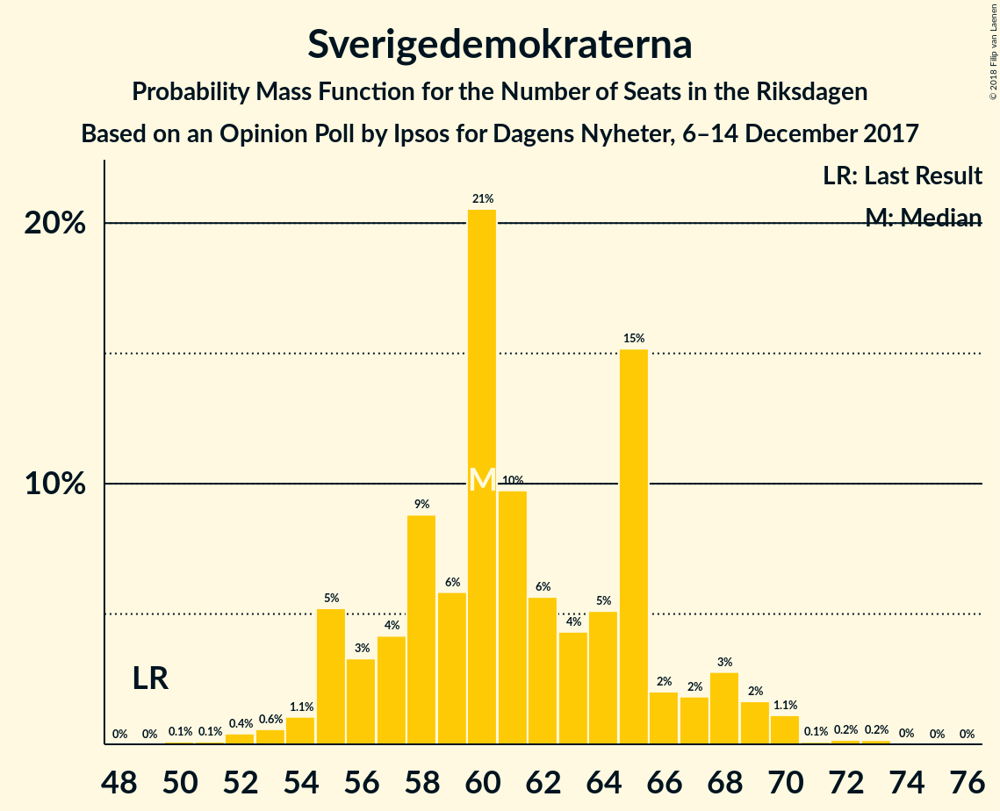

# Opinion Poll by Ipsos for Dagens Nyheter, 6–14 December 2017

<a href="#voting-intentions">Voting Intentions</a> | <a href="#seats">Seats</a> | <a href="#coalitions">Coalitions</a> | <a href="#technical-information">Technical Information</a>

## Voting Intentions

### Confidence Intervals

| Party | Last Result | Poll Result | 80% Confidence Interval | 90% Confidence Interval | 95% Confidence Interval | 99% Confidence Interval |
|:-----:|:-----------:|:-----------:|:-----------------------:|:-----------------------:|:-----------------------:|:-----------------------:|
| Sveriges socialdemokratiska arbetareparti | 31.0% | 28.0% | 26.6–29.4% |26.2–29.8% |25.9–30.1% |25.3–30.8% |
| Moderata samlingspartiet | 23.3% | 23.0% | 21.8–24.4% |21.4–24.7% |21.1–25.1% |20.5–25.7% |
| Sverigedemokraterna | 12.9% | 16.0% | 14.9–17.2% |14.6–17.5% |14.3–17.8% |13.8–18.4% |
| Centerpartiet | 6.1% | 10.0% | 9.1–11.0% |8.9–11.2% |8.7–11.5% |8.2–12.0% |
| Vänsterpartiet | 5.7% | 7.0% | 6.2–7.8% |6.1–8.1% |5.9–8.3% |5.5–8.7% |
| Liberalerna | 5.4% | 5.0% | 4.4–5.8% |4.2–6.0% |4.1–6.2% |3.8–6.5% |
| Miljöpartiet de gröna | 6.9% | 4.0% | 3.4–4.7% |3.3–4.8% |3.2–5.0% |2.9–5.3% |
| Kristdemokraterna | 4.6% | 3.0% | 2.5–3.6% |2.4–3.8% |2.3–3.9% |2.1–4.2% |
| Feministiskt initiativ | 3.1% | 2.0% | 1.6–2.5% |1.5–2.7% |1.4–2.8% |1.3–3.1% |

*Note:* The poll result column reflects the actual value used in the calculations. Published results may vary slightly, and in addition be rounded to fewer digits.

## Seats

### Confidence Intervals

| Party | Last Result | Median | 80% Confidence Interval | 90% Confidence Interval | 95% Confidence Interval | 99% Confidence Interval |
|:-----:|:-----------:|:------:|:-----------------------:|:-----------------------:|:-----------------------:|:-----------------------:|
| <a href="#sveriges-socialdemokratiska-arbetareparti">Sveriges socialdemokratiska arbetareparti</a> | 113 | 106 | 106–112 |106–112 |105–112 |92–115 |
| <a href="#moderata-samlingspartiet">Moderata samlingspartiet</a> | 84 | 84 | 84–90 |80–90 |79–90 |74–90 |
| <a href="#sverigedemokraterna">Sverigedemokraterna</a> | 49 | 54 | 54–61 |54–61 |54–61 |50–75 |
| <a href="#centerpartiet">Centerpartiet</a> | 22 | 47 | 39–47 |39–47 |39–47 |38–47 |
| <a href="#vänsterpartiet">Vänsterpartiet</a> | 21 | 26 | 26–28 |25–28 |25–28 |25–31 |
| <a href="#liberalerna">Liberalerna</a> | 19 | 16 | 16–19 |16–19 |16–19 |16–26 |
| <a href="#miljöpartiet-de-gröna">Miljöpartiet de gröna</a> | 25 | 16 | 0–16 |0–17 |0–20 |0–20 |
| <a href="#kristdemokraterna">Kristdemokraterna</a> | 16 | 0 | 0 |0 |0 |0–15 |
| <a href="#feministiskt-initiativ">Feministiskt initiativ</a> | 0 | 0 | 0 |0 |0 |0 |

### Sveriges socialdemokratiska arbetareparti

*For a full overview of the results for this party, see the [Sveriges socialdemokratiska arbetareparti](party-sverigessocialdemokratiskaarbetareparti.html) page.*

| Number of Seats | Probability | Accumulated | Special Marks |
|:---------------:|:-----------:|:-----------:|:-------------:|
| 92 | 0.7% | 100% |  |
| 93 | 0% | 99.3% |  |
| 94 | 0% | 99.3% |  |
| 95 | 0% | 99.3% |  |
| 96 | 0% | 99.3% |  |
| 97 | 0% | 99.3% |  |
| 98 | 0% | 99.3% |  |
| 99 | 0% | 99.3% |  |
| 100 | 2% | 99.3% |  |
| 101 | 0.1% | 98% |  |
| 102 | 0% | 98% |  |
| 103 | 0% | 98% |  |
| 104 | 0% | 98% |  |
| 105 | 0.8% | 98% |  |
| 106 | 56% | 97% | Median |
| 107 | 0.8% | 41% |  |
| 108 | 0% | 40% |  |
| 109 | 0% | 40% |  |
| 110 | 6% | 40% |  |
| 111 | 0% | 34% |  |
| 112 | 33% | 34% |  |
| 113 | 0.1% | 0.7% | Last Result |
| 114 | 0% | 0.5% |  |
| 115 | 0.1% | 0.5% |  |
| 116 | 0% | 0.4% |  |
| 117 | 0% | 0.4% |  |
| 118 | 0% | 0.4% |  |
| 119 | 0% | 0.4% |  |
| 120 | 0.3% | 0.4% |  |
| 121 | 0.1% | 0.1% |  |
| 122 | 0% | 0% |  |

### Moderata samlingspartiet

*For a full overview of the results for this party, see the [Moderata samlingspartiet](party-moderatasamlingspartiet.html) page.*

| Number of Seats | Probability | Accumulated | Special Marks |
|:---------------:|:-----------:|:-----------:|:-------------:|
| 74 | 1.4% | 100% |  |
| 75 | 0.3% | 98.6% |  |
| 76 | 0.1% | 98% |  |
| 77 | 0% | 98% |  |
| 78 | 0% | 98% |  |
| 79 | 1.5% | 98% |  |
| 80 | 5% | 97% |  |
| 81 | 0.8% | 92% |  |
| 82 | 0.8% | 91% |  |
| 83 | 0% | 90% |  |
| 84 | 56% | 90% | Last Result, Median |
| 85 | 0.7% | 34% |  |
| 86 | 0% | 34% |  |
| 87 | 0% | 34% |  |
| 88 | 0.1% | 34% |  |
| 89 | 0% | 34% |  |
| 90 | 33% | 34% |  |
| 91 | 0.1% | 0.3% |  |
| 92 | 0% | 0.2% |  |
| 93 | 0% | 0.2% |  |
| 94 | 0% | 0.2% |  |
| 95 | 0% | 0.2% |  |
| 96 | 0% | 0.2% |  |
| 97 | 0% | 0.2% |  |
| 98 | 0% | 0.2% |  |
| 99 | 0.1% | 0.2% |  |
| 100 | 0% | 0% |  |

### Sverigedemokraterna

*For a full overview of the results for this party, see the [Sverigedemokraterna](party-sverigedemokraterna.html) page.*

| Number of Seats | Probability | Accumulated | Special Marks |
|:---------------:|:-----------:|:-----------:|:-------------:|
| 47 | 0.1% | 100% |  |
| 48 | 0% | 99.9% |  |
| 49 | 0% | 99.9% | Last Result |
| 50 | 0.8% | 99.9% |  |
| 51 | 0% | 99.1% |  |
| 52 | 0% | 99.1% |  |
| 53 | 0% | 99.1% |  |
| 54 | 56% | 99.1% | Median |
| 55 | 0.8% | 43% |  |
| 56 | 2% | 43% |  |
| 57 | 0% | 41% |  |
| 58 | 0% | 41% |  |
| 59 | 7% | 41% |  |
| 60 | 0% | 34% |  |
| 61 | 33% | 34% |  |
| 62 | 0% | 0.9% |  |
| 63 | 0% | 0.9% |  |
| 64 | 0.1% | 0.9% |  |
| 65 | 0% | 0.8% |  |
| 66 | 0% | 0.8% |  |
| 67 | 0% | 0.8% |  |
| 68 | 0% | 0.8% |  |
| 69 | 0% | 0.8% |  |
| 70 | 0% | 0.8% |  |
| 71 | 0% | 0.8% |  |
| 72 | 0% | 0.8% |  |
| 73 | 0% | 0.8% |  |
| 74 | 0% | 0.8% |  |
| 75 | 0.8% | 0.8% |  |
| 76 | 0% | 0% |  |

### Centerpartiet

*For a full overview of the results for this party, see the [Centerpartiet](party-centerpartiet.html) page.*

| Number of Seats | Probability | Accumulated | Special Marks |
|:---------------:|:-----------:|:-----------:|:-------------:|
| 22 | 0% | 100% | Last Result |
| 23 | 0% | 100% |  |
| 24 | 0% | 100% |  |
| 25 | 0% | 100% |  |
| 26 | 0% | 100% |  |
| 27 | 0% | 100% |  |
| 28 | 0% | 100% |  |
| 29 | 0% | 100% |  |
| 30 | 0% | 100% |  |
| 31 | 0% | 100% |  |
| 32 | 0% | 100% |  |
| 33 | 0% | 100% |  |
| 34 | 0% | 100% |  |
| 35 | 0% | 100% |  |
| 36 | 0% | 100% |  |
| 37 | 0% | 100% |  |
| 38 | 0.8% | 100% |  |
| 39 | 39% | 99.2% |  |
| 40 | 0.1% | 60% |  |
| 41 | 0% | 60% |  |
| 42 | 0.2% | 60% |  |
| 43 | 0% | 60% |  |
| 44 | 0.7% | 60% |  |
| 45 | 3% | 59% |  |
| 46 | 0% | 56% |  |
| 47 | 56% | 56% | Median |
| 48 | 0.2% | 0.2% |  |
| 49 | 0% | 0% |  |

### Vänsterpartiet

*For a full overview of the results for this party, see the [Vänsterpartiet](party-vänsterpartiet.html) page.*

| Number of Seats | Probability | Accumulated | Special Marks |
|:---------------:|:-----------:|:-----------:|:-------------:|
| 21 | 0% | 100% | Last Result |
| 22 | 0% | 100% |  |
| 23 | 0% | 100% |  |
| 24 | 0.3% | 100% |  |
| 25 | 6% | 99.6% |  |
| 26 | 57% | 93% | Median |
| 27 | 0.7% | 36% |  |
| 28 | 34% | 35% |  |
| 29 | 0% | 1.2% |  |
| 30 | 0.1% | 1.1% |  |
| 31 | 0.8% | 1.0% |  |
| 32 | 0.1% | 0.2% |  |
| 33 | 0% | 0.1% |  |
| 34 | 0.1% | 0.1% |  |
| 35 | 0% | 0% |  |

### Liberalerna

*For a full overview of the results for this party, see the [Liberalerna](party-liberalerna.html) page.*

| Number of Seats | Probability | Accumulated | Special Marks |
|:---------------:|:-----------:|:-----------:|:-------------:|
| 0 | 0.2% | 100% |  |
| 1 | 0% | 99.8% |  |
| 2 | 0% | 99.8% |  |
| 3 | 0% | 99.8% |  |
| 4 | 0% | 99.8% |  |
| 5 | 0% | 99.8% |  |
| 6 | 0% | 99.8% |  |
| 7 | 0% | 99.8% |  |
| 8 | 0% | 99.8% |  |
| 9 | 0% | 99.8% |  |
| 10 | 0% | 99.8% |  |
| 11 | 0% | 99.8% |  |
| 12 | 0% | 99.8% |  |
| 13 | 0% | 99.8% |  |
| 14 | 0% | 99.8% |  |
| 15 | 0% | 99.8% |  |
| 16 | 57% | 99.8% | Median |
| 17 | 0% | 43% |  |
| 18 | 0.5% | 43% |  |
| 19 | 40% | 43% | Last Result |
| 20 | 2% | 2% |  |
| 21 | 0% | 0.9% |  |
| 22 | 0% | 0.9% |  |
| 23 | 0.1% | 0.9% |  |
| 24 | 0% | 0.8% |  |
| 25 | 0% | 0.8% |  |
| 26 | 0.8% | 0.8% |  |
| 27 | 0% | 0% |  |

### Miljöpartiet de gröna

*For a full overview of the results for this party, see the [Miljöpartiet de gröna](party-miljöpartietdegröna.html) page.*

| Number of Seats | Probability | Accumulated | Special Marks |
|:---------------:|:-----------:|:-----------:|:-------------:|
| 0 | 35% | 100% |  |
| 1 | 0% | 65% |  |
| 2 | 0% | 65% |  |
| 3 | 0% | 65% |  |
| 4 | 0% | 65% |  |
| 5 | 0% | 65% |  |
| 6 | 0% | 65% |  |
| 7 | 0% | 65% |  |
| 8 | 0% | 65% |  |
| 9 | 0% | 65% |  |
| 10 | 0% | 65% |  |
| 11 | 0% | 65% |  |
| 12 | 0% | 65% |  |
| 13 | 0% | 65% |  |
| 14 | 0% | 65% |  |
| 15 | 0.7% | 65% |  |
| 16 | 56% | 65% | Median |
| 17 | 6% | 9% |  |
| 18 | 0% | 3% |  |
| 19 | 0% | 3% |  |
| 20 | 3% | 3% |  |
| 21 | 0% | 0% |  |
| 22 | 0% | 0% |  |
| 23 | 0% | 0% |  |
| 24 | 0% | 0% |  |
| 25 | 0% | 0% | Last Result |

### Kristdemokraterna

*For a full overview of the results for this party, see the [Kristdemokraterna](party-kristdemokraterna.html) page.*

| Number of Seats | Probability | Accumulated | Special Marks |
|:---------------:|:-----------:|:-----------:|:-------------:|
| 0 | 99.1% | 100% | Median |
| 1 | 0% | 0.9% |  |
| 2 | 0% | 0.9% |  |
| 3 | 0% | 0.9% |  |
| 4 | 0% | 0.9% |  |
| 5 | 0% | 0.9% |  |
| 6 | 0% | 0.9% |  |
| 7 | 0% | 0.9% |  |
| 8 | 0% | 0.9% |  |
| 9 | 0% | 0.9% |  |
| 10 | 0% | 0.9% |  |
| 11 | 0% | 0.9% |  |
| 12 | 0% | 0.9% |  |
| 13 | 0% | 0.9% |  |
| 14 | 0% | 0.9% |  |
| 15 | 0.8% | 0.9% |  |
| 16 | 0% | 0.1% | Last Result |
| 17 | 0% | 0% |  |

### Feministiskt initiativ

*For a full overview of the results for this party, see the [Feministiskt initiativ](party-feministisktinitiativ.html) page.*

| Number of Seats | Probability | Accumulated | Special Marks |
|:---------------:|:-----------:|:-----------:|:-------------:|
| 0 | 100% | 100% | Last Result, Median |

## Coalitions

### Confidence Intervals

| Coalition | Last Result | Median | Majority? | 80% Confidence Interval | 90% Confidence Interval | 95% Confidence Interval | 99% Confidence Interval |
|:---------:|:-----------:|:------:|:---------:|:-----------------------:|:-----------------------:|:-----------------------:|:-----------------------:|
| Sveriges socialdemokratiska arbetareparti – Moderata samlingspartiet | 197 | 190 | 100% | 190–202 | 189–202 | 184–202 | 177–202 |
| Sveriges socialdemokratiska arbetareparti – Vänsterpartiet – Miljöpartiet de gröna – Feministiskt initiativ | 159 | 148 | 0% | 140–148 | 140–152 | 140–153 | 134–155 |
| Sveriges socialdemokratiska arbetareparti – Vänsterpartiet – Miljöpartiet de gröna | 159 | 148 | 0% | 140–148 | 140–152 | 140–153 | 134–155 |
| Moderata samlingspartiet – Sverigedemokraterna | 133 | 138 | 0% | 138–151 | 138–151 | 131–151 | 130–157 |
| Moderata samlingspartiet – Centerpartiet – Liberalerna – Kristdemokraterna | 141 | 147 | 0% | 147–148 | 138–148 | 138–148 | 138–160 |
| Moderata samlingspartiet – Centerpartiet – Liberalerna | 125 | 147 | 0% | 146–148 | 138–148 | 138–148 | 136–148 |
| Sveriges socialdemokratiska arbetareparti – Vänsterpartiet | 134 | 132 | 0% | 132–140 | 132–140 | 132–140 | 119–144 |
| Moderata samlingspartiet – Centerpartiet – Kristdemokraterna | 122 | 131 | 0% | 129–131 | 119–131 | 119–131 | 119–144 |
| Moderata samlingspartiet – Centerpartiet | 106 | 131 | 0% | 129–131 | 119–131 | 119–131 | 119–131 |
| Sveriges socialdemokratiska arbetareparti – Miljöpartiet de gröna | 138 | 122 | 0% | 112–122 | 112–127 | 112–127 | 107–130 |

### Sveriges socialdemokratiska arbetareparti – Moderata samlingspartiet

| Number of Seats | Probability | Accumulated | Special Marks |
|:---------------:|:-----------:|:-----------:|:-------------:|
| 177 | 0.7% | 100% |  |
| 178 | 0% | 99.3% |  |
| 179 | 1.5% | 99.3% |  |
| 180 | 0% | 98% |  |
| 181 | 0% | 98% |  |
| 182 | 0% | 98% |  |
| 183 | 0% | 98% |  |
| 184 | 1.4% | 98% |  |
| 185 | 0% | 96% |  |
| 186 | 0.8% | 96% |  |
| 187 | 0% | 96% |  |
| 188 | 0% | 96% |  |
| 189 | 0.8% | 96% |  |
| 190 | 61% | 95% | Median |
| 191 | 0.1% | 34% |  |
| 192 | 0.1% | 34% |  |
| 193 | 0% | 34% |  |
| 194 | 0% | 34% |  |
| 195 | 0.3% | 34% |  |
| 196 | 0% | 34% |  |
| 197 | 0% | 34% | Last Result |
| 198 | 0% | 34% |  |
| 199 | 0% | 34% |  |
| 200 | 0% | 34% |  |
| 201 | 0% | 34% |  |
| 202 | 33% | 34% |  |
| 203 | 0% | 0.2% |  |
| 204 | 0% | 0.2% |  |
| 205 | 0% | 0.2% |  |
| 206 | 0% | 0.2% |  |
| 207 | 0% | 0.2% |  |
| 208 | 0% | 0.2% |  |
| 209 | 0% | 0.2% |  |
| 210 | 0% | 0.2% |  |
| 211 | 0% | 0.2% |  |
| 212 | 0.1% | 0.2% |  |
| 213 | 0% | 0% |  |

### Sveriges socialdemokratiska arbetareparti – Vänsterpartiet – Miljöpartiet de gröna – Feministiskt initiativ

| Number of Seats | Probability | Accumulated | Special Marks |
|:---------------:|:-----------:|:-----------:|:-------------:|
| 133 | 0.1% | 100% |  |
| 134 | 0.7% | 99.9% |  |
| 135 | 0.8% | 99.2% |  |
| 136 | 0% | 98% |  |
| 137 | 0% | 98% |  |
| 138 | 0% | 98% |  |
| 139 | 0% | 98% |  |
| 140 | 33% | 98% |  |
| 141 | 0% | 65% |  |
| 142 | 0% | 65% |  |
| 143 | 0.1% | 65% |  |
| 144 | 0% | 65% |  |
| 145 | 0% | 65% |  |
| 146 | 2% | 65% |  |
| 147 | 0% | 63% |  |
| 148 | 56% | 63% | Median |
| 149 | 0.1% | 8% |  |
| 150 | 0% | 7% |  |
| 151 | 0% | 7% |  |
| 152 | 5% | 7% |  |
| 153 | 0.8% | 3% |  |
| 154 | 0% | 2% |  |
| 155 | 1.4% | 2% |  |
| 156 | 0% | 0.4% |  |
| 157 | 0% | 0.4% |  |
| 158 | 0% | 0.4% |  |
| 159 | 0% | 0.4% | Last Result |
| 160 | 0% | 0.4% |  |
| 161 | 0.4% | 0.4% |  |
| 162 | 0% | 0% |  |

### Sveriges socialdemokratiska arbetareparti – Vänsterpartiet – Miljöpartiet de gröna

| Number of Seats | Probability | Accumulated | Special Marks |
|:---------------:|:-----------:|:-----------:|:-------------:|
| 133 | 0.1% | 100% |  |
| 134 | 0.7% | 99.9% |  |
| 135 | 0.8% | 99.2% |  |
| 136 | 0% | 98% |  |
| 137 | 0% | 98% |  |
| 138 | 0% | 98% |  |
| 139 | 0% | 98% |  |
| 140 | 33% | 98% |  |
| 141 | 0% | 65% |  |
| 142 | 0% | 65% |  |
| 143 | 0.1% | 65% |  |
| 144 | 0% | 65% |  |
| 145 | 0% | 65% |  |
| 146 | 2% | 65% |  |
| 147 | 0% | 63% |  |
| 148 | 56% | 63% | Median |
| 149 | 0.1% | 8% |  |
| 150 | 0% | 7% |  |
| 151 | 0% | 7% |  |
| 152 | 5% | 7% |  |
| 153 | 0.8% | 3% |  |
| 154 | 0% | 2% |  |
| 155 | 1.4% | 2% |  |
| 156 | 0% | 0.4% |  |
| 157 | 0% | 0.4% |  |
| 158 | 0% | 0.4% |  |
| 159 | 0% | 0.4% | Last Result |
| 160 | 0% | 0.4% |  |
| 161 | 0.4% | 0.4% |  |
| 162 | 0% | 0% |  |

### Moderata samlingspartiet – Sverigedemokraterna

| Number of Seats | Probability | Accumulated | Special Marks |
|:---------------:|:-----------:|:-----------:|:-------------:|
| 130 | 1.4% | 100% |  |
| 131 | 1.1% | 98.6% |  |
| 132 | 0% | 97% |  |
| 133 | 0% | 97% | Last Result |
| 134 | 0% | 97% |  |
| 135 | 0% | 97% |  |
| 136 | 0% | 97% |  |
| 137 | 0% | 97% |  |
| 138 | 57% | 97% | Median |
| 139 | 5% | 40% |  |
| 140 | 0.9% | 35% |  |
| 141 | 0% | 34% |  |
| 142 | 0% | 34% |  |
| 143 | 0% | 34% |  |
| 144 | 0% | 34% |  |
| 145 | 0% | 34% |  |
| 146 | 0% | 34% |  |
| 147 | 0% | 34% |  |
| 148 | 0% | 34% |  |
| 149 | 0% | 34% |  |
| 150 | 0% | 34% |  |
| 151 | 33% | 34% |  |
| 152 | 0% | 1.0% |  |
| 153 | 0% | 1.0% |  |
| 154 | 0% | 0.9% |  |
| 155 | 0% | 0.9% |  |
| 156 | 0% | 0.9% |  |
| 157 | 0.8% | 0.9% |  |
| 158 | 0.2% | 0.2% |  |
| 159 | 0% | 0% |  |

### Moderata samlingspartiet – Centerpartiet – Liberalerna – Kristdemokraterna

| Number of Seats | Probability | Accumulated | Special Marks |
|:---------------:|:-----------:|:-----------:|:-------------:|
| 132 | 0.3% | 100% |  |
| 133 | 0% | 99.7% |  |
| 134 | 0% | 99.7% |  |
| 135 | 0% | 99.7% |  |
| 136 | 0.1% | 99.7% |  |
| 137 | 0% | 99.5% |  |
| 138 | 6% | 99.5% |  |
| 139 | 0.8% | 93% |  |
| 140 | 0% | 93% |  |
| 141 | 0% | 93% | Last Result |
| 142 | 0% | 93% |  |
| 143 | 0% | 92% |  |
| 144 | 2% | 92% |  |
| 145 | 0% | 91% |  |
| 146 | 0.8% | 91% |  |
| 147 | 56% | 90% | Median |
| 148 | 33% | 34% |  |
| 149 | 0% | 0.9% |  |
| 150 | 0% | 0.9% |  |
| 151 | 0% | 0.9% |  |
| 152 | 0% | 0.9% |  |
| 153 | 0% | 0.9% |  |
| 154 | 0% | 0.9% |  |
| 155 | 0% | 0.9% |  |
| 156 | 0% | 0.8% |  |
| 157 | 0% | 0.8% |  |
| 158 | 0% | 0.8% |  |
| 159 | 0% | 0.8% |  |
| 160 | 0.7% | 0.8% |  |
| 161 | 0% | 0.1% |  |
| 162 | 0% | 0.1% |  |
| 163 | 0% | 0.1% |  |
| 164 | 0% | 0.1% |  |
| 165 | 0% | 0.1% |  |
| 166 | 0% | 0.1% |  |
| 167 | 0% | 0.1% |  |
| 168 | 0% | 0.1% |  |
| 169 | 0.1% | 0.1% |  |
| 170 | 0% | 0% |  |

### Moderata samlingspartiet – Centerpartiet – Liberalerna

| Number of Seats | Probability | Accumulated | Special Marks |
|:---------------:|:-----------:|:-----------:|:-------------:|
| 125 | 0% | 100% | Last Result |
| 126 | 0% | 100% |  |
| 127 | 0% | 100% |  |
| 128 | 0% | 100% |  |
| 129 | 0% | 100% |  |
| 130 | 0% | 100% |  |
| 131 | 0% | 100% |  |
| 132 | 0.3% | 100% |  |
| 133 | 0% | 99.6% |  |
| 134 | 0% | 99.6% |  |
| 135 | 0% | 99.6% |  |
| 136 | 0.1% | 99.6% |  |
| 137 | 0% | 99.5% |  |
| 138 | 6% | 99.5% |  |
| 139 | 0.8% | 93% |  |
| 140 | 0% | 92% |  |
| 141 | 0% | 92% |  |
| 142 | 0% | 92% |  |
| 143 | 0% | 92% |  |
| 144 | 2% | 92% |  |
| 145 | 0.8% | 91% |  |
| 146 | 0.8% | 90% |  |
| 147 | 56% | 89% | Median |
| 148 | 33% | 33% |  |
| 149 | 0% | 0.1% |  |
| 150 | 0% | 0.1% |  |
| 151 | 0% | 0.1% |  |
| 152 | 0% | 0.1% |  |
| 153 | 0% | 0.1% |  |
| 154 | 0.1% | 0.1% |  |
| 155 | 0% | 0% |  |

### Sveriges socialdemokratiska arbetareparti – Vänsterpartiet

| Number of Seats | Probability | Accumulated | Special Marks |
|:---------------:|:-----------:|:-----------:|:-------------:|
| 119 | 0.7% | 100% |  |
| 120 | 0% | 99.3% |  |
| 121 | 0% | 99.3% |  |
| 122 | 0% | 99.3% |  |
| 123 | 0% | 99.3% |  |
| 124 | 0% | 99.3% |  |
| 125 | 0% | 99.2% |  |
| 126 | 1.5% | 99.2% |  |
| 127 | 0% | 98% |  |
| 128 | 0% | 98% |  |
| 129 | 0% | 98% |  |
| 130 | 0% | 98% |  |
| 131 | 0% | 98% |  |
| 132 | 56% | 98% | Median |
| 133 | 0.1% | 42% |  |
| 134 | 0% | 42% | Last Result |
| 135 | 7% | 42% |  |
| 136 | 0.8% | 35% |  |
| 137 | 0% | 34% |  |
| 138 | 0% | 34% |  |
| 139 | 0% | 34% |  |
| 140 | 33% | 34% |  |
| 141 | 0% | 0.7% |  |
| 142 | 0% | 0.7% |  |
| 143 | 0.1% | 0.7% |  |
| 144 | 0.4% | 0.5% |  |
| 145 | 0% | 0.2% |  |
| 146 | 0% | 0.2% |  |
| 147 | 0% | 0.2% |  |
| 148 | 0% | 0.1% |  |
| 149 | 0.1% | 0.1% |  |
| 150 | 0% | 0% |  |

### Moderata samlingspartiet – Centerpartiet – Kristdemokraterna

| Number of Seats | Probability | Accumulated | Special Marks |
|:---------------:|:-----------:|:-----------:|:-------------:|
| 114 | 0.3% | 100% |  |
| 115 | 0% | 99.7% |  |
| 116 | 0% | 99.7% |  |
| 117 | 0% | 99.6% |  |
| 118 | 0.1% | 99.6% |  |
| 119 | 6% | 99.5% |  |
| 120 | 2% | 93% |  |
| 121 | 0% | 92% |  |
| 122 | 0% | 92% | Last Result |
| 123 | 0% | 92% |  |
| 124 | 2% | 92% |  |
| 125 | 0% | 90% |  |
| 126 | 0% | 90% |  |
| 127 | 0% | 90% |  |
| 128 | 0% | 90% |  |
| 129 | 33% | 90% |  |
| 130 | 0% | 57% |  |
| 131 | 56% | 57% | Median |
| 132 | 0% | 1.0% |  |
| 133 | 0% | 1.0% |  |
| 134 | 0% | 1.0% |  |
| 135 | 0% | 1.0% |  |
| 136 | 0% | 1.0% |  |
| 137 | 0% | 1.0% |  |
| 138 | 0% | 1.0% |  |
| 139 | 0% | 1.0% |  |
| 140 | 0% | 1.0% |  |
| 141 | 0% | 1.0% |  |
| 142 | 0% | 1.0% |  |
| 143 | 0% | 1.0% |  |
| 144 | 0.7% | 1.0% |  |
| 145 | 0% | 0.3% |  |
| 146 | 0.1% | 0.3% |  |
| 147 | 0.1% | 0.1% |  |
| 148 | 0% | 0% |  |

### Moderata samlingspartiet – Centerpartiet

| Number of Seats | Probability | Accumulated | Special Marks |
|:---------------:|:-----------:|:-----------:|:-------------:|
| 106 | 0% | 100% | Last Result |
| 107 | 0% | 100% |  |
| 108 | 0% | 100% |  |
| 109 | 0% | 100% |  |
| 110 | 0% | 100% |  |
| 111 | 0% | 100% |  |
| 112 | 0% | 100% |  |
| 113 | 0% | 100% |  |
| 114 | 0.3% | 100% |  |
| 115 | 0% | 99.7% |  |
| 116 | 0% | 99.7% |  |
| 117 | 0% | 99.6% |  |
| 118 | 0.1% | 99.6% |  |
| 119 | 6% | 99.5% |  |
| 120 | 2% | 93% |  |
| 121 | 0% | 92% |  |
| 122 | 0% | 92% |  |
| 123 | 0% | 92% |  |
| 124 | 2% | 92% |  |
| 125 | 0% | 90% |  |
| 126 | 0% | 90% |  |
| 127 | 0% | 90% |  |
| 128 | 0% | 90% |  |
| 129 | 34% | 90% |  |
| 130 | 0% | 56% |  |
| 131 | 56% | 56% | Median |
| 132 | 0% | 0.2% |  |
| 133 | 0% | 0.2% |  |
| 134 | 0% | 0.2% |  |
| 135 | 0% | 0.2% |  |
| 136 | 0% | 0.2% |  |
| 137 | 0% | 0.2% |  |
| 138 | 0% | 0.2% |  |
| 139 | 0% | 0.2% |  |
| 140 | 0% | 0.2% |  |
| 141 | 0% | 0.2% |  |
| 142 | 0% | 0.2% |  |
| 143 | 0% | 0.2% |  |
| 144 | 0% | 0.2% |  |
| 145 | 0% | 0.1% |  |
| 146 | 0% | 0.1% |  |
| 147 | 0.1% | 0.1% |  |
| 148 | 0% | 0% |  |

### Sveriges socialdemokratiska arbetareparti – Miljöpartiet de gröna

| Number of Seats | Probability | Accumulated | Special Marks |
|:---------------:|:-----------:|:-----------:|:-------------:|
| 101 | 0.1% | 100% |  |
| 102 | 0% | 99.9% |  |
| 103 | 0% | 99.9% |  |
| 104 | 0% | 99.9% |  |
| 105 | 0% | 99.9% |  |
| 106 | 0% | 99.9% |  |
| 107 | 2% | 99.9% |  |
| 108 | 0% | 98% |  |
| 109 | 0% | 98% |  |
| 110 | 0% | 98% |  |
| 111 | 0% | 98% |  |
| 112 | 33% | 98% |  |
| 113 | 0.1% | 65% |  |
| 114 | 0% | 65% |  |
| 115 | 0.1% | 65% |  |
| 116 | 0% | 65% |  |
| 117 | 0% | 65% |  |
| 118 | 0% | 65% |  |
| 119 | 0% | 65% |  |
| 120 | 1.5% | 65% |  |
| 121 | 0.1% | 63% |  |
| 122 | 57% | 63% | Median |
| 123 | 0% | 7% |  |
| 124 | 0% | 7% |  |
| 125 | 0% | 7% |  |
| 126 | 0% | 7% |  |
| 127 | 5% | 7% |  |
| 128 | 0% | 2% |  |
| 129 | 0% | 2% |  |
| 130 | 1.4% | 2% |  |
| 131 | 0% | 0.4% |  |
| 132 | 0% | 0.4% |  |
| 133 | 0% | 0.3% |  |
| 134 | 0% | 0.3% |  |
| 135 | 0% | 0.3% |  |
| 136 | 0% | 0.3% |  |
| 137 | 0.3% | 0.3% |  |
| 138 | 0% | 0% | Last Result |

## Technical Information

### Opinion Poll

+ **Polling firm:** Ipsos
+ **Commissioner(s):** Dagens Nyheter
+ **Fieldwork period:** 6–14 December 2017

### Calculations

+ **Sample size:** 1733
+ **Simulations done:** 1,024
+ **Error estimate:** 2.26%

