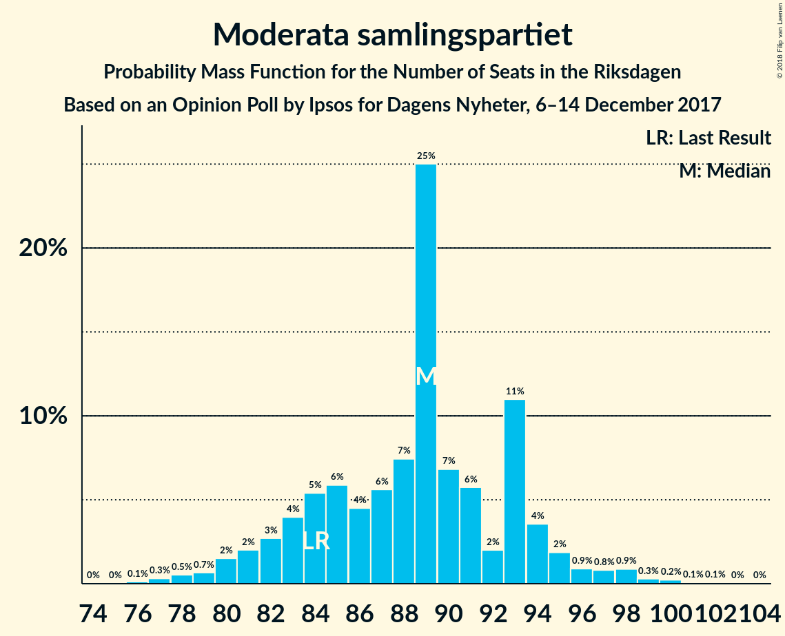
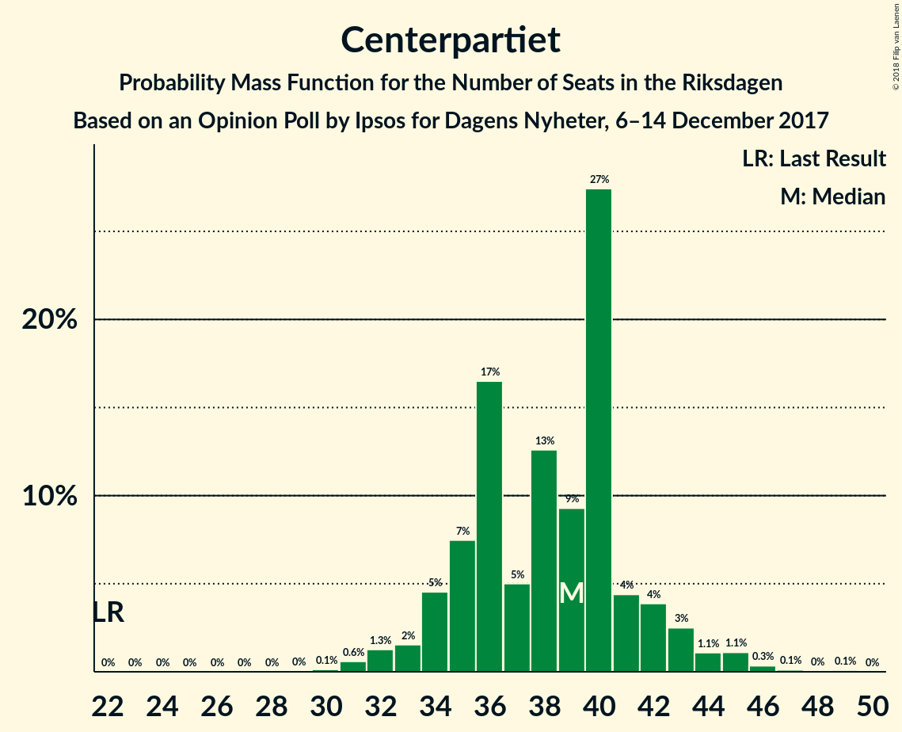
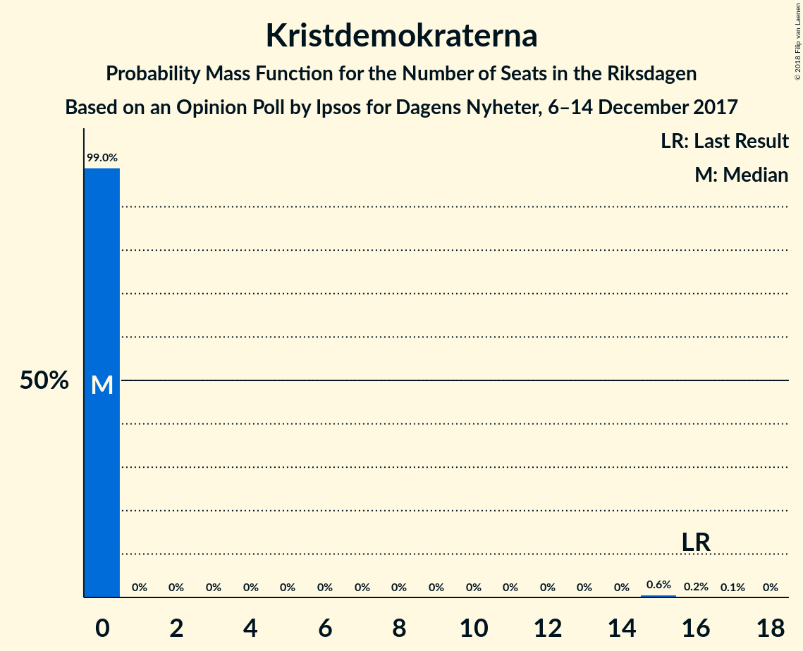

# Opinion Poll by Ipsos for Dagens Nyheter, 6–14 December 2017

<a href="#voting-intentions">Voting Intentions</a> | <a href="#seats">Seats</a> | <a href="#coalitions">Coalitions</a> | <a href="#technical-information">Technical Information</a>

## Voting Intentions

### Confidence Intervals

| Party | Last Result | Poll Result | 80% Confidence Interval | 90% Confidence Interval | 95% Confidence Interval | 99% Confidence Interval |
|:-----:|:-----------:|:-----------:|:-----------------------:|:-----------------------:|:-----------------------:|:-----------------------:|
| Sveriges socialdemokratiska arbetareparti | 31.0% | 28.0% | 26.6–29.4% |26.2–29.8% |25.9–30.1% |25.3–30.8% |
| Moderata samlingspartiet | 23.3% | 23.0% | 21.8–24.4% |21.4–24.7% |21.1–25.1% |20.5–25.7% |
| Sverigedemokraterna | 12.9% | 16.0% | 14.9–17.2% |14.6–17.5% |14.3–17.8% |13.8–18.4% |
| Centerpartiet | 6.1% | 10.0% | 9.1–11.0% |8.9–11.2% |8.7–11.5% |8.2–12.0% |
| Vänsterpartiet | 5.7% | 7.0% | 6.2–7.8% |6.1–8.1% |5.9–8.3% |5.5–8.7% |
| Liberalerna | 5.4% | 5.0% | 4.4–5.8% |4.2–6.0% |4.1–6.2% |3.8–6.5% |
| Miljöpartiet de gröna | 6.9% | 4.0% | 3.4–4.7% |3.3–4.8% |3.2–5.0% |2.9–5.3% |
| Kristdemokraterna | 4.6% | 3.0% | 2.5–3.6% |2.4–3.8% |2.3–3.9% |2.1–4.2% |
| Feministiskt initiativ | 3.1% | 2.0% | 1.6–2.5% |1.5–2.7% |1.4–2.8% |1.3–3.1% |

*Note:* The poll result column reflects the actual value used in the calculations. Published results may vary slightly, and in addition be rounded to fewer digits.

## Seats

### Confidence Intervals

| Party | Last Result | Median | 80% Confidence Interval | 90% Confidence Interval | 95% Confidence Interval | 99% Confidence Interval |
|:-----:|:-----------:|:------:|:-----------------------:|:-----------------------:|:-----------------------:|:-----------------------:|
| <a href="#sveriges-socialdemokratiska-arbetareparti">Sveriges socialdemokratiska arbetareparti</a> | 113 | 107 | 101–112 |100–114 |99–114 |96–118 |
| <a href="#moderata-samlingspartiet">Moderata samlingspartiet</a> | 84 | 89 | 83–93 |81–95 |80–96 |77–99 |
| <a href="#sverigedemokraterna">Sverigedemokraterna</a> | 49 | 60 | 56–65 |55–68 |55–69 |52–70 |
| <a href="#centerpartiet">Centerpartiet</a> | 22 | 39 | 35–41 |34–43 |33–44 |31–46 |
| <a href="#vänsterpartiet">Vänsterpartiet</a> | 21 | 26 | 24–29 |24–30 |23–31 |21–33 |
| <a href="#liberalerna">Liberalerna</a> | 19 | 19 | 17–22 |16–23 |16–23 |0–25 |
| <a href="#miljöpartiet-de-gröna">Miljöpartiet de gröna</a> | 25 | 0 | 0–17 |0–17 |0–18 |0–20 |
| <a href="#kristdemokraterna">Kristdemokraterna</a> | 16 | 0 | 0 |0 |0 |0–15 |
| <a href="#feministiskt-initiativ">Feministiskt initiativ</a> | 0 | 0 | 0 |0 |0 |0 |

### Sveriges socialdemokratiska arbetareparti

*For a full overview of the results for this party, see the [Sveriges socialdemokratiska arbetareparti](party-sverigessocialdemokratiskaarbetareparti.html) page.*

| Number of Seats | Probability | Accumulated | Special Marks |
|:---------------:|:-----------:|:-----------:|:-------------:|
| 93 | 0% | 100% |  |
| 94 | 0% | 99.9% |  |
| 95 | 0.2% | 99.9% |  |
| 96 | 0.5% | 99.6% |  |
| 97 | 0.5% | 99.1% |  |
| 98 | 0.7% | 98.6% |  |
| 99 | 3% | 98% |  |
| 100 | 3% | 95% |  |
| 101 | 3% | 92% |  |
| 102 | 6% | 89% |  |
| 103 | 16% | 83% |  |
| 104 | 2% | 67% |  |
| 105 | 9% | 65% |  |
| 106 | 3% | 56% |  |
| 107 | 4% | 52% | Median |
| 108 | 4% | 48% |  |
| 109 | 2% | 44% |  |
| 110 | 15% | 42% |  |
| 111 | 15% | 27% |  |
| 112 | 2% | 12% |  |
| 113 | 4% | 10% | Last Result |
| 114 | 4% | 6% |  |
| 115 | 0.8% | 2% |  |
| 116 | 0.6% | 2% |  |
| 117 | 0.4% | 1.0% |  |
| 118 | 0.3% | 0.6% |  |
| 119 | 0% | 0.4% |  |
| 120 | 0.1% | 0.3% |  |
| 121 | 0.1% | 0.2% |  |
| 122 | 0% | 0.1% |  |
| 123 | 0% | 0.1% |  |
| 124 | 0.1% | 0.1% |  |
| 125 | 0% | 0% |  |

### Moderata samlingspartiet

*For a full overview of the results for this party, see the [Moderata samlingspartiet](party-moderatasamlingspartiet.html) page.*

| Number of Seats | Probability | Accumulated | Special Marks |
|:---------------:|:-----------:|:-----------:|:-------------:|
| 74 | 0% | 100% |  |
| 75 | 0% | 99.9% |  |
| 76 | 0.1% | 99.9% |  |
| 77 | 0.3% | 99.8% |  |
| 78 | 0.5% | 99.5% |  |
| 79 | 0.7% | 98.9% |  |
| 80 | 2% | 98% |  |
| 81 | 2% | 97% |  |
| 82 | 3% | 95% |  |
| 83 | 4% | 92% |  |
| 84 | 5% | 88% | Last Result |
| 85 | 6% | 83% |  |
| 86 | 4% | 77% |  |
| 87 | 6% | 72% |  |
| 88 | 7% | 67% |  |
| 89 | 25% | 59% | Median |
| 90 | 7% | 34% |  |
| 91 | 6% | 27% |  |
| 92 | 2% | 22% |  |
| 93 | 11% | 20% |  |
| 94 | 4% | 9% |  |
| 95 | 2% | 5% |  |
| 96 | 0.9% | 3% |  |
| 97 | 0.8% | 2% |  |
| 98 | 0.9% | 2% |  |
| 99 | 0.3% | 0.7% |  |
| 100 | 0.2% | 0.4% |  |
| 101 | 0.1% | 0.2% |  |
| 102 | 0.1% | 0.1% |  |
| 103 | 0% | 0% |  |

### Sverigedemokraterna

*For a full overview of the results for this party, see the [Sverigedemokraterna](party-sverigedemokraterna.html) page.*

| Number of Seats | Probability | Accumulated | Special Marks |
|:---------------:|:-----------:|:-----------:|:-------------:|
| 49 | 0% | 100% | Last Result |
| 50 | 0.1% | 100% |  |
| 51 | 0.1% | 99.9% |  |
| 52 | 0.4% | 99.8% |  |
| 53 | 0.6% | 99.4% |  |
| 54 | 1.1% | 98.8% |  |
| 55 | 5% | 98% |  |
| 56 | 3% | 93% |  |
| 57 | 4% | 89% |  |
| 58 | 9% | 85% |  |
| 59 | 6% | 76% |  |
| 60 | 21% | 70% | Median |
| 61 | 10% | 50% |  |
| 62 | 6% | 40% |  |
| 63 | 4% | 34% |  |
| 64 | 5% | 30% |  |
| 65 | 15% | 25% |  |
| 66 | 2% | 10% |  |
| 67 | 2% | 8% |  |
| 68 | 3% | 6% |  |
| 69 | 2% | 3% |  |
| 70 | 1.1% | 2% |  |
| 71 | 0.1% | 0.5% |  |
| 72 | 0.2% | 0.4% |  |
| 73 | 0.2% | 0.2% |  |
| 74 | 0% | 0.1% |  |
| 75 | 0% | 0% |  |

### Centerpartiet

*For a full overview of the results for this party, see the [Centerpartiet](party-centerpartiet.html) page.*

| Number of Seats | Probability | Accumulated | Special Marks |
|:---------------:|:-----------:|:-----------:|:-------------:|
| 22 | 0% | 100% | Last Result |
| 23 | 0% | 100% |  |
| 24 | 0% | 100% |  |
| 25 | 0% | 100% |  |
| 26 | 0% | 100% |  |
| 27 | 0% | 100% |  |
| 28 | 0% | 100% |  |
| 29 | 0% | 100% |  |
| 30 | 0.1% | 100% |  |
| 31 | 0.6% | 99.8% |  |
| 32 | 1.3% | 99.2% |  |
| 33 | 2% | 98% |  |
| 34 | 5% | 96% |  |
| 35 | 7% | 92% |  |
| 36 | 17% | 84% |  |
| 37 | 5% | 68% |  |
| 38 | 13% | 63% |  |
| 39 | 9% | 50% | Median |
| 40 | 27% | 41% |  |
| 41 | 4% | 14% |  |
| 42 | 4% | 9% |  |
| 43 | 3% | 5% |  |
| 44 | 1.1% | 3% |  |
| 45 | 1.1% | 2% |  |
| 46 | 0.3% | 0.6% |  |
| 47 | 0.1% | 0.3% |  |
| 48 | 0% | 0.1% |  |
| 49 | 0.1% | 0.1% |  |
| 50 | 0% | 0% |  |

### Vänsterpartiet

*For a full overview of the results for this party, see the [Vänsterpartiet](party-vänsterpartiet.html) page.*

| Number of Seats | Probability | Accumulated | Special Marks |
|:---------------:|:-----------:|:-----------:|:-------------:|
| 20 | 0.1% | 100% |  |
| 21 | 0.4% | 99.9% | Last Result |
| 22 | 1.2% | 99.5% |  |
| 23 | 2% | 98% |  |
| 24 | 11% | 97% |  |
| 25 | 23% | 85% |  |
| 26 | 17% | 62% | Median |
| 27 | 9% | 46% |  |
| 28 | 19% | 37% |  |
| 29 | 9% | 18% |  |
| 30 | 5% | 9% |  |
| 31 | 2% | 4% |  |
| 32 | 2% | 2% |  |
| 33 | 0.3% | 0.6% |  |
| 34 | 0.1% | 0.2% |  |
| 35 | 0% | 0.1% |  |
| 36 | 0% | 0% |  |

### Liberalerna

*For a full overview of the results for this party, see the [Liberalerna](party-liberalerna.html) page.*

| Number of Seats | Probability | Accumulated | Special Marks |
|:---------------:|:-----------:|:-----------:|:-------------:|
| 0 | 1.1% | 100% |  |
| 1 | 0% | 98.9% |  |
| 2 | 0% | 98.9% |  |
| 3 | 0% | 98.9% |  |
| 4 | 0% | 98.9% |  |
| 5 | 0% | 98.9% |  |
| 6 | 0% | 98.9% |  |
| 7 | 0% | 98.9% |  |
| 8 | 0% | 98.9% |  |
| 9 | 0% | 98.9% |  |
| 10 | 0% | 98.9% |  |
| 11 | 0% | 98.9% |  |
| 12 | 0% | 98.9% |  |
| 13 | 0% | 98.9% |  |
| 14 | 0% | 98.9% |  |
| 15 | 0.4% | 98.9% |  |
| 16 | 4% | 98.5% |  |
| 17 | 8% | 95% |  |
| 18 | 12% | 87% |  |
| 19 | 28% | 75% | Last Result, Median |
| 20 | 22% | 47% |  |
| 21 | 9% | 25% |  |
| 22 | 10% | 16% |  |
| 23 | 4% | 6% |  |
| 24 | 1.0% | 2% |  |
| 25 | 0.4% | 0.5% |  |
| 26 | 0.1% | 0.1% |  |
| 27 | 0% | 0% |  |

### Miljöpartiet de gröna

*For a full overview of the results for this party, see the [Miljöpartiet de gröna](party-miljöpartietdegröna.html) page.*

| Number of Seats | Probability | Accumulated | Special Marks |
|:---------------:|:-----------:|:-----------:|:-------------:|
| 0 | 50% | 100% | Median |
| 1 | 0% | 50% |  |
| 2 | 0% | 50% |  |
| 3 | 0% | 50% |  |
| 4 | 0% | 50% |  |
| 5 | 0% | 50% |  |
| 6 | 0% | 50% |  |
| 7 | 0% | 50% |  |
| 8 | 0% | 50% |  |
| 9 | 0% | 50% |  |
| 10 | 0% | 50% |  |
| 11 | 0% | 50% |  |
| 12 | 0% | 50% |  |
| 13 | 0% | 50% |  |
| 14 | 0% | 50% |  |
| 15 | 12% | 50% |  |
| 16 | 24% | 37% |  |
| 17 | 9% | 13% |  |
| 18 | 2% | 4% |  |
| 19 | 0.9% | 2% |  |
| 20 | 0.6% | 0.8% |  |
| 21 | 0.1% | 0.2% |  |
| 22 | 0% | 0% |  |
| 23 | 0% | 0% |  |
| 24 | 0% | 0% |  |
| 25 | 0% | 0% | Last Result |

### Kristdemokraterna

*For a full overview of the results for this party, see the [Kristdemokraterna](party-kristdemokraterna.html) page.*

| Number of Seats | Probability | Accumulated | Special Marks |
|:---------------:|:-----------:|:-----------:|:-------------:|
| 0 | 99.0% | 100% | Median |
| 1 | 0% | 1.0% |  |
| 2 | 0% | 1.0% |  |
| 3 | 0% | 1.0% |  |
| 4 | 0% | 1.0% |  |
| 5 | 0% | 1.0% |  |
| 6 | 0% | 1.0% |  |
| 7 | 0% | 1.0% |  |
| 8 | 0% | 1.0% |  |
| 9 | 0% | 1.0% |  |
| 10 | 0% | 1.0% |  |
| 11 | 0% | 1.0% |  |
| 12 | 0% | 1.0% |  |
| 13 | 0% | 1.0% |  |
| 14 | 0% | 1.0% |  |
| 15 | 0.6% | 1.0% |  |
| 16 | 0.2% | 0.3% | Last Result |
| 17 | 0.1% | 0.1% |  |
| 18 | 0% | 0% |  |

### Feministiskt initiativ

*For a full overview of the results for this party, see the [Feministiskt initiativ](party-feministisktinitiativ.html) page.*

| Number of Seats | Probability | Accumulated | Special Marks |
|:---------------:|:-----------:|:-----------:|:-------------:|
| 0 | 100% | 100% | Last Result, Median |

## Coalitions

### Confidence Intervals

| Coalition | Last Result | Median | Majority? | 80% Confidence Interval | 90% Confidence Interval | 95% Confidence Interval | 99% Confidence Interval |
|:---------:|:-----------:|:------:|:---------:|:-----------------------:|:-----------------------:|:-----------------------:|:-----------------------:|
| Sveriges socialdemokratiska arbetareparti – Moderata samlingspartiet – Centerpartiet | 219 | 233 | 100% | 225–244 | 223–244 | 221–246 | 217–250 |
| Sveriges socialdemokratiska arbetareparti – Moderata samlingspartiet | 197 | 195 | 100% | 187–204 | 185–206 | 182–208 | 180–210 |
| Moderata samlingspartiet – Sverigedemokraterna – Kristdemokraterna | 149 | 151 | 0% | 143–156 | 141–158 | 139–160 | 136–164 |
| Moderata samlingspartiet – Sverigedemokraterna | 133 | 150 | 0% | 142–156 | 141–158 | 139–160 | 135–163 |
| Moderata samlingspartiet – Centerpartiet – Liberalerna – Kristdemokraterna | 141 | 146 | 0% | 140–152 | 137–153 | 135–155 | 131–160 |
| Moderata samlingspartiet – Centerpartiet – Liberalerna | 125 | 146 | 0% | 140–152 | 137–153 | 135–155 | 131–159 |
| Sveriges socialdemokratiska arbetareparti – Vänsterpartiet – Miljöpartiet de gröna – Feministiskt initiativ | 159 | 142 | 0% | 135–149 | 134–153 | 130–155 | 126–157 |
| Sveriges socialdemokratiska arbetareparti – Vänsterpartiet – Miljöpartiet de gröna | 159 | 142 | 0% | 135–149 | 134–153 | 130–155 | 126–157 |
| Sveriges socialdemokratiska arbetareparti – Vänsterpartiet | 134 | 135 | 0% | 127–139 | 127–140 | 125–142 | 122–147 |
| Moderata samlingspartiet – Centerpartiet – Kristdemokraterna | 122 | 127 | 0% | 121–133 | 119–134 | 116–137 | 114–141 |
| Moderata samlingspartiet – Centerpartiet | 106 | 126 | 0% | 121–133 | 119–134 | 116–136 | 113–140 |
| Sveriges socialdemokratiska arbetareparti – Miljöpartiet de gröna | 138 | 115 | 0% | 108–122 | 106–126 | 104–128 | 100–131 |

### Sveriges socialdemokratiska arbetareparti – Moderata samlingspartiet – Centerpartiet

| Number of Seats | Probability | Accumulated | Special Marks |
|:---------------:|:-----------:|:-----------:|:-------------:|
| 213 | 0.1% | 100% |  |
| 214 | 0% | 99.9% |  |
| 215 | 0.1% | 99.8% |  |
| 216 | 0.1% | 99.8% |  |
| 217 | 0.2% | 99.7% |  |
| 218 | 0.2% | 99.4% |  |
| 219 | 0.6% | 99.2% | Last Result |
| 220 | 0.7% | 98.6% |  |
| 221 | 1.2% | 98% |  |
| 222 | 2% | 97% |  |
| 223 | 2% | 95% |  |
| 224 | 3% | 93% |  |
| 225 | 3% | 90% |  |
| 226 | 3% | 87% |  |
| 227 | 11% | 85% |  |
| 228 | 10% | 73% |  |
| 229 | 1.3% | 63% |  |
| 230 | 3% | 62% |  |
| 231 | 6% | 59% |  |
| 232 | 2% | 53% |  |
| 233 | 2% | 51% |  |
| 234 | 2% | 49% |  |
| 235 | 1.4% | 46% | Median |
| 236 | 3% | 45% |  |
| 237 | 3% | 42% |  |
| 238 | 2% | 39% |  |
| 239 | 16% | 37% |  |
| 240 | 0.5% | 21% |  |
| 241 | 3% | 21% |  |
| 242 | 2% | 18% |  |
| 243 | 0.9% | 16% |  |
| 244 | 12% | 15% |  |
| 245 | 0.8% | 4% |  |
| 246 | 0.5% | 3% |  |
| 247 | 0.9% | 2% |  |
| 248 | 0.2% | 2% |  |
| 249 | 0.6% | 1.3% |  |
| 250 | 0.3% | 0.8% |  |
| 251 | 0% | 0.5% |  |
| 252 | 0.1% | 0.5% |  |
| 253 | 0% | 0.4% |  |
| 254 | 0.2% | 0.3% |  |
| 255 | 0% | 0.2% |  |
| 256 | 0.1% | 0.2% |  |
| 257 | 0% | 0.1% |  |
| 258 | 0% | 0.1% |  |
| 259 | 0% | 0.1% |  |
| 260 | 0% | 0% |  |

### Sveriges socialdemokratiska arbetareparti – Moderata samlingspartiet

| Number of Seats | Probability | Accumulated | Special Marks |
|:---------------:|:-----------:|:-----------:|:-------------:|
| 175 | 0.1% | 100% | Majority |
| 176 | 0% | 99.9% |  |
| 177 | 0.1% | 99.9% |  |
| 178 | 0.1% | 99.8% |  |
| 179 | 0.1% | 99.7% |  |
| 180 | 0.5% | 99.6% |  |
| 181 | 0.3% | 99.2% |  |
| 182 | 1.5% | 98.9% |  |
| 183 | 0.6% | 97% |  |
| 184 | 0.9% | 97% |  |
| 185 | 3% | 96% |  |
| 186 | 0.8% | 93% |  |
| 187 | 7% | 92% |  |
| 188 | 0.8% | 85% |  |
| 189 | 6% | 85% |  |
| 190 | 3% | 79% |  |
| 191 | 3% | 76% |  |
| 192 | 14% | 73% |  |
| 193 | 5% | 58% |  |
| 194 | 2% | 54% |  |
| 195 | 2% | 51% |  |
| 196 | 3% | 49% | Median |
| 197 | 4% | 46% | Last Result |
| 198 | 0.9% | 42% |  |
| 199 | 13% | 41% |  |
| 200 | 2% | 28% |  |
| 201 | 6% | 26% |  |
| 202 | 1.5% | 20% |  |
| 203 | 2% | 19% |  |
| 204 | 11% | 17% |  |
| 205 | 1.4% | 6% |  |
| 206 | 1.3% | 5% |  |
| 207 | 1.0% | 4% |  |
| 208 | 1.2% | 3% |  |
| 209 | 0.4% | 2% |  |
| 210 | 0.7% | 1.2% |  |
| 211 | 0% | 0.5% |  |
| 212 | 0.2% | 0.5% |  |
| 213 | 0.1% | 0.2% |  |
| 214 | 0.1% | 0.2% |  |
| 215 | 0% | 0.1% |  |
| 216 | 0% | 0.1% |  |
| 217 | 0% | 0% |  |

### Moderata samlingspartiet – Sverigedemokraterna – Kristdemokraterna

| Number of Seats | Probability | Accumulated | Special Marks |
|:---------------:|:-----------:|:-----------:|:-------------:|
| 133 | 0% | 100% |  |
| 134 | 0.2% | 99.9% |  |
| 135 | 0.2% | 99.8% |  |
| 136 | 0.3% | 99.6% |  |
| 137 | 0.3% | 99.2% |  |
| 138 | 0.7% | 99.0% |  |
| 139 | 0.9% | 98% |  |
| 140 | 2% | 97% |  |
| 141 | 2% | 95% |  |
| 142 | 4% | 94% |  |
| 143 | 7% | 90% |  |
| 144 | 5% | 83% |  |
| 145 | 3% | 78% |  |
| 146 | 6% | 76% |  |
| 147 | 10% | 70% |  |
| 148 | 1.5% | 59% |  |
| 149 | 2% | 58% | Last Result, Median |
| 150 | 6% | 56% |  |
| 151 | 2% | 50% |  |
| 152 | 5% | 48% |  |
| 153 | 12% | 43% |  |
| 154 | 14% | 31% |  |
| 155 | 4% | 17% |  |
| 156 | 2% | 12% |  |
| 157 | 2% | 10% |  |
| 158 | 3% | 7% |  |
| 159 | 2% | 5% |  |
| 160 | 1.1% | 3% |  |
| 161 | 0.6% | 2% |  |
| 162 | 0.6% | 2% |  |
| 163 | 0.4% | 1.1% |  |
| 164 | 0.2% | 0.6% |  |
| 165 | 0.2% | 0.4% |  |
| 166 | 0.1% | 0.2% |  |
| 167 | 0.1% | 0.2% |  |
| 168 | 0% | 0.1% |  |
| 169 | 0% | 0.1% |  |
| 170 | 0% | 0.1% |  |
| 171 | 0% | 0% |  |

### Moderata samlingspartiet – Sverigedemokraterna

| Number of Seats | Probability | Accumulated | Special Marks |
|:---------------:|:-----------:|:-----------:|:-------------:|
| 133 | 0.1% | 100% | Last Result |
| 134 | 0.2% | 99.9% |  |
| 135 | 0.2% | 99.7% |  |
| 136 | 0.4% | 99.4% |  |
| 137 | 0.3% | 99.0% |  |
| 138 | 0.7% | 98.7% |  |
| 139 | 1.0% | 98% |  |
| 140 | 2% | 97% |  |
| 141 | 2% | 95% |  |
| 142 | 4% | 93% |  |
| 143 | 7% | 90% |  |
| 144 | 5% | 82% |  |
| 145 | 3% | 78% |  |
| 146 | 6% | 75% |  |
| 147 | 10% | 69% |  |
| 148 | 1.4% | 59% |  |
| 149 | 2% | 57% | Median |
| 150 | 6% | 56% |  |
| 151 | 2% | 49% |  |
| 152 | 5% | 47% |  |
| 153 | 12% | 42% |  |
| 154 | 14% | 30% |  |
| 155 | 4% | 16% |  |
| 156 | 2% | 12% |  |
| 157 | 2% | 9% |  |
| 158 | 3% | 7% |  |
| 159 | 2% | 4% |  |
| 160 | 1.0% | 3% |  |
| 161 | 0.5% | 2% |  |
| 162 | 0.6% | 1.3% |  |
| 163 | 0.4% | 0.8% |  |
| 164 | 0.2% | 0.4% |  |
| 165 | 0.1% | 0.2% |  |
| 166 | 0% | 0.1% |  |
| 167 | 0% | 0.1% |  |
| 168 | 0% | 0% |  |

### Moderata samlingspartiet – Centerpartiet – Liberalerna – Kristdemokraterna

| Number of Seats | Probability | Accumulated | Special Marks |
|:---------------:|:-----------:|:-----------:|:-------------:|
| 124 | 0% | 100% |  |
| 125 | 0% | 99.9% |  |
| 126 | 0% | 99.9% |  |
| 127 | 0% | 99.9% |  |
| 128 | 0% | 99.9% |  |
| 129 | 0.1% | 99.9% |  |
| 130 | 0.1% | 99.8% |  |
| 131 | 0.2% | 99.7% |  |
| 132 | 0.3% | 99.4% |  |
| 133 | 0.4% | 99.1% |  |
| 134 | 0.6% | 98.8% |  |
| 135 | 1.2% | 98% |  |
| 136 | 1.3% | 97% |  |
| 137 | 1.4% | 96% |  |
| 138 | 1.2% | 94% |  |
| 139 | 2% | 93% |  |
| 140 | 4% | 91% |  |
| 141 | 2% | 87% | Last Result |
| 142 | 4% | 85% |  |
| 143 | 4% | 81% |  |
| 144 | 12% | 77% |  |
| 145 | 7% | 66% |  |
| 146 | 10% | 59% |  |
| 147 | 6% | 48% | Median |
| 148 | 7% | 42% |  |
| 149 | 13% | 36% |  |
| 150 | 4% | 23% |  |
| 151 | 2% | 19% |  |
| 152 | 10% | 17% |  |
| 153 | 2% | 7% |  |
| 154 | 1.4% | 5% |  |
| 155 | 0.8% | 3% |  |
| 156 | 0.6% | 2% |  |
| 157 | 0.5% | 2% |  |
| 158 | 0.5% | 1.3% |  |
| 159 | 0.2% | 0.7% |  |
| 160 | 0.1% | 0.5% |  |
| 161 | 0.1% | 0.4% |  |
| 162 | 0.1% | 0.3% |  |
| 163 | 0% | 0.2% |  |
| 164 | 0.1% | 0.1% |  |
| 165 | 0% | 0.1% |  |
| 166 | 0% | 0% |  |

### Moderata samlingspartiet – Centerpartiet – Liberalerna

| Number of Seats | Probability | Accumulated | Special Marks |
|:---------------:|:-----------:|:-----------:|:-------------:|
| 123 | 0% | 100% |  |
| 124 | 0% | 99.9% |  |
| 125 | 0% | 99.9% | Last Result |
| 126 | 0% | 99.9% |  |
| 127 | 0% | 99.9% |  |
| 128 | 0% | 99.9% |  |
| 129 | 0.1% | 99.8% |  |
| 130 | 0.2% | 99.7% |  |
| 131 | 0.3% | 99.5% |  |
| 132 | 0.3% | 99.3% |  |
| 133 | 0.4% | 99.0% |  |
| 134 | 0.7% | 98.6% |  |
| 135 | 1.3% | 98% |  |
| 136 | 1.3% | 97% |  |
| 137 | 1.4% | 95% |  |
| 138 | 1.3% | 94% |  |
| 139 | 2% | 93% |  |
| 140 | 4% | 91% |  |
| 141 | 2% | 87% |  |
| 142 | 4% | 84% |  |
| 143 | 4% | 80% |  |
| 144 | 12% | 77% |  |
| 145 | 7% | 65% |  |
| 146 | 10% | 58% |  |
| 147 | 6% | 47% | Median |
| 148 | 7% | 42% |  |
| 149 | 13% | 35% |  |
| 150 | 4% | 22% |  |
| 151 | 2% | 18% |  |
| 152 | 10% | 16% |  |
| 153 | 2% | 6% |  |
| 154 | 1.2% | 4% |  |
| 155 | 0.7% | 3% |  |
| 156 | 0.6% | 2% |  |
| 157 | 0.5% | 1.5% |  |
| 158 | 0.5% | 1.0% |  |
| 159 | 0.2% | 0.5% |  |
| 160 | 0.1% | 0.3% |  |
| 161 | 0.1% | 0.2% |  |
| 162 | 0.1% | 0.2% |  |
| 163 | 0% | 0.1% |  |
| 164 | 0% | 0.1% |  |
| 165 | 0% | 0% |  |

### Sveriges socialdemokratiska arbetareparti – Vänsterpartiet – Miljöpartiet de gröna – Feministiskt initiativ

| Number of Seats | Probability | Accumulated | Special Marks |
|:---------------:|:-----------:|:-----------:|:-------------:|
| 122 | 0% | 100% |  |
| 123 | 0.1% | 99.9% |  |
| 124 | 0.1% | 99.9% |  |
| 125 | 0.1% | 99.8% |  |
| 126 | 0.5% | 99.7% |  |
| 127 | 0.1% | 99.2% |  |
| 128 | 0.6% | 99.1% |  |
| 129 | 0.6% | 98.6% |  |
| 130 | 0.7% | 98% |  |
| 131 | 0.6% | 97% |  |
| 132 | 0.7% | 97% |  |
| 133 | 0.8% | 96% | Median |
| 134 | 2% | 95% |  |
| 135 | 14% | 93% |  |
| 136 | 3% | 79% |  |
| 137 | 12% | 76% |  |
| 138 | 4% | 64% |  |
| 139 | 3% | 61% |  |
| 140 | 5% | 58% |  |
| 141 | 2% | 53% |  |
| 142 | 7% | 51% |  |
| 143 | 4% | 44% |  |
| 144 | 6% | 40% |  |
| 145 | 3% | 34% |  |
| 146 | 7% | 31% |  |
| 147 | 10% | 25% |  |
| 148 | 3% | 14% |  |
| 149 | 3% | 12% |  |
| 150 | 0.7% | 9% |  |
| 151 | 0.9% | 8% |  |
| 152 | 1.3% | 7% |  |
| 153 | 0.8% | 6% |  |
| 154 | 2% | 5% |  |
| 155 | 1.0% | 3% |  |
| 156 | 0.8% | 2% |  |
| 157 | 0.5% | 0.9% |  |
| 158 | 0.2% | 0.4% |  |
| 159 | 0.1% | 0.2% | Last Result |
| 160 | 0% | 0.1% |  |
| 161 | 0% | 0.1% |  |
| 162 | 0% | 0.1% |  |
| 163 | 0% | 0.1% |  |
| 164 | 0% | 0% |  |

### Sveriges socialdemokratiska arbetareparti – Vänsterpartiet – Miljöpartiet de gröna

| Number of Seats | Probability | Accumulated | Special Marks |
|:---------------:|:-----------:|:-----------:|:-------------:|
| 122 | 0% | 100% |  |
| 123 | 0.1% | 99.9% |  |
| 124 | 0.1% | 99.9% |  |
| 125 | 0.1% | 99.8% |  |
| 126 | 0.5% | 99.7% |  |
| 127 | 0.1% | 99.2% |  |
| 128 | 0.6% | 99.1% |  |
| 129 | 0.6% | 98.6% |  |
| 130 | 0.7% | 98% |  |
| 131 | 0.6% | 97% |  |
| 132 | 0.7% | 97% |  |
| 133 | 0.8% | 96% | Median |
| 134 | 2% | 95% |  |
| 135 | 14% | 93% |  |
| 136 | 3% | 79% |  |
| 137 | 12% | 76% |  |
| 138 | 4% | 64% |  |
| 139 | 3% | 61% |  |
| 140 | 5% | 58% |  |
| 141 | 2% | 53% |  |
| 142 | 7% | 51% |  |
| 143 | 4% | 44% |  |
| 144 | 6% | 40% |  |
| 145 | 3% | 34% |  |
| 146 | 7% | 31% |  |
| 147 | 10% | 25% |  |
| 148 | 3% | 14% |  |
| 149 | 3% | 12% |  |
| 150 | 0.7% | 9% |  |
| 151 | 0.9% | 8% |  |
| 152 | 1.3% | 7% |  |
| 153 | 0.8% | 6% |  |
| 154 | 2% | 5% |  |
| 155 | 1.0% | 3% |  |
| 156 | 0.8% | 2% |  |
| 157 | 0.5% | 0.9% |  |
| 158 | 0.2% | 0.4% |  |
| 159 | 0.1% | 0.2% | Last Result |
| 160 | 0% | 0.1% |  |
| 161 | 0% | 0.1% |  |
| 162 | 0% | 0.1% |  |
| 163 | 0% | 0.1% |  |
| 164 | 0% | 0% |  |

### Sveriges socialdemokratiska arbetareparti – Vänsterpartiet

| Number of Seats | Probability | Accumulated | Special Marks |
|:---------------:|:-----------:|:-----------:|:-------------:|
| 118 | 0% | 100% |  |
| 119 | 0% | 99.9% |  |
| 120 | 0.1% | 99.9% |  |
| 121 | 0.1% | 99.7% |  |
| 122 | 0.3% | 99.7% |  |
| 123 | 0.3% | 99.3% |  |
| 124 | 0.7% | 99.0% |  |
| 125 | 1.1% | 98% |  |
| 126 | 2% | 97% |  |
| 127 | 8% | 95% |  |
| 128 | 5% | 87% |  |
| 129 | 5% | 83% |  |
| 130 | 6% | 77% |  |
| 131 | 10% | 71% |  |
| 132 | 4% | 61% |  |
| 133 | 3% | 57% | Median |
| 134 | 3% | 53% | Last Result |
| 135 | 16% | 50% |  |
| 136 | 4% | 35% |  |
| 137 | 13% | 31% |  |
| 138 | 4% | 18% |  |
| 139 | 4% | 14% |  |
| 140 | 5% | 10% |  |
| 141 | 2% | 5% |  |
| 142 | 0.8% | 3% |  |
| 143 | 0.8% | 2% |  |
| 144 | 0.3% | 1.3% |  |
| 145 | 0.2% | 1.0% |  |
| 146 | 0.3% | 0.9% |  |
| 147 | 0.2% | 0.6% |  |
| 148 | 0.2% | 0.4% |  |
| 149 | 0.1% | 0.2% |  |
| 150 | 0.1% | 0.1% |  |
| 151 | 0% | 0.1% |  |
| 152 | 0% | 0% |  |

### Moderata samlingspartiet – Centerpartiet – Kristdemokraterna

| Number of Seats | Probability | Accumulated | Special Marks |
|:---------------:|:-----------:|:-----------:|:-------------:|
| 111 | 0% | 100% |  |
| 112 | 0.2% | 99.9% |  |
| 113 | 0.2% | 99.7% |  |
| 114 | 0.3% | 99.5% |  |
| 115 | 0.3% | 99.3% |  |
| 116 | 2% | 99.0% |  |
| 117 | 1.1% | 97% |  |
| 118 | 0.9% | 96% |  |
| 119 | 2% | 95% |  |
| 120 | 3% | 94% |  |
| 121 | 4% | 91% |  |
| 122 | 4% | 87% | Last Result |
| 123 | 4% | 83% |  |
| 124 | 9% | 79% |  |
| 125 | 14% | 71% |  |
| 126 | 6% | 56% |  |
| 127 | 4% | 51% |  |
| 128 | 7% | 47% | Median |
| 129 | 15% | 40% |  |
| 130 | 3% | 25% |  |
| 131 | 2% | 22% |  |
| 132 | 3% | 21% |  |
| 133 | 12% | 18% |  |
| 134 | 1.0% | 6% |  |
| 135 | 1.0% | 5% |  |
| 136 | 0.9% | 4% |  |
| 137 | 1.1% | 3% |  |
| 138 | 0.8% | 2% |  |
| 139 | 0.2% | 1.0% |  |
| 140 | 0.2% | 0.8% |  |
| 141 | 0.2% | 0.6% |  |
| 142 | 0.2% | 0.3% |  |
| 143 | 0% | 0.2% |  |
| 144 | 0% | 0.1% |  |
| 145 | 0% | 0.1% |  |
| 146 | 0.1% | 0.1% |  |
| 147 | 0% | 0% |  |

### Moderata samlingspartiet – Centerpartiet

| Number of Seats | Probability | Accumulated | Special Marks |
|:---------------:|:-----------:|:-----------:|:-------------:|
| 106 | 0% | 100% | Last Result |
| 107 | 0% | 100% |  |
| 108 | 0% | 100% |  |
| 109 | 0% | 100% |  |
| 110 | 0% | 100% |  |
| 111 | 0% | 99.9% |  |
| 112 | 0.2% | 99.9% |  |
| 113 | 0.3% | 99.7% |  |
| 114 | 0.3% | 99.4% |  |
| 115 | 0.3% | 99.1% |  |
| 116 | 2% | 98.8% |  |
| 117 | 1.1% | 97% |  |
| 118 | 0.9% | 96% |  |
| 119 | 2% | 95% |  |
| 120 | 3% | 93% |  |
| 121 | 4% | 90% |  |
| 122 | 4% | 86% |  |
| 123 | 4% | 82% |  |
| 124 | 9% | 79% |  |
| 125 | 14% | 70% |  |
| 126 | 6% | 56% |  |
| 127 | 4% | 50% |  |
| 128 | 7% | 46% | Median |
| 129 | 15% | 39% |  |
| 130 | 3% | 24% |  |
| 131 | 2% | 21% |  |
| 132 | 3% | 20% |  |
| 133 | 12% | 17% |  |
| 134 | 0.9% | 5% |  |
| 135 | 0.9% | 4% |  |
| 136 | 0.8% | 3% |  |
| 137 | 1.0% | 2% |  |
| 138 | 0.7% | 1.4% |  |
| 139 | 0.2% | 0.8% |  |
| 140 | 0.2% | 0.6% |  |
| 141 | 0.2% | 0.4% |  |
| 142 | 0.1% | 0.2% |  |
| 143 | 0% | 0.1% |  |
| 144 | 0% | 0% |  |

### Sveriges socialdemokratiska arbetareparti – Miljöpartiet de gröna

| Number of Seats | Probability | Accumulated | Special Marks |
|:---------------:|:-----------:|:-----------:|:-------------:|
| 97 | 0.1% | 100% |  |
| 98 | 0.1% | 99.9% |  |
| 99 | 0.1% | 99.7% |  |
| 100 | 0.5% | 99.7% |  |
| 101 | 0.8% | 99.2% |  |
| 102 | 0.2% | 98% |  |
| 103 | 0.4% | 98% |  |
| 104 | 0.9% | 98% |  |
| 105 | 1.2% | 97% |  |
| 106 | 1.5% | 96% |  |
| 107 | 3% | 94% | Median |
| 108 | 2% | 91% |  |
| 109 | 2% | 89% |  |
| 110 | 14% | 87% |  |
| 111 | 13% | 73% |  |
| 112 | 2% | 60% |  |
| 113 | 4% | 58% |  |
| 114 | 4% | 54% |  |
| 115 | 3% | 50% |  |
| 116 | 3% | 47% |  |
| 117 | 2% | 44% |  |
| 118 | 9% | 42% |  |
| 119 | 12% | 33% |  |
| 120 | 5% | 20% |  |
| 121 | 5% | 15% |  |
| 122 | 1.3% | 11% |  |
| 123 | 2% | 9% |  |
| 124 | 1.1% | 8% |  |
| 125 | 1.4% | 7% |  |
| 126 | 0.7% | 5% |  |
| 127 | 1.0% | 4% |  |
| 128 | 2% | 3% |  |
| 129 | 0.4% | 2% |  |
| 130 | 0.7% | 1.2% |  |
| 131 | 0.2% | 0.5% |  |
| 132 | 0.2% | 0.3% |  |
| 133 | 0.1% | 0.2% |  |
| 134 | 0.1% | 0.1% |  |
| 135 | 0% | 0% |  |
| 136 | 0% | 0% |  |
| 137 | 0% | 0% |  |
| 138 | 0% | 0% | Last Result |

## Technical Information

### Opinion Poll

+ **Polling firm:** Ipsos
+ **Commissioner(s):** Dagens Nyheter
+ **Fieldwork period:** 6–14 December 2017

### Calculations

+ **Sample size:** 1733
+ **Simulations done:** 1,048,576
+ **Error estimate:** 1.14%

