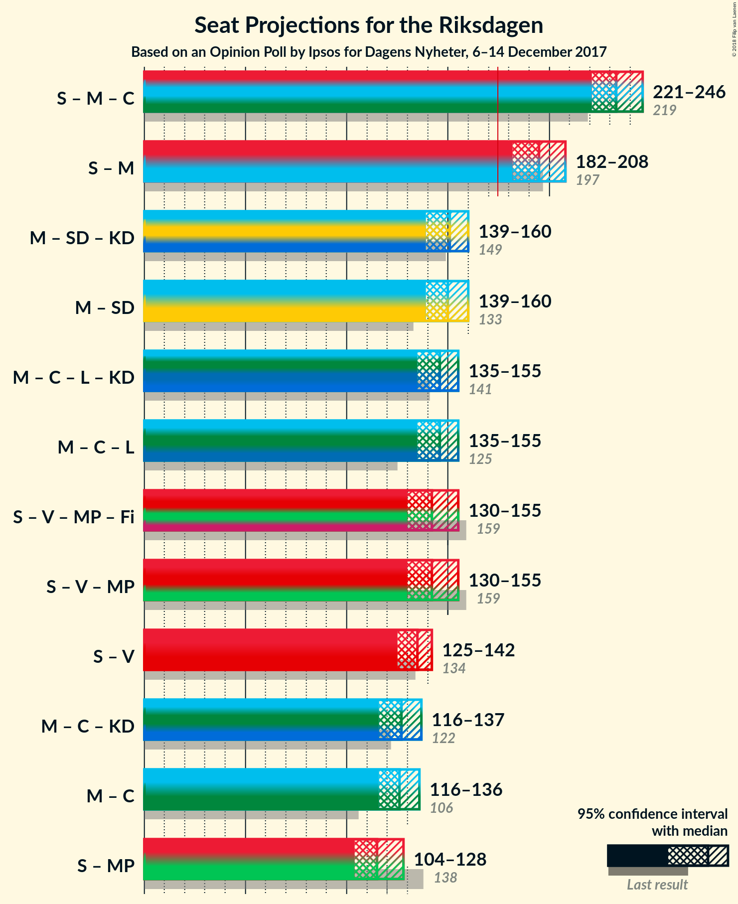

# Opinion Poll by Ipsos for Dagens Nyheter, 6–14 December 2017

<a href="#voting-intentions">Voting Intentions</a> | <a href="#seats">Seats</a> | <a href="#coalitions">Coalitions</a> | <a href="#technical-information">Technical Information</a>

## Voting Intentions

### Confidence Intervals

| Party | Last Result | Poll Result | 80% Confidence Interval | 90% Confidence Interval | 95% Confidence Interval | 99% Confidence Interval |
|:-----:|:-----------:|:-----------:|:-----------------------:|:-----------------------:|:-----------------------:|:-----------------------:|
| Sveriges socialdemokratiska arbetareparti | 31.0% | 28.0% | 26.6–29.4% |26.2–29.8% |25.9–30.1% |25.3–30.8% |
| Moderata samlingspartiet | 23.3% | 23.0% | 21.8–24.4% |21.4–24.7% |21.1–25.1% |20.5–25.7% |
| Sverigedemokraterna | 12.9% | 16.0% | 14.9–17.2% |14.6–17.5% |14.3–17.8% |13.8–18.4% |
| Centerpartiet | 6.1% | 10.0% | 9.1–11.0% |8.9–11.2% |8.7–11.5% |8.2–12.0% |
| Vänsterpartiet | 5.7% | 7.0% | 6.2–7.8% |6.1–8.1% |5.9–8.3% |5.5–8.7% |
| Liberalerna | 5.4% | 5.0% | 4.4–5.8% |4.2–6.0% |4.1–6.2% |3.8–6.5% |
| Miljöpartiet de gröna | 6.9% | 4.0% | 3.4–4.7% |3.3–4.8% |3.2–5.0% |2.9–5.3% |
| Kristdemokraterna | 4.6% | 3.0% | 2.5–3.6% |2.4–3.8% |2.3–3.9% |2.1–4.2% |
| Feministiskt initiativ | 3.1% | 2.0% | 1.6–2.5% |1.5–2.7% |1.4–2.8% |1.3–3.1% |

*Note:* The poll result column reflects the actual value used in the calculations. Published results may vary slightly, and in addition be rounded to fewer digits.

## Seats

### Confidence Intervals

| Party | Last Result | Median | 80% Confidence Interval | 90% Confidence Interval | 95% Confidence Interval | 99% Confidence Interval |
|:-----:|:-----------:|:------:|:-----------------------:|:-----------------------:|:-----------------------:|:-----------------------:|
| <a href="#sveriges-socialdemokratiska-arbetareparti">Sveriges socialdemokratiska arbetareparti</a> | 113 | 110 | 102–111 |101–113 |99–114 |96–118 |
| <a href="#moderata-samlingspartiet">Moderata samlingspartiet</a> | 84 | 90 | 83–93 |81–94 |80–97 |77–98 |
| <a href="#sverigedemokraterna">Sverigedemokraterna</a> | 49 | 60 | 57–64 |56–67 |56–69 |53–70 |
| <a href="#centerpartiet">Centerpartiet</a> | 22 | 40 | 35–42 |34–42 |32–43 |31–45 |
| <a href="#vänsterpartiet">Vänsterpartiet</a> | 21 | 26 | 24–29 |24–30 |23–31 |22–32 |
| <a href="#liberalerna">Liberalerna</a> | 19 | 19 | 18–22 |17–22 |16–23 |0–24 |
| <a href="#miljöpartiet-de-gröna">Miljöpartiet de gröna</a> | 25 | 0 | 0–17 |0–17 |0–18 |0–20 |
| <a href="#kristdemokraterna">Kristdemokraterna</a> | 16 | 0 | 0 |0 |0 |0–15 |
| <a href="#feministiskt-initiativ">Feministiskt initiativ</a> | 0 | 0 | 0 |0 |0 |0 |

### Sveriges socialdemokratiska arbetareparti

*For a full overview of the results for this party, see the [Sveriges socialdemokratiska arbetareparti](party-sverigessocialdemokratiskaarbetareparti.html) page.*

| Number of Seats | Probability | Accumulated | Special Marks |
|:---------------:|:-----------:|:-----------:|:-------------:|
| 93 | 0% | 100% |  |
| 94 | 0.1% | 99.9% |  |
| 95 | 0.2% | 99.9% |  |
| 96 | 1.1% | 99.6% |  |
| 97 | 0.4% | 98.5% |  |
| 98 | 0.4% | 98% |  |
| 99 | 1.0% | 98% |  |
| 100 | 1.3% | 97% |  |
| 101 | 4% | 95% |  |
| 102 | 12% | 91% |  |
| 103 | 14% | 80% |  |
| 104 | 0.9% | 65% |  |
| 105 | 2% | 64% |  |
| 106 | 5% | 62% |  |
| 107 | 3% | 57% |  |
| 108 | 3% | 54% |  |
| 109 | 0.9% | 51% |  |
| 110 | 1.3% | 50% | Median |
| 111 | 39% | 49% |  |
| 112 | 3% | 10% |  |
| 113 | 2% | 6% | Last Result |
| 114 | 2% | 5% |  |
| 115 | 0.5% | 2% |  |
| 116 | 0.9% | 2% |  |
| 117 | 0.5% | 1.0% |  |
| 118 | 0.2% | 0.6% |  |
| 119 | 0% | 0.4% |  |
| 120 | 0% | 0.3% |  |
| 121 | 0.2% | 0.3% |  |
| 122 | 0% | 0.1% |  |
| 123 | 0% | 0.1% |  |
| 124 | 0% | 0.1% |  |
| 125 | 0% | 0% |  |

### Moderata samlingspartiet

*For a full overview of the results for this party, see the [Moderata samlingspartiet](party-moderatasamlingspartiet.html) page.*

| Number of Seats | Probability | Accumulated | Special Marks |
|:---------------:|:-----------:|:-----------:|:-------------:|
| 75 | 0% | 100% |  |
| 76 | 0.1% | 99.9% |  |
| 77 | 0.5% | 99.8% |  |
| 78 | 0.5% | 99.3% |  |
| 79 | 0.4% | 98.8% |  |
| 80 | 2% | 98% |  |
| 81 | 2% | 96% |  |
| 82 | 0.7% | 94% |  |
| 83 | 6% | 93% |  |
| 84 | 2% | 87% | Last Result |
| 85 | 7% | 84% |  |
| 86 | 2% | 77% |  |
| 87 | 5% | 75% |  |
| 88 | 3% | 71% |  |
| 89 | 16% | 67% |  |
| 90 | 8% | 51% | Median |
| 91 | 3% | 43% |  |
| 92 | 1.2% | 40% |  |
| 93 | 31% | 39% |  |
| 94 | 3% | 8% |  |
| 95 | 2% | 5% |  |
| 96 | 0.5% | 3% |  |
| 97 | 0.5% | 3% |  |
| 98 | 2% | 2% |  |
| 99 | 0.1% | 0.4% |  |
| 100 | 0.1% | 0.2% |  |
| 101 | 0.1% | 0.1% |  |
| 102 | 0% | 0.1% |  |
| 103 | 0% | 0% |  |

### Sverigedemokraterna

*For a full overview of the results for this party, see the [Sverigedemokraterna](party-sverigedemokraterna.html) page.*

| Number of Seats | Probability | Accumulated | Special Marks |
|:---------------:|:-----------:|:-----------:|:-------------:|
| 49 | 0% | 100% | Last Result |
| 50 | 0% | 100% |  |
| 51 | 0.1% | 99.9% |  |
| 52 | 0.1% | 99.9% |  |
| 53 | 0.3% | 99.8% |  |
| 54 | 0.8% | 99.5% |  |
| 55 | 1.1% | 98.7% |  |
| 56 | 3% | 98% |  |
| 57 | 8% | 94% |  |
| 58 | 1.2% | 87% |  |
| 59 | 3% | 85% |  |
| 60 | 39% | 83% | Median |
| 61 | 19% | 44% |  |
| 62 | 12% | 25% |  |
| 63 | 2% | 13% |  |
| 64 | 2% | 11% |  |
| 65 | 1.5% | 10% |  |
| 66 | 3% | 8% |  |
| 67 | 2% | 5% |  |
| 68 | 0.1% | 3% |  |
| 69 | 2% | 3% |  |
| 70 | 1.0% | 1.3% |  |
| 71 | 0% | 0.3% |  |
| 72 | 0.2% | 0.3% |  |
| 73 | 0% | 0.1% |  |
| 74 | 0% | 0.1% |  |
| 75 | 0% | 0% |  |

### Centerpartiet

*For a full overview of the results for this party, see the [Centerpartiet](party-centerpartiet.html) page.*

| Number of Seats | Probability | Accumulated | Special Marks |
|:---------------:|:-----------:|:-----------:|:-------------:|
| 22 | 0% | 100% | Last Result |
| 23 | 0% | 100% |  |
| 24 | 0% | 100% |  |
| 25 | 0% | 100% |  |
| 26 | 0% | 100% |  |
| 27 | 0% | 100% |  |
| 28 | 0% | 100% |  |
| 29 | 0% | 100% |  |
| 30 | 0% | 100% |  |
| 31 | 1.1% | 99.9% |  |
| 32 | 2% | 98.9% |  |
| 33 | 2% | 97% |  |
| 34 | 2% | 96% |  |
| 35 | 15% | 93% |  |
| 36 | 5% | 79% |  |
| 37 | 5% | 74% |  |
| 38 | 11% | 69% |  |
| 39 | 2% | 58% |  |
| 40 | 40% | 56% | Median |
| 41 | 5% | 16% |  |
| 42 | 7% | 11% |  |
| 43 | 2% | 4% |  |
| 44 | 1.0% | 2% |  |
| 45 | 0.4% | 0.9% |  |
| 46 | 0.1% | 0.5% |  |
| 47 | 0.1% | 0.3% |  |
| 48 | 0% | 0.3% |  |
| 49 | 0.2% | 0.2% |  |
| 50 | 0% | 0% |  |

### Vänsterpartiet

*For a full overview of the results for this party, see the [Vänsterpartiet](party-vänsterpartiet.html) page.*

| Number of Seats | Probability | Accumulated | Special Marks |
|:---------------:|:-----------:|:-----------:|:-------------:|
| 19 | 0.1% | 100% |  |
| 20 | 0% | 99.9% |  |
| 21 | 0.2% | 99.9% | Last Result |
| 22 | 1.4% | 99.7% |  |
| 23 | 2% | 98% |  |
| 24 | 16% | 96% |  |
| 25 | 9% | 80% |  |
| 26 | 37% | 71% | Median |
| 27 | 5% | 35% |  |
| 28 | 6% | 30% |  |
| 29 | 14% | 23% |  |
| 30 | 6% | 9% |  |
| 31 | 2% | 3% |  |
| 32 | 0.5% | 0.9% |  |
| 33 | 0.2% | 0.4% |  |
| 34 | 0.1% | 0.2% |  |
| 35 | 0.1% | 0.1% |  |
| 36 | 0% | 0% |  |

### Liberalerna

*For a full overview of the results for this party, see the [Liberalerna](party-liberalerna.html) page.*

| Number of Seats | Probability | Accumulated | Special Marks |
|:---------------:|:-----------:|:-----------:|:-------------:|
| 0 | 2% | 100% |  |
| 1 | 0% | 98% |  |
| 2 | 0% | 98% |  |
| 3 | 0% | 98% |  |
| 4 | 0% | 98% |  |
| 5 | 0% | 98% |  |
| 6 | 0% | 98% |  |
| 7 | 0% | 98% |  |
| 8 | 0% | 98% |  |
| 9 | 0% | 98% |  |
| 10 | 0% | 98% |  |
| 11 | 0% | 98% |  |
| 12 | 0% | 98% |  |
| 13 | 0% | 98% |  |
| 14 | 0% | 98% |  |
| 15 | 0.4% | 98% |  |
| 16 | 2% | 98% |  |
| 17 | 6% | 96% |  |
| 18 | 7% | 90% |  |
| 19 | 42% | 83% | Last Result, Median |
| 20 | 11% | 40% |  |
| 21 | 10% | 29% |  |
| 22 | 15% | 19% |  |
| 23 | 2% | 4% |  |
| 24 | 2% | 2% |  |
| 25 | 0.2% | 0.4% |  |
| 26 | 0.1% | 0.1% |  |
| 27 | 0% | 0% |  |

### Miljöpartiet de gröna

*For a full overview of the results for this party, see the [Miljöpartiet de gröna](party-miljöpartietdegröna.html) page.*

| Number of Seats | Probability | Accumulated | Special Marks |
|:---------------:|:-----------:|:-----------:|:-------------:|
| 0 | 56% | 100% | Median |
| 1 | 0% | 44% |  |
| 2 | 0% | 44% |  |
| 3 | 0% | 44% |  |
| 4 | 0% | 44% |  |
| 5 | 0% | 44% |  |
| 6 | 0% | 44% |  |
| 7 | 0% | 44% |  |
| 8 | 0% | 44% |  |
| 9 | 0% | 44% |  |
| 10 | 0% | 44% |  |
| 11 | 0% | 44% |  |
| 12 | 0% | 44% |  |
| 13 | 0% | 44% |  |
| 14 | 0% | 44% |  |
| 15 | 18% | 44% |  |
| 16 | 15% | 26% |  |
| 17 | 7% | 11% |  |
| 18 | 2% | 4% |  |
| 19 | 1.2% | 2% |  |
| 20 | 0.5% | 0.7% |  |
| 21 | 0.2% | 0.2% |  |
| 22 | 0% | 0% |  |
| 23 | 0% | 0% |  |
| 24 | 0% | 0% |  |
| 25 | 0% | 0% | Last Result |

### Kristdemokraterna

*For a full overview of the results for this party, see the [Kristdemokraterna](party-kristdemokraterna.html) page.*

| Number of Seats | Probability | Accumulated | Special Marks |
|:---------------:|:-----------:|:-----------:|:-------------:|
| 0 | 99.3% | 100% | Median |
| 1 | 0% | 0.7% |  |
| 2 | 0% | 0.7% |  |
| 3 | 0% | 0.7% |  |
| 4 | 0% | 0.7% |  |
| 5 | 0% | 0.7% |  |
| 6 | 0% | 0.7% |  |
| 7 | 0% | 0.7% |  |
| 8 | 0% | 0.7% |  |
| 9 | 0% | 0.7% |  |
| 10 | 0% | 0.7% |  |
| 11 | 0% | 0.7% |  |
| 12 | 0% | 0.7% |  |
| 13 | 0% | 0.7% |  |
| 14 | 0% | 0.7% |  |
| 15 | 0.4% | 0.7% |  |
| 16 | 0.1% | 0.3% | Last Result |
| 17 | 0.2% | 0.2% |  |
| 18 | 0% | 0% |  |

### Feministiskt initiativ

*For a full overview of the results for this party, see the [Feministiskt initiativ](party-feministisktinitiativ.html) page.*

| Number of Seats | Probability | Accumulated | Special Marks |
|:---------------:|:-----------:|:-----------:|:-------------:|
| 0 | 100% | 100% | Last Result, Median |

## Coalitions

### Confidence Intervals

| Coalition | Last Result | Median | Majority? | 80% Confidence Interval | 90% Confidence Interval | 95% Confidence Interval | 99% Confidence Interval |
|:---------:|:-----------:|:------:|:---------:|:-----------------------:|:-----------------------:|:-----------------------:|:-----------------------:|
| Sveriges socialdemokratiska arbetareparti – Moderata samlingspartiet | 197 | 199 | 100% | 185–204 | 185–206 | 182–207 | 181–210 |
| Moderata samlingspartiet – Sverigedemokraterna | 133 | 152 | 0% | 142–153 | 141–157 | 140–160 | 135–163 |
| Moderata samlingspartiet – Centerpartiet – Liberalerna – Kristdemokraterna | 141 | 147 | 0% | 140–152 | 137–153 | 135–155 | 131–159 |
| Moderata samlingspartiet – Centerpartiet – Liberalerna | 125 | 147 | 0% | 140–152 | 136–153 | 135–154 | 131–159 |
| Sveriges socialdemokratiska arbetareparti – Vänsterpartiet – Miljöpartiet de gröna – Feministiskt initiativ | 159 | 140 | 0% | 136–148 | 135–153 | 131–154 | 128–156 |
| Sveriges socialdemokratiska arbetareparti – Vänsterpartiet – Miljöpartiet de gröna | 159 | 140 | 0% | 136–148 | 135–153 | 131–154 | 128–156 |
| Sveriges socialdemokratiska arbetareparti – Vänsterpartiet | 134 | 136 | 0% | 127–140 | 127–140 | 125–142 | 122–147 |
| Moderata samlingspartiet – Centerpartiet – Kristdemokraterna | 122 | 128 | 0% | 121–133 | 119–136 | 117–137 | 114–141 |
| Moderata samlingspartiet – Centerpartiet | 106 | 128 | 0% | 121–133 | 119–136 | 117–137 | 114–141 |
| Sveriges socialdemokratiska arbetareparti – Miljöpartiet de gröna | 138 | 112 | 0% | 111–121 | 107–125 | 106–127 | 101–130 |

### Sveriges socialdemokratiska arbetareparti – Moderata samlingspartiet

| Number of Seats | Probability | Accumulated | Special Marks |
|:---------------:|:-----------:|:-----------:|:-------------:|
| 177 | 0.1% | 100% |  |
| 178 | 0% | 99.9% |  |
| 179 | 0.1% | 99.8% |  |
| 180 | 0.1% | 99.7% |  |
| 181 | 0.3% | 99.6% |  |
| 182 | 3% | 99.3% |  |
| 183 | 0.3% | 97% |  |
| 184 | 0.4% | 96% |  |
| 185 | 7% | 96% |  |
| 186 | 0.5% | 89% |  |
| 187 | 6% | 88% |  |
| 188 | 1.1% | 82% |  |
| 189 | 3% | 81% |  |
| 190 | 2% | 78% |  |
| 191 | 0.3% | 76% |  |
| 192 | 17% | 76% |  |
| 193 | 0.2% | 59% |  |
| 194 | 2% | 59% |  |
| 195 | 2% | 57% |  |
| 196 | 3% | 55% |  |
| 197 | 0.4% | 52% | Last Result |
| 198 | 0.8% | 52% |  |
| 199 | 3% | 51% |  |
| 200 | 0.2% | 49% | Median |
| 201 | 11% | 48% |  |
| 202 | 0.6% | 38% |  |
| 203 | 0.2% | 37% |  |
| 204 | 31% | 37% |  |
| 205 | 0.6% | 6% |  |
| 206 | 2% | 5% |  |
| 207 | 1.1% | 3% |  |
| 208 | 0.2% | 2% |  |
| 209 | 0.3% | 2% |  |
| 210 | 1.3% | 2% |  |
| 211 | 0% | 0.4% |  |
| 212 | 0.2% | 0.3% |  |
| 213 | 0% | 0.1% |  |
| 214 | 0% | 0.1% |  |
| 215 | 0% | 0.1% |  |
| 216 | 0% | 0% |  |

### Moderata samlingspartiet – Sverigedemokraterna

| Number of Seats | Probability | Accumulated | Special Marks |
|:---------------:|:-----------:|:-----------:|:-------------:|
| 133 | 0% | 100% | Last Result |
| 134 | 0.4% | 99.9% |  |
| 135 | 0.2% | 99.5% |  |
| 136 | 0.2% | 99.3% |  |
| 137 | 0.2% | 99.0% |  |
| 138 | 0.8% | 98.9% |  |
| 139 | 0.3% | 98% |  |
| 140 | 1.3% | 98% |  |
| 141 | 2% | 96% |  |
| 142 | 5% | 94% |  |
| 143 | 9% | 89% |  |
| 144 | 0.9% | 79% |  |
| 145 | 1.3% | 78% |  |
| 146 | 2% | 77% |  |
| 147 | 0.6% | 75% |  |
| 148 | 0.8% | 75% |  |
| 149 | 1.1% | 74% |  |
| 150 | 16% | 73% | Median |
| 151 | 2% | 57% |  |
| 152 | 11% | 54% |  |
| 153 | 34% | 43% |  |
| 154 | 0.5% | 10% |  |
| 155 | 4% | 9% |  |
| 156 | 0.2% | 5% |  |
| 157 | 0.2% | 5% |  |
| 158 | 1.3% | 5% |  |
| 159 | 0.7% | 4% |  |
| 160 | 0.8% | 3% |  |
| 161 | 0.6% | 2% |  |
| 162 | 0.3% | 1.5% |  |
| 163 | 0.7% | 1.2% |  |
| 164 | 0.4% | 0.5% |  |
| 165 | 0% | 0.1% |  |
| 166 | 0% | 0.1% |  |
| 167 | 0% | 0% |  |

### Moderata samlingspartiet – Centerpartiet – Liberalerna – Kristdemokraterna

| Number of Seats | Probability | Accumulated | Special Marks |
|:---------------:|:-----------:|:-----------:|:-------------:|
| 122 | 0% | 100% |  |
| 123 | 0% | 99.9% |  |
| 124 | 0% | 99.9% |  |
| 125 | 0% | 99.9% |  |
| 126 | 0.1% | 99.9% |  |
| 127 | 0% | 99.8% |  |
| 128 | 0% | 99.8% |  |
| 129 | 0.1% | 99.8% |  |
| 130 | 0% | 99.8% |  |
| 131 | 0.4% | 99.7% |  |
| 132 | 0.5% | 99.4% |  |
| 133 | 0.4% | 98.9% |  |
| 134 | 0.7% | 98.5% |  |
| 135 | 0.7% | 98% |  |
| 136 | 2% | 97% |  |
| 137 | 1.2% | 95% |  |
| 138 | 2% | 94% |  |
| 139 | 2% | 92% |  |
| 140 | 2% | 91% |  |
| 141 | 2% | 89% | Last Result |
| 142 | 3% | 87% |  |
| 143 | 2% | 84% |  |
| 144 | 3% | 82% |  |
| 145 | 5% | 79% |  |
| 146 | 19% | 74% |  |
| 147 | 8% | 55% |  |
| 148 | 5% | 47% |  |
| 149 | 0.7% | 42% | Median |
| 150 | 3% | 41% |  |
| 151 | 1.0% | 39% |  |
| 152 | 31% | 38% |  |
| 153 | 2% | 6% |  |
| 154 | 2% | 5% |  |
| 155 | 0.8% | 3% |  |
| 156 | 0.2% | 2% |  |
| 157 | 0.7% | 2% |  |
| 158 | 0.3% | 1.2% |  |
| 159 | 0.4% | 0.8% |  |
| 160 | 0.1% | 0.4% |  |
| 161 | 0% | 0.3% |  |
| 162 | 0.1% | 0.3% |  |
| 163 | 0% | 0.2% |  |
| 164 | 0.2% | 0.2% |  |
| 165 | 0% | 0% |  |

### Moderata samlingspartiet – Centerpartiet – Liberalerna

| Number of Seats | Probability | Accumulated | Special Marks |
|:---------------:|:-----------:|:-----------:|:-------------:|
| 122 | 0% | 100% |  |
| 123 | 0% | 99.9% |  |
| 124 | 0% | 99.9% |  |
| 125 | 0% | 99.9% | Last Result |
| 126 | 0.1% | 99.9% |  |
| 127 | 0% | 99.8% |  |
| 128 | 0% | 99.8% |  |
| 129 | 0.1% | 99.8% |  |
| 130 | 0% | 99.7% |  |
| 131 | 0.4% | 99.7% |  |
| 132 | 0.5% | 99.3% |  |
| 133 | 0.4% | 98.8% |  |
| 134 | 0.7% | 98% |  |
| 135 | 0.7% | 98% |  |
| 136 | 2% | 97% |  |
| 137 | 1.3% | 95% |  |
| 138 | 2% | 94% |  |
| 139 | 2% | 92% |  |
| 140 | 2% | 90% |  |
| 141 | 2% | 89% |  |
| 142 | 3% | 86% |  |
| 143 | 2% | 83% |  |
| 144 | 3% | 82% |  |
| 145 | 5% | 79% |  |
| 146 | 19% | 73% |  |
| 147 | 8% | 54% |  |
| 148 | 5% | 46% |  |
| 149 | 0.7% | 41% | Median |
| 150 | 3% | 41% |  |
| 151 | 1.0% | 38% |  |
| 152 | 31% | 37% |  |
| 153 | 2% | 6% |  |
| 154 | 2% | 4% |  |
| 155 | 0.7% | 2% |  |
| 156 | 0.2% | 2% |  |
| 157 | 0.6% | 1.5% |  |
| 158 | 0.3% | 0.9% |  |
| 159 | 0.3% | 0.6% |  |
| 160 | 0.1% | 0.3% |  |
| 161 | 0% | 0.1% |  |
| 162 | 0% | 0.1% |  |
| 163 | 0% | 0.1% |  |
| 164 | 0.1% | 0.1% |  |
| 165 | 0% | 0% |  |

### Sveriges socialdemokratiska arbetareparti – Vänsterpartiet – Miljöpartiet de gröna – Feministiskt initiativ

| Number of Seats | Probability | Accumulated | Special Marks |
|:---------------:|:-----------:|:-----------:|:-------------:|
| 123 | 0.1% | 100% |  |
| 124 | 0% | 99.9% |  |
| 125 | 0.1% | 99.9% |  |
| 126 | 0.1% | 99.8% |  |
| 127 | 0.1% | 99.7% |  |
| 128 | 0.2% | 99.6% |  |
| 129 | 0.6% | 99.4% |  |
| 130 | 1.2% | 98.7% |  |
| 131 | 0.4% | 98% |  |
| 132 | 0.4% | 97% |  |
| 133 | 0.3% | 97% |  |
| 134 | 1.4% | 96% |  |
| 135 | 3% | 95% |  |
| 136 | 2% | 92% | Median |
| 137 | 31% | 90% |  |
| 138 | 0.8% | 59% |  |
| 139 | 2% | 58% |  |
| 140 | 9% | 56% |  |
| 141 | 2% | 47% |  |
| 142 | 16% | 45% |  |
| 143 | 7% | 30% |  |
| 144 | 0.9% | 23% |  |
| 145 | 5% | 22% |  |
| 146 | 2% | 17% |  |
| 147 | 5% | 16% |  |
| 148 | 2% | 10% |  |
| 149 | 0.1% | 8% |  |
| 150 | 1.0% | 8% |  |
| 151 | 0.6% | 7% |  |
| 152 | 2% | 7% |  |
| 153 | 0.4% | 5% |  |
| 154 | 3% | 5% |  |
| 155 | 0.6% | 2% |  |
| 156 | 1.0% | 1.4% |  |
| 157 | 0.1% | 0.4% |  |
| 158 | 0% | 0.3% |  |
| 159 | 0.1% | 0.2% | Last Result |
| 160 | 0% | 0.2% |  |
| 161 | 0% | 0.2% |  |
| 162 | 0% | 0.2% |  |
| 163 | 0.1% | 0.2% |  |
| 164 | 0% | 0.1% |  |
| 165 | 0.1% | 0.1% |  |
| 166 | 0% | 0% |  |

### Sveriges socialdemokratiska arbetareparti – Vänsterpartiet – Miljöpartiet de gröna

| Number of Seats | Probability | Accumulated | Special Marks |
|:---------------:|:-----------:|:-----------:|:-------------:|
| 123 | 0.1% | 100% |  |
| 124 | 0% | 99.9% |  |
| 125 | 0.1% | 99.9% |  |
| 126 | 0.1% | 99.8% |  |
| 127 | 0.1% | 99.7% |  |
| 128 | 0.2% | 99.6% |  |
| 129 | 0.6% | 99.4% |  |
| 130 | 1.2% | 98.7% |  |
| 131 | 0.4% | 98% |  |
| 132 | 0.4% | 97% |  |
| 133 | 0.3% | 97% |  |
| 134 | 1.4% | 96% |  |
| 135 | 3% | 95% |  |
| 136 | 2% | 92% | Median |
| 137 | 31% | 90% |  |
| 138 | 0.8% | 59% |  |
| 139 | 2% | 58% |  |
| 140 | 9% | 56% |  |
| 141 | 2% | 47% |  |
| 142 | 16% | 45% |  |
| 143 | 7% | 30% |  |
| 144 | 0.9% | 23% |  |
| 145 | 5% | 22% |  |
| 146 | 2% | 17% |  |
| 147 | 5% | 16% |  |
| 148 | 2% | 10% |  |
| 149 | 0.1% | 8% |  |
| 150 | 1.0% | 8% |  |
| 151 | 0.6% | 7% |  |
| 152 | 2% | 7% |  |
| 153 | 0.4% | 5% |  |
| 154 | 3% | 5% |  |
| 155 | 0.6% | 2% |  |
| 156 | 1.0% | 1.4% |  |
| 157 | 0.1% | 0.4% |  |
| 158 | 0% | 0.3% |  |
| 159 | 0.1% | 0.2% | Last Result |
| 160 | 0% | 0.2% |  |
| 161 | 0% | 0.2% |  |
| 162 | 0% | 0.2% |  |
| 163 | 0.1% | 0.2% |  |
| 164 | 0% | 0.1% |  |
| 165 | 0.1% | 0.1% |  |
| 166 | 0% | 0% |  |

### Sveriges socialdemokratiska arbetareparti – Vänsterpartiet

| Number of Seats | Probability | Accumulated | Special Marks |
|:---------------:|:-----------:|:-----------:|:-------------:|
| 118 | 0.1% | 100% |  |
| 119 | 0% | 99.9% |  |
| 120 | 0.1% | 99.9% |  |
| 121 | 0% | 99.8% |  |
| 122 | 0.2% | 99.7% |  |
| 123 | 0.2% | 99.5% |  |
| 124 | 0.9% | 99.3% |  |
| 125 | 1.1% | 98% |  |
| 126 | 0.5% | 97% |  |
| 127 | 20% | 97% |  |
| 128 | 3% | 77% |  |
| 129 | 3% | 74% |  |
| 130 | 2% | 70% |  |
| 131 | 5% | 68% |  |
| 132 | 2% | 63% |  |
| 133 | 2% | 62% |  |
| 134 | 2% | 60% | Last Result |
| 135 | 6% | 58% |  |
| 136 | 3% | 52% | Median |
| 137 | 32% | 50% |  |
| 138 | 2% | 18% |  |
| 139 | 3% | 16% |  |
| 140 | 8% | 13% |  |
| 141 | 1.5% | 5% |  |
| 142 | 1.2% | 3% |  |
| 143 | 1.0% | 2% |  |
| 144 | 0.2% | 1.2% |  |
| 145 | 0.2% | 1.0% |  |
| 146 | 0.3% | 0.8% |  |
| 147 | 0.2% | 0.5% |  |
| 148 | 0.2% | 0.3% |  |
| 149 | 0.1% | 0.2% |  |
| 150 | 0% | 0.1% |  |
| 151 | 0% | 0.1% |  |
| 152 | 0% | 0% |  |

### Moderata samlingspartiet – Centerpartiet – Kristdemokraterna

| Number of Seats | Probability | Accumulated | Special Marks |
|:---------------:|:-----------:|:-----------:|:-------------:|
| 112 | 0% | 100% |  |
| 113 | 0.4% | 99.9% |  |
| 114 | 0.5% | 99.6% |  |
| 115 | 0.1% | 99.1% |  |
| 116 | 0.7% | 98.9% |  |
| 117 | 2% | 98% |  |
| 118 | 1.1% | 96% |  |
| 119 | 2% | 95% |  |
| 120 | 2% | 93% |  |
| 121 | 3% | 92% |  |
| 122 | 1.5% | 88% | Last Result |
| 123 | 2% | 87% |  |
| 124 | 14% | 85% |  |
| 125 | 12% | 71% |  |
| 126 | 2% | 59% |  |
| 127 | 3% | 56% |  |
| 128 | 10% | 54% |  |
| 129 | 2% | 43% |  |
| 130 | 0.5% | 41% | Median |
| 131 | 0.7% | 41% |  |
| 132 | 2% | 40% |  |
| 133 | 32% | 38% |  |
| 134 | 0.4% | 6% |  |
| 135 | 0.2% | 6% |  |
| 136 | 2% | 6% |  |
| 137 | 2% | 4% |  |
| 138 | 0.3% | 2% |  |
| 139 | 0.2% | 1.3% |  |
| 140 | 0.3% | 1.1% |  |
| 141 | 0.5% | 0.8% |  |
| 142 | 0.1% | 0.3% |  |
| 143 | 0% | 0.2% |  |
| 144 | 0% | 0.2% |  |
| 145 | 0.1% | 0.2% |  |
| 146 | 0.1% | 0.1% |  |
| 147 | 0% | 0% |  |

### Moderata samlingspartiet – Centerpartiet

| Number of Seats | Probability | Accumulated | Special Marks |
|:---------------:|:-----------:|:-----------:|:-------------:|
| 106 | 0% | 100% | Last Result |
| 107 | 0% | 100% |  |
| 108 | 0% | 100% |  |
| 109 | 0.1% | 100% |  |
| 110 | 0% | 99.9% |  |
| 111 | 0% | 99.9% |  |
| 112 | 0% | 99.9% |  |
| 113 | 0.4% | 99.9% |  |
| 114 | 0.5% | 99.5% |  |
| 115 | 0.1% | 99.0% |  |
| 116 | 0.7% | 98.8% |  |
| 117 | 2% | 98% |  |
| 118 | 1.1% | 96% |  |
| 119 | 2% | 95% |  |
| 120 | 2% | 93% |  |
| 121 | 4% | 91% |  |
| 122 | 2% | 88% |  |
| 123 | 2% | 86% |  |
| 124 | 14% | 84% |  |
| 125 | 12% | 70% |  |
| 126 | 2% | 58% |  |
| 127 | 3% | 56% |  |
| 128 | 10% | 53% |  |
| 129 | 2% | 43% |  |
| 130 | 0.4% | 41% | Median |
| 131 | 0.7% | 40% |  |
| 132 | 2% | 40% |  |
| 133 | 32% | 38% |  |
| 134 | 0.3% | 6% |  |
| 135 | 0.2% | 5% |  |
| 136 | 2% | 5% |  |
| 137 | 2% | 3% |  |
| 138 | 0.2% | 1.3% |  |
| 139 | 0.2% | 1.0% |  |
| 140 | 0.2% | 0.8% |  |
| 141 | 0.5% | 0.6% |  |
| 142 | 0.1% | 0.1% |  |
| 143 | 0% | 0.1% |  |
| 144 | 0% | 0.1% |  |
| 145 | 0.1% | 0.1% |  |
| 146 | 0% | 0% |  |

### Sveriges socialdemokratiska arbetareparti – Miljöpartiet de gröna

| Number of Seats | Probability | Accumulated | Special Marks |
|:---------------:|:-----------:|:-----------:|:-------------:|
| 97 | 0.1% | 100% |  |
| 98 | 0.1% | 99.9% |  |
| 99 | 0% | 99.8% |  |
| 100 | 0% | 99.8% |  |
| 101 | 0.7% | 99.7% |  |
| 102 | 0.3% | 99.0% |  |
| 103 | 0.3% | 98.7% |  |
| 104 | 0.1% | 98% |  |
| 105 | 0.4% | 98% |  |
| 106 | 3% | 98% |  |
| 107 | 2% | 95% |  |
| 108 | 2% | 93% |  |
| 109 | 0.4% | 91% |  |
| 110 | 0.5% | 91% | Median |
| 111 | 39% | 90% |  |
| 112 | 3% | 52% |  |
| 113 | 2% | 49% |  |
| 114 | 2% | 47% |  |
| 115 | 2% | 44% |  |
| 116 | 2% | 42% |  |
| 117 | 3% | 40% |  |
| 118 | 23% | 38% |  |
| 119 | 3% | 15% |  |
| 120 | 0.7% | 12% |  |
| 121 | 2% | 11% |  |
| 122 | 1.4% | 9% |  |
| 123 | 2% | 8% |  |
| 124 | 0.5% | 6% |  |
| 125 | 1.1% | 6% |  |
| 126 | 0.6% | 4% |  |
| 127 | 1.4% | 4% |  |
| 128 | 1.3% | 2% |  |
| 129 | 0.3% | 1.2% |  |
| 130 | 0.5% | 0.9% |  |
| 131 | 0.1% | 0.4% |  |
| 132 | 0% | 0.2% |  |
| 133 | 0.1% | 0.2% |  |
| 134 | 0% | 0.1% |  |
| 135 | 0.1% | 0.1% |  |
| 136 | 0% | 0% |  |
| 137 | 0% | 0% |  |
| 138 | 0% | 0% | Last Result |

## Technical Information

### Opinion Poll

+ **Polling firm:** Ipsos
+ **Commissioner(s):** Dagens Nyheter
+ **Fieldwork period:** 6–14 December 2017

### Calculations

+ **Sample size:** 1733
+ **Simulations done:** 262,144
+ **Error estimate:** 1.04%

