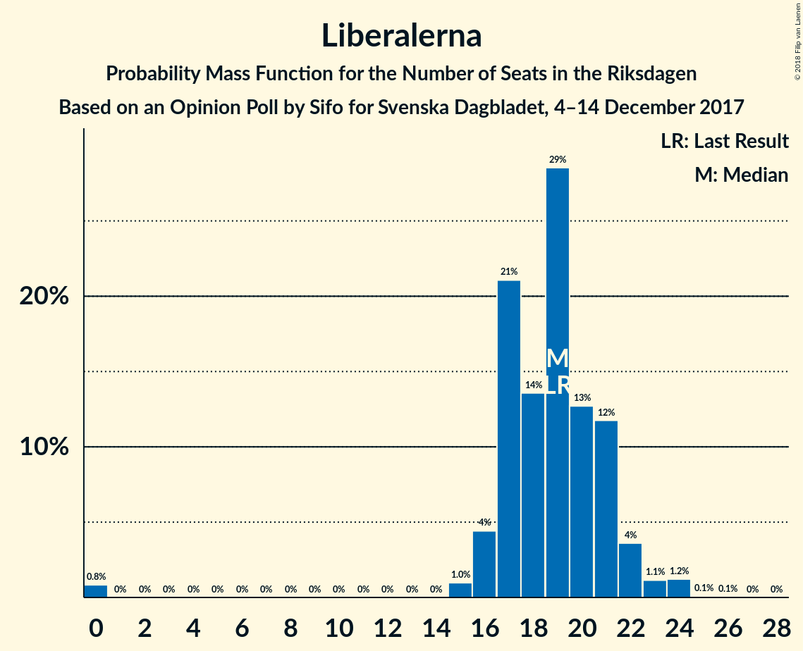

# Opinion Poll by Sifo for Svenska Dagbladet, 4–14 December 2017

<a href="#voting-intentions">Voting Intentions</a> | <a href="#seats">Seats</a> | <a href="#coalitions">Coalitions</a> | <a href="#technical-information">Technical Information</a>

## Voting Intentions

### Confidence Intervals

| Party | Last Result | Poll Result | 80% Confidence Interval | 90% Confidence Interval | 95% Confidence Interval | 99% Confidence Interval |
|:-----:|:-----------:|:-----------:|:-----------------------:|:-----------------------:|:-----------------------:|:-----------------------:|
| Sveriges socialdemokratiska arbetareparti | 31.0% | 29.3% | 28.1–30.6% |27.7–30.9% |27.4–31.3% |26.9–31.9% |
| Moderata samlingspartiet | 23.3% | 22.0% | 20.9–23.2% |20.6–23.5% |20.3–23.8% |19.8–24.4% |
| Sverigedemokraterna | 12.9% | 16.5% | 15.5–17.6% |15.2–17.9% |15.0–18.1% |14.5–18.6% |
| Centerpartiet | 6.1% | 10.2% | 9.4–11.1% |9.2–11.3% |9.0–11.6% |8.6–12.0% |
| Vänsterpartiet | 5.7% | 7.4% | 6.7–8.2% |6.5–8.4% |6.4–8.6% |6.1–8.9% |
| Liberalerna | 5.4% | 5.0% | 4.5–5.7% |4.3–5.9% |4.2–6.0% |3.9–6.3% |
| Miljöpartiet de gröna | 6.9% | 4.1% | 3.6–4.7% |3.5–4.9% |3.3–5.0% |3.1–5.3% |
| Kristdemokraterna | 4.6% | 2.7% | 2.3–3.2% |2.2–3.3% |2.1–3.5% |1.9–3.7% |
| Feministiskt initiativ | 3.1% | 1.9% | 1.6–2.3% |1.5–2.5% |1.4–2.6% |1.3–2.8% |

*Note:* The poll result column reflects the actual value used in the calculations. Published results may vary slightly, and in addition be rounded to fewer digits.

## Seats

### Confidence Intervals

| Party | Last Result | Median | 80% Confidence Interval | 90% Confidence Interval | 95% Confidence Interval | 99% Confidence Interval |
|:-----:|:-----------:|:------:|:-----------------------:|:-----------------------:|:-----------------------:|:-----------------------:|
| <a href="#sveriges-socialdemokratiska-arbetareparti">Sveriges socialdemokratiska arbetareparti</a> | 113 | 110 | 104–116 |103–118 |102–119 |98–121 |
| <a href="#moderata-samlingspartiet">Moderata samlingspartiet</a> | 84 | 82 | 78–87 |76–88 |75–89 |73–92 |
| <a href="#sverigedemokraterna">Sverigedemokraterna</a> | 49 | 61 | 58–66 |57–68 |56–69 |54–71 |
| <a href="#centerpartiet">Centerpartiet</a> | 22 | 38 | 34–42 |34–42 |33–44 |32–45 |
| <a href="#vänsterpartiet">Vänsterpartiet</a> | 21 | 28 | 25–31 |24–32 |24–33 |23–34 |
| <a href="#liberalerna">Liberalerna</a> | 19 | 19 | 17–21 |16–22 |16–23 |0–24 |
| <a href="#miljöpartiet-de-gröna">Miljöpartiet de gröna</a> | 25 | 15 | 0–17 |0–18 |0–18 |0–20 |
| <a href="#kristdemokraterna">Kristdemokraterna</a> | 16 | 0 | 0 |0 |0 |0 |
| <a href="#feministiskt-initiativ">Feministiskt initiativ</a> | 0 | 0 | 0 |0 |0 |0 |

### Sveriges socialdemokratiska arbetareparti

*For a full overview of the results for this party, see the [Sveriges socialdemokratiska arbetareparti](party-sverigessocialdemokratiskaarbetareparti.html) page.*

| Number of Seats | Probability | Accumulated | Special Marks |
|:---------------:|:-----------:|:-----------:|:-------------:|
| 97 | 0.1% | 100% |  |
| 98 | 0.5% | 99.9% |  |
| 99 | 0.2% | 99.5% |  |
| 100 | 0.3% | 99.3% |  |
| 101 | 0.5% | 99.0% |  |
| 102 | 1.3% | 98.5% |  |
| 103 | 6% | 97% |  |
| 104 | 3% | 91% |  |
| 105 | 3% | 88% |  |
| 106 | 9% | 84% |  |
| 107 | 7% | 76% |  |
| 108 | 10% | 69% |  |
| 109 | 9% | 59% |  |
| 110 | 16% | 51% | Median |
| 111 | 4% | 35% |  |
| 112 | 8% | 30% |  |
| 113 | 4% | 23% | Last Result |
| 114 | 4% | 19% |  |
| 115 | 3% | 15% |  |
| 116 | 3% | 12% |  |
| 117 | 4% | 9% |  |
| 118 | 1.4% | 6% |  |
| 119 | 3% | 5% |  |
| 120 | 1.0% | 2% |  |
| 121 | 0.6% | 1.0% |  |
| 122 | 0.1% | 0.4% |  |
| 123 | 0.1% | 0.3% |  |
| 124 | 0.1% | 0.2% |  |
| 125 | 0.1% | 0.1% |  |
| 126 | 0% | 0% |  |

### Moderata samlingspartiet

*For a full overview of the results for this party, see the [Moderata samlingspartiet](party-moderatasamlingspartiet.html) page.*

| Number of Seats | Probability | Accumulated | Special Marks |
|:---------------:|:-----------:|:-----------:|:-------------:|
| 70 | 0.1% | 100% |  |
| 71 | 0% | 99.9% |  |
| 72 | 0.3% | 99.9% |  |
| 73 | 0.1% | 99.6% |  |
| 74 | 0.9% | 99.5% |  |
| 75 | 1.3% | 98.6% |  |
| 76 | 4% | 97% |  |
| 77 | 3% | 93% |  |
| 78 | 2% | 90% |  |
| 79 | 5% | 88% |  |
| 80 | 25% | 83% |  |
| 81 | 3% | 58% |  |
| 82 | 7% | 55% | Median |
| 83 | 8% | 47% |  |
| 84 | 13% | 40% | Last Result |
| 85 | 5% | 26% |  |
| 86 | 5% | 21% |  |
| 87 | 6% | 16% |  |
| 88 | 5% | 9% |  |
| 89 | 2% | 5% |  |
| 90 | 0.4% | 2% |  |
| 91 | 0.6% | 2% |  |
| 92 | 1.2% | 1.5% |  |
| 93 | 0.1% | 0.3% |  |
| 94 | 0% | 0.2% |  |
| 95 | 0.1% | 0.2% |  |
| 96 | 0% | 0% |  |

### Sverigedemokraterna

*For a full overview of the results for this party, see the [Sverigedemokraterna](party-sverigedemokraterna.html) page.*

| Number of Seats | Probability | Accumulated | Special Marks |
|:---------------:|:-----------:|:-----------:|:-------------:|
| 49 | 0% | 100% | Last Result |
| 50 | 0% | 100% |  |
| 51 | 0% | 100% |  |
| 52 | 0.1% | 100% |  |
| 53 | 0.1% | 99.9% |  |
| 54 | 0.8% | 99.8% |  |
| 55 | 1.0% | 99.1% |  |
| 56 | 1.4% | 98% |  |
| 57 | 7% | 97% |  |
| 58 | 6% | 90% |  |
| 59 | 8% | 84% |  |
| 60 | 20% | 77% |  |
| 61 | 15% | 57% | Median |
| 62 | 6% | 42% |  |
| 63 | 11% | 35% |  |
| 64 | 8% | 25% |  |
| 65 | 5% | 17% |  |
| 66 | 6% | 12% |  |
| 67 | 1.3% | 7% |  |
| 68 | 2% | 5% |  |
| 69 | 2% | 3% |  |
| 70 | 0.7% | 1.3% |  |
| 71 | 0.2% | 0.6% |  |
| 72 | 0.2% | 0.3% |  |
| 73 | 0.1% | 0.1% |  |
| 74 | 0% | 0% |  |

### Centerpartiet

*For a full overview of the results for this party, see the [Centerpartiet](party-centerpartiet.html) page.*

| Number of Seats | Probability | Accumulated | Special Marks |
|:---------------:|:-----------:|:-----------:|:-------------:|
| 22 | 0% | 100% | Last Result |
| 23 | 0% | 100% |  |
| 24 | 0% | 100% |  |
| 25 | 0% | 100% |  |
| 26 | 0% | 100% |  |
| 27 | 0% | 100% |  |
| 28 | 0% | 100% |  |
| 29 | 0% | 100% |  |
| 30 | 0% | 100% |  |
| 31 | 0.1% | 100% |  |
| 32 | 0.6% | 99.9% |  |
| 33 | 2% | 99.3% |  |
| 34 | 8% | 97% |  |
| 35 | 16% | 89% |  |
| 36 | 5% | 73% |  |
| 37 | 9% | 68% |  |
| 38 | 13% | 58% | Median |
| 39 | 14% | 45% |  |
| 40 | 12% | 32% |  |
| 41 | 6% | 19% |  |
| 42 | 9% | 13% |  |
| 43 | 2% | 4% |  |
| 44 | 2% | 3% |  |
| 45 | 0.4% | 0.8% |  |
| 46 | 0.3% | 0.4% |  |
| 47 | 0.1% | 0.1% |  |
| 48 | 0.1% | 0.1% |  |
| 49 | 0% | 0% |  |

### Vänsterpartiet

*For a full overview of the results for this party, see the [Vänsterpartiet](party-vänsterpartiet.html) page.*

| Number of Seats | Probability | Accumulated | Special Marks |
|:---------------:|:-----------:|:-----------:|:-------------:|
| 21 | 0.2% | 100% | Last Result |
| 22 | 0.2% | 99.8% |  |
| 23 | 1.3% | 99.6% |  |
| 24 | 6% | 98% |  |
| 25 | 8% | 93% |  |
| 26 | 10% | 85% |  |
| 27 | 14% | 75% |  |
| 28 | 20% | 61% | Median |
| 29 | 24% | 41% |  |
| 30 | 6% | 17% |  |
| 31 | 4% | 11% |  |
| 32 | 4% | 7% |  |
| 33 | 2% | 3% |  |
| 34 | 0.5% | 0.7% |  |
| 35 | 0.1% | 0.2% |  |
| 36 | 0.1% | 0.1% |  |
| 37 | 0% | 0% |  |

### Liberalerna

*For a full overview of the results for this party, see the [Liberalerna](party-liberalerna.html) page.*

| Number of Seats | Probability | Accumulated | Special Marks |
|:---------------:|:-----------:|:-----------:|:-------------:|
| 0 | 0.8% | 100% |  |
| 1 | 0% | 99.2% |  |
| 2 | 0% | 99.2% |  |
| 3 | 0% | 99.2% |  |
| 4 | 0% | 99.2% |  |
| 5 | 0% | 99.2% |  |
| 6 | 0% | 99.2% |  |
| 7 | 0% | 99.2% |  |
| 8 | 0% | 99.2% |  |
| 9 | 0% | 99.2% |  |
| 10 | 0% | 99.2% |  |
| 11 | 0% | 99.2% |  |
| 12 | 0% | 99.2% |  |
| 13 | 0% | 99.2% |  |
| 14 | 0% | 99.2% |  |
| 15 | 1.0% | 99.2% |  |
| 16 | 4% | 98% |  |
| 17 | 21% | 94% |  |
| 18 | 14% | 73% |  |
| 19 | 29% | 59% | Last Result, Median |
| 20 | 13% | 31% |  |
| 21 | 12% | 18% |  |
| 22 | 4% | 6% |  |
| 23 | 1.1% | 3% |  |
| 24 | 1.2% | 1.4% |  |
| 25 | 0.1% | 0.1% |  |
| 26 | 0.1% | 0.1% |  |
| 27 | 0% | 0% |  |

### Miljöpartiet de gröna

*For a full overview of the results for this party, see the [Miljöpartiet de gröna](party-miljöpartietdegröna.html) page.*

| Number of Seats | Probability | Accumulated | Special Marks |
|:---------------:|:-----------:|:-----------:|:-------------:|
| 0 | 33% | 100% |  |
| 1 | 0% | 67% |  |
| 2 | 0% | 67% |  |
| 3 | 0% | 67% |  |
| 4 | 0% | 67% |  |
| 5 | 0% | 67% |  |
| 6 | 0% | 67% |  |
| 7 | 0% | 67% |  |
| 8 | 0% | 67% |  |
| 9 | 0% | 67% |  |
| 10 | 0% | 67% |  |
| 11 | 0% | 67% |  |
| 12 | 0% | 67% |  |
| 13 | 0% | 67% |  |
| 14 | 0% | 67% |  |
| 15 | 17% | 67% | Median |
| 16 | 31% | 49% |  |
| 17 | 13% | 19% |  |
| 18 | 4% | 6% |  |
| 19 | 2% | 2% |  |
| 20 | 0.4% | 0.5% |  |
| 21 | 0.1% | 0.1% |  |
| 22 | 0% | 0% |  |
| 23 | 0% | 0% |  |
| 24 | 0% | 0% |  |
| 25 | 0% | 0% | Last Result |

### Kristdemokraterna

*For a full overview of the results for this party, see the [Kristdemokraterna](party-kristdemokraterna.html) page.*

| Number of Seats | Probability | Accumulated | Special Marks |
|:---------------:|:-----------:|:-----------:|:-------------:|
| 0 | 100% | 100% | Median |
| 1 | 0% | 0% |  |
| 2 | 0% | 0% |  |
| 3 | 0% | 0% |  |
| 4 | 0% | 0% |  |
| 5 | 0% | 0% |  |
| 6 | 0% | 0% |  |
| 7 | 0% | 0% |  |
| 8 | 0% | 0% |  |
| 9 | 0% | 0% |  |
| 10 | 0% | 0% |  |
| 11 | 0% | 0% |  |
| 12 | 0% | 0% |  |
| 13 | 0% | 0% |  |
| 14 | 0% | 0% |  |
| 15 | 0% | 0% |  |
| 16 | 0% | 0% | Last Result |

### Feministiskt initiativ

*For a full overview of the results for this party, see the [Feministiskt initiativ](party-feministisktinitiativ.html) page.*

| Number of Seats | Probability | Accumulated | Special Marks |
|:---------------:|:-----------:|:-----------:|:-------------:|
| 0 | 100% | 100% | Last Result, Median |

## Coalitions

### Confidence Intervals

| Coalition | Last Result | Median | Majority? | 80% Confidence Interval | 90% Confidence Interval | 95% Confidence Interval | 99% Confidence Interval |
|:---------:|:-----------:|:------:|:---------:|:-----------------------:|:-----------------------:|:-----------------------:|:-----------------------:|
| Sveriges socialdemokratiska arbetareparti – Moderata samlingspartiet – Centerpartiet | 219 | 228 | 100% | 223–239 | 222–241 | 221–243 | 217–247 |
| Sveriges socialdemokratiska arbetareparti – Moderata samlingspartiet | 197 | 191 | 100% | 185–200 | 183–203 | 182–204 | 179–207 |
| Sveriges socialdemokratiska arbetareparti – Vänsterpartiet – Miljöpartiet de gröna – Feministiskt initiativ | 159 | 150 | 0% | 139–155 | 135–156 | 135–157 | 133–161 |
| Sveriges socialdemokratiska arbetareparti – Vänsterpartiet – Miljöpartiet de gröna | 159 | 150 | 0% | 139–155 | 135–156 | 135–157 | 133–161 |
| Moderata samlingspartiet – Sverigedemokraterna – Kristdemokraterna | 149 | 144 | 0% | 138–151 | 137–153 | 135–155 | 133–158 |
| Moderata samlingspartiet – Sverigedemokraterna | 133 | 144 | 0% | 138–151 | 137–153 | 135–155 | 133–158 |
| Moderata samlingspartiet – Centerpartiet – Liberalerna – Kristdemokraterna | 141 | 138 | 0% | 134–147 | 132–148 | 130–149 | 127–152 |
| Moderata samlingspartiet – Centerpartiet – Liberalerna | 125 | 138 | 0% | 134–147 | 132–148 | 130–149 | 127–152 |
| Sveriges socialdemokratiska arbetareparti – Vänsterpartiet | 134 | 137 | 0% | 131–146 | 130–147 | 129–148 | 126–151 |
| Sveriges socialdemokratiska arbetareparti – Miljöpartiet de gröna | 138 | 122 | 0% | 111–127 | 107–129 | 106–130 | 105–132 |
| Moderata samlingspartiet – Centerpartiet – Kristdemokraterna | 122 | 120 | 0% | 115–127 | 114–128 | 113–129 | 110–133 |
| Moderata samlingspartiet – Centerpartiet | 106 | 120 | 0% | 115–127 | 114–128 | 113–129 | 110–133 |

