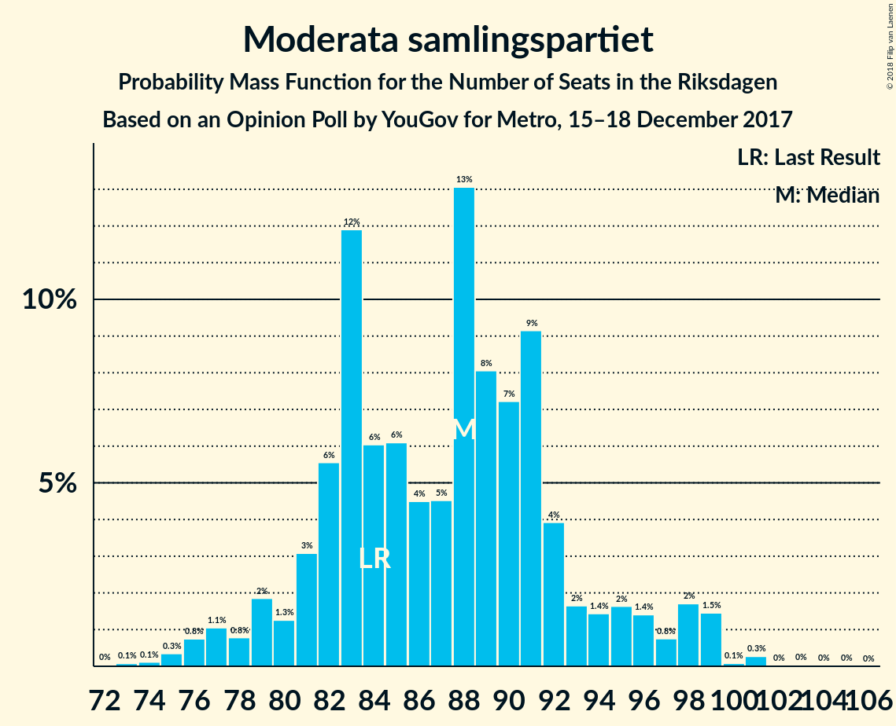
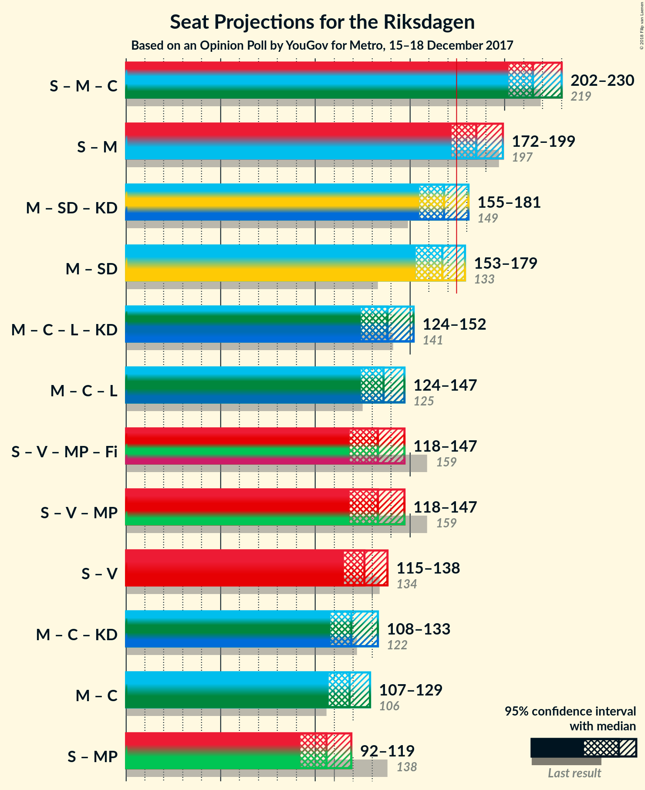

# Opinion Poll by YouGov for Metro, 15–18 December 2017

<a href="#voting-intentions">Voting Intentions</a> | <a href="#seats">Seats</a> | <a href="#coalitions">Coalitions</a> | <a href="#technical-information">Technical Information</a>

## Voting Intentions

### Confidence Intervals

| Party | Last Result | Poll Result | 80% Confidence Interval | 90% Confidence Interval | 95% Confidence Interval | 99% Confidence Interval |
|:-----:|:-----------:|:-----------:|:-----------------------:|:-----------------------:|:-----------------------:|:-----------------------:|
| Sveriges socialdemokratiska arbetareparti | 31.0% | 25.5% | 24.1–27.0% |23.7–27.4% |23.4–27.8% |22.7–28.5% |
| Moderata samlingspartiet | 23.3% | 22.7% | 21.3–24.1% |21.0–24.5% |20.6–24.9% |20.0–25.5% |
| Sverigedemokraterna | 12.9% | 20.5% | 19.2–21.9% |18.8–22.3% |18.5–22.6% |17.9–23.3% |
| Centerpartiet | 6.1% | 7.9% | 7.1–8.9% |6.9–9.2% |6.7–9.4% |6.3–9.9% |
| Vänsterpartiet | 5.7% | 7.0% | 6.2–7.9% |6.0–8.2% |5.8–8.4% |5.5–8.9% |
| Liberalerna | 5.4% | 4.9% | 4.2–5.7% |4.1–5.9% |3.9–6.1% |3.6–6.5% |
| Miljöpartiet de gröna | 6.9% | 3.9% | 3.3–4.6% |3.2–4.8% |3.0–5.0% |2.8–5.4% |
| Kristdemokraterna | 4.6% | 3.3% | 2.8–4.0% |2.6–4.2% |2.5–4.3% |2.3–4.7% |
| Feministiskt initiativ | 3.1% | 2.1% | 1.7–2.7% |1.6–2.8% |1.5–3.0% |1.3–3.3% |

*Note:* The poll result column reflects the actual value used in the calculations. Published results may vary slightly, and in addition be rounded to fewer digits.

## Seats

### Confidence Intervals

| Party | Last Result | Median | 80% Confidence Interval | 90% Confidence Interval | 95% Confidence Interval | 99% Confidence Interval |
|:-----:|:-----------:|:------:|:-----------------------:|:-----------------------:|:-----------------------:|:-----------------------:|
| <a href="#sveriges-socialdemokratiska-arbetareparti">Sveriges socialdemokratiska arbetareparti</a> | 113 | 100 | 92–106 |91–107 |88–107 |84–109 |
| <a href="#moderata-samlingspartiet">Moderata samlingspartiet</a> | 84 | 88 | 83–99 |79–99 |77–99 |75–99 |
| <a href="#sverigedemokraterna">Sverigedemokraterna</a> | 49 | 78 | 74–83 |72–85 |70–87 |67–91 |
| <a href="#centerpartiet">Centerpartiet</a> | 22 | 30 | 29–33 |28–34 |27–35 |24–38 |
| <a href="#vänsterpartiet">Vänsterpartiet</a> | 21 | 27 | 24–32 |22–32 |22–32 |21–34 |
| <a href="#liberalerna">Liberalerna</a> | 19 | 19 | 16–23 |16–23 |0–23 |0–25 |
| <a href="#miljöpartiet-de-gröna">Miljöpartiet de gröna</a> | 25 | 0 | 0–18 |0–18 |0–18 |0–20 |
| <a href="#kristdemokraterna">Kristdemokraterna</a> | 16 | 0 | 0–15 |0–16 |0–16 |0–18 |
| <a href="#feministiskt-initiativ">Feministiskt initiativ</a> | 0 | 0 | 0 |0 |0 |0 |

### Sveriges socialdemokratiska arbetareparti

*For a full overview of the results for this party, see the [Sveriges socialdemokratiska arbetareparti](party-sverigessocialdemokratiskaarbetareparti.html) page.*

| Number of Seats | Probability | Accumulated | Special Marks |
|:---------------:|:-----------:|:-----------:|:-------------:|
| 83 | 0.1% | 100% |  |
| 84 | 0.7% | 99.9% |  |
| 85 | 0.7% | 99.3% |  |
| 86 | 0.2% | 98.6% |  |
| 87 | 0.7% | 98% |  |
| 88 | 0.7% | 98% |  |
| 89 | 0.5% | 97% |  |
| 90 | 0.9% | 97% |  |
| 91 | 3% | 96% |  |
| 92 | 3% | 93% |  |
| 93 | 8% | 90% |  |
| 94 | 11% | 82% |  |
| 95 | 2% | 70% |  |
| 96 | 8% | 68% |  |
| 97 | 1.0% | 61% |  |
| 98 | 3% | 60% |  |
| 99 | 6% | 56% |  |
| 100 | 11% | 51% | Median |
| 101 | 18% | 40% |  |
| 102 | 0.7% | 22% |  |
| 103 | 2% | 21% |  |
| 104 | 0.8% | 19% |  |
| 105 | 1.1% | 18% |  |
| 106 | 10% | 17% |  |
| 107 | 5% | 7% |  |
| 108 | 1.4% | 2% |  |
| 109 | 0% | 0.5% |  |
| 110 | 0.3% | 0.5% |  |
| 111 | 0.1% | 0.2% |  |
| 112 | 0.1% | 0.2% |  |
| 113 | 0% | 0.1% | Last Result |
| 114 | 0% | 0.1% |  |
| 115 | 0% | 0.1% |  |
| 116 | 0% | 0% |  |

### Moderata samlingspartiet

*For a full overview of the results for this party, see the [Moderata samlingspartiet](party-moderatasamlingspartiet.html) page.*

| Number of Seats | Probability | Accumulated | Special Marks |
|:---------------:|:-----------:|:-----------:|:-------------:|
| 72 | 0.2% | 100% |  |
| 73 | 0.1% | 99.7% |  |
| 74 | 0% | 99.7% |  |
| 75 | 0.4% | 99.6% |  |
| 76 | 0.2% | 99.2% |  |
| 77 | 3% | 99.0% |  |
| 78 | 0.2% | 96% |  |
| 79 | 2% | 96% |  |
| 80 | 0.3% | 95% |  |
| 81 | 0.9% | 94% |  |
| 82 | 0.9% | 93% |  |
| 83 | 11% | 92% |  |
| 84 | 4% | 81% | Last Result |
| 85 | 12% | 77% |  |
| 86 | 1.1% | 65% |  |
| 87 | 2% | 63% |  |
| 88 | 13% | 62% | Median |
| 89 | 12% | 49% |  |
| 90 | 18% | 37% |  |
| 91 | 0.5% | 18% |  |
| 92 | 3% | 18% |  |
| 93 | 1.1% | 15% |  |
| 94 | 0.7% | 14% |  |
| 95 | 0.4% | 13% |  |
| 96 | 2% | 13% |  |
| 97 | 0.1% | 11% |  |
| 98 | 0.6% | 11% |  |
| 99 | 10% | 10% |  |
| 100 | 0% | 0.2% |  |
| 101 | 0% | 0.2% |  |
| 102 | 0% | 0.2% |  |
| 103 | 0.1% | 0.2% |  |
| 104 | 0% | 0% |  |

### Sverigedemokraterna

*For a full overview of the results for this party, see the [Sverigedemokraterna](party-sverigedemokraterna.html) page.*

| Number of Seats | Probability | Accumulated | Special Marks |
|:---------------:|:-----------:|:-----------:|:-------------:|
| 49 | 0% | 100% | Last Result |
| 50 | 0% | 100% |  |
| 51 | 0% | 100% |  |
| 52 | 0% | 100% |  |
| 53 | 0% | 100% |  |
| 54 | 0% | 100% |  |
| 55 | 0% | 100% |  |
| 56 | 0% | 100% |  |
| 57 | 0% | 100% |  |
| 58 | 0% | 100% |  |
| 59 | 0% | 100% |  |
| 60 | 0% | 100% |  |
| 61 | 0% | 100% |  |
| 62 | 0% | 100% |  |
| 63 | 0% | 100% |  |
| 64 | 0% | 100% |  |
| 65 | 0% | 100% |  |
| 66 | 0.1% | 99.9% |  |
| 67 | 0.5% | 99.9% |  |
| 68 | 0.1% | 99.4% |  |
| 69 | 0.3% | 99.3% |  |
| 70 | 2% | 99.0% |  |
| 71 | 1.0% | 97% |  |
| 72 | 1.2% | 96% |  |
| 73 | 0.9% | 95% |  |
| 74 | 10% | 94% |  |
| 75 | 5% | 84% |  |
| 76 | 11% | 79% |  |
| 77 | 3% | 68% |  |
| 78 | 21% | 65% | Median |
| 79 | 2% | 44% |  |
| 80 | 18% | 42% |  |
| 81 | 8% | 24% |  |
| 82 | 3% | 16% |  |
| 83 | 7% | 13% |  |
| 84 | 0.8% | 6% |  |
| 85 | 2% | 5% |  |
| 86 | 0.3% | 3% |  |
| 87 | 0.9% | 3% |  |
| 88 | 0.5% | 2% |  |
| 89 | 0.5% | 1.3% |  |
| 90 | 0.2% | 0.8% |  |
| 91 | 0.4% | 0.6% |  |
| 92 | 0.1% | 0.2% |  |
| 93 | 0% | 0.1% |  |
| 94 | 0.1% | 0.1% |  |
| 95 | 0% | 0% |  |

### Centerpartiet

*For a full overview of the results for this party, see the [Centerpartiet](party-centerpartiet.html) page.*

| Number of Seats | Probability | Accumulated | Special Marks |
|:---------------:|:-----------:|:-----------:|:-------------:|
| 22 | 0% | 100% | Last Result |
| 23 | 0.4% | 100% |  |
| 24 | 0.5% | 99.6% |  |
| 25 | 0.3% | 99.1% |  |
| 26 | 1.2% | 98.8% |  |
| 27 | 2% | 98% |  |
| 28 | 2% | 96% |  |
| 29 | 24% | 94% |  |
| 30 | 25% | 69% | Median |
| 31 | 18% | 44% |  |
| 32 | 2% | 26% |  |
| 33 | 19% | 24% |  |
| 34 | 2% | 5% |  |
| 35 | 1.0% | 3% |  |
| 36 | 0.3% | 2% |  |
| 37 | 0.9% | 2% |  |
| 38 | 0.8% | 1.0% |  |
| 39 | 0.2% | 0.3% |  |
| 40 | 0.1% | 0.1% |  |
| 41 | 0% | 0% |  |

### Vänsterpartiet

*For a full overview of the results for this party, see the [Vänsterpartiet](party-vänsterpartiet.html) page.*

| Number of Seats | Probability | Accumulated | Special Marks |
|:---------------:|:-----------:|:-----------:|:-------------:|
| 20 | 0.1% | 100% |  |
| 21 | 1.0% | 99.9% | Last Result |
| 22 | 4% | 98.9% |  |
| 23 | 4% | 94% |  |
| 24 | 8% | 91% |  |
| 25 | 5% | 83% |  |
| 26 | 19% | 78% |  |
| 27 | 13% | 59% | Median |
| 28 | 10% | 46% |  |
| 29 | 3% | 37% |  |
| 30 | 18% | 34% |  |
| 31 | 1.1% | 16% |  |
| 32 | 13% | 14% |  |
| 33 | 0.8% | 1.4% |  |
| 34 | 0.4% | 0.7% |  |
| 35 | 0.2% | 0.2% |  |
| 36 | 0% | 0.1% |  |
| 37 | 0% | 0.1% |  |
| 38 | 0% | 0% |  |

### Liberalerna

*For a full overview of the results for this party, see the [Liberalerna](party-liberalerna.html) page.*

| Number of Seats | Probability | Accumulated | Special Marks |
|:---------------:|:-----------:|:-----------:|:-------------:|
| 0 | 3% | 100% |  |
| 1 | 0% | 97% |  |
| 2 | 0% | 97% |  |
| 3 | 0% | 97% |  |
| 4 | 0% | 97% |  |
| 5 | 0% | 97% |  |
| 6 | 0% | 97% |  |
| 7 | 0% | 97% |  |
| 8 | 0% | 97% |  |
| 9 | 0% | 97% |  |
| 10 | 0% | 97% |  |
| 11 | 0% | 97% |  |
| 12 | 0% | 97% |  |
| 13 | 0% | 97% |  |
| 14 | 0% | 97% |  |
| 15 | 0.6% | 97% |  |
| 16 | 10% | 97% |  |
| 17 | 14% | 87% |  |
| 18 | 5% | 73% |  |
| 19 | 44% | 68% | Last Result, Median |
| 20 | 10% | 24% |  |
| 21 | 3% | 15% |  |
| 22 | 1.4% | 12% |  |
| 23 | 9% | 10% |  |
| 24 | 0.5% | 1.2% |  |
| 25 | 0.5% | 0.8% |  |
| 26 | 0.1% | 0.3% |  |
| 27 | 0.2% | 0.2% |  |
| 28 | 0% | 0% |  |

### Miljöpartiet de gröna

*For a full overview of the results for this party, see the [Miljöpartiet de gröna](party-miljöpartietdegröna.html) page.*

| Number of Seats | Probability | Accumulated | Special Marks |
|:---------------:|:-----------:|:-----------:|:-------------:|
| 0 | 69% | 100% | Median |
| 1 | 0% | 31% |  |
| 2 | 0% | 31% |  |
| 3 | 0% | 31% |  |
| 4 | 0% | 31% |  |
| 5 | 0% | 31% |  |
| 6 | 0% | 31% |  |
| 7 | 0% | 31% |  |
| 8 | 0% | 31% |  |
| 9 | 0% | 31% |  |
| 10 | 0% | 31% |  |
| 11 | 0% | 31% |  |
| 12 | 0% | 31% |  |
| 13 | 0% | 31% |  |
| 14 | 0% | 31% |  |
| 15 | 8% | 31% |  |
| 16 | 3% | 23% |  |
| 17 | 6% | 19% |  |
| 18 | 11% | 13% |  |
| 19 | 1.4% | 2% |  |
| 20 | 0.2% | 0.6% |  |
| 21 | 0.1% | 0.4% |  |
| 22 | 0.3% | 0.3% |  |
| 23 | 0% | 0% |  |
| 24 | 0% | 0% |  |
| 25 | 0% | 0% | Last Result |

### Kristdemokraterna

*For a full overview of the results for this party, see the [Kristdemokraterna](party-kristdemokraterna.html) page.*

| Number of Seats | Probability | Accumulated | Special Marks |
|:---------------:|:-----------:|:-----------:|:-------------:|
| 0 | 88% | 100% | Median |
| 1 | 0% | 12% |  |
| 2 | 0% | 12% |  |
| 3 | 0% | 12% |  |
| 4 | 0% | 12% |  |
| 5 | 0% | 12% |  |
| 6 | 0% | 12% |  |
| 7 | 0% | 12% |  |
| 8 | 0% | 12% |  |
| 9 | 0% | 12% |  |
| 10 | 0% | 12% |  |
| 11 | 0% | 12% |  |
| 12 | 0% | 12% |  |
| 13 | 0% | 12% |  |
| 14 | 0% | 12% |  |
| 15 | 7% | 12% |  |
| 16 | 3% | 5% | Last Result |
| 17 | 1.1% | 2% |  |
| 18 | 0.6% | 1.0% |  |
| 19 | 0.4% | 0.4% |  |
| 20 | 0% | 0% |  |

### Feministiskt initiativ

*For a full overview of the results for this party, see the [Feministiskt initiativ](party-feministisktinitiativ.html) page.*

| Number of Seats | Probability | Accumulated | Special Marks |
|:---------------:|:-----------:|:-----------:|:-------------:|
| 0 | 100% | 100% | Last Result, Median |

## Coalitions

### Confidence Intervals

| Coalition | Last Result | Median | Majority? | 80% Confidence Interval | 90% Confidence Interval | 95% Confidence Interval | 99% Confidence Interval |
|:---------:|:-----------:|:------:|:---------:|:-----------------------:|:-----------------------:|:-----------------------:|:-----------------------:|
| Sveriges socialdemokratiska arbetareparti – Moderata samlingspartiet | 197 | 190 | 93% | 177–199 | 173–199 | 169–199 | 165–203 |
| Moderata samlingspartiet – Sverigedemokraterna | 133 | 169 | 14% | 157–175 | 157–175 | 151–177 | 147–185 |
| Moderata samlingspartiet – Centerpartiet – Liberalerna – Kristdemokraterna | 141 | 142 | 0% | 133–147 | 129–150 | 126–155 | 117–155 |
| Moderata samlingspartiet – Centerpartiet – Liberalerna | 125 | 137 | 0% | 130–146 | 127–146 | 124–146 | 117–150 |
| Sveriges socialdemokratiska arbetareparti – Vänsterpartiet – Miljöpartiet de gröna – Feministiskt initiativ | 159 | 130 | 0% | 124–142 | 121–142 | 113–143 | 113–150 |
| Sveriges socialdemokratiska arbetareparti – Vänsterpartiet – Miljöpartiet de gröna | 159 | 130 | 0% | 124–142 | 121–142 | 113–143 | 113–150 |
| Sveriges socialdemokratiska arbetareparti – Vänsterpartiet | 134 | 127 | 0% | 120–138 | 114–138 | 113–138 | 110–138 |
| Moderata samlingspartiet – Centerpartiet – Kristdemokraterna | 122 | 119 | 0% | 114–129 | 113–131 | 110–135 | 107–137 |
| Moderata samlingspartiet – Centerpartiet | 106 | 118 | 0% | 114–129 | 110–129 | 107–129 | 104–130 |
| Sveriges socialdemokratiska arbetareparti – Miljöpartiet de gröna | 138 | 102 | 0% | 96–112 | 94–115 | 91–118 | 90–122 |

### Sveriges socialdemokratiska arbetareparti – Moderata samlingspartiet

| Number of Seats | Probability | Accumulated | Special Marks |
|:---------------:|:-----------:|:-----------:|:-------------:|
| 162 | 0.1% | 100% |  |
| 163 | 0.2% | 99.9% |  |
| 164 | 0.2% | 99.7% |  |
| 165 | 0% | 99.5% |  |
| 166 | 0.2% | 99.5% |  |
| 167 | 0.7% | 99.3% |  |
| 168 | 0.1% | 98.6% |  |
| 169 | 2% | 98.5% |  |
| 170 | 0.1% | 97% |  |
| 171 | 0.4% | 96% |  |
| 172 | 0.2% | 96% |  |
| 173 | 2% | 96% |  |
| 174 | 0.7% | 94% |  |
| 175 | 0.1% | 93% | Majority |
| 176 | 0.7% | 93% |  |
| 177 | 10% | 93% |  |
| 178 | 0.5% | 83% |  |
| 179 | 3% | 83% |  |
| 180 | 1.4% | 80% |  |
| 181 | 8% | 78% |  |
| 182 | 1.4% | 70% |  |
| 183 | 5% | 69% |  |
| 184 | 1.4% | 64% |  |
| 185 | 8% | 62% |  |
| 186 | 1.1% | 55% |  |
| 187 | 0.6% | 54% |  |
| 188 | 2% | 53% | Median |
| 189 | 0.5% | 51% |  |
| 190 | 2% | 51% |  |
| 191 | 29% | 48% |  |
| 192 | 0.7% | 20% |  |
| 193 | 0.8% | 19% |  |
| 194 | 0.1% | 18% |  |
| 195 | 1.3% | 18% |  |
| 196 | 6% | 17% |  |
| 197 | 0.1% | 11% | Last Result |
| 198 | 0.3% | 11% |  |
| 199 | 10% | 11% |  |
| 200 | 0.1% | 1.0% |  |
| 201 | 0.3% | 0.9% |  |
| 202 | 0% | 0.6% |  |
| 203 | 0.4% | 0.6% |  |
| 204 | 0% | 0.1% |  |
| 205 | 0% | 0.1% |  |
| 206 | 0% | 0.1% |  |
| 207 | 0% | 0.1% |  |
| 208 | 0.1% | 0.1% |  |
| 209 | 0% | 0% |  |

### Moderata samlingspartiet – Sverigedemokraterna

| Number of Seats | Probability | Accumulated | Special Marks |
|:---------------:|:-----------:|:-----------:|:-------------:|
| 133 | 0% | 100% | Last Result |
| 134 | 0% | 100% |  |
| 135 | 0% | 100% |  |
| 136 | 0% | 100% |  |
| 137 | 0% | 100% |  |
| 138 | 0% | 100% |  |
| 139 | 0% | 100% |  |
| 140 | 0% | 100% |  |
| 141 | 0.1% | 100% |  |
| 142 | 0% | 99.9% |  |
| 143 | 0% | 99.9% |  |
| 144 | 0% | 99.9% |  |
| 145 | 0% | 99.9% |  |
| 146 | 0% | 99.9% |  |
| 147 | 2% | 99.9% |  |
| 148 | 0% | 98% |  |
| 149 | 0.1% | 98% |  |
| 150 | 0.4% | 98% |  |
| 151 | 0.2% | 98% |  |
| 152 | 0.1% | 97% |  |
| 153 | 0.5% | 97% |  |
| 154 | 0.1% | 97% |  |
| 155 | 0.3% | 97% |  |
| 156 | 0.5% | 96% |  |
| 157 | 10% | 96% |  |
| 158 | 0.6% | 86% |  |
| 159 | 5% | 85% |  |
| 160 | 0.6% | 81% |  |
| 161 | 2% | 80% |  |
| 162 | 2% | 78% |  |
| 163 | 11% | 76% |  |
| 164 | 1.0% | 65% |  |
| 165 | 1.1% | 64% |  |
| 166 | 9% | 63% | Median |
| 167 | 2% | 53% |  |
| 168 | 1.2% | 52% |  |
| 169 | 4% | 50% |  |
| 170 | 22% | 47% |  |
| 171 | 0.7% | 25% |  |
| 172 | 7% | 24% |  |
| 173 | 1.5% | 17% |  |
| 174 | 1.0% | 15% |  |
| 175 | 11% | 14% | Majority |
| 176 | 0% | 3% |  |
| 177 | 2% | 3% |  |
| 178 | 0.1% | 1.4% |  |
| 179 | 0.3% | 1.3% |  |
| 180 | 0% | 1.0% |  |
| 181 | 0.1% | 0.9% |  |
| 182 | 0.1% | 0.8% |  |
| 183 | 0.1% | 0.7% |  |
| 184 | 0.1% | 0.6% |  |
| 185 | 0.1% | 0.5% |  |
| 186 | 0% | 0.5% |  |
| 187 | 0.4% | 0.4% |  |
| 188 | 0% | 0% |  |

### Moderata samlingspartiet – Centerpartiet – Liberalerna – Kristdemokraterna

| Number of Seats | Probability | Accumulated | Special Marks |
|:---------------:|:-----------:|:-----------:|:-------------:|
| 112 | 0.1% | 100% |  |
| 113 | 0% | 99.9% |  |
| 114 | 0.2% | 99.9% |  |
| 115 | 0% | 99.7% |  |
| 116 | 0% | 99.7% |  |
| 117 | 0.6% | 99.7% |  |
| 118 | 0% | 99.1% |  |
| 119 | 0.1% | 99.1% |  |
| 120 | 0.4% | 99.0% |  |
| 121 | 0.1% | 98.6% |  |
| 122 | 0% | 98.6% |  |
| 123 | 0.2% | 98.5% |  |
| 124 | 0.3% | 98% |  |
| 125 | 0.3% | 98% |  |
| 126 | 0.6% | 98% |  |
| 127 | 1.3% | 97% |  |
| 128 | 0.2% | 96% |  |
| 129 | 0.9% | 96% |  |
| 130 | 1.1% | 95% |  |
| 131 | 0.6% | 94% |  |
| 132 | 0.1% | 93% |  |
| 133 | 27% | 93% |  |
| 134 | 0.9% | 66% |  |
| 135 | 2% | 65% |  |
| 136 | 2% | 63% |  |
| 137 | 5% | 61% | Median |
| 138 | 1.0% | 56% |  |
| 139 | 1.3% | 55% |  |
| 140 | 0.7% | 54% |  |
| 141 | 1.3% | 53% | Last Result |
| 142 | 26% | 52% |  |
| 143 | 2% | 25% |  |
| 144 | 0.7% | 23% |  |
| 145 | 1.5% | 22% |  |
| 146 | 11% | 21% |  |
| 147 | 0.8% | 10% |  |
| 148 | 0.2% | 9% |  |
| 149 | 1.5% | 9% |  |
| 150 | 3% | 8% |  |
| 151 | 0.5% | 4% |  |
| 152 | 0.1% | 4% |  |
| 153 | 0.1% | 4% |  |
| 154 | 0.1% | 4% |  |
| 155 | 3% | 3% |  |
| 156 | 0.1% | 0.4% |  |
| 157 | 0.1% | 0.3% |  |
| 158 | 0% | 0.2% |  |
| 159 | 0.1% | 0.2% |  |
| 160 | 0% | 0.1% |  |
| 161 | 0.1% | 0.1% |  |
| 162 | 0% | 0% |  |

### Moderata samlingspartiet – Centerpartiet – Liberalerna

| Number of Seats | Probability | Accumulated | Special Marks |
|:---------------:|:-----------:|:-----------:|:-------------:|
| 112 | 0.1% | 100% |  |
| 113 | 0% | 99.9% |  |
| 114 | 0.3% | 99.9% |  |
| 115 | 0% | 99.7% |  |
| 116 | 0% | 99.6% |  |
| 117 | 0.7% | 99.6% |  |
| 118 | 0.1% | 99.0% |  |
| 119 | 0.1% | 98.9% |  |
| 120 | 0.4% | 98.8% |  |
| 121 | 0.2% | 98% |  |
| 122 | 0.3% | 98% |  |
| 123 | 0.3% | 98% |  |
| 124 | 0.4% | 98% |  |
| 125 | 0.3% | 97% | Last Result |
| 126 | 0.7% | 97% |  |
| 127 | 3% | 96% |  |
| 128 | 0.3% | 93% |  |
| 129 | 1.0% | 92% |  |
| 130 | 2% | 91% |  |
| 131 | 0.8% | 89% |  |
| 132 | 0.7% | 89% |  |
| 133 | 27% | 88% |  |
| 134 | 0.9% | 61% |  |
| 135 | 5% | 60% |  |
| 136 | 2% | 54% |  |
| 137 | 5% | 53% | Median |
| 138 | 1.3% | 48% |  |
| 139 | 4% | 47% |  |
| 140 | 0.7% | 43% |  |
| 141 | 1.3% | 42% |  |
| 142 | 25% | 41% |  |
| 143 | 2% | 16% |  |
| 144 | 0.6% | 14% |  |
| 145 | 0.8% | 13% |  |
| 146 | 10% | 13% |  |
| 147 | 0.3% | 2% |  |
| 148 | 0.1% | 2% |  |
| 149 | 1.1% | 2% |  |
| 150 | 0.6% | 0.9% |  |
| 151 | 0.1% | 0.3% |  |
| 152 | 0.1% | 0.2% |  |
| 153 | 0% | 0.2% |  |
| 154 | 0.1% | 0.1% |  |
| 155 | 0% | 0% |  |

### Sveriges socialdemokratiska arbetareparti – Vänsterpartiet – Miljöpartiet de gröna – Feministiskt initiativ

| Number of Seats | Probability | Accumulated | Special Marks |
|:---------------:|:-----------:|:-----------:|:-------------:|
| 111 | 0.1% | 100% |  |
| 112 | 0% | 99.9% |  |
| 113 | 3% | 99.9% |  |
| 114 | 0.2% | 97% |  |
| 115 | 0% | 97% |  |
| 116 | 0.2% | 97% |  |
| 117 | 0.1% | 97% |  |
| 118 | 0.2% | 97% |  |
| 119 | 0.4% | 97% |  |
| 120 | 0.8% | 96% |  |
| 121 | 1.5% | 95% |  |
| 122 | 0.8% | 94% |  |
| 123 | 2% | 93% |  |
| 124 | 10% | 91% |  |
| 125 | 0.2% | 81% |  |
| 126 | 0.9% | 81% |  |
| 127 | 28% | 80% | Median |
| 128 | 1.0% | 52% |  |
| 129 | 1.2% | 51% |  |
| 130 | 2% | 50% |  |
| 131 | 5% | 49% |  |
| 132 | 2% | 44% |  |
| 133 | 1.1% | 42% |  |
| 134 | 0.9% | 41% |  |
| 135 | 3% | 40% |  |
| 136 | 0.3% | 37% |  |
| 137 | 3% | 37% |  |
| 138 | 18% | 34% |  |
| 139 | 0.6% | 16% |  |
| 140 | 2% | 15% |  |
| 141 | 1.2% | 13% |  |
| 142 | 9% | 12% |  |
| 143 | 0.4% | 3% |  |
| 144 | 0.2% | 2% |  |
| 145 | 0.1% | 2% |  |
| 146 | 0.3% | 2% |  |
| 147 | 0.9% | 2% |  |
| 148 | 0.3% | 0.9% |  |
| 149 | 0.1% | 0.6% |  |
| 150 | 0% | 0.5% |  |
| 151 | 0.3% | 0.5% |  |
| 152 | 0.1% | 0.2% |  |
| 153 | 0% | 0.1% |  |
| 154 | 0% | 0.1% |  |
| 155 | 0.1% | 0.1% |  |
| 156 | 0% | 0% |  |
| 157 | 0% | 0% |  |
| 158 | 0% | 0% |  |
| 159 | 0% | 0% | Last Result |

### Sveriges socialdemokratiska arbetareparti – Vänsterpartiet – Miljöpartiet de gröna

| Number of Seats | Probability | Accumulated | Special Marks |
|:---------------:|:-----------:|:-----------:|:-------------:|
| 111 | 0.1% | 100% |  |
| 112 | 0% | 99.9% |  |
| 113 | 3% | 99.9% |  |
| 114 | 0.2% | 97% |  |
| 115 | 0% | 97% |  |
| 116 | 0.2% | 97% |  |
| 117 | 0.1% | 97% |  |
| 118 | 0.2% | 97% |  |
| 119 | 0.4% | 97% |  |
| 120 | 0.8% | 96% |  |
| 121 | 1.5% | 95% |  |
| 122 | 0.8% | 94% |  |
| 123 | 2% | 93% |  |
| 124 | 10% | 91% |  |
| 125 | 0.2% | 81% |  |
| 126 | 0.9% | 81% |  |
| 127 | 28% | 80% | Median |
| 128 | 1.0% | 52% |  |
| 129 | 1.2% | 51% |  |
| 130 | 2% | 50% |  |
| 131 | 5% | 49% |  |
| 132 | 2% | 44% |  |
| 133 | 1.1% | 42% |  |
| 134 | 0.9% | 41% |  |
| 135 | 3% | 40% |  |
| 136 | 0.3% | 37% |  |
| 137 | 3% | 37% |  |
| 138 | 18% | 34% |  |
| 139 | 0.6% | 16% |  |
| 140 | 2% | 15% |  |
| 141 | 1.2% | 13% |  |
| 142 | 9% | 12% |  |
| 143 | 0.4% | 3% |  |
| 144 | 0.2% | 2% |  |
| 145 | 0.1% | 2% |  |
| 146 | 0.3% | 2% |  |
| 147 | 0.9% | 2% |  |
| 148 | 0.3% | 0.9% |  |
| 149 | 0.1% | 0.6% |  |
| 150 | 0% | 0.5% |  |
| 151 | 0.3% | 0.5% |  |
| 152 | 0.1% | 0.2% |  |
| 153 | 0% | 0.1% |  |
| 154 | 0% | 0.1% |  |
| 155 | 0.1% | 0.1% |  |
| 156 | 0% | 0% |  |
| 157 | 0% | 0% |  |
| 158 | 0% | 0% |  |
| 159 | 0% | 0% | Last Result |

### Sveriges socialdemokratiska arbetareparti – Vänsterpartiet

| Number of Seats | Probability | Accumulated | Special Marks |
|:---------------:|:-----------:|:-----------:|:-------------:|
| 109 | 0.1% | 100% |  |
| 110 | 0.4% | 99.9% |  |
| 111 | 0.5% | 99.5% |  |
| 112 | 1.0% | 99.0% |  |
| 113 | 3% | 98% |  |
| 114 | 0.9% | 95% |  |
| 115 | 0.2% | 94% |  |
| 116 | 1.0% | 94% |  |
| 117 | 1.0% | 93% |  |
| 118 | 0.4% | 92% |  |
| 119 | 1.4% | 92% |  |
| 120 | 3% | 90% |  |
| 121 | 2% | 88% |  |
| 122 | 2% | 86% |  |
| 123 | 11% | 84% |  |
| 124 | 19% | 73% |  |
| 125 | 0.9% | 53% |  |
| 126 | 0.9% | 52% |  |
| 127 | 28% | 51% | Median |
| 128 | 0.7% | 24% |  |
| 129 | 0.9% | 23% |  |
| 130 | 2% | 22% |  |
| 131 | 5% | 21% |  |
| 132 | 1.0% | 15% |  |
| 133 | 0.6% | 15% |  |
| 134 | 0.7% | 14% | Last Result |
| 135 | 2% | 13% |  |
| 136 | 0.1% | 11% |  |
| 137 | 0.2% | 11% |  |
| 138 | 10% | 10% |  |
| 139 | 0.1% | 0.5% |  |
| 140 | 0.2% | 0.4% |  |
| 141 | 0% | 0.2% |  |
| 142 | 0.1% | 0.1% |  |
| 143 | 0% | 0.1% |  |
| 144 | 0% | 0.1% |  |
| 145 | 0% | 0% |  |

### Moderata samlingspartiet – Centerpartiet – Kristdemokraterna

| Number of Seats | Probability | Accumulated | Special Marks |
|:---------------:|:-----------:|:-----------:|:-------------:|
| 103 | 0.2% | 100% |  |
| 104 | 0% | 99.8% |  |
| 105 | 0.1% | 99.7% |  |
| 106 | 0% | 99.6% |  |
| 107 | 0.8% | 99.6% |  |
| 108 | 0.2% | 98.8% |  |
| 109 | 0.2% | 98.6% |  |
| 110 | 1.4% | 98% |  |
| 111 | 0.8% | 97% |  |
| 112 | 0.7% | 96% |  |
| 113 | 0.8% | 96% |  |
| 114 | 19% | 95% |  |
| 115 | 1.2% | 75% |  |
| 116 | 0.6% | 74% |  |
| 117 | 11% | 74% |  |
| 118 | 6% | 63% | Median |
| 119 | 8% | 57% |  |
| 120 | 2% | 49% |  |
| 121 | 1.0% | 48% |  |
| 122 | 3% | 47% | Last Result |
| 123 | 18% | 43% |  |
| 124 | 2% | 25% |  |
| 125 | 0.9% | 24% |  |
| 126 | 2% | 23% |  |
| 127 | 0.7% | 21% |  |
| 128 | 1.2% | 20% |  |
| 129 | 10% | 19% |  |
| 130 | 4% | 9% |  |
| 131 | 0.5% | 5% |  |
| 132 | 0.5% | 4% |  |
| 133 | 0.3% | 4% |  |
| 134 | 0.1% | 4% |  |
| 135 | 3% | 4% |  |
| 136 | 0% | 0.9% |  |
| 137 | 0.4% | 0.9% |  |
| 138 | 0% | 0.5% |  |
| 139 | 0.1% | 0.5% |  |
| 140 | 0.1% | 0.3% |  |
| 141 | 0% | 0.2% |  |
| 142 | 0% | 0.2% |  |
| 143 | 0% | 0.2% |  |
| 144 | 0% | 0.2% |  |
| 145 | 0.2% | 0.2% |  |
| 146 | 0% | 0% |  |

### Moderata samlingspartiet – Centerpartiet

| Number of Seats | Probability | Accumulated | Special Marks |
|:---------------:|:-----------:|:-----------:|:-------------:|
| 101 | 0.1% | 100% |  |
| 102 | 0% | 99.9% |  |
| 103 | 0.3% | 99.9% |  |
| 104 | 0.2% | 99.6% |  |
| 105 | 0.2% | 99.3% |  |
| 106 | 0.1% | 99.1% | Last Result |
| 107 | 3% | 99.1% |  |
| 108 | 0.4% | 96% |  |
| 109 | 0.4% | 96% |  |
| 110 | 2% | 96% |  |
| 111 | 1.0% | 94% |  |
| 112 | 0.8% | 93% |  |
| 113 | 2% | 92% |  |
| 114 | 19% | 90% |  |
| 115 | 4% | 71% |  |
| 116 | 1.1% | 66% |  |
| 117 | 11% | 65% |  |
| 118 | 6% | 55% | Median |
| 119 | 10% | 49% |  |
| 120 | 2% | 39% |  |
| 121 | 0.9% | 36% |  |
| 122 | 2% | 35% |  |
| 123 | 18% | 34% |  |
| 124 | 1.4% | 16% |  |
| 125 | 0.8% | 15% |  |
| 126 | 2% | 14% |  |
| 127 | 0.7% | 12% |  |
| 128 | 0.1% | 11% |  |
| 129 | 10% | 11% |  |
| 130 | 0.6% | 1.0% |  |
| 131 | 0% | 0.3% |  |
| 132 | 0.1% | 0.3% |  |
| 133 | 0.1% | 0.2% |  |
| 134 | 0.1% | 0.1% |  |
| 135 | 0% | 0.1% |  |
| 136 | 0% | 0% |  |

### Sveriges socialdemokratiska arbetareparti – Miljöpartiet de gröna

| Number of Seats | Probability | Accumulated | Special Marks |
|:---------------:|:-----------:|:-----------:|:-------------:|
| 86 | 0.1% | 100% |  |
| 87 | 0% | 99.9% |  |
| 88 | 0.1% | 99.9% |  |
| 89 | 0.2% | 99.8% |  |
| 90 | 0.7% | 99.7% |  |
| 91 | 3% | 99.0% |  |
| 92 | 0.1% | 96% |  |
| 93 | 0.4% | 96% |  |
| 94 | 0.9% | 96% |  |
| 95 | 1.3% | 95% |  |
| 96 | 7% | 94% |  |
| 97 | 0.5% | 86% |  |
| 98 | 2% | 86% |  |
| 99 | 4% | 84% |  |
| 100 | 10% | 79% | Median |
| 101 | 18% | 69% |  |
| 102 | 1.5% | 51% |  |
| 103 | 2% | 50% |  |
| 104 | 1.1% | 47% |  |
| 105 | 1.3% | 46% |  |
| 106 | 10% | 45% |  |
| 107 | 5% | 34% |  |
| 108 | 9% | 29% |  |
| 109 | 3% | 20% |  |
| 110 | 0.9% | 18% |  |
| 111 | 1.4% | 17% |  |
| 112 | 9% | 16% |  |
| 113 | 0.6% | 7% |  |
| 114 | 0.6% | 6% |  |
| 115 | 0.5% | 5% |  |
| 116 | 2% | 5% |  |
| 117 | 0.6% | 3% |  |
| 118 | 1.2% | 3% |  |
| 119 | 0.6% | 2% |  |
| 120 | 0.1% | 0.9% |  |
| 121 | 0% | 0.8% |  |
| 122 | 0.3% | 0.8% |  |
| 123 | 0.1% | 0.5% |  |
| 124 | 0% | 0.4% |  |
| 125 | 0.3% | 0.4% |  |
| 126 | 0% | 0% |  |
| 127 | 0% | 0% |  |
| 128 | 0% | 0% |  |
| 129 | 0% | 0% |  |
| 130 | 0% | 0% |  |
| 131 | 0% | 0% |  |
| 132 | 0% | 0% |  |
| 133 | 0% | 0% |  |
| 134 | 0% | 0% |  |
| 135 | 0% | 0% |  |
| 136 | 0% | 0% |  |
| 137 | 0% | 0% |  |
| 138 | 0% | 0% | Last Result |

## Technical Information

### Opinion Poll

+ **Polling firm:** YouGov
+ **Commissioner(s):** Metro
+ **Fieldwork period:** 15–18 December 2017

### Calculations

+ **Sample size:** 1513
+ **Simulations done:** 131,072
+ **Error estimate:** 1.22%

