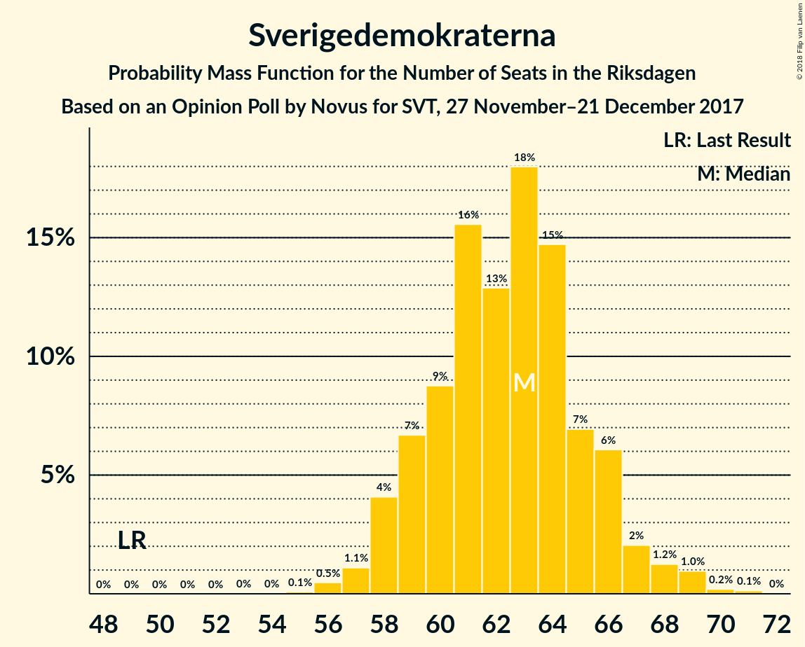
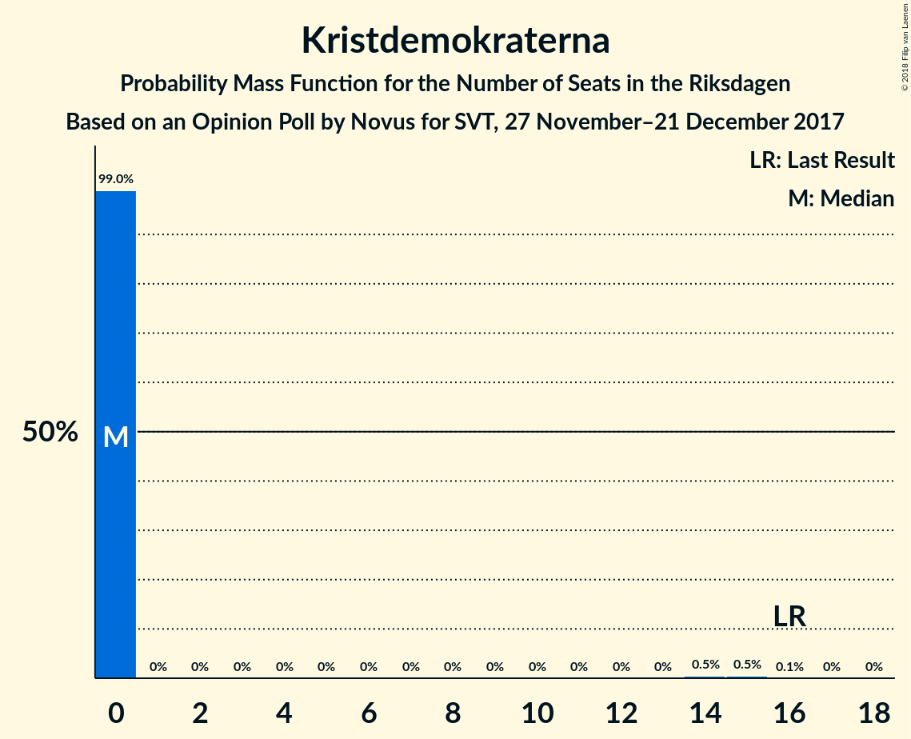

# Opinion Poll by Novus for SVT, 27 November–21 December 2017

<a href="#voting-intentions">Voting Intentions</a> | <a href="#seats">Seats</a> | <a href="#coalitions">Coalitions</a> | <a href="#technical-information">Technical Information</a>

## Voting Intentions

### Confidence Intervals

| Party | Last Result | Poll Result | 80% Confidence Interval | 90% Confidence Interval | 95% Confidence Interval | 99% Confidence Interval |
|:-----:|:-----------:|:-----------:|:-----------------------:|:-----------------------:|:-----------------------:|:-----------------------:|
| Sveriges socialdemokratiska arbetareparti | 31.0% | 29.5% | 28.6–30.4% |28.3–30.7% |28.1–30.9% |27.7–31.4% |
| Moderata samlingspartiet | 23.3% | 21.3% | 20.5–22.2% |20.3–22.4% |20.1–22.6% |19.7–23.0% |
| Sverigedemokraterna | 12.9% | 16.8% | 16.0–17.6% |15.8–17.8% |15.7–18.0% |15.3–18.4% |
| Centerpartiet | 6.1% | 9.8% | 9.2–10.4% |9.1–10.6% |8.9–10.8% |8.6–11.1% |
| Vänsterpartiet | 5.7% | 7.5% | 7.0–8.1% |6.8–8.2% |6.7–8.4% |6.5–8.7% |
| Liberalerna | 5.4% | 5.4% | 5.0–5.9% |4.8–6.0% |4.7–6.1% |4.5–6.4% |
| Miljöpartiet de gröna | 6.9% | 4.3% | 3.9–4.7% |3.8–4.9% |3.7–5.0% |3.5–5.2% |
| Kristdemokraterna | 4.6% | 3.3% | 3.0–3.7% |2.9–3.8% |2.8–3.9% |2.6–4.1% |

*Note:* The poll result column reflects the actual value used in the calculations. Published results may vary slightly, and in addition be rounded to fewer digits.

## Seats

### Confidence Intervals

| Party | Last Result | Median | 80% Confidence Interval | 90% Confidence Interval | 95% Confidence Interval | 99% Confidence Interval |
|:-----:|:-----------:|:------:|:-----------------------:|:-----------------------:|:-----------------------:|:-----------------------:|
| <a href="#sveriges-socialdemokratiska-arbetareparti">Sveriges socialdemokratiska arbetareparti</a> | 113 | 109 | 105–114 |104–115 |104–116 |102–119 |
| <a href="#moderata-samlingspartiet">Moderata samlingspartiet</a> | 84 | 79 | 76–83 |75–84 |74–85 |73–87 |
| <a href="#sverigedemokraterna">Sverigedemokraterna</a> | 49 | 63 | 59–66 |58–66 |58–68 |56–69 |
| <a href="#centerpartiet">Centerpartiet</a> | 22 | 36 | 34–39 |33–40 |33–40 |32–42 |
| <a href="#vänsterpartiet">Vänsterpartiet</a> | 21 | 28 | 26–30 |25–31 |25–31 |24–32 |
| <a href="#liberalerna">Liberalerna</a> | 19 | 20 | 18–22 |18–22 |18–23 |17–24 |
| <a href="#miljöpartiet-de-gröna">Miljöpartiet de gröna</a> | 25 | 16 | 0–17 |0–18 |0–18 |0–19 |
| <a href="#kristdemokraterna">Kristdemokraterna</a> | 16 | 0 | 0 |0 |0 |0–15 |

### Sveriges socialdemokratiska arbetareparti

*For a full overview of the results for this party, see the [Sveriges socialdemokratiska arbetareparti](party-sverigessocialdemokratiskaarbetareparti.html) page.*

| Number of Seats | Probability | Accumulated | Special Marks |
|:---------------:|:-----------:|:-----------:|:-------------:|
| 100 | 0.1% | 100% |  |
| 101 | 0.2% | 99.9% |  |
| 102 | 0.6% | 99.7% |  |
| 103 | 2% | 99.1% |  |
| 104 | 4% | 98% |  |
| 105 | 6% | 94% |  |
| 106 | 6% | 88% |  |
| 107 | 10% | 82% |  |
| 108 | 18% | 72% |  |
| 109 | 12% | 54% | Median |
| 110 | 9% | 42% |  |
| 111 | 9% | 33% |  |
| 112 | 6% | 25% |  |
| 113 | 7% | 18% | Last Result |
| 114 | 3% | 11% |  |
| 115 | 3% | 8% |  |
| 116 | 3% | 5% |  |
| 117 | 0.6% | 2% |  |
| 118 | 0.3% | 1.1% |  |
| 119 | 0.3% | 0.7% |  |
| 120 | 0.3% | 0.4% |  |
| 121 | 0.1% | 0.2% |  |
| 122 | 0% | 0% |  |

### Moderata samlingspartiet

*For a full overview of the results for this party, see the [Moderata samlingspartiet](party-moderatasamlingspartiet.html) page.*

| Number of Seats | Probability | Accumulated | Special Marks |
|:---------------:|:-----------:|:-----------:|:-------------:|
| 71 | 0.1% | 100% |  |
| 72 | 0.3% | 99.8% |  |
| 73 | 2% | 99.5% |  |
| 74 | 2% | 98% |  |
| 75 | 5% | 96% |  |
| 76 | 8% | 90% |  |
| 77 | 12% | 82% |  |
| 78 | 14% | 71% |  |
| 79 | 12% | 57% | Median |
| 80 | 13% | 44% |  |
| 81 | 13% | 31% |  |
| 82 | 7% | 18% |  |
| 83 | 4% | 11% |  |
| 84 | 4% | 7% | Last Result |
| 85 | 1.2% | 3% |  |
| 86 | 1.0% | 2% |  |
| 87 | 0.5% | 1.0% |  |
| 88 | 0.4% | 0.4% |  |
| 89 | 0% | 0.1% |  |
| 90 | 0% | 0% |  |

### Sverigedemokraterna

*For a full overview of the results for this party, see the [Sverigedemokraterna](party-sverigedemokraterna.html) page.*

| Number of Seats | Probability | Accumulated | Special Marks |
|:---------------:|:-----------:|:-----------:|:-------------:|
| 49 | 0% | 100% | Last Result |
| 50 | 0% | 100% |  |
| 51 | 0% | 100% |  |
| 52 | 0% | 100% |  |
| 53 | 0% | 100% |  |
| 54 | 0% | 100% |  |
| 55 | 0.1% | 100% |  |
| 56 | 0.5% | 99.9% |  |
| 57 | 1.1% | 99.4% |  |
| 58 | 4% | 98% |  |
| 59 | 7% | 94% |  |
| 60 | 9% | 88% |  |
| 61 | 16% | 79% |  |
| 62 | 13% | 63% |  |
| 63 | 18% | 50% | Median |
| 64 | 15% | 32% |  |
| 65 | 7% | 18% |  |
| 66 | 6% | 11% |  |
| 67 | 2% | 5% |  |
| 68 | 1.2% | 3% |  |
| 69 | 1.0% | 1.3% |  |
| 70 | 0.2% | 0.4% |  |
| 71 | 0.1% | 0.2% |  |
| 72 | 0% | 0% |  |

### Centerpartiet

*For a full overview of the results for this party, see the [Centerpartiet](party-centerpartiet.html) page.*

| Number of Seats | Probability | Accumulated | Special Marks |
|:---------------:|:-----------:|:-----------:|:-------------:|
| 22 | 0% | 100% | Last Result |
| 23 | 0% | 100% |  |
| 24 | 0% | 100% |  |
| 25 | 0% | 100% |  |
| 26 | 0% | 100% |  |
| 27 | 0% | 100% |  |
| 28 | 0% | 100% |  |
| 29 | 0% | 100% |  |
| 30 | 0% | 100% |  |
| 31 | 0.3% | 100% |  |
| 32 | 0.8% | 99.7% |  |
| 33 | 5% | 98.9% |  |
| 34 | 11% | 94% |  |
| 35 | 16% | 83% |  |
| 36 | 24% | 67% | Median |
| 37 | 16% | 44% |  |
| 38 | 14% | 28% |  |
| 39 | 9% | 14% |  |
| 40 | 3% | 5% |  |
| 41 | 2% | 2% |  |
| 42 | 0.4% | 0.5% |  |
| 43 | 0.1% | 0.1% |  |
| 44 | 0% | 0% |  |

### Vänsterpartiet

*For a full overview of the results for this party, see the [Vänsterpartiet](party-vänsterpartiet.html) page.*

| Number of Seats | Probability | Accumulated | Special Marks |
|:---------------:|:-----------:|:-----------:|:-------------:|
| 21 | 0% | 100% | Last Result |
| 22 | 0% | 100% |  |
| 23 | 0.1% | 100% |  |
| 24 | 1.2% | 99.8% |  |
| 25 | 5% | 98.7% |  |
| 26 | 11% | 94% |  |
| 27 | 25% | 83% |  |
| 28 | 23% | 58% | Median |
| 29 | 19% | 36% |  |
| 30 | 10% | 16% |  |
| 31 | 4% | 6% |  |
| 32 | 2% | 2% |  |
| 33 | 0.3% | 0.4% |  |
| 34 | 0.1% | 0.1% |  |
| 35 | 0% | 0% |  |

### Liberalerna

*For a full overview of the results for this party, see the [Liberalerna](party-liberalerna.html) page.*

| Number of Seats | Probability | Accumulated | Special Marks |
|:---------------:|:-----------:|:-----------:|:-------------:|
| 16 | 0.3% | 100% |  |
| 17 | 2% | 99.7% |  |
| 18 | 11% | 98% |  |
| 19 | 20% | 87% | Last Result |
| 20 | 34% | 67% | Median |
| 21 | 19% | 33% |  |
| 22 | 9% | 14% |  |
| 23 | 4% | 5% |  |
| 24 | 0.6% | 0.8% |  |
| 25 | 0.2% | 0.2% |  |
| 26 | 0% | 0% |  |

### Miljöpartiet de gröna

*For a full overview of the results for this party, see the [Miljöpartiet de gröna](party-miljöpartietdegröna.html) page.*

| Number of Seats | Probability | Accumulated | Special Marks |
|:---------------:|:-----------:|:-----------:|:-------------:|
| 0 | 16% | 100% |  |
| 1 | 0% | 84% |  |
| 2 | 0% | 84% |  |
| 3 | 0% | 84% |  |
| 4 | 0% | 84% |  |
| 5 | 0% | 84% |  |
| 6 | 0% | 84% |  |
| 7 | 0% | 84% |  |
| 8 | 0% | 84% |  |
| 9 | 0% | 84% |  |
| 10 | 0% | 84% |  |
| 11 | 0% | 84% |  |
| 12 | 0% | 84% |  |
| 13 | 0% | 84% |  |
| 14 | 0% | 84% |  |
| 15 | 24% | 84% |  |
| 16 | 30% | 61% | Median |
| 17 | 22% | 30% |  |
| 18 | 7% | 9% |  |
| 19 | 1.4% | 2% |  |
| 20 | 0.2% | 0.2% |  |
| 21 | 0% | 0% |  |
| 22 | 0% | 0% |  |
| 23 | 0% | 0% |  |
| 24 | 0% | 0% |  |
| 25 | 0% | 0% | Last Result |

### Kristdemokraterna

*For a full overview of the results for this party, see the [Kristdemokraterna](party-kristdemokraterna.html) page.*

| Number of Seats | Probability | Accumulated | Special Marks |
|:---------------:|:-----------:|:-----------:|:-------------:|
| 0 | 99.0% | 100% | Median |
| 1 | 0% | 1.0% |  |
| 2 | 0% | 1.0% |  |
| 3 | 0% | 1.0% |  |
| 4 | 0% | 1.0% |  |
| 5 | 0% | 1.0% |  |
| 6 | 0% | 1.0% |  |
| 7 | 0% | 1.0% |  |
| 8 | 0% | 1.0% |  |
| 9 | 0% | 1.0% |  |
| 10 | 0% | 1.0% |  |
| 11 | 0% | 1.0% |  |
| 12 | 0% | 1.0% |  |
| 13 | 0% | 1.0% |  |
| 14 | 0.5% | 1.0% |  |
| 15 | 0.5% | 0.6% |  |
| 16 | 0.1% | 0.1% | Last Result |
| 17 | 0% | 0% |  |

## Coalitions

### Confidence Intervals

| Coalition | Last Result | Median | Majority? | 80% Confidence Interval | 90% Confidence Interval | 95% Confidence Interval | 99% Confidence Interval |
|:---------:|:-----------:|:------:|:---------:|:-----------------------:|:-----------------------:|:-----------------------:|:-----------------------:|
| Sveriges socialdemokratiska arbetareparti – Moderata samlingspartiet – Centerpartiet | 219 | 224 | 100% | 220–233 | 218–236 | 218–237 | 215–240 |
| Sveriges socialdemokratiska arbetareparti – Moderata samlingspartiet | 197 | 188 | 100% | 183–195 | 182–198 | 181–199 | 179–202 |
| Sveriges socialdemokratiska arbetareparti – Vänsterpartiet – Miljöpartiet de gröna | 159 | 151 | 0% | 144–156 | 141–157 | 140–158 | 138–160 |
| Moderata samlingspartiet – Sverigedemokraterna – Kristdemokraterna | 149 | 141 | 0% | 137–147 | 136–149 | 135–151 | 133–153 |
| Moderata samlingspartiet – Sverigedemokraterna | 133 | 141 | 0% | 137–147 | 136–149 | 135–150 | 133–153 |
| Sveriges socialdemokratiska arbetareparti – Vänsterpartiet | 134 | 137 | 0% | 133–142 | 132–145 | 131–145 | 129–148 |
| Moderata samlingspartiet – Centerpartiet – Liberalerna – Kristdemokraterna | 141 | 135 | 0% | 131–141 | 131–143 | 129–145 | 128–148 |
| Moderata samlingspartiet – Centerpartiet – Liberalerna | 125 | 135 | 0% | 131–141 | 130–143 | 129–144 | 127–146 |
| Sveriges socialdemokratiska arbetareparti – Miljöpartiet de gröna | 138 | 124 | 0% | 115–128 | 112–129 | 111–130 | 109–132 |
| Moderata samlingspartiet – Centerpartiet – Kristdemokraterna | 122 | 116 | 0% | 112–120 | 110–122 | 110–124 | 108–127 |
| Moderata samlingspartiet – Centerpartiet | 106 | 115 | 0% | 112–120 | 110–122 | 109–123 | 108–126 |

