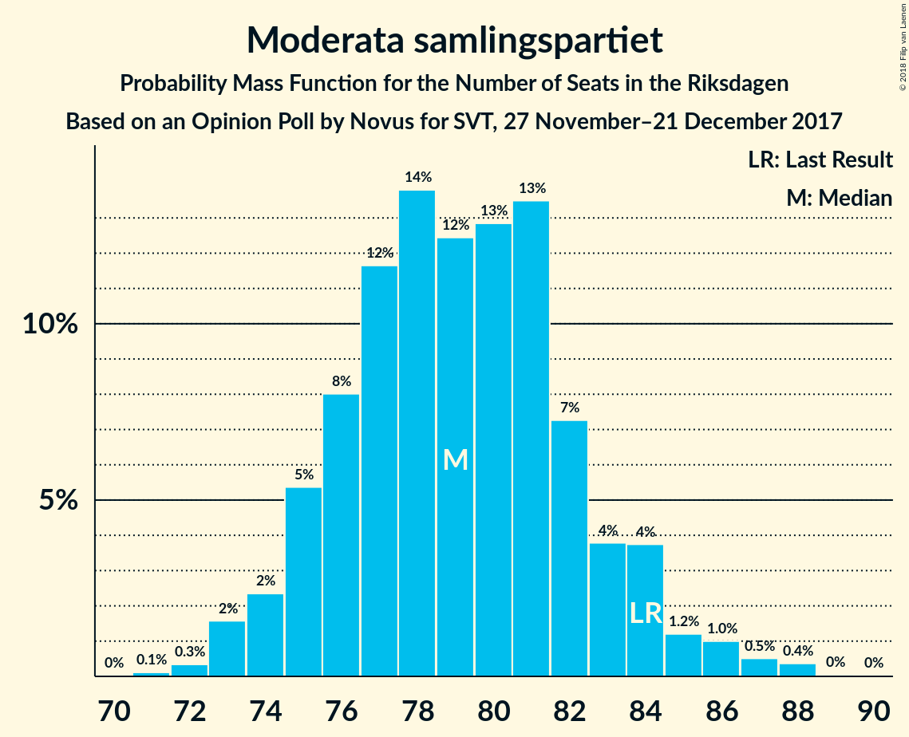

# Opinion Poll by Novus for SVT, 27 November–21 December 2017

<a href="#voting-intentions">Voting Intentions</a> | <a href="#seats">Seats</a> | <a href="#coalitions">Coalitions</a> | <a href="#technical-information">Technical Information</a>

## Voting Intentions

### Confidence Intervals

| Party | Last Result | Poll Result | 80% Confidence Interval | 90% Confidence Interval | 95% Confidence Interval | 99% Confidence Interval |
|:-----:|:-----------:|:-----------:|:-----------------------:|:-----------------------:|:-----------------------:|:-----------------------:|
| Sveriges socialdemokratiska arbetareparti | 31.0% | 29.5% | 28.6–30.4% |28.3–30.7% |28.1–30.9% |27.7–31.4% |
| Moderata samlingspartiet | 23.3% | 21.3% | 20.5–22.2% |20.3–22.4% |20.1–22.6% |19.7–23.0% |
| Sverigedemokraterna | 12.9% | 16.8% | 16.0–17.6% |15.8–17.8% |15.7–18.0% |15.3–18.4% |
| Centerpartiet | 6.1% | 9.8% | 9.2–10.4% |9.1–10.6% |8.9–10.8% |8.6–11.1% |
| Vänsterpartiet | 5.7% | 7.5% | 7.0–8.1% |6.8–8.2% |6.7–8.4% |6.5–8.7% |
| Liberalerna | 5.4% | 5.4% | 5.0–5.9% |4.8–6.0% |4.7–6.1% |4.5–6.4% |
| Miljöpartiet de gröna | 6.9% | 4.3% | 3.9–4.7% |3.8–4.9% |3.7–5.0% |3.5–5.2% |
| Kristdemokraterna | 4.6% | 3.3% | 3.0–3.7% |2.9–3.8% |2.8–3.9% |2.6–4.1% |

*Note:* The poll result column reflects the actual value used in the calculations. Published results may vary slightly, and in addition be rounded to fewer digits.

## Seats

### Confidence Intervals

| Party | Last Result | Median | 80% Confidence Interval | 90% Confidence Interval | 95% Confidence Interval | 99% Confidence Interval |
|:-----:|:-----------:|:------:|:-----------------------:|:-----------------------:|:-----------------------:|:-----------------------:|
| <a href="#sveriges-socialdemokratiska-arbetareparti">Sveriges socialdemokratiska arbetareparti</a> | 113 | 108 | 105–112 |105–114 |104–114 |102–118 |
| <a href="#moderata-samlingspartiet">Moderata samlingspartiet</a> | 84 | 78 | 76–82 |75–83 |74–84 |73–88 |
| <a href="#sverigedemokraterna">Sverigedemokraterna</a> | 49 | 63 | 59–64 |58–65 |58–66 |57–69 |
| <a href="#centerpartiet">Centerpartiet</a> | 22 | 36 | 33–38 |33–40 |33–40 |32–41 |
| <a href="#vänsterpartiet">Vänsterpartiet</a> | 21 | 28 | 26–30 |25–31 |25–31 |24–32 |
| <a href="#liberalerna">Liberalerna</a> | 19 | 20 | 18–21 |18–22 |17–23 |16–25 |
| <a href="#miljöpartiet-de-gröna">Miljöpartiet de gröna</a> | 25 | 16 | 15–17 |0–18 |0–18 |0–19 |
| <a href="#kristdemokraterna">Kristdemokraterna</a> | 16 | 0 | 0 |0 |0 |0–15 |

### Sveriges socialdemokratiska arbetareparti

*For a full overview of the results for this party, see the [Sveriges socialdemokratiska arbetareparti](party-sverigessocialdemokratiskaarbetareparti.html) page.*

| Number of Seats | Probability | Accumulated | Special Marks |
|:---------------:|:-----------:|:-----------:|:-------------:|
| 100 | 0.1% | 100% |  |
| 101 | 0.1% | 99.9% |  |
| 102 | 0.8% | 99.8% |  |
| 103 | 1.2% | 98.9% |  |
| 104 | 2% | 98% |  |
| 105 | 16% | 95% |  |
| 106 | 4% | 79% |  |
| 107 | 23% | 75% |  |
| 108 | 6% | 52% | Median |
| 109 | 7% | 46% |  |
| 110 | 13% | 39% |  |
| 111 | 7% | 26% |  |
| 112 | 10% | 19% |  |
| 113 | 3% | 9% | Last Result |
| 114 | 4% | 6% |  |
| 115 | 0.5% | 2% |  |
| 116 | 0.7% | 2% |  |
| 117 | 0.3% | 0.9% |  |
| 118 | 0.4% | 0.7% |  |
| 119 | 0% | 0.3% |  |
| 120 | 0.2% | 0.3% |  |
| 121 | 0% | 0.1% |  |
| 122 | 0% | 0% |  |

### Moderata samlingspartiet

*For a full overview of the results for this party, see the [Moderata samlingspartiet](party-moderatasamlingspartiet.html) page.*

| Number of Seats | Probability | Accumulated | Special Marks |
|:---------------:|:-----------:|:-----------:|:-------------:|
| 71 | 0.2% | 100% |  |
| 72 | 0.2% | 99.8% |  |
| 73 | 1.2% | 99.5% |  |
| 74 | 3% | 98% |  |
| 75 | 3% | 96% |  |
| 76 | 7% | 93% |  |
| 77 | 8% | 86% |  |
| 78 | 35% | 78% | Median |
| 79 | 13% | 42% |  |
| 80 | 3% | 29% |  |
| 81 | 13% | 26% |  |
| 82 | 5% | 13% |  |
| 83 | 5% | 8% |  |
| 84 | 2% | 4% | Last Result |
| 85 | 0.2% | 2% |  |
| 86 | 0.5% | 2% |  |
| 87 | 0.1% | 1.3% |  |
| 88 | 1.2% | 1.2% |  |
| 89 | 0% | 0% |  |

### Sverigedemokraterna

*For a full overview of the results for this party, see the [Sverigedemokraterna](party-sverigedemokraterna.html) page.*

| Number of Seats | Probability | Accumulated | Special Marks |
|:---------------:|:-----------:|:-----------:|:-------------:|
| 49 | 0% | 100% | Last Result |
| 50 | 0% | 100% |  |
| 51 | 0% | 100% |  |
| 52 | 0% | 100% |  |
| 53 | 0% | 100% |  |
| 54 | 0% | 100% |  |
| 55 | 0% | 100% |  |
| 56 | 0.3% | 99.9% |  |
| 57 | 2% | 99.6% |  |
| 58 | 3% | 98% |  |
| 59 | 5% | 95% |  |
| 60 | 4% | 90% |  |
| 61 | 4% | 86% |  |
| 62 | 16% | 82% |  |
| 63 | 34% | 66% | Median |
| 64 | 25% | 32% |  |
| 65 | 4% | 7% |  |
| 66 | 1.3% | 3% |  |
| 67 | 0.4% | 2% |  |
| 68 | 0.5% | 1.4% |  |
| 69 | 0.6% | 1.0% |  |
| 70 | 0.2% | 0.4% |  |
| 71 | 0.1% | 0.2% |  |
| 72 | 0% | 0% |  |

### Centerpartiet

*For a full overview of the results for this party, see the [Centerpartiet](party-centerpartiet.html) page.*

| Number of Seats | Probability | Accumulated | Special Marks |
|:---------------:|:-----------:|:-----------:|:-------------:|
| 22 | 0% | 100% | Last Result |
| 23 | 0% | 100% |  |
| 24 | 0% | 100% |  |
| 25 | 0% | 100% |  |
| 26 | 0% | 100% |  |
| 27 | 0% | 100% |  |
| 28 | 0% | 100% |  |
| 29 | 0% | 100% |  |
| 30 | 0% | 100% |  |
| 31 | 0.4% | 100% |  |
| 32 | 0.1% | 99.6% |  |
| 33 | 13% | 99.5% |  |
| 34 | 5% | 87% |  |
| 35 | 11% | 81% |  |
| 36 | 31% | 70% | Median |
| 37 | 12% | 39% |  |
| 38 | 17% | 27% |  |
| 39 | 4% | 9% |  |
| 40 | 5% | 6% |  |
| 41 | 0.6% | 0.8% |  |
| 42 | 0.1% | 0.1% |  |
| 43 | 0% | 0.1% |  |
| 44 | 0% | 0% |  |

### Vänsterpartiet

*For a full overview of the results for this party, see the [Vänsterpartiet](party-vänsterpartiet.html) page.*

| Number of Seats | Probability | Accumulated | Special Marks |
|:---------------:|:-----------:|:-----------:|:-------------:|
| 21 | 0% | 100% | Last Result |
| 22 | 0% | 100% |  |
| 23 | 0.2% | 100% |  |
| 24 | 0.4% | 99.7% |  |
| 25 | 6% | 99.4% |  |
| 26 | 13% | 94% |  |
| 27 | 17% | 81% |  |
| 28 | 28% | 65% | Median |
| 29 | 26% | 37% |  |
| 30 | 4% | 10% |  |
| 31 | 4% | 6% |  |
| 32 | 2% | 2% |  |
| 33 | 0.4% | 0.4% |  |
| 34 | 0.1% | 0.1% |  |
| 35 | 0% | 0% |  |

### Liberalerna

*For a full overview of the results for this party, see the [Liberalerna](party-liberalerna.html) page.*

| Number of Seats | Probability | Accumulated | Special Marks |
|:---------------:|:-----------:|:-----------:|:-------------:|
| 16 | 0.6% | 100% |  |
| 17 | 3% | 99.3% |  |
| 18 | 13% | 97% |  |
| 19 | 25% | 84% | Last Result |
| 20 | 27% | 58% | Median |
| 21 | 22% | 31% |  |
| 22 | 7% | 9% |  |
| 23 | 2% | 3% |  |
| 24 | 0.4% | 1.1% |  |
| 25 | 0.7% | 0.7% |  |
| 26 | 0% | 0% |  |

### Miljöpartiet de gröna

*For a full overview of the results for this party, see the [Miljöpartiet de gröna](party-miljöpartietdegröna.html) page.*

| Number of Seats | Probability | Accumulated | Special Marks |
|:---------------:|:-----------:|:-----------:|:-------------:|
| 0 | 7% | 100% |  |
| 1 | 0% | 93% |  |
| 2 | 0% | 93% |  |
| 3 | 0% | 93% |  |
| 4 | 0% | 93% |  |
| 5 | 0% | 93% |  |
| 6 | 0% | 93% |  |
| 7 | 0% | 93% |  |
| 8 | 0% | 93% |  |
| 9 | 0% | 93% |  |
| 10 | 0% | 93% |  |
| 11 | 0% | 93% |  |
| 12 | 0% | 93% |  |
| 13 | 0% | 93% |  |
| 14 | 0% | 93% |  |
| 15 | 21% | 93% |  |
| 16 | 40% | 72% | Median |
| 17 | 23% | 32% |  |
| 18 | 7% | 9% |  |
| 19 | 2% | 2% |  |
| 20 | 0.3% | 0.3% |  |
| 21 | 0% | 0% |  |
| 22 | 0% | 0% |  |
| 23 | 0% | 0% |  |
| 24 | 0% | 0% |  |
| 25 | 0% | 0% | Last Result |

### Kristdemokraterna

*For a full overview of the results for this party, see the [Kristdemokraterna](party-kristdemokraterna.html) page.*

| Number of Seats | Probability | Accumulated | Special Marks |
|:---------------:|:-----------:|:-----------:|:-------------:|
| 0 | 99.3% | 100% | Median |
| 1 | 0% | 0.7% |  |
| 2 | 0% | 0.7% |  |
| 3 | 0% | 0.7% |  |
| 4 | 0% | 0.7% |  |
| 5 | 0% | 0.7% |  |
| 6 | 0% | 0.7% |  |
| 7 | 0% | 0.7% |  |
| 8 | 0% | 0.7% |  |
| 9 | 0% | 0.7% |  |
| 10 | 0% | 0.7% |  |
| 11 | 0% | 0.7% |  |
| 12 | 0% | 0.7% |  |
| 13 | 0% | 0.7% |  |
| 14 | 0.1% | 0.7% |  |
| 15 | 0.5% | 0.6% |  |
| 16 | 0.1% | 0.1% | Last Result |
| 17 | 0% | 0% |  |

## Coalitions

### Confidence Intervals

| Coalition | Last Result | Median | Majority? | 80% Confidence Interval | 90% Confidence Interval | 95% Confidence Interval | 99% Confidence Interval |
|:---------:|:-----------:|:------:|:---------:|:-----------------------:|:-----------------------:|:-----------------------:|:-----------------------:|
| Sveriges socialdemokratiska arbetareparti – Moderata samlingspartiet | 197 | 188 | 100% | 183–192 | 183–195 | 182–198 | 179–200 |
| Sveriges socialdemokratiska arbetareparti – Vänsterpartiet – Miljöpartiet de gröna | 159 | 151 | 0% | 148–155 | 143–158 | 141–158 | 138–160 |
| Moderata samlingspartiet – Sverigedemokraterna | 133 | 141 | 0% | 137–145 | 136–146 | 135–150 | 134–152 |
| Moderata samlingspartiet – Centerpartiet – Liberalerna – Kristdemokraterna | 141 | 135 | 0% | 131–139 | 131–142 | 129–144 | 128–147 |
| Moderata samlingspartiet – Centerpartiet – Liberalerna | 125 | 135 | 0% | 131–139 | 131–142 | 129–144 | 128–146 |
| Sveriges socialdemokratiska arbetareparti – Vänsterpartiet | 134 | 135 | 0% | 134–141 | 132–143 | 130–143 | 129–148 |
| Sveriges socialdemokratiska arbetareparti – Miljöpartiet de gröna | 138 | 123 | 0% | 120–128 | 114–129 | 112–129 | 109–131 |
| Moderata samlingspartiet – Centerpartiet – Kristdemokraterna | 122 | 114 | 0% | 112–119 | 110–122 | 110–123 | 109–127 |
| Moderata samlingspartiet – Centerpartiet | 106 | 114 | 0% | 112–119 | 110–122 | 110–123 | 108–124 |

### Sveriges socialdemokratiska arbetareparti – Moderata samlingspartiet

| Number of Seats | Probability | Accumulated | Special Marks |
|:---------------:|:-----------:|:-----------:|:-------------:|
| 175 | 0% | 100% | Majority |
| 176 | 0.1% | 99.9% |  |
| 177 | 0% | 99.9% |  |
| 178 | 0.1% | 99.9% |  |
| 179 | 0.3% | 99.8% |  |
| 180 | 0.8% | 99.5% |  |
| 181 | 1.1% | 98.7% |  |
| 182 | 0.7% | 98% |  |
| 183 | 16% | 97% |  |
| 184 | 6% | 81% |  |
| 185 | 8% | 75% |  |
| 186 | 14% | 67% | Median |
| 187 | 3% | 53% |  |
| 188 | 22% | 50% |  |
| 189 | 7% | 28% |  |
| 190 | 8% | 21% |  |
| 191 | 0.8% | 13% |  |
| 192 | 3% | 12% |  |
| 193 | 1.2% | 8% |  |
| 194 | 1.2% | 7% |  |
| 195 | 2% | 6% |  |
| 196 | 0.6% | 4% |  |
| 197 | 0.7% | 3% | Last Result |
| 198 | 0.3% | 3% |  |
| 199 | 2% | 2% |  |
| 200 | 0.3% | 0.8% |  |
| 201 | 0.1% | 0.5% |  |
| 202 | 0.3% | 0.4% |  |
| 203 | 0.1% | 0.2% |  |
| 204 | 0% | 0% |  |

### Sveriges socialdemokratiska arbetareparti – Vänsterpartiet – Miljöpartiet de gröna

| Number of Seats | Probability | Accumulated | Special Marks |
|:---------------:|:-----------:|:-----------:|:-------------:|
| 134 | 0% | 100% |  |
| 135 | 0.2% | 99.9% |  |
| 136 | 0.1% | 99.8% |  |
| 137 | 0.1% | 99.7% |  |
| 138 | 0.5% | 99.6% |  |
| 139 | 0.3% | 99.2% |  |
| 140 | 0.3% | 98.8% |  |
| 141 | 1.1% | 98.5% |  |
| 142 | 2% | 97% |  |
| 143 | 0.5% | 95% |  |
| 144 | 0.6% | 95% |  |
| 145 | 0.4% | 94% |  |
| 146 | 2% | 94% |  |
| 147 | 1.0% | 92% |  |
| 148 | 3% | 91% |  |
| 149 | 1.4% | 88% |  |
| 150 | 3% | 87% |  |
| 151 | 41% | 84% |  |
| 152 | 12% | 43% | Median |
| 153 | 6% | 30% |  |
| 154 | 12% | 24% |  |
| 155 | 3% | 13% |  |
| 156 | 2% | 9% |  |
| 157 | 1.3% | 7% |  |
| 158 | 5% | 6% |  |
| 159 | 0.5% | 1.1% | Last Result |
| 160 | 0.5% | 0.6% |  |
| 161 | 0.1% | 0.1% |  |
| 162 | 0% | 0% |  |

### Moderata samlingspartiet – Sverigedemokraterna

| Number of Seats | Probability | Accumulated | Special Marks |
|:---------------:|:-----------:|:-----------:|:-------------:|
| 130 | 0% | 100% |  |
| 131 | 0.1% | 99.9% |  |
| 132 | 0.2% | 99.9% |  |
| 133 | 0% | 99.7% | Last Result |
| 134 | 0.2% | 99.7% |  |
| 135 | 2% | 99.4% |  |
| 136 | 5% | 97% |  |
| 137 | 4% | 92% |  |
| 138 | 0.2% | 88% |  |
| 139 | 3% | 87% |  |
| 140 | 12% | 84% |  |
| 141 | 42% | 72% | Median |
| 142 | 7% | 31% |  |
| 143 | 0.1% | 24% |  |
| 144 | 3% | 23% |  |
| 145 | 14% | 21% |  |
| 146 | 2% | 7% |  |
| 147 | 1.3% | 4% |  |
| 148 | 0.2% | 3% |  |
| 149 | 0.2% | 3% |  |
| 150 | 0.3% | 3% |  |
| 151 | 0.7% | 2% |  |
| 152 | 2% | 2% |  |
| 153 | 0.1% | 0.2% |  |
| 154 | 0% | 0.1% |  |
| 155 | 0% | 0.1% |  |
| 156 | 0% | 0.1% |  |
| 157 | 0% | 0% |  |

### Moderata samlingspartiet – Centerpartiet – Liberalerna – Kristdemokraterna

| Number of Seats | Probability | Accumulated | Special Marks |
|:---------------:|:-----------:|:-----------:|:-------------:|
| 126 | 0.1% | 100% |  |
| 127 | 0.1% | 99.9% |  |
| 128 | 2% | 99.7% |  |
| 129 | 1.1% | 98% |  |
| 130 | 1.5% | 97% |  |
| 131 | 7% | 96% |  |
| 132 | 11% | 88% |  |
| 133 | 4% | 78% |  |
| 134 | 22% | 74% | Median |
| 135 | 19% | 51% |  |
| 136 | 15% | 32% |  |
| 137 | 3% | 17% |  |
| 138 | 3% | 15% |  |
| 139 | 2% | 12% |  |
| 140 | 2% | 9% |  |
| 141 | 1.4% | 7% | Last Result |
| 142 | 1.4% | 6% |  |
| 143 | 0.8% | 4% |  |
| 144 | 2% | 4% |  |
| 145 | 0.2% | 1.3% |  |
| 146 | 0.4% | 1.1% |  |
| 147 | 0.3% | 0.7% |  |
| 148 | 0.1% | 0.4% |  |
| 149 | 0% | 0.3% |  |
| 150 | 0.1% | 0.3% |  |
| 151 | 0.2% | 0.2% |  |
| 152 | 0% | 0% |  |

### Moderata samlingspartiet – Centerpartiet – Liberalerna

| Number of Seats | Probability | Accumulated | Special Marks |
|:---------------:|:-----------:|:-----------:|:-------------:|
| 125 | 0% | 100% | Last Result |
| 126 | 0.1% | 99.9% |  |
| 127 | 0.2% | 99.8% |  |
| 128 | 2% | 99.6% |  |
| 129 | 1.1% | 98% |  |
| 130 | 2% | 97% |  |
| 131 | 7% | 95% |  |
| 132 | 11% | 88% |  |
| 133 | 4% | 77% |  |
| 134 | 22% | 73% | Median |
| 135 | 19% | 51% |  |
| 136 | 15% | 31% |  |
| 137 | 3% | 17% |  |
| 138 | 3% | 14% |  |
| 139 | 2% | 11% |  |
| 140 | 2% | 9% |  |
| 141 | 1.4% | 7% |  |
| 142 | 1.4% | 5% |  |
| 143 | 0.8% | 4% |  |
| 144 | 2% | 3% |  |
| 145 | 0.2% | 0.8% |  |
| 146 | 0.3% | 0.6% |  |
| 147 | 0.2% | 0.3% |  |
| 148 | 0% | 0.1% |  |
| 149 | 0% | 0% |  |

### Sveriges socialdemokratiska arbetareparti – Vänsterpartiet

| Number of Seats | Probability | Accumulated | Special Marks |
|:---------------:|:-----------:|:-----------:|:-------------:|
| 127 | 0.2% | 100% |  |
| 128 | 0.2% | 99.8% |  |
| 129 | 0.4% | 99.6% |  |
| 130 | 2% | 99.2% |  |
| 131 | 1.0% | 97% |  |
| 132 | 1.0% | 96% |  |
| 133 | 2% | 95% |  |
| 134 | 20% | 93% | Last Result |
| 135 | 24% | 73% |  |
| 136 | 3% | 50% | Median |
| 137 | 18% | 46% |  |
| 138 | 9% | 28% |  |
| 139 | 5% | 19% |  |
| 140 | 3% | 14% |  |
| 141 | 2% | 11% |  |
| 142 | 3% | 9% |  |
| 143 | 3% | 5% |  |
| 144 | 0.7% | 2% |  |
| 145 | 0.1% | 2% |  |
| 146 | 0.7% | 2% |  |
| 147 | 0.2% | 0.9% |  |
| 148 | 0.6% | 0.7% |  |
| 149 | 0.1% | 0.2% |  |
| 150 | 0% | 0.1% |  |
| 151 | 0% | 0% |  |

### Sveriges socialdemokratiska arbetareparti – Miljöpartiet de gröna

| Number of Seats | Probability | Accumulated | Special Marks |
|:---------------:|:-----------:|:-----------:|:-------------:|
| 106 | 0.1% | 100% |  |
| 107 | 0.1% | 99.8% |  |
| 108 | 0.1% | 99.7% |  |
| 109 | 0.2% | 99.6% |  |
| 110 | 0.5% | 99.4% |  |
| 111 | 1.1% | 98.9% |  |
| 112 | 1.3% | 98% |  |
| 113 | 1.2% | 96% |  |
| 114 | 1.1% | 95% |  |
| 115 | 0.3% | 94% |  |
| 116 | 0.6% | 94% |  |
| 117 | 0.3% | 93% |  |
| 118 | 0.5% | 93% |  |
| 119 | 2% | 92% |  |
| 120 | 1.2% | 91% |  |
| 121 | 2% | 90% |  |
| 122 | 18% | 88% |  |
| 123 | 24% | 69% |  |
| 124 | 5% | 46% | Median |
| 125 | 16% | 41% |  |
| 126 | 5% | 24% |  |
| 127 | 3% | 20% |  |
| 128 | 8% | 17% |  |
| 129 | 6% | 9% |  |
| 130 | 1.3% | 2% |  |
| 131 | 0.6% | 0.9% |  |
| 132 | 0.2% | 0.3% |  |
| 133 | 0.1% | 0.1% |  |
| 134 | 0% | 0% |  |
| 135 | 0% | 0% |  |
| 136 | 0% | 0% |  |
| 137 | 0% | 0% |  |
| 138 | 0% | 0% | Last Result |

### Moderata samlingspartiet – Centerpartiet – Kristdemokraterna

| Number of Seats | Probability | Accumulated | Special Marks |
|:---------------:|:-----------:|:-----------:|:-------------:|
| 106 | 0.1% | 100% |  |
| 107 | 0.1% | 99.9% |  |
| 108 | 0.2% | 99.8% |  |
| 109 | 0.8% | 99.6% |  |
| 110 | 4% | 98.7% |  |
| 111 | 3% | 95% |  |
| 112 | 6% | 92% |  |
| 113 | 11% | 86% |  |
| 114 | 26% | 75% | Median |
| 115 | 13% | 49% |  |
| 116 | 16% | 36% |  |
| 117 | 4% | 20% |  |
| 118 | 4% | 16% |  |
| 119 | 5% | 13% |  |
| 120 | 2% | 8% |  |
| 121 | 0.2% | 6% |  |
| 122 | 2% | 6% | Last Result |
| 123 | 2% | 4% |  |
| 124 | 1.4% | 2% |  |
| 125 | 0.2% | 0.7% |  |
| 126 | 0.1% | 0.6% |  |
| 127 | 0.1% | 0.5% |  |
| 128 | 0.2% | 0.5% |  |
| 129 | 0% | 0.3% |  |
| 130 | 0% | 0.3% |  |
| 131 | 0% | 0.2% |  |
| 132 | 0% | 0.2% |  |
| 133 | 0.2% | 0.2% |  |
| 134 | 0% | 0% |  |

### Moderata samlingspartiet – Centerpartiet

| Number of Seats | Probability | Accumulated | Special Marks |
|:---------------:|:-----------:|:-----------:|:-------------:|
| 106 | 0.1% | 100% | Last Result |
| 107 | 0.2% | 99.9% |  |
| 108 | 0.2% | 99.7% |  |
| 109 | 0.9% | 99.5% |  |
| 110 | 4% | 98.6% |  |
| 111 | 3% | 95% |  |
| 112 | 6% | 92% |  |
| 113 | 11% | 86% |  |
| 114 | 26% | 74% | Median |
| 115 | 13% | 49% |  |
| 116 | 16% | 36% |  |
| 117 | 4% | 19% |  |
| 118 | 4% | 16% |  |
| 119 | 5% | 12% |  |
| 120 | 2% | 7% |  |
| 121 | 0.2% | 5% |  |
| 122 | 2% | 5% |  |
| 123 | 2% | 3% |  |
| 124 | 1.3% | 2% |  |
| 125 | 0.1% | 0.2% |  |
| 126 | 0% | 0.1% |  |
| 127 | 0% | 0.1% |  |
| 128 | 0% | 0% |  |

## Technical Information

### Opinion Poll

+ **Polling firm:** Novus
+ **Commissioner(s):** SVT
+ **Fieldwork period:** 27 November–21 December 2017

### Calculations

+ **Sample size:** 4008
+ **Simulations done:** 131,072
+ **Error estimate:** 0.49%

