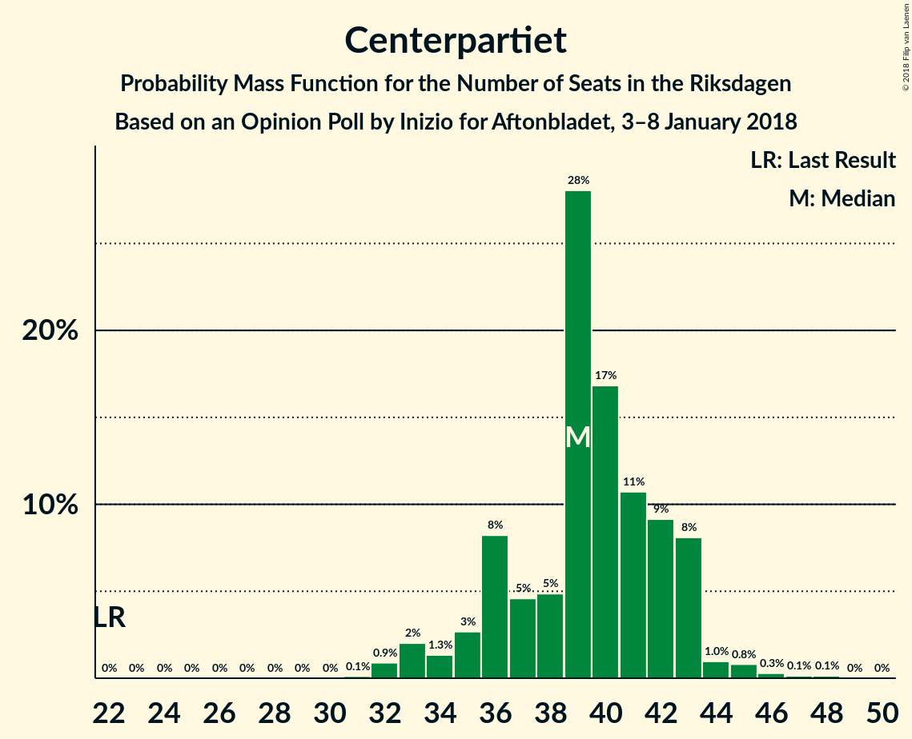
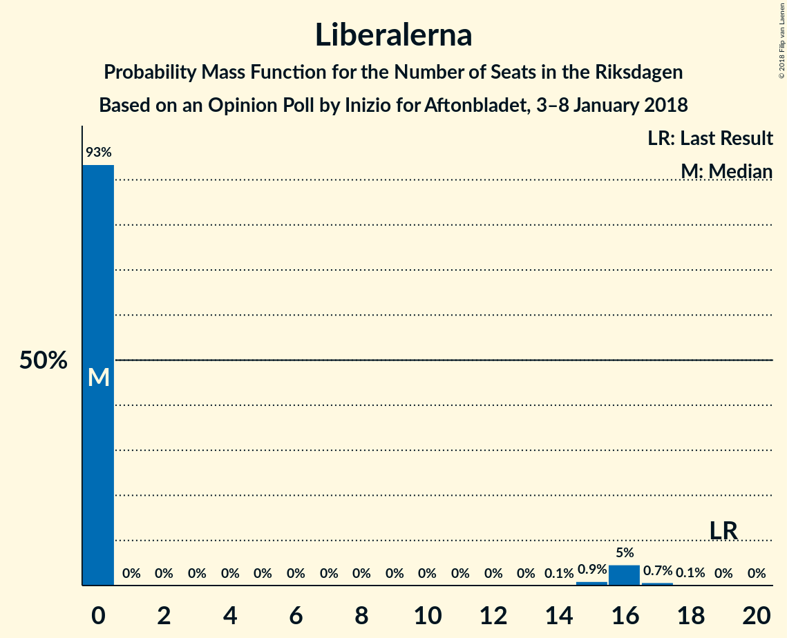
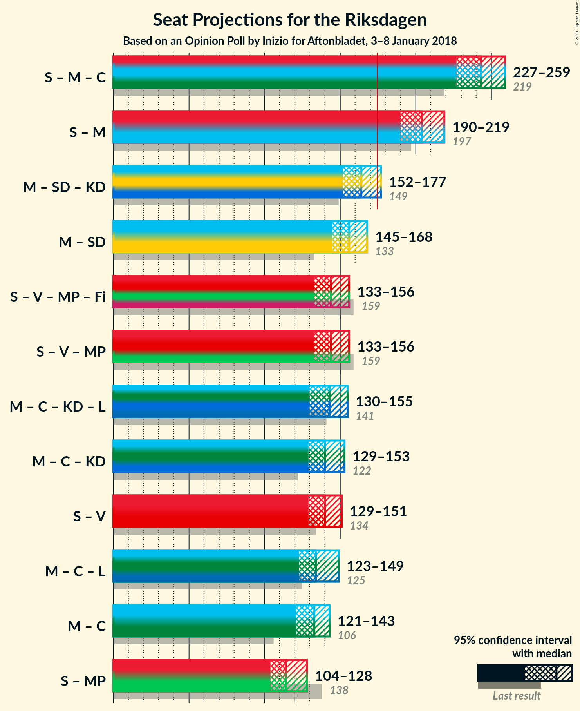

# Opinion Poll by Inizio for Aftonbladet, 3–8 January 2018

<a href="#voting-intentions">Voting Intentions</a> | <a href="#seats">Seats</a> | <a href="#coalitions">Coalitions</a> | <a href="#technical-information">Technical Information</a>

## Voting Intentions

### Confidence Intervals

| Party | Last Result | Poll Result | 80% Confidence Interval | 90% Confidence Interval | 95% Confidence Interval | 99% Confidence Interval |
|:-----:|:-----------:|:-----------:|:-----------------------:|:-----------------------:|:-----------------------:|:-----------------------:|
| Sveriges socialdemokratiska arbetareparti | 31.0% | 28.3% | 27.1–29.6% |26.8–29.9% |26.5–30.2% |25.9–30.8% |
| Moderata samlingspartiet | 23.3% | 23.7% | 22.6–24.9% |22.3–25.2% |22.0–25.5% |21.5–26.1% |
| Sverigedemokraterna | 12.9% | 16.0% | 15.0–17.0% |14.8–17.3% |14.5–17.6% |14.1–18.1% |
| Centerpartiet | 6.1% | 9.9% | 9.1–10.8% |8.9–11.0% |8.7–11.2% |8.4–11.6% |
| Vänsterpartiet | 5.7% | 7.4% | 6.7–8.2% |6.6–8.4% |6.4–8.6% |6.1–8.9% |
| Kristdemokraterna | 4.6% | 4.0% | 3.5–4.6% |3.4–4.8% |3.3–4.9% |3.1–5.2% |
| Miljöpartiet de gröna | 6.9% | 3.6% | 3.2–4.2% |3.0–4.3% |2.9–4.5% |2.7–4.8% |
| Liberalerna | 5.4% | 3.4% | 2.9–3.9% |2.8–4.1% |2.7–4.2% |2.5–4.5% |
| Feministiskt initiativ | 3.1% | 1.3% | 1.1–1.7% |1.0–1.8% |0.9–1.9% |0.8–2.1% |

*Note:* The poll result column reflects the actual value used in the calculations. Published results may vary slightly, and in addition be rounded to fewer digits.

## Seats

### Confidence Intervals

| Party | Last Result | Median | 80% Confidence Interval | 90% Confidence Interval | 95% Confidence Interval | 99% Confidence Interval |
|:-----:|:-----------:|:------:|:-----------------------:|:-----------------------:|:-----------------------:|:-----------------------:|
| <a href="#sveriges-socialdemokratiska-arbetareparti">Sveriges socialdemokratiska arbetareparti</a> | 113 | 109 | 101–116 |101–116 |101–116 |101–117 |
| <a href="#moderata-samlingspartiet">Moderata samlingspartiet</a> | 84 | 92 | 84–92 |84–92 |84–92 |84–96 |
| <a href="#sverigedemokraterna">Sverigedemokraterna</a> | 49 | 60 | 52–65 |52–70 |52–70 |52–70 |
| <a href="#centerpartiet">Centerpartiet</a> | 22 | 40 | 33–41 |32–41 |32–41 |32–48 |
| <a href="#vänsterpartiet">Vänsterpartiet</a> | 21 | 27 | 25–28 |23–28 |23–28 |23–30 |
| <a href="#kristdemokraterna">Kristdemokraterna</a> | 16 | 17 | 0–20 |0–20 |0–20 |0–20 |
| <a href="#miljöpartiet-de-gröna">Miljöpartiet de gröna</a> | 25 | 0 | 0–19 |0–19 |0–19 |0–19 |
| <a href="#liberalerna">Liberalerna</a> | 19 | 0 | 0–18 |0–18 |0–18 |0–19 |
| <a href="#feministiskt-initiativ">Feministiskt initiativ</a> | 0 | 0 | 0 |0 |0 |0 |

### Sveriges socialdemokratiska arbetareparti

*For a full overview of the results for this party, see the [Sveriges socialdemokratiska arbetareparti](party-sverigessocialdemokratiskaarbetareparti.html) page.*

| Number of Seats | Probability | Accumulated | Special Marks |
|:---------------:|:-----------:|:-----------:|:-------------:|
| 92 | 0.1% | 100% |  |
| 93 | 0% | 99.9% |  |
| 94 | 0% | 99.9% |  |
| 95 | 0% | 99.9% |  |
| 96 | 0% | 99.9% |  |
| 97 | 0% | 99.9% |  |
| 98 | 0.3% | 99.9% |  |
| 99 | 0% | 99.5% |  |
| 100 | 0% | 99.5% |  |
| 101 | 22% | 99.5% |  |
| 102 | 0.2% | 77% |  |
| 103 | 0.1% | 77% |  |
| 104 | 0% | 77% |  |
| 105 | 0.2% | 77% |  |
| 106 | 0% | 77% |  |
| 107 | 0% | 77% |  |
| 108 | 23% | 77% |  |
| 109 | 43% | 54% | Median |
| 110 | 0% | 11% |  |
| 111 | 0.1% | 11% |  |
| 112 | 0% | 11% |  |
| 113 | 0% | 11% | Last Result |
| 114 | 0% | 11% |  |
| 115 | 0% | 11% |  |
| 116 | 10% | 11% |  |
| 117 | 0.5% | 0.9% |  |
| 118 | 0% | 0.4% |  |
| 119 | 0% | 0.4% |  |
| 120 | 0.4% | 0.4% |  |
| 121 | 0% | 0% |  |

### Moderata samlingspartiet

*For a full overview of the results for this party, see the [Moderata samlingspartiet](party-moderatasamlingspartiet.html) page.*

| Number of Seats | Probability | Accumulated | Special Marks |
|:---------------:|:-----------:|:-----------:|:-------------:|
| 79 | 0.1% | 100% |  |
| 80 | 0.1% | 99.9% |  |
| 81 | 0% | 99.8% |  |
| 82 | 0% | 99.8% |  |
| 83 | 0% | 99.8% |  |
| 84 | 22% | 99.8% | Last Result |
| 85 | 0.4% | 78% |  |
| 86 | 0.1% | 77% |  |
| 87 | 0% | 77% |  |
| 88 | 0% | 77% |  |
| 89 | 0.2% | 77% |  |
| 90 | 16% | 77% |  |
| 91 | 11% | 61% |  |
| 92 | 49% | 50% | Median |
| 93 | 0.3% | 2% |  |
| 94 | 0.6% | 1.2% |  |
| 95 | 0% | 0.6% |  |
| 96 | 0.3% | 0.6% |  |
| 97 | 0% | 0.3% |  |
| 98 | 0% | 0.3% |  |
| 99 | 0% | 0.3% |  |
| 100 | 0.2% | 0.2% |  |
| 101 | 0% | 0% |  |

### Sverigedemokraterna

*For a full overview of the results for this party, see the [Sverigedemokraterna](party-sverigedemokraterna.html) page.*

| Number of Seats | Probability | Accumulated | Special Marks |
|:---------------:|:-----------:|:-----------:|:-------------:|
| 49 | 0% | 100% | Last Result |
| 50 | 0% | 100% |  |
| 51 | 0% | 100% |  |
| 52 | 16% | 100% |  |
| 53 | 0% | 84% |  |
| 54 | 0% | 84% |  |
| 55 | 0% | 84% |  |
| 56 | 0.8% | 84% |  |
| 57 | 0.1% | 84% |  |
| 58 | 0% | 84% |  |
| 59 | 0.3% | 84% |  |
| 60 | 45% | 83% | Median |
| 61 | 0.1% | 39% |  |
| 62 | 0% | 39% |  |
| 63 | 0% | 39% |  |
| 64 | 10% | 39% |  |
| 65 | 22% | 29% |  |
| 66 | 0.4% | 6% |  |
| 67 | 0.2% | 6% |  |
| 68 | 0% | 6% |  |
| 69 | 0% | 6% |  |
| 70 | 6% | 6% |  |
| 71 | 0% | 0% |  |

### Centerpartiet

*For a full overview of the results for this party, see the [Centerpartiet](party-centerpartiet.html) page.*

| Number of Seats | Probability | Accumulated | Special Marks |
|:---------------:|:-----------:|:-----------:|:-------------:|
| 22 | 0% | 100% | Last Result |
| 23 | 0% | 100% |  |
| 24 | 0% | 100% |  |
| 25 | 0% | 100% |  |
| 26 | 0% | 100% |  |
| 27 | 0% | 100% |  |
| 28 | 0% | 100% |  |
| 29 | 0% | 100% |  |
| 30 | 0.2% | 100% |  |
| 31 | 0% | 99.8% |  |
| 32 | 10% | 99.8% |  |
| 33 | 0.1% | 90% |  |
| 34 | 0.1% | 90% |  |
| 35 | 0.2% | 90% |  |
| 36 | 16% | 90% |  |
| 37 | 0.2% | 74% |  |
| 38 | 0.5% | 74% |  |
| 39 | 6% | 73% |  |
| 40 | 22% | 67% | Median |
| 41 | 43% | 45% |  |
| 42 | 0.3% | 2% |  |
| 43 | 0% | 2% |  |
| 44 | 0.1% | 2% |  |
| 45 | 0% | 2% |  |
| 46 | 0% | 2% |  |
| 47 | 0% | 2% |  |
| 48 | 2% | 2% |  |
| 49 | 0% | 0% |  |

### Vänsterpartiet

*For a full overview of the results for this party, see the [Vänsterpartiet](party-vänsterpartiet.html) page.*

| Number of Seats | Probability | Accumulated | Special Marks |
|:---------------:|:-----------:|:-----------:|:-------------:|
| 21 | 0% | 100% | Last Result |
| 22 | 0% | 100% |  |
| 23 | 6% | 100% |  |
| 24 | 2% | 94% |  |
| 25 | 23% | 92% |  |
| 26 | 0% | 70% |  |
| 27 | 59% | 70% | Median |
| 28 | 10% | 10% |  |
| 29 | 0% | 0.7% |  |
| 30 | 0.3% | 0.7% |  |
| 31 | 0% | 0.4% |  |
| 32 | 0% | 0.3% |  |
| 33 | 0.2% | 0.3% |  |
| 34 | 0% | 0.2% |  |
| 35 | 0.1% | 0.1% |  |
| 36 | 0% | 0% |  |

### Kristdemokraterna

*For a full overview of the results for this party, see the [Kristdemokraterna](party-kristdemokraterna.html) page.*

| Number of Seats | Probability | Accumulated | Special Marks |
|:---------------:|:-----------:|:-----------:|:-------------:|
| 0 | 18% | 100% |  |
| 1 | 0% | 82% |  |
| 2 | 0% | 82% |  |
| 3 | 0% | 82% |  |
| 4 | 0% | 82% |  |
| 5 | 0% | 82% |  |
| 6 | 0% | 82% |  |
| 7 | 0% | 82% |  |
| 8 | 0% | 82% |  |
| 9 | 0% | 82% |  |
| 10 | 0% | 82% |  |
| 11 | 0% | 82% |  |
| 12 | 0% | 82% |  |
| 13 | 0% | 82% |  |
| 14 | 0% | 82% |  |
| 15 | 0.2% | 82% |  |
| 16 | 22% | 81% | Last Result |
| 17 | 16% | 59% | Median |
| 18 | 0.3% | 44% |  |
| 19 | 0.3% | 43% |  |
| 20 | 43% | 43% |  |
| 21 | 0% | 0% |  |

### Miljöpartiet de gröna

*For a full overview of the results for this party, see the [Miljöpartiet de gröna](party-miljöpartietdegröna.html) page.*

| Number of Seats | Probability | Accumulated | Special Marks |
|:---------------:|:-----------:|:-----------:|:-------------:|
| 0 | 54% | 100% | Median |
| 1 | 0% | 46% |  |
| 2 | 0% | 46% |  |
| 3 | 0% | 46% |  |
| 4 | 0% | 46% |  |
| 5 | 0% | 46% |  |
| 6 | 0% | 46% |  |
| 7 | 0% | 46% |  |
| 8 | 0% | 46% |  |
| 9 | 0% | 46% |  |
| 10 | 0% | 46% |  |
| 11 | 0% | 46% |  |
| 12 | 0% | 46% |  |
| 13 | 0% | 46% |  |
| 14 | 0% | 46% |  |
| 15 | 0.1% | 46% |  |
| 16 | 0.4% | 45% |  |
| 17 | 6% | 45% |  |
| 18 | 24% | 39% |  |
| 19 | 16% | 16% |  |
| 20 | 0% | 0% |  |
| 21 | 0% | 0% |  |
| 22 | 0% | 0% |  |
| 23 | 0% | 0% |  |
| 24 | 0% | 0% |  |
| 25 | 0% | 0% | Last Result |

### Liberalerna

*For a full overview of the results for this party, see the [Liberalerna](party-liberalerna.html) page.*

| Number of Seats | Probability | Accumulated | Special Marks |
|:---------------:|:-----------:|:-----------:|:-------------:|
| 0 | 89% | 100% | Median |
| 1 | 0% | 11% |  |
| 2 | 0% | 11% |  |
| 3 | 0% | 11% |  |
| 4 | 0% | 11% |  |
| 5 | 0% | 11% |  |
| 6 | 0% | 11% |  |
| 7 | 0% | 11% |  |
| 8 | 0% | 11% |  |
| 9 | 0% | 11% |  |
| 10 | 0% | 11% |  |
| 11 | 0% | 11% |  |
| 12 | 0% | 11% |  |
| 13 | 0% | 11% |  |
| 14 | 0% | 11% |  |
| 15 | 0.2% | 11% |  |
| 16 | 0.2% | 11% |  |
| 17 | 0.4% | 11% |  |
| 18 | 10% | 10% |  |
| 19 | 0.5% | 0.5% | Last Result |
| 20 | 0% | 0% |  |

### Feministiskt initiativ

*For a full overview of the results for this party, see the [Feministiskt initiativ](party-feministisktinitiativ.html) page.*

| Number of Seats | Probability | Accumulated | Special Marks |
|:---------------:|:-----------:|:-----------:|:-------------:|
| 0 | 100% | 100% | Last Result, Median |

## Coalitions

### Confidence Intervals

| Coalition | Last Result | Median | Majority? | 80% Confidence Interval | 90% Confidence Interval | 95% Confidence Interval | 99% Confidence Interval |
|:---------:|:-----------:|:------:|:---------:|:-----------------------:|:-----------------------:|:-----------------------:|:-----------------------:|
| Sveriges socialdemokratiska arbetareparti – Moderata samlingspartiet | 197 | 201 | 100% | 185–207 | 185–207 | 185–207 | 185–211 |
| Moderata samlingspartiet – Sverigedemokraterna | 133 | 152 | 0% | 142–155 | 142–162 | 142–162 | 142–162 |
| Sveriges socialdemokratiska arbetareparti – Vänsterpartiet – Miljöpartiet de gröna – Feministiskt initiativ | 159 | 144 | 0% | 136–154 | 136–154 | 136–154 | 130–158 |
| Sveriges socialdemokratiska arbetareparti – Vänsterpartiet – Miljöpartiet de gröna | 159 | 144 | 0% | 136–154 | 136–154 | 136–154 | 130–158 |
| Moderata samlingspartiet – Centerpartiet – Kristdemokraterna – Liberalerna | 141 | 143 | 0% | 140–153 | 131–153 | 131–153 | 129–156 |
| Moderata samlingspartiet – Centerpartiet – Kristdemokraterna | 122 | 143 | 0% | 123–153 | 123–153 | 123–153 | 123–153 |
| Sveriges socialdemokratiska arbetareparti – Vänsterpartiet | 134 | 136 | 0% | 126–144 | 126–144 | 126–144 | 126–146 |
| Moderata samlingspartiet – Centerpartiet – Liberalerna | 125 | 133 | 0% | 124–141 | 124–141 | 124–141 | 121–151 |
| Moderata samlingspartiet – Centerpartiet | 106 | 131 | 0% | 123–133 | 123–133 | 123–133 | 121–139 |
| Sveriges socialdemokratiska arbetareparti – Miljöpartiet de gröna | 138 | 116 | 0% | 109–127 | 109–127 | 109–127 | 105–127 |

### Sveriges socialdemokratiska arbetareparti – Moderata samlingspartiet

| Number of Seats | Probability | Accumulated | Special Marks |
|:---------------:|:-----------:|:-----------:|:-------------:|
| 178 | 0.1% | 100% |  |
| 179 | 0% | 99.9% |  |
| 180 | 0% | 99.9% |  |
| 181 | 0% | 99.9% |  |
| 182 | 0% | 99.9% |  |
| 183 | 0.1% | 99.9% |  |
| 184 | 0% | 99.8% |  |
| 185 | 22% | 99.8% |  |
| 186 | 0% | 78% |  |
| 187 | 0% | 78% |  |
| 188 | 0.1% | 78% |  |
| 189 | 0% | 78% |  |
| 190 | 0% | 78% |  |
| 191 | 0.3% | 78% |  |
| 192 | 0.1% | 77% |  |
| 193 | 0% | 77% |  |
| 194 | 0.2% | 77% |  |
| 195 | 0% | 77% |  |
| 196 | 0% | 77% |  |
| 197 | 0% | 77% | Last Result |
| 198 | 16% | 77% |  |
| 199 | 2% | 62% |  |
| 200 | 6% | 60% |  |
| 201 | 43% | 54% | Median |
| 202 | 0.2% | 11% |  |
| 203 | 0% | 11% |  |
| 204 | 0% | 11% |  |
| 205 | 0.4% | 11% |  |
| 206 | 0% | 11% |  |
| 207 | 10% | 11% |  |
| 208 | 0% | 0.9% |  |
| 209 | 0% | 0.9% |  |
| 210 | 0% | 0.9% |  |
| 211 | 0.5% | 0.9% |  |
| 212 | 0.3% | 0.4% |  |
| 213 | 0% | 0% |  |

### Moderata samlingspartiet – Sverigedemokraterna

| Number of Seats | Probability | Accumulated | Special Marks |
|:---------------:|:-----------:|:-----------:|:-------------:|
| 133 | 0% | 100% | Last Result |
| 134 | 0% | 100% |  |
| 135 | 0% | 100% |  |
| 136 | 0% | 100% |  |
| 137 | 0% | 100% |  |
| 138 | 0.1% | 100% |  |
| 139 | 0% | 99.9% |  |
| 140 | 0% | 99.9% |  |
| 141 | 0% | 99.9% |  |
| 142 | 16% | 99.9% |  |
| 143 | 0% | 84% |  |
| 144 | 0.1% | 84% |  |
| 145 | 0% | 84% |  |
| 146 | 0% | 84% |  |
| 147 | 0.1% | 84% |  |
| 148 | 0% | 84% |  |
| 149 | 22% | 84% |  |
| 150 | 0.9% | 62% |  |
| 151 | 2% | 61% |  |
| 152 | 43% | 59% | Median |
| 153 | 0.1% | 16% |  |
| 154 | 0% | 16% |  |
| 155 | 10% | 16% |  |
| 156 | 0.2% | 6% |  |
| 157 | 0% | 6% |  |
| 158 | 0% | 6% |  |
| 159 | 0.2% | 6% |  |
| 160 | 0.1% | 6% |  |
| 161 | 0% | 6% |  |
| 162 | 6% | 6% |  |
| 163 | 0% | 0% |  |

### Sveriges socialdemokratiska arbetareparti – Vänsterpartiet – Miljöpartiet de gröna – Feministiskt initiativ

| Number of Seats | Probability | Accumulated | Special Marks |
|:---------------:|:-----------:|:-----------:|:-------------:|
| 121 | 0.1% | 100% |  |
| 122 | 0.3% | 99.9% |  |
| 123 | 0% | 99.7% |  |
| 124 | 0% | 99.7% |  |
| 125 | 0% | 99.7% |  |
| 126 | 0% | 99.7% |  |
| 127 | 0% | 99.7% |  |
| 128 | 0% | 99.7% |  |
| 129 | 0% | 99.6% |  |
| 130 | 0.2% | 99.6% |  |
| 131 | 0% | 99.4% |  |
| 132 | 0.1% | 99.4% |  |
| 133 | 0% | 99.2% |  |
| 134 | 0% | 99.2% |  |
| 135 | 0% | 99.2% |  |
| 136 | 43% | 99.2% | Median |
| 137 | 0% | 56% |  |
| 138 | 0% | 56% |  |
| 139 | 0.1% | 56% |  |
| 140 | 0% | 56% |  |
| 141 | 0% | 56% |  |
| 142 | 0.5% | 56% |  |
| 143 | 0% | 56% |  |
| 144 | 32% | 56% |  |
| 145 | 0% | 24% |  |
| 146 | 0.3% | 24% |  |
| 147 | 0% | 23% |  |
| 148 | 6% | 23% |  |
| 149 | 0% | 18% |  |
| 150 | 2% | 18% |  |
| 151 | 0% | 16% |  |
| 152 | 0% | 16% |  |
| 153 | 0.2% | 16% |  |
| 154 | 16% | 16% |  |
| 155 | 0% | 0.6% |  |
| 156 | 0% | 0.6% |  |
| 157 | 0% | 0.6% |  |
| 158 | 0% | 0.5% |  |
| 159 | 0% | 0.5% | Last Result |
| 160 | 0% | 0.5% |  |
| 161 | 0.1% | 0.5% |  |
| 162 | 0% | 0.4% |  |
| 163 | 0.4% | 0.4% |  |
| 164 | 0% | 0% |  |

### Sveriges socialdemokratiska arbetareparti – Vänsterpartiet – Miljöpartiet de gröna

| Number of Seats | Probability | Accumulated | Special Marks |
|:---------------:|:-----------:|:-----------:|:-------------:|
| 121 | 0.1% | 100% |  |
| 122 | 0.3% | 99.9% |  |
| 123 | 0% | 99.7% |  |
| 124 | 0% | 99.7% |  |
| 125 | 0% | 99.7% |  |
| 126 | 0% | 99.7% |  |
| 127 | 0% | 99.7% |  |
| 128 | 0% | 99.7% |  |
| 129 | 0% | 99.6% |  |
| 130 | 0.2% | 99.6% |  |
| 131 | 0% | 99.4% |  |
| 132 | 0.1% | 99.4% |  |
| 133 | 0% | 99.2% |  |
| 134 | 0% | 99.2% |  |
| 135 | 0% | 99.2% |  |
| 136 | 43% | 99.2% | Median |
| 137 | 0% | 56% |  |
| 138 | 0% | 56% |  |
| 139 | 0.1% | 56% |  |
| 140 | 0% | 56% |  |
| 141 | 0% | 56% |  |
| 142 | 0.5% | 56% |  |
| 143 | 0% | 56% |  |
| 144 | 32% | 56% |  |
| 145 | 0% | 24% |  |
| 146 | 0.3% | 24% |  |
| 147 | 0% | 23% |  |
| 148 | 6% | 23% |  |
| 149 | 0% | 18% |  |
| 150 | 2% | 18% |  |
| 151 | 0% | 16% |  |
| 152 | 0% | 16% |  |
| 153 | 0.2% | 16% |  |
| 154 | 16% | 16% |  |
| 155 | 0% | 0.6% |  |
| 156 | 0% | 0.6% |  |
| 157 | 0% | 0.6% |  |
| 158 | 0% | 0.5% |  |
| 159 | 0% | 0.5% | Last Result |
| 160 | 0% | 0.5% |  |
| 161 | 0.1% | 0.5% |  |
| 162 | 0% | 0.4% |  |
| 163 | 0.4% | 0.4% |  |
| 164 | 0% | 0% |  |

### Moderata samlingspartiet – Centerpartiet – Kristdemokraterna – Liberalerna

| Number of Seats | Probability | Accumulated | Special Marks |
|:---------------:|:-----------:|:-----------:|:-------------:|
| 121 | 0.4% | 100% |  |
| 122 | 0% | 99.6% |  |
| 123 | 0% | 99.6% |  |
| 124 | 0% | 99.6% |  |
| 125 | 0% | 99.6% |  |
| 126 | 0% | 99.6% |  |
| 127 | 0% | 99.6% |  |
| 128 | 0% | 99.6% |  |
| 129 | 0.1% | 99.6% |  |
| 130 | 0% | 99.5% |  |
| 131 | 6% | 99.5% |  |
| 132 | 0% | 94% |  |
| 133 | 0% | 94% |  |
| 134 | 0% | 94% |  |
| 135 | 0% | 94% |  |
| 136 | 0% | 94% |  |
| 137 | 0.5% | 94% |  |
| 138 | 0% | 93% |  |
| 139 | 2% | 93% |  |
| 140 | 22% | 92% |  |
| 141 | 10% | 70% | Last Result |
| 142 | 0% | 60% |  |
| 143 | 16% | 60% |  |
| 144 | 0% | 44% |  |
| 145 | 0% | 44% |  |
| 146 | 0% | 44% |  |
| 147 | 0% | 44% |  |
| 148 | 0% | 44% |  |
| 149 | 0% | 44% | Median |
| 150 | 0% | 44% |  |
| 151 | 0.5% | 44% |  |
| 152 | 0.2% | 44% |  |
| 153 | 43% | 44% |  |
| 154 | 0% | 0.6% |  |
| 155 | 0.1% | 0.6% |  |
| 156 | 0.1% | 0.6% |  |
| 157 | 0% | 0.4% |  |
| 158 | 0% | 0.4% |  |
| 159 | 0% | 0.4% |  |
| 160 | 0% | 0.4% |  |
| 161 | 0% | 0.4% |  |
| 162 | 0.1% | 0.3% |  |
| 163 | 0% | 0.3% |  |
| 164 | 0% | 0.3% |  |
| 165 | 0% | 0.3% |  |
| 166 | 0% | 0.3% |  |
| 167 | 0% | 0.3% |  |
| 168 | 0% | 0.3% |  |
| 169 | 0% | 0.3% |  |
| 170 | 0% | 0.3% |  |
| 171 | 0.3% | 0.3% |  |
| 172 | 0% | 0% |  |

### Moderata samlingspartiet – Centerpartiet – Kristdemokraterna

| Number of Seats | Probability | Accumulated | Special Marks |
|:---------------:|:-----------:|:-----------:|:-------------:|
| 121 | 0.4% | 100% |  |
| 122 | 0% | 99.6% | Last Result |
| 123 | 10% | 99.6% |  |
| 124 | 0% | 90% |  |
| 125 | 0% | 90% |  |
| 126 | 0% | 90% |  |
| 127 | 0% | 90% |  |
| 128 | 0% | 90% |  |
| 129 | 0.1% | 90% |  |
| 130 | 0% | 90% |  |
| 131 | 6% | 90% |  |
| 132 | 0.5% | 84% |  |
| 133 | 0% | 84% |  |
| 134 | 0% | 84% |  |
| 135 | 0% | 84% |  |
| 136 | 0% | 84% |  |
| 137 | 0.7% | 84% |  |
| 138 | 0% | 83% |  |
| 139 | 2% | 83% |  |
| 140 | 22% | 81% |  |
| 141 | 0% | 59% |  |
| 142 | 0% | 59% |  |
| 143 | 16% | 59% |  |
| 144 | 0% | 44% |  |
| 145 | 0.1% | 43% |  |
| 146 | 0% | 43% |  |
| 147 | 0% | 43% |  |
| 148 | 0% | 43% |  |
| 149 | 0% | 43% | Median |
| 150 | 0% | 43% |  |
| 151 | 0% | 43% |  |
| 152 | 0% | 43% |  |
| 153 | 43% | 43% |  |
| 154 | 0.3% | 0.3% |  |
| 155 | 0% | 0% |  |

### Sveriges socialdemokratiska arbetareparti – Vänsterpartiet

| Number of Seats | Probability | Accumulated | Special Marks |
|:---------------:|:-----------:|:-----------:|:-------------:|
| 117 | 0.1% | 100% |  |
| 118 | 0% | 99.9% |  |
| 119 | 0% | 99.9% |  |
| 120 | 0% | 99.9% |  |
| 121 | 0.1% | 99.9% |  |
| 122 | 0.3% | 99.8% |  |
| 123 | 0% | 99.5% |  |
| 124 | 0% | 99.5% |  |
| 125 | 0% | 99.5% |  |
| 126 | 22% | 99.5% |  |
| 127 | 0% | 77% |  |
| 128 | 0% | 77% |  |
| 129 | 0% | 77% |  |
| 130 | 0.2% | 77% |  |
| 131 | 6% | 77% |  |
| 132 | 2% | 72% |  |
| 133 | 0% | 70% |  |
| 134 | 0% | 70% | Last Result |
| 135 | 16% | 70% |  |
| 136 | 43% | 54% | Median |
| 137 | 0% | 11% |  |
| 138 | 0% | 11% |  |
| 139 | 0.1% | 11% |  |
| 140 | 0% | 11% |  |
| 141 | 0% | 11% |  |
| 142 | 0.5% | 11% |  |
| 143 | 0% | 11% |  |
| 144 | 10% | 11% |  |
| 145 | 0% | 0.7% |  |
| 146 | 0.3% | 0.7% |  |
| 147 | 0.4% | 0.4% |  |
| 148 | 0% | 0% |  |

### Moderata samlingspartiet – Centerpartiet – Liberalerna

| Number of Seats | Probability | Accumulated | Special Marks |
|:---------------:|:-----------:|:-----------:|:-------------:|
| 114 | 0.1% | 100% |  |
| 115 | 0% | 99.9% |  |
| 116 | 0% | 99.9% |  |
| 117 | 0% | 99.9% |  |
| 118 | 0% | 99.9% |  |
| 119 | 0% | 99.9% |  |
| 120 | 0% | 99.9% |  |
| 121 | 0.4% | 99.9% |  |
| 122 | 0% | 99.5% |  |
| 123 | 0% | 99.5% |  |
| 124 | 22% | 99.5% |  |
| 125 | 0% | 77% | Last Result |
| 126 | 16% | 77% |  |
| 127 | 0% | 62% |  |
| 128 | 0% | 62% |  |
| 129 | 0% | 62% |  |
| 130 | 0% | 62% |  |
| 131 | 6% | 62% |  |
| 132 | 0% | 56% | Median |
| 133 | 43% | 56% |  |
| 134 | 0.2% | 13% |  |
| 135 | 0% | 13% |  |
| 136 | 0.1% | 13% |  |
| 137 | 0.5% | 13% |  |
| 138 | 0% | 12% |  |
| 139 | 2% | 12% |  |
| 140 | 0.1% | 11% |  |
| 141 | 10% | 11% |  |
| 142 | 0% | 1.0% |  |
| 143 | 0% | 1.0% |  |
| 144 | 0.1% | 0.9% |  |
| 145 | 0% | 0.8% |  |
| 146 | 0% | 0.8% |  |
| 147 | 0% | 0.8% |  |
| 148 | 0% | 0.8% |  |
| 149 | 0% | 0.8% |  |
| 150 | 0% | 0.8% |  |
| 151 | 0.5% | 0.8% |  |
| 152 | 0.3% | 0.3% |  |
| 153 | 0% | 0% |  |

### Moderata samlingspartiet – Centerpartiet

| Number of Seats | Probability | Accumulated | Special Marks |
|:---------------:|:-----------:|:-----------:|:-------------:|
| 106 | 0% | 100% | Last Result |
| 107 | 0% | 100% |  |
| 108 | 0% | 100% |  |
| 109 | 0% | 100% |  |
| 110 | 0% | 100% |  |
| 111 | 0% | 100% |  |
| 112 | 0% | 100% |  |
| 113 | 0% | 100% |  |
| 114 | 0.1% | 100% |  |
| 115 | 0% | 99.9% |  |
| 116 | 0% | 99.9% |  |
| 117 | 0% | 99.9% |  |
| 118 | 0% | 99.9% |  |
| 119 | 0.2% | 99.9% |  |
| 120 | 0.1% | 99.7% |  |
| 121 | 0.4% | 99.6% |  |
| 122 | 0% | 99.2% |  |
| 123 | 10% | 99.2% |  |
| 124 | 22% | 89% |  |
| 125 | 0% | 67% |  |
| 126 | 16% | 67% |  |
| 127 | 0.1% | 52% |  |
| 128 | 0% | 52% |  |
| 129 | 0% | 52% |  |
| 130 | 0% | 52% |  |
| 131 | 6% | 52% |  |
| 132 | 0.5% | 46% | Median |
| 133 | 43% | 45% |  |
| 134 | 0% | 2% |  |
| 135 | 0.3% | 2% |  |
| 136 | 0% | 2% |  |
| 137 | 0.5% | 2% |  |
| 138 | 0% | 2% |  |
| 139 | 2% | 2% |  |
| 140 | 0% | 0% |  |

### Sveriges socialdemokratiska arbetareparti – Miljöpartiet de gröna

| Number of Seats | Probability | Accumulated | Special Marks |
|:---------------:|:-----------:|:-----------:|:-------------:|
| 98 | 0.3% | 100% |  |
| 99 | 0% | 99.7% |  |
| 100 | 0% | 99.6% |  |
| 101 | 0% | 99.6% |  |
| 102 | 0% | 99.6% |  |
| 103 | 0.1% | 99.6% |  |
| 104 | 0% | 99.6% |  |
| 105 | 0.2% | 99.6% |  |
| 106 | 0% | 99.4% |  |
| 107 | 0.1% | 99.3% |  |
| 108 | 0% | 99.2% |  |
| 109 | 43% | 99.2% | Median |
| 110 | 0% | 56% |  |
| 111 | 0.1% | 56% |  |
| 112 | 0% | 56% |  |
| 113 | 0% | 56% |  |
| 114 | 0% | 56% |  |
| 115 | 0% | 56% |  |
| 116 | 10% | 56% |  |
| 117 | 0.5% | 46% |  |
| 118 | 0% | 45% |  |
| 119 | 22% | 45% |  |
| 120 | 0.2% | 23% |  |
| 121 | 0% | 23% |  |
| 122 | 0% | 23% |  |
| 123 | 0% | 23% |  |
| 124 | 0% | 23% |  |
| 125 | 6% | 23% |  |
| 126 | 2% | 18% |  |
| 127 | 16% | 16% |  |
| 128 | 0% | 0.4% |  |
| 129 | 0% | 0.4% |  |
| 130 | 0% | 0.4% |  |
| 131 | 0% | 0.4% |  |
| 132 | 0% | 0.4% |  |
| 133 | 0% | 0.4% |  |
| 134 | 0% | 0.4% |  |
| 135 | 0% | 0.4% |  |
| 136 | 0.4% | 0.4% |  |
| 137 | 0% | 0% |  |
| 138 | 0% | 0% | Last Result |

## Technical Information

### Opinion Poll

+ **Polling firm:** Inizio
+ **Commissioner(s):** Aftonbladet
+ **Fieldwork period:** 3–8 January 2018

### Calculations

+ **Sample size:** 2268
+ **Simulations done:** 1,024
+ **Error estimate:** 1.83%

