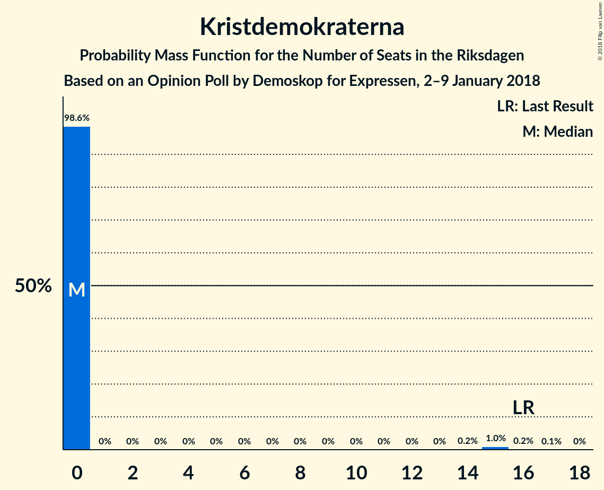

# Opinion Poll by Demoskop for Expressen, 2–9 January 2018

<a href="#voting-intentions">Voting Intentions</a> | <a href="#seats">Seats</a> | <a href="#coalitions">Coalitions</a> | <a href="#technical-information">Technical Information</a>

## Voting Intentions

### Confidence Intervals

| Party | Last Result | Poll Result | 80% Confidence Interval | 90% Confidence Interval | 95% Confidence Interval | 99% Confidence Interval |
|:-----:|:-----------:|:-----------:|:-----------------------:|:-----------------------:|:-----------------------:|:-----------------------:|
| Sveriges socialdemokratiska arbetareparti | 31.0% | 27.8% | 26.4–29.3% |26.0–29.7% |25.7–30.0% |25.0–30.7% |
| Moderata samlingspartiet | 23.3% | 22.6% | 21.3–24.0% |20.9–24.4% |20.6–24.7% |20.0–25.4% |
| Sverigedemokraterna | 12.9% | 17.9% | 16.8–19.2% |16.4–19.6% |16.1–19.9% |15.6–20.5% |
| Centerpartiet | 6.1% | 9.2% | 8.3–10.2% |8.1–10.5% |7.9–10.7% |7.5–11.2% |
| Vänsterpartiet | 5.7% | 7.2% | 6.4–8.1% |6.2–8.4% |6.0–8.6% |5.7–9.0% |
| Liberalerna | 5.4% | 4.5% | 3.9–5.3% |3.7–5.5% |3.6–5.7% |3.3–6.0% |
| Miljöpartiet de gröna | 6.9% | 4.4% | 3.8–5.1% |3.6–5.3% |3.5–5.5% |3.2–5.9% |
| Kristdemokraterna | 4.6% | 2.9% | 2.4–3.5% |2.3–3.7% |2.2–3.9% |2.0–4.2% |
| Feministiskt initiativ | 3.1% | 1.9% | 1.5–2.4% |1.4–2.6% |1.4–2.7% |1.2–3.0% |

*Note:* The poll result column reflects the actual value used in the calculations. Published results may vary slightly, and in addition be rounded to fewer digits.

## Seats

### Confidence Intervals

| Party | Last Result | Median | 80% Confidence Interval | 90% Confidence Interval | 95% Confidence Interval | 99% Confidence Interval |
|:-----:|:-----------:|:------:|:-----------------------:|:-----------------------:|:-----------------------:|:-----------------------:|
| <a href="#sveriges-socialdemokratiska-arbetareparti">Sveriges socialdemokratiska arbetareparti</a> | 113 | 102 | 98–110 |96–112 |95–114 |94–119 |
| <a href="#moderata-samlingspartiet">Moderata samlingspartiet</a> | 84 | 84 | 80–89 |75–91 |75–96 |73–100 |
| <a href="#sverigedemokraterna">Sverigedemokraterna</a> | 49 | 72 | 68–76 |65–77 |62–77 |59–79 |
| <a href="#centerpartiet">Centerpartiet</a> | 22 | 34 | 30–38 |29–38 |29–39 |27–43 |
| <a href="#vänsterpartiet">Vänsterpartiet</a> | 21 | 25 | 23–31 |21–31 |21–32 |21–34 |
| <a href="#liberalerna">Liberalerna</a> | 19 | 17 | 0–20 |0–21 |0–21 |0–22 |
| <a href="#miljöpartiet-de-gröna">Miljöpartiet de gröna</a> | 25 | 17 | 0–19 |0–20 |0–21 |0–23 |
| <a href="#kristdemokraterna">Kristdemokraterna</a> | 16 | 0 | 0 |0 |0 |0–16 |
| <a href="#feministiskt-initiativ">Feministiskt initiativ</a> | 0 | 0 | 0 |0 |0 |0 |

### Sveriges socialdemokratiska arbetareparti

*For a full overview of the results for this party, see the [Sveriges socialdemokratiska arbetareparti](party-sverigessocialdemokratiskaarbetareparti.html) page.*

| Number of Seats | Probability | Accumulated | Special Marks |
|:---------------:|:-----------:|:-----------:|:-------------:|
| 90 | 0.1% | 100% |  |
| 91 | 0% | 99.9% |  |
| 92 | 0.1% | 99.9% |  |
| 93 | 0.1% | 99.8% |  |
| 94 | 1.2% | 99.6% |  |
| 95 | 2% | 98% |  |
| 96 | 5% | 97% |  |
| 97 | 0.8% | 92% |  |
| 98 | 2% | 91% |  |
| 99 | 8% | 89% |  |
| 100 | 4% | 81% |  |
| 101 | 4% | 77% |  |
| 102 | 28% | 73% | Median |
| 103 | 3% | 45% |  |
| 104 | 6% | 42% |  |
| 105 | 2% | 37% |  |
| 106 | 14% | 34% |  |
| 107 | 3% | 20% |  |
| 108 | 0.8% | 18% |  |
| 109 | 7% | 17% |  |
| 110 | 0.6% | 10% |  |
| 111 | 2% | 10% |  |
| 112 | 3% | 7% |  |
| 113 | 2% | 4% | Last Result |
| 114 | 0.8% | 3% |  |
| 115 | 1.1% | 2% |  |
| 116 | 0.3% | 0.9% |  |
| 117 | 0.1% | 0.6% |  |
| 118 | 0% | 0.6% |  |
| 119 | 0.2% | 0.5% |  |
| 120 | 0.3% | 0.3% |  |
| 121 | 0% | 0% |  |

### Moderata samlingspartiet

*For a full overview of the results for this party, see the [Moderata samlingspartiet](party-moderatasamlingspartiet.html) page.*

| Number of Seats | Probability | Accumulated | Special Marks |
|:---------------:|:-----------:|:-----------:|:-------------:|
| 71 | 0.1% | 100% |  |
| 72 | 0.1% | 99.9% |  |
| 73 | 0.8% | 99.8% |  |
| 74 | 0.6% | 99.0% |  |
| 75 | 4% | 98% |  |
| 76 | 0.8% | 95% |  |
| 77 | 1.3% | 94% |  |
| 78 | 0.6% | 93% |  |
| 79 | 0.5% | 92% |  |
| 80 | 3% | 92% |  |
| 81 | 0.6% | 89% |  |
| 82 | 18% | 88% |  |
| 83 | 2% | 70% |  |
| 84 | 26% | 68% | Last Result, Median |
| 85 | 3% | 41% |  |
| 86 | 15% | 39% |  |
| 87 | 9% | 24% |  |
| 88 | 4% | 15% |  |
| 89 | 2% | 11% |  |
| 90 | 2% | 9% |  |
| 91 | 3% | 7% |  |
| 92 | 0.3% | 4% |  |
| 93 | 0.9% | 4% |  |
| 94 | 0.1% | 3% |  |
| 95 | 0.1% | 3% |  |
| 96 | 0.8% | 3% |  |
| 97 | 0.1% | 2% |  |
| 98 | 0.8% | 2% |  |
| 99 | 0% | 0.8% |  |
| 100 | 0.8% | 0.8% |  |
| 101 | 0% | 0% |  |

### Sverigedemokraterna

*For a full overview of the results for this party, see the [Sverigedemokraterna](party-sverigedemokraterna.html) page.*

| Number of Seats | Probability | Accumulated | Special Marks |
|:---------------:|:-----------:|:-----------:|:-------------:|
| 49 | 0% | 100% | Last Result |
| 50 | 0% | 100% |  |
| 51 | 0% | 100% |  |
| 52 | 0% | 100% |  |
| 53 | 0% | 100% |  |
| 54 | 0.2% | 100% |  |
| 55 | 0% | 99.8% |  |
| 56 | 0.1% | 99.8% |  |
| 57 | 0% | 99.6% |  |
| 58 | 0.1% | 99.6% |  |
| 59 | 0.1% | 99.5% |  |
| 60 | 0.1% | 99.5% |  |
| 61 | 0.3% | 99.4% |  |
| 62 | 3% | 99.1% |  |
| 63 | 0.3% | 96% |  |
| 64 | 0.8% | 96% |  |
| 65 | 1.1% | 95% |  |
| 66 | 2% | 94% |  |
| 67 | 1.1% | 92% |  |
| 68 | 1.5% | 91% |  |
| 69 | 3% | 90% |  |
| 70 | 17% | 87% |  |
| 71 | 6% | 70% |  |
| 72 | 26% | 64% | Median |
| 73 | 9% | 38% |  |
| 74 | 7% | 29% |  |
| 75 | 8% | 22% |  |
| 76 | 9% | 14% |  |
| 77 | 3% | 6% |  |
| 78 | 1.0% | 2% |  |
| 79 | 0.8% | 1.1% |  |
| 80 | 0.3% | 0.3% |  |
| 81 | 0% | 0.1% |  |
| 82 | 0% | 0% |  |

### Centerpartiet

*For a full overview of the results for this party, see the [Centerpartiet](party-centerpartiet.html) page.*

| Number of Seats | Probability | Accumulated | Special Marks |
|:---------------:|:-----------:|:-----------:|:-------------:|
| 22 | 0% | 100% | Last Result |
| 23 | 0% | 100% |  |
| 24 | 0% | 100% |  |
| 25 | 0% | 100% |  |
| 26 | 0.4% | 100% |  |
| 27 | 0.8% | 99.6% |  |
| 28 | 0.8% | 98.7% |  |
| 29 | 7% | 98% |  |
| 30 | 4% | 90% |  |
| 31 | 7% | 86% |  |
| 32 | 11% | 79% |  |
| 33 | 8% | 68% |  |
| 34 | 26% | 59% | Median |
| 35 | 15% | 33% |  |
| 36 | 5% | 18% |  |
| 37 | 3% | 13% |  |
| 38 | 6% | 10% |  |
| 39 | 3% | 4% |  |
| 40 | 0.3% | 1.3% |  |
| 41 | 0.3% | 1.1% |  |
| 42 | 0.1% | 0.8% |  |
| 43 | 0.4% | 0.7% |  |
| 44 | 0.3% | 0.3% |  |
| 45 | 0% | 0% |  |

### Vänsterpartiet

*For a full overview of the results for this party, see the [Vänsterpartiet](party-vänsterpartiet.html) page.*

| Number of Seats | Probability | Accumulated | Special Marks |
|:---------------:|:-----------:|:-----------:|:-------------:|
| 20 | 0.4% | 100% |  |
| 21 | 6% | 99.6% | Last Result |
| 22 | 2% | 94% |  |
| 23 | 26% | 92% |  |
| 24 | 8% | 65% |  |
| 25 | 11% | 57% | Median |
| 26 | 16% | 46% |  |
| 27 | 6% | 30% |  |
| 28 | 5% | 24% |  |
| 29 | 4% | 19% |  |
| 30 | 2% | 15% |  |
| 31 | 8% | 13% |  |
| 32 | 4% | 5% |  |
| 33 | 0.6% | 1.3% |  |
| 34 | 0.6% | 0.6% |  |
| 35 | 0% | 0.1% |  |
| 36 | 0% | 0% |  |

### Liberalerna

*For a full overview of the results for this party, see the [Liberalerna](party-liberalerna.html) page.*

| Number of Seats | Probability | Accumulated | Special Marks |
|:---------------:|:-----------:|:-----------:|:-------------:|
| 0 | 11% | 100% |  |
| 1 | 0% | 89% |  |
| 2 | 0% | 89% |  |
| 3 | 0% | 89% |  |
| 4 | 0% | 89% |  |
| 5 | 0% | 89% |  |
| 6 | 0% | 89% |  |
| 7 | 0% | 89% |  |
| 8 | 0% | 89% |  |
| 9 | 0% | 89% |  |
| 10 | 0% | 89% |  |
| 11 | 0% | 89% |  |
| 12 | 0% | 89% |  |
| 13 | 0% | 89% |  |
| 14 | 0% | 89% |  |
| 15 | 14% | 89% |  |
| 16 | 11% | 74% |  |
| 17 | 24% | 64% | Median |
| 18 | 12% | 40% |  |
| 19 | 16% | 28% | Last Result |
| 20 | 6% | 11% |  |
| 21 | 4% | 5% |  |
| 22 | 0.8% | 1.1% |  |
| 23 | 0.2% | 0.3% |  |
| 24 | 0.1% | 0.1% |  |
| 25 | 0% | 0% |  |

### Miljöpartiet de gröna

*For a full overview of the results for this party, see the [Miljöpartiet de gröna](party-miljöpartietdegröna.html) page.*

| Number of Seats | Probability | Accumulated | Special Marks |
|:---------------:|:-----------:|:-----------:|:-------------:|
| 0 | 18% | 100% |  |
| 1 | 0% | 82% |  |
| 2 | 0% | 82% |  |
| 3 | 0% | 82% |  |
| 4 | 0% | 82% |  |
| 5 | 0% | 82% |  |
| 6 | 0% | 82% |  |
| 7 | 0% | 82% |  |
| 8 | 0% | 82% |  |
| 9 | 0% | 82% |  |
| 10 | 0% | 82% |  |
| 11 | 0% | 82% |  |
| 12 | 0% | 82% |  |
| 13 | 0% | 82% |  |
| 14 | 0% | 82% |  |
| 15 | 9% | 82% |  |
| 16 | 9% | 73% |  |
| 17 | 34% | 64% | Median |
| 18 | 16% | 30% |  |
| 19 | 6% | 14% |  |
| 20 | 4% | 8% |  |
| 21 | 3% | 4% |  |
| 22 | 0.4% | 1.2% |  |
| 23 | 0.6% | 0.7% |  |
| 24 | 0.1% | 0.1% |  |
| 25 | 0% | 0% | Last Result |

### Kristdemokraterna

*For a full overview of the results for this party, see the [Kristdemokraterna](party-kristdemokraterna.html) page.*

| Number of Seats | Probability | Accumulated | Special Marks |
|:---------------:|:-----------:|:-----------:|:-------------:|
| 0 | 98.5% | 100% | Median |
| 1 | 0% | 1.5% |  |
| 2 | 0% | 1.5% |  |
| 3 | 0% | 1.5% |  |
| 4 | 0% | 1.5% |  |
| 5 | 0% | 1.5% |  |
| 6 | 0% | 1.5% |  |
| 7 | 0% | 1.5% |  |
| 8 | 0% | 1.5% |  |
| 9 | 0% | 1.5% |  |
| 10 | 0% | 1.5% |  |
| 11 | 0% | 1.5% |  |
| 12 | 0% | 1.5% |  |
| 13 | 0% | 1.5% |  |
| 14 | 0% | 1.5% |  |
| 15 | 0.9% | 1.5% |  |
| 16 | 0.4% | 0.5% | Last Result |
| 17 | 0.1% | 0.1% |  |
| 18 | 0% | 0% |  |

### Feministiskt initiativ

*For a full overview of the results for this party, see the [Feministiskt initiativ](party-feministisktinitiativ.html) page.*

| Number of Seats | Probability | Accumulated | Special Marks |
|:---------------:|:-----------:|:-----------:|:-------------:|
| 0 | 100% | 100% | Last Result, Median |

## Coalitions

### Confidence Intervals

| Coalition | Last Result | Median | Majority? | 80% Confidence Interval | 90% Confidence Interval | 95% Confidence Interval | 99% Confidence Interval |
|:---------:|:-----------:|:------:|:---------:|:-----------------------:|:-----------------------:|:-----------------------:|:-----------------------:|
| Sveriges socialdemokratiska arbetareparti – Moderata samlingspartiet | 197 | 187 | 99.2% | 182–195 | 180–199 | 178–203 | 172–210 |
| Moderata samlingspartiet – Sverigedemokraterna | 133 | 156 | 0.1% | 150–163 | 145–164 | 144–166 | 140–172 |
| Sveriges socialdemokratiska arbetareparti – Vänsterpartiet – Miljöpartiet de gröna – Feministiskt initiativ | 159 | 142 | 0% | 137–152 | 134–154 | 134–157 | 127–160 |
| Sveriges socialdemokratiska arbetareparti – Vänsterpartiet – Miljöpartiet de gröna | 159 | 142 | 0% | 137–152 | 134–154 | 134–157 | 127–160 |
| Moderata samlingspartiet – Centerpartiet – Liberalerna – Kristdemokraterna | 141 | 135 | 0% | 127–139 | 120–144 | 120–145 | 118–153 |
| Moderata samlingspartiet – Centerpartiet – Liberalerna | 125 | 135 | 0% | 125–139 | 120–144 | 119–145 | 118–153 |
| Sveriges socialdemokratiska arbetareparti – Vänsterpartiet | 134 | 127 | 0% | 122–137 | 122–139 | 120–140 | 118–149 |
| Sveriges socialdemokratiska arbetareparti – Miljöpartiet de gröna | 138 | 119 | 0% | 106–127 | 106–129 | 102–131 | 101–136 |
| Moderata samlingspartiet – Centerpartiet – Kristdemokraterna | 122 | 118 | 0% | 113–124 | 110–127 | 109–130 | 106–134 |
| Moderata samlingspartiet – Centerpartiet | 106 | 118 | 0% | 113–123 | 110–127 | 108–130 | 104–134 |

### Sveriges socialdemokratiska arbetareparti – Moderata samlingspartiet

| Number of Seats | Probability | Accumulated | Special Marks |
|:---------------:|:-----------:|:-----------:|:-------------:|
| 169 | 0% | 100% |  |
| 170 | 0% | 99.9% |  |
| 171 | 0.1% | 99.9% |  |
| 172 | 0.4% | 99.8% |  |
| 173 | 0.1% | 99.4% |  |
| 174 | 0.1% | 99.3% |  |
| 175 | 0.1% | 99.2% | Majority |
| 176 | 0.6% | 99.1% |  |
| 177 | 0.3% | 98% |  |
| 178 | 0.8% | 98% |  |
| 179 | 2% | 97% |  |
| 180 | 2% | 96% |  |
| 181 | 1.3% | 94% |  |
| 182 | 4% | 92% |  |
| 183 | 1.2% | 88% |  |
| 184 | 8% | 87% |  |
| 185 | 7% | 80% |  |
| 186 | 21% | 72% | Median |
| 187 | 3% | 52% |  |
| 188 | 18% | 48% |  |
| 189 | 1.0% | 30% |  |
| 190 | 3% | 29% |  |
| 191 | 12% | 26% |  |
| 192 | 2% | 14% |  |
| 193 | 1.0% | 12% |  |
| 194 | 0.8% | 11% |  |
| 195 | 0.5% | 10% |  |
| 196 | 0.6% | 10% |  |
| 197 | 0.7% | 9% | Last Result |
| 198 | 0.2% | 9% |  |
| 199 | 4% | 8% |  |
| 200 | 0.3% | 5% |  |
| 201 | 2% | 5% |  |
| 202 | 0.2% | 3% |  |
| 203 | 0.6% | 3% |  |
| 204 | 0.5% | 2% |  |
| 205 | 0.5% | 2% |  |
| 206 | 0.1% | 1.2% |  |
| 207 | 0.2% | 1.1% |  |
| 208 | 0.1% | 0.9% |  |
| 209 | 0% | 0.8% |  |
| 210 | 0.7% | 0.8% |  |
| 211 | 0% | 0.1% |  |
| 212 | 0% | 0.1% |  |
| 213 | 0% | 0% |  |

### Moderata samlingspartiet – Sverigedemokraterna

| Number of Seats | Probability | Accumulated | Special Marks |
|:---------------:|:-----------:|:-----------:|:-------------:|
| 133 | 0% | 100% | Last Result |
| 134 | 0% | 100% |  |
| 135 | 0% | 100% |  |
| 136 | 0% | 100% |  |
| 137 | 0% | 99.9% |  |
| 138 | 0.1% | 99.9% |  |
| 139 | 0% | 99.8% |  |
| 140 | 0.4% | 99.8% |  |
| 141 | 0.9% | 99.4% |  |
| 142 | 0.3% | 98% |  |
| 143 | 0.2% | 98% |  |
| 144 | 1.2% | 98% |  |
| 145 | 2% | 97% |  |
| 146 | 1.3% | 95% |  |
| 147 | 0.4% | 93% |  |
| 148 | 1.3% | 93% |  |
| 149 | 0.8% | 92% |  |
| 150 | 1.2% | 91% |  |
| 151 | 1.0% | 90% |  |
| 152 | 9% | 88% |  |
| 153 | 5% | 80% |  |
| 154 | 2% | 74% |  |
| 155 | 4% | 72% |  |
| 156 | 20% | 68% | Median |
| 157 | 8% | 48% |  |
| 158 | 12% | 40% |  |
| 159 | 6% | 28% |  |
| 160 | 5% | 22% |  |
| 161 | 4% | 17% |  |
| 162 | 3% | 13% |  |
| 163 | 4% | 10% |  |
| 164 | 1.4% | 6% |  |
| 165 | 2% | 5% |  |
| 166 | 1.0% | 3% |  |
| 167 | 0.8% | 2% |  |
| 168 | 0.2% | 2% |  |
| 169 | 0.3% | 1.3% |  |
| 170 | 0% | 1.0% |  |
| 171 | 0.1% | 1.0% |  |
| 172 | 0.5% | 0.9% |  |
| 173 | 0% | 0.4% |  |
| 174 | 0.2% | 0.3% |  |
| 175 | 0% | 0.1% | Majority |
| 176 | 0% | 0.1% |  |
| 177 | 0.1% | 0.1% |  |
| 178 | 0% | 0% |  |

### Sveriges socialdemokratiska arbetareparti – Vänsterpartiet – Miljöpartiet de gröna – Feministiskt initiativ

| Number of Seats | Probability | Accumulated | Special Marks |
|:---------------:|:-----------:|:-----------:|:-------------:|
| 126 | 0% | 100% |  |
| 127 | 0.4% | 99.9% |  |
| 128 | 0% | 99.5% |  |
| 129 | 0.1% | 99.4% |  |
| 130 | 0.6% | 99.3% |  |
| 131 | 0.1% | 98.6% |  |
| 132 | 0.5% | 98.6% |  |
| 133 | 0.1% | 98% |  |
| 134 | 3% | 98% |  |
| 135 | 2% | 95% |  |
| 136 | 2% | 93% |  |
| 137 | 11% | 91% |  |
| 138 | 5% | 81% |  |
| 139 | 3% | 76% |  |
| 140 | 5% | 73% |  |
| 141 | 2% | 67% |  |
| 142 | 19% | 65% |  |
| 143 | 3% | 46% |  |
| 144 | 12% | 43% | Median |
| 145 | 0.6% | 32% |  |
| 146 | 3% | 31% |  |
| 147 | 1.1% | 28% |  |
| 148 | 6% | 27% |  |
| 149 | 4% | 21% |  |
| 150 | 4% | 18% |  |
| 151 | 3% | 14% |  |
| 152 | 0.7% | 10% |  |
| 153 | 2% | 9% |  |
| 154 | 3% | 7% |  |
| 155 | 1.3% | 4% |  |
| 156 | 0.1% | 3% |  |
| 157 | 1.2% | 3% |  |
| 158 | 0.5% | 2% |  |
| 159 | 0.2% | 1.3% | Last Result |
| 160 | 0.7% | 1.1% |  |
| 161 | 0.2% | 0.4% |  |
| 162 | 0% | 0.2% |  |
| 163 | 0.1% | 0.2% |  |
| 164 | 0.1% | 0.1% |  |
| 165 | 0% | 0% |  |

### Sveriges socialdemokratiska arbetareparti – Vänsterpartiet – Miljöpartiet de gröna

| Number of Seats | Probability | Accumulated | Special Marks |
|:---------------:|:-----------:|:-----------:|:-------------:|
| 126 | 0% | 100% |  |
| 127 | 0.4% | 99.9% |  |
| 128 | 0% | 99.5% |  |
| 129 | 0.1% | 99.4% |  |
| 130 | 0.6% | 99.3% |  |
| 131 | 0.1% | 98.6% |  |
| 132 | 0.5% | 98.6% |  |
| 133 | 0.1% | 98% |  |
| 134 | 3% | 98% |  |
| 135 | 2% | 95% |  |
| 136 | 2% | 93% |  |
| 137 | 11% | 91% |  |
| 138 | 5% | 81% |  |
| 139 | 3% | 76% |  |
| 140 | 5% | 73% |  |
| 141 | 2% | 67% |  |
| 142 | 19% | 65% |  |
| 143 | 3% | 46% |  |
| 144 | 12% | 43% | Median |
| 145 | 0.6% | 32% |  |
| 146 | 3% | 31% |  |
| 147 | 1.1% | 28% |  |
| 148 | 6% | 27% |  |
| 149 | 4% | 21% |  |
| 150 | 4% | 18% |  |
| 151 | 3% | 14% |  |
| 152 | 0.7% | 10% |  |
| 153 | 2% | 9% |  |
| 154 | 3% | 7% |  |
| 155 | 1.3% | 4% |  |
| 156 | 0.1% | 3% |  |
| 157 | 1.2% | 3% |  |
| 158 | 0.5% | 2% |  |
| 159 | 0.2% | 1.3% | Last Result |
| 160 | 0.7% | 1.1% |  |
| 161 | 0.2% | 0.4% |  |
| 162 | 0% | 0.2% |  |
| 163 | 0.1% | 0.2% |  |
| 164 | 0.1% | 0.1% |  |
| 165 | 0% | 0% |  |

### Moderata samlingspartiet – Centerpartiet – Liberalerna – Kristdemokraterna

| Number of Seats | Probability | Accumulated | Special Marks |
|:---------------:|:-----------:|:-----------:|:-------------:|
| 112 | 0.1% | 100% |  |
| 113 | 0% | 99.9% |  |
| 114 | 0.1% | 99.9% |  |
| 115 | 0% | 99.8% |  |
| 116 | 0% | 99.8% |  |
| 117 | 0.1% | 99.8% |  |
| 118 | 1.1% | 99.7% |  |
| 119 | 1.0% | 98.6% |  |
| 120 | 4% | 98% |  |
| 121 | 0.2% | 94% |  |
| 122 | 0.9% | 94% |  |
| 123 | 0.3% | 93% |  |
| 124 | 0.6% | 93% |  |
| 125 | 1.5% | 92% |  |
| 126 | 0.3% | 91% |  |
| 127 | 3% | 90% |  |
| 128 | 3% | 88% |  |
| 129 | 5% | 85% |  |
| 130 | 1.0% | 80% |  |
| 131 | 8% | 79% |  |
| 132 | 7% | 71% |  |
| 133 | 1.3% | 64% |  |
| 134 | 3% | 63% |  |
| 135 | 25% | 60% | Median |
| 136 | 10% | 35% |  |
| 137 | 5% | 25% |  |
| 138 | 4% | 21% |  |
| 139 | 6% | 16% |  |
| 140 | 2% | 10% |  |
| 141 | 0.6% | 8% | Last Result |
| 142 | 1.1% | 7% |  |
| 143 | 0.3% | 6% |  |
| 144 | 3% | 6% |  |
| 145 | 0.6% | 3% |  |
| 146 | 0.2% | 2% |  |
| 147 | 0.1% | 2% |  |
| 148 | 0.3% | 2% |  |
| 149 | 0.1% | 2% |  |
| 150 | 0.2% | 2% |  |
| 151 | 0.1% | 1.3% |  |
| 152 | 0% | 1.2% |  |
| 153 | 1.1% | 1.2% |  |
| 154 | 0% | 0.1% |  |
| 155 | 0% | 0.1% |  |
| 156 | 0% | 0.1% |  |
| 157 | 0% | 0% |  |

### Moderata samlingspartiet – Centerpartiet – Liberalerna

| Number of Seats | Probability | Accumulated | Special Marks |
|:---------------:|:-----------:|:-----------:|:-------------:|
| 111 | 0.1% | 100% |  |
| 112 | 0.1% | 99.9% |  |
| 113 | 0% | 99.8% |  |
| 114 | 0.1% | 99.8% |  |
| 115 | 0% | 99.7% |  |
| 116 | 0% | 99.7% |  |
| 117 | 0.1% | 99.7% |  |
| 118 | 1.2% | 99.6% |  |
| 119 | 1.5% | 98% |  |
| 120 | 4% | 97% |  |
| 121 | 0.2% | 93% |  |
| 122 | 0.9% | 93% |  |
| 123 | 0.4% | 92% |  |
| 124 | 0.6% | 92% |  |
| 125 | 2% | 91% | Last Result |
| 126 | 0.4% | 90% |  |
| 127 | 3% | 89% |  |
| 128 | 3% | 86% |  |
| 129 | 5% | 84% |  |
| 130 | 1.1% | 79% |  |
| 131 | 8% | 78% |  |
| 132 | 7% | 70% |  |
| 133 | 1.3% | 63% |  |
| 134 | 2% | 62% |  |
| 135 | 25% | 59% | Median |
| 136 | 10% | 34% |  |
| 137 | 5% | 25% |  |
| 138 | 4% | 20% |  |
| 139 | 6% | 16% |  |
| 140 | 2% | 9% |  |
| 141 | 0.5% | 7% |  |
| 142 | 0.8% | 6% |  |
| 143 | 0.2% | 6% |  |
| 144 | 3% | 6% |  |
| 145 | 0.6% | 3% |  |
| 146 | 0.1% | 2% |  |
| 147 | 0% | 2% |  |
| 148 | 0.3% | 2% |  |
| 149 | 0.1% | 2% |  |
| 150 | 0.2% | 1.5% |  |
| 151 | 0.1% | 1.3% |  |
| 152 | 0% | 1.2% |  |
| 153 | 1.1% | 1.1% |  |
| 154 | 0% | 0% |  |

### Sveriges socialdemokratiska arbetareparti – Vänsterpartiet

| Number of Seats | Probability | Accumulated | Special Marks |
|:---------------:|:-----------:|:-----------:|:-------------:|
| 115 | 0% | 100% |  |
| 116 | 0.1% | 99.9% |  |
| 117 | 0.1% | 99.9% |  |
| 118 | 0.4% | 99.8% |  |
| 119 | 2% | 99.4% |  |
| 120 | 1.0% | 98% |  |
| 121 | 0.7% | 97% |  |
| 122 | 10% | 96% |  |
| 123 | 2% | 86% |  |
| 124 | 3% | 84% |  |
| 125 | 23% | 81% |  |
| 126 | 0.6% | 59% |  |
| 127 | 13% | 58% | Median |
| 128 | 0.9% | 45% |  |
| 129 | 0.4% | 44% |  |
| 130 | 6% | 44% |  |
| 131 | 2% | 38% |  |
| 132 | 5% | 36% |  |
| 133 | 3% | 31% |  |
| 134 | 5% | 28% | Last Result |
| 135 | 3% | 23% |  |
| 136 | 2% | 20% |  |
| 137 | 11% | 18% |  |
| 138 | 0.6% | 7% |  |
| 139 | 3% | 7% |  |
| 140 | 0.8% | 3% |  |
| 141 | 0.7% | 2% |  |
| 142 | 0.4% | 2% |  |
| 143 | 0.1% | 1.1% |  |
| 144 | 0% | 1.1% |  |
| 145 | 0.2% | 1.0% |  |
| 146 | 0.1% | 0.8% |  |
| 147 | 0.1% | 0.7% |  |
| 148 | 0.1% | 0.6% |  |
| 149 | 0.2% | 0.5% |  |
| 150 | 0% | 0.3% |  |
| 151 | 0% | 0.2% |  |
| 152 | 0% | 0.2% |  |
| 153 | 0.2% | 0.2% |  |
| 154 | 0% | 0% |  |

### Sveriges socialdemokratiska arbetareparti – Miljöpartiet de gröna

| Number of Seats | Probability | Accumulated | Special Marks |
|:---------------:|:-----------:|:-----------:|:-------------:|
| 97 | 0% | 100% |  |
| 98 | 0% | 99.9% |  |
| 99 | 0% | 99.9% |  |
| 100 | 0% | 99.9% |  |
| 101 | 0.7% | 99.9% |  |
| 102 | 3% | 99.2% |  |
| 103 | 0.6% | 96% |  |
| 104 | 0.1% | 95% |  |
| 105 | 0.3% | 95% |  |
| 106 | 8% | 95% |  |
| 107 | 0.5% | 87% |  |
| 108 | 0.5% | 87% |  |
| 109 | 0.2% | 86% |  |
| 110 | 0.5% | 86% |  |
| 111 | 5% | 85% |  |
| 112 | 2% | 80% |  |
| 113 | 1.1% | 78% |  |
| 114 | 1.0% | 77% |  |
| 115 | 7% | 76% |  |
| 116 | 3% | 69% |  |
| 117 | 4% | 66% |  |
| 118 | 4% | 62% |  |
| 119 | 25% | 59% | Median |
| 120 | 2% | 33% |  |
| 121 | 4% | 32% |  |
| 122 | 6% | 28% |  |
| 123 | 6% | 23% |  |
| 124 | 3% | 17% |  |
| 125 | 1.3% | 14% |  |
| 126 | 1.4% | 13% |  |
| 127 | 5% | 11% |  |
| 128 | 0.8% | 7% |  |
| 129 | 3% | 6% |  |
| 130 | 0.2% | 3% |  |
| 131 | 1.2% | 3% |  |
| 132 | 0.5% | 1.3% |  |
| 133 | 0.1% | 0.8% |  |
| 134 | 0.1% | 0.7% |  |
| 135 | 0% | 0.6% |  |
| 136 | 0.5% | 0.6% |  |
| 137 | 0% | 0.1% |  |
| 138 | 0.1% | 0.1% | Last Result |
| 139 | 0% | 0% |  |

### Moderata samlingspartiet – Centerpartiet – Kristdemokraterna

| Number of Seats | Probability | Accumulated | Special Marks |
|:---------------:|:-----------:|:-----------:|:-------------:|
| 102 | 0.1% | 100% |  |
| 103 | 0% | 99.9% |  |
| 104 | 0% | 99.9% |  |
| 105 | 0.2% | 99.9% |  |
| 106 | 0.7% | 99.6% |  |
| 107 | 0.7% | 99.0% |  |
| 108 | 0.4% | 98% |  |
| 109 | 1.0% | 98% |  |
| 110 | 3% | 97% |  |
| 111 | 0.8% | 94% |  |
| 112 | 2% | 93% |  |
| 113 | 2% | 91% |  |
| 114 | 5% | 89% |  |
| 115 | 2% | 84% |  |
| 116 | 8% | 82% |  |
| 117 | 17% | 75% |  |
| 118 | 21% | 58% | Median |
| 119 | 5% | 37% |  |
| 120 | 12% | 32% |  |
| 121 | 3% | 20% |  |
| 122 | 4% | 18% | Last Result |
| 123 | 3% | 13% |  |
| 124 | 2% | 10% |  |
| 125 | 1.0% | 8% |  |
| 126 | 1.2% | 7% |  |
| 127 | 2% | 6% |  |
| 128 | 0.5% | 4% |  |
| 129 | 0.4% | 3% |  |
| 130 | 0.6% | 3% |  |
| 131 | 0.1% | 2% |  |
| 132 | 0.5% | 2% |  |
| 133 | 0.3% | 2% |  |
| 134 | 1.1% | 1.3% |  |
| 135 | 0.1% | 0.2% |  |
| 136 | 0% | 0.1% |  |
| 137 | 0% | 0.1% |  |
| 138 | 0% | 0.1% |  |
| 139 | 0% | 0.1% |  |
| 140 | 0% | 0% |  |

### Moderata samlingspartiet – Centerpartiet

| Number of Seats | Probability | Accumulated | Special Marks |
|:---------------:|:-----------:|:-----------:|:-------------:|
| 102 | 0.1% | 100% |  |
| 103 | 0% | 99.9% |  |
| 104 | 0.5% | 99.9% |  |
| 105 | 0.2% | 99.4% |  |
| 106 | 0.7% | 99.1% | Last Result |
| 107 | 0.7% | 98% |  |
| 108 | 0.4% | 98% |  |
| 109 | 1.0% | 97% |  |
| 110 | 3% | 96% |  |
| 111 | 1.0% | 93% |  |
| 112 | 2% | 92% |  |
| 113 | 2% | 90% |  |
| 114 | 5% | 88% |  |
| 115 | 2% | 83% |  |
| 116 | 8% | 81% |  |
| 117 | 17% | 74% |  |
| 118 | 21% | 57% | Median |
| 119 | 5% | 36% |  |
| 120 | 12% | 31% |  |
| 121 | 3% | 19% |  |
| 122 | 4% | 17% |  |
| 123 | 3% | 13% |  |
| 124 | 2% | 9% |  |
| 125 | 0.7% | 7% |  |
| 126 | 1.1% | 6% |  |
| 127 | 2% | 5% |  |
| 128 | 0.4% | 3% |  |
| 129 | 0.4% | 3% |  |
| 130 | 0.6% | 3% |  |
| 131 | 0% | 2% |  |
| 132 | 0.4% | 2% |  |
| 133 | 0.3% | 1.4% |  |
| 134 | 1.0% | 1.1% |  |
| 135 | 0% | 0.1% |  |
| 136 | 0% | 0.1% |  |
| 137 | 0% | 0.1% |  |
| 138 | 0% | 0% |  |

## Technical Information

### Opinion Poll

+ **Polling firm:** Demoskop
+ **Commissioner(s):** Expressen
+ **Fieldwork period:** 2–9 January 2018

### Calculations

+ **Sample size:** 1612
+ **Simulations done:** 131,072
+ **Error estimate:** 0.55%

