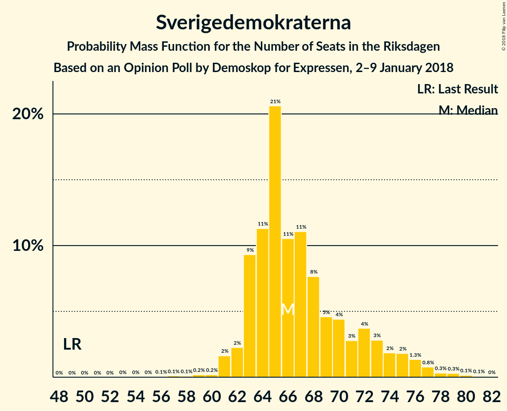
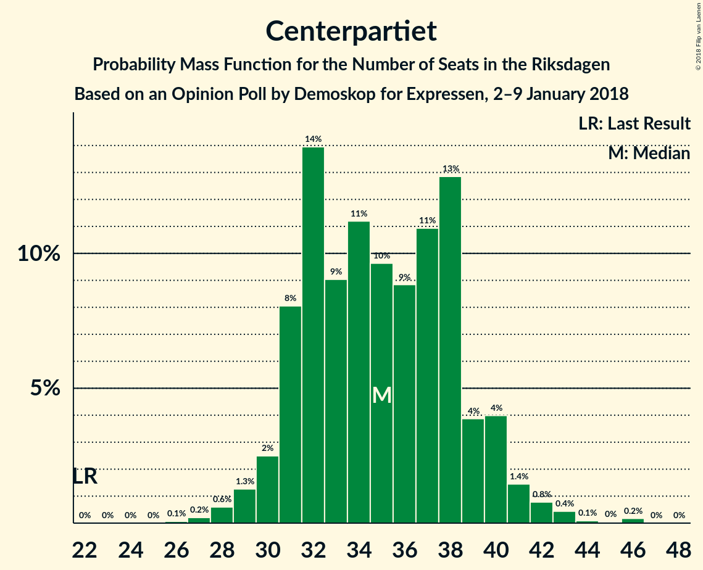
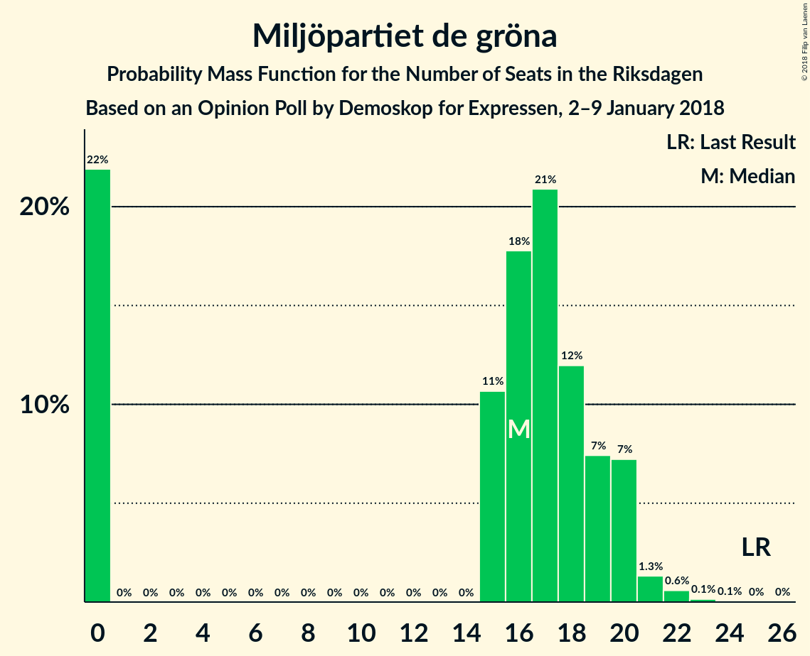

# Opinion Poll by Demoskop for Expressen, 2–9 January 2018

<a href="#voting-intentions">Voting Intentions</a> | <a href="#seats">Seats</a> | <a href="#coalitions">Coalitions</a> | <a href="#technical-information">Technical Information</a>

## Voting Intentions

### Confidence Intervals

| Party | Last Result | Poll Result | 80% Confidence Interval | 90% Confidence Interval | 95% Confidence Interval | 99% Confidence Interval |
|:-----:|:-----------:|:-----------:|:-----------------------:|:-----------------------:|:-----------------------:|:-----------------------:|
| Sveriges socialdemokratiska arbetareparti | 31.0% | 27.8% | 26.4–29.3% |26.0–29.7% |25.7–30.0% |25.0–30.7% |
| Moderata samlingspartiet | 23.3% | 22.6% | 21.3–24.0% |20.9–24.4% |20.6–24.7% |20.0–25.4% |
| Sverigedemokraterna | 12.9% | 17.9% | 16.8–19.2% |16.4–19.6% |16.1–19.9% |15.6–20.5% |
| Centerpartiet | 6.1% | 9.2% | 8.3–10.2% |8.1–10.5% |7.9–10.7% |7.5–11.2% |
| Vänsterpartiet | 5.7% | 7.2% | 6.4–8.1% |6.2–8.4% |6.0–8.6% |5.7–9.0% |
| Liberalerna | 5.4% | 4.5% | 3.9–5.3% |3.7–5.5% |3.6–5.7% |3.3–6.0% |
| Miljöpartiet de gröna | 6.9% | 4.4% | 3.8–5.1% |3.6–5.3% |3.5–5.5% |3.2–5.9% |
| Kristdemokraterna | 4.6% | 2.9% | 2.4–3.5% |2.3–3.7% |2.2–3.9% |2.0–4.2% |
| Feministiskt initiativ | 3.1% | 1.9% | 1.5–2.4% |1.4–2.6% |1.4–2.7% |1.2–3.0% |

*Note:* The poll result column reflects the actual value used in the calculations. Published results may vary slightly, and in addition be rounded to fewer digits.

## Seats

### Confidence Intervals

| Party | Last Result | Median | 80% Confidence Interval | 90% Confidence Interval | 95% Confidence Interval | 99% Confidence Interval |
|:-----:|:-----------:|:------:|:-----------------------:|:-----------------------:|:-----------------------:|:-----------------------:|
| <a href="#sveriges-socialdemokratiska-arbetareparti">Sveriges socialdemokratiska arbetareparti</a> | 113 | 105 | 99–111 |97–114 |96–115 |94–119 |
| <a href="#moderata-samlingspartiet">Moderata samlingspartiet</a> | 84 | 84 | 80–91 |79–92 |77–93 |75–98 |
| <a href="#sverigedemokraterna">Sverigedemokraterna</a> | 49 | 66 | 63–72 |63–74 |62–76 |60–79 |
| <a href="#centerpartiet">Centerpartiet</a> | 22 | 35 | 31–39 |31–40 |30–41 |28–43 |
| <a href="#vänsterpartiet">Vänsterpartiet</a> | 21 | 28 | 25–31 |23–32 |23–32 |21–34 |
| <a href="#liberalerna">Liberalerna</a> | 19 | 17 | 0–20 |0–21 |0–21 |0–23 |
| <a href="#miljöpartiet-de-gröna">Miljöpartiet de gröna</a> | 25 | 16 | 0–19 |0–20 |0–20 |0–22 |
| <a href="#kristdemokraterna">Kristdemokraterna</a> | 16 | 0 | 0 |0 |0 |0–15 |
| <a href="#feministiskt-initiativ">Feministiskt initiativ</a> | 0 | 0 | 0 |0 |0 |0 |

### Sveriges socialdemokratiska arbetareparti

*For a full overview of the results for this party, see the [Sveriges socialdemokratiska arbetareparti](party-sverigessocialdemokratiskaarbetareparti.html) page.*

| Number of Seats | Probability | Accumulated | Special Marks |
|:---------------:|:-----------:|:-----------:|:-------------:|
| 90 | 0% | 100% |  |
| 91 | 0.1% | 99.9% |  |
| 92 | 0.1% | 99.8% |  |
| 93 | 0.1% | 99.7% |  |
| 94 | 0.3% | 99.6% |  |
| 95 | 0.9% | 99.3% |  |
| 96 | 2% | 98% |  |
| 97 | 4% | 96% |  |
| 98 | 3% | 93% |  |
| 99 | 2% | 90% |  |
| 100 | 4% | 88% |  |
| 101 | 7% | 84% |  |
| 102 | 8% | 77% |  |
| 103 | 8% | 69% |  |
| 104 | 10% | 61% |  |
| 105 | 6% | 51% | Median |
| 106 | 4% | 45% |  |
| 107 | 11% | 41% |  |
| 108 | 7% | 30% |  |
| 109 | 6% | 23% |  |
| 110 | 4% | 17% |  |
| 111 | 4% | 13% |  |
| 112 | 1.1% | 9% |  |
| 113 | 1.0% | 8% | Last Result |
| 114 | 3% | 7% |  |
| 115 | 2% | 4% |  |
| 116 | 0.9% | 2% |  |
| 117 | 0.3% | 1.1% |  |
| 118 | 0.3% | 0.8% |  |
| 119 | 0.2% | 0.5% |  |
| 120 | 0.1% | 0.3% |  |
| 121 | 0.1% | 0.3% |  |
| 122 | 0.1% | 0.1% |  |
| 123 | 0% | 0% |  |

### Moderata samlingspartiet

*For a full overview of the results for this party, see the [Moderata samlingspartiet](party-moderatasamlingspartiet.html) page.*

| Number of Seats | Probability | Accumulated | Special Marks |
|:---------------:|:-----------:|:-----------:|:-------------:|
| 72 | 0% | 100% |  |
| 73 | 0.2% | 99.9% |  |
| 74 | 0.2% | 99.8% |  |
| 75 | 0.7% | 99.6% |  |
| 76 | 0.2% | 98.9% |  |
| 77 | 2% | 98.6% |  |
| 78 | 0.8% | 96% |  |
| 79 | 3% | 96% |  |
| 80 | 3% | 93% |  |
| 81 | 8% | 90% |  |
| 82 | 11% | 82% |  |
| 83 | 9% | 70% |  |
| 84 | 13% | 61% | Last Result, Median |
| 85 | 3% | 48% |  |
| 86 | 16% | 46% |  |
| 87 | 4% | 29% |  |
| 88 | 7% | 25% |  |
| 89 | 5% | 18% |  |
| 90 | 2% | 13% |  |
| 91 | 3% | 11% |  |
| 92 | 4% | 8% |  |
| 93 | 2% | 4% |  |
| 94 | 0.5% | 2% |  |
| 95 | 0.7% | 2% |  |
| 96 | 0.4% | 1.3% |  |
| 97 | 0.2% | 0.9% |  |
| 98 | 0.2% | 0.7% |  |
| 99 | 0.3% | 0.5% |  |
| 100 | 0.1% | 0.1% |  |
| 101 | 0% | 0.1% |  |
| 102 | 0% | 0% |  |

### Sverigedemokraterna

*For a full overview of the results for this party, see the [Sverigedemokraterna](party-sverigedemokraterna.html) page.*

| Number of Seats | Probability | Accumulated | Special Marks |
|:---------------:|:-----------:|:-----------:|:-------------:|
| 49 | 0% | 100% | Last Result |
| 50 | 0% | 100% |  |
| 51 | 0% | 100% |  |
| 52 | 0% | 100% |  |
| 53 | 0% | 100% |  |
| 54 | 0% | 100% |  |
| 55 | 0% | 100% |  |
| 56 | 0.1% | 99.9% |  |
| 57 | 0.1% | 99.9% |  |
| 58 | 0.1% | 99.8% |  |
| 59 | 0.2% | 99.7% |  |
| 60 | 0.2% | 99.5% |  |
| 61 | 2% | 99.3% |  |
| 62 | 2% | 98% |  |
| 63 | 9% | 95% |  |
| 64 | 11% | 86% |  |
| 65 | 21% | 75% |  |
| 66 | 11% | 54% | Median |
| 67 | 11% | 44% |  |
| 68 | 8% | 33% |  |
| 69 | 5% | 25% |  |
| 70 | 4% | 20% |  |
| 71 | 3% | 16% |  |
| 72 | 4% | 13% |  |
| 73 | 3% | 9% |  |
| 74 | 2% | 7% |  |
| 75 | 2% | 5% |  |
| 76 | 1.3% | 3% |  |
| 77 | 0.8% | 2% |  |
| 78 | 0.3% | 0.9% |  |
| 79 | 0.3% | 0.5% |  |
| 80 | 0.1% | 0.3% |  |
| 81 | 0.1% | 0.1% |  |
| 82 | 0% | 0% |  |

### Centerpartiet

*For a full overview of the results for this party, see the [Centerpartiet](party-centerpartiet.html) page.*

| Number of Seats | Probability | Accumulated | Special Marks |
|:---------------:|:-----------:|:-----------:|:-------------:|
| 22 | 0% | 100% | Last Result |
| 23 | 0% | 100% |  |
| 24 | 0% | 100% |  |
| 25 | 0% | 100% |  |
| 26 | 0.1% | 100% |  |
| 27 | 0.2% | 99.9% |  |
| 28 | 0.6% | 99.7% |  |
| 29 | 1.3% | 99.1% |  |
| 30 | 2% | 98% |  |
| 31 | 8% | 95% |  |
| 32 | 14% | 87% |  |
| 33 | 9% | 73% |  |
| 34 | 11% | 64% |  |
| 35 | 10% | 53% | Median |
| 36 | 9% | 43% |  |
| 37 | 11% | 35% |  |
| 38 | 13% | 24% |  |
| 39 | 4% | 11% |  |
| 40 | 4% | 7% |  |
| 41 | 1.4% | 3% |  |
| 42 | 0.8% | 2% |  |
| 43 | 0.4% | 0.8% |  |
| 44 | 0.1% | 0.3% |  |
| 45 | 0% | 0.2% |  |
| 46 | 0.2% | 0.2% |  |
| 47 | 0% | 0% |  |

### Vänsterpartiet

*For a full overview of the results for this party, see the [Vänsterpartiet](party-vänsterpartiet.html) page.*

| Number of Seats | Probability | Accumulated | Special Marks |
|:---------------:|:-----------:|:-----------:|:-------------:|
| 19 | 0.1% | 100% |  |
| 20 | 0.1% | 99.9% |  |
| 21 | 1.0% | 99.8% | Last Result |
| 22 | 1.2% | 98.9% |  |
| 23 | 3% | 98% |  |
| 24 | 4% | 94% |  |
| 25 | 5% | 90% |  |
| 26 | 10% | 85% |  |
| 27 | 15% | 75% |  |
| 28 | 20% | 60% | Median |
| 29 | 20% | 40% |  |
| 30 | 8% | 20% |  |
| 31 | 6% | 12% |  |
| 32 | 4% | 6% |  |
| 33 | 0.8% | 1.4% |  |
| 34 | 0.3% | 0.5% |  |
| 35 | 0.2% | 0.3% |  |
| 36 | 0.1% | 0.1% |  |
| 37 | 0% | 0% |  |

### Liberalerna

*For a full overview of the results for this party, see the [Liberalerna](party-liberalerna.html) page.*

| Number of Seats | Probability | Accumulated | Special Marks |
|:---------------:|:-----------:|:-----------:|:-------------:|
| 0 | 10% | 100% |  |
| 1 | 0% | 90% |  |
| 2 | 0% | 90% |  |
| 3 | 0% | 90% |  |
| 4 | 0% | 90% |  |
| 5 | 0% | 90% |  |
| 6 | 0% | 90% |  |
| 7 | 0% | 90% |  |
| 8 | 0% | 90% |  |
| 9 | 0% | 90% |  |
| 10 | 0% | 90% |  |
| 11 | 0% | 90% |  |
| 12 | 0% | 90% |  |
| 13 | 0% | 90% |  |
| 14 | 0% | 90% |  |
| 15 | 13% | 90% |  |
| 16 | 16% | 77% |  |
| 17 | 17% | 60% | Median |
| 18 | 18% | 43% |  |
| 19 | 13% | 25% | Last Result |
| 20 | 7% | 12% |  |
| 21 | 3% | 5% |  |
| 22 | 1.4% | 2% |  |
| 23 | 0.7% | 0.8% |  |
| 24 | 0.1% | 0.1% |  |
| 25 | 0% | 0% |  |

### Miljöpartiet de gröna

*For a full overview of the results for this party, see the [Miljöpartiet de gröna](party-miljöpartietdegröna.html) page.*

| Number of Seats | Probability | Accumulated | Special Marks |
|:---------------:|:-----------:|:-----------:|:-------------:|
| 0 | 22% | 100% |  |
| 1 | 0% | 78% |  |
| 2 | 0% | 78% |  |
| 3 | 0% | 78% |  |
| 4 | 0% | 78% |  |
| 5 | 0% | 78% |  |
| 6 | 0% | 78% |  |
| 7 | 0% | 78% |  |
| 8 | 0% | 78% |  |
| 9 | 0% | 78% |  |
| 10 | 0% | 78% |  |
| 11 | 0% | 78% |  |
| 12 | 0% | 78% |  |
| 13 | 0% | 78% |  |
| 14 | 0% | 78% |  |
| 15 | 11% | 78% |  |
| 16 | 18% | 67% | Median |
| 17 | 21% | 50% |  |
| 18 | 12% | 29% |  |
| 19 | 7% | 17% |  |
| 20 | 7% | 9% |  |
| 21 | 1.3% | 2% |  |
| 22 | 0.6% | 0.8% |  |
| 23 | 0.1% | 0.2% |  |
| 24 | 0.1% | 0.1% |  |
| 25 | 0% | 0% | Last Result |

### Kristdemokraterna

*For a full overview of the results for this party, see the [Kristdemokraterna](party-kristdemokraterna.html) page.*

| Number of Seats | Probability | Accumulated | Special Marks |
|:---------------:|:-----------:|:-----------:|:-------------:|
| 0 | 98.6% | 100% | Median |
| 1 | 0% | 1.4% |  |
| 2 | 0% | 1.4% |  |
| 3 | 0% | 1.4% |  |
| 4 | 0% | 1.4% |  |
| 5 | 0% | 1.4% |  |
| 6 | 0% | 1.4% |  |
| 7 | 0% | 1.4% |  |
| 8 | 0% | 1.4% |  |
| 9 | 0% | 1.4% |  |
| 10 | 0% | 1.4% |  |
| 11 | 0% | 1.4% |  |
| 12 | 0% | 1.4% |  |
| 13 | 0% | 1.4% |  |
| 14 | 0.2% | 1.4% |  |
| 15 | 1.0% | 1.3% |  |
| 16 | 0.2% | 0.3% | Last Result |
| 17 | 0.1% | 0.1% |  |
| 18 | 0% | 0% |  |

### Feministiskt initiativ

*For a full overview of the results for this party, see the [Feministiskt initiativ](party-feministisktinitiativ.html) page.*

| Number of Seats | Probability | Accumulated | Special Marks |
|:---------------:|:-----------:|:-----------:|:-------------:|
| 0 | 100% | 100% | Last Result, Median |

## Coalitions

### Confidence Intervals

| Coalition | Last Result | Median | Majority? | 80% Confidence Interval | 90% Confidence Interval | 95% Confidence Interval | 99% Confidence Interval |
|:---------:|:-----------:|:------:|:---------:|:-----------------------:|:-----------------------:|:-----------------------:|:-----------------------:|
| Sveriges socialdemokratiska arbetareparti – Moderata samlingspartiet – Centerpartiet | 219 | 223 | 100% | 217–237 | 216–238 | 213–240 | 209–247 |
| Sveriges socialdemokratiska arbetareparti – Moderata samlingspartiet | 197 | 189 | 99.6% | 182–199 | 180–201 | 179–204 | 175–209 |
| Moderata samlingspartiet – Sverigedemokraterna – Kristdemokraterna | 149 | 151 | 0.2% | 145–160 | 144–162 | 143–165 | 140–170 |
| Moderata samlingspartiet – Sverigedemokraterna | 133 | 151 | 0.1% | 145–160 | 144–162 | 142–165 | 140–169 |
| Sveriges socialdemokratiska arbetareparti – Vänsterpartiet – Miljöpartiet de gröna – Feministiskt initiativ | 159 | 147 | 0% | 137–155 | 135–155 | 132–158 | 128–163 |
| Sveriges socialdemokratiska arbetareparti – Vänsterpartiet – Miljöpartiet de gröna | 159 | 147 | 0% | 137–155 | 135–155 | 132–158 | 128–163 |
| Moderata samlingspartiet – Centerpartiet – Liberalerna – Kristdemokraterna | 141 | 135 | 0% | 128–145 | 126–146 | 122–149 | 116–152 |
| Moderata samlingspartiet – Centerpartiet – Liberalerna | 125 | 135 | 0% | 128–144 | 125–146 | 122–148 | 116–151 |
| Sveriges socialdemokratiska arbetareparti – Vänsterpartiet | 134 | 133 | 0% | 126–140 | 124–142 | 122–144 | 119–148 |
| Moderata samlingspartiet – Centerpartiet – Kristdemokraterna | 122 | 119 | 0% | 114–128 | 112–129 | 111–132 | 108–136 |
| Moderata samlingspartiet – Centerpartiet | 106 | 119 | 0% | 114–127 | 112–128 | 111–131 | 108–136 |
| Sveriges socialdemokratiska arbetareparti – Miljöpartiet de gröna | 138 | 120 | 0% | 108–126 | 105–128 | 103–129 | 100–135 |

