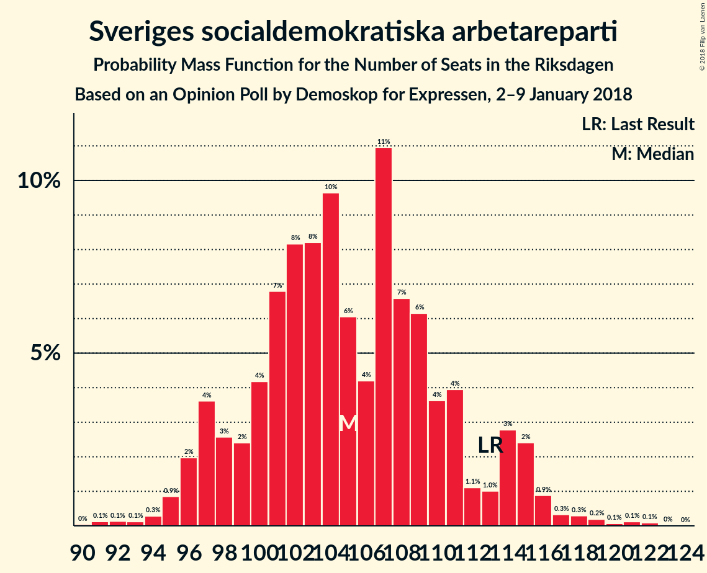

# Opinion Poll by Demoskop for Expressen, 2–9 January 2018

<a href="#voting-intentions">Voting Intentions</a> | <a href="#seats">Seats</a> | <a href="#coalitions">Coalitions</a> | <a href="#technical-information">Technical Information</a>

## Voting Intentions

### Confidence Intervals

| Party | Last Result | Poll Result | 80% Confidence Interval | 90% Confidence Interval | 95% Confidence Interval | 99% Confidence Interval |
|:-----:|:-----------:|:-----------:|:-----------------------:|:-----------------------:|:-----------------------:|:-----------------------:|
| Sveriges socialdemokratiska arbetareparti | 31.0% | 27.8% | 26.4–29.3% |26.0–29.7% |25.7–30.0% |25.0–30.7% |
| Moderata samlingspartiet | 23.3% | 22.6% | 21.3–24.0% |20.9–24.4% |20.6–24.7% |20.0–25.4% |
| Sverigedemokraterna | 12.9% | 17.9% | 16.8–19.2% |16.4–19.6% |16.1–19.9% |15.6–20.5% |
| Centerpartiet | 6.1% | 9.2% | 8.3–10.2% |8.1–10.5% |7.9–10.7% |7.5–11.2% |
| Vänsterpartiet | 5.7% | 7.2% | 6.4–8.1% |6.2–8.4% |6.0–8.6% |5.7–9.0% |
| Liberalerna | 5.4% | 4.5% | 3.9–5.3% |3.7–5.5% |3.6–5.7% |3.3–6.0% |
| Miljöpartiet de gröna | 6.9% | 4.4% | 3.8–5.1% |3.6–5.3% |3.5–5.5% |3.2–5.9% |
| Kristdemokraterna | 4.6% | 2.9% | 2.4–3.5% |2.3–3.7% |2.2–3.9% |2.0–4.2% |
| Feministiskt initiativ | 3.1% | 1.9% | 1.5–2.4% |1.4–2.6% |1.4–2.7% |1.2–3.0% |

*Note:* The poll result column reflects the actual value used in the calculations. Published results may vary slightly, and in addition be rounded to fewer digits.

## Seats

### Confidence Intervals

| Party | Last Result | Median | 80% Confidence Interval | 90% Confidence Interval | 95% Confidence Interval | 99% Confidence Interval |
|:-----:|:-----------:|:------:|:-----------------------:|:-----------------------:|:-----------------------:|:-----------------------:|
| <a href="#sveriges-socialdemokratiska-arbetareparti">Sveriges socialdemokratiska arbetareparti</a> | 113 | 115 | 114–115 |97–115 |97–115 |95–115 |
| <a href="#moderata-samlingspartiet">Moderata samlingspartiet</a> | 84 | 86 | 86 |73–88 |73–88 |73–96 |
| <a href="#sverigedemokraterna">Sverigedemokraterna</a> | 49 | 80 | 73–80 |67–80 |67–80 |60–80 |
| <a href="#centerpartiet">Centerpartiet</a> | 22 | 34 | 34 |31–34 |31–34 |30–38 |
| <a href="#vänsterpartiet">Vänsterpartiet</a> | 21 | 34 | 26–34 |25–34 |25–34 |25–34 |
| <a href="#liberalerna">Liberalerna</a> | 19 | 0 | 0–17 |0–19 |0–19 |0–19 |
| <a href="#miljöpartiet-de-gröna">Miljöpartiet de gröna</a> | 25 | 0 | 0–17 |0–17 |0–17 |0–17 |
| <a href="#kristdemokraterna">Kristdemokraterna</a> | 16 | 0 | 0 |0 |0 |0–18 |
| <a href="#feministiskt-initiativ">Feministiskt initiativ</a> | 0 | 0 | 0 |0 |0 |0 |

### Sveriges socialdemokratiska arbetareparti

*For a full overview of the results for this party, see the [Sveriges socialdemokratiska arbetareparti](party-sverigessocialdemokratiskaarbetareparti.html) page.*

| Number of Seats | Probability | Accumulated | Special Marks |
|:---------------:|:-----------:|:-----------:|:-------------:|
| 90 | 0.1% | 100% |  |
| 91 | 0% | 99.9% |  |
| 92 | 0% | 99.9% |  |
| 93 | 0% | 99.9% |  |
| 94 | 0% | 99.9% |  |
| 95 | 1.1% | 99.9% |  |
| 96 | 0% | 98.8% |  |
| 97 | 5% | 98.8% |  |
| 98 | 0.8% | 94% |  |
| 99 | 0% | 93% |  |
| 100 | 0.1% | 93% |  |
| 101 | 0.1% | 93% |  |
| 102 | 0% | 93% |  |
| 103 | 0.1% | 93% |  |
| 104 | 0% | 93% |  |
| 105 | 0.1% | 93% |  |
| 106 | 0% | 93% |  |
| 107 | 0% | 93% |  |
| 108 | 0% | 93% |  |
| 109 | 0% | 93% |  |
| 110 | 0% | 93% |  |
| 111 | 0% | 93% |  |
| 112 | 0% | 93% |  |
| 113 | 0% | 93% | Last Result |
| 114 | 6% | 93% |  |
| 115 | 86% | 87% | Median |
| 116 | 0% | 0.2% |  |
| 117 | 0% | 0.2% |  |
| 118 | 0% | 0.2% |  |
| 119 | 0% | 0.2% |  |
| 120 | 0% | 0.2% |  |
| 121 | 0% | 0.2% |  |
| 122 | 0% | 0.2% |  |
| 123 | 0% | 0.2% |  |
| 124 | 0% | 0.2% |  |
| 125 | 0% | 0.2% |  |
| 126 | 0.2% | 0.2% |  |
| 127 | 0% | 0% |  |

### Moderata samlingspartiet

*For a full overview of the results for this party, see the [Moderata samlingspartiet](party-moderatasamlingspartiet.html) page.*

| Number of Seats | Probability | Accumulated | Special Marks |
|:---------------:|:-----------:|:-----------:|:-------------:|
| 73 | 6% | 100% |  |
| 74 | 0% | 94% |  |
| 75 | 0% | 94% |  |
| 76 | 0% | 94% |  |
| 77 | 0% | 94% |  |
| 78 | 0.1% | 94% |  |
| 79 | 0.1% | 94% |  |
| 80 | 0% | 93% |  |
| 81 | 0.1% | 93% |  |
| 82 | 0% | 93% |  |
| 83 | 0% | 93% |  |
| 84 | 0.2% | 93% | Last Result |
| 85 | 0% | 93% |  |
| 86 | 86% | 93% | Median |
| 87 | 1.4% | 7% |  |
| 88 | 5% | 5% |  |
| 89 | 0% | 0.7% |  |
| 90 | 0% | 0.7% |  |
| 91 | 0% | 0.7% |  |
| 92 | 0% | 0.7% |  |
| 93 | 0.2% | 0.7% |  |
| 94 | 0% | 0.5% |  |
| 95 | 0% | 0.5% |  |
| 96 | 0.1% | 0.5% |  |
| 97 | 0% | 0.4% |  |
| 98 | 0.4% | 0.4% |  |
| 99 | 0% | 0% |  |

### Sverigedemokraterna

*For a full overview of the results for this party, see the [Sverigedemokraterna](party-sverigedemokraterna.html) page.*

| Number of Seats | Probability | Accumulated | Special Marks |
|:---------------:|:-----------:|:-----------:|:-------------:|
| 49 | 0% | 100% | Last Result |
| 50 | 0% | 100% |  |
| 51 | 0% | 100% |  |
| 52 | 0% | 100% |  |
| 53 | 0.1% | 100% |  |
| 54 | 0% | 99.9% |  |
| 55 | 0% | 99.9% |  |
| 56 | 0.2% | 99.9% |  |
| 57 | 0% | 99.8% |  |
| 58 | 0% | 99.8% |  |
| 59 | 0% | 99.8% |  |
| 60 | 0.8% | 99.8% |  |
| 61 | 0% | 99.0% |  |
| 62 | 0% | 99.0% |  |
| 63 | 0% | 99.0% |  |
| 64 | 0% | 99.0% |  |
| 65 | 0.4% | 98.9% |  |
| 66 | 0% | 98.5% |  |
| 67 | 6% | 98% |  |
| 68 | 0.1% | 92% |  |
| 69 | 0% | 92% |  |
| 70 | 0% | 92% |  |
| 71 | 0% | 92% |  |
| 72 | 0% | 92% |  |
| 73 | 5% | 92% |  |
| 74 | 0% | 87% |  |
| 75 | 0.3% | 87% |  |
| 76 | 0% | 87% |  |
| 77 | 0% | 87% |  |
| 78 | 0% | 87% |  |
| 79 | 0.7% | 87% |  |
| 80 | 86% | 86% | Median |
| 81 | 0% | 0% |  |

### Centerpartiet

*For a full overview of the results for this party, see the [Centerpartiet](party-centerpartiet.html) page.*

| Number of Seats | Probability | Accumulated | Special Marks |
|:---------------:|:-----------:|:-----------:|:-------------:|
| 22 | 0% | 100% | Last Result |
| 23 | 0% | 100% |  |
| 24 | 0% | 100% |  |
| 25 | 0% | 100% |  |
| 26 | 0% | 100% |  |
| 27 | 0% | 100% |  |
| 28 | 0% | 100% |  |
| 29 | 0% | 100% |  |
| 30 | 0.6% | 100% |  |
| 31 | 5% | 99.4% |  |
| 32 | 0.1% | 95% |  |
| 33 | 0% | 95% |  |
| 34 | 93% | 94% | Median |
| 35 | 0% | 2% |  |
| 36 | 0% | 2% |  |
| 37 | 0.7% | 2% |  |
| 38 | 0.9% | 1.1% |  |
| 39 | 0% | 0.2% |  |
| 40 | 0% | 0.2% |  |
| 41 | 0.1% | 0.2% |  |
| 42 | 0.1% | 0.1% |  |
| 43 | 0% | 0% |  |

### Vänsterpartiet

*For a full overview of the results for this party, see the [Vänsterpartiet](party-vänsterpartiet.html) page.*

| Number of Seats | Probability | Accumulated | Special Marks |
|:---------------:|:-----------:|:-----------:|:-------------:|
| 19 | 0.1% | 100% |  |
| 20 | 0% | 99.9% |  |
| 21 | 0% | 99.9% | Last Result |
| 22 | 0.1% | 99.9% |  |
| 23 | 0% | 99.9% |  |
| 24 | 0.2% | 99.9% |  |
| 25 | 6% | 99.7% |  |
| 26 | 5% | 93% |  |
| 27 | 0.2% | 89% |  |
| 28 | 0.1% | 88% |  |
| 29 | 0.4% | 88% |  |
| 30 | 0.8% | 88% |  |
| 31 | 0% | 87% |  |
| 32 | 0% | 87% |  |
| 33 | 0% | 87% |  |
| 34 | 87% | 87% | Median |
| 35 | 0.1% | 0.1% |  |
| 36 | 0% | 0% |  |

### Liberalerna

*For a full overview of the results for this party, see the [Liberalerna](party-liberalerna.html) page.*

| Number of Seats | Probability | Accumulated | Special Marks |
|:---------------:|:-----------:|:-----------:|:-------------:|
| 0 | 87% | 100% | Median |
| 1 | 0% | 13% |  |
| 2 | 0% | 13% |  |
| 3 | 0% | 13% |  |
| 4 | 0% | 13% |  |
| 5 | 0% | 13% |  |
| 6 | 0% | 13% |  |
| 7 | 0% | 13% |  |
| 8 | 0% | 13% |  |
| 9 | 0% | 13% |  |
| 10 | 0% | 13% |  |
| 11 | 0% | 13% |  |
| 12 | 0% | 13% |  |
| 13 | 0% | 13% |  |
| 14 | 0% | 13% |  |
| 15 | 0% | 13% |  |
| 16 | 0.3% | 13% |  |
| 17 | 5% | 13% |  |
| 18 | 0.9% | 8% |  |
| 19 | 6% | 7% | Last Result |
| 20 | 0.1% | 0.4% |  |
| 21 | 0.1% | 0.3% |  |
| 22 | 0.1% | 0.1% |  |
| 23 | 0% | 0.1% |  |
| 24 | 0% | 0.1% |  |
| 25 | 0% | 0.1% |  |
| 26 | 0.1% | 0.1% |  |
| 27 | 0% | 0% |  |

### Miljöpartiet de gröna

*For a full overview of the results for this party, see the [Miljöpartiet de gröna](party-miljöpartietdegröna.html) page.*

| Number of Seats | Probability | Accumulated | Special Marks |
|:---------------:|:-----------:|:-----------:|:-------------:|
| 0 | 88% | 100% | Median |
| 1 | 0% | 12% |  |
| 2 | 0% | 12% |  |
| 3 | 0% | 12% |  |
| 4 | 0% | 12% |  |
| 5 | 0% | 12% |  |
| 6 | 0% | 12% |  |
| 7 | 0% | 12% |  |
| 8 | 0% | 12% |  |
| 9 | 0% | 12% |  |
| 10 | 0% | 12% |  |
| 11 | 0% | 12% |  |
| 12 | 0% | 12% |  |
| 13 | 0% | 12% |  |
| 14 | 0% | 12% |  |
| 15 | 0.2% | 12% |  |
| 16 | 0.3% | 12% |  |
| 17 | 11% | 11% |  |
| 18 | 0% | 0.3% |  |
| 19 | 0% | 0.3% |  |
| 20 | 0.1% | 0.3% |  |
| 21 | 0% | 0.3% |  |
| 22 | 0.1% | 0.3% |  |
| 23 | 0.1% | 0.1% |  |
| 24 | 0% | 0% |  |
| 25 | 0% | 0% | Last Result |

### Kristdemokraterna

*For a full overview of the results for this party, see the [Kristdemokraterna](party-kristdemokraterna.html) page.*

| Number of Seats | Probability | Accumulated | Special Marks |
|:---------------:|:-----------:|:-----------:|:-------------:|
| 0 | 99.2% | 100% | Median |
| 1 | 0% | 0.8% |  |
| 2 | 0% | 0.8% |  |
| 3 | 0% | 0.8% |  |
| 4 | 0% | 0.8% |  |
| 5 | 0% | 0.8% |  |
| 6 | 0% | 0.8% |  |
| 7 | 0% | 0.8% |  |
| 8 | 0% | 0.8% |  |
| 9 | 0% | 0.8% |  |
| 10 | 0% | 0.8% |  |
| 11 | 0% | 0.8% |  |
| 12 | 0% | 0.8% |  |
| 13 | 0% | 0.8% |  |
| 14 | 0% | 0.8% |  |
| 15 | 0.1% | 0.8% |  |
| 16 | 0% | 0.7% | Last Result |
| 17 | 0% | 0.7% |  |
| 18 | 0.7% | 0.7% |  |
| 19 | 0% | 0% |  |

### Feministiskt initiativ

*For a full overview of the results for this party, see the [Feministiskt initiativ](party-feministisktinitiativ.html) page.*

| Number of Seats | Probability | Accumulated | Special Marks |
|:---------------:|:-----------:|:-----------:|:-------------:|
| 0 | 100% | 100% | Last Result, Median |

## Coalitions

### Confidence Intervals

| Coalition | Last Result | Median | Majority? | 80% Confidence Interval | 90% Confidence Interval | 95% Confidence Interval | 99% Confidence Interval |
|:---------:|:-----------:|:------:|:---------:|:-----------------------:|:-----------------------:|:-----------------------:|:-----------------------:|
| Sveriges socialdemokratiska arbetareparti – Moderata samlingspartiet | 197 | 201 | 99.9% | 187–201 | 185–201 | 185–201 | 182–201 |
| Moderata samlingspartiet – Sverigedemokraterna | 133 | 166 | 0% | 161–166 | 140–166 | 140–166 | 140–166 |
| Sveriges socialdemokratiska arbetareparti – Vänsterpartiet – Miljöpartiet de gröna – Feministiskt initiativ | 159 | 149 | 0% | 149 | 140–156 | 140–156 | 128–156 |
| Sveriges socialdemokratiska arbetareparti – Vänsterpartiet – Miljöpartiet de gröna | 159 | 149 | 0% | 149 | 140–156 | 140–156 | 128–156 |
| Sveriges socialdemokratiska arbetareparti – Vänsterpartiet | 134 | 149 | 0% | 139–149 | 124–149 | 123–149 | 123–149 |
| Moderata samlingspartiet – Centerpartiet – Liberalerna – Kristdemokraterna | 141 | 120 | 0% | 120–126 | 120–136 | 120–136 | 120–161 |
| Moderata samlingspartiet – Centerpartiet – Liberalerna | 125 | 120 | 0% | 120–126 | 120–136 | 120–136 | 120–143 |
| Sveriges socialdemokratiska arbetareparti – Miljöpartiet de gröna | 138 | 115 | 0% | 115 | 114–131 | 114–131 | 95–131 |
| Moderata samlingspartiet – Centerpartiet – Kristdemokraterna | 122 | 120 | 0% | 119–120 | 107–120 | 107–120 | 107–143 |
| Moderata samlingspartiet – Centerpartiet | 106 | 120 | 0% | 119–120 | 107–120 | 107–120 | 107–126 |

### Sveriges socialdemokratiska arbetareparti – Moderata samlingspartiet

| Number of Seats | Probability | Accumulated | Special Marks |
|:---------------:|:-----------:|:-----------:|:-------------:|
| 174 | 0.1% | 100% |  |
| 175 | 0% | 99.9% | Majority |
| 176 | 0% | 99.9% |  |
| 177 | 0% | 99.9% |  |
| 178 | 0% | 99.9% |  |
| 179 | 0.1% | 99.9% |  |
| 180 | 0% | 99.8% |  |
| 181 | 0.1% | 99.8% |  |
| 182 | 0.7% | 99.7% |  |
| 183 | 0% | 99.0% |  |
| 184 | 0% | 99.0% |  |
| 185 | 5% | 99.0% |  |
| 186 | 0.1% | 94% |  |
| 187 | 6% | 94% |  |
| 188 | 0% | 87% |  |
| 189 | 0.1% | 87% |  |
| 190 | 0% | 87% |  |
| 191 | 0% | 87% |  |
| 192 | 0% | 87% |  |
| 193 | 0.3% | 87% |  |
| 194 | 0% | 87% |  |
| 195 | 0% | 87% |  |
| 196 | 0% | 87% |  |
| 197 | 0% | 87% | Last Result |
| 198 | 0% | 87% |  |
| 199 | 0% | 87% |  |
| 200 | 0% | 87% |  |
| 201 | 86% | 87% | Median |
| 202 | 0% | 0.2% |  |
| 203 | 0% | 0.2% |  |
| 204 | 0% | 0.2% |  |
| 205 | 0% | 0.2% |  |
| 206 | 0% | 0.2% |  |
| 207 | 0% | 0.2% |  |
| 208 | 0% | 0.2% |  |
| 209 | 0% | 0.2% |  |
| 210 | 0% | 0.2% |  |
| 211 | 0% | 0.2% |  |
| 212 | 0% | 0.2% |  |
| 213 | 0% | 0.2% |  |
| 214 | 0% | 0.2% |  |
| 215 | 0% | 0.2% |  |
| 216 | 0% | 0.2% |  |
| 217 | 0% | 0.2% |  |
| 218 | 0% | 0.2% |  |
| 219 | 0.2% | 0.2% |  |
| 220 | 0% | 0% |  |

### Moderata samlingspartiet – Sverigedemokraterna

| Number of Seats | Probability | Accumulated | Special Marks |
|:---------------:|:-----------:|:-----------:|:-------------:|
| 133 | 0% | 100% | Last Result |
| 134 | 0% | 100% |  |
| 135 | 0% | 100% |  |
| 136 | 0% | 99.9% |  |
| 137 | 0.2% | 99.9% |  |
| 138 | 0% | 99.8% |  |
| 139 | 0% | 99.8% |  |
| 140 | 6% | 99.8% |  |
| 141 | 0% | 93% |  |
| 142 | 0% | 93% |  |
| 143 | 0% | 93% |  |
| 144 | 0% | 93% |  |
| 145 | 0% | 93% |  |
| 146 | 0.1% | 93% |  |
| 147 | 0.7% | 93% |  |
| 148 | 0.1% | 93% |  |
| 149 | 0% | 92% |  |
| 150 | 0% | 92% |  |
| 151 | 0% | 92% |  |
| 152 | 0% | 92% |  |
| 153 | 0% | 92% |  |
| 154 | 0% | 92% |  |
| 155 | 0% | 92% |  |
| 156 | 0% | 92% |  |
| 157 | 0% | 92% |  |
| 158 | 0% | 92% |  |
| 159 | 0.1% | 92% |  |
| 160 | 0% | 92% |  |
| 161 | 5% | 92% |  |
| 162 | 0% | 88% |  |
| 163 | 0.3% | 88% |  |
| 164 | 0% | 87% |  |
| 165 | 0.1% | 87% |  |
| 166 | 87% | 87% | Median |
| 167 | 0% | 0.2% |  |
| 168 | 0.2% | 0.2% |  |
| 169 | 0% | 0% |  |

### Sveriges socialdemokratiska arbetareparti – Vänsterpartiet – Miljöpartiet de gröna – Feministiskt initiativ

| Number of Seats | Probability | Accumulated | Special Marks |
|:---------------:|:-----------:|:-----------:|:-------------:|
| 125 | 0.1% | 100% |  |
| 126 | 0% | 99.9% |  |
| 127 | 0% | 99.9% |  |
| 128 | 0.7% | 99.9% |  |
| 129 | 0.7% | 99.2% |  |
| 130 | 0% | 98% |  |
| 131 | 0% | 98% |  |
| 132 | 0.1% | 98% |  |
| 133 | 0% | 98% |  |
| 134 | 0% | 98% |  |
| 135 | 0% | 98% |  |
| 136 | 0% | 98% |  |
| 137 | 0% | 98% |  |
| 138 | 0% | 98% |  |
| 139 | 0% | 98% |  |
| 140 | 5% | 98% |  |
| 141 | 0% | 93% |  |
| 142 | 0.1% | 93% |  |
| 143 | 0.1% | 93% |  |
| 144 | 0% | 93% |  |
| 145 | 0% | 93% |  |
| 146 | 0% | 93% |  |
| 147 | 0% | 93% |  |
| 148 | 0.1% | 93% |  |
| 149 | 86% | 93% | Median |
| 150 | 0.4% | 7% |  |
| 151 | 0% | 7% |  |
| 152 | 0% | 6% |  |
| 153 | 0.1% | 6% |  |
| 154 | 0% | 6% |  |
| 155 | 0% | 6% |  |
| 156 | 6% | 6% |  |
| 157 | 0% | 0% |  |
| 158 | 0% | 0% |  |
| 159 | 0% | 0% | Last Result |

### Sveriges socialdemokratiska arbetareparti – Vänsterpartiet – Miljöpartiet de gröna

| Number of Seats | Probability | Accumulated | Special Marks |
|:---------------:|:-----------:|:-----------:|:-------------:|
| 125 | 0.1% | 100% |  |
| 126 | 0% | 99.9% |  |
| 127 | 0% | 99.9% |  |
| 128 | 0.7% | 99.9% |  |
| 129 | 0.7% | 99.2% |  |
| 130 | 0% | 98% |  |
| 131 | 0% | 98% |  |
| 132 | 0.1% | 98% |  |
| 133 | 0% | 98% |  |
| 134 | 0% | 98% |  |
| 135 | 0% | 98% |  |
| 136 | 0% | 98% |  |
| 137 | 0% | 98% |  |
| 138 | 0% | 98% |  |
| 139 | 0% | 98% |  |
| 140 | 5% | 98% |  |
| 141 | 0% | 93% |  |
| 142 | 0.1% | 93% |  |
| 143 | 0.1% | 93% |  |
| 144 | 0% | 93% |  |
| 145 | 0% | 93% |  |
| 146 | 0% | 93% |  |
| 147 | 0% | 93% |  |
| 148 | 0.1% | 93% |  |
| 149 | 86% | 93% | Median |
| 150 | 0.4% | 7% |  |
| 151 | 0% | 7% |  |
| 152 | 0% | 6% |  |
| 153 | 0.1% | 6% |  |
| 154 | 0% | 6% |  |
| 155 | 0% | 6% |  |
| 156 | 6% | 6% |  |
| 157 | 0% | 0% |  |
| 158 | 0% | 0% |  |
| 159 | 0% | 0% | Last Result |

### Sveriges socialdemokratiska arbetareparti – Vänsterpartiet

| Number of Seats | Probability | Accumulated | Special Marks |
|:---------------:|:-----------:|:-----------:|:-------------:|
| 120 | 0.2% | 100% |  |
| 121 | 0% | 99.8% |  |
| 122 | 0% | 99.8% |  |
| 123 | 5% | 99.8% |  |
| 124 | 0.4% | 95% |  |
| 125 | 0.1% | 95% |  |
| 126 | 0% | 95% |  |
| 127 | 0% | 95% |  |
| 128 | 0.7% | 95% |  |
| 129 | 0.7% | 94% |  |
| 130 | 0% | 93% |  |
| 131 | 0% | 93% |  |
| 132 | 0.1% | 93% |  |
| 133 | 0.1% | 93% |  |
| 134 | 0% | 93% | Last Result |
| 135 | 0.2% | 93% |  |
| 136 | 0% | 93% |  |
| 137 | 0% | 93% |  |
| 138 | 0% | 93% |  |
| 139 | 6% | 93% |  |
| 140 | 0% | 87% |  |
| 141 | 0% | 87% |  |
| 142 | 0% | 87% |  |
| 143 | 0% | 87% |  |
| 144 | 0% | 87% |  |
| 145 | 0% | 87% |  |
| 146 | 0% | 87% |  |
| 147 | 0% | 87% |  |
| 148 | 0% | 87% |  |
| 149 | 86% | 87% | Median |
| 150 | 0.2% | 0.2% |  |
| 151 | 0% | 0% |  |

### Moderata samlingspartiet – Centerpartiet – Liberalerna – Kristdemokraterna

| Number of Seats | Probability | Accumulated | Special Marks |
|:---------------:|:-----------:|:-----------:|:-------------:|
| 120 | 86% | 100% | Median |
| 121 | 0% | 14% |  |
| 122 | 0% | 14% |  |
| 123 | 0% | 14% |  |
| 124 | 0.2% | 14% |  |
| 125 | 0% | 13% |  |
| 126 | 6% | 13% |  |
| 127 | 0% | 7% |  |
| 128 | 0% | 7% |  |
| 129 | 0% | 7% |  |
| 130 | 0% | 7% |  |
| 131 | 0% | 7% |  |
| 132 | 0.1% | 7% |  |
| 133 | 0% | 7% |  |
| 134 | 0% | 7% |  |
| 135 | 0% | 7% |  |
| 136 | 5% | 7% |  |
| 137 | 0% | 2% |  |
| 138 | 0.1% | 2% |  |
| 139 | 0% | 2% |  |
| 140 | 0% | 2% |  |
| 141 | 0.8% | 2% | Last Result |
| 142 | 0% | 1.4% |  |
| 143 | 0.2% | 1.4% |  |
| 144 | 0.3% | 1.2% |  |
| 145 | 0% | 0.9% |  |
| 146 | 0% | 0.9% |  |
| 147 | 0% | 0.9% |  |
| 148 | 0% | 0.9% |  |
| 149 | 0% | 0.9% |  |
| 150 | 0% | 0.9% |  |
| 151 | 0% | 0.9% |  |
| 152 | 0.1% | 0.9% |  |
| 153 | 0% | 0.8% |  |
| 154 | 0% | 0.8% |  |
| 155 | 0% | 0.8% |  |
| 156 | 0% | 0.8% |  |
| 157 | 0.1% | 0.8% |  |
| 158 | 0% | 0.7% |  |
| 159 | 0% | 0.7% |  |
| 160 | 0% | 0.7% |  |
| 161 | 0.7% | 0.7% |  |
| 162 | 0% | 0% |  |

### Moderata samlingspartiet – Centerpartiet – Liberalerna

| Number of Seats | Probability | Accumulated | Special Marks |
|:---------------:|:-----------:|:-----------:|:-------------:|
| 120 | 86% | 100% | Median |
| 121 | 0% | 14% |  |
| 122 | 0% | 14% |  |
| 123 | 0% | 14% |  |
| 124 | 0.2% | 14% |  |
| 125 | 0% | 13% | Last Result |
| 126 | 6% | 13% |  |
| 127 | 0% | 7% |  |
| 128 | 0% | 7% |  |
| 129 | 0% | 7% |  |
| 130 | 0% | 7% |  |
| 131 | 0% | 7% |  |
| 132 | 0.1% | 7% |  |
| 133 | 0% | 7% |  |
| 134 | 0% | 7% |  |
| 135 | 0% | 7% |  |
| 136 | 5% | 7% |  |
| 137 | 0% | 2% |  |
| 138 | 0.1% | 2% |  |
| 139 | 0% | 2% |  |
| 140 | 0% | 2% |  |
| 141 | 0.8% | 2% |  |
| 142 | 0% | 1.4% |  |
| 143 | 0.9% | 1.4% |  |
| 144 | 0.3% | 0.5% |  |
| 145 | 0% | 0.1% |  |
| 146 | 0% | 0.1% |  |
| 147 | 0% | 0.1% |  |
| 148 | 0% | 0.1% |  |
| 149 | 0% | 0.1% |  |
| 150 | 0% | 0.1% |  |
| 151 | 0% | 0.1% |  |
| 152 | 0.1% | 0.1% |  |
| 153 | 0% | 0.1% |  |
| 154 | 0% | 0.1% |  |
| 155 | 0% | 0.1% |  |
| 156 | 0% | 0.1% |  |
| 157 | 0.1% | 0.1% |  |
| 158 | 0% | 0% |  |

### Sveriges socialdemokratiska arbetareparti – Miljöpartiet de gröna

| Number of Seats | Probability | Accumulated | Special Marks |
|:---------------:|:-----------:|:-----------:|:-------------:|
| 95 | 0.7% | 100% |  |
| 96 | 0% | 99.3% |  |
| 97 | 0% | 99.3% |  |
| 98 | 0.7% | 99.3% |  |
| 99 | 0% | 98.6% |  |
| 100 | 0% | 98.6% |  |
| 101 | 0% | 98.6% |  |
| 102 | 0% | 98.6% |  |
| 103 | 0.1% | 98.6% |  |
| 104 | 0% | 98% |  |
| 105 | 0.1% | 98% |  |
| 106 | 0% | 98% |  |
| 107 | 0% | 98% |  |
| 108 | 0% | 98% |  |
| 109 | 0% | 98% |  |
| 110 | 0% | 98% |  |
| 111 | 0.3% | 98% |  |
| 112 | 0.1% | 98% |  |
| 113 | 0% | 98% |  |
| 114 | 5% | 98% |  |
| 115 | 86% | 93% | Median |
| 116 | 0% | 7% |  |
| 117 | 0% | 7% |  |
| 118 | 0% | 7% |  |
| 119 | 0% | 7% |  |
| 120 | 0% | 7% |  |
| 121 | 0.1% | 7% |  |
| 122 | 0% | 7% |  |
| 123 | 0% | 7% |  |
| 124 | 0.1% | 7% |  |
| 125 | 0.1% | 7% |  |
| 126 | 0.2% | 7% |  |
| 127 | 0% | 6% |  |
| 128 | 0% | 6% |  |
| 129 | 0% | 6% |  |
| 130 | 0% | 6% |  |
| 131 | 6% | 6% |  |
| 132 | 0% | 0% |  |
| 133 | 0% | 0% |  |
| 134 | 0% | 0% |  |
| 135 | 0% | 0% |  |
| 136 | 0% | 0% |  |
| 137 | 0% | 0% |  |
| 138 | 0% | 0% | Last Result |

### Moderata samlingspartiet – Centerpartiet – Kristdemokraterna

| Number of Seats | Probability | Accumulated | Special Marks |
|:---------------:|:-----------:|:-----------:|:-------------:|
| 107 | 6% | 100% |  |
| 108 | 0% | 94% |  |
| 109 | 0% | 94% |  |
| 110 | 0% | 94% |  |
| 111 | 0% | 94% |  |
| 112 | 0% | 94% |  |
| 113 | 0% | 94% |  |
| 114 | 0.1% | 94% |  |
| 115 | 0% | 93% |  |
| 116 | 0.1% | 93% |  |
| 117 | 0% | 93% |  |
| 118 | 0% | 93% |  |
| 119 | 5% | 93% |  |
| 120 | 86% | 89% | Median |
| 121 | 0% | 2% |  |
| 122 | 0.1% | 2% | Last Result |
| 123 | 0.1% | 2% |  |
| 124 | 0.9% | 2% |  |
| 125 | 0% | 1.3% |  |
| 126 | 0.1% | 1.3% |  |
| 127 | 0% | 1.2% |  |
| 128 | 0.3% | 1.2% |  |
| 129 | 0% | 0.9% |  |
| 130 | 0% | 0.9% |  |
| 131 | 0% | 0.8% |  |
| 132 | 0% | 0.8% |  |
| 133 | 0% | 0.8% |  |
| 134 | 0% | 0.8% |  |
| 135 | 0% | 0.8% |  |
| 136 | 0% | 0.8% |  |
| 137 | 0% | 0.8% |  |
| 138 | 0% | 0.8% |  |
| 139 | 0.1% | 0.8% |  |
| 140 | 0% | 0.7% |  |
| 141 | 0% | 0.7% |  |
| 142 | 0% | 0.7% |  |
| 143 | 0.7% | 0.7% |  |
| 144 | 0% | 0% |  |

### Moderata samlingspartiet – Centerpartiet

| Number of Seats | Probability | Accumulated | Special Marks |
|:---------------:|:-----------:|:-----------:|:-------------:|
| 106 | 0% | 100% | Last Result |
| 107 | 6% | 100% |  |
| 108 | 0% | 94% |  |
| 109 | 0% | 94% |  |
| 110 | 0% | 94% |  |
| 111 | 0% | 94% |  |
| 112 | 0% | 94% |  |
| 113 | 0% | 94% |  |
| 114 | 0.1% | 94% |  |
| 115 | 0% | 93% |  |
| 116 | 0.1% | 93% |  |
| 117 | 0% | 93% |  |
| 118 | 0% | 93% |  |
| 119 | 5% | 93% |  |
| 120 | 86% | 89% | Median |
| 121 | 0% | 2% |  |
| 122 | 0.1% | 2% |  |
| 123 | 0.1% | 2% |  |
| 124 | 0.9% | 2% |  |
| 125 | 0.7% | 1.3% |  |
| 126 | 0.1% | 0.5% |  |
| 127 | 0% | 0.5% |  |
| 128 | 0.3% | 0.5% |  |
| 129 | 0% | 0.1% |  |
| 130 | 0% | 0.1% |  |
| 131 | 0% | 0.1% |  |
| 132 | 0% | 0.1% |  |
| 133 | 0% | 0.1% |  |
| 134 | 0% | 0.1% |  |
| 135 | 0% | 0.1% |  |
| 136 | 0% | 0.1% |  |
| 137 | 0% | 0.1% |  |
| 138 | 0% | 0.1% |  |
| 139 | 0.1% | 0.1% |  |
| 140 | 0% | 0% |  |

## Technical Information

### Opinion Poll

+ **Polling firm:** Demoskop
+ **Commissioner(s):** Expressen
+ **Fieldwork period:** 2–9 January 2018

### Calculations

+ **Sample size:** 1612
+ **Simulations done:** 1,024
+ **Error estimate:** 2.00%

