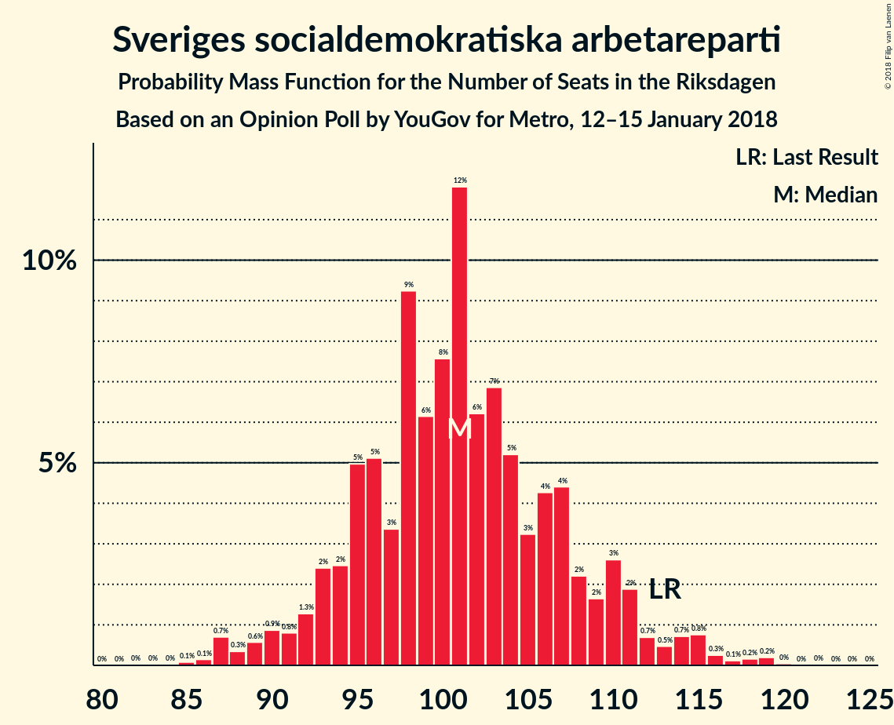
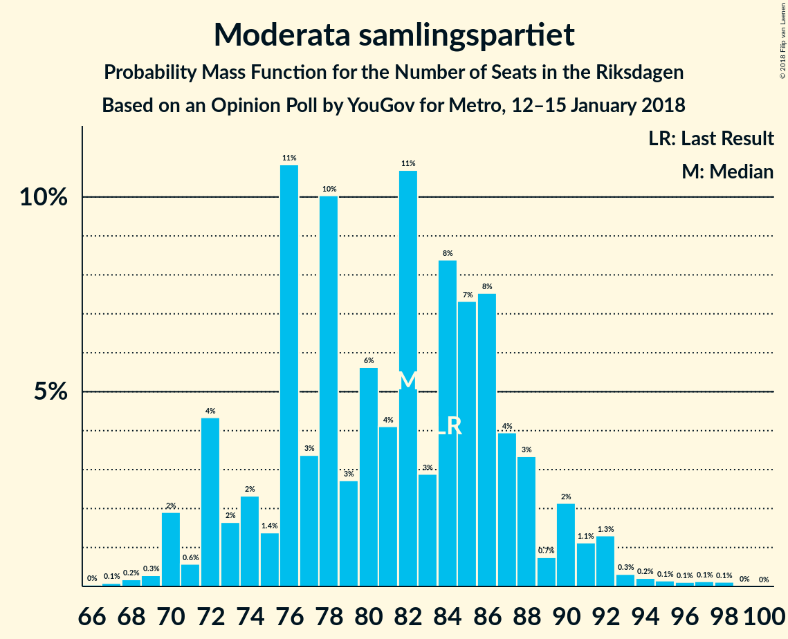
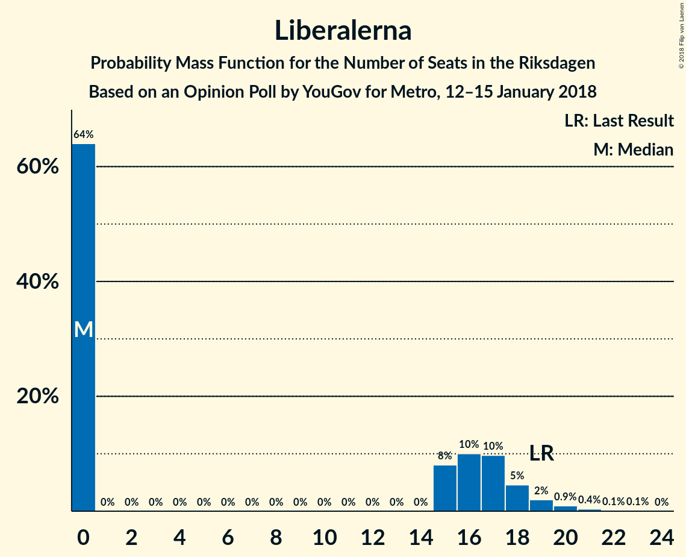

# Opinion Poll by YouGov for Metro, 12–15 January 2018

<a href="#voting-intentions">Voting Intentions</a> | <a href="#seats">Seats</a> | <a href="#coalitions">Coalitions</a> | <a href="#technical-information">Technical Information</a>

## Voting Intentions

### Confidence Intervals

| Party | Last Result | Poll Result | 80% Confidence Interval | 90% Confidence Interval | 95% Confidence Interval | 99% Confidence Interval |
|:-----:|:-----------:|:-----------:|:-----------------------:|:-----------------------:|:-----------------------:|:-----------------------:|
| Sveriges socialdemokratiska arbetareparti | 31.0% | 26.2% | 24.6–27.9% |24.2–28.4% |23.8–28.8% |23.0–29.6% |
| Moderata samlingspartiet | 23.3% | 20.9% | 19.5–22.5% |19.1–23.0% |18.7–23.4% |18.0–24.1% |
| Sverigedemokraterna | 12.9% | 20.5% | 19.1–22.1% |18.6–22.5% |18.3–22.9% |17.6–23.7% |
| Centerpartiet | 6.1% | 9.1% | 8.1–10.3% |7.8–10.6% |7.6–10.9% |7.1–11.5% |
| Vänsterpartiet | 5.7% | 7.8% | 6.9–8.9% |6.6–9.2% |6.4–9.5% |6.0–10.1% |
| Miljöpartiet de gröna | 6.9% | 4.5% | 3.8–5.4% |3.6–5.6% |3.5–5.9% |3.2–6.3% |
| Liberalerna | 5.4% | 3.8% | 3.2–4.6% |3.0–4.9% |2.9–5.1% |2.6–5.5% |
| Kristdemokraterna | 4.6% | 2.5% | 2.0–3.2% |1.8–3.4% |1.7–3.5% |1.5–3.9% |
| Feministiskt initiativ | 3.1% | 2.1% | 1.7–2.8% |1.5–3.0% |1.4–3.1% |1.2–3.5% |

*Note:* The poll result column reflects the actual value used in the calculations. Published results may vary slightly, and in addition be rounded to fewer digits.

## Seats

### Confidence Intervals

| Party | Last Result | Median | 80% Confidence Interval | 90% Confidence Interval | 95% Confidence Interval | 99% Confidence Interval |
|:-----:|:-----------:|:------:|:-----------------------:|:-----------------------:|:-----------------------:|:-----------------------:|
| <a href="#sveriges-socialdemokratiska-arbetareparti">Sveriges socialdemokratiska arbetareparti</a> | 113 | 101 | 95–108 |93–111 |90–113 |87–117 |
| <a href="#moderata-samlingspartiet">Moderata samlingspartiet</a> | 84 | 82 | 74–87 |72–90 |70–91 |69–95 |
| <a href="#sverigedemokraterna">Sverigedemokraterna</a> | 49 | 80 | 74–86 |72–88 |70–90 |67–93 |
| <a href="#centerpartiet">Centerpartiet</a> | 22 | 35 | 31–40 |30–41 |29–42 |28–44 |
| <a href="#vänsterpartiet">Vänsterpartiet</a> | 21 | 30 | 26–35 |25–36 |24–37 |23–39 |
| <a href="#miljöpartiet-de-gröna">Miljöpartiet de gröna</a> | 25 | 18 | 0–20 |0–21 |0–22 |0–24 |
| <a href="#liberalerna">Liberalerna</a> | 19 | 0 | 0–17 |0–18 |0–19 |0–21 |
| <a href="#kristdemokraterna">Kristdemokraterna</a> | 16 | 0 | 0 |0 |0 |0 |
| <a href="#feministiskt-initiativ">Feministiskt initiativ</a> | 0 | 0 | 0 |0 |0 |0 |

### Sveriges socialdemokratiska arbetareparti

*For a full overview of the results for this party, see the [Sveriges socialdemokratiska arbetareparti](party-sverigessocialdemokratiskaarbetareparti.html) page.*

| Number of Seats | Probability | Accumulated | Special Marks |
|:---------------:|:-----------:|:-----------:|:-------------:|
| 84 | 0% | 100% |  |
| 85 | 0.1% | 99.9% |  |
| 86 | 0.1% | 99.9% |  |
| 87 | 0.7% | 99.7% |  |
| 88 | 0.3% | 99.0% |  |
| 89 | 0.6% | 98.7% |  |
| 90 | 0.9% | 98% |  |
| 91 | 0.8% | 97% |  |
| 92 | 1.3% | 96% |  |
| 93 | 2% | 95% |  |
| 94 | 2% | 93% |  |
| 95 | 5% | 90% |  |
| 96 | 5% | 85% |  |
| 97 | 3% | 80% |  |
| 98 | 9% | 77% |  |
| 99 | 6% | 68% |  |
| 100 | 8% | 61% |  |
| 101 | 12% | 54% | Median |
| 102 | 6% | 42% |  |
| 103 | 7% | 36% |  |
| 104 | 5% | 29% |  |
| 105 | 3% | 24% |  |
| 106 | 4% | 21% |  |
| 107 | 4% | 16% |  |
| 108 | 2% | 12% |  |
| 109 | 2% | 10% |  |
| 110 | 3% | 8% |  |
| 111 | 2% | 5% |  |
| 112 | 0.7% | 3% |  |
| 113 | 0.5% | 3% | Last Result |
| 114 | 0.7% | 2% |  |
| 115 | 0.8% | 2% |  |
| 116 | 0.3% | 0.8% |  |
| 117 | 0.1% | 0.6% |  |
| 118 | 0.2% | 0.5% |  |
| 119 | 0.2% | 0.3% |  |
| 120 | 0% | 0.1% |  |
| 121 | 0% | 0.1% |  |
| 122 | 0% | 0% |  |

### Moderata samlingspartiet

*For a full overview of the results for this party, see the [Moderata samlingspartiet](party-moderatasamlingspartiet.html) page.*

| Number of Seats | Probability | Accumulated | Special Marks |
|:---------------:|:-----------:|:-----------:|:-------------:|
| 66 | 0% | 100% |  |
| 67 | 0.1% | 99.9% |  |
| 68 | 0.2% | 99.8% |  |
| 69 | 0.3% | 99.7% |  |
| 70 | 2% | 99.4% |  |
| 71 | 0.6% | 97% |  |
| 72 | 4% | 97% |  |
| 73 | 2% | 93% |  |
| 74 | 2% | 91% |  |
| 75 | 1.4% | 89% |  |
| 76 | 11% | 87% |  |
| 77 | 3% | 76% |  |
| 78 | 10% | 73% |  |
| 79 | 3% | 63% |  |
| 80 | 6% | 60% |  |
| 81 | 4% | 55% |  |
| 82 | 11% | 50% | Median |
| 83 | 3% | 40% |  |
| 84 | 8% | 37% | Last Result |
| 85 | 7% | 29% |  |
| 86 | 8% | 21% |  |
| 87 | 4% | 14% |  |
| 88 | 3% | 10% |  |
| 89 | 0.7% | 6% |  |
| 90 | 2% | 6% |  |
| 91 | 1.1% | 4% |  |
| 92 | 1.3% | 2% |  |
| 93 | 0.3% | 1.1% |  |
| 94 | 0.2% | 0.8% |  |
| 95 | 0.1% | 0.5% |  |
| 96 | 0.1% | 0.4% |  |
| 97 | 0.1% | 0.3% |  |
| 98 | 0.1% | 0.2% |  |
| 99 | 0% | 0% |  |

### Sverigedemokraterna

*For a full overview of the results for this party, see the [Sverigedemokraterna](party-sverigedemokraterna.html) page.*

| Number of Seats | Probability | Accumulated | Special Marks |
|:---------------:|:-----------:|:-----------:|:-------------:|
| 49 | 0% | 100% | Last Result |
| 50 | 0% | 100% |  |
| 51 | 0% | 100% |  |
| 52 | 0% | 100% |  |
| 53 | 0% | 100% |  |
| 54 | 0% | 100% |  |
| 55 | 0% | 100% |  |
| 56 | 0% | 100% |  |
| 57 | 0% | 100% |  |
| 58 | 0% | 100% |  |
| 59 | 0% | 100% |  |
| 60 | 0% | 100% |  |
| 61 | 0% | 100% |  |
| 62 | 0% | 100% |  |
| 63 | 0% | 100% |  |
| 64 | 0% | 100% |  |
| 65 | 0.2% | 99.9% |  |
| 66 | 0.1% | 99.7% |  |
| 67 | 0.4% | 99.6% |  |
| 68 | 0.4% | 99.2% |  |
| 69 | 0.8% | 98.8% |  |
| 70 | 2% | 98% |  |
| 71 | 0.9% | 96% |  |
| 72 | 2% | 95% |  |
| 73 | 3% | 94% |  |
| 74 | 4% | 90% |  |
| 75 | 5% | 86% |  |
| 76 | 11% | 82% |  |
| 77 | 5% | 71% |  |
| 78 | 6% | 66% |  |
| 79 | 4% | 60% |  |
| 80 | 10% | 56% | Median |
| 81 | 5% | 46% |  |
| 82 | 8% | 42% |  |
| 83 | 10% | 34% |  |
| 84 | 13% | 24% |  |
| 85 | 1.4% | 12% |  |
| 86 | 2% | 10% |  |
| 87 | 3% | 8% |  |
| 88 | 1.2% | 5% |  |
| 89 | 1.3% | 4% |  |
| 90 | 0.5% | 3% |  |
| 91 | 0.5% | 2% |  |
| 92 | 0.3% | 2% |  |
| 93 | 1.1% | 1.3% |  |
| 94 | 0.1% | 0.2% |  |
| 95 | 0.1% | 0.1% |  |
| 96 | 0% | 0.1% |  |
| 97 | 0% | 0% |  |

### Centerpartiet

*For a full overview of the results for this party, see the [Centerpartiet](party-centerpartiet.html) page.*

| Number of Seats | Probability | Accumulated | Special Marks |
|:---------------:|:-----------:|:-----------:|:-------------:|
| 22 | 0% | 100% | Last Result |
| 23 | 0% | 100% |  |
| 24 | 0% | 100% |  |
| 25 | 0% | 100% |  |
| 26 | 0.1% | 100% |  |
| 27 | 0.3% | 99.9% |  |
| 28 | 2% | 99.5% |  |
| 29 | 1.1% | 98% |  |
| 30 | 3% | 97% |  |
| 31 | 5% | 94% |  |
| 32 | 6% | 88% |  |
| 33 | 12% | 83% |  |
| 34 | 11% | 70% |  |
| 35 | 17% | 59% | Median |
| 36 | 7% | 42% |  |
| 37 | 8% | 36% |  |
| 38 | 6% | 28% |  |
| 39 | 9% | 22% |  |
| 40 | 7% | 13% |  |
| 41 | 1.5% | 6% |  |
| 42 | 3% | 4% |  |
| 43 | 0.8% | 2% |  |
| 44 | 0.5% | 0.8% |  |
| 45 | 0.1% | 0.3% |  |
| 46 | 0.1% | 0.2% |  |
| 47 | 0% | 0.1% |  |
| 48 | 0% | 0% |  |

### Vänsterpartiet

*For a full overview of the results for this party, see the [Vänsterpartiet](party-vänsterpartiet.html) page.*

| Number of Seats | Probability | Accumulated | Special Marks |
|:---------------:|:-----------:|:-----------:|:-------------:|
| 21 | 0% | 100% | Last Result |
| 22 | 0.3% | 99.9% |  |
| 23 | 0.6% | 99.6% |  |
| 24 | 3% | 99.1% |  |
| 25 | 3% | 96% |  |
| 26 | 9% | 94% |  |
| 27 | 6% | 85% |  |
| 28 | 13% | 79% |  |
| 29 | 11% | 66% |  |
| 30 | 15% | 55% | Median |
| 31 | 8% | 40% |  |
| 32 | 11% | 32% |  |
| 33 | 5% | 21% |  |
| 34 | 6% | 16% |  |
| 35 | 3% | 10% |  |
| 36 | 4% | 7% |  |
| 37 | 1.4% | 3% |  |
| 38 | 0.8% | 1.5% |  |
| 39 | 0.3% | 0.7% |  |
| 40 | 0.3% | 0.4% |  |
| 41 | 0.1% | 0.2% |  |
| 42 | 0.1% | 0.1% |  |
| 43 | 0% | 0% |  |

### Miljöpartiet de gröna

*For a full overview of the results for this party, see the [Miljöpartiet de gröna](party-miljöpartietdegröna.html) page.*

| Number of Seats | Probability | Accumulated | Special Marks |
|:---------------:|:-----------:|:-----------:|:-------------:|
| 0 | 14% | 100% |  |
| 1 | 0% | 86% |  |
| 2 | 0% | 86% |  |
| 3 | 0% | 86% |  |
| 4 | 0% | 86% |  |
| 5 | 0% | 86% |  |
| 6 | 0% | 86% |  |
| 7 | 0% | 86% |  |
| 8 | 0% | 86% |  |
| 9 | 0% | 86% |  |
| 10 | 0% | 86% |  |
| 11 | 0% | 86% |  |
| 12 | 0% | 86% |  |
| 13 | 0% | 86% |  |
| 14 | 0% | 86% |  |
| 15 | 4% | 86% |  |
| 16 | 11% | 82% |  |
| 17 | 17% | 70% |  |
| 18 | 26% | 54% | Median |
| 19 | 12% | 28% |  |
| 20 | 7% | 16% |  |
| 21 | 5% | 9% |  |
| 22 | 2% | 3% |  |
| 23 | 0.6% | 1.3% |  |
| 24 | 0.4% | 0.7% |  |
| 25 | 0.2% | 0.3% | Last Result |
| 26 | 0.1% | 0.1% |  |
| 27 | 0% | 0% |  |

### Liberalerna

*For a full overview of the results for this party, see the [Liberalerna](party-liberalerna.html) page.*

| Number of Seats | Probability | Accumulated | Special Marks |
|:---------------:|:-----------:|:-----------:|:-------------:|
| 0 | 64% | 100% | Median |
| 1 | 0% | 36% |  |
| 2 | 0% | 36% |  |
| 3 | 0% | 36% |  |
| 4 | 0% | 36% |  |
| 5 | 0% | 36% |  |
| 6 | 0% | 36% |  |
| 7 | 0% | 36% |  |
| 8 | 0% | 36% |  |
| 9 | 0% | 36% |  |
| 10 | 0% | 36% |  |
| 11 | 0% | 36% |  |
| 12 | 0% | 36% |  |
| 13 | 0% | 36% |  |
| 14 | 0% | 36% |  |
| 15 | 8% | 36% |  |
| 16 | 10% | 28% |  |
| 17 | 10% | 18% |  |
| 18 | 5% | 8% |  |
| 19 | 2% | 4% | Last Result |
| 20 | 0.9% | 2% |  |
| 21 | 0.4% | 0.6% |  |
| 22 | 0.1% | 0.2% |  |
| 23 | 0.1% | 0.1% |  |
| 24 | 0% | 0% |  |

### Kristdemokraterna

*For a full overview of the results for this party, see the [Kristdemokraterna](party-kristdemokraterna.html) page.*

| Number of Seats | Probability | Accumulated | Special Marks |
|:---------------:|:-----------:|:-----------:|:-------------:|
| 0 | 99.8% | 100% | Median |
| 1 | 0% | 0.2% |  |
| 2 | 0% | 0.2% |  |
| 3 | 0% | 0.2% |  |
| 4 | 0% | 0.2% |  |
| 5 | 0% | 0.2% |  |
| 6 | 0% | 0.2% |  |
| 7 | 0% | 0.2% |  |
| 8 | 0% | 0.2% |  |
| 9 | 0% | 0.2% |  |
| 10 | 0% | 0.2% |  |
| 11 | 0% | 0.2% |  |
| 12 | 0% | 0.2% |  |
| 13 | 0% | 0.2% |  |
| 14 | 0% | 0.2% |  |
| 15 | 0.1% | 0.2% |  |
| 16 | 0.1% | 0.1% | Last Result |
| 17 | 0% | 0% |  |

### Feministiskt initiativ

*For a full overview of the results for this party, see the [Feministiskt initiativ](party-feministisktinitiativ.html) page.*

| Number of Seats | Probability | Accumulated | Special Marks |
|:---------------:|:-----------:|:-----------:|:-------------:|
| 0 | 100% | 100% | Last Result, Median |

## Coalitions

### Confidence Intervals

| Coalition | Last Result | Median | Majority? | 80% Confidence Interval | 90% Confidence Interval | 95% Confidence Interval | 99% Confidence Interval |
|:---------:|:-----------:|:------:|:---------:|:-----------------------:|:-----------------------:|:-----------------------:|:-----------------------:|
| Sveriges socialdemokratiska arbetareparti – Moderata samlingspartiet | 197 | 183 | 85% | 172–192 | 169–194 | 168–197 | 164–202 |
| Moderata samlingspartiet – Sverigedemokraterna | 133 | 161 | 3% | 152–169 | 150–172 | 146–175 | 144–180 |
| Sveriges socialdemokratiska arbetareparti – Vänsterpartiet – Miljöpartiet de gröna – Feministiskt initiativ | 159 | 147 | 0% | 138–156 | 134–158 | 131–159 | 127–163 |
| Sveriges socialdemokratiska arbetareparti – Vänsterpartiet – Miljöpartiet de gröna | 159 | 147 | 0% | 138–156 | 134–158 | 131–159 | 127–163 |
| Sveriges socialdemokratiska arbetareparti – Vänsterpartiet | 134 | 130 | 0% | 123–140 | 121–144 | 119–147 | 115–150 |
| Moderata samlingspartiet – Centerpartiet – Liberalerna – Kristdemokraterna | 141 | 121 | 0% | 114–133 | 111–136 | 109–139 | 106–143 |
| Moderata samlingspartiet – Centerpartiet – Liberalerna | 125 | 121 | 0% | 114–133 | 111–135 | 109–139 | 106–143 |
| Moderata samlingspartiet – Centerpartiet – Kristdemokraterna | 122 | 117 | 0% | 109–124 | 106–126 | 104–129 | 101–132 |
| Moderata samlingspartiet – Centerpartiet | 106 | 117 | 0% | 109–124 | 106–126 | 104–129 | 101–132 |
| Sveriges socialdemokratiska arbetareparti – Miljöpartiet de gröna | 138 | 118 | 0% | 107–124 | 103–127 | 100–129 | 95–133 |

