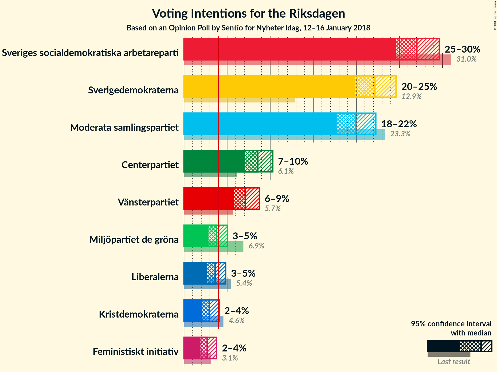
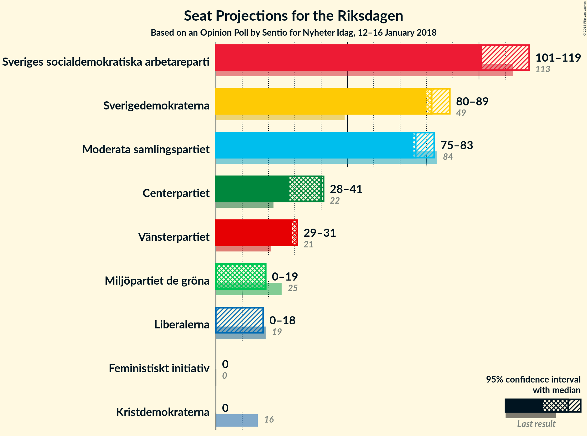
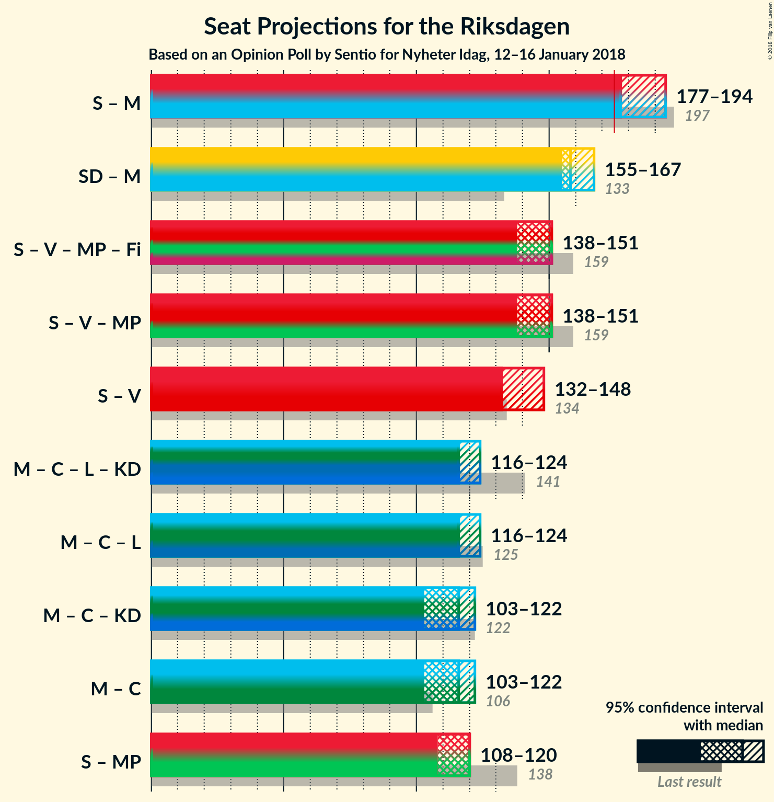

# Opinion Poll by Sentio for Nyheter Idag, 12–16 January 2018

<a href="#voting-intentions">Voting Intentions</a> | <a href="#seats">Seats</a> | <a href="#coalitions">Coalitions</a> | <a href="#technical-information">Technical Information</a>

## Voting Intentions

### Confidence Intervals

| Party | Last Result | Poll Result | 80% Confidence Interval | 90% Confidence Interval | 95% Confidence Interval | 99% Confidence Interval |
|:-----:|:-----------:|:-----------:|:-----------------------:|:-----------------------:|:-----------------------:|:-----------------------:|
| Sveriges socialdemokratiska arbetareparti | 31.0% | 27.0% | N/A |N/A |N/A |N/A |
| Sverigedemokraterna | 12.9% | 22.2% | N/A |N/A |N/A |N/A |
| Moderata samlingspartiet | 23.3% | 19.9% | N/A |N/A |N/A |N/A |
| Centerpartiet | 6.1% | 8.6% | N/A |N/A |N/A |N/A |
| Vänsterpartiet | 5.7% | 7.1% | N/A |N/A |N/A |N/A |
| Miljöpartiet de gröna | 6.9% | 3.8% | N/A |N/A |N/A |N/A |
| Liberalerna | 5.4% | 3.6% | N/A |N/A |N/A |N/A |
| Kristdemokraterna | 4.6% | 2.9% | N/A |N/A |N/A |N/A |
| Feministiskt initiativ | 3.1% | 2.7% | N/A |N/A |N/A |N/A |

*Note:* The poll result column reflects the actual value used in the calculations. Published results may vary slightly, and in addition be rounded to fewer digits.

## Seats

### Confidence Intervals

| Party | Last Result | Median | 80% Confidence Interval | 90% Confidence Interval | 95% Confidence Interval | 99% Confidence Interval |
|:-----:|:-----------:|:------:|:-----------------------:|:-----------------------:|:-----------------------:|:-----------------------:|
| <a href="#sveriges-socialdemokratiska-arbetareparti">Sveriges socialdemokratiska arbetareparti</a> | 113 | N/A | N/A |N/A |N/A |N/A |
| <a href="#sverigedemokraterna">Sverigedemokraterna</a> | 49 | N/A | N/A |N/A |N/A |N/A |
| <a href="#moderata-samlingspartiet">Moderata samlingspartiet</a> | 84 | N/A | N/A |N/A |N/A |N/A |
| <a href="#centerpartiet">Centerpartiet</a> | 22 | N/A | N/A |N/A |N/A |N/A |
| <a href="#vänsterpartiet">Vänsterpartiet</a> | 21 | N/A | N/A |N/A |N/A |N/A |
| <a href="#miljöpartiet-de-gröna">Miljöpartiet de gröna</a> | 25 | N/A | N/A |N/A |N/A |N/A |
| <a href="#liberalerna">Liberalerna</a> | 19 | N/A | N/A |N/A |N/A |N/A |
| <a href="#kristdemokraterna">Kristdemokraterna</a> | 16 | N/A | N/A |N/A |N/A |N/A |
| <a href="#feministiskt-initiativ">Feministiskt initiativ</a> | 0 | N/A | N/A |N/A |N/A |N/A |

## Coalitions

## Technical Information

### Opinion Poll

+ **Polling firm:** Sentio
+ **Commissioner(s):** Nyheter Idag
+ **Fieldwork period:** 12–16 January 2018

### Calculations

+ **Sample size:** 1191
+ **Simulations done:** 0
+ **Error estimate:** 100.00%

