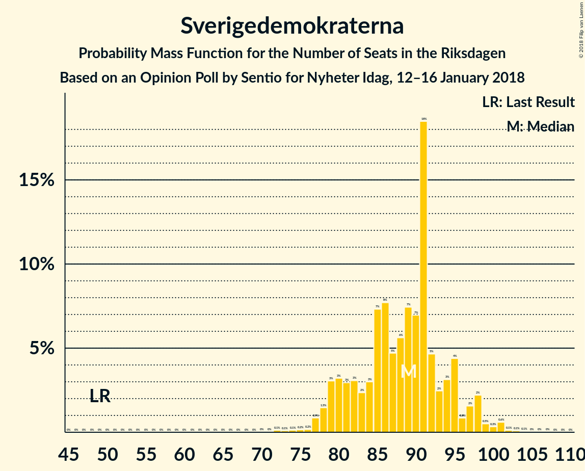
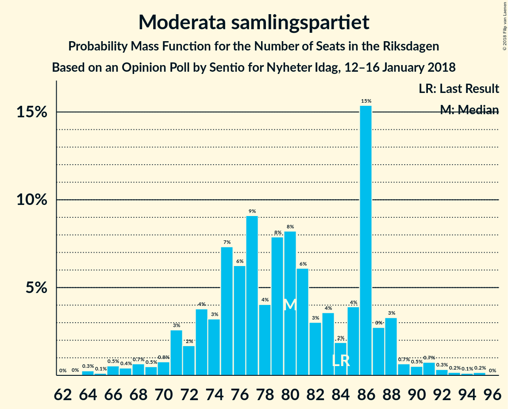
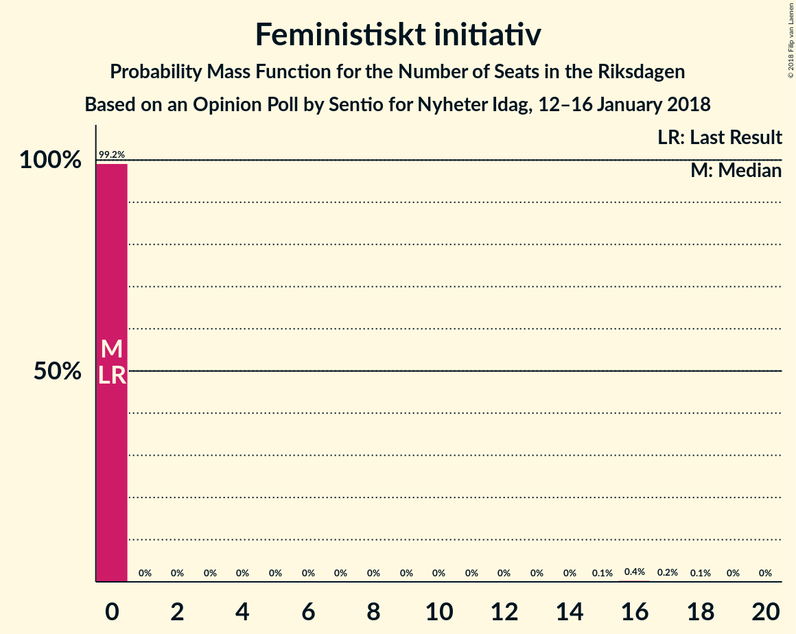
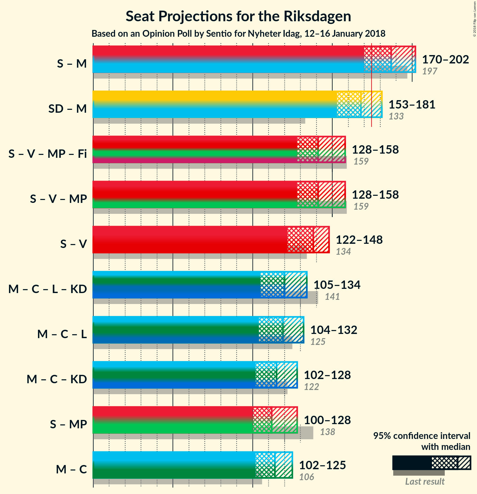

# Opinion Poll by Sentio for Nyheter Idag, 12–16 January 2018

<a href="#voting-intentions">Voting Intentions</a> | <a href="#seats">Seats</a> | <a href="#coalitions">Coalitions</a> | <a href="#technical-information">Technical Information</a>

## Voting Intentions

### Confidence Intervals

| Party | Last Result | Poll Result | 80% Confidence Interval | 90% Confidence Interval | 95% Confidence Interval | 99% Confidence Interval |
|:-----:|:-----------:|:-----------:|:-----------------------:|:-----------------------:|:-----------------------:|:-----------------------:|
| Sveriges socialdemokratiska arbetareparti | 31.0% | 27.0% | 25.4–28.7% |25.0–29.2% |24.6–29.6% |23.8–30.5% |
| Sverigedemokraterna | 12.9% | 22.2% | 20.7–23.8% |20.3–24.2% |19.9–24.6% |19.2–25.4% |
| Moderata samlingspartiet | 23.3% | 19.9% | 18.5–21.4% |18.1–21.9% |17.7–22.3% |17.1–23.0% |
| Centerpartiet | 6.1% | 8.6% | 7.6–9.7% |7.3–10.0% |7.1–10.3% |6.7–10.9% |
| Vänsterpartiet | 5.7% | 7.1% | 6.3–8.2% |6.0–8.5% |5.8–8.7% |5.4–9.3% |
| Miljöpartiet de gröna | 6.9% | 3.8% | 3.2–4.6% |3.0–4.8% |2.8–5.0% |2.6–5.4% |
| Liberalerna | 5.4% | 3.6% | 3.0–4.4% |2.8–4.6% |2.7–4.8% |2.4–5.2% |
| Kristdemokraterna | 4.6% | 2.9% | 2.4–3.7% |2.2–3.9% |2.1–4.1% |1.9–4.5% |
| Feministiskt initiativ | 3.1% | 2.7% | 2.2–3.4% |2.0–3.6% |1.9–3.8% |1.7–4.1% |

*Note:* The poll result column reflects the actual value used in the calculations. Published results may vary slightly, and in addition be rounded to fewer digits.

## Seats

### Confidence Intervals

| Party | Last Result | Median | 80% Confidence Interval | 90% Confidence Interval | 95% Confidence Interval | 99% Confidence Interval |
|:-----:|:-----------:|:------:|:-----------------------:|:-----------------------:|:-----------------------:|:-----------------------:|
| <a href="#sveriges-socialdemokratiska-arbetareparti">Sveriges socialdemokratiska arbetareparti</a> | 113 | 101 | 101 |101–119 |101–119 |94–119 |
| <a href="#sverigedemokraterna">Sverigedemokraterna</a> | 49 | 82 | 82 |80–82 |80–89 |79–94 |
| <a href="#moderata-samlingspartiet">Moderata samlingspartiet</a> | 84 | 76 | 76 |75–76 |75–83 |75–83 |
| <a href="#centerpartiet">Centerpartiet</a> | 22 | 40 | 40 |28–40 |28–41 |28–44 |
| <a href="#vänsterpartiet">Vänsterpartiet</a> | 21 | 31 | 31 |29–31 |29–31 |24–31 |
| <a href="#miljöpartiet-de-gröna">Miljöpartiet de gröna</a> | 25 | 19 | 19 |0–19 |0–19 |0–19 |
| <a href="#liberalerna">Liberalerna</a> | 19 | 0 | 0 |0–18 |0–18 |0–18 |
| <a href="#kristdemokraterna">Kristdemokraterna</a> | 16 | 0 | 0 |0 |0 |0 |
| <a href="#feministiskt-initiativ">Feministiskt initiativ</a> | 0 | 0 | 0 |0 |0 |0 |

### Sveriges socialdemokratiska arbetareparti

*For a full overview of the results for this party, see the [Sveriges socialdemokratiska arbetareparti](party-sverigessocialdemokratiskaarbetareparti.html) page.*

| Number of Seats | Probability | Accumulated | Special Marks |
|:---------------:|:-----------:|:-----------:|:-------------:|
| 90 | 0.4% | 100% |  |
| 91 | 0% | 99.5% |  |
| 92 | 0% | 99.5% |  |
| 93 | 0% | 99.5% |  |
| 94 | 0.1% | 99.5% |  |
| 95 | 0% | 99.4% |  |
| 96 | 0.3% | 99.4% |  |
| 97 | 0% | 99.1% |  |
| 98 | 0% | 99.1% |  |
| 99 | 0% | 99.1% |  |
| 100 | 0% | 99.1% |  |
| 101 | 90% | 99.1% | Median |
| 102 | 0% | 9% |  |
| 103 | 0.3% | 9% |  |
| 104 | 0.2% | 9% |  |
| 105 | 2% | 8% |  |
| 106 | 0.2% | 6% |  |
| 107 | 0% | 6% |  |
| 108 | 0% | 6% |  |
| 109 | 0% | 6% |  |
| 110 | 0% | 6% |  |
| 111 | 0% | 6% |  |
| 112 | 0.1% | 6% |  |
| 113 | 0% | 6% | Last Result |
| 114 | 0% | 6% |  |
| 115 | 0% | 6% |  |
| 116 | 0% | 6% |  |
| 117 | 0% | 6% |  |
| 118 | 0% | 6% |  |
| 119 | 6% | 6% |  |
| 120 | 0% | 0% |  |

### Sverigedemokraterna

*For a full overview of the results for this party, see the [Sverigedemokraterna](party-sverigedemokraterna.html) page.*

| Number of Seats | Probability | Accumulated | Special Marks |
|:---------------:|:-----------:|:-----------:|:-------------:|
| 49 | 0% | 100% | Last Result |
| 50 | 0% | 100% |  |
| 51 | 0% | 100% |  |
| 52 | 0% | 100% |  |
| 53 | 0% | 100% |  |
| 54 | 0% | 100% |  |
| 55 | 0% | 100% |  |
| 56 | 0% | 100% |  |
| 57 | 0% | 100% |  |
| 58 | 0% | 100% |  |
| 59 | 0% | 100% |  |
| 60 | 0% | 100% |  |
| 61 | 0% | 100% |  |
| 62 | 0% | 100% |  |
| 63 | 0% | 100% |  |
| 64 | 0% | 100% |  |
| 65 | 0% | 100% |  |
| 66 | 0% | 100% |  |
| 67 | 0% | 100% |  |
| 68 | 0% | 100% |  |
| 69 | 0% | 100% |  |
| 70 | 0% | 100% |  |
| 71 | 0% | 100% |  |
| 72 | 0% | 100% |  |
| 73 | 0% | 100% |  |
| 74 | 0% | 100% |  |
| 75 | 0% | 100% |  |
| 76 | 0% | 100% |  |
| 77 | 0% | 100% |  |
| 78 | 0% | 99.9% |  |
| 79 | 0.4% | 99.9% |  |
| 80 | 6% | 99.5% |  |
| 81 | 0% | 93% |  |
| 82 | 90% | 93% | Median |
| 83 | 0% | 3% |  |
| 84 | 0% | 3% |  |
| 85 | 0% | 3% |  |
| 86 | 0.2% | 3% |  |
| 87 | 0.2% | 3% |  |
| 88 | 0% | 3% |  |
| 89 | 0% | 3% |  |
| 90 | 2% | 2% |  |
| 91 | 0% | 0.5% |  |
| 92 | 0% | 0.5% |  |
| 93 | 0% | 0.5% |  |
| 94 | 0.3% | 0.5% |  |
| 95 | 0% | 0.3% |  |
| 96 | 0.3% | 0.3% |  |
| 97 | 0% | 0% |  |

### Moderata samlingspartiet

*For a full overview of the results for this party, see the [Moderata samlingspartiet](party-moderatasamlingspartiet.html) page.*

| Number of Seats | Probability | Accumulated | Special Marks |
|:---------------:|:-----------:|:-----------:|:-------------:|
| 64 | 0.3% | 100% |  |
| 65 | 0% | 99.7% |  |
| 66 | 0.1% | 99.7% |  |
| 67 | 0% | 99.6% |  |
| 68 | 0% | 99.6% |  |
| 69 | 0% | 99.6% |  |
| 70 | 0% | 99.6% |  |
| 71 | 0% | 99.6% |  |
| 72 | 0% | 99.6% |  |
| 73 | 0% | 99.6% |  |
| 74 | 0% | 99.6% |  |
| 75 | 6% | 99.6% |  |
| 76 | 90% | 93% | Median |
| 77 | 0% | 3% |  |
| 78 | 0% | 3% |  |
| 79 | 0.1% | 3% |  |
| 80 | 0% | 3% |  |
| 81 | 0.3% | 3% |  |
| 82 | 0.2% | 3% |  |
| 83 | 2% | 3% |  |
| 84 | 0% | 0.5% | Last Result |
| 85 | 0% | 0.5% |  |
| 86 | 0% | 0.5% |  |
| 87 | 0% | 0.5% |  |
| 88 | 0.4% | 0.5% |  |
| 89 | 0% | 0% |  |

### Centerpartiet

*For a full overview of the results for this party, see the [Centerpartiet](party-centerpartiet.html) page.*

| Number of Seats | Probability | Accumulated | Special Marks |
|:---------------:|:-----------:|:-----------:|:-------------:|
| 22 | 0% | 100% | Last Result |
| 23 | 0% | 100% |  |
| 24 | 0.2% | 100% |  |
| 25 | 0% | 99.8% |  |
| 26 | 0.1% | 99.8% |  |
| 27 | 0% | 99.7% |  |
| 28 | 6% | 99.7% |  |
| 29 | 0% | 94% |  |
| 30 | 0.2% | 94% |  |
| 31 | 0% | 93% |  |
| 32 | 0% | 93% |  |
| 33 | 0% | 93% |  |
| 34 | 0% | 93% |  |
| 35 | 0% | 93% |  |
| 36 | 0% | 93% |  |
| 37 | 0% | 93% |  |
| 38 | 0.3% | 93% |  |
| 39 | 0% | 93% |  |
| 40 | 90% | 93% | Median |
| 41 | 2% | 3% |  |
| 42 | 0% | 0.9% |  |
| 43 | 0.1% | 0.9% |  |
| 44 | 0.7% | 0.7% |  |
| 45 | 0% | 0% |  |

### Vänsterpartiet

*For a full overview of the results for this party, see the [Vänsterpartiet](party-vänsterpartiet.html) page.*

| Number of Seats | Probability | Accumulated | Special Marks |
|:---------------:|:-----------:|:-----------:|:-------------:|
| 21 | 0.5% | 100% | Last Result |
| 22 | 0% | 99.5% |  |
| 23 | 0% | 99.5% |  |
| 24 | 0.1% | 99.5% |  |
| 25 | 0.3% | 99.4% |  |
| 26 | 0% | 99.1% |  |
| 27 | 0% | 99.1% |  |
| 28 | 0.3% | 99.1% |  |
| 29 | 6% | 98.9% |  |
| 30 | 2% | 93% |  |
| 31 | 90% | 90% | Median |
| 32 | 0% | 0.1% |  |
| 33 | 0% | 0% |  |

### Miljöpartiet de gröna

*For a full overview of the results for this party, see the [Miljöpartiet de gröna](party-miljöpartietdegröna.html) page.*

| Number of Seats | Probability | Accumulated | Special Marks |
|:---------------:|:-----------:|:-----------:|:-------------:|
| 0 | 9% | 100% |  |
| 1 | 0% | 91% |  |
| 2 | 0% | 91% |  |
| 3 | 0% | 91% |  |
| 4 | 0% | 91% |  |
| 5 | 0% | 91% |  |
| 6 | 0% | 91% |  |
| 7 | 0% | 91% |  |
| 8 | 0% | 91% |  |
| 9 | 0% | 91% |  |
| 10 | 0% | 91% |  |
| 11 | 0% | 91% |  |
| 12 | 0% | 91% |  |
| 13 | 0% | 91% |  |
| 14 | 0% | 91% |  |
| 15 | 0% | 91% |  |
| 16 | 0.3% | 91% |  |
| 17 | 0% | 91% |  |
| 18 | 0.4% | 91% |  |
| 19 | 90% | 91% | Median |
| 20 | 0.2% | 0.4% |  |
| 21 | 0% | 0.1% |  |
| 22 | 0.1% | 0.1% |  |
| 23 | 0% | 0% |  |
| 24 | 0% | 0% |  |
| 25 | 0% | 0% | Last Result |

### Liberalerna

*For a full overview of the results for this party, see the [Liberalerna](party-liberalerna.html) page.*

| Number of Seats | Probability | Accumulated | Special Marks |
|:---------------:|:-----------:|:-----------:|:-------------:|
| 0 | 93% | 100% | Median |
| 1 | 0% | 7% |  |
| 2 | 0% | 7% |  |
| 3 | 0% | 7% |  |
| 4 | 0% | 7% |  |
| 5 | 0% | 7% |  |
| 6 | 0% | 7% |  |
| 7 | 0% | 7% |  |
| 8 | 0% | 7% |  |
| 9 | 0% | 7% |  |
| 10 | 0% | 7% |  |
| 11 | 0% | 7% |  |
| 12 | 0% | 7% |  |
| 13 | 0% | 7% |  |
| 14 | 0% | 7% |  |
| 15 | 0.1% | 7% |  |
| 16 | 0% | 6% |  |
| 17 | 0% | 6% |  |
| 18 | 6% | 6% |  |
| 19 | 0% | 0% | Last Result |

### Kristdemokraterna

*For a full overview of the results for this party, see the [Kristdemokraterna](party-kristdemokraterna.html) page.*

| Number of Seats | Probability | Accumulated | Special Marks |
|:---------------:|:-----------:|:-----------:|:-------------:|
| 0 | 99.9% | 100% | Median |
| 1 | 0% | 0.1% |  |
| 2 | 0% | 0.1% |  |
| 3 | 0% | 0.1% |  |
| 4 | 0% | 0.1% |  |
| 5 | 0% | 0.1% |  |
| 6 | 0% | 0.1% |  |
| 7 | 0% | 0.1% |  |
| 8 | 0% | 0.1% |  |
| 9 | 0% | 0.1% |  |
| 10 | 0% | 0.1% |  |
| 11 | 0% | 0.1% |  |
| 12 | 0% | 0.1% |  |
| 13 | 0% | 0.1% |  |
| 14 | 0% | 0.1% |  |
| 15 | 0% | 0.1% |  |
| 16 | 0% | 0.1% | Last Result |
| 17 | 0% | 0.1% |  |
| 18 | 0.1% | 0.1% |  |
| 19 | 0% | 0% |  |

### Feministiskt initiativ

*For a full overview of the results for this party, see the [Feministiskt initiativ](party-feministisktinitiativ.html) page.*

| Number of Seats | Probability | Accumulated | Special Marks |
|:---------------:|:-----------:|:-----------:|:-------------:|
| 0 | 99.7% | 100% | Last Result, Median |
| 1 | 0% | 0.3% |  |
| 2 | 0% | 0.3% |  |
| 3 | 0% | 0.3% |  |
| 4 | 0% | 0.3% |  |
| 5 | 0% | 0.3% |  |
| 6 | 0% | 0.3% |  |
| 7 | 0% | 0.3% |  |
| 8 | 0% | 0.3% |  |
| 9 | 0% | 0.3% |  |
| 10 | 0% | 0.3% |  |
| 11 | 0% | 0.3% |  |
| 12 | 0% | 0.3% |  |
| 13 | 0% | 0.3% |  |
| 14 | 0% | 0.3% |  |
| 15 | 0% | 0.3% |  |
| 16 | 0% | 0.3% |  |
| 17 | 0.3% | 0.3% |  |
| 18 | 0% | 0% |  |

## Coalitions

### Confidence Intervals

| Coalition | Last Result | Median | Majority? | 80% Confidence Interval | 90% Confidence Interval | 95% Confidence Interval | 99% Confidence Interval |
|:---------:|:-----------:|:------:|:---------:|:-----------------------:|:-----------------------:|:-----------------------:|:-----------------------:|
| Sveriges socialdemokratiska arbetareparti – Moderata samlingspartiet | 197 | 177 | 99.6% | 177 | 177–194 | 177–194 | 177–194 |
| Sverigedemokraterna – Moderata samlingspartiet | 133 | 158 | 0.3% | 158 | 155–158 | 155–167 | 155–173 |
| Sveriges socialdemokratiska arbetareparti – Vänsterpartiet – Miljöpartiet de gröna – Feministiskt initiativ | 159 | 151 | 0% | 151 | 148–151 | 138–151 | 135–151 |
| Sveriges socialdemokratiska arbetareparti – Vänsterpartiet – Miljöpartiet de gröna | 159 | 151 | 0% | 151 | 148–151 | 138–151 | 135–151 |
| Sveriges socialdemokratiska arbetareparti – Vänsterpartiet | 134 | 132 | 0% | 132 | 132–148 | 132–148 | 120–148 |
| Moderata samlingspartiet – Centerpartiet – Liberalerna – Kristdemokraterna | 141 | 116 | 0% | 116 | 116–121 | 116–124 | 116–128 |
| Moderata samlingspartiet – Centerpartiet – Liberalerna | 125 | 116 | 0% | 116 | 116–121 | 116–124 | 113–128 |
| Moderata samlingspartiet – Centerpartiet – Kristdemokraterna | 122 | 116 | 0% | 116 | 103–116 | 103–122 | 103–128 |
| Moderata samlingspartiet – Centerpartiet | 106 | 116 | 0% | 116 | 103–116 | 103–122 | 103–124 |
| Sveriges socialdemokratiska arbetareparti – Miljöpartiet de gröna | 138 | 120 | 0% | 120 | 119–120 | 108–120 | 105–120 |

### Sveriges socialdemokratiska arbetareparti – Moderata samlingspartiet

| Number of Seats | Probability | Accumulated | Special Marks |
|:---------------:|:-----------:|:-----------:|:-------------:|
| 167 | 0.3% | 100% |  |
| 168 | 0% | 99.7% |  |
| 169 | 0% | 99.7% |  |
| 170 | 0% | 99.7% |  |
| 171 | 0% | 99.7% |  |
| 172 | 0% | 99.7% |  |
| 173 | 0.1% | 99.7% |  |
| 174 | 0% | 99.6% |  |
| 175 | 0% | 99.6% | Majority |
| 176 | 0% | 99.6% |  |
| 177 | 90% | 99.6% | Median |
| 178 | 0.5% | 9% |  |
| 179 | 0% | 9% |  |
| 180 | 0% | 9% |  |
| 181 | 0% | 9% |  |
| 182 | 0% | 9% |  |
| 183 | 0% | 9% |  |
| 184 | 0% | 9% |  |
| 185 | 0% | 9% |  |
| 186 | 0.2% | 9% |  |
| 187 | 0% | 8% |  |
| 188 | 2% | 8% |  |
| 189 | 0.2% | 6% |  |
| 190 | 0% | 6% |  |
| 191 | 0% | 6% |  |
| 192 | 0% | 6% |  |
| 193 | 0% | 6% |  |
| 194 | 6% | 6% |  |
| 195 | 0% | 0% |  |
| 196 | 0% | 0% |  |
| 197 | 0% | 0% | Last Result |

### Sverigedemokraterna – Moderata samlingspartiet

| Number of Seats | Probability | Accumulated | Special Marks |
|:---------------:|:-----------:|:-----------:|:-------------:|
| 133 | 0% | 100% | Last Result |
| 134 | 0% | 100% |  |
| 135 | 0% | 100% |  |
| 136 | 0% | 100% |  |
| 137 | 0% | 100% |  |
| 138 | 0% | 100% |  |
| 139 | 0% | 100% |  |
| 140 | 0% | 100% |  |
| 141 | 0% | 100% |  |
| 142 | 0% | 100% |  |
| 143 | 0% | 100% |  |
| 144 | 0% | 100% |  |
| 145 | 0% | 100% |  |
| 146 | 0% | 100% |  |
| 147 | 0% | 100% |  |
| 148 | 0% | 100% |  |
| 149 | 0% | 100% |  |
| 150 | 0% | 100% |  |
| 151 | 0% | 100% |  |
| 152 | 0% | 100% |  |
| 153 | 0.1% | 100% |  |
| 154 | 0% | 99.9% |  |
| 155 | 6% | 99.9% |  |
| 156 | 0% | 94% |  |
| 157 | 0% | 94% |  |
| 158 | 90% | 94% | Median |
| 159 | 0% | 3% |  |
| 160 | 0% | 3% |  |
| 161 | 0% | 3% |  |
| 162 | 0.2% | 3% |  |
| 163 | 0% | 3% |  |
| 164 | 0% | 3% |  |
| 165 | 0% | 3% |  |
| 166 | 0.1% | 3% |  |
| 167 | 0.5% | 3% |  |
| 168 | 0% | 2% |  |
| 169 | 0.2% | 2% |  |
| 170 | 0% | 2% |  |
| 171 | 0% | 2% |  |
| 172 | 0% | 2% |  |
| 173 | 2% | 2% |  |
| 174 | 0% | 0.3% |  |
| 175 | 0% | 0.3% | Majority |
| 176 | 0% | 0.3% |  |
| 177 | 0.3% | 0.3% |  |
| 178 | 0% | 0% |  |

### Sveriges socialdemokratiska arbetareparti – Vänsterpartiet – Miljöpartiet de gröna – Feministiskt initiativ

| Number of Seats | Probability | Accumulated | Special Marks |
|:---------------:|:-----------:|:-----------:|:-------------:|
| 134 | 0.3% | 100% |  |
| 135 | 2% | 99.7% |  |
| 136 | 0% | 98% |  |
| 137 | 0.1% | 98% |  |
| 138 | 0.5% | 98% |  |
| 139 | 0% | 97% |  |
| 140 | 0.2% | 97% |  |
| 141 | 0% | 97% |  |
| 142 | 0% | 97% |  |
| 143 | 0% | 97% |  |
| 144 | 0% | 97% |  |
| 145 | 0.2% | 97% |  |
| 146 | 0% | 97% |  |
| 147 | 0.3% | 97% |  |
| 148 | 6% | 97% |  |
| 149 | 0% | 90% |  |
| 150 | 0.2% | 90% |  |
| 151 | 90% | 90% | Median |
| 152 | 0% | 0% |  |
| 153 | 0% | 0% |  |
| 154 | 0% | 0% |  |
| 155 | 0% | 0% |  |
| 156 | 0% | 0% |  |
| 157 | 0% | 0% |  |
| 158 | 0% | 0% |  |
| 159 | 0% | 0% | Last Result |

### Sveriges socialdemokratiska arbetareparti – Vänsterpartiet – Miljöpartiet de gröna

| Number of Seats | Probability | Accumulated | Special Marks |
|:---------------:|:-----------:|:-----------:|:-------------:|
| 117 | 0.3% | 100% |  |
| 118 | 0% | 99.7% |  |
| 119 | 0% | 99.7% |  |
| 120 | 0% | 99.7% |  |
| 121 | 0% | 99.7% |  |
| 122 | 0% | 99.7% |  |
| 123 | 0% | 99.7% |  |
| 124 | 0% | 99.7% |  |
| 125 | 0% | 99.7% |  |
| 126 | 0% | 99.7% |  |
| 127 | 0% | 99.7% |  |
| 128 | 0% | 99.7% |  |
| 129 | 0% | 99.7% |  |
| 130 | 0% | 99.7% |  |
| 131 | 0% | 99.7% |  |
| 132 | 0% | 99.7% |  |
| 133 | 0% | 99.7% |  |
| 134 | 0% | 99.7% |  |
| 135 | 2% | 99.7% |  |
| 136 | 0% | 98% |  |
| 137 | 0.1% | 98% |  |
| 138 | 0.5% | 98% |  |
| 139 | 0% | 97% |  |
| 140 | 0.2% | 97% |  |
| 141 | 0% | 97% |  |
| 142 | 0% | 97% |  |
| 143 | 0% | 97% |  |
| 144 | 0% | 97% |  |
| 145 | 0.2% | 97% |  |
| 146 | 0% | 97% |  |
| 147 | 0.3% | 97% |  |
| 148 | 6% | 97% |  |
| 149 | 0% | 90% |  |
| 150 | 0.2% | 90% |  |
| 151 | 90% | 90% | Median |
| 152 | 0% | 0% |  |
| 153 | 0% | 0% |  |
| 154 | 0% | 0% |  |
| 155 | 0% | 0% |  |
| 156 | 0% | 0% |  |
| 157 | 0% | 0% |  |
| 158 | 0% | 0% |  |
| 159 | 0% | 0% | Last Result |

### Sveriges socialdemokratiska arbetareparti – Vänsterpartiet

| Number of Seats | Probability | Accumulated | Special Marks |
|:---------------:|:-----------:|:-----------:|:-------------:|
| 117 | 0.3% | 100% |  |
| 118 | 0.1% | 99.7% |  |
| 119 | 0% | 99.6% |  |
| 120 | 0.4% | 99.6% |  |
| 121 | 0% | 99.2% |  |
| 122 | 0% | 99.2% |  |
| 123 | 0% | 99.1% |  |
| 124 | 0% | 99.1% |  |
| 125 | 0.2% | 99.1% |  |
| 126 | 0% | 98.9% |  |
| 127 | 0% | 98.9% |  |
| 128 | 0% | 98.9% |  |
| 129 | 0% | 98.9% |  |
| 130 | 0% | 98.9% |  |
| 131 | 0.4% | 98.9% |  |
| 132 | 90% | 98% | Median |
| 133 | 0% | 8% |  |
| 134 | 0% | 8% | Last Result |
| 135 | 2% | 8% |  |
| 136 | 0% | 6% |  |
| 137 | 0.1% | 6% |  |
| 138 | 0% | 6% |  |
| 139 | 0% | 6% |  |
| 140 | 0% | 6% |  |
| 141 | 0% | 6% |  |
| 142 | 0% | 6% |  |
| 143 | 0% | 6% |  |
| 144 | 0% | 6% |  |
| 145 | 0% | 6% |  |
| 146 | 0% | 6% |  |
| 147 | 0% | 6% |  |
| 148 | 6% | 6% |  |
| 149 | 0% | 0% |  |

### Moderata samlingspartiet – Centerpartiet – Liberalerna – Kristdemokraterna

| Number of Seats | Probability | Accumulated | Special Marks |
|:---------------:|:-----------:|:-----------:|:-------------:|
| 108 | 0.3% | 100% |  |
| 109 | 0% | 99.7% |  |
| 110 | 0% | 99.7% |  |
| 111 | 0% | 99.7% |  |
| 112 | 0% | 99.7% |  |
| 113 | 0.2% | 99.7% |  |
| 114 | 0% | 99.6% |  |
| 115 | 0% | 99.6% |  |
| 116 | 90% | 99.6% | Median |
| 117 | 0% | 9% |  |
| 118 | 0% | 9% |  |
| 119 | 0.3% | 9% |  |
| 120 | 0% | 9% |  |
| 121 | 6% | 9% |  |
| 122 | 0.2% | 3% |  |
| 123 | 0% | 3% |  |
| 124 | 2% | 3% |  |
| 125 | 0.1% | 0.6% |  |
| 126 | 0% | 0.5% |  |
| 127 | 0% | 0.5% |  |
| 128 | 0% | 0.5% |  |
| 129 | 0% | 0.5% |  |
| 130 | 0% | 0.5% |  |
| 131 | 0% | 0.5% |  |
| 132 | 0.5% | 0.5% |  |
| 133 | 0% | 0% |  |
| 134 | 0% | 0% |  |
| 135 | 0% | 0% |  |
| 136 | 0% | 0% |  |
| 137 | 0% | 0% |  |
| 138 | 0% | 0% |  |
| 139 | 0% | 0% |  |
| 140 | 0% | 0% |  |
| 141 | 0% | 0% | Last Result |

### Moderata samlingspartiet – Centerpartiet – Liberalerna

| Number of Seats | Probability | Accumulated | Special Marks |
|:---------------:|:-----------:|:-----------:|:-------------:|
| 107 | 0.1% | 100% |  |
| 108 | 0.3% | 99.9% |  |
| 109 | 0% | 99.6% |  |
| 110 | 0% | 99.6% |  |
| 111 | 0% | 99.6% |  |
| 112 | 0% | 99.6% |  |
| 113 | 0.2% | 99.6% |  |
| 114 | 0% | 99.5% |  |
| 115 | 0% | 99.5% |  |
| 116 | 90% | 99.5% | Median |
| 117 | 0% | 9% |  |
| 118 | 0% | 9% |  |
| 119 | 0.3% | 9% |  |
| 120 | 0% | 9% |  |
| 121 | 6% | 9% |  |
| 122 | 0.2% | 3% |  |
| 123 | 0% | 3% |  |
| 124 | 2% | 3% |  |
| 125 | 0% | 0.5% | Last Result |
| 126 | 0% | 0.5% |  |
| 127 | 0% | 0.5% |  |
| 128 | 0% | 0.5% |  |
| 129 | 0% | 0.5% |  |
| 130 | 0% | 0.5% |  |
| 131 | 0% | 0.5% |  |
| 132 | 0.5% | 0.5% |  |
| 133 | 0% | 0% |  |

### Moderata samlingspartiet – Centerpartiet – Kristdemokraterna

| Number of Seats | Probability | Accumulated | Special Marks |
|:---------------:|:-----------:|:-----------:|:-------------:|
| 103 | 6% | 100% |  |
| 104 | 0% | 94% |  |
| 105 | 0% | 94% |  |
| 106 | 0.2% | 94% |  |
| 107 | 0% | 94% |  |
| 108 | 0.3% | 94% |  |
| 109 | 0% | 93% |  |
| 110 | 0.1% | 93% |  |
| 111 | 0% | 93% |  |
| 112 | 0% | 93% |  |
| 113 | 0.2% | 93% |  |
| 114 | 0% | 93% |  |
| 115 | 0% | 93% |  |
| 116 | 90% | 93% | Median |
| 117 | 0% | 3% |  |
| 118 | 0% | 3% |  |
| 119 | 0.3% | 3% |  |
| 120 | 0% | 3% |  |
| 121 | 0% | 3% |  |
| 122 | 0.2% | 3% | Last Result |
| 123 | 0% | 2% |  |
| 124 | 2% | 2% |  |
| 125 | 0% | 0.5% |  |
| 126 | 0% | 0.5% |  |
| 127 | 0% | 0.5% |  |
| 128 | 0% | 0.5% |  |
| 129 | 0% | 0.5% |  |
| 130 | 0% | 0.5% |  |
| 131 | 0% | 0.5% |  |
| 132 | 0.5% | 0.5% |  |
| 133 | 0% | 0% |  |

### Moderata samlingspartiet – Centerpartiet

| Number of Seats | Probability | Accumulated | Special Marks |
|:---------------:|:-----------:|:-----------:|:-------------:|
| 92 | 0.1% | 100% |  |
| 93 | 0% | 99.9% |  |
| 94 | 0% | 99.9% |  |
| 95 | 0% | 99.9% |  |
| 96 | 0% | 99.9% |  |
| 97 | 0% | 99.9% |  |
| 98 | 0% | 99.9% |  |
| 99 | 0% | 99.9% |  |
| 100 | 0% | 99.9% |  |
| 101 | 0% | 99.9% |  |
| 102 | 0% | 99.9% |  |
| 103 | 6% | 99.9% |  |
| 104 | 0% | 94% |  |
| 105 | 0% | 94% |  |
| 106 | 0.2% | 94% | Last Result |
| 107 | 0% | 94% |  |
| 108 | 0.3% | 94% |  |
| 109 | 0% | 93% |  |
| 110 | 0% | 93% |  |
| 111 | 0% | 93% |  |
| 112 | 0% | 93% |  |
| 113 | 0.2% | 93% |  |
| 114 | 0% | 93% |  |
| 115 | 0% | 93% |  |
| 116 | 90% | 93% | Median |
| 117 | 0% | 3% |  |
| 118 | 0% | 3% |  |
| 119 | 0.3% | 3% |  |
| 120 | 0% | 3% |  |
| 121 | 0% | 3% |  |
| 122 | 0.2% | 3% |  |
| 123 | 0% | 2% |  |
| 124 | 2% | 2% |  |
| 125 | 0% | 0.5% |  |
| 126 | 0% | 0.5% |  |
| 127 | 0% | 0.5% |  |
| 128 | 0% | 0.5% |  |
| 129 | 0% | 0.5% |  |
| 130 | 0% | 0.5% |  |
| 131 | 0% | 0.5% |  |
| 132 | 0.5% | 0.5% |  |
| 133 | 0% | 0% |  |

### Sveriges socialdemokratiska arbetareparti – Miljöpartiet de gröna

| Number of Seats | Probability | Accumulated | Special Marks |
|:---------------:|:-----------:|:-----------:|:-------------:|
| 96 | 0.3% | 100% |  |
| 97 | 0% | 99.7% |  |
| 98 | 0% | 99.7% |  |
| 99 | 0% | 99.7% |  |
| 100 | 0% | 99.7% |  |
| 101 | 0% | 99.7% |  |
| 102 | 0% | 99.7% |  |
| 103 | 0% | 99.7% |  |
| 104 | 0% | 99.7% |  |
| 105 | 2% | 99.7% |  |
| 106 | 0% | 98% |  |
| 107 | 0% | 98% |  |
| 108 | 0.5% | 98% |  |
| 109 | 0% | 97% |  |
| 110 | 0% | 97% |  |
| 111 | 0% | 97% |  |
| 112 | 0.1% | 97% |  |
| 113 | 0% | 97% |  |
| 114 | 0% | 97% |  |
| 115 | 0% | 97% |  |
| 116 | 0.2% | 97% |  |
| 117 | 0% | 97% |  |
| 118 | 0% | 97% |  |
| 119 | 6% | 97% |  |
| 120 | 90% | 91% | Median |
| 121 | 0% | 0.4% |  |
| 122 | 0% | 0.4% |  |
| 123 | 0% | 0.4% |  |
| 124 | 0.2% | 0.4% |  |
| 125 | 0.2% | 0.2% |  |
| 126 | 0% | 0% |  |
| 127 | 0% | 0% |  |
| 128 | 0% | 0% |  |
| 129 | 0% | 0% |  |
| 130 | 0% | 0% |  |
| 131 | 0% | 0% |  |
| 132 | 0% | 0% |  |
| 133 | 0% | 0% |  |
| 134 | 0% | 0% |  |
| 135 | 0% | 0% |  |
| 136 | 0% | 0% |  |
| 137 | 0% | 0% |  |
| 138 | 0% | 0% | Last Result |

## Technical Information

### Opinion Poll

+ **Polling firm:** Sentio
+ **Commissioner(s):** Nyheter Idag
+ **Fieldwork period:** 12–16 January 2018

### Calculations

+ **Sample size:** 1191
+ **Simulations done:** 1,024
+ **Error estimate:** 1.80%

