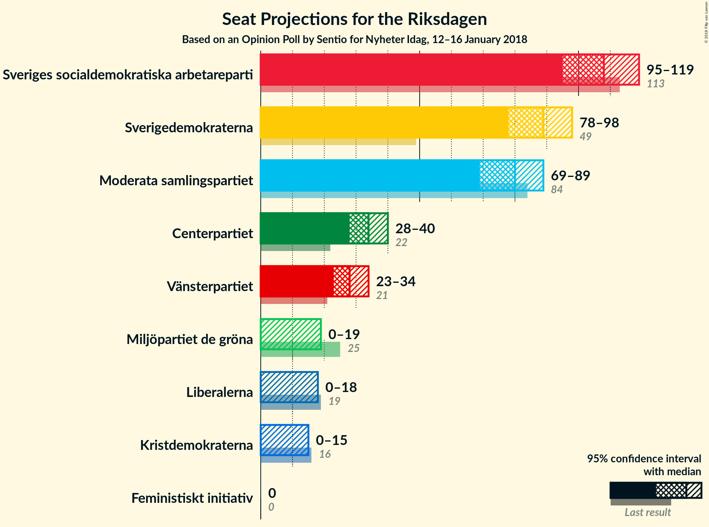
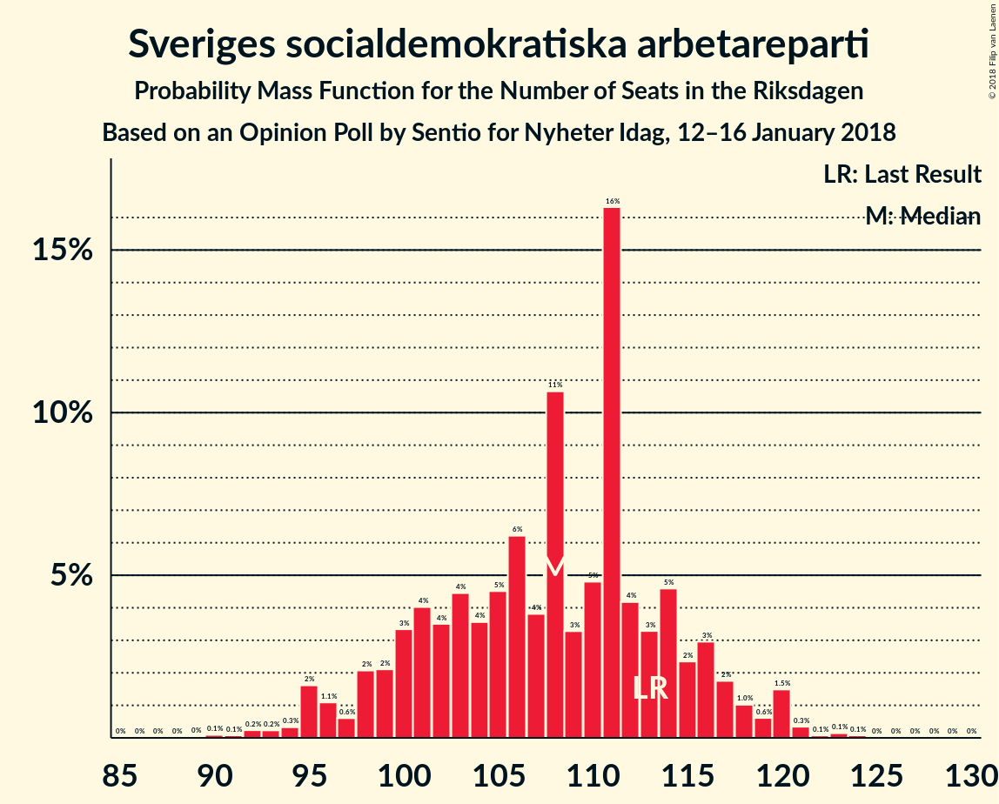
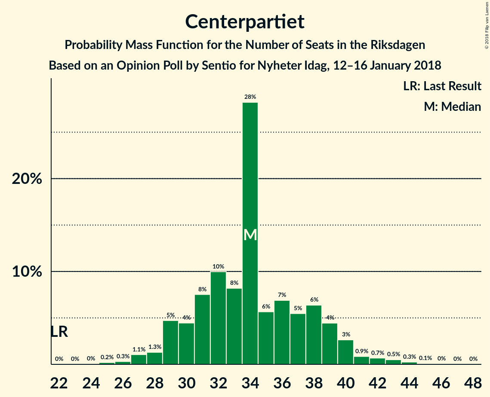
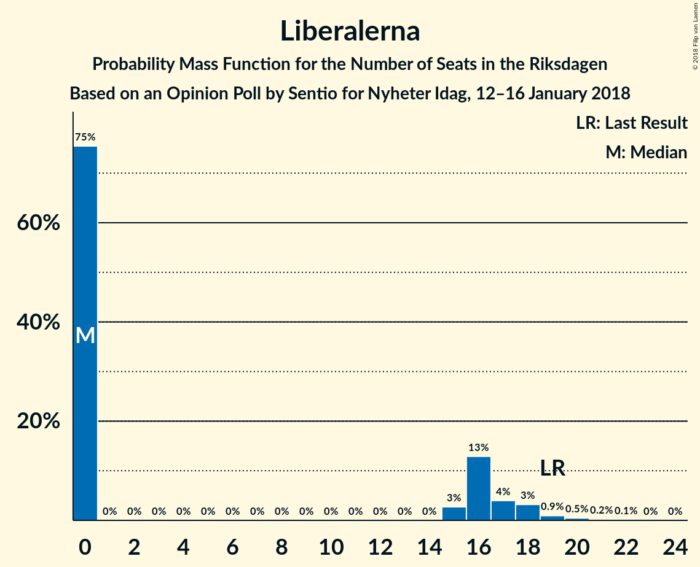
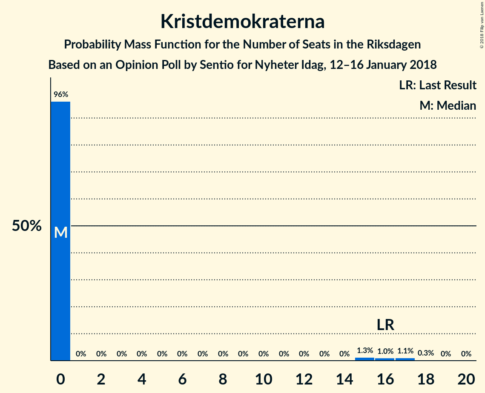

# Opinion Poll by Sentio for Nyheter Idag, 12–16 January 2018

<a href="#voting-intentions">Voting Intentions</a> | <a href="#seats">Seats</a> | <a href="#coalitions">Coalitions</a> | <a href="#technical-information">Technical Information</a>

## Voting Intentions

### Confidence Intervals

| Party | Last Result | Poll Result | 80% Confidence Interval | 90% Confidence Interval | 95% Confidence Interval | 99% Confidence Interval |
|:-----:|:-----------:|:-----------:|:-----------------------:|:-----------------------:|:-----------------------:|:-----------------------:|
| Sveriges socialdemokratiska arbetareparti | 31.0% | 27.0% | 25.4–28.7% |25.0–29.2% |24.6–29.6% |23.8–30.5% |
| Sverigedemokraterna | 12.9% | 22.2% | 20.7–23.8% |20.3–24.2% |19.9–24.6% |19.2–25.4% |
| Moderata samlingspartiet | 23.3% | 19.9% | 18.5–21.4% |18.1–21.9% |17.7–22.3% |17.1–23.0% |
| Centerpartiet | 6.1% | 8.6% | 7.6–9.7% |7.3–10.0% |7.1–10.3% |6.7–10.9% |
| Vänsterpartiet | 5.7% | 7.1% | 6.3–8.2% |6.0–8.5% |5.8–8.7% |5.4–9.3% |
| Miljöpartiet de gröna | 6.9% | 3.8% | 3.2–4.6% |3.0–4.8% |2.8–5.0% |2.6–5.4% |
| Liberalerna | 5.4% | 3.6% | 3.0–4.4% |2.8–4.6% |2.7–4.8% |2.4–5.2% |
| Kristdemokraterna | 4.6% | 2.9% | 2.4–3.7% |2.2–3.9% |2.1–4.1% |1.9–4.5% |
| Feministiskt initiativ | 3.1% | 2.7% | 2.2–3.4% |2.0–3.6% |1.9–3.8% |1.7–4.1% |

*Note:* The poll result column reflects the actual value used in the calculations. Published results may vary slightly, and in addition be rounded to fewer digits.

## Seats

### Confidence Intervals

| Party | Last Result | Median | 80% Confidence Interval | 90% Confidence Interval | 95% Confidence Interval | 99% Confidence Interval |
|:-----:|:-----------:|:------:|:-----------------------:|:-----------------------:|:-----------------------:|:-----------------------:|
| <a href="#sveriges-socialdemokratiska-arbetareparti">Sveriges socialdemokratiska arbetareparti</a> | 113 | 108 | 100–115 |98–117 |95–119 |93–121 |
| <a href="#sverigedemokraterna">Sverigedemokraterna</a> | 49 | 89 | 81–95 |79–97 |78–98 |75–101 |
| <a href="#moderata-samlingspartiet">Moderata samlingspartiet</a> | 84 | 80 | 73–86 |71–88 |69–89 |66–92 |
| <a href="#centerpartiet">Centerpartiet</a> | 22 | 34 | 30–38 |29–40 |28–40 |26–43 |
| <a href="#vänsterpartiet">Vänsterpartiet</a> | 21 | 28 | 24–33 |23–34 |23–34 |21–37 |
| <a href="#miljöpartiet-de-gröna">Miljöpartiet de gröna</a> | 25 | 0 | 0–18 |0–19 |0–19 |0–21 |
| <a href="#liberalerna">Liberalerna</a> | 19 | 0 | 0–16 |0–17 |0–18 |0–20 |
| <a href="#kristdemokraterna">Kristdemokraterna</a> | 16 | 0 | 0 |0 |0–15 |0–17 |
| <a href="#feministiskt-initiativ">Feministiskt initiativ</a> | 0 | 0 | 0 |0 |0 |0–16 |

### Sveriges socialdemokratiska arbetareparti

*For a full overview of the results for this party, see the [Sveriges socialdemokratiska arbetareparti](party-sverigessocialdemokratiskaarbetareparti.html) page.*

| Number of Seats | Probability | Accumulated | Special Marks |
|:---------------:|:-----------:|:-----------:|:-------------:|
| 88 | 0% | 100% |  |
| 89 | 0% | 99.9% |  |
| 90 | 0.1% | 99.9% |  |
| 91 | 0.1% | 99.8% |  |
| 92 | 0.2% | 99.7% |  |
| 93 | 0.2% | 99.5% |  |
| 94 | 0.3% | 99.3% |  |
| 95 | 2% | 98.9% |  |
| 96 | 1.1% | 97% |  |
| 97 | 0.6% | 96% |  |
| 98 | 2% | 96% |  |
| 99 | 2% | 94% |  |
| 100 | 3% | 91% |  |
| 101 | 4% | 88% |  |
| 102 | 4% | 84% |  |
| 103 | 4% | 81% |  |
| 104 | 4% | 76% |  |
| 105 | 5% | 73% |  |
| 106 | 6% | 68% |  |
| 107 | 4% | 62% |  |
| 108 | 11% | 58% | Median |
| 109 | 3% | 47% |  |
| 110 | 5% | 44% |  |
| 111 | 16% | 39% |  |
| 112 | 4% | 23% |  |
| 113 | 3% | 19% | Last Result |
| 114 | 5% | 15% |  |
| 115 | 2% | 11% |  |
| 116 | 3% | 9% |  |
| 117 | 2% | 6% |  |
| 118 | 1.0% | 4% |  |
| 119 | 0.6% | 3% |  |
| 120 | 1.5% | 2% |  |
| 121 | 0.3% | 0.7% |  |
| 122 | 0.1% | 0.4% |  |
| 123 | 0.1% | 0.3% |  |
| 124 | 0.1% | 0.1% |  |
| 125 | 0% | 0.1% |  |
| 126 | 0% | 0% |  |

### Sverigedemokraterna

*For a full overview of the results for this party, see the [Sverigedemokraterna](party-sverigedemokraterna.html) page.*

| Number of Seats | Probability | Accumulated | Special Marks |
|:---------------:|:-----------:|:-----------:|:-------------:|
| 49 | 0% | 100% | Last Result |
| 50 | 0% | 100% |  |
| 51 | 0% | 100% |  |
| 52 | 0% | 100% |  |
| 53 | 0% | 100% |  |
| 54 | 0% | 100% |  |
| 55 | 0% | 100% |  |
| 56 | 0% | 100% |  |
| 57 | 0% | 100% |  |
| 58 | 0% | 100% |  |
| 59 | 0% | 100% |  |
| 60 | 0% | 100% |  |
| 61 | 0% | 100% |  |
| 62 | 0% | 100% |  |
| 63 | 0% | 100% |  |
| 64 | 0% | 100% |  |
| 65 | 0% | 100% |  |
| 66 | 0% | 100% |  |
| 67 | 0% | 100% |  |
| 68 | 0% | 100% |  |
| 69 | 0% | 100% |  |
| 70 | 0% | 100% |  |
| 71 | 0% | 100% |  |
| 72 | 0.1% | 99.9% |  |
| 73 | 0.1% | 99.8% |  |
| 74 | 0.1% | 99.7% |  |
| 75 | 0.2% | 99.6% |  |
| 76 | 0.2% | 99.4% |  |
| 77 | 0.9% | 99.3% |  |
| 78 | 1.5% | 98% |  |
| 79 | 3% | 97% |  |
| 80 | 3% | 94% |  |
| 81 | 3% | 91% |  |
| 82 | 3% | 88% |  |
| 83 | 2% | 85% |  |
| 84 | 3% | 82% |  |
| 85 | 7% | 79% |  |
| 86 | 8% | 72% |  |
| 87 | 5% | 64% |  |
| 88 | 6% | 60% |  |
| 89 | 7% | 54% | Median |
| 90 | 7% | 47% |  |
| 91 | 18% | 40% |  |
| 92 | 5% | 21% |  |
| 93 | 2% | 16% |  |
| 94 | 3% | 14% |  |
| 95 | 4% | 11% |  |
| 96 | 0.8% | 6% |  |
| 97 | 2% | 6% |  |
| 98 | 2% | 4% |  |
| 99 | 0.5% | 2% |  |
| 100 | 0.3% | 1.3% |  |
| 101 | 0.6% | 1.0% |  |
| 102 | 0.1% | 0.4% |  |
| 103 | 0.1% | 0.3% |  |
| 104 | 0.1% | 0.2% |  |
| 105 | 0% | 0.1% |  |
| 106 | 0% | 0.1% |  |
| 107 | 0% | 0% |  |

### Moderata samlingspartiet

*For a full overview of the results for this party, see the [Moderata samlingspartiet](party-moderatasamlingspartiet.html) page.*

| Number of Seats | Probability | Accumulated | Special Marks |
|:---------------:|:-----------:|:-----------:|:-------------:|
| 63 | 0% | 100% |  |
| 64 | 0.3% | 99.9% |  |
| 65 | 0.1% | 99.7% |  |
| 66 | 0.5% | 99.6% |  |
| 67 | 0.4% | 99.0% |  |
| 68 | 0.7% | 98.6% |  |
| 69 | 0.5% | 98% |  |
| 70 | 0.8% | 97% |  |
| 71 | 3% | 97% |  |
| 72 | 2% | 94% |  |
| 73 | 4% | 92% |  |
| 74 | 3% | 89% |  |
| 75 | 7% | 85% |  |
| 76 | 6% | 78% |  |
| 77 | 9% | 72% |  |
| 78 | 4% | 63% |  |
| 79 | 8% | 59% |  |
| 80 | 8% | 51% | Median |
| 81 | 6% | 43% |  |
| 82 | 3% | 36% |  |
| 83 | 4% | 33% |  |
| 84 | 2% | 30% | Last Result |
| 85 | 4% | 28% |  |
| 86 | 15% | 24% |  |
| 87 | 3% | 9% |  |
| 88 | 3% | 6% |  |
| 89 | 0.7% | 3% |  |
| 90 | 0.5% | 2% |  |
| 91 | 0.7% | 2% |  |
| 92 | 0.3% | 0.8% |  |
| 93 | 0.2% | 0.5% |  |
| 94 | 0.1% | 0.3% |  |
| 95 | 0.2% | 0.2% |  |
| 96 | 0% | 0% |  |

### Centerpartiet

*For a full overview of the results for this party, see the [Centerpartiet](party-centerpartiet.html) page.*

| Number of Seats | Probability | Accumulated | Special Marks |
|:---------------:|:-----------:|:-----------:|:-------------:|
| 22 | 0% | 100% | Last Result |
| 23 | 0% | 100% |  |
| 24 | 0% | 100% |  |
| 25 | 0.2% | 99.9% |  |
| 26 | 0.3% | 99.7% |  |
| 27 | 1.1% | 99.4% |  |
| 28 | 1.3% | 98% |  |
| 29 | 5% | 97% |  |
| 30 | 4% | 92% |  |
| 31 | 8% | 88% |  |
| 32 | 10% | 80% |  |
| 33 | 8% | 70% |  |
| 34 | 28% | 62% | Median |
| 35 | 6% | 34% |  |
| 36 | 7% | 28% |  |
| 37 | 5% | 21% |  |
| 38 | 6% | 16% |  |
| 39 | 4% | 10% |  |
| 40 | 3% | 5% |  |
| 41 | 0.9% | 2% |  |
| 42 | 0.7% | 2% |  |
| 43 | 0.5% | 0.9% |  |
| 44 | 0.3% | 0.4% |  |
| 45 | 0.1% | 0.2% |  |
| 46 | 0% | 0.1% |  |
| 47 | 0% | 0% |  |

### Vänsterpartiet

*For a full overview of the results for this party, see the [Vänsterpartiet](party-vänsterpartiet.html) page.*

| Number of Seats | Probability | Accumulated | Special Marks |
|:---------------:|:-----------:|:-----------:|:-------------:|
| 20 | 0.2% | 100% |  |
| 21 | 0.7% | 99.8% | Last Result |
| 22 | 0.7% | 99.1% |  |
| 23 | 4% | 98% |  |
| 24 | 4% | 94% |  |
| 25 | 4% | 90% |  |
| 26 | 9% | 86% |  |
| 27 | 22% | 77% |  |
| 28 | 12% | 55% | Median |
| 29 | 11% | 43% |  |
| 30 | 11% | 32% |  |
| 31 | 8% | 22% |  |
| 32 | 3% | 14% |  |
| 33 | 5% | 11% |  |
| 34 | 4% | 6% |  |
| 35 | 0.6% | 2% |  |
| 36 | 0.5% | 1.4% |  |
| 37 | 0.7% | 1.0% |  |
| 38 | 0.1% | 0.3% |  |
| 39 | 0.1% | 0.2% |  |
| 40 | 0.1% | 0.1% |  |
| 41 | 0% | 0% |  |

### Miljöpartiet de gröna

*For a full overview of the results for this party, see the [Miljöpartiet de gröna](party-miljöpartietdegröna.html) page.*

| Number of Seats | Probability | Accumulated | Special Marks |
|:---------------:|:-----------:|:-----------:|:-------------:|
| 0 | 67% | 100% | Median |
| 1 | 0% | 33% |  |
| 2 | 0% | 33% |  |
| 3 | 0% | 33% |  |
| 4 | 0% | 33% |  |
| 5 | 0% | 33% |  |
| 6 | 0% | 33% |  |
| 7 | 0% | 33% |  |
| 8 | 0% | 33% |  |
| 9 | 0% | 33% |  |
| 10 | 0% | 33% |  |
| 11 | 0% | 33% |  |
| 12 | 0% | 33% |  |
| 13 | 0% | 33% |  |
| 14 | 0% | 33% |  |
| 15 | 3% | 33% |  |
| 16 | 7% | 31% |  |
| 17 | 9% | 24% |  |
| 18 | 10% | 15% |  |
| 19 | 3% | 5% |  |
| 20 | 1.3% | 2% |  |
| 21 | 0.5% | 0.8% |  |
| 22 | 0.2% | 0.3% |  |
| 23 | 0.1% | 0.1% |  |
| 24 | 0% | 0% |  |
| 25 | 0% | 0% | Last Result |

### Liberalerna

*For a full overview of the results for this party, see the [Liberalerna](party-liberalerna.html) page.*

| Number of Seats | Probability | Accumulated | Special Marks |
|:---------------:|:-----------:|:-----------:|:-------------:|
| 0 | 75% | 100% | Median |
| 1 | 0% | 25% |  |
| 2 | 0% | 25% |  |
| 3 | 0% | 25% |  |
| 4 | 0% | 25% |  |
| 5 | 0% | 25% |  |
| 6 | 0% | 25% |  |
| 7 | 0% | 25% |  |
| 8 | 0% | 25% |  |
| 9 | 0% | 25% |  |
| 10 | 0% | 25% |  |
| 11 | 0% | 25% |  |
| 12 | 0% | 25% |  |
| 13 | 0% | 25% |  |
| 14 | 0% | 25% |  |
| 15 | 3% | 25% |  |
| 16 | 13% | 22% |  |
| 17 | 4% | 9% |  |
| 18 | 3% | 5% |  |
| 19 | 0.9% | 2% | Last Result |
| 20 | 0.5% | 0.8% |  |
| 21 | 0.2% | 0.3% |  |
| 22 | 0.1% | 0.1% |  |
| 23 | 0% | 0% |  |

### Kristdemokraterna

*For a full overview of the results for this party, see the [Kristdemokraterna](party-kristdemokraterna.html) page.*

| Number of Seats | Probability | Accumulated | Special Marks |
|:---------------:|:-----------:|:-----------:|:-------------:|
| 0 | 96% | 100% | Median |
| 1 | 0% | 4% |  |
| 2 | 0% | 4% |  |
| 3 | 0% | 4% |  |
| 4 | 0% | 4% |  |
| 5 | 0% | 4% |  |
| 6 | 0% | 4% |  |
| 7 | 0% | 4% |  |
| 8 | 0% | 4% |  |
| 9 | 0% | 4% |  |
| 10 | 0% | 4% |  |
| 11 | 0% | 4% |  |
| 12 | 0% | 4% |  |
| 13 | 0% | 4% |  |
| 14 | 0% | 4% |  |
| 15 | 1.3% | 4% |  |
| 16 | 1.0% | 2% | Last Result |
| 17 | 1.1% | 1.4% |  |
| 18 | 0.3% | 0.4% |  |
| 19 | 0% | 0.1% |  |
| 20 | 0% | 0% |  |

### Feministiskt initiativ

*For a full overview of the results for this party, see the [Feministiskt initiativ](party-feministisktinitiativ.html) page.*

| Number of Seats | Probability | Accumulated | Special Marks |
|:---------------:|:-----------:|:-----------:|:-------------:|
| 0 | 99.2% | 100% | Last Result, Median |
| 1 | 0% | 0.8% |  |
| 2 | 0% | 0.8% |  |
| 3 | 0% | 0.8% |  |
| 4 | 0% | 0.8% |  |
| 5 | 0% | 0.8% |  |
| 6 | 0% | 0.8% |  |
| 7 | 0% | 0.8% |  |
| 8 | 0% | 0.8% |  |
| 9 | 0% | 0.8% |  |
| 10 | 0% | 0.8% |  |
| 11 | 0% | 0.8% |  |
| 12 | 0% | 0.8% |  |
| 13 | 0% | 0.8% |  |
| 14 | 0% | 0.8% |  |
| 15 | 0.1% | 0.8% |  |
| 16 | 0.4% | 0.7% |  |
| 17 | 0.2% | 0.3% |  |
| 18 | 0.1% | 0.1% |  |
| 19 | 0% | 0% |  |

## Coalitions

### Confidence Intervals

| Coalition | Last Result | Median | Majority? | 80% Confidence Interval | 90% Confidence Interval | 95% Confidence Interval | 99% Confidence Interval |
|:---------:|:-----------:|:------:|:---------:|:-----------------------:|:-----------------------:|:-----------------------:|:-----------------------:|
| Sveriges socialdemokratiska arbetareparti – Moderata samlingspartiet | 197 | 187 | 94% | 176–197 | 173–200 | 170–202 | 166–205 |
| Sverigedemokraterna – Moderata samlingspartiet | 133 | 168 | 27% | 158–177 | 155–178 | 153–181 | 148–185 |
| Sveriges socialdemokratiska arbetareparti – Vänsterpartiet – Miljöpartiet de gröna – Feministiskt initiativ | 159 | 141 | 0% | 132–154 | 130–156 | 128–158 | 123–162 |
| Sveriges socialdemokratiska arbetareparti – Vänsterpartiet – Miljöpartiet de gröna | 159 | 141 | 0% | 132–154 | 130–156 | 128–158 | 123–161 |
| Sveriges socialdemokratiska arbetareparti – Vänsterpartiet | 134 | 138 | 0% | 127–144 | 124–147 | 122–148 | 119–152 |
| Moderata samlingspartiet – Centerpartiet – Liberalerna – Kristdemokraterna | 141 | 120 | 0% | 109–129 | 106–132 | 105–134 | 102–141 |
| Moderata samlingspartiet – Centerpartiet – Liberalerna | 125 | 119 | 0% | 109–127 | 105–130 | 104–132 | 101–137 |
| Moderata samlingspartiet – Centerpartiet – Kristdemokraterna | 122 | 115 | 0% | 106–122 | 104–124 | 102–128 | 97–132 |
| Sveriges socialdemokratiska arbetareparti – Miljöpartiet de gröna | 138 | 112 | 0% | 103–126 | 101–127 | 100–128 | 95–133 |
| Moderata samlingspartiet – Centerpartiet | 106 | 114 | 0% | 106–120 | 104–122 | 102–125 | 97–129 |

