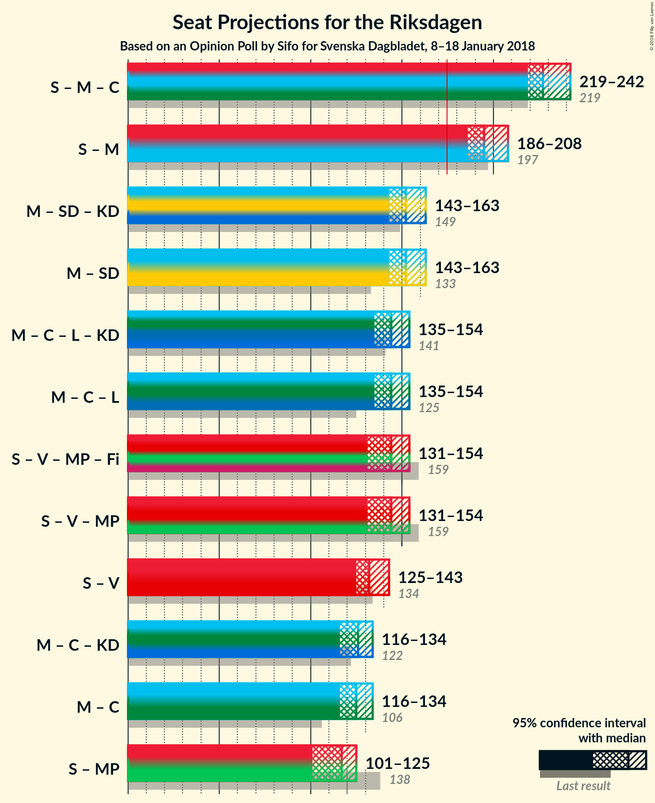

# Opinion Poll by Sifo for Svenska Dagbladet, 8–18 January 2018

<a href="#voting-intentions">Voting Intentions</a> | <a href="#seats">Seats</a> | <a href="#coalitions">Coalitions</a> | <a href="#technical-information">Technical Information</a>

## Voting Intentions

### Confidence Intervals

| Party | Last Result | Poll Result | 80% Confidence Interval | 90% Confidence Interval | 95% Confidence Interval | 99% Confidence Interval |
|:-----:|:-----------:|:-----------:|:-----------------------:|:-----------------------:|:-----------------------:|:-----------------------:|
| Sveriges socialdemokratiska arbetareparti | 31.0% | 27.7% | 26.5–29.0% |26.2–29.3% |25.9–29.6% |25.3–30.3% |
| Moderata samlingspartiet | 23.3% | 24.4% | 23.2–25.6% |22.9–25.9% |22.6–26.2% |22.1–26.8% |
| Sverigedemokraterna | 12.9% | 16.2% | 15.2–17.2% |14.9–17.5% |14.7–17.8% |14.2–18.3% |
| Centerpartiet | 6.1% | 8.8% | 8.0–9.6% |7.8–9.8% |7.7–10.1% |7.3–10.5% |
| Vänsterpartiet | 5.7% | 7.7% | 7.0–8.5% |6.8–8.7% |6.6–8.9% |6.3–9.3% |
| Liberalerna | 5.4% | 5.1% | 4.5–5.8% |4.4–5.9% |4.3–6.1% |4.0–6.4% |
| Miljöpartiet de gröna | 6.9% | 4.1% | 3.6–4.7% |3.5–4.9% |3.3–5.0% |3.1–5.3% |
| Kristdemokraterna | 4.6% | 2.9% | 2.5–3.4% |2.4–3.6% |2.3–3.7% |2.1–4.0% |
| Feministiskt initiativ | 3.1% | 2.1% | 1.8–2.5% |1.6–2.7% |1.6–2.8% |1.4–3.0% |

*Note:* The poll result column reflects the actual value used in the calculations. Published results may vary slightly, and in addition be rounded to fewer digits.

## Seats

### Confidence Intervals

| Party | Last Result | Median | 80% Confidence Interval | 90% Confidence Interval | 95% Confidence Interval | 99% Confidence Interval |
|:-----:|:-----------:|:------:|:-----------------------:|:-----------------------:|:-----------------------:|:-----------------------:|
| <a href="#sveriges-socialdemokratiska-arbetareparti">Sveriges socialdemokratiska arbetareparti</a> | 113 | 103 | 103–105 |103–117 |103–117 |103–117 |
| <a href="#moderata-samlingspartiet">Moderata samlingspartiet</a> | 84 | 91 | 91–95 |89–95 |89–95 |89–95 |
| <a href="#sverigedemokraterna">Sverigedemokraterna</a> | 49 | 67 | 67–68 |61–68 |61–68 |61–68 |
| <a href="#centerpartiet">Centerpartiet</a> | 22 | 34 | 31–34 |31–37 |31–37 |31–37 |
| <a href="#vänsterpartiet">Vänsterpartiet</a> | 21 | 31 | 30–31 |27–31 |27–31 |27–31 |
| <a href="#liberalerna">Liberalerna</a> | 19 | 23 | 20–23 |18–23 |18–23 |18–23 |
| <a href="#miljöpartiet-de-gröna">Miljöpartiet de gröna</a> | 25 | 0 | 0 |0 |0 |0 |
| <a href="#kristdemokraterna">Kristdemokraterna</a> | 16 | 0 | 0 |0 |0 |0 |
| <a href="#feministiskt-initiativ">Feministiskt initiativ</a> | 0 | 0 | 0 |0 |0 |0 |

### Sveriges socialdemokratiska arbetareparti

*For a full overview of the results for this party, see the [Sveriges socialdemokratiska arbetareparti](party-sverigessocialdemokratiskaarbetareparti.html) page.*

| Number of Seats | Probability | Accumulated | Special Marks |
|:---------------:|:-----------:|:-----------:|:-------------:|
| 97 | 0.3% | 100% |  |
| 98 | 0% | 99.7% |  |
| 99 | 0% | 99.7% |  |
| 100 | 0% | 99.7% |  |
| 101 | 0.1% | 99.6% |  |
| 102 | 0% | 99.6% |  |
| 103 | 58% | 99.6% | Median |
| 104 | 0% | 42% |  |
| 105 | 34% | 42% |  |
| 106 | 0% | 8% |  |
| 107 | 0.1% | 8% |  |
| 108 | 0% | 8% |  |
| 109 | 0% | 8% |  |
| 110 | 0% | 8% |  |
| 111 | 0% | 8% |  |
| 112 | 0% | 8% |  |
| 113 | 0% | 8% | Last Result |
| 114 | 0.2% | 8% |  |
| 115 | 0% | 8% |  |
| 116 | 0% | 8% |  |
| 117 | 8% | 8% |  |
| 118 | 0.1% | 0.1% |  |
| 119 | 0% | 0% |  |

### Moderata samlingspartiet

*For a full overview of the results for this party, see the [Moderata samlingspartiet](party-moderatasamlingspartiet.html) page.*

| Number of Seats | Probability | Accumulated | Special Marks |
|:---------------:|:-----------:|:-----------:|:-------------:|
| 84 | 0% | 100% | Last Result |
| 85 | 0.2% | 100% |  |
| 86 | 0% | 99.8% |  |
| 87 | 0.1% | 99.8% |  |
| 88 | 0% | 99.7% |  |
| 89 | 8% | 99.7% |  |
| 90 | 0% | 92% |  |
| 91 | 58% | 92% | Median |
| 92 | 0.1% | 34% |  |
| 93 | 0.1% | 34% |  |
| 94 | 0% | 34% |  |
| 95 | 34% | 34% |  |
| 96 | 0% | 0% |  |

### Sverigedemokraterna

*For a full overview of the results for this party, see the [Sverigedemokraterna](party-sverigedemokraterna.html) page.*

| Number of Seats | Probability | Accumulated | Special Marks |
|:---------------:|:-----------:|:-----------:|:-------------:|
| 49 | 0% | 100% | Last Result |
| 50 | 0% | 100% |  |
| 51 | 0% | 100% |  |
| 52 | 0% | 100% |  |
| 53 | 0% | 100% |  |
| 54 | 0% | 100% |  |
| 55 | 0% | 100% |  |
| 56 | 0% | 100% |  |
| 57 | 0% | 100% |  |
| 58 | 0% | 100% |  |
| 59 | 0% | 100% |  |
| 60 | 0.1% | 100% |  |
| 61 | 8% | 99.9% |  |
| 62 | 0.1% | 92% |  |
| 63 | 0% | 92% |  |
| 64 | 0% | 92% |  |
| 65 | 0% | 92% |  |
| 66 | 0% | 92% |  |
| 67 | 58% | 92% | Median |
| 68 | 34% | 34% |  |
| 69 | 0% | 0% |  |

### Centerpartiet

*For a full overview of the results for this party, see the [Centerpartiet](party-centerpartiet.html) page.*

| Number of Seats | Probability | Accumulated | Special Marks |
|:---------------:|:-----------:|:-----------:|:-------------:|
| 22 | 0% | 100% | Last Result |
| 23 | 0% | 100% |  |
| 24 | 0% | 100% |  |
| 25 | 0% | 100% |  |
| 26 | 0% | 100% |  |
| 27 | 0.3% | 100% |  |
| 28 | 0.1% | 99.7% |  |
| 29 | 0% | 99.6% |  |
| 30 | 0% | 99.6% |  |
| 31 | 34% | 99.6% |  |
| 32 | 0% | 66% |  |
| 33 | 0% | 66% |  |
| 34 | 58% | 66% | Median |
| 35 | 0% | 8% |  |
| 36 | 0% | 8% |  |
| 37 | 8% | 8% |  |
| 38 | 0% | 0.2% |  |
| 39 | 0% | 0.2% |  |
| 40 | 0% | 0.2% |  |
| 41 | 0.2% | 0.2% |  |
| 42 | 0% | 0% |  |

### Vänsterpartiet

*For a full overview of the results for this party, see the [Vänsterpartiet](party-vänsterpartiet.html) page.*

| Number of Seats | Probability | Accumulated | Special Marks |
|:---------------:|:-----------:|:-----------:|:-------------:|
| 21 | 0% | 100% | Last Result |
| 22 | 0.1% | 100% |  |
| 23 | 0% | 99.9% |  |
| 24 | 0% | 99.9% |  |
| 25 | 0% | 99.9% |  |
| 26 | 0% | 99.9% |  |
| 27 | 8% | 99.9% |  |
| 28 | 0% | 92% |  |
| 29 | 0% | 92% |  |
| 30 | 34% | 92% |  |
| 31 | 58% | 58% | Median |
| 32 | 0% | 0% |  |

### Liberalerna

*For a full overview of the results for this party, see the [Liberalerna](party-liberalerna.html) page.*

| Number of Seats | Probability | Accumulated | Special Marks |
|:---------------:|:-----------:|:-----------:|:-------------:|
| 16 | 0.1% | 100% |  |
| 17 | 0% | 99.9% |  |
| 18 | 8% | 99.9% |  |
| 19 | 0% | 92% | Last Result |
| 20 | 34% | 92% |  |
| 21 | 0.2% | 59% |  |
| 22 | 0% | 58% |  |
| 23 | 58% | 58% | Median |
| 24 | 0.1% | 0.2% |  |
| 25 | 0% | 0.1% |  |
| 26 | 0.1% | 0.1% |  |
| 27 | 0% | 0% |  |

### Miljöpartiet de gröna

*For a full overview of the results for this party, see the [Miljöpartiet de gröna](party-miljöpartietdegröna.html) page.*

| Number of Seats | Probability | Accumulated | Special Marks |
|:---------------:|:-----------:|:-----------:|:-------------:|
| 0 | 99.6% | 100% | Median |
| 1 | 0% | 0.4% |  |
| 2 | 0% | 0.4% |  |
| 3 | 0% | 0.4% |  |
| 4 | 0% | 0.4% |  |
| 5 | 0% | 0.4% |  |
| 6 | 0% | 0.4% |  |
| 7 | 0% | 0.4% |  |
| 8 | 0% | 0.4% |  |
| 9 | 0% | 0.4% |  |
| 10 | 0% | 0.4% |  |
| 11 | 0% | 0.4% |  |
| 12 | 0% | 0.4% |  |
| 13 | 0% | 0.4% |  |
| 14 | 0% | 0.4% |  |
| 15 | 0.1% | 0.4% |  |
| 16 | 0.3% | 0.3% |  |
| 17 | 0% | 0% |  |
| 18 | 0% | 0% |  |
| 19 | 0% | 0% |  |
| 20 | 0% | 0% |  |
| 21 | 0% | 0% |  |
| 22 | 0% | 0% |  |
| 23 | 0% | 0% |  |
| 24 | 0% | 0% |  |
| 25 | 0% | 0% | Last Result |

### Kristdemokraterna

*For a full overview of the results for this party, see the [Kristdemokraterna](party-kristdemokraterna.html) page.*

| Number of Seats | Probability | Accumulated | Special Marks |
|:---------------:|:-----------:|:-----------:|:-------------:|
| 0 | 100% | 100% | Median |
| 1 | 0% | 0% |  |
| 2 | 0% | 0% |  |
| 3 | 0% | 0% |  |
| 4 | 0% | 0% |  |
| 5 | 0% | 0% |  |
| 6 | 0% | 0% |  |
| 7 | 0% | 0% |  |
| 8 | 0% | 0% |  |
| 9 | 0% | 0% |  |
| 10 | 0% | 0% |  |
| 11 | 0% | 0% |  |
| 12 | 0% | 0% |  |
| 13 | 0% | 0% |  |
| 14 | 0% | 0% |  |
| 15 | 0% | 0% |  |
| 16 | 0% | 0% | Last Result |

### Feministiskt initiativ

*For a full overview of the results for this party, see the [Feministiskt initiativ](party-feministisktinitiativ.html) page.*

| Number of Seats | Probability | Accumulated | Special Marks |
|:---------------:|:-----------:|:-----------:|:-------------:|
| 0 | 100% | 100% | Last Result, Median |

## Coalitions

### Confidence Intervals

| Coalition | Last Result | Median | Majority? | 80% Confidence Interval | 90% Confidence Interval | 95% Confidence Interval | 99% Confidence Interval |
|:---------:|:-----------:|:------:|:---------:|:-----------------------:|:-----------------------:|:-----------------------:|:-----------------------:|
| Sveriges socialdemokratiska arbetareparti – Moderata samlingspartiet | 197 | 194 | 100% | 194–200 | 194–206 | 194–206 | 194–206 |
| Moderata samlingspartiet – Sverigedemokraterna | 133 | 158 | 0% | 158–163 | 150–163 | 150–163 | 150–163 |
| Moderata samlingspartiet – Centerpartiet – Liberalerna – Kristdemokraterna | 141 | 148 | 0% | 146–148 | 144–148 | 144–148 | 144–148 |
| Moderata samlingspartiet – Centerpartiet – Liberalerna | 125 | 148 | 0% | 146–148 | 144–148 | 144–148 | 144–148 |
| Sveriges socialdemokratiska arbetareparti – Vänsterpartiet – Miljöpartiet de gröna – Feministiskt initiativ | 159 | 134 | 0% | 134–135 | 134–144 | 134–144 | 134–144 |
| Sveriges socialdemokratiska arbetareparti – Vänsterpartiet – Miljöpartiet de gröna | 159 | 134 | 0% | 134–135 | 134–144 | 134–144 | 134–144 |
| Sveriges socialdemokratiska arbetareparti – Vänsterpartiet | 134 | 134 | 0% | 134–135 | 134–144 | 134–144 | 132–144 |
| Moderata samlingspartiet – Centerpartiet – Kristdemokraterna | 122 | 125 | 0% | 125–126 | 125–126 | 125–126 | 124–126 |
| Moderata samlingspartiet – Centerpartiet | 106 | 125 | 0% | 125–126 | 125–126 | 125–126 | 124–126 |
| Sveriges socialdemokratiska arbetareparti – Miljöpartiet de gröna | 138 | 103 | 0% | 103–105 | 103–117 | 103–117 | 103–117 |

### Sveriges socialdemokratiska arbetareparti – Moderata samlingspartiet

| Number of Seats | Probability | Accumulated | Special Marks |
|:---------------:|:-----------:|:-----------:|:-------------:|
| 186 | 0.3% | 100% |  |
| 187 | 0% | 99.7% |  |
| 188 | 0.1% | 99.7% |  |
| 189 | 0% | 99.6% |  |
| 190 | 0% | 99.6% |  |
| 191 | 0% | 99.6% |  |
| 192 | 0% | 99.6% |  |
| 193 | 0% | 99.6% |  |
| 194 | 58% | 99.6% | Median |
| 195 | 0% | 42% |  |
| 196 | 0% | 42% |  |
| 197 | 0% | 42% | Last Result |
| 198 | 0% | 42% |  |
| 199 | 0.2% | 42% |  |
| 200 | 34% | 41% |  |
| 201 | 0% | 8% |  |
| 202 | 0% | 8% |  |
| 203 | 0% | 8% |  |
| 204 | 0% | 8% |  |
| 205 | 0% | 8% |  |
| 206 | 8% | 8% |  |
| 207 | 0% | 0.1% |  |
| 208 | 0% | 0.1% |  |
| 209 | 0% | 0.1% |  |
| 210 | 0.1% | 0.1% |  |
| 211 | 0% | 0% |  |

### Moderata samlingspartiet – Sverigedemokraterna

| Number of Seats | Probability | Accumulated | Special Marks |
|:---------------:|:-----------:|:-----------:|:-------------:|
| 133 | 0% | 100% | Last Result |
| 134 | 0% | 100% |  |
| 135 | 0% | 100% |  |
| 136 | 0% | 100% |  |
| 137 | 0% | 100% |  |
| 138 | 0% | 100% |  |
| 139 | 0% | 100% |  |
| 140 | 0% | 100% |  |
| 141 | 0% | 100% |  |
| 142 | 0% | 100% |  |
| 143 | 0% | 100% |  |
| 144 | 0% | 100% |  |
| 145 | 0% | 100% |  |
| 146 | 0.2% | 100% |  |
| 147 | 0% | 99.8% |  |
| 148 | 0% | 99.8% |  |
| 149 | 0% | 99.8% |  |
| 150 | 8% | 99.8% |  |
| 151 | 0% | 92% |  |
| 152 | 0% | 92% |  |
| 153 | 0.1% | 92% |  |
| 154 | 0.2% | 92% |  |
| 155 | 0% | 92% |  |
| 156 | 0.3% | 92% |  |
| 157 | 0% | 92% |  |
| 158 | 58% | 92% | Median |
| 159 | 0% | 34% |  |
| 160 | 0% | 34% |  |
| 161 | 0% | 34% |  |
| 162 | 0% | 34% |  |
| 163 | 34% | 34% |  |
| 164 | 0% | 0% |  |

### Moderata samlingspartiet – Centerpartiet – Liberalerna – Kristdemokraterna

| Number of Seats | Probability | Accumulated | Special Marks |
|:---------------:|:-----------:|:-----------:|:-------------:|
| 139 | 0.3% | 100% |  |
| 140 | 0% | 99.7% |  |
| 141 | 0% | 99.7% | Last Result |
| 142 | 0.1% | 99.7% |  |
| 143 | 0% | 99.5% |  |
| 144 | 8% | 99.5% |  |
| 145 | 0.1% | 92% |  |
| 146 | 34% | 92% |  |
| 147 | 0.2% | 58% |  |
| 148 | 58% | 58% | Median |
| 149 | 0% | 0.1% |  |
| 150 | 0.1% | 0.1% |  |
| 151 | 0% | 0% |  |

### Moderata samlingspartiet – Centerpartiet – Liberalerna

| Number of Seats | Probability | Accumulated | Special Marks |
|:---------------:|:-----------:|:-----------:|:-------------:|
| 125 | 0% | 100% | Last Result |
| 126 | 0% | 100% |  |
| 127 | 0% | 100% |  |
| 128 | 0% | 100% |  |
| 129 | 0% | 100% |  |
| 130 | 0% | 100% |  |
| 131 | 0% | 100% |  |
| 132 | 0% | 100% |  |
| 133 | 0% | 100% |  |
| 134 | 0% | 100% |  |
| 135 | 0% | 100% |  |
| 136 | 0% | 100% |  |
| 137 | 0% | 100% |  |
| 138 | 0% | 100% |  |
| 139 | 0.3% | 100% |  |
| 140 | 0% | 99.7% |  |
| 141 | 0% | 99.7% |  |
| 142 | 0.1% | 99.7% |  |
| 143 | 0% | 99.5% |  |
| 144 | 8% | 99.5% |  |
| 145 | 0.1% | 92% |  |
| 146 | 34% | 92% |  |
| 147 | 0.2% | 58% |  |
| 148 | 58% | 58% | Median |
| 149 | 0% | 0.1% |  |
| 150 | 0.1% | 0.1% |  |
| 151 | 0% | 0% |  |

### Sveriges socialdemokratiska arbetareparti – Vänsterpartiet – Miljöpartiet de gröna – Feministiskt initiativ

| Number of Seats | Probability | Accumulated | Special Marks |
|:---------------:|:-----------:|:-----------:|:-------------:|
| 132 | 0.1% | 100% |  |
| 133 | 0% | 99.9% |  |
| 134 | 58% | 99.9% | Median |
| 135 | 34% | 42% |  |
| 136 | 0% | 8% |  |
| 137 | 0% | 8% |  |
| 138 | 0% | 8% |  |
| 139 | 0% | 8% |  |
| 140 | 0% | 8% |  |
| 141 | 0.2% | 8% |  |
| 142 | 0% | 8% |  |
| 143 | 0.3% | 8% |  |
| 144 | 8% | 8% |  |
| 145 | 0.2% | 0.2% |  |
| 146 | 0% | 0% |  |
| 147 | 0% | 0% |  |
| 148 | 0% | 0% |  |
| 149 | 0% | 0% |  |
| 150 | 0% | 0% |  |
| 151 | 0% | 0% |  |
| 152 | 0% | 0% |  |
| 153 | 0% | 0% |  |
| 154 | 0% | 0% |  |
| 155 | 0% | 0% |  |
| 156 | 0% | 0% |  |
| 157 | 0% | 0% |  |
| 158 | 0% | 0% |  |
| 159 | 0% | 0% | Last Result |

### Sveriges socialdemokratiska arbetareparti – Vänsterpartiet – Miljöpartiet de gröna

| Number of Seats | Probability | Accumulated | Special Marks |
|:---------------:|:-----------:|:-----------:|:-------------:|
| 132 | 0.1% | 100% |  |
| 133 | 0% | 99.9% |  |
| 134 | 58% | 99.9% | Median |
| 135 | 34% | 42% |  |
| 136 | 0% | 8% |  |
| 137 | 0% | 8% |  |
| 138 | 0% | 8% |  |
| 139 | 0% | 8% |  |
| 140 | 0% | 8% |  |
| 141 | 0.2% | 8% |  |
| 142 | 0% | 8% |  |
| 143 | 0.3% | 8% |  |
| 144 | 8% | 8% |  |
| 145 | 0.2% | 0.2% |  |
| 146 | 0% | 0% |  |
| 147 | 0% | 0% |  |
| 148 | 0% | 0% |  |
| 149 | 0% | 0% |  |
| 150 | 0% | 0% |  |
| 151 | 0% | 0% |  |
| 152 | 0% | 0% |  |
| 153 | 0% | 0% |  |
| 154 | 0% | 0% |  |
| 155 | 0% | 0% |  |
| 156 | 0% | 0% |  |
| 157 | 0% | 0% |  |
| 158 | 0% | 0% |  |
| 159 | 0% | 0% | Last Result |

### Sveriges socialdemokratiska arbetareparti – Vänsterpartiet

| Number of Seats | Probability | Accumulated | Special Marks |
|:---------------:|:-----------:|:-----------:|:-------------:|
| 127 | 0.3% | 100% |  |
| 128 | 0% | 99.7% |  |
| 129 | 0.1% | 99.7% |  |
| 130 | 0% | 99.6% |  |
| 131 | 0% | 99.6% |  |
| 132 | 0.1% | 99.6% |  |
| 133 | 0% | 99.5% |  |
| 134 | 58% | 99.5% | Last Result, Median |
| 135 | 34% | 41% |  |
| 136 | 0% | 8% |  |
| 137 | 0% | 8% |  |
| 138 | 0% | 8% |  |
| 139 | 0% | 8% |  |
| 140 | 0% | 8% |  |
| 141 | 0.2% | 8% |  |
| 142 | 0% | 8% |  |
| 143 | 0% | 8% |  |
| 144 | 8% | 8% |  |
| 145 | 0.1% | 0.1% |  |
| 146 | 0% | 0% |  |

### Moderata samlingspartiet – Centerpartiet – Kristdemokraterna

| Number of Seats | Probability | Accumulated | Special Marks |
|:---------------:|:-----------:|:-----------:|:-------------:|
| 116 | 0.3% | 100% |  |
| 117 | 0% | 99.7% |  |
| 118 | 0% | 99.7% |  |
| 119 | 0% | 99.7% |  |
| 120 | 0% | 99.7% |  |
| 121 | 0.1% | 99.7% |  |
| 122 | 0% | 99.6% | Last Result |
| 123 | 0% | 99.6% |  |
| 124 | 0.1% | 99.6% |  |
| 125 | 58% | 99.5% | Median |
| 126 | 41% | 41% |  |
| 127 | 0% | 0% |  |

### Moderata samlingspartiet – Centerpartiet

| Number of Seats | Probability | Accumulated | Special Marks |
|:---------------:|:-----------:|:-----------:|:-------------:|
| 106 | 0% | 100% | Last Result |
| 107 | 0% | 100% |  |
| 108 | 0% | 100% |  |
| 109 | 0% | 100% |  |
| 110 | 0% | 100% |  |
| 111 | 0% | 100% |  |
| 112 | 0% | 100% |  |
| 113 | 0% | 100% |  |
| 114 | 0% | 100% |  |
| 115 | 0% | 100% |  |
| 116 | 0.3% | 100% |  |
| 117 | 0% | 99.7% |  |
| 118 | 0% | 99.7% |  |
| 119 | 0% | 99.7% |  |
| 120 | 0% | 99.7% |  |
| 121 | 0.1% | 99.7% |  |
| 122 | 0% | 99.6% |  |
| 123 | 0% | 99.6% |  |
| 124 | 0.1% | 99.6% |  |
| 125 | 58% | 99.5% | Median |
| 126 | 41% | 41% |  |
| 127 | 0% | 0% |  |

### Sveriges socialdemokratiska arbetareparti – Miljöpartiet de gröna

| Number of Seats | Probability | Accumulated | Special Marks |
|:---------------:|:-----------:|:-----------:|:-------------:|
| 101 | 0.1% | 100% |  |
| 102 | 0% | 99.9% |  |
| 103 | 58% | 99.9% | Median |
| 104 | 0% | 42% |  |
| 105 | 34% | 42% |  |
| 106 | 0% | 8% |  |
| 107 | 0% | 8% |  |
| 108 | 0% | 8% |  |
| 109 | 0% | 8% |  |
| 110 | 0% | 8% |  |
| 111 | 0% | 8% |  |
| 112 | 0% | 8% |  |
| 113 | 0.3% | 8% |  |
| 114 | 0.2% | 8% |  |
| 115 | 0% | 8% |  |
| 116 | 0% | 8% |  |
| 117 | 8% | 8% |  |
| 118 | 0.1% | 0.2% |  |
| 119 | 0% | 0.1% |  |
| 120 | 0% | 0.1% |  |
| 121 | 0% | 0.1% |  |
| 122 | 0.1% | 0.1% |  |
| 123 | 0% | 0% |  |
| 124 | 0% | 0% |  |
| 125 | 0% | 0% |  |
| 126 | 0% | 0% |  |
| 127 | 0% | 0% |  |
| 128 | 0% | 0% |  |
| 129 | 0% | 0% |  |
| 130 | 0% | 0% |  |
| 131 | 0% | 0% |  |
| 132 | 0% | 0% |  |
| 133 | 0% | 0% |  |
| 134 | 0% | 0% |  |
| 135 | 0% | 0% |  |
| 136 | 0% | 0% |  |
| 137 | 0% | 0% |  |
| 138 | 0% | 0% | Last Result |

## Technical Information

### Opinion Poll

+ **Polling firm:** Sifo
+ **Commissioner(s):** Svenska Dagbladet
+ **Fieldwork period:** 8–18 January 2018

### Calculations

+ **Sample size:** 2196
+ **Simulations done:** 1,024
+ **Error estimate:** 1.62%

