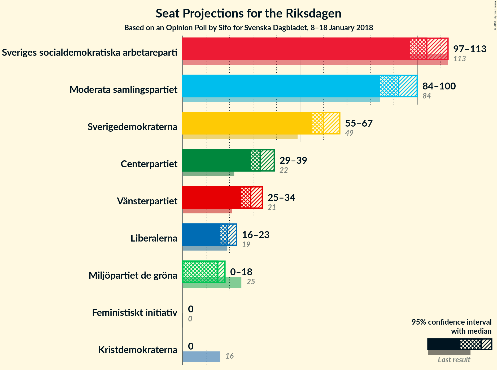

# Opinion Poll by Sifo for Svenska Dagbladet, 8–18 January 2018

<a href="#voting-intentions">Voting Intentions</a> | <a href="#seats">Seats</a> | <a href="#coalitions">Coalitions</a> | <a href="#technical-information">Technical Information</a>

## Voting Intentions

### Confidence Intervals

| Party | Last Result | Poll Result | 80% Confidence Interval | 90% Confidence Interval | 95% Confidence Interval | 99% Confidence Interval |
|:-----:|:-----------:|:-----------:|:-----------------------:|:-----------------------:|:-----------------------:|:-----------------------:|
| Sveriges socialdemokratiska arbetareparti | 31.0% | 27.7% | 26.5–29.0% |26.2–29.3% |25.9–29.6% |25.3–30.3% |
| Moderata samlingspartiet | 23.3% | 24.4% | 23.2–25.6% |22.9–25.9% |22.6–26.2% |22.1–26.8% |
| Sverigedemokraterna | 12.9% | 16.2% | 15.2–17.2% |14.9–17.5% |14.7–17.8% |14.2–18.3% |
| Centerpartiet | 6.1% | 8.8% | 8.0–9.6% |7.8–9.8% |7.7–10.1% |7.3–10.5% |
| Vänsterpartiet | 5.7% | 7.7% | 7.0–8.5% |6.8–8.7% |6.6–8.9% |6.3–9.3% |
| Liberalerna | 5.4% | 5.1% | 4.5–5.8% |4.4–5.9% |4.3–6.1% |4.0–6.4% |
| Miljöpartiet de gröna | 6.9% | 4.1% | 3.6–4.7% |3.5–4.9% |3.3–5.0% |3.1–5.3% |
| Kristdemokraterna | 4.6% | 2.9% | 2.5–3.4% |2.4–3.6% |2.3–3.7% |2.1–4.0% |
| Feministiskt initiativ | 3.1% | 2.1% | 1.8–2.5% |1.6–2.7% |1.6–2.8% |1.4–3.0% |

*Note:* The poll result column reflects the actual value used in the calculations. Published results may vary slightly, and in addition be rounded to fewer digits.

## Seats

### Confidence Intervals

| Party | Last Result | Median | 80% Confidence Interval | 90% Confidence Interval | 95% Confidence Interval | 99% Confidence Interval |
|:-----:|:-----------:|:------:|:-----------------------:|:-----------------------:|:-----------------------:|:-----------------------:|
| <a href="#sveriges-socialdemokratiska-arbetareparti">Sveriges socialdemokratiska arbetareparti</a> | 113 | 104 | 100–111 |98–113 |97–115 |95–117 |
| <a href="#moderata-samlingspartiet">Moderata samlingspartiet</a> | 84 | 89 | 85–97 |85–97 |84–100 |83–102 |
| <a href="#sverigedemokraterna">Sverigedemokraterna</a> | 49 | 61 | 57–63 |57–67 |56–68 |52–69 |
| <a href="#centerpartiet">Centerpartiet</a> | 22 | 32 | 30–36 |30–38 |29–40 |27–40 |
| <a href="#vänsterpartiet">Vänsterpartiet</a> | 21 | 28 | 26–32 |25–33 |25–33 |24–35 |
| <a href="#liberalerna">Liberalerna</a> | 19 | 20 | 17–23 |17–23 |16–23 |0–24 |
| <a href="#miljöpartiet-de-gröna">Miljöpartiet de gröna</a> | 25 | 16 | 0–18 |0–18 |0–19 |0–19 |
| <a href="#kristdemokraterna">Kristdemokraterna</a> | 16 | 0 | 0 |0 |0 |0 |
| <a href="#feministiskt-initiativ">Feministiskt initiativ</a> | 0 | 0 | 0 |0 |0 |0 |

### Sveriges socialdemokratiska arbetareparti

*For a full overview of the results for this party, see the [Sveriges socialdemokratiska arbetareparti](party-sverigessocialdemokratiskaarbetareparti.html) page.*

| Number of Seats | Probability | Accumulated | Special Marks |
|:---------------:|:-----------:|:-----------:|:-------------:|
| 92 | 0.1% | 100% |  |
| 93 | 0% | 99.9% |  |
| 94 | 0.1% | 99.9% |  |
| 95 | 0.3% | 99.8% |  |
| 96 | 0.2% | 99.5% |  |
| 97 | 4% | 99.3% |  |
| 98 | 0.4% | 95% |  |
| 99 | 2% | 95% |  |
| 100 | 4% | 93% |  |
| 101 | 10% | 89% |  |
| 102 | 0.6% | 79% |  |
| 103 | 26% | 78% |  |
| 104 | 12% | 52% | Median |
| 105 | 2% | 40% |  |
| 106 | 12% | 38% |  |
| 107 | 1.1% | 26% |  |
| 108 | 7% | 25% |  |
| 109 | 3% | 19% |  |
| 110 | 3% | 15% |  |
| 111 | 2% | 12% |  |
| 112 | 0.3% | 10% |  |
| 113 | 6% | 9% | Last Result |
| 114 | 0.6% | 3% |  |
| 115 | 1.3% | 3% |  |
| 116 | 0.8% | 1.3% |  |
| 117 | 0.3% | 0.5% |  |
| 118 | 0.2% | 0.2% |  |
| 119 | 0% | 0.1% |  |
| 120 | 0% | 0.1% |  |
| 121 | 0% | 0% |  |

### Moderata samlingspartiet

*For a full overview of the results for this party, see the [Moderata samlingspartiet](party-moderatasamlingspartiet.html) page.*

| Number of Seats | Probability | Accumulated | Special Marks |
|:---------------:|:-----------:|:-----------:|:-------------:|
| 80 | 0.1% | 100% |  |
| 81 | 0% | 99.9% |  |
| 82 | 0.1% | 99.9% |  |
| 83 | 0.9% | 99.8% |  |
| 84 | 3% | 98.9% | Last Result |
| 85 | 9% | 96% |  |
| 86 | 1.1% | 87% |  |
| 87 | 0.9% | 86% |  |
| 88 | 31% | 85% |  |
| 89 | 7% | 54% | Median |
| 90 | 3% | 47% |  |
| 91 | 6% | 44% |  |
| 92 | 3% | 38% |  |
| 93 | 8% | 35% |  |
| 94 | 3% | 27% |  |
| 95 | 3% | 24% |  |
| 96 | 7% | 21% |  |
| 97 | 9% | 13% |  |
| 98 | 0.6% | 4% |  |
| 99 | 0.4% | 4% |  |
| 100 | 2% | 3% |  |
| 101 | 1.0% | 2% |  |
| 102 | 0.5% | 0.7% |  |
| 103 | 0% | 0.2% |  |
| 104 | 0% | 0.2% |  |
| 105 | 0.1% | 0.1% |  |
| 106 | 0% | 0% |  |

### Sverigedemokraterna

*For a full overview of the results for this party, see the [Sverigedemokraterna](party-sverigedemokraterna.html) page.*

| Number of Seats | Probability | Accumulated | Special Marks |
|:---------------:|:-----------:|:-----------:|:-------------:|
| 49 | 0% | 100% | Last Result |
| 50 | 0% | 100% |  |
| 51 | 0% | 100% |  |
| 52 | 0.5% | 99.9% |  |
| 53 | 0.1% | 99.5% |  |
| 54 | 0.1% | 99.3% |  |
| 55 | 0.7% | 99.2% |  |
| 56 | 3% | 98.5% |  |
| 57 | 12% | 96% |  |
| 58 | 10% | 84% |  |
| 59 | 8% | 74% |  |
| 60 | 2% | 66% |  |
| 61 | 16% | 63% | Median |
| 62 | 13% | 47% |  |
| 63 | 24% | 34% |  |
| 64 | 2% | 9% |  |
| 65 | 0.2% | 7% |  |
| 66 | 0.9% | 7% |  |
| 67 | 4% | 6% |  |
| 68 | 2% | 3% |  |
| 69 | 0.8% | 1.0% |  |
| 70 | 0.1% | 0.2% |  |
| 71 | 0% | 0.2% |  |
| 72 | 0.1% | 0.1% |  |
| 73 | 0% | 0% |  |

### Centerpartiet

*For a full overview of the results for this party, see the [Centerpartiet](party-centerpartiet.html) page.*

| Number of Seats | Probability | Accumulated | Special Marks |
|:---------------:|:-----------:|:-----------:|:-------------:|
| 22 | 0% | 100% | Last Result |
| 23 | 0% | 100% |  |
| 24 | 0% | 100% |  |
| 25 | 0% | 100% |  |
| 26 | 0% | 100% |  |
| 27 | 0.6% | 99.9% |  |
| 28 | 0.5% | 99.3% |  |
| 29 | 2% | 98.9% |  |
| 30 | 26% | 96% |  |
| 31 | 5% | 70% |  |
| 32 | 22% | 66% | Median |
| 33 | 18% | 44% |  |
| 34 | 4% | 25% |  |
| 35 | 9% | 21% |  |
| 36 | 6% | 13% |  |
| 37 | 1.0% | 6% |  |
| 38 | 1.4% | 5% |  |
| 39 | 0.5% | 4% |  |
| 40 | 3% | 3% |  |
| 41 | 0% | 0.1% |  |
| 42 | 0% | 0% |  |

### Vänsterpartiet

*For a full overview of the results for this party, see the [Vänsterpartiet](party-vänsterpartiet.html) page.*

| Number of Seats | Probability | Accumulated | Special Marks |
|:---------------:|:-----------:|:-----------:|:-------------:|
| 21 | 0% | 100% | Last Result |
| 22 | 0% | 100% |  |
| 23 | 0.2% | 100% |  |
| 24 | 2% | 99.7% |  |
| 25 | 7% | 98% |  |
| 26 | 13% | 91% |  |
| 27 | 3% | 78% |  |
| 28 | 30% | 75% | Median |
| 29 | 5% | 44% |  |
| 30 | 17% | 39% |  |
| 31 | 11% | 23% |  |
| 32 | 5% | 12% |  |
| 33 | 5% | 7% |  |
| 34 | 1.0% | 2% |  |
| 35 | 0.4% | 0.6% |  |
| 36 | 0.2% | 0.2% |  |
| 37 | 0% | 0.1% |  |
| 38 | 0% | 0% |  |

### Liberalerna

*For a full overview of the results for this party, see the [Liberalerna](party-liberalerna.html) page.*

| Number of Seats | Probability | Accumulated | Special Marks |
|:---------------:|:-----------:|:-----------:|:-------------:|
| 0 | 0.5% | 100% |  |
| 1 | 0% | 99.5% |  |
| 2 | 0% | 99.5% |  |
| 3 | 0% | 99.5% |  |
| 4 | 0% | 99.5% |  |
| 5 | 0% | 99.5% |  |
| 6 | 0% | 99.5% |  |
| 7 | 0% | 99.5% |  |
| 8 | 0% | 99.5% |  |
| 9 | 0% | 99.5% |  |
| 10 | 0% | 99.5% |  |
| 11 | 0% | 99.5% |  |
| 12 | 0% | 99.5% |  |
| 13 | 0% | 99.5% |  |
| 14 | 0% | 99.5% |  |
| 15 | 0.8% | 99.5% |  |
| 16 | 2% | 98.7% |  |
| 17 | 8% | 97% |  |
| 18 | 10% | 89% |  |
| 19 | 29% | 79% | Last Result |
| 20 | 11% | 50% | Median |
| 21 | 13% | 40% |  |
| 22 | 14% | 26% |  |
| 23 | 11% | 12% |  |
| 24 | 0.4% | 0.8% |  |
| 25 | 0.2% | 0.4% |  |
| 26 | 0.1% | 0.1% |  |
| 27 | 0% | 0% |  |

### Miljöpartiet de gröna

*For a full overview of the results for this party, see the [Miljöpartiet de gröna](party-miljöpartietdegröna.html) page.*

| Number of Seats | Probability | Accumulated | Special Marks |
|:---------------:|:-----------:|:-----------:|:-------------:|
| 0 | 32% | 100% |  |
| 1 | 0% | 68% |  |
| 2 | 0% | 68% |  |
| 3 | 0% | 68% |  |
| 4 | 0% | 68% |  |
| 5 | 0% | 68% |  |
| 6 | 0% | 68% |  |
| 7 | 0% | 68% |  |
| 8 | 0% | 68% |  |
| 9 | 0% | 68% |  |
| 10 | 0% | 68% |  |
| 11 | 0% | 68% |  |
| 12 | 0% | 68% |  |
| 13 | 0% | 68% |  |
| 14 | 0% | 68% |  |
| 15 | 11% | 68% |  |
| 16 | 18% | 57% | Median |
| 17 | 6% | 38% |  |
| 18 | 29% | 32% |  |
| 19 | 3% | 4% |  |
| 20 | 0.1% | 0.2% |  |
| 21 | 0.1% | 0.1% |  |
| 22 | 0% | 0% |  |
| 23 | 0% | 0% |  |
| 24 | 0% | 0% |  |
| 25 | 0% | 0% | Last Result |

### Kristdemokraterna

*For a full overview of the results for this party, see the [Kristdemokraterna](party-kristdemokraterna.html) page.*

| Number of Seats | Probability | Accumulated | Special Marks |
|:---------------:|:-----------:|:-----------:|:-------------:|
| 0 | 99.7% | 100% | Median |
| 1 | 0% | 0.3% |  |
| 2 | 0% | 0.3% |  |
| 3 | 0% | 0.3% |  |
| 4 | 0% | 0.3% |  |
| 5 | 0% | 0.3% |  |
| 6 | 0% | 0.3% |  |
| 7 | 0% | 0.3% |  |
| 8 | 0% | 0.3% |  |
| 9 | 0% | 0.3% |  |
| 10 | 0% | 0.3% |  |
| 11 | 0% | 0.3% |  |
| 12 | 0% | 0.3% |  |
| 13 | 0% | 0.3% |  |
| 14 | 0% | 0.3% |  |
| 15 | 0.3% | 0.3% |  |
| 16 | 0% | 0% | Last Result |

### Feministiskt initiativ

*For a full overview of the results for this party, see the [Feministiskt initiativ](party-feministisktinitiativ.html) page.*

| Number of Seats | Probability | Accumulated | Special Marks |
|:---------------:|:-----------:|:-----------:|:-------------:|
| 0 | 100% | 100% | Last Result, Median |

## Coalitions

### Confidence Intervals

| Coalition | Last Result | Median | Majority? | 80% Confidence Interval | 90% Confidence Interval | 95% Confidence Interval | 99% Confidence Interval |
|:---------:|:-----------:|:------:|:---------:|:-----------------------:|:-----------------------:|:-----------------------:|:-----------------------:|
| Sveriges socialdemokratiska arbetareparti – Moderata samlingspartiet | 197 | 193 | 100% | 188–205 | 186–209 | 186–209 | 184–215 |
| Moderata samlingspartiet – Sverigedemokraterna | 133 | 151 | 0% | 147–160 | 143–160 | 142–163 | 141–166 |
| Sveriges socialdemokratiska arbetareparti – Vänsterpartiet – Miljöpartiet de gröna – Feministiskt initiativ | 159 | 145 | 0% | 138–152 | 135–155 | 133–155 | 130–155 |
| Sveriges socialdemokratiska arbetareparti – Vänsterpartiet – Miljöpartiet de gröna | 159 | 145 | 0% | 138–152 | 135–155 | 133–155 | 130–155 |
| Moderata samlingspartiet – Centerpartiet – Liberalerna – Kristdemokraterna | 141 | 143 | 0% | 137–150 | 137–152 | 136–153 | 133–159 |
| Moderata samlingspartiet – Centerpartiet – Liberalerna | 125 | 143 | 0% | 137–150 | 137–152 | 136–152 | 133–159 |
| Sveriges socialdemokratiska arbetareparti – Vänsterpartiet | 134 | 131 | 0% | 128–140 | 128–143 | 127–144 | 123–148 |
| Moderata samlingspartiet – Centerpartiet – Kristdemokraterna | 122 | 122 | 0% | 118–131 | 118–132 | 116–133 | 115–139 |
| Moderata samlingspartiet – Centerpartiet | 106 | 121 | 0% | 118–130 | 118–132 | 116–133 | 115–138 |
| Sveriges socialdemokratiska arbetareparti – Miljöpartiet de gröna | 138 | 119 | 0% | 106–122 | 105–123 | 103–125 | 100–125 |

### Sveriges socialdemokratiska arbetareparti – Moderata samlingspartiet

| Number of Seats | Probability | Accumulated | Special Marks |
|:---------------:|:-----------:|:-----------:|:-------------:|
| 180 | 0% | 100% |  |
| 181 | 0% | 99.9% |  |
| 182 | 0.1% | 99.9% |  |
| 183 | 0.1% | 99.8% |  |
| 184 | 0.3% | 99.7% |  |
| 185 | 0.4% | 99.4% |  |
| 186 | 7% | 99.0% |  |
| 187 | 1.1% | 92% |  |
| 188 | 4% | 91% |  |
| 189 | 0.9% | 87% |  |
| 190 | 3% | 86% |  |
| 191 | 20% | 82% |  |
| 192 | 10% | 62% |  |
| 193 | 3% | 52% | Median |
| 194 | 4% | 49% |  |
| 195 | 1.2% | 45% |  |
| 196 | 6% | 43% |  |
| 197 | 6% | 38% | Last Result |
| 198 | 0.8% | 32% |  |
| 199 | 3% | 31% |  |
| 200 | 2% | 28% |  |
| 201 | 0.5% | 26% |  |
| 202 | 9% | 26% |  |
| 203 | 1.1% | 17% |  |
| 204 | 0.5% | 16% |  |
| 205 | 5% | 15% |  |
| 206 | 0.5% | 10% |  |
| 207 | 0.9% | 9% |  |
| 208 | 4% | 9% |  |
| 209 | 4% | 5% |  |
| 210 | 0.6% | 1.4% |  |
| 211 | 0.1% | 0.8% |  |
| 212 | 0% | 0.7% |  |
| 213 | 0% | 0.7% |  |
| 214 | 0% | 0.7% |  |
| 215 | 0.6% | 0.6% |  |
| 216 | 0% | 0% |  |

### Moderata samlingspartiet – Sverigedemokraterna

| Number of Seats | Probability | Accumulated | Special Marks |
|:---------------:|:-----------:|:-----------:|:-------------:|
| 133 | 0% | 100% | Last Result |
| 134 | 0% | 100% |  |
| 135 | 0% | 100% |  |
| 136 | 0% | 100% |  |
| 137 | 0% | 100% |  |
| 138 | 0.1% | 100% |  |
| 139 | 0% | 99.8% |  |
| 140 | 0.2% | 99.8% |  |
| 141 | 2% | 99.6% |  |
| 142 | 3% | 98% |  |
| 143 | 0.2% | 95% |  |
| 144 | 0.1% | 95% |  |
| 145 | 3% | 95% |  |
| 146 | 0.7% | 91% |  |
| 147 | 9% | 91% |  |
| 148 | 2% | 82% |  |
| 149 | 15% | 80% |  |
| 150 | 4% | 65% | Median |
| 151 | 20% | 60% |  |
| 152 | 8% | 40% |  |
| 153 | 5% | 32% |  |
| 154 | 0.6% | 27% |  |
| 155 | 5% | 26% |  |
| 156 | 4% | 21% |  |
| 157 | 4% | 17% |  |
| 158 | 1.4% | 13% |  |
| 159 | 1.1% | 11% |  |
| 160 | 6% | 10% |  |
| 161 | 2% | 5% |  |
| 162 | 0.2% | 3% |  |
| 163 | 0.8% | 3% |  |
| 164 | 1.3% | 2% |  |
| 165 | 0.3% | 0.8% |  |
| 166 | 0% | 0.5% |  |
| 167 | 0% | 0.5% |  |
| 168 | 0.4% | 0.5% |  |
| 169 | 0% | 0.1% |  |
| 170 | 0% | 0% |  |

### Sveriges socialdemokratiska arbetareparti – Vänsterpartiet – Miljöpartiet de gröna – Feministiskt initiativ

| Number of Seats | Probability | Accumulated | Special Marks |
|:---------------:|:-----------:|:-----------:|:-------------:|
| 127 | 0.2% | 100% |  |
| 128 | 0.1% | 99.8% |  |
| 129 | 0.1% | 99.7% |  |
| 130 | 0.2% | 99.6% |  |
| 131 | 0.5% | 99.4% |  |
| 132 | 1.1% | 98.9% |  |
| 133 | 0.8% | 98% |  |
| 134 | 2% | 97% |  |
| 135 | 0.9% | 95% |  |
| 136 | 0.4% | 94% |  |
| 137 | 2% | 94% |  |
| 138 | 8% | 92% |  |
| 139 | 3% | 84% |  |
| 140 | 6% | 81% |  |
| 141 | 2% | 75% |  |
| 142 | 1.2% | 73% |  |
| 143 | 4% | 72% |  |
| 144 | 9% | 68% |  |
| 145 | 11% | 59% |  |
| 146 | 3% | 48% |  |
| 147 | 10% | 45% |  |
| 148 | 5% | 35% | Median |
| 149 | 19% | 31% |  |
| 150 | 1.1% | 12% |  |
| 151 | 0.2% | 11% |  |
| 152 | 0.8% | 10% |  |
| 153 | 3% | 10% |  |
| 154 | 0.2% | 6% |  |
| 155 | 6% | 6% |  |
| 156 | 0.1% | 0.3% |  |
| 157 | 0% | 0.2% |  |
| 158 | 0.1% | 0.2% |  |
| 159 | 0% | 0.1% | Last Result |
| 160 | 0% | 0.1% |  |
| 161 | 0.1% | 0.1% |  |
| 162 | 0% | 0% |  |

### Sveriges socialdemokratiska arbetareparti – Vänsterpartiet – Miljöpartiet de gröna

| Number of Seats | Probability | Accumulated | Special Marks |
|:---------------:|:-----------:|:-----------:|:-------------:|
| 127 | 0.2% | 100% |  |
| 128 | 0.1% | 99.8% |  |
| 129 | 0.1% | 99.7% |  |
| 130 | 0.2% | 99.6% |  |
| 131 | 0.5% | 99.4% |  |
| 132 | 1.1% | 98.9% |  |
| 133 | 0.8% | 98% |  |
| 134 | 2% | 97% |  |
| 135 | 0.9% | 95% |  |
| 136 | 0.4% | 94% |  |
| 137 | 2% | 94% |  |
| 138 | 8% | 92% |  |
| 139 | 3% | 84% |  |
| 140 | 6% | 81% |  |
| 141 | 2% | 75% |  |
| 142 | 1.2% | 73% |  |
| 143 | 4% | 72% |  |
| 144 | 9% | 68% |  |
| 145 | 11% | 59% |  |
| 146 | 3% | 48% |  |
| 147 | 10% | 45% |  |
| 148 | 5% | 35% | Median |
| 149 | 19% | 31% |  |
| 150 | 1.1% | 12% |  |
| 151 | 0.2% | 11% |  |
| 152 | 0.8% | 10% |  |
| 153 | 3% | 10% |  |
| 154 | 0.2% | 6% |  |
| 155 | 6% | 6% |  |
| 156 | 0.1% | 0.3% |  |
| 157 | 0% | 0.2% |  |
| 158 | 0.1% | 0.2% |  |
| 159 | 0% | 0.1% | Last Result |
| 160 | 0% | 0.1% |  |
| 161 | 0.1% | 0.1% |  |
| 162 | 0% | 0% |  |

### Moderata samlingspartiet – Centerpartiet – Liberalerna – Kristdemokraterna

| Number of Seats | Probability | Accumulated | Special Marks |
|:---------------:|:-----------:|:-----------:|:-------------:|
| 129 | 0% | 100% |  |
| 130 | 0% | 99.9% |  |
| 131 | 0.1% | 99.9% |  |
| 132 | 0% | 99.8% |  |
| 133 | 0.9% | 99.8% |  |
| 134 | 0.2% | 98.8% |  |
| 135 | 0.5% | 98.7% |  |
| 136 | 3% | 98% |  |
| 137 | 21% | 96% |  |
| 138 | 3% | 75% |  |
| 139 | 1.2% | 72% |  |
| 140 | 13% | 71% |  |
| 141 | 2% | 58% | Last Result, Median |
| 142 | 3% | 55% |  |
| 143 | 9% | 52% |  |
| 144 | 4% | 43% |  |
| 145 | 2% | 40% |  |
| 146 | 9% | 38% |  |
| 147 | 2% | 29% |  |
| 148 | 8% | 27% |  |
| 149 | 7% | 20% |  |
| 150 | 5% | 13% |  |
| 151 | 0.8% | 8% |  |
| 152 | 5% | 7% |  |
| 153 | 0.6% | 3% |  |
| 154 | 1.0% | 2% |  |
| 155 | 0% | 1.1% |  |
| 156 | 0.2% | 1.0% |  |
| 157 | 0.1% | 0.8% |  |
| 158 | 0.1% | 0.8% |  |
| 159 | 0.4% | 0.6% |  |
| 160 | 0% | 0.2% |  |
| 161 | 0.1% | 0.2% |  |
| 162 | 0.1% | 0.1% |  |
| 163 | 0% | 0% |  |

### Moderata samlingspartiet – Centerpartiet – Liberalerna

| Number of Seats | Probability | Accumulated | Special Marks |
|:---------------:|:-----------:|:-----------:|:-------------:|
| 125 | 0% | 100% | Last Result |
| 126 | 0% | 100% |  |
| 127 | 0% | 100% |  |
| 128 | 0% | 100% |  |
| 129 | 0% | 100% |  |
| 130 | 0% | 99.9% |  |
| 131 | 0.1% | 99.9% |  |
| 132 | 0% | 99.8% |  |
| 133 | 0.9% | 99.8% |  |
| 134 | 0.2% | 98.8% |  |
| 135 | 0.5% | 98.7% |  |
| 136 | 3% | 98% |  |
| 137 | 21% | 96% |  |
| 138 | 3% | 75% |  |
| 139 | 1.2% | 72% |  |
| 140 | 13% | 71% |  |
| 141 | 2% | 58% | Median |
| 142 | 3% | 55% |  |
| 143 | 9% | 52% |  |
| 144 | 4% | 43% |  |
| 145 | 2% | 39% |  |
| 146 | 9% | 38% |  |
| 147 | 2% | 29% |  |
| 148 | 8% | 27% |  |
| 149 | 7% | 20% |  |
| 150 | 5% | 13% |  |
| 151 | 0.7% | 8% |  |
| 152 | 5% | 7% |  |
| 153 | 0.4% | 2% |  |
| 154 | 1.0% | 2% |  |
| 155 | 0% | 0.9% |  |
| 156 | 0.2% | 0.9% |  |
| 157 | 0.1% | 0.7% |  |
| 158 | 0.1% | 0.7% |  |
| 159 | 0.4% | 0.6% |  |
| 160 | 0% | 0.2% |  |
| 161 | 0.1% | 0.2% |  |
| 162 | 0% | 0% |  |

### Sveriges socialdemokratiska arbetareparti – Vänsterpartiet

| Number of Seats | Probability | Accumulated | Special Marks |
|:---------------:|:-----------:|:-----------:|:-------------:|
| 119 | 0% | 100% |  |
| 120 | 0% | 99.9% |  |
| 121 | 0% | 99.9% |  |
| 122 | 0.2% | 99.9% |  |
| 123 | 0.5% | 99.7% |  |
| 124 | 0.2% | 99.1% |  |
| 125 | 0.8% | 98.9% |  |
| 126 | 0.5% | 98% |  |
| 127 | 0.3% | 98% |  |
| 128 | 11% | 97% |  |
| 129 | 9% | 87% |  |
| 130 | 13% | 77% |  |
| 131 | 20% | 65% |  |
| 132 | 3% | 45% | Median |
| 133 | 1.0% | 42% |  |
| 134 | 3% | 41% | Last Result |
| 135 | 1.2% | 38% |  |
| 136 | 4% | 37% |  |
| 137 | 2% | 33% |  |
| 138 | 8% | 31% |  |
| 139 | 9% | 23% |  |
| 140 | 6% | 14% |  |
| 141 | 1.3% | 9% |  |
| 142 | 0.8% | 7% |  |
| 143 | 4% | 6% |  |
| 144 | 1.3% | 3% |  |
| 145 | 0% | 1.4% |  |
| 146 | 0.3% | 1.4% |  |
| 147 | 0.1% | 1.1% |  |
| 148 | 0.8% | 1.0% |  |
| 149 | 0.2% | 0.2% |  |
| 150 | 0% | 0% |  |

### Moderata samlingspartiet – Centerpartiet – Kristdemokraterna

| Number of Seats | Probability | Accumulated | Special Marks |
|:---------------:|:-----------:|:-----------:|:-------------:|
| 113 | 0% | 100% |  |
| 114 | 0.1% | 99.9% |  |
| 115 | 0.6% | 99.9% |  |
| 116 | 3% | 99.3% |  |
| 117 | 0.7% | 96% |  |
| 118 | 30% | 96% |  |
| 119 | 3% | 66% |  |
| 120 | 11% | 63% |  |
| 121 | 2% | 52% | Median |
| 122 | 4% | 50% | Last Result |
| 123 | 6% | 46% |  |
| 124 | 0.8% | 41% |  |
| 125 | 3% | 40% |  |
| 126 | 2% | 37% |  |
| 127 | 0.7% | 35% |  |
| 128 | 7% | 34% |  |
| 129 | 12% | 27% |  |
| 130 | 5% | 15% |  |
| 131 | 1.3% | 10% |  |
| 132 | 6% | 9% |  |
| 133 | 1.1% | 3% |  |
| 134 | 0.5% | 2% |  |
| 135 | 0.4% | 1.5% |  |
| 136 | 0.3% | 1.0% |  |
| 137 | 0.1% | 0.8% |  |
| 138 | 0.1% | 0.7% |  |
| 139 | 0.3% | 0.6% |  |
| 140 | 0% | 0.2% |  |
| 141 | 0.1% | 0.2% |  |
| 142 | 0% | 0.1% |  |
| 143 | 0% | 0% |  |

### Moderata samlingspartiet – Centerpartiet

| Number of Seats | Probability | Accumulated | Special Marks |
|:---------------:|:-----------:|:-----------:|:-------------:|
| 106 | 0% | 100% | Last Result |
| 107 | 0% | 100% |  |
| 108 | 0% | 100% |  |
| 109 | 0% | 100% |  |
| 110 | 0% | 100% |  |
| 111 | 0% | 100% |  |
| 112 | 0% | 100% |  |
| 113 | 0% | 100% |  |
| 114 | 0.1% | 99.9% |  |
| 115 | 0.6% | 99.8% |  |
| 116 | 3% | 99.2% |  |
| 117 | 0.7% | 96% |  |
| 118 | 30% | 96% |  |
| 119 | 4% | 66% |  |
| 120 | 11% | 63% |  |
| 121 | 2% | 52% | Median |
| 122 | 4% | 50% |  |
| 123 | 6% | 46% |  |
| 124 | 0.8% | 40% |  |
| 125 | 3% | 40% |  |
| 126 | 2% | 36% |  |
| 127 | 0.7% | 35% |  |
| 128 | 7% | 34% |  |
| 129 | 12% | 27% |  |
| 130 | 5% | 15% |  |
| 131 | 1.3% | 10% |  |
| 132 | 6% | 9% |  |
| 133 | 1.1% | 3% |  |
| 134 | 0.4% | 2% |  |
| 135 | 0.4% | 1.3% |  |
| 136 | 0.3% | 0.9% |  |
| 137 | 0% | 0.6% |  |
| 138 | 0.1% | 0.6% |  |
| 139 | 0.3% | 0.5% |  |
| 140 | 0% | 0.1% |  |
| 141 | 0% | 0.1% |  |
| 142 | 0% | 0.1% |  |
| 143 | 0% | 0% |  |

### Sveriges socialdemokratiska arbetareparti – Miljöpartiet de gröna

| Number of Seats | Probability | Accumulated | Special Marks |
|:---------------:|:-----------:|:-----------:|:-------------:|
| 95 | 0.1% | 100% |  |
| 96 | 0% | 99.9% |  |
| 97 | 0% | 99.9% |  |
| 98 | 0.2% | 99.9% |  |
| 99 | 0% | 99.7% |  |
| 100 | 0.8% | 99.7% |  |
| 101 | 0.9% | 98.9% |  |
| 102 | 0.2% | 98% |  |
| 103 | 2% | 98% |  |
| 104 | 0.3% | 96% |  |
| 105 | 1.0% | 96% |  |
| 106 | 5% | 95% |  |
| 107 | 0.7% | 89% |  |
| 108 | 6% | 89% |  |
| 109 | 0.2% | 83% |  |
| 110 | 3% | 82% |  |
| 111 | 2% | 79% |  |
| 112 | 0.3% | 77% |  |
| 113 | 7% | 76% |  |
| 114 | 1.0% | 69% |  |
| 115 | 2% | 68% |  |
| 116 | 7% | 66% |  |
| 117 | 1.3% | 59% |  |
| 118 | 3% | 58% |  |
| 119 | 22% | 55% |  |
| 120 | 2% | 34% | Median |
| 121 | 19% | 32% |  |
| 122 | 6% | 13% |  |
| 123 | 2% | 7% |  |
| 124 | 0.7% | 4% |  |
| 125 | 3% | 4% |  |
| 126 | 0.1% | 0.4% |  |
| 127 | 0% | 0.3% |  |
| 128 | 0% | 0.2% |  |
| 129 | 0.1% | 0.2% |  |
| 130 | 0% | 0.1% |  |
| 131 | 0% | 0.1% |  |
| 132 | 0.1% | 0.1% |  |
| 133 | 0% | 0.1% |  |
| 134 | 0% | 0% |  |
| 135 | 0% | 0% |  |
| 136 | 0% | 0% |  |
| 137 | 0% | 0% |  |
| 138 | 0% | 0% | Last Result |

## Technical Information

### Opinion Poll

+ **Polling firm:** Sifo
+ **Commissioner(s):** Svenska Dagbladet
+ **Fieldwork period:** 8–18 January 2018

### Calculations

+ **Sample size:** 2196
+ **Simulations done:** 131,072
+ **Error estimate:** 1.05%

