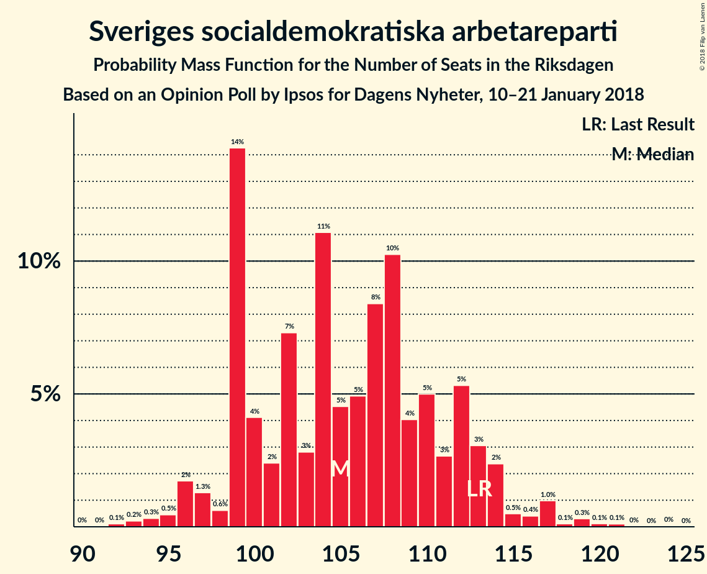
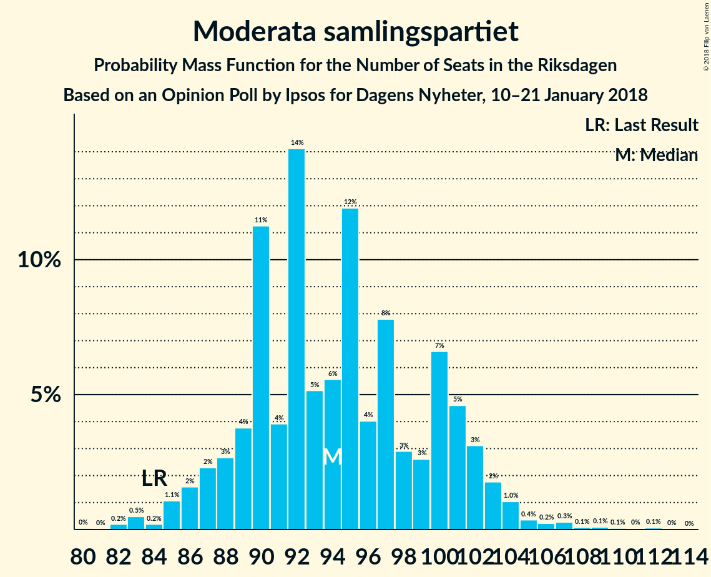

# Opinion Poll by Ipsos for Dagens Nyheter, 10–21 January 2018

<a href="#voting-intentions">Voting Intentions</a> | <a href="#seats">Seats</a> | <a href="#coalitions">Coalitions</a> | <a href="#technical-information">Technical Information</a>

## Voting Intentions

### Confidence Intervals

| Party | Last Result | Poll Result | 80% Confidence Interval | 90% Confidence Interval | 95% Confidence Interval | 99% Confidence Interval |
|:-----:|:-----------:|:-----------:|:-----------------------:|:-----------------------:|:-----------------------:|:-----------------------:|
| Sveriges socialdemokratiska arbetareparti | 31.0% | 28.0% | 26.6–29.4% |26.2–29.9% |25.9–30.2% |25.2–30.9% |
| Moderata samlingspartiet | 23.3% | 25.0% | 23.7–26.4% |23.3–26.8% |23.0–27.2% |22.3–27.8% |
| Sverigedemokraterna | 12.9% | 16.0% | 14.9–17.2% |14.5–17.5% |14.3–17.8% |13.8–18.4% |
| Centerpartiet | 6.1% | 9.0% | 8.2–10.0% |7.9–10.3% |7.7–10.5% |7.3–11.0% |
| Vänsterpartiet | 5.7% | 7.0% | 6.3–7.9% |6.1–8.1% |5.9–8.4% |5.5–8.8% |
| Liberalerna | 5.4% | 5.0% | 4.4–5.8% |4.2–6.0% |4.0–6.2% |3.8–6.6% |
| Miljöpartiet de gröna | 6.9% | 4.0% | 3.5–4.7% |3.3–4.9% |3.2–5.1% |2.9–5.5% |
| Kristdemokraterna | 4.6% | 3.0% | 2.5–3.6% |2.4–3.8% |2.3–3.9% |2.1–4.3% |
| Feministiskt initiativ | 3.1% | 2.0% | 1.6–2.5% |1.5–2.7% |1.4–2.8% |1.3–3.1% |

*Note:* The poll result column reflects the actual value used in the calculations. Published results may vary slightly, and in addition be rounded to fewer digits.

## Seats

### Confidence Intervals

| Party | Last Result | Median | 80% Confidence Interval | 90% Confidence Interval | 95% Confidence Interval | 99% Confidence Interval |
|:-----:|:-----------:|:------:|:-----------------------:|:-----------------------:|:-----------------------:|:-----------------------:|
| <a href="#sveriges-socialdemokratiska-arbetareparti">Sveriges socialdemokratiska arbetareparti</a> | 113 | 105 | 99–112 |99–114 |96–115 |94–119 |
| <a href="#moderata-samlingspartiet">Moderata samlingspartiet</a> | 84 | 94 | 89–101 |87–102 |86–103 |83–107 |
| <a href="#sverigedemokraterna">Sverigedemokraterna</a> | 49 | 60 | 56–65 |54–66 |54–68 |52–70 |
| <a href="#centerpartiet">Centerpartiet</a> | 22 | 35 | 31–38 |30–40 |29–41 |27–41 |
| <a href="#vänsterpartiet">Vänsterpartiet</a> | 21 | 27 | 23–29 |22–30 |22–32 |21–34 |
| <a href="#liberalerna">Liberalerna</a> | 19 | 19 | 16–22 |16–23 |15–23 |0–25 |
| <a href="#miljöpartiet-de-gröna">Miljöpartiet de gröna</a> | 25 | 15 | 0–17 |0–18 |0–19 |0–20 |
| <a href="#kristdemokraterna">Kristdemokraterna</a> | 16 | 0 | 0 |0 |0 |0–16 |
| <a href="#feministiskt-initiativ">Feministiskt initiativ</a> | 0 | 0 | 0 |0 |0 |0 |

### Sveriges socialdemokratiska arbetareparti

*For a full overview of the results for this party, see the [Sveriges socialdemokratiska arbetareparti](party-sverigessocialdemokratiskaarbetareparti.html) page.*

| Number of Seats | Probability | Accumulated | Special Marks |
|:---------------:|:-----------:|:-----------:|:-------------:|
| 91 | 0% | 100% |  |
| 92 | 0.1% | 99.9% |  |
| 93 | 0.2% | 99.8% |  |
| 94 | 0.3% | 99.6% |  |
| 95 | 0.5% | 99.3% |  |
| 96 | 2% | 98.8% |  |
| 97 | 1.3% | 97% |  |
| 98 | 0.6% | 96% |  |
| 99 | 14% | 95% |  |
| 100 | 4% | 81% |  |
| 101 | 2% | 77% |  |
| 102 | 7% | 74% |  |
| 103 | 3% | 67% |  |
| 104 | 11% | 64% |  |
| 105 | 5% | 53% | Median |
| 106 | 5% | 49% |  |
| 107 | 8% | 44% |  |
| 108 | 10% | 35% |  |
| 109 | 4% | 25% |  |
| 110 | 5% | 21% |  |
| 111 | 3% | 16% |  |
| 112 | 5% | 13% |  |
| 113 | 3% | 8% | Last Result |
| 114 | 2% | 5% |  |
| 115 | 0.5% | 3% |  |
| 116 | 0.4% | 2% |  |
| 117 | 1.0% | 2% |  |
| 118 | 0.1% | 0.7% |  |
| 119 | 0.3% | 0.6% |  |
| 120 | 0.1% | 0.3% |  |
| 121 | 0.1% | 0.2% |  |
| 122 | 0% | 0.1% |  |
| 123 | 0% | 0.1% |  |
| 124 | 0% | 0.1% |  |
| 125 | 0% | 0% |  |

### Moderata samlingspartiet

*For a full overview of the results for this party, see the [Moderata samlingspartiet](party-moderatasamlingspartiet.html) page.*

| Number of Seats | Probability | Accumulated | Special Marks |
|:---------------:|:-----------:|:-----------:|:-------------:|
| 80 | 0% | 100% |  |
| 81 | 0% | 99.9% |  |
| 82 | 0.2% | 99.9% |  |
| 83 | 0.5% | 99.7% |  |
| 84 | 0.2% | 99.2% | Last Result |
| 85 | 1.1% | 99.0% |  |
| 86 | 2% | 98% |  |
| 87 | 2% | 96% |  |
| 88 | 3% | 94% |  |
| 89 | 4% | 91% |  |
| 90 | 11% | 88% |  |
| 91 | 4% | 76% |  |
| 92 | 14% | 72% |  |
| 93 | 5% | 58% |  |
| 94 | 6% | 53% | Median |
| 95 | 12% | 48% |  |
| 96 | 4% | 36% |  |
| 97 | 8% | 32% |  |
| 98 | 3% | 24% |  |
| 99 | 3% | 21% |  |
| 100 | 7% | 18% |  |
| 101 | 5% | 12% |  |
| 102 | 3% | 7% |  |
| 103 | 2% | 4% |  |
| 104 | 1.0% | 2% |  |
| 105 | 0.4% | 1.2% |  |
| 106 | 0.2% | 0.9% |  |
| 107 | 0.3% | 0.6% |  |
| 108 | 0.1% | 0.4% |  |
| 109 | 0.1% | 0.3% |  |
| 110 | 0.1% | 0.2% |  |
| 111 | 0% | 0.1% |  |
| 112 | 0.1% | 0.1% |  |
| 113 | 0% | 0% |  |

### Sverigedemokraterna

*For a full overview of the results for this party, see the [Sverigedemokraterna](party-sverigedemokraterna.html) page.*

| Number of Seats | Probability | Accumulated | Special Marks |
|:---------------:|:-----------:|:-----------:|:-------------:|
| 49 | 0.1% | 100% | Last Result |
| 50 | 0.1% | 99.9% |  |
| 51 | 0.3% | 99.8% |  |
| 52 | 0.6% | 99.6% |  |
| 53 | 0.8% | 99.0% |  |
| 54 | 5% | 98% |  |
| 55 | 3% | 93% |  |
| 56 | 5% | 91% |  |
| 57 | 6% | 86% |  |
| 58 | 6% | 79% |  |
| 59 | 10% | 73% |  |
| 60 | 19% | 63% | Median |
| 61 | 12% | 45% |  |
| 62 | 9% | 33% |  |
| 63 | 7% | 24% |  |
| 64 | 3% | 17% |  |
| 65 | 6% | 15% |  |
| 66 | 4% | 9% |  |
| 67 | 2% | 4% |  |
| 68 | 2% | 3% |  |
| 69 | 0.4% | 1.2% |  |
| 70 | 0.5% | 0.8% |  |
| 71 | 0.1% | 0.3% |  |
| 72 | 0.1% | 0.2% |  |
| 73 | 0.1% | 0.1% |  |
| 74 | 0% | 0% |  |

### Centerpartiet

*For a full overview of the results for this party, see the [Centerpartiet](party-centerpartiet.html) page.*

| Number of Seats | Probability | Accumulated | Special Marks |
|:---------------:|:-----------:|:-----------:|:-------------:|
| 22 | 0% | 100% | Last Result |
| 23 | 0% | 100% |  |
| 24 | 0% | 100% |  |
| 25 | 0% | 100% |  |
| 26 | 0.1% | 100% |  |
| 27 | 0.5% | 99.9% |  |
| 28 | 0.7% | 99.3% |  |
| 29 | 3% | 98.7% |  |
| 30 | 6% | 96% |  |
| 31 | 5% | 90% |  |
| 32 | 8% | 85% |  |
| 33 | 10% | 77% |  |
| 34 | 15% | 67% |  |
| 35 | 11% | 53% | Median |
| 36 | 27% | 42% |  |
| 37 | 5% | 15% |  |
| 38 | 3% | 10% |  |
| 39 | 2% | 7% |  |
| 40 | 3% | 6% |  |
| 41 | 2% | 3% |  |
| 42 | 0.2% | 0.4% |  |
| 43 | 0.1% | 0.2% |  |
| 44 | 0% | 0.1% |  |
| 45 | 0.1% | 0.1% |  |
| 46 | 0% | 0% |  |

### Vänsterpartiet

*For a full overview of the results for this party, see the [Vänsterpartiet](party-vänsterpartiet.html) page.*

| Number of Seats | Probability | Accumulated | Special Marks |
|:---------------:|:-----------:|:-----------:|:-------------:|
| 19 | 0% | 100% |  |
| 20 | 0.2% | 99.9% |  |
| 21 | 0.9% | 99.8% | Last Result |
| 22 | 4% | 98.8% |  |
| 23 | 11% | 95% |  |
| 24 | 7% | 84% |  |
| 25 | 10% | 77% |  |
| 26 | 15% | 68% |  |
| 27 | 20% | 53% | Median |
| 28 | 14% | 32% |  |
| 29 | 10% | 19% |  |
| 30 | 4% | 9% |  |
| 31 | 2% | 5% |  |
| 32 | 2% | 3% |  |
| 33 | 0.4% | 1.1% |  |
| 34 | 0.4% | 0.6% |  |
| 35 | 0.1% | 0.2% |  |
| 36 | 0.1% | 0.1% |  |
| 37 | 0% | 0% |  |

### Liberalerna

*For a full overview of the results for this party, see the [Liberalerna](party-liberalerna.html) page.*

| Number of Seats | Probability | Accumulated | Special Marks |
|:---------------:|:-----------:|:-----------:|:-------------:|
| 0 | 2% | 100% |  |
| 1 | 0% | 98% |  |
| 2 | 0% | 98% |  |
| 3 | 0% | 98% |  |
| 4 | 0% | 98% |  |
| 5 | 0% | 98% |  |
| 6 | 0% | 98% |  |
| 7 | 0% | 98% |  |
| 8 | 0% | 98% |  |
| 9 | 0% | 98% |  |
| 10 | 0% | 98% |  |
| 11 | 0% | 98% |  |
| 12 | 0% | 98% |  |
| 13 | 0% | 98% |  |
| 14 | 0% | 98% |  |
| 15 | 1.4% | 98% |  |
| 16 | 7% | 97% |  |
| 17 | 20% | 89% |  |
| 18 | 8% | 70% |  |
| 19 | 29% | 61% | Last Result, Median |
| 20 | 8% | 32% |  |
| 21 | 12% | 24% |  |
| 22 | 5% | 12% |  |
| 23 | 6% | 7% |  |
| 24 | 1.1% | 2% |  |
| 25 | 0.4% | 0.7% |  |
| 26 | 0.2% | 0.3% |  |
| 27 | 0.1% | 0.1% |  |
| 28 | 0% | 0% |  |

### Miljöpartiet de gröna

*For a full overview of the results for this party, see the [Miljöpartiet de gröna](party-miljöpartietdegröna.html) page.*

| Number of Seats | Probability | Accumulated | Special Marks |
|:---------------:|:-----------:|:-----------:|:-------------:|
| 0 | 45% | 100% |  |
| 1 | 0% | 55% |  |
| 2 | 0% | 55% |  |
| 3 | 0% | 55% |  |
| 4 | 0% | 55% |  |
| 5 | 0% | 55% |  |
| 6 | 0% | 55% |  |
| 7 | 0% | 55% |  |
| 8 | 0% | 55% |  |
| 9 | 0% | 55% |  |
| 10 | 0% | 55% |  |
| 11 | 0% | 55% |  |
| 12 | 0% | 55% |  |
| 13 | 0% | 55% |  |
| 14 | 0.1% | 55% |  |
| 15 | 9% | 55% | Median |
| 16 | 18% | 46% |  |
| 17 | 19% | 28% |  |
| 18 | 6% | 9% |  |
| 19 | 2% | 3% |  |
| 20 | 0.6% | 0.9% |  |
| 21 | 0.2% | 0.2% |  |
| 22 | 0.1% | 0.1% |  |
| 23 | 0% | 0% |  |
| 24 | 0% | 0% |  |
| 25 | 0% | 0% | Last Result |

### Kristdemokraterna

*For a full overview of the results for this party, see the [Kristdemokraterna](party-kristdemokraterna.html) page.*

| Number of Seats | Probability | Accumulated | Special Marks |
|:---------------:|:-----------:|:-----------:|:-------------:|
| 0 | 98.6% | 100% | Median |
| 1 | 0% | 1.4% |  |
| 2 | 0% | 1.4% |  |
| 3 | 0% | 1.4% |  |
| 4 | 0% | 1.4% |  |
| 5 | 0% | 1.4% |  |
| 6 | 0% | 1.4% |  |
| 7 | 0% | 1.4% |  |
| 8 | 0% | 1.4% |  |
| 9 | 0% | 1.4% |  |
| 10 | 0% | 1.4% |  |
| 11 | 0% | 1.4% |  |
| 12 | 0% | 1.4% |  |
| 13 | 0% | 1.4% |  |
| 14 | 0.1% | 1.4% |  |
| 15 | 0.7% | 1.3% |  |
| 16 | 0.4% | 0.5% | Last Result |
| 17 | 0.1% | 0.1% |  |
| 18 | 0% | 0% |  |

### Feministiskt initiativ

*For a full overview of the results for this party, see the [Feministiskt initiativ](party-feministisktinitiativ.html) page.*

| Number of Seats | Probability | Accumulated | Special Marks |
|:---------------:|:-----------:|:-----------:|:-------------:|
| 0 | 100% | 100% | Last Result, Median |

## Coalitions

### Confidence Intervals

| Coalition | Last Result | Median | Majority? | 80% Confidence Interval | 90% Confidence Interval | 95% Confidence Interval | 99% Confidence Interval |
|:---------:|:-----------:|:------:|:---------:|:-----------------------:|:-----------------------:|:-----------------------:|:-----------------------:|
| Sveriges socialdemokratiska arbetareparti – Moderata samlingspartiet – Centerpartiet | 219 | 234 | 100% | 225–243 | 223–245 | 221–248 | 218–253 |
| Sveriges socialdemokratiska arbetareparti – Moderata samlingspartiet | 197 | 199 | 100% | 191–208 | 190–210 | 189–213 | 184–219 |
| Moderata samlingspartiet – Sverigedemokraterna – Kristdemokraterna | 149 | 154 | 0.1% | 148–163 | 146–167 | 145–167 | 141–171 |
| Moderata samlingspartiet – Sverigedemokraterna | 133 | 154 | 0.1% | 148–163 | 146–167 | 144–167 | 140–170 |
| Moderata samlingspartiet – Centerpartiet – Liberalerna – Kristdemokraterna | 141 | 147 | 0% | 140–156 | 138–157 | 136–158 | 134–162 |
| Moderata samlingspartiet – Centerpartiet – Liberalerna | 125 | 147 | 0% | 140–156 | 138–157 | 136–158 | 133–160 |
| Sveriges socialdemokratiska arbetareparti – Vänsterpartiet – Miljöpartiet de gröna – Feministiskt initiativ | 159 | 142 | 0% | 132–149 | 130–152 | 128–154 | 126–156 |
| Sveriges socialdemokratiska arbetareparti – Vänsterpartiet – Miljöpartiet de gröna | 159 | 142 | 0% | 132–149 | 130–152 | 128–154 | 126–156 |
| Sveriges socialdemokratiska arbetareparti – Vänsterpartiet | 134 | 132 | 0% | 125–139 | 123–142 | 122–143 | 119–147 |
| Moderata samlingspartiet – Centerpartiet – Kristdemokraterna | 122 | 128 | 0% | 122–136 | 121–137 | 119–140 | 116–144 |
| Moderata samlingspartiet – Centerpartiet | 106 | 128 | 0% | 122–136 | 120–137 | 118–139 | 116–142 |
| Sveriges socialdemokratiska arbetareparti – Miljöpartiet de gröna | 138 | 116 | 0% | 104–124 | 104–126 | 103–127 | 99–129 |

