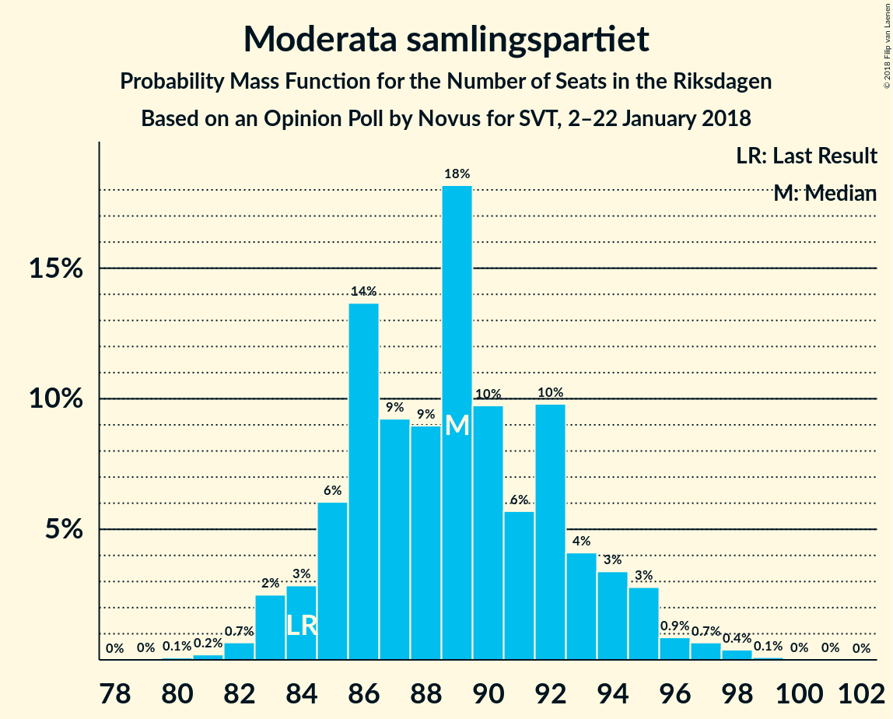
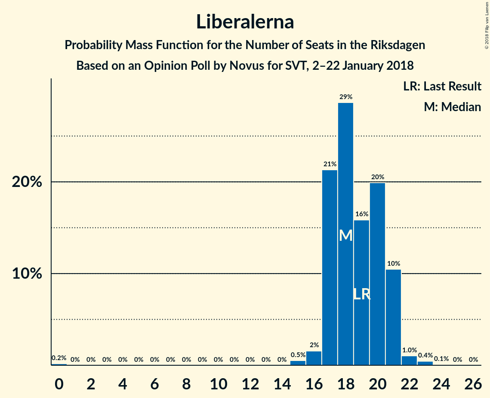

# Opinion Poll by Novus for SVT, 2–22 January 2018

<a href="#voting-intentions">Voting Intentions</a> | <a href="#seats">Seats</a> | <a href="#coalitions">Coalitions</a> | <a href="#technical-information">Technical Information</a>

## Voting Intentions

### Confidence Intervals

| Party | Last Result | Poll Result | 80% Confidence Interval | 90% Confidence Interval | 95% Confidence Interval | 99% Confidence Interval |
|:-----:|:-----------:|:-----------:|:-----------------------:|:-----------------------:|:-----------------------:|:-----------------------:|
| Sveriges socialdemokratiska arbetareparti | 31.0% | 28.6% | 27.7–29.5% |27.5–29.8% |27.2–30.0% |26.8–30.5% |
| Moderata samlingspartiet | 23.3% | 23.8% | 22.9–24.7% |22.7–24.9% |22.5–25.1% |22.1–25.6% |
| Sverigedemokraterna | 12.9% | 16.5% | 15.8–17.3% |15.6–17.5% |15.4–17.7% |15.0–18.1% |
| Centerpartiet | 6.1% | 8.9% | 8.4–9.5% |8.2–9.7% |8.1–9.8% |7.8–10.1% |
| Vänsterpartiet | 5.7% | 7.6% | 7.1–8.2% |6.9–8.3% |6.8–8.5% |6.6–8.7% |
| Liberalerna | 5.4% | 5.0% | 4.6–5.5% |4.5–5.6% |4.4–5.7% |4.2–6.0% |
| Miljöpartiet de gröna | 6.9% | 4.1% | 3.7–4.5% |3.6–4.6% |3.5–4.8% |3.3–5.0% |
| Kristdemokraterna | 4.6% | 2.7% | 2.4–3.1% |2.3–3.2% |2.2–3.2% |2.1–3.4% |

*Note:* The poll result column reflects the actual value used in the calculations. Published results may vary slightly, and in addition be rounded to fewer digits.

## Seats

### Confidence Intervals

| Party | Last Result | Median | 80% Confidence Interval | 90% Confidence Interval | 95% Confidence Interval | 99% Confidence Interval |
|:-----:|:-----------:|:------:|:-----------------------:|:-----------------------:|:-----------------------:|:-----------------------:|
| <a href="#sveriges-socialdemokratiska-arbetareparti">Sveriges socialdemokratiska arbetareparti</a> | 113 | 107 | 103–112 |102–113 |101–114 |99–117 |
| <a href="#moderata-samlingspartiet">Moderata samlingspartiet</a> | 84 | 89 | 85–93 |84–94 |83–95 |82–98 |
| <a href="#sverigedemokraterna">Sverigedemokraterna</a> | 49 | 61 | 58–65 |58–67 |57–67 |56–69 |
| <a href="#centerpartiet">Centerpartiet</a> | 22 | 33 | 31–36 |31–37 |30–37 |29–38 |
| <a href="#vänsterpartiet">Vänsterpartiet</a> | 21 | 28 | 26–31 |26–31 |25–32 |24–33 |
| <a href="#liberalerna">Liberalerna</a> | 19 | 18 | 17–21 |17–21 |17–21 |15–23 |
| <a href="#miljöpartiet-de-gröna">Miljöpartiet de gröna</a> | 25 | 15 | 0–17 |0–17 |0–17 |0–18 |
| <a href="#kristdemokraterna">Kristdemokraterna</a> | 16 | 0 | 0 |0 |0 |0 |

### Sveriges socialdemokratiska arbetareparti

*For a full overview of the results for this party, see the [Sveriges socialdemokratiska arbetareparti](party-sverigessocialdemokratiskaarbetareparti.html) page.*

| Number of Seats | Probability | Accumulated | Special Marks |
|:---------------:|:-----------:|:-----------:|:-------------:|
| 97 | 0.1% | 100% |  |
| 98 | 0.1% | 99.9% |  |
| 99 | 0.4% | 99.8% |  |
| 100 | 0.9% | 99.4% |  |
| 101 | 3% | 98% |  |
| 102 | 4% | 96% |  |
| 103 | 6% | 92% |  |
| 104 | 7% | 86% |  |
| 105 | 13% | 78% |  |
| 106 | 13% | 65% |  |
| 107 | 7% | 52% | Median |
| 108 | 13% | 45% |  |
| 109 | 8% | 32% |  |
| 110 | 7% | 24% |  |
| 111 | 5% | 17% |  |
| 112 | 3% | 11% |  |
| 113 | 4% | 8% | Last Result |
| 114 | 2% | 4% |  |
| 115 | 1.0% | 2% |  |
| 116 | 0.5% | 1.4% |  |
| 117 | 0.7% | 0.9% |  |
| 118 | 0.2% | 0.2% |  |
| 119 | 0% | 0% |  |

### Moderata samlingspartiet

*For a full overview of the results for this party, see the [Moderata samlingspartiet](party-moderatasamlingspartiet.html) page.*

| Number of Seats | Probability | Accumulated | Special Marks |
|:---------------:|:-----------:|:-----------:|:-------------:|
| 80 | 0.1% | 100% |  |
| 81 | 0.2% | 99.9% |  |
| 82 | 0.7% | 99.7% |  |
| 83 | 2% | 99.0% |  |
| 84 | 3% | 97% | Last Result |
| 85 | 6% | 94% |  |
| 86 | 14% | 88% |  |
| 87 | 9% | 74% |  |
| 88 | 9% | 65% |  |
| 89 | 18% | 56% | Median |
| 90 | 10% | 38% |  |
| 91 | 6% | 28% |  |
| 92 | 10% | 22% |  |
| 93 | 4% | 12% |  |
| 94 | 3% | 8% |  |
| 95 | 3% | 5% |  |
| 96 | 0.9% | 2% |  |
| 97 | 0.7% | 1.2% |  |
| 98 | 0.4% | 0.5% |  |
| 99 | 0.1% | 0.2% |  |
| 100 | 0% | 0.1% |  |
| 101 | 0% | 0% |  |

### Sverigedemokraterna

*For a full overview of the results for this party, see the [Sverigedemokraterna](party-sverigedemokraterna.html) page.*

| Number of Seats | Probability | Accumulated | Special Marks |
|:---------------:|:-----------:|:-----------:|:-------------:|
| 49 | 0% | 100% | Last Result |
| 50 | 0% | 100% |  |
| 51 | 0% | 100% |  |
| 52 | 0% | 100% |  |
| 53 | 0% | 100% |  |
| 54 | 0.1% | 100% |  |
| 55 | 0.2% | 99.9% |  |
| 56 | 1.0% | 99.7% |  |
| 57 | 2% | 98.7% |  |
| 58 | 7% | 97% |  |
| 59 | 8% | 90% |  |
| 60 | 12% | 82% |  |
| 61 | 22% | 70% | Median |
| 62 | 14% | 48% |  |
| 63 | 9% | 33% |  |
| 64 | 8% | 24% |  |
| 65 | 6% | 16% |  |
| 66 | 4% | 10% |  |
| 67 | 4% | 6% |  |
| 68 | 0.9% | 2% |  |
| 69 | 0.9% | 1.1% |  |
| 70 | 0.1% | 0.2% |  |
| 71 | 0% | 0.1% |  |
| 72 | 0% | 0% |  |

### Centerpartiet

*For a full overview of the results for this party, see the [Centerpartiet](party-centerpartiet.html) page.*

| Number of Seats | Probability | Accumulated | Special Marks |
|:---------------:|:-----------:|:-----------:|:-------------:|
| 22 | 0% | 100% | Last Result |
| 23 | 0% | 100% |  |
| 24 | 0% | 100% |  |
| 25 | 0% | 100% |  |
| 26 | 0% | 100% |  |
| 27 | 0% | 100% |  |
| 28 | 0.2% | 100% |  |
| 29 | 0.9% | 99.8% |  |
| 30 | 3% | 98.9% |  |
| 31 | 10% | 96% |  |
| 32 | 20% | 86% |  |
| 33 | 20% | 65% | Median |
| 34 | 19% | 46% |  |
| 35 | 14% | 27% |  |
| 36 | 7% | 13% |  |
| 37 | 4% | 5% |  |
| 38 | 1.2% | 2% |  |
| 39 | 0.3% | 0.5% |  |
| 40 | 0.1% | 0.2% |  |
| 41 | 0% | 0% |  |

### Vänsterpartiet

*For a full overview of the results for this party, see the [Vänsterpartiet](party-vänsterpartiet.html) page.*

| Number of Seats | Probability | Accumulated | Special Marks |
|:---------------:|:-----------:|:-----------:|:-------------:|
| 21 | 0% | 100% | Last Result |
| 22 | 0% | 100% |  |
| 23 | 0.1% | 100% |  |
| 24 | 0.4% | 99.9% |  |
| 25 | 3% | 99.5% |  |
| 26 | 7% | 96% |  |
| 27 | 22% | 89% |  |
| 28 | 21% | 67% | Median |
| 29 | 18% | 46% |  |
| 30 | 17% | 28% |  |
| 31 | 6% | 11% |  |
| 32 | 4% | 5% |  |
| 33 | 0.8% | 1.1% |  |
| 34 | 0.2% | 0.3% |  |
| 35 | 0% | 0.1% |  |
| 36 | 0% | 0% |  |

### Liberalerna

*For a full overview of the results for this party, see the [Liberalerna](party-liberalerna.html) page.*

| Number of Seats | Probability | Accumulated | Special Marks |
|:---------------:|:-----------:|:-----------:|:-------------:|
| 0 | 0.2% | 100% |  |
| 1 | 0% | 99.8% |  |
| 2 | 0% | 99.8% |  |
| 3 | 0% | 99.8% |  |
| 4 | 0% | 99.8% |  |
| 5 | 0% | 99.8% |  |
| 6 | 0% | 99.8% |  |
| 7 | 0% | 99.8% |  |
| 8 | 0% | 99.8% |  |
| 9 | 0% | 99.8% |  |
| 10 | 0% | 99.8% |  |
| 11 | 0% | 99.8% |  |
| 12 | 0% | 99.8% |  |
| 13 | 0% | 99.8% |  |
| 14 | 0% | 99.8% |  |
| 15 | 0.5% | 99.8% |  |
| 16 | 2% | 99.3% |  |
| 17 | 21% | 98% |  |
| 18 | 29% | 76% | Median |
| 19 | 16% | 48% | Last Result |
| 20 | 20% | 32% |  |
| 21 | 10% | 12% |  |
| 22 | 1.0% | 2% |  |
| 23 | 0.4% | 0.5% |  |
| 24 | 0.1% | 0.1% |  |
| 25 | 0% | 0% |  |

### Miljöpartiet de gröna

*For a full overview of the results for this party, see the [Miljöpartiet de gröna](party-miljöpartietdegröna.html) page.*

| Number of Seats | Probability | Accumulated | Special Marks |
|:---------------:|:-----------:|:-----------:|:-------------:|
| 0 | 32% | 100% |  |
| 1 | 0% | 68% |  |
| 2 | 0% | 68% |  |
| 3 | 0% | 68% |  |
| 4 | 0% | 68% |  |
| 5 | 0% | 68% |  |
| 6 | 0% | 68% |  |
| 7 | 0% | 68% |  |
| 8 | 0% | 68% |  |
| 9 | 0% | 68% |  |
| 10 | 0% | 68% |  |
| 11 | 0% | 68% |  |
| 12 | 0% | 68% |  |
| 13 | 0% | 68% |  |
| 14 | 0% | 68% |  |
| 15 | 27% | 68% | Median |
| 16 | 28% | 41% |  |
| 17 | 10% | 12% |  |
| 18 | 2% | 2% |  |
| 19 | 0.3% | 0.3% |  |
| 20 | 0% | 0% |  |
| 21 | 0% | 0% |  |
| 22 | 0% | 0% |  |
| 23 | 0% | 0% |  |
| 24 | 0% | 0% |  |
| 25 | 0% | 0% | Last Result |

### Kristdemokraterna

*For a full overview of the results for this party, see the [Kristdemokraterna](party-kristdemokraterna.html) page.*

| Number of Seats | Probability | Accumulated | Special Marks |
|:---------------:|:-----------:|:-----------:|:-------------:|
| 0 | 100% | 100% | Median |
| 1 | 0% | 0% |  |
| 2 | 0% | 0% |  |
| 3 | 0% | 0% |  |
| 4 | 0% | 0% |  |
| 5 | 0% | 0% |  |
| 6 | 0% | 0% |  |
| 7 | 0% | 0% |  |
| 8 | 0% | 0% |  |
| 9 | 0% | 0% |  |
| 10 | 0% | 0% |  |
| 11 | 0% | 0% |  |
| 12 | 0% | 0% |  |
| 13 | 0% | 0% |  |
| 14 | 0% | 0% |  |
| 15 | 0% | 0% |  |
| 16 | 0% | 0% | Last Result |

## Coalitions

### Confidence Intervals

| Coalition | Last Result | Median | Majority? | 80% Confidence Interval | 90% Confidence Interval | 95% Confidence Interval | 99% Confidence Interval |
|:---------:|:-----------:|:------:|:---------:|:-----------------------:|:-----------------------:|:-----------------------:|:-----------------------:|
| Sveriges socialdemokratiska arbetareparti – Moderata samlingspartiet – Centerpartiet | 219 | 228 | 100% | 223–238 | 222–239 | 221–241 | 219–243 |
| Sveriges socialdemokratiska arbetareparti – Moderata samlingspartiet | 197 | 195 | 100% | 190–203 | 189–204 | 188–206 | 186–209 |
| Moderata samlingspartiet – Sverigedemokraterna – Kristdemokraterna | 149 | 150 | 0% | 146–158 | 145–159 | 144–160 | 142–162 |
| Moderata samlingspartiet – Sverigedemokraterna | 133 | 150 | 0% | 146–158 | 145–159 | 144–160 | 142–162 |
| Sveriges socialdemokratiska arbetareparti – Vänsterpartiet – Miljöpartiet de gröna | 159 | 148 | 0% | 138–153 | 137–153 | 136–154 | 134–156 |
| Moderata samlingspartiet – Centerpartiet – Liberalerna – Kristdemokraterna | 141 | 140 | 0% | 136–147 | 135–148 | 134–149 | 132–152 |
| Moderata samlingspartiet – Centerpartiet – Liberalerna | 125 | 140 | 0% | 136–147 | 135–148 | 134–149 | 132–152 |
| Sveriges socialdemokratiska arbetareparti – Vänsterpartiet | 134 | 135 | 0% | 130–142 | 129–143 | 129–144 | 127–146 |
| Moderata samlingspartiet – Centerpartiet – Kristdemokraterna | 122 | 122 | 0% | 118–127 | 117–129 | 116–130 | 114–132 |
| Moderata samlingspartiet – Centerpartiet | 106 | 122 | 0% | 118–127 | 117–129 | 116–130 | 114–132 |
| Sveriges socialdemokratiska arbetareparti – Miljöpartiet de gröna | 138 | 120 | 0% | 109–124 | 108–125 | 106–126 | 105–128 |

