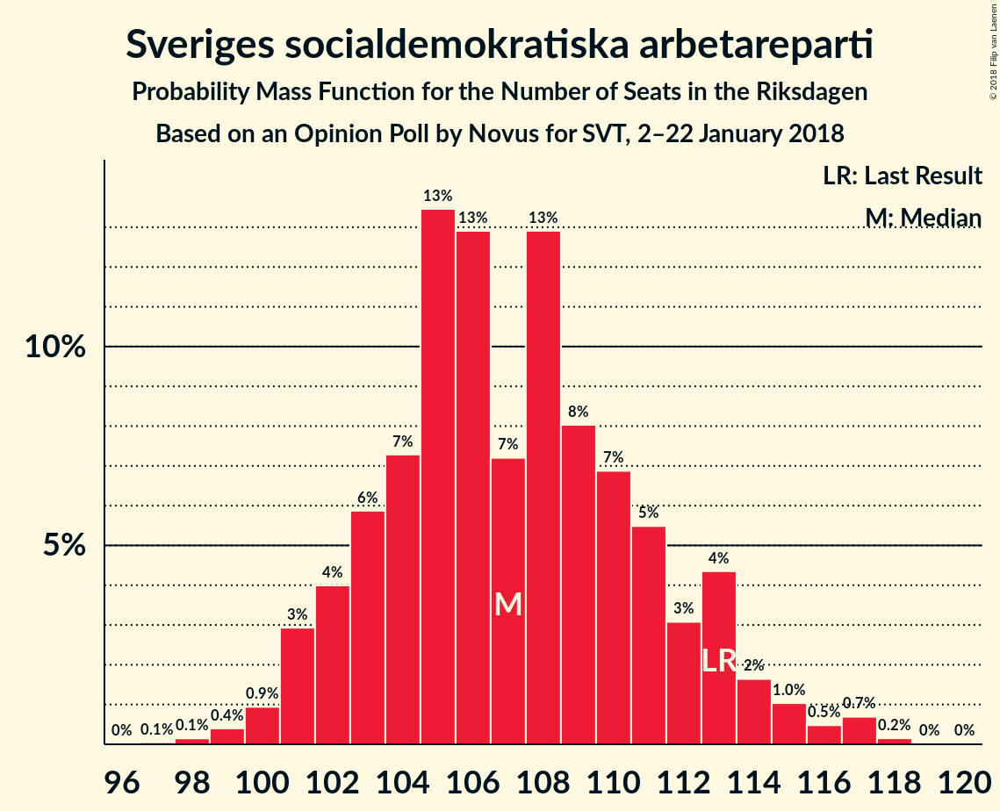

# Opinion Poll by Novus for SVT, 2–22 January 2018

<a href="#voting-intentions">Voting Intentions</a> | <a href="#seats">Seats</a> | <a href="#coalitions">Coalitions</a> | <a href="#technical-information">Technical Information</a>

## Voting Intentions

### Confidence Intervals

| Party | Last Result | Poll Result | 80% Confidence Interval | 90% Confidence Interval | 95% Confidence Interval | 99% Confidence Interval |
|:-----:|:-----------:|:-----------:|:-----------------------:|:-----------------------:|:-----------------------:|:-----------------------:|
| Sveriges socialdemokratiska arbetareparti | 31.0% | 28.6% | 27.7–29.5% |27.5–29.8% |27.2–30.0% |26.8–30.5% |
| Moderata samlingspartiet | 23.3% | 23.8% | 22.9–24.7% |22.7–24.9% |22.5–25.1% |22.1–25.6% |
| Sverigedemokraterna | 12.9% | 16.5% | 15.8–17.3% |15.6–17.5% |15.4–17.7% |15.0–18.1% |
| Centerpartiet | 6.1% | 8.9% | 8.4–9.5% |8.2–9.7% |8.1–9.8% |7.8–10.1% |
| Vänsterpartiet | 5.7% | 7.6% | 7.1–8.2% |6.9–8.3% |6.8–8.5% |6.6–8.7% |
| Liberalerna | 5.4% | 5.0% | 4.6–5.5% |4.5–5.6% |4.4–5.7% |4.2–6.0% |
| Miljöpartiet de gröna | 6.9% | 4.1% | 3.7–4.5% |3.6–4.6% |3.5–4.8% |3.3–5.0% |
| Kristdemokraterna | 4.6% | 2.7% | 2.4–3.1% |2.3–3.2% |2.2–3.2% |2.1–3.4% |

*Note:* The poll result column reflects the actual value used in the calculations. Published results may vary slightly, and in addition be rounded to fewer digits.

## Seats

### Confidence Intervals

| Party | Last Result | Median | 80% Confidence Interval | 90% Confidence Interval | 95% Confidence Interval | 99% Confidence Interval |
|:-----:|:-----------:|:------:|:-----------------------:|:-----------------------:|:-----------------------:|:-----------------------:|
| <a href="#sveriges-socialdemokratiska-arbetareparti">Sveriges socialdemokratiska arbetareparti</a> | 113 | 103 | 103 |103–111 |101–112 |98–115 |
| <a href="#moderata-samlingspartiet">Moderata samlingspartiet</a> | 84 | 89 | 89 |87–93 |86–93 |85–98 |
| <a href="#sverigedemokraterna">Sverigedemokraterna</a> | 49 | 62 | 62–63 |62–67 |62–67 |60–69 |
| <a href="#centerpartiet">Centerpartiet</a> | 22 | 31 | 31–33 |31–34 |31–36 |31–36 |
| <a href="#vänsterpartiet">Vänsterpartiet</a> | 21 | 29 | 29 |28–30 |25–32 |25–34 |
| <a href="#liberalerna">Liberalerna</a> | 19 | 17 | 17 |17–19 |17–19 |0–22 |
| <a href="#miljöpartiet-de-gröna">Miljöpartiet de gröna</a> | 25 | 18 | 16–18 |0–18 |0–18 |0–18 |
| <a href="#kristdemokraterna">Kristdemokraterna</a> | 16 | 0 | 0 |0 |0 |0 |

### Sveriges socialdemokratiska arbetareparti

*For a full overview of the results for this party, see the [Sveriges socialdemokratiska arbetareparti](party-sverigessocialdemokratiskaarbetareparti.html) page.*

| Number of Seats | Probability | Accumulated | Special Marks |
|:---------------:|:-----------:|:-----------:|:-------------:|
| 98 | 0.7% | 100% |  |
| 99 | 0.8% | 99.3% |  |
| 100 | 0% | 98.5% |  |
| 101 | 2% | 98.5% |  |
| 102 | 0% | 97% |  |
| 103 | 87% | 97% | Median |
| 104 | 0.7% | 9% |  |
| 105 | 0.1% | 9% |  |
| 106 | 0.1% | 9% |  |
| 107 | 0% | 8% |  |
| 108 | 0% | 8% |  |
| 109 | 0.1% | 8% |  |
| 110 | 0% | 8% |  |
| 111 | 5% | 8% |  |
| 112 | 3% | 4% |  |
| 113 | 0% | 1.0% | Last Result |
| 114 | 0% | 1.0% |  |
| 115 | 1.0% | 1.0% |  |
| 116 | 0% | 0% |  |

### Moderata samlingspartiet

*For a full overview of the results for this party, see the [Moderata samlingspartiet](party-moderatasamlingspartiet.html) page.*

| Number of Seats | Probability | Accumulated | Special Marks |
|:---------------:|:-----------:|:-----------:|:-------------:|
| 84 | 0.2% | 100% | Last Result |
| 85 | 2% | 99.8% |  |
| 86 | 1.4% | 98% |  |
| 87 | 3% | 96% |  |
| 88 | 0.8% | 94% |  |
| 89 | 87% | 93% | Median |
| 90 | 0.6% | 6% |  |
| 91 | 0% | 5% |  |
| 92 | 0% | 5% |  |
| 93 | 3% | 5% |  |
| 94 | 0% | 2% |  |
| 95 | 0% | 2% |  |
| 96 | 0% | 2% |  |
| 97 | 1.2% | 2% |  |
| 98 | 1.0% | 1.0% |  |
| 99 | 0% | 0% |  |

### Sverigedemokraterna

*For a full overview of the results for this party, see the [Sverigedemokraterna](party-sverigedemokraterna.html) page.*

| Number of Seats | Probability | Accumulated | Special Marks |
|:---------------:|:-----------:|:-----------:|:-------------:|
| 49 | 0% | 100% | Last Result |
| 50 | 0% | 100% |  |
| 51 | 0% | 100% |  |
| 52 | 0% | 100% |  |
| 53 | 0% | 100% |  |
| 54 | 0% | 100% |  |
| 55 | 0% | 99.9% |  |
| 56 | 0.1% | 99.9% |  |
| 57 | 0% | 99.8% |  |
| 58 | 0% | 99.8% |  |
| 59 | 0% | 99.8% |  |
| 60 | 0.8% | 99.8% |  |
| 61 | 0.1% | 99.0% |  |
| 62 | 88% | 99.0% | Median |
| 63 | 2% | 11% |  |
| 64 | 0.2% | 9% |  |
| 65 | 3% | 8% |  |
| 66 | 0% | 6% |  |
| 67 | 5% | 6% |  |
| 68 | 0% | 1.0% |  |
| 69 | 1.0% | 1.0% |  |
| 70 | 0% | 0% |  |

### Centerpartiet

*For a full overview of the results for this party, see the [Centerpartiet](party-centerpartiet.html) page.*

| Number of Seats | Probability | Accumulated | Special Marks |
|:---------------:|:-----------:|:-----------:|:-------------:|
| 22 | 0% | 100% | Last Result |
| 23 | 0% | 100% |  |
| 24 | 0% | 100% |  |
| 25 | 0% | 100% |  |
| 26 | 0% | 100% |  |
| 27 | 0% | 100% |  |
| 28 | 0.1% | 100% |  |
| 29 | 0% | 99.9% |  |
| 30 | 0% | 99.9% |  |
| 31 | 89% | 99.9% | Median |
| 32 | 0.6% | 11% |  |
| 33 | 0.7% | 10% |  |
| 34 | 6% | 9% |  |
| 35 | 0% | 3% |  |
| 36 | 3% | 3% |  |
| 37 | 0% | 0.1% |  |
| 38 | 0% | 0% |  |

### Vänsterpartiet

*For a full overview of the results for this party, see the [Vänsterpartiet](party-vänsterpartiet.html) page.*

| Number of Seats | Probability | Accumulated | Special Marks |
|:---------------:|:-----------:|:-----------:|:-------------:|
| 21 | 0% | 100% | Last Result |
| 22 | 0.1% | 100% |  |
| 23 | 0% | 99.9% |  |
| 24 | 0% | 99.9% |  |
| 25 | 3% | 99.9% |  |
| 26 | 0% | 97% |  |
| 27 | 1.2% | 97% |  |
| 28 | 1.4% | 96% |  |
| 29 | 89% | 95% | Median |
| 30 | 0.8% | 6% |  |
| 31 | 0.2% | 5% |  |
| 32 | 3% | 5% |  |
| 33 | 1.1% | 2% |  |
| 34 | 0.7% | 0.7% |  |
| 35 | 0% | 0% |  |

### Liberalerna

*For a full overview of the results for this party, see the [Liberalerna](party-liberalerna.html) page.*

| Number of Seats | Probability | Accumulated | Special Marks |
|:---------------:|:-----------:|:-----------:|:-------------:|
| 0 | 1.0% | 100% |  |
| 1 | 0% | 99.0% |  |
| 2 | 0% | 99.0% |  |
| 3 | 0% | 99.0% |  |
| 4 | 0% | 99.0% |  |
| 5 | 0% | 99.0% |  |
| 6 | 0% | 99.0% |  |
| 7 | 0% | 99.0% |  |
| 8 | 0% | 99.0% |  |
| 9 | 0% | 99.0% |  |
| 10 | 0% | 99.0% |  |
| 11 | 0% | 99.0% |  |
| 12 | 0% | 99.0% |  |
| 13 | 0% | 99.0% |  |
| 14 | 0% | 99.0% |  |
| 15 | 0.1% | 99.0% |  |
| 16 | 0.1% | 98.9% |  |
| 17 | 89% | 98.8% | Median |
| 18 | 3% | 10% |  |
| 19 | 5% | 7% | Last Result |
| 20 | 0.2% | 2% |  |
| 21 | 0.7% | 2% |  |
| 22 | 1.4% | 1.4% |  |
| 23 | 0% | 0% |  |

### Miljöpartiet de gröna

*For a full overview of the results for this party, see the [Miljöpartiet de gröna](party-miljöpartietdegröna.html) page.*

| Number of Seats | Probability | Accumulated | Special Marks |
|:---------------:|:-----------:|:-----------:|:-------------:|
| 0 | 8% | 100% |  |
| 1 | 0% | 92% |  |
| 2 | 0% | 92% |  |
| 3 | 0% | 92% |  |
| 4 | 0% | 92% |  |
| 5 | 0% | 92% |  |
| 6 | 0% | 92% |  |
| 7 | 0% | 92% |  |
| 8 | 0% | 92% |  |
| 9 | 0% | 92% |  |
| 10 | 0% | 92% |  |
| 11 | 0% | 92% |  |
| 12 | 0% | 92% |  |
| 13 | 0% | 92% |  |
| 14 | 0% | 92% |  |
| 15 | 1.5% | 92% |  |
| 16 | 2% | 90% |  |
| 17 | 0% | 88% |  |
| 18 | 88% | 88% | Median |
| 19 | 0% | 0% |  |
| 20 | 0% | 0% |  |
| 21 | 0% | 0% |  |
| 22 | 0% | 0% |  |
| 23 | 0% | 0% |  |
| 24 | 0% | 0% |  |
| 25 | 0% | 0% | Last Result |

### Kristdemokraterna

*For a full overview of the results for this party, see the [Kristdemokraterna](party-kristdemokraterna.html) page.*

| Number of Seats | Probability | Accumulated | Special Marks |
|:---------------:|:-----------:|:-----------:|:-------------:|
| 0 | 100% | 100% | Median |
| 1 | 0% | 0% |  |
| 2 | 0% | 0% |  |
| 3 | 0% | 0% |  |
| 4 | 0% | 0% |  |
| 5 | 0% | 0% |  |
| 6 | 0% | 0% |  |
| 7 | 0% | 0% |  |
| 8 | 0% | 0% |  |
| 9 | 0% | 0% |  |
| 10 | 0% | 0% |  |
| 11 | 0% | 0% |  |
| 12 | 0% | 0% |  |
| 13 | 0% | 0% |  |
| 14 | 0% | 0% |  |
| 15 | 0% | 0% |  |
| 16 | 0% | 0% | Last Result |

## Coalitions

### Confidence Intervals

| Coalition | Last Result | Median | Majority? | 80% Confidence Interval | 90% Confidence Interval | 95% Confidence Interval | 99% Confidence Interval |
|:---------:|:-----------:|:------:|:---------:|:-----------------------:|:-----------------------:|:-----------------------:|:-----------------------:|
| Sveriges socialdemokratiska arbetareparti – Moderata samlingspartiet | 197 | 192 | 100% | 192 | 192–198 | 188–204 | 186–213 |
| Moderata samlingspartiet – Sverigedemokraterna | 133 | 151 | 0% | 151–152 | 151–155 | 151–156 | 148–167 |
| Sveriges socialdemokratiska arbetareparti – Vänsterpartiet – Miljöpartiet de gröna | 159 | 150 | 0% | 144–150 | 142–150 | 140–150 | 139–150 |
| Moderata samlingspartiet – Centerpartiet – Liberalerna – Kristdemokraterna | 141 | 137 | 0% | 137–139 | 137–143 | 137–145 | 132–146 |
| Moderata samlingspartiet – Centerpartiet – Liberalerna | 125 | 137 | 0% | 137–139 | 137–143 | 137–145 | 132–146 |
| Sveriges socialdemokratiska arbetareparti – Vänsterpartiet | 134 | 132 | 0% | 132 | 132–140 | 129–143 | 126–148 |
| Moderata samlingspartiet – Centerpartiet – Kristdemokraterna | 122 | 120 | 0% | 120–121 | 120–124 | 120–127 | 120–132 |
| Moderata samlingspartiet – Centerpartiet | 106 | 120 | 0% | 120–121 | 120–124 | 120–127 | 120–132 |
| Sveriges socialdemokratiska arbetareparti – Miljöpartiet de gröna | 138 | 121 | 0% | 117–121 | 112–121 | 111–121 | 111–122 |

### Sveriges socialdemokratiska arbetareparti – Moderata samlingspartiet

| Number of Seats | Probability | Accumulated | Special Marks |
|:---------------:|:-----------:|:-----------:|:-------------:|
| 182 | 0.2% | 100% |  |
| 183 | 0% | 99.8% |  |
| 184 | 0% | 99.8% |  |
| 185 | 0% | 99.8% |  |
| 186 | 2% | 99.8% |  |
| 187 | 0% | 98% |  |
| 188 | 0.5% | 98% |  |
| 189 | 0% | 97% |  |
| 190 | 0% | 97% |  |
| 191 | 0% | 97% |  |
| 192 | 89% | 97% | Median |
| 193 | 0.1% | 9% |  |
| 194 | 0% | 9% |  |
| 195 | 0% | 9% |  |
| 196 | 0.1% | 9% |  |
| 197 | 0% | 9% | Last Result |
| 198 | 4% | 9% |  |
| 199 | 0.1% | 4% |  |
| 200 | 0.1% | 4% |  |
| 201 | 0% | 4% |  |
| 202 | 0.1% | 4% |  |
| 203 | 0% | 4% |  |
| 204 | 2% | 4% |  |
| 205 | 0% | 2% |  |
| 206 | 0% | 2% |  |
| 207 | 0% | 2% |  |
| 208 | 0% | 2% |  |
| 209 | 1.2% | 2% |  |
| 210 | 0% | 1.0% |  |
| 211 | 0% | 1.0% |  |
| 212 | 0% | 1.0% |  |
| 213 | 1.0% | 1.0% |  |
| 214 | 0% | 0% |  |

### Moderata samlingspartiet – Sverigedemokraterna

| Number of Seats | Probability | Accumulated | Special Marks |
|:---------------:|:-----------:|:-----------:|:-------------:|
| 133 | 0% | 100% | Last Result |
| 134 | 0% | 100% |  |
| 135 | 0% | 100% |  |
| 136 | 0% | 100% |  |
| 137 | 0% | 100% |  |
| 138 | 0% | 100% |  |
| 139 | 0% | 100% |  |
| 140 | 0% | 100% |  |
| 141 | 0% | 100% |  |
| 142 | 0% | 100% |  |
| 143 | 0% | 100% |  |
| 144 | 0% | 100% |  |
| 145 | 0% | 100% |  |
| 146 | 0% | 100% |  |
| 147 | 0% | 100% |  |
| 148 | 0.9% | 100% |  |
| 149 | 0.2% | 99.0% |  |
| 150 | 0% | 98.8% |  |
| 151 | 89% | 98.8% | Median |
| 152 | 2% | 10% |  |
| 153 | 0.5% | 8% |  |
| 154 | 3% | 8% |  |
| 155 | 0.8% | 5% |  |
| 156 | 2% | 4% |  |
| 157 | 0.1% | 2% |  |
| 158 | 0% | 2% |  |
| 159 | 0% | 2% |  |
| 160 | 0% | 2% |  |
| 161 | 0% | 2% |  |
| 162 | 1.2% | 2% |  |
| 163 | 0% | 1.0% |  |
| 164 | 0% | 1.0% |  |
| 165 | 0% | 1.0% |  |
| 166 | 0% | 1.0% |  |
| 167 | 1.0% | 1.0% |  |
| 168 | 0% | 0% |  |

### Sveriges socialdemokratiska arbetareparti – Vänsterpartiet – Miljöpartiet de gröna

| Number of Seats | Probability | Accumulated | Special Marks |
|:---------------:|:-----------:|:-----------:|:-------------:|
| 136 | 0% | 100% |  |
| 137 | 0% | 99.9% |  |
| 138 | 0% | 99.9% |  |
| 139 | 1.3% | 99.9% |  |
| 140 | 3% | 98.6% |  |
| 141 | 0% | 95% |  |
| 142 | 2% | 95% |  |
| 143 | 3% | 93% |  |
| 144 | 0.8% | 91% |  |
| 145 | 0% | 90% |  |
| 146 | 0% | 90% |  |
| 147 | 1.4% | 90% |  |
| 148 | 1.0% | 89% |  |
| 149 | 0% | 88% |  |
| 150 | 87% | 88% | Median |
| 151 | 0% | 0.2% |  |
| 152 | 0% | 0.2% |  |
| 153 | 0% | 0.2% |  |
| 154 | 0% | 0.1% |  |
| 155 | 0% | 0.1% |  |
| 156 | 0.1% | 0.1% |  |
| 157 | 0% | 0% |  |
| 158 | 0% | 0% |  |
| 159 | 0% | 0% | Last Result |

### Moderata samlingspartiet – Centerpartiet – Liberalerna – Kristdemokraterna

| Number of Seats | Probability | Accumulated | Special Marks |
|:---------------:|:-----------:|:-----------:|:-------------:|
| 132 | 1.0% | 100% |  |
| 133 | 0% | 99.0% |  |
| 134 | 0% | 99.0% |  |
| 135 | 0% | 99.0% |  |
| 136 | 0% | 99.0% |  |
| 137 | 87% | 99.0% | Median |
| 138 | 0.3% | 12% |  |
| 139 | 3% | 11% |  |
| 140 | 2% | 8% |  |
| 141 | 0% | 6% | Last Result |
| 142 | 0.7% | 6% |  |
| 143 | 0.9% | 6% |  |
| 144 | 1.4% | 5% |  |
| 145 | 1.3% | 3% |  |
| 146 | 2% | 2% |  |
| 147 | 0% | 0.1% |  |
| 148 | 0% | 0.1% |  |
| 149 | 0% | 0.1% |  |
| 150 | 0% | 0.1% |  |
| 151 | 0% | 0% |  |

### Moderata samlingspartiet – Centerpartiet – Liberalerna

| Number of Seats | Probability | Accumulated | Special Marks |
|:---------------:|:-----------:|:-----------:|:-------------:|
| 125 | 0% | 100% | Last Result |
| 126 | 0% | 100% |  |
| 127 | 0% | 100% |  |
| 128 | 0% | 100% |  |
| 129 | 0% | 100% |  |
| 130 | 0% | 100% |  |
| 131 | 0% | 100% |  |
| 132 | 1.0% | 100% |  |
| 133 | 0% | 99.0% |  |
| 134 | 0% | 99.0% |  |
| 135 | 0% | 99.0% |  |
| 136 | 0% | 99.0% |  |
| 137 | 87% | 99.0% | Median |
| 138 | 0.3% | 12% |  |
| 139 | 3% | 11% |  |
| 140 | 2% | 8% |  |
| 141 | 0% | 6% |  |
| 142 | 0.7% | 6% |  |
| 143 | 0.9% | 6% |  |
| 144 | 1.4% | 5% |  |
| 145 | 1.3% | 3% |  |
| 146 | 2% | 2% |  |
| 147 | 0% | 0.1% |  |
| 148 | 0% | 0.1% |  |
| 149 | 0% | 0.1% |  |
| 150 | 0% | 0.1% |  |
| 151 | 0% | 0% |  |

### Sveriges socialdemokratiska arbetareparti – Vänsterpartiet

| Number of Seats | Probability | Accumulated | Special Marks |
|:---------------:|:-----------:|:-----------:|:-------------:|
| 126 | 2% | 100% |  |
| 127 | 0% | 98% |  |
| 128 | 0% | 98% |  |
| 129 | 1.5% | 98% |  |
| 130 | 0% | 97% |  |
| 131 | 0% | 97% |  |
| 132 | 88% | 97% | Median |
| 133 | 0.1% | 9% |  |
| 134 | 0.1% | 9% | Last Result |
| 135 | 0% | 9% |  |
| 136 | 0% | 8% |  |
| 137 | 0% | 8% |  |
| 138 | 0% | 8% |  |
| 139 | 1.3% | 8% |  |
| 140 | 3% | 7% |  |
| 141 | 0% | 4% |  |
| 142 | 0% | 4% |  |
| 143 | 3% | 4% |  |
| 144 | 0% | 1.0% |  |
| 145 | 0% | 1.0% |  |
| 146 | 0% | 1.0% |  |
| 147 | 0% | 1.0% |  |
| 148 | 1.0% | 1.0% |  |
| 149 | 0% | 0% |  |

### Moderata samlingspartiet – Centerpartiet – Kristdemokraterna

| Number of Seats | Probability | Accumulated | Special Marks |
|:---------------:|:-----------:|:-----------:|:-------------:|
| 118 | 0.2% | 100% |  |
| 119 | 0% | 99.8% |  |
| 120 | 87% | 99.8% | Median |
| 121 | 5% | 12% |  |
| 122 | 2% | 7% | Last Result |
| 123 | 0% | 5% |  |
| 124 | 0.9% | 5% |  |
| 125 | 0% | 4% |  |
| 126 | 0% | 4% |  |
| 127 | 2% | 4% |  |
| 128 | 1.3% | 2% |  |
| 129 | 0% | 1.1% |  |
| 130 | 0% | 1.1% |  |
| 131 | 0% | 1.0% |  |
| 132 | 1.0% | 1.0% |  |
| 133 | 0% | 0% |  |

### Moderata samlingspartiet – Centerpartiet

| Number of Seats | Probability | Accumulated | Special Marks |
|:---------------:|:-----------:|:-----------:|:-------------:|
| 106 | 0% | 100% | Last Result |
| 107 | 0% | 100% |  |
| 108 | 0% | 100% |  |
| 109 | 0% | 100% |  |
| 110 | 0% | 100% |  |
| 111 | 0% | 100% |  |
| 112 | 0% | 100% |  |
| 113 | 0% | 100% |  |
| 114 | 0% | 100% |  |
| 115 | 0% | 100% |  |
| 116 | 0% | 100% |  |
| 117 | 0% | 100% |  |
| 118 | 0.2% | 100% |  |
| 119 | 0% | 99.8% |  |
| 120 | 87% | 99.8% | Median |
| 121 | 5% | 12% |  |
| 122 | 2% | 7% |  |
| 123 | 0% | 5% |  |
| 124 | 0.9% | 5% |  |
| 125 | 0% | 4% |  |
| 126 | 0% | 4% |  |
| 127 | 2% | 4% |  |
| 128 | 1.3% | 2% |  |
| 129 | 0% | 1.1% |  |
| 130 | 0% | 1.1% |  |
| 131 | 0% | 1.0% |  |
| 132 | 1.0% | 1.0% |  |
| 133 | 0% | 0% |  |

### Sveriges socialdemokratiska arbetareparti – Miljöpartiet de gröna

| Number of Seats | Probability | Accumulated | Special Marks |
|:---------------:|:-----------:|:-----------:|:-------------:|
| 105 | 0% | 100% |  |
| 106 | 0.1% | 99.9% |  |
| 107 | 0% | 99.8% |  |
| 108 | 0% | 99.8% |  |
| 109 | 0% | 99.8% |  |
| 110 | 0% | 99.8% |  |
| 111 | 5% | 99.8% |  |
| 112 | 3% | 95% |  |
| 113 | 0.7% | 93% |  |
| 114 | 0.8% | 92% |  |
| 115 | 1.0% | 91% |  |
| 116 | 0% | 90% |  |
| 117 | 2% | 90% |  |
| 118 | 0% | 88% |  |
| 119 | 0% | 88% |  |
| 120 | 0% | 88% |  |
| 121 | 87% | 88% | Median |
| 122 | 0.7% | 1.0% |  |
| 123 | 0% | 0.3% |  |
| 124 | 0% | 0.2% |  |
| 125 | 0.1% | 0.2% |  |
| 126 | 0% | 0.1% |  |
| 127 | 0% | 0.1% |  |
| 128 | 0.1% | 0.1% |  |
| 129 | 0% | 0% |  |
| 130 | 0% | 0% |  |
| 131 | 0% | 0% |  |
| 132 | 0% | 0% |  |
| 133 | 0% | 0% |  |
| 134 | 0% | 0% |  |
| 135 | 0% | 0% |  |
| 136 | 0% | 0% |  |
| 137 | 0% | 0% |  |
| 138 | 0% | 0% | Last Result |

## Technical Information

### Opinion Poll

+ **Polling firm:** Novus
+ **Commissioner(s):** SVT
+ **Fieldwork period:** 2–22 January 2018

### Calculations

+ **Sample size:** 4006
+ **Simulations done:** 1,024
+ **Error estimate:** 1.20%

