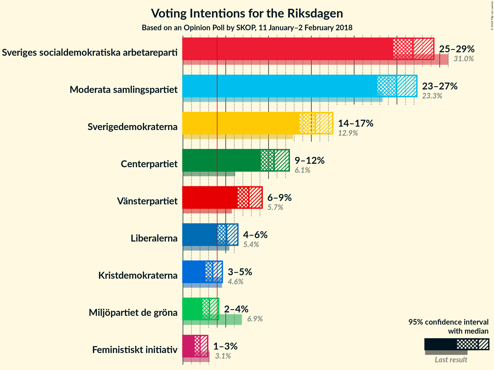

# Opinion Poll by SKOP, 11 January–2 February 2018

<a href="#voting-intentions">Voting Intentions</a> | <a href="#seats">Seats</a> | <a href="#coalitions">Coalitions</a> | <a href="#technical-information">Technical Information</a>

## Voting Intentions

### Confidence Intervals

| Party | Last Result | Poll Result | 80% Confidence Interval | 90% Confidence Interval | 95% Confidence Interval | 99% Confidence Interval |
|:-----:|:-----------:|:-----------:|:-----------------------:|:-----------------------:|:-----------------------:|:-----------------------:|
| Sveriges socialdemokratiska arbetareparti | 31.0% | 26.9% | 25.4–28.5% |24.9–28.9% |24.6–29.3% |23.9–30.1% |
| Moderata samlingspartiet | 23.3% | 24.9% | 23.5–26.5% |23.1–26.9% |22.7–27.3% |22.0–28.1% |
| Sverigedemokraterna | 12.9% | 15.5% | 14.3–16.8% |13.9–17.2% |13.6–17.5% |13.1–18.2% |
| Centerpartiet | 6.1% | 10.7% | 9.6–11.8% |9.4–12.1% |9.1–12.4% |8.7–13.0% |
| Vänsterpartiet | 5.7% | 7.7% | 6.8–8.7% |6.6–9.0% |6.4–9.3% |6.0–9.8% |
| Liberalerna | 5.4% | 5.1% | 4.4–6.0% |4.2–6.2% |4.1–6.4% |3.7–6.9% |
| Kristdemokraterna | 4.6% | 3.5% | 2.9–4.2% |2.8–4.4% |2.6–4.6% |2.4–5.0% |
| Miljöpartiet de gröna | 6.9% | 3.1% | 2.6–3.8% |2.4–4.0% |2.3–4.2% |2.1–4.5% |
| Feministiskt initiativ | 3.1% | 2.0% | 1.6–2.6% |1.5–2.7% |1.4–2.9% |1.2–3.2% |

*Note:* The poll result column reflects the actual value used in the calculations. Published results may vary slightly, and in addition be rounded to fewer digits.

## Seats

### Confidence Intervals

| Party | Last Result | Median | 80% Confidence Interval | 90% Confidence Interval | 95% Confidence Interval | 99% Confidence Interval |
|:-----:|:-----------:|:------:|:-----------------------:|:-----------------------:|:-----------------------:|:-----------------------:|
| <a href="#sveriges-socialdemokratiska-arbetareparti">Sveriges socialdemokratiska arbetareparti</a> | 113 | 103 | 85–112 |85–112 |85–112 |85–114 |
| <a href="#moderata-samlingspartiet">Moderata samlingspartiet</a> | 84 | 95 | 94–97 |93–98 |90–98 |90–100 |
| <a href="#sverigedemokraterna">Sverigedemokraterna</a> | 49 | 59 | 58–60 |58–62 |56–62 |55–63 |
| <a href="#centerpartiet">Centerpartiet</a> | 22 | 42 | 42–45 |42–46 |34–48 |32–48 |
| <a href="#vänsterpartiet">Vänsterpartiet</a> | 21 | 33 | 30–35 |30–35 |30–35 |30–36 |
| <a href="#liberalerna">Liberalerna</a> | 19 | 18 | 0–20 |0–20 |0–20 |0–20 |
| <a href="#kristdemokraterna">Kristdemokraterna</a> | 16 | 0 | 0–17 |0–17 |0–17 |0–20 |
| <a href="#miljöpartiet-de-gröna">Miljöpartiet de gröna</a> | 25 | 0 | 0 |0 |0 |0–17 |
| <a href="#feministiskt-initiativ">Feministiskt initiativ</a> | 0 | 0 | 0 |0 |0 |0 |

### Sveriges socialdemokratiska arbetareparti

*For a full overview of the results for this party, see the [Sveriges socialdemokratiska arbetareparti](party-sverigessocialdemokratiskaarbetareparti.html) page.*

| Number of Seats | Probability | Accumulated | Special Marks |
|:---------------:|:-----------:|:-----------:|:-------------:|
| 81 | 0% | 100% |  |
| 82 | 0% | 99.9% |  |
| 83 | 0% | 99.9% |  |
| 84 | 0% | 99.9% |  |
| 85 | 18% | 99.9% |  |
| 86 | 0% | 82% |  |
| 87 | 10% | 82% |  |
| 88 | 0% | 72% |  |
| 89 | 0% | 72% |  |
| 90 | 0% | 72% |  |
| 91 | 0% | 72% |  |
| 92 | 0% | 72% |  |
| 93 | 0% | 72% |  |
| 94 | 0% | 72% |  |
| 95 | 0.1% | 72% |  |
| 96 | 0% | 72% |  |
| 97 | 0% | 72% |  |
| 98 | 0% | 72% |  |
| 99 | 0% | 72% |  |
| 100 | 0% | 72% |  |
| 101 | 0.1% | 72% |  |
| 102 | 0% | 72% |  |
| 103 | 32% | 72% | Median |
| 104 | 0% | 40% |  |
| 105 | 0.8% | 40% |  |
| 106 | 0% | 39% |  |
| 107 | 0% | 39% |  |
| 108 | 0% | 39% |  |
| 109 | 0.1% | 39% |  |
| 110 | 0% | 39% |  |
| 111 | 0% | 39% |  |
| 112 | 39% | 39% |  |
| 113 | 0% | 0.5% | Last Result |
| 114 | 0% | 0.5% |  |
| 115 | 0% | 0.5% |  |
| 116 | 0% | 0.5% |  |
| 117 | 0.1% | 0.5% |  |
| 118 | 0% | 0.4% |  |
| 119 | 0% | 0.4% |  |
| 120 | 0% | 0.4% |  |
| 121 | 0% | 0.4% |  |
| 122 | 0% | 0.4% |  |
| 123 | 0% | 0.4% |  |
| 124 | 0% | 0.4% |  |
| 125 | 0% | 0.4% |  |
| 126 | 0.4% | 0.4% |  |
| 127 | 0% | 0% |  |

### Moderata samlingspartiet

*For a full overview of the results for this party, see the [Moderata samlingspartiet](party-moderatasamlingspartiet.html) page.*

| Number of Seats | Probability | Accumulated | Special Marks |
|:---------------:|:-----------:|:-----------:|:-------------:|
| 84 | 0.1% | 100% | Last Result |
| 85 | 0% | 99.9% |  |
| 86 | 0% | 99.9% |  |
| 87 | 0% | 99.9% |  |
| 88 | 0% | 99.9% |  |
| 89 | 0.3% | 99.8% |  |
| 90 | 2% | 99.6% |  |
| 91 | 0.9% | 97% |  |
| 92 | 0% | 96% |  |
| 93 | 6% | 96% |  |
| 94 | 1.0% | 91% |  |
| 95 | 46% | 90% | Median |
| 96 | 0% | 43% |  |
| 97 | 38% | 43% |  |
| 98 | 4% | 5% |  |
| 99 | 0% | 0.9% |  |
| 100 | 0.9% | 0.9% |  |
| 101 | 0% | 0% |  |

### Sverigedemokraterna

*For a full overview of the results for this party, see the [Sverigedemokraterna](party-sverigedemokraterna.html) page.*

| Number of Seats | Probability | Accumulated | Special Marks |
|:---------------:|:-----------:|:-----------:|:-------------:|
| 49 | 0% | 100% | Last Result |
| 50 | 0.1% | 100% |  |
| 51 | 0% | 99.9% |  |
| 52 | 0% | 99.9% |  |
| 53 | 0% | 99.9% |  |
| 54 | 0.1% | 99.9% |  |
| 55 | 0.3% | 99.8% |  |
| 56 | 3% | 99.5% |  |
| 57 | 0.6% | 96% |  |
| 58 | 6% | 96% |  |
| 59 | 46% | 90% | Median |
| 60 | 38% | 43% |  |
| 61 | 0% | 5% |  |
| 62 | 4% | 5% |  |
| 63 | 0.9% | 0.9% |  |
| 64 | 0% | 0% |  |

### Centerpartiet

*For a full overview of the results for this party, see the [Centerpartiet](party-centerpartiet.html) page.*

| Number of Seats | Probability | Accumulated | Special Marks |
|:---------------:|:-----------:|:-----------:|:-------------:|
| 22 | 0% | 100% | Last Result |
| 23 | 0% | 100% |  |
| 24 | 0% | 100% |  |
| 25 | 0% | 100% |  |
| 26 | 0% | 100% |  |
| 27 | 0% | 100% |  |
| 28 | 0% | 100% |  |
| 29 | 0% | 100% |  |
| 30 | 0% | 100% |  |
| 31 | 0% | 99.9% |  |
| 32 | 2% | 99.9% |  |
| 33 | 0% | 98% |  |
| 34 | 0.1% | 98% |  |
| 35 | 0% | 97% |  |
| 36 | 0% | 97% |  |
| 37 | 0.2% | 97% |  |
| 38 | 0.1% | 97% |  |
| 39 | 0% | 97% |  |
| 40 | 0% | 97% |  |
| 41 | 2% | 97% |  |
| 42 | 46% | 95% | Median |
| 43 | 0% | 49% |  |
| 44 | 5% | 49% |  |
| 45 | 38% | 44% |  |
| 46 | 0.9% | 5% |  |
| 47 | 0% | 5% |  |
| 48 | 4% | 5% |  |
| 49 | 0% | 0% |  |

### Vänsterpartiet

*For a full overview of the results for this party, see the [Vänsterpartiet](party-vänsterpartiet.html) page.*

| Number of Seats | Probability | Accumulated | Special Marks |
|:---------------:|:-----------:|:-----------:|:-------------:|
| 21 | 0% | 100% | Last Result |
| 22 | 0% | 100% |  |
| 23 | 0% | 100% |  |
| 24 | 0% | 100% |  |
| 25 | 0% | 100% |  |
| 26 | 0% | 100% |  |
| 27 | 0% | 100% |  |
| 28 | 0.1% | 100% |  |
| 29 | 0.1% | 99.9% |  |
| 30 | 29% | 99.8% |  |
| 31 | 0.7% | 70% |  |
| 32 | 9% | 70% |  |
| 33 | 17% | 61% | Median |
| 34 | 0.6% | 44% |  |
| 35 | 42% | 43% |  |
| 36 | 1.0% | 1.0% |  |
| 37 | 0% | 0% |  |

### Liberalerna

*For a full overview of the results for this party, see the [Liberalerna](party-liberalerna.html) page.*

| Number of Seats | Probability | Accumulated | Special Marks |
|:---------------:|:-----------:|:-----------:|:-------------:|
| 0 | 40% | 100% |  |
| 1 | 0% | 60% |  |
| 2 | 0% | 60% |  |
| 3 | 0% | 60% |  |
| 4 | 0% | 60% |  |
| 5 | 0% | 60% |  |
| 6 | 0% | 60% |  |
| 7 | 0% | 60% |  |
| 8 | 0% | 60% |  |
| 9 | 0% | 60% |  |
| 10 | 0% | 60% |  |
| 11 | 0% | 60% |  |
| 12 | 0% | 60% |  |
| 13 | 0% | 60% |  |
| 14 | 0% | 60% |  |
| 15 | 0% | 60% |  |
| 16 | 2% | 60% |  |
| 17 | 0% | 58% |  |
| 18 | 23% | 58% | Median |
| 19 | 6% | 35% | Last Result |
| 20 | 29% | 29% |  |
| 21 | 0% | 0.2% |  |
| 22 | 0% | 0.2% |  |
| 23 | 0% | 0.2% |  |
| 24 | 0% | 0.2% |  |
| 25 | 0% | 0.2% |  |
| 26 | 0% | 0.2% |  |
| 27 | 0% | 0.2% |  |
| 28 | 0% | 0.2% |  |
| 29 | 0% | 0.2% |  |
| 30 | 0.1% | 0.2% |  |
| 31 | 0% | 0.1% |  |
| 32 | 0.1% | 0.1% |  |
| 33 | 0% | 0% |  |

### Kristdemokraterna

*For a full overview of the results for this party, see the [Kristdemokraterna](party-kristdemokraterna.html) page.*

| Number of Seats | Probability | Accumulated | Special Marks |
|:---------------:|:-----------:|:-----------:|:-------------:|
| 0 | 74% | 100% | Median |
| 1 | 0% | 26% |  |
| 2 | 0% | 26% |  |
| 3 | 0% | 26% |  |
| 4 | 0% | 26% |  |
| 5 | 0% | 26% |  |
| 6 | 0% | 26% |  |
| 7 | 0% | 26% |  |
| 8 | 0% | 26% |  |
| 9 | 0% | 26% |  |
| 10 | 0% | 26% |  |
| 11 | 0% | 26% |  |
| 12 | 0% | 26% |  |
| 13 | 0% | 26% |  |
| 14 | 0% | 26% |  |
| 15 | 0.1% | 26% |  |
| 16 | 0.2% | 26% | Last Result |
| 17 | 23% | 26% |  |
| 18 | 0% | 2% |  |
| 19 | 0% | 2% |  |
| 20 | 2% | 2% |  |
| 21 | 0% | 0% |  |

### Miljöpartiet de gröna

*For a full overview of the results for this party, see the [Miljöpartiet de gröna](party-miljöpartietdegröna.html) page.*

| Number of Seats | Probability | Accumulated | Special Marks |
|:---------------:|:-----------:|:-----------:|:-------------:|
| 0 | 99.1% | 100% | Median |
| 1 | 0% | 0.9% |  |
| 2 | 0% | 0.9% |  |
| 3 | 0% | 0.9% |  |
| 4 | 0% | 0.9% |  |
| 5 | 0% | 0.9% |  |
| 6 | 0% | 0.9% |  |
| 7 | 0% | 0.9% |  |
| 8 | 0% | 0.9% |  |
| 9 | 0% | 0.9% |  |
| 10 | 0% | 0.9% |  |
| 11 | 0% | 0.9% |  |
| 12 | 0% | 0.9% |  |
| 13 | 0% | 0.9% |  |
| 14 | 0% | 0.9% |  |
| 15 | 0% | 0.9% |  |
| 16 | 0.2% | 0.9% |  |
| 17 | 0.6% | 0.6% |  |
| 18 | 0% | 0.1% |  |
| 19 | 0.1% | 0.1% |  |
| 20 | 0% | 0% |  |
| 21 | 0% | 0% |  |
| 22 | 0% | 0% |  |
| 23 | 0% | 0% |  |
| 24 | 0% | 0% |  |
| 25 | 0% | 0% | Last Result |

### Feministiskt initiativ

*For a full overview of the results for this party, see the [Feministiskt initiativ](party-feministisktinitiativ.html) page.*

| Number of Seats | Probability | Accumulated | Special Marks |
|:---------------:|:-----------:|:-----------:|:-------------:|
| 0 | 99.9% | 100% | Last Result, Median |
| 1 | 0% | 0.1% |  |
| 2 | 0% | 0.1% |  |
| 3 | 0% | 0.1% |  |
| 4 | 0% | 0.1% |  |
| 5 | 0% | 0.1% |  |
| 6 | 0% | 0.1% |  |
| 7 | 0% | 0.1% |  |
| 8 | 0% | 0.1% |  |
| 9 | 0% | 0.1% |  |
| 10 | 0% | 0.1% |  |
| 11 | 0% | 0.1% |  |
| 12 | 0% | 0.1% |  |
| 13 | 0% | 0.1% |  |
| 14 | 0% | 0.1% |  |
| 15 | 0% | 0.1% |  |
| 16 | 0.1% | 0.1% |  |
| 17 | 0% | 0% |  |

## Coalitions

### Confidence Intervals

| Coalition | Last Result | Median | Majority? | 80% Confidence Interval | 90% Confidence Interval | 95% Confidence Interval | 99% Confidence Interval |
|:---------:|:-----------:|:------:|:---------:|:-----------------------:|:-----------------------:|:-----------------------:|:-----------------------:|
| Moderata samlingspartiet – Centerpartiet – Liberalerna – Kristdemokraterna | 141 | 157 | 0% | 142–172 | 142–172 | 142–172 | 135–172 |
| Moderata samlingspartiet – Centerpartiet – Liberalerna | 125 | 155 | 0% | 142–157 | 142–165 | 138–165 | 132–165 |
| Moderata samlingspartiet – Centerpartiet – Kristdemokraterna | 122 | 142 | 0% | 137–154 | 137–154 | 137–154 | 135–154 |
| Sveriges socialdemokratiska arbetareparti – Vänsterpartiet – Miljöpartiet de gröna – Feministiskt initiativ | 159 | 133 | 0% | 118–147 | 118–147 | 118–147 | 118–156 |
| Sveriges socialdemokratiska arbetareparti – Vänsterpartiet – Miljöpartiet de gröna | 159 | 133 | 0% | 118–147 | 118–147 | 118–147 | 118–156 |
| Sveriges socialdemokratiska arbetareparti – Vänsterpartiet | 134 | 133 | 0% | 118–147 | 118–147 | 118–147 | 118–147 |
| Moderata samlingspartiet – Centerpartiet | 106 | 137 | 0% | 137–142 | 137–146 | 124–146 | 122–146 |

### Moderata samlingspartiet – Centerpartiet – Liberalerna – Kristdemokraterna

| Number of Seats | Probability | Accumulated | Special Marks |
|:---------------:|:-----------:|:-----------:|:-------------:|
| 135 | 1.0% | 100% |  |
| 136 | 0% | 99.0% |  |
| 137 | 0% | 99.0% |  |
| 138 | 0% | 99.0% |  |
| 139 | 0% | 99.0% |  |
| 140 | 0% | 99.0% |  |
| 141 | 0% | 99.0% | Last Result |
| 142 | 38% | 99.0% |  |
| 143 | 0% | 61% |  |
| 144 | 0% | 61% |  |
| 145 | 0% | 61% |  |
| 146 | 0% | 61% |  |
| 147 | 0% | 61% |  |
| 148 | 0% | 61% |  |
| 149 | 0.7% | 61% |  |
| 150 | 0% | 60% |  |
| 151 | 0.1% | 60% |  |
| 152 | 0% | 60% |  |
| 153 | 0% | 60% |  |
| 154 | 0.1% | 60% |  |
| 155 | 0% | 60% | Median |
| 156 | 0% | 60% |  |
| 157 | 29% | 60% |  |
| 158 | 2% | 31% |  |
| 159 | 0% | 28% |  |
| 160 | 0% | 28% |  |
| 161 | 0.1% | 28% |  |
| 162 | 0% | 28% |  |
| 163 | 0% | 28% |  |
| 164 | 0% | 28% |  |
| 165 | 5% | 28% |  |
| 166 | 0% | 23% |  |
| 167 | 0% | 23% |  |
| 168 | 0% | 23% |  |
| 169 | 0% | 23% |  |
| 170 | 0% | 23% |  |
| 171 | 0% | 23% |  |
| 172 | 23% | 23% |  |
| 173 | 0% | 0% |  |

### Moderata samlingspartiet – Centerpartiet – Liberalerna

| Number of Seats | Probability | Accumulated | Special Marks |
|:---------------:|:-----------:|:-----------:|:-------------:|
| 125 | 0% | 100% | Last Result |
| 126 | 0.2% | 100% |  |
| 127 | 0% | 99.8% |  |
| 128 | 0% | 99.8% |  |
| 129 | 0% | 99.8% |  |
| 130 | 0% | 99.8% |  |
| 131 | 0% | 99.8% |  |
| 132 | 0.7% | 99.8% |  |
| 133 | 0% | 99.1% |  |
| 134 | 0% | 99.1% |  |
| 135 | 1.0% | 99.1% |  |
| 136 | 0% | 98% |  |
| 137 | 0% | 98% |  |
| 138 | 2% | 98% |  |
| 139 | 0% | 96% |  |
| 140 | 0% | 96% |  |
| 141 | 0% | 96% |  |
| 142 | 38% | 96% |  |
| 143 | 0% | 58% |  |
| 144 | 0% | 58% |  |
| 145 | 0% | 58% |  |
| 146 | 0% | 58% |  |
| 147 | 0% | 58% |  |
| 148 | 0% | 58% |  |
| 149 | 0% | 58% |  |
| 150 | 0.1% | 58% |  |
| 151 | 0.2% | 58% |  |
| 152 | 0% | 57% |  |
| 153 | 0% | 57% |  |
| 154 | 0.1% | 57% |  |
| 155 | 23% | 57% | Median |
| 156 | 0% | 35% |  |
| 157 | 29% | 35% |  |
| 158 | 0% | 5% |  |
| 159 | 0% | 5% |  |
| 160 | 0% | 5% |  |
| 161 | 0.1% | 5% |  |
| 162 | 0% | 5% |  |
| 163 | 0% | 5% |  |
| 164 | 0% | 5% |  |
| 165 | 5% | 5% |  |
| 166 | 0% | 0% |  |

### Moderata samlingspartiet – Centerpartiet – Kristdemokraterna

| Number of Seats | Probability | Accumulated | Special Marks |
|:---------------:|:-----------:|:-----------:|:-------------:|
| 122 | 0% | 100% | Last Result |
| 123 | 0% | 100% |  |
| 124 | 0.1% | 100% |  |
| 125 | 0% | 99.9% |  |
| 126 | 0% | 99.9% |  |
| 127 | 0% | 99.9% |  |
| 128 | 0% | 99.9% |  |
| 129 | 0.1% | 99.9% |  |
| 130 | 0% | 99.8% |  |
| 131 | 0% | 99.8% |  |
| 132 | 0.1% | 99.8% |  |
| 133 | 0% | 99.7% |  |
| 134 | 0% | 99.6% |  |
| 135 | 1.0% | 99.6% |  |
| 136 | 0% | 98.7% |  |
| 137 | 29% | 98.7% | Median |
| 138 | 0% | 69% |  |
| 139 | 0% | 69% |  |
| 140 | 0% | 69% |  |
| 141 | 0% | 69% |  |
| 142 | 41% | 69% |  |
| 143 | 0% | 29% |  |
| 144 | 0.1% | 29% |  |
| 145 | 0% | 29% |  |
| 146 | 5% | 29% |  |
| 147 | 0% | 23% |  |
| 148 | 0% | 23% |  |
| 149 | 0.7% | 23% |  |
| 150 | 0% | 23% |  |
| 151 | 0% | 23% |  |
| 152 | 0% | 23% |  |
| 153 | 0% | 23% |  |
| 154 | 23% | 23% |  |
| 155 | 0% | 0% |  |

### Sveriges socialdemokratiska arbetareparti – Vänsterpartiet – Miljöpartiet de gröna – Feministiskt initiativ

| Number of Seats | Probability | Accumulated | Special Marks |
|:---------------:|:-----------:|:-----------:|:-------------:|
| 118 | 17% | 100% |  |
| 119 | 6% | 83% |  |
| 120 | 0% | 77% |  |
| 121 | 0.9% | 77% |  |
| 122 | 4% | 76% |  |
| 123 | 0% | 72% |  |
| 124 | 0% | 72% |  |
| 125 | 0% | 72% |  |
| 126 | 0% | 72% |  |
| 127 | 0% | 72% |  |
| 128 | 0% | 72% |  |
| 129 | 0.1% | 72% |  |
| 130 | 0.1% | 72% |  |
| 131 | 0% | 72% |  |
| 132 | 0% | 72% |  |
| 133 | 29% | 72% |  |
| 134 | 0% | 43% |  |
| 135 | 2% | 43% |  |
| 136 | 0% | 40% | Median |
| 137 | 0% | 40% |  |
| 138 | 0.1% | 40% |  |
| 139 | 0% | 40% |  |
| 140 | 0% | 40% |  |
| 141 | 0.2% | 40% |  |
| 142 | 0% | 40% |  |
| 143 | 0% | 40% |  |
| 144 | 0.7% | 40% |  |
| 145 | 0.1% | 39% |  |
| 146 | 0% | 39% |  |
| 147 | 38% | 39% |  |
| 148 | 0% | 1.2% |  |
| 149 | 0% | 1.2% |  |
| 150 | 0% | 1.2% |  |
| 151 | 0% | 1.2% |  |
| 152 | 0.2% | 1.2% |  |
| 153 | 0% | 1.0% |  |
| 154 | 0% | 1.0% |  |
| 155 | 0% | 1.0% |  |
| 156 | 0.6% | 1.0% |  |
| 157 | 0.4% | 0.4% |  |
| 158 | 0% | 0% |  |
| 159 | 0% | 0% | Last Result |

### Sveriges socialdemokratiska arbetareparti – Vänsterpartiet – Miljöpartiet de gröna

| Number of Seats | Probability | Accumulated | Special Marks |
|:---------------:|:-----------:|:-----------:|:-------------:|
| 118 | 17% | 100% |  |
| 119 | 6% | 83% |  |
| 120 | 0% | 77% |  |
| 121 | 0.9% | 77% |  |
| 122 | 4% | 76% |  |
| 123 | 0% | 72% |  |
| 124 | 0% | 72% |  |
| 125 | 0.1% | 72% |  |
| 126 | 0% | 72% |  |
| 127 | 0% | 72% |  |
| 128 | 0% | 72% |  |
| 129 | 0.1% | 72% |  |
| 130 | 0.1% | 72% |  |
| 131 | 0% | 72% |  |
| 132 | 0% | 72% |  |
| 133 | 29% | 72% |  |
| 134 | 0% | 43% |  |
| 135 | 2% | 43% |  |
| 136 | 0% | 40% | Median |
| 137 | 0% | 40% |  |
| 138 | 0.1% | 40% |  |
| 139 | 0% | 40% |  |
| 140 | 0% | 40% |  |
| 141 | 0.1% | 40% |  |
| 142 | 0% | 40% |  |
| 143 | 0% | 40% |  |
| 144 | 0.7% | 40% |  |
| 145 | 0.1% | 39% |  |
| 146 | 0% | 39% |  |
| 147 | 38% | 39% |  |
| 148 | 0% | 1.2% |  |
| 149 | 0% | 1.2% |  |
| 150 | 0% | 1.2% |  |
| 151 | 0% | 1.2% |  |
| 152 | 0.2% | 1.2% |  |
| 153 | 0% | 1.0% |  |
| 154 | 0% | 1.0% |  |
| 155 | 0% | 1.0% |  |
| 156 | 0.6% | 1.0% |  |
| 157 | 0.4% | 0.4% |  |
| 158 | 0% | 0% |  |
| 159 | 0% | 0% | Last Result |

### Sveriges socialdemokratiska arbetareparti – Vänsterpartiet

| Number of Seats | Probability | Accumulated | Special Marks |
|:---------------:|:-----------:|:-----------:|:-------------:|
| 111 | 0.1% | 100% |  |
| 112 | 0% | 99.9% |  |
| 113 | 0% | 99.9% |  |
| 114 | 0% | 99.9% |  |
| 115 | 0% | 99.9% |  |
| 116 | 0% | 99.9% |  |
| 117 | 0% | 99.9% |  |
| 118 | 17% | 99.9% |  |
| 119 | 6% | 83% |  |
| 120 | 0% | 77% |  |
| 121 | 0.9% | 77% |  |
| 122 | 4% | 76% |  |
| 123 | 0% | 72% |  |
| 124 | 0% | 72% |  |
| 125 | 0.1% | 72% |  |
| 126 | 0% | 72% |  |
| 127 | 0% | 72% |  |
| 128 | 0% | 72% |  |
| 129 | 0.1% | 72% |  |
| 130 | 0% | 72% |  |
| 131 | 0% | 72% |  |
| 132 | 0% | 72% |  |
| 133 | 29% | 72% |  |
| 134 | 0% | 43% | Last Result |
| 135 | 2% | 43% |  |
| 136 | 0.2% | 40% | Median |
| 137 | 0% | 40% |  |
| 138 | 0.1% | 40% |  |
| 139 | 0.6% | 40% |  |
| 140 | 0% | 39% |  |
| 141 | 0.1% | 39% |  |
| 142 | 0% | 39% |  |
| 143 | 0% | 39% |  |
| 144 | 0.7% | 39% |  |
| 145 | 0.1% | 38% |  |
| 146 | 0% | 38% |  |
| 147 | 38% | 38% |  |
| 148 | 0% | 0.5% |  |
| 149 | 0% | 0.4% |  |
| 150 | 0% | 0.4% |  |
| 151 | 0% | 0.4% |  |
| 152 | 0% | 0.4% |  |
| 153 | 0% | 0.4% |  |
| 154 | 0% | 0.4% |  |
| 155 | 0% | 0.4% |  |
| 156 | 0% | 0.4% |  |
| 157 | 0.4% | 0.4% |  |
| 158 | 0% | 0% |  |

### Moderata samlingspartiet – Centerpartiet

| Number of Seats | Probability | Accumulated | Special Marks |
|:---------------:|:-----------:|:-----------:|:-------------:|
| 106 | 0% | 100% | Last Result |
| 107 | 0% | 100% |  |
| 108 | 0% | 100% |  |
| 109 | 0% | 100% |  |
| 110 | 0% | 100% |  |
| 111 | 0% | 100% |  |
| 112 | 0% | 100% |  |
| 113 | 0% | 100% |  |
| 114 | 0% | 100% |  |
| 115 | 0% | 100% |  |
| 116 | 0% | 100% |  |
| 117 | 0% | 100% |  |
| 118 | 0% | 100% |  |
| 119 | 0% | 99.9% |  |
| 120 | 0% | 99.9% |  |
| 121 | 0% | 99.9% |  |
| 122 | 2% | 99.9% |  |
| 123 | 0% | 98% |  |
| 124 | 0.1% | 98% |  |
| 125 | 0% | 97% |  |
| 126 | 0.2% | 97% |  |
| 127 | 0% | 97% |  |
| 128 | 0% | 97% |  |
| 129 | 0.1% | 97% |  |
| 130 | 0% | 97% |  |
| 131 | 0.1% | 97% |  |
| 132 | 0.8% | 97% |  |
| 133 | 0% | 96% |  |
| 134 | 0% | 96% |  |
| 135 | 1.0% | 96% |  |
| 136 | 0% | 95% |  |
| 137 | 52% | 95% | Median |
| 138 | 0% | 43% |  |
| 139 | 0% | 43% |  |
| 140 | 0% | 43% |  |
| 141 | 0% | 43% |  |
| 142 | 38% | 43% |  |
| 143 | 0% | 5% |  |
| 144 | 0% | 5% |  |
| 145 | 0% | 5% |  |
| 146 | 5% | 5% |  |
| 147 | 0% | 0% |  |

## Technical Information

### Opinion Poll

+ **Polling firm:** SKOP
+ **Commissioner(s):** —
+ **Fieldwork period:** 11 January–2 February 2018

### Calculations

+ **Sample size:** 1351
+ **Simulations done:** 1,024
+ **Error estimate:** 1.74%

