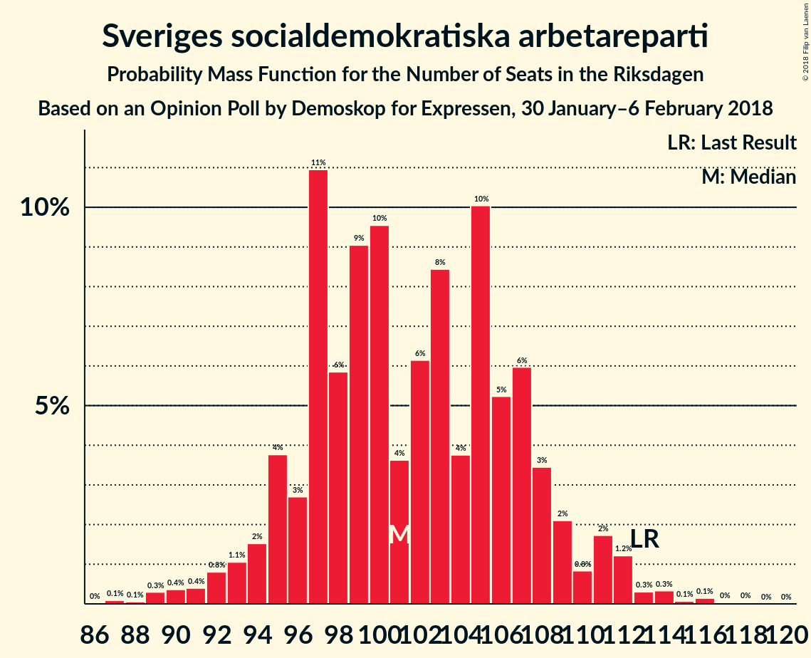
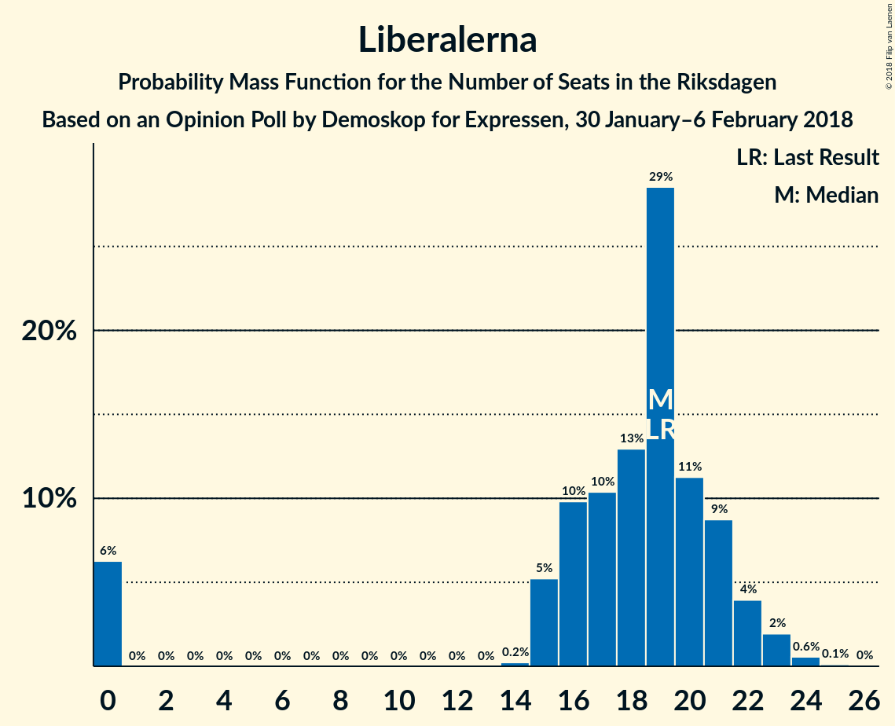

# Opinion Poll by Demoskop for Expressen, 30 January–6 February 2018

<a href="#voting-intentions">Voting Intentions</a> | <a href="#seats">Seats</a> | <a href="#coalitions">Coalitions</a> | <a href="#technical-information">Technical Information</a>

## Voting Intentions

### Confidence Intervals

| Party | Last Result | Poll Result | 80% Confidence Interval | 90% Confidence Interval | 95% Confidence Interval | 99% Confidence Interval |
|:-----:|:-----------:|:-----------:|:-----------------------:|:-----------------------:|:-----------------------:|:-----------------------:|
| Sveriges socialdemokratiska arbetareparti | 31.0% | 27.3% | 25.9–28.8% |25.5–29.2% |25.2–29.5% |24.5–30.2% |
| Moderata samlingspartiet | 23.3% | 23.9% | 22.6–25.3% |22.2–25.7% |21.9–26.0% |21.3–26.7% |
| Sverigedemokraterna | 12.9% | 15.4% | 14.3–16.6% |14.0–16.9% |13.7–17.2% |13.2–17.8% |
| Centerpartiet | 6.1% | 9.3% | 8.5–10.3% |8.2–10.6% |8.0–10.9% |7.6–11.3% |
| Vänsterpartiet | 5.7% | 7.2% | 6.5–8.1% |6.2–8.4% |6.1–8.6% |5.7–9.1% |
| Miljöpartiet de gröna | 6.9% | 5.1% | 4.5–5.9% |4.3–6.1% |4.1–6.3% |3.9–6.7% |
| Liberalerna | 5.4% | 4.9% | 4.3–5.6% |4.1–5.9% |3.9–6.1% |3.6–6.4% |
| Kristdemokraterna | 4.6% | 3.5% | 3.0–4.2% |2.9–4.4% |2.7–4.5% |2.5–4.9% |
| Feministiskt initiativ | 3.1% | 2.1% | 1.7–2.6% |1.6–2.8% |1.5–2.9% |1.3–3.2% |

*Note:* The poll result column reflects the actual value used in the calculations. Published results may vary slightly, and in addition be rounded to fewer digits.

## Seats

### Confidence Intervals

| Party | Last Result | Median | 80% Confidence Interval | 90% Confidence Interval | 95% Confidence Interval | 99% Confidence Interval |
|:-----:|:-----------:|:------:|:-----------------------:|:-----------------------:|:-----------------------:|:-----------------------:|
| <a href="#sveriges-socialdemokratiska-arbetareparti">Sveriges socialdemokratiska arbetareparti</a> | 113 | 105 | 95–107 |95–109 |94–109 |92–113 |
| <a href="#moderata-samlingspartiet">Moderata samlingspartiet</a> | 84 | 88 | 86–94 |82–97 |80–97 |77–99 |
| <a href="#sverigedemokraterna">Sverigedemokraterna</a> | 49 | 58 | 52–62 |52–62 |51–63 |48–67 |
| <a href="#centerpartiet">Centerpartiet</a> | 22 | 34 | 31–39 |30–39 |29–39 |29–41 |
| <a href="#vänsterpartiet">Vänsterpartiet</a> | 21 | 27 | 25–29 |23–30 |22–31 |22–34 |
| <a href="#miljöpartiet-de-gröna">Miljöpartiet de gröna</a> | 25 | 19 | 16–23 |16–23 |15–23 |0–25 |
| <a href="#liberalerna">Liberalerna</a> | 19 | 18 | 17–20 |16–21 |15–22 |0–24 |
| <a href="#kristdemokraterna">Kristdemokraterna</a> | 16 | 0 | 0–15 |0–16 |0–16 |0–17 |
| <a href="#feministiskt-initiativ">Feministiskt initiativ</a> | 0 | 0 | 0 |0 |0 |0 |

### Sveriges socialdemokratiska arbetareparti

*For a full overview of the results for this party, see the [Sveriges socialdemokratiska arbetareparti](party-sverigessocialdemokratiskaarbetareparti.html) page.*

| Number of Seats | Probability | Accumulated | Special Marks |
|:---------------:|:-----------:|:-----------:|:-------------:|
| 88 | 0% | 100% |  |
| 89 | 0.1% | 99.9% |  |
| 90 | 0.1% | 99.9% |  |
| 91 | 0% | 99.8% |  |
| 92 | 1.1% | 99.7% |  |
| 93 | 0.7% | 98.6% |  |
| 94 | 1.2% | 98% |  |
| 95 | 9% | 97% |  |
| 96 | 0.7% | 88% |  |
| 97 | 18% | 87% |  |
| 98 | 1.2% | 70% |  |
| 99 | 0.5% | 68% |  |
| 100 | 4% | 68% |  |
| 101 | 5% | 64% |  |
| 102 | 1.0% | 59% |  |
| 103 | 1.3% | 58% |  |
| 104 | 6% | 57% |  |
| 105 | 25% | 51% | Median |
| 106 | 1.4% | 26% |  |
| 107 | 15% | 25% |  |
| 108 | 1.1% | 9% |  |
| 109 | 6% | 8% |  |
| 110 | 0.2% | 2% |  |
| 111 | 1.2% | 2% |  |
| 112 | 0.1% | 0.6% |  |
| 113 | 0.2% | 0.5% | Last Result |
| 114 | 0.1% | 0.3% |  |
| 115 | 0% | 0.2% |  |
| 116 | 0.1% | 0.2% |  |
| 117 | 0% | 0% |  |

### Moderata samlingspartiet

*For a full overview of the results for this party, see the [Moderata samlingspartiet](party-moderatasamlingspartiet.html) page.*

| Number of Seats | Probability | Accumulated | Special Marks |
|:---------------:|:-----------:|:-----------:|:-------------:|
| 76 | 0.1% | 100% |  |
| 77 | 2% | 99.9% |  |
| 78 | 0% | 98% |  |
| 79 | 0.1% | 98% |  |
| 80 | 1.0% | 98% |  |
| 81 | 2% | 97% |  |
| 82 | 1.3% | 95% |  |
| 83 | 1.5% | 94% |  |
| 84 | 2% | 93% | Last Result |
| 85 | 0.8% | 91% |  |
| 86 | 5% | 90% |  |
| 87 | 24% | 85% |  |
| 88 | 13% | 61% | Median |
| 89 | 8% | 49% |  |
| 90 | 18% | 40% |  |
| 91 | 2% | 23% |  |
| 92 | 1.4% | 20% |  |
| 93 | 5% | 19% |  |
| 94 | 8% | 14% |  |
| 95 | 0.2% | 7% |  |
| 96 | 0.6% | 6% |  |
| 97 | 4% | 6% |  |
| 98 | 0.5% | 2% |  |
| 99 | 0.8% | 1.1% |  |
| 100 | 0.2% | 0.3% |  |
| 101 | 0% | 0.1% |  |
| 102 | 0% | 0.1% |  |
| 103 | 0% | 0% |  |

### Sverigedemokraterna

*For a full overview of the results for this party, see the [Sverigedemokraterna](party-sverigedemokraterna.html) page.*

| Number of Seats | Probability | Accumulated | Special Marks |
|:---------------:|:-----------:|:-----------:|:-------------:|
| 47 | 0.2% | 100% |  |
| 48 | 0.6% | 99.8% |  |
| 49 | 0.3% | 99.1% | Last Result |
| 50 | 1.1% | 98.8% |  |
| 51 | 0.7% | 98% |  |
| 52 | 15% | 97% |  |
| 53 | 4% | 82% |  |
| 54 | 1.1% | 78% |  |
| 55 | 7% | 77% |  |
| 56 | 5% | 70% |  |
| 57 | 6% | 65% |  |
| 58 | 10% | 59% | Median |
| 59 | 2% | 49% |  |
| 60 | 2% | 46% |  |
| 61 | 26% | 44% |  |
| 62 | 15% | 18% |  |
| 63 | 1.2% | 3% |  |
| 64 | 0.2% | 2% |  |
| 65 | 0.1% | 2% |  |
| 66 | 1.2% | 2% |  |
| 67 | 0.1% | 0.5% |  |
| 68 | 0.3% | 0.4% |  |
| 69 | 0% | 0.1% |  |
| 70 | 0% | 0.1% |  |
| 71 | 0.1% | 0.1% |  |
| 72 | 0% | 0% |  |

### Centerpartiet

*For a full overview of the results for this party, see the [Centerpartiet](party-centerpartiet.html) page.*

| Number of Seats | Probability | Accumulated | Special Marks |
|:---------------:|:-----------:|:-----------:|:-------------:|
| 22 | 0% | 100% | Last Result |
| 23 | 0% | 100% |  |
| 24 | 0% | 100% |  |
| 25 | 0% | 100% |  |
| 26 | 0% | 100% |  |
| 27 | 0.1% | 100% |  |
| 28 | 0.2% | 99.8% |  |
| 29 | 2% | 99.6% |  |
| 30 | 7% | 97% |  |
| 31 | 2% | 91% |  |
| 32 | 5% | 89% |  |
| 33 | 16% | 84% |  |
| 34 | 19% | 68% | Median |
| 35 | 7% | 48% |  |
| 36 | 25% | 41% |  |
| 37 | 2% | 16% |  |
| 38 | 1.0% | 13% |  |
| 39 | 10% | 12% |  |
| 40 | 0.8% | 2% |  |
| 41 | 1.0% | 1.3% |  |
| 42 | 0% | 0.3% |  |
| 43 | 0.2% | 0.3% |  |
| 44 | 0.1% | 0.1% |  |
| 45 | 0% | 0% |  |

### Vänsterpartiet

*For a full overview of the results for this party, see the [Vänsterpartiet](party-vänsterpartiet.html) page.*

| Number of Seats | Probability | Accumulated | Special Marks |
|:---------------:|:-----------:|:-----------:|:-------------:|
| 19 | 0.1% | 100% |  |
| 20 | 0.1% | 99.9% |  |
| 21 | 0.1% | 99.8% | Last Result |
| 22 | 3% | 99.7% |  |
| 23 | 3% | 97% |  |
| 24 | 3% | 94% |  |
| 25 | 34% | 91% |  |
| 26 | 5% | 57% |  |
| 27 | 20% | 52% | Median |
| 28 | 19% | 32% |  |
| 29 | 9% | 14% |  |
| 30 | 0.9% | 5% |  |
| 31 | 2% | 4% |  |
| 32 | 0.4% | 2% |  |
| 33 | 1.0% | 2% |  |
| 34 | 0.5% | 0.7% |  |
| 35 | 0% | 0.2% |  |
| 36 | 0.1% | 0.1% |  |
| 37 | 0% | 0% |  |

### Miljöpartiet de gröna

*For a full overview of the results for this party, see the [Miljöpartiet de gröna](party-miljöpartietdegröna.html) page.*

| Number of Seats | Probability | Accumulated | Special Marks |
|:---------------:|:-----------:|:-----------:|:-------------:|
| 0 | 2% | 100% |  |
| 1 | 0% | 98% |  |
| 2 | 0% | 98% |  |
| 3 | 0% | 98% |  |
| 4 | 0% | 98% |  |
| 5 | 0% | 98% |  |
| 6 | 0% | 98% |  |
| 7 | 0% | 98% |  |
| 8 | 0% | 98% |  |
| 9 | 0% | 98% |  |
| 10 | 0% | 98% |  |
| 11 | 0% | 98% |  |
| 12 | 0% | 98% |  |
| 13 | 0% | 98% |  |
| 14 | 0.1% | 98% |  |
| 15 | 0.5% | 98% |  |
| 16 | 8% | 97% |  |
| 17 | 25% | 90% |  |
| 18 | 1.4% | 65% |  |
| 19 | 20% | 63% | Median |
| 20 | 3% | 43% |  |
| 21 | 21% | 40% |  |
| 22 | 4% | 19% |  |
| 23 | 13% | 15% |  |
| 24 | 0.3% | 2% |  |
| 25 | 2% | 2% | Last Result |
| 26 | 0.2% | 0.2% |  |
| 27 | 0% | 0% |  |

### Liberalerna

*For a full overview of the results for this party, see the [Liberalerna](party-liberalerna.html) page.*

| Number of Seats | Probability | Accumulated | Special Marks |
|:---------------:|:-----------:|:-----------:|:-------------:|
| 0 | 2% | 100% |  |
| 1 | 0% | 98% |  |
| 2 | 0% | 98% |  |
| 3 | 0% | 98% |  |
| 4 | 0% | 98% |  |
| 5 | 0% | 98% |  |
| 6 | 0% | 98% |  |
| 7 | 0% | 98% |  |
| 8 | 0% | 98% |  |
| 9 | 0% | 98% |  |
| 10 | 0% | 98% |  |
| 11 | 0% | 98% |  |
| 12 | 0% | 98% |  |
| 13 | 0% | 98% |  |
| 14 | 0% | 98% |  |
| 15 | 0.6% | 98% |  |
| 16 | 3% | 97% |  |
| 17 | 17% | 94% |  |
| 18 | 39% | 77% | Median |
| 19 | 24% | 38% | Last Result |
| 20 | 7% | 14% |  |
| 21 | 4% | 7% |  |
| 22 | 2% | 3% |  |
| 23 | 0.3% | 1.3% |  |
| 24 | 0.8% | 1.0% |  |
| 25 | 0.1% | 0.1% |  |
| 26 | 0% | 0.1% |  |
| 27 | 0% | 0% |  |

### Kristdemokraterna

*For a full overview of the results for this party, see the [Kristdemokraterna](party-kristdemokraterna.html) page.*

| Number of Seats | Probability | Accumulated | Special Marks |
|:---------------:|:-----------:|:-----------:|:-------------:|
| 0 | 89% | 100% | Median |
| 1 | 0% | 11% |  |
| 2 | 0% | 11% |  |
| 3 | 0% | 11% |  |
| 4 | 0% | 11% |  |
| 5 | 0% | 11% |  |
| 6 | 0% | 11% |  |
| 7 | 0% | 11% |  |
| 8 | 0% | 11% |  |
| 9 | 0% | 11% |  |
| 10 | 0% | 11% |  |
| 11 | 0% | 11% |  |
| 12 | 0% | 11% |  |
| 13 | 0% | 11% |  |
| 14 | 0.2% | 11% |  |
| 15 | 5% | 10% |  |
| 16 | 4% | 5% | Last Result |
| 17 | 0.9% | 1.4% |  |
| 18 | 0.2% | 0.5% |  |
| 19 | 0.3% | 0.3% |  |
| 20 | 0% | 0% |  |

### Feministiskt initiativ

*For a full overview of the results for this party, see the [Feministiskt initiativ](party-feministisktinitiativ.html) page.*

| Number of Seats | Probability | Accumulated | Special Marks |
|:---------------:|:-----------:|:-----------:|:-------------:|
| 0 | 100% | 100% | Last Result, Median |

## Coalitions

### Confidence Intervals

| Coalition | Last Result | Median | Majority? | 80% Confidence Interval | 90% Confidence Interval | 95% Confidence Interval | 99% Confidence Interval |
|:---------:|:-----------:|:------:|:---------:|:-----------------------:|:-----------------------:|:-----------------------:|:-----------------------:|
| Sveriges socialdemokratiska arbetareparti – Vänsterpartiet – Miljöpartiet de gröna – Feministiskt initiativ | 159 | 147 | 0% | 139–156 | 139–157 | 135–157 | 133–161 |
| Sveriges socialdemokratiska arbetareparti – Vänsterpartiet – Miljöpartiet de gröna | 159 | 147 | 0% | 139–156 | 139–157 | 135–157 | 133–161 |
| Moderata samlingspartiet – Centerpartiet – Liberalerna – Kristdemokraterna | 141 | 141 | 0% | 137–152 | 137–153 | 133–157 | 125–160 |
| Moderata samlingspartiet – Centerpartiet – Liberalerna | 125 | 141 | 0% | 136–148 | 132–152 | 127–152 | 124–153 |
| Moderata samlingspartiet – Centerpartiet – Kristdemokraterna | 122 | 124 | 0% | 121–133 | 119–136 | 118–139 | 115–145 |
| Sveriges socialdemokratiska arbetareparti – Vänsterpartiet | 134 | 130 | 0% | 121–135 | 120–138 | 118–138 | 116–141 |
| Moderata samlingspartiet – Centerpartiet | 106 | 123 | 0% | 119–130 | 115–133 | 114–133 | 109–134 |

### Sveriges socialdemokratiska arbetareparti – Vänsterpartiet – Miljöpartiet de gröna – Feministiskt initiativ

| Number of Seats | Probability | Accumulated | Special Marks |
|:---------------:|:-----------:|:-----------:|:-------------:|
| 130 | 0.3% | 100% |  |
| 131 | 0% | 99.7% |  |
| 132 | 0% | 99.6% |  |
| 133 | 0.2% | 99.6% |  |
| 134 | 2% | 99.4% |  |
| 135 | 0.5% | 98% |  |
| 136 | 0.2% | 97% |  |
| 137 | 0.1% | 97% |  |
| 138 | 0.1% | 97% |  |
| 139 | 10% | 97% |  |
| 140 | 5% | 87% |  |
| 141 | 1.2% | 82% |  |
| 142 | 1.0% | 81% |  |
| 143 | 2% | 80% |  |
| 144 | 0.4% | 79% |  |
| 145 | 0.5% | 78% |  |
| 146 | 1.4% | 78% |  |
| 147 | 35% | 76% |  |
| 148 | 6% | 41% |  |
| 149 | 7% | 35% |  |
| 150 | 0.5% | 28% |  |
| 151 | 1.0% | 28% | Median |
| 152 | 0.2% | 27% |  |
| 153 | 0.6% | 26% |  |
| 154 | 2% | 26% |  |
| 155 | 0.9% | 24% |  |
| 156 | 15% | 23% |  |
| 157 | 6% | 8% |  |
| 158 | 0.1% | 2% |  |
| 159 | 0.6% | 2% | Last Result |
| 160 | 0% | 1.1% |  |
| 161 | 0.7% | 1.0% |  |
| 162 | 0% | 0.3% |  |
| 163 | 0.1% | 0.3% |  |
| 164 | 0.2% | 0.2% |  |
| 165 | 0% | 0% |  |

### Sveriges socialdemokratiska arbetareparti – Vänsterpartiet – Miljöpartiet de gröna

| Number of Seats | Probability | Accumulated | Special Marks |
|:---------------:|:-----------:|:-----------:|:-------------:|
| 130 | 0.3% | 100% |  |
| 131 | 0% | 99.7% |  |
| 132 | 0% | 99.6% |  |
| 133 | 0.2% | 99.6% |  |
| 134 | 2% | 99.4% |  |
| 135 | 0.5% | 98% |  |
| 136 | 0.2% | 97% |  |
| 137 | 0.1% | 97% |  |
| 138 | 0.1% | 97% |  |
| 139 | 10% | 97% |  |
| 140 | 5% | 87% |  |
| 141 | 1.2% | 82% |  |
| 142 | 1.0% | 81% |  |
| 143 | 2% | 80% |  |
| 144 | 0.4% | 79% |  |
| 145 | 0.5% | 78% |  |
| 146 | 1.4% | 78% |  |
| 147 | 35% | 76% |  |
| 148 | 6% | 41% |  |
| 149 | 7% | 35% |  |
| 150 | 0.5% | 28% |  |
| 151 | 1.0% | 28% | Median |
| 152 | 0.2% | 27% |  |
| 153 | 0.6% | 26% |  |
| 154 | 2% | 26% |  |
| 155 | 0.9% | 24% |  |
| 156 | 15% | 23% |  |
| 157 | 6% | 8% |  |
| 158 | 0.1% | 2% |  |
| 159 | 0.6% | 2% | Last Result |
| 160 | 0% | 1.1% |  |
| 161 | 0.7% | 1.0% |  |
| 162 | 0% | 0.3% |  |
| 163 | 0.1% | 0.3% |  |
| 164 | 0.2% | 0.2% |  |
| 165 | 0% | 0% |  |

### Moderata samlingspartiet – Centerpartiet – Liberalerna – Kristdemokraterna

| Number of Seats | Probability | Accumulated | Special Marks |
|:---------------:|:-----------:|:-----------:|:-------------:|
| 125 | 0.7% | 100% |  |
| 126 | 0.1% | 99.3% |  |
| 127 | 0.1% | 99.2% |  |
| 128 | 0% | 99.1% |  |
| 129 | 0.1% | 99.1% |  |
| 130 | 0.4% | 99.0% |  |
| 131 | 0.1% | 98.6% |  |
| 132 | 0.1% | 98.5% |  |
| 133 | 1.3% | 98% |  |
| 134 | 0.2% | 97% |  |
| 135 | 0.3% | 97% |  |
| 136 | 1.0% | 97% |  |
| 137 | 6% | 96% |  |
| 138 | 0.3% | 89% |  |
| 139 | 0.4% | 89% |  |
| 140 | 12% | 88% | Median |
| 141 | 37% | 76% | Last Result |
| 142 | 3% | 40% |  |
| 143 | 2% | 37% |  |
| 144 | 8% | 35% |  |
| 145 | 0.4% | 27% |  |
| 146 | 2% | 27% |  |
| 147 | 3% | 25% |  |
| 148 | 8% | 23% |  |
| 149 | 2% | 15% |  |
| 150 | 1.0% | 14% |  |
| 151 | 0.8% | 13% |  |
| 152 | 6% | 12% |  |
| 153 | 0.9% | 6% |  |
| 154 | 0.1% | 5% |  |
| 155 | 0.7% | 5% |  |
| 156 | 0.1% | 4% |  |
| 157 | 2% | 4% |  |
| 158 | 1.1% | 2% |  |
| 159 | 0.1% | 0.9% |  |
| 160 | 0.4% | 0.7% |  |
| 161 | 0.2% | 0.3% |  |
| 162 | 0% | 0.2% |  |
| 163 | 0% | 0.2% |  |
| 164 | 0.1% | 0.2% |  |
| 165 | 0% | 0% |  |

### Moderata samlingspartiet – Centerpartiet – Liberalerna

| Number of Seats | Probability | Accumulated | Special Marks |
|:---------------:|:-----------:|:-----------:|:-------------:|
| 120 | 0% | 100% |  |
| 121 | 0% | 99.9% |  |
| 122 | 0.1% | 99.9% |  |
| 123 | 0.1% | 99.9% |  |
| 124 | 0.4% | 99.8% |  |
| 125 | 0.7% | 99.4% | Last Result |
| 126 | 0.1% | 98.7% |  |
| 127 | 2% | 98.6% |  |
| 128 | 0.1% | 97% |  |
| 129 | 0.3% | 97% |  |
| 130 | 0.4% | 96% |  |
| 131 | 0.2% | 96% |  |
| 132 | 1.4% | 96% |  |
| 133 | 1.3% | 94% |  |
| 134 | 2% | 93% |  |
| 135 | 0.3% | 92% |  |
| 136 | 2% | 91% |  |
| 137 | 7% | 89% |  |
| 138 | 0.4% | 83% |  |
| 139 | 0.8% | 82% |  |
| 140 | 12% | 82% | Median |
| 141 | 37% | 70% |  |
| 142 | 3% | 33% |  |
| 143 | 2% | 29% |  |
| 144 | 8% | 28% |  |
| 145 | 0.8% | 20% |  |
| 146 | 1.3% | 19% |  |
| 147 | 2% | 18% |  |
| 148 | 6% | 15% |  |
| 149 | 0.6% | 9% |  |
| 150 | 1.0% | 8% |  |
| 151 | 0.5% | 7% |  |
| 152 | 6% | 7% |  |
| 153 | 0.9% | 1.1% |  |
| 154 | 0% | 0.2% |  |
| 155 | 0.1% | 0.2% |  |
| 156 | 0% | 0.1% |  |
| 157 | 0% | 0.1% |  |
| 158 | 0% | 0.1% |  |
| 159 | 0.1% | 0.1% |  |
| 160 | 0% | 0% |  |

### Moderata samlingspartiet – Centerpartiet – Kristdemokraterna

| Number of Seats | Probability | Accumulated | Special Marks |
|:---------------:|:-----------:|:-----------:|:-------------:|
| 110 | 0.1% | 100% |  |
| 111 | 0% | 99.9% |  |
| 112 | 0% | 99.9% |  |
| 113 | 0.1% | 99.9% |  |
| 114 | 0.1% | 99.8% |  |
| 115 | 1.2% | 99.6% |  |
| 116 | 0.2% | 98% |  |
| 117 | 0.5% | 98% |  |
| 118 | 0.9% | 98% |  |
| 119 | 6% | 97% |  |
| 120 | 0.3% | 91% |  |
| 121 | 14% | 91% |  |
| 122 | 1.3% | 77% | Last Result, Median |
| 123 | 22% | 75% |  |
| 124 | 17% | 53% |  |
| 125 | 6% | 36% |  |
| 126 | 3% | 31% |  |
| 127 | 0.6% | 27% |  |
| 128 | 4% | 27% |  |
| 129 | 1.2% | 23% |  |
| 130 | 5% | 21% |  |
| 131 | 2% | 16% |  |
| 132 | 2% | 14% |  |
| 133 | 6% | 12% |  |
| 134 | 0.4% | 6% |  |
| 135 | 0.1% | 6% |  |
| 136 | 1.4% | 6% |  |
| 137 | 0.2% | 4% |  |
| 138 | 0.5% | 4% |  |
| 139 | 1.3% | 3% |  |
| 140 | 1.0% | 2% |  |
| 141 | 0.4% | 1.1% |  |
| 142 | 0.1% | 0.7% |  |
| 143 | 0% | 0.6% |  |
| 144 | 0% | 0.6% |  |
| 145 | 0.1% | 0.6% |  |
| 146 | 0.3% | 0.5% |  |
| 147 | 0.1% | 0.2% |  |
| 148 | 0% | 0.1% |  |
| 149 | 0% | 0% |  |

### Sveriges socialdemokratiska arbetareparti – Vänsterpartiet

| Number of Seats | Probability | Accumulated | Special Marks |
|:---------------:|:-----------:|:-----------:|:-------------:|
| 114 | 0% | 100% |  |
| 115 | 0% | 99.9% |  |
| 116 | 0.7% | 99.9% |  |
| 117 | 0.3% | 99.2% |  |
| 118 | 2% | 98.9% |  |
| 119 | 0.6% | 97% |  |
| 120 | 6% | 96% |  |
| 121 | 1.2% | 90% |  |
| 122 | 3% | 89% |  |
| 123 | 1.2% | 86% |  |
| 124 | 16% | 85% |  |
| 125 | 1.2% | 69% |  |
| 126 | 0.4% | 68% |  |
| 127 | 5% | 68% |  |
| 128 | 3% | 62% |  |
| 129 | 4% | 59% |  |
| 130 | 26% | 55% |  |
| 131 | 1.0% | 29% |  |
| 132 | 2% | 28% | Median |
| 133 | 0.8% | 26% |  |
| 134 | 0.4% | 25% | Last Result |
| 135 | 15% | 25% |  |
| 136 | 0.6% | 10% |  |
| 137 | 0.5% | 9% |  |
| 138 | 6% | 8% |  |
| 139 | 1.1% | 2% |  |
| 140 | 0% | 1.3% |  |
| 141 | 0.9% | 1.3% |  |
| 142 | 0% | 0.4% |  |
| 143 | 0.2% | 0.3% |  |
| 144 | 0% | 0.1% |  |
| 145 | 0% | 0.1% |  |
| 146 | 0% | 0.1% |  |
| 147 | 0% | 0% |  |

### Moderata samlingspartiet – Centerpartiet

| Number of Seats | Probability | Accumulated | Special Marks |
|:---------------:|:-----------:|:-----------:|:-------------:|
| 106 | 0% | 100% | Last Result |
| 107 | 0.1% | 100% |  |
| 108 | 0% | 99.9% |  |
| 109 | 2% | 99.9% |  |
| 110 | 0.1% | 98% |  |
| 111 | 0.1% | 98% |  |
| 112 | 0.1% | 98% |  |
| 113 | 0.1% | 98% |  |
| 114 | 0.6% | 98% |  |
| 115 | 3% | 97% |  |
| 116 | 2% | 95% |  |
| 117 | 0.7% | 93% |  |
| 118 | 1.2% | 93% |  |
| 119 | 6% | 91% |  |
| 120 | 0.4% | 85% |  |
| 121 | 15% | 85% |  |
| 122 | 2% | 70% | Median |
| 123 | 23% | 68% |  |
| 124 | 17% | 45% |  |
| 125 | 6% | 28% |  |
| 126 | 4% | 22% |  |
| 127 | 0.7% | 19% |  |
| 128 | 4% | 18% |  |
| 129 | 0.9% | 14% |  |
| 130 | 5% | 13% |  |
| 131 | 2% | 9% |  |
| 132 | 0.6% | 7% |  |
| 133 | 6% | 6% |  |
| 134 | 0.2% | 0.5% |  |
| 135 | 0.1% | 0.3% |  |
| 136 | 0% | 0.2% |  |
| 137 | 0% | 0.2% |  |
| 138 | 0% | 0.2% |  |
| 139 | 0% | 0.1% |  |
| 140 | 0% | 0.1% |  |
| 141 | 0% | 0.1% |  |
| 142 | 0% | 0% |  |

## Technical Information

### Opinion Poll

+ **Polling firm:** Demoskop
+ **Commissioner(s):** Expressen
+ **Fieldwork period:** 30 January–6 February 2018

### Calculations

+ **Sample size:** 1619
+ **Simulations done:** 131,072
+ **Error estimate:** 2.47%

