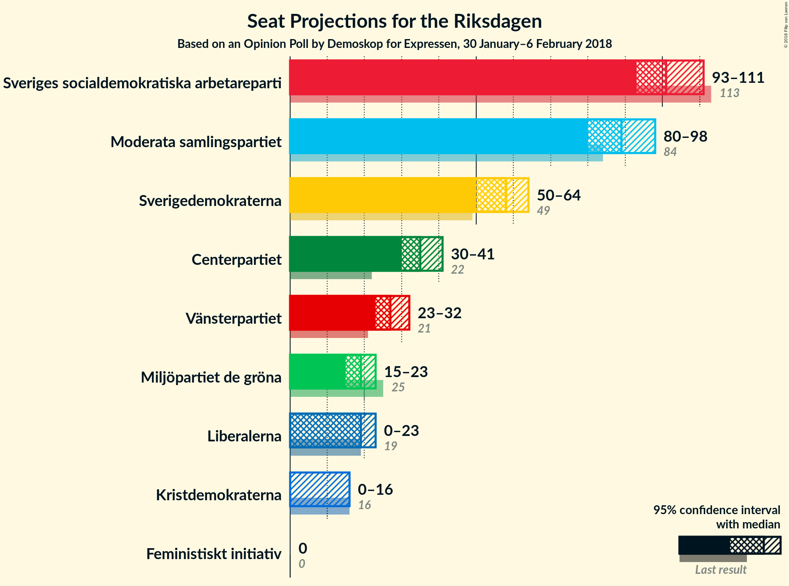
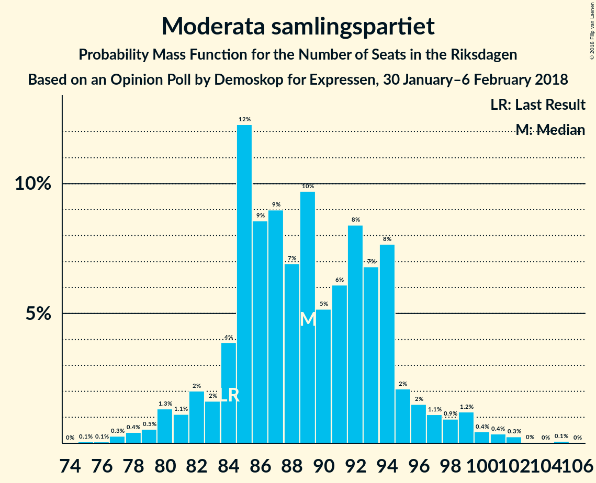
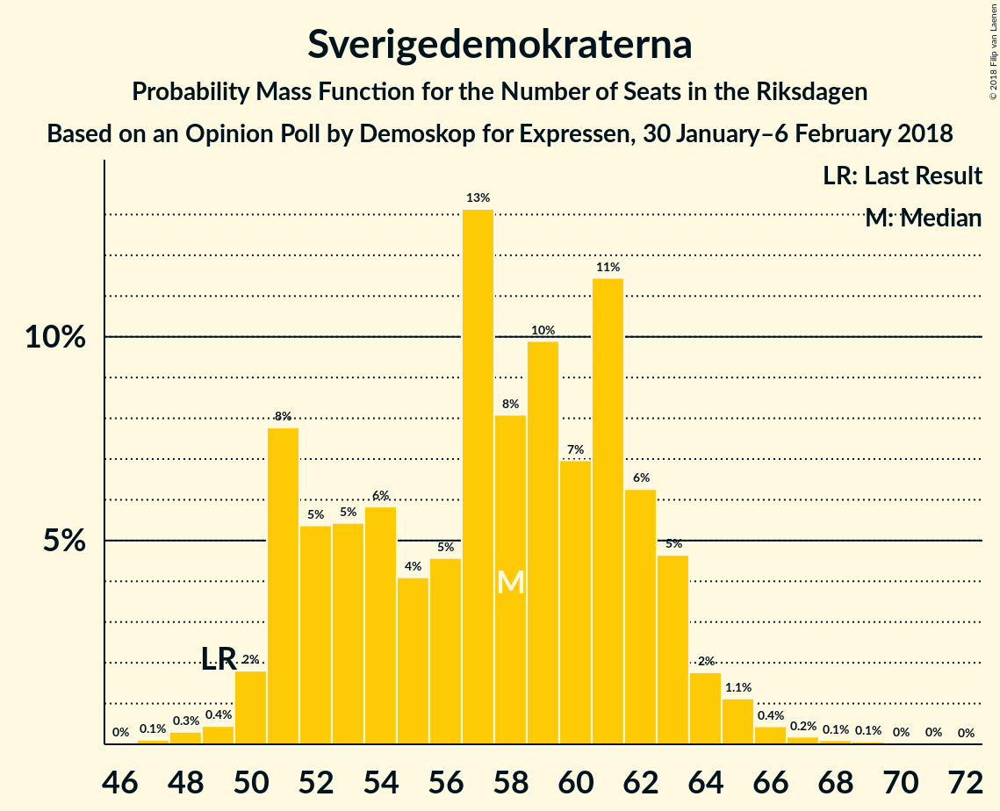
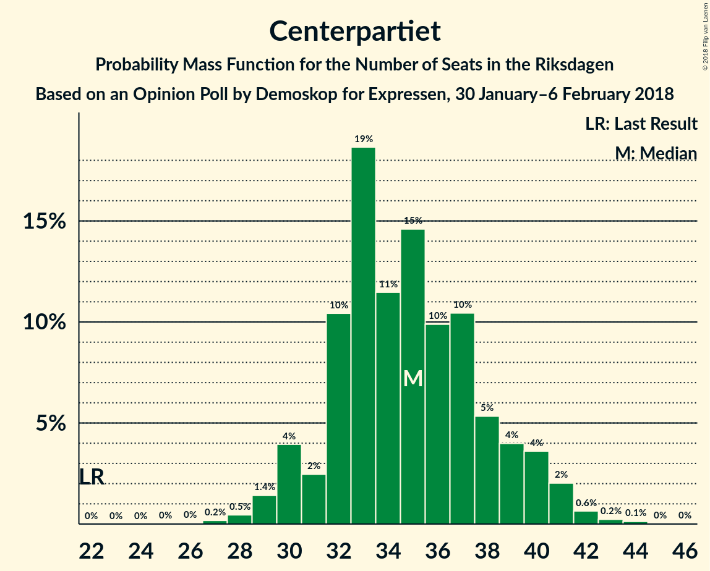
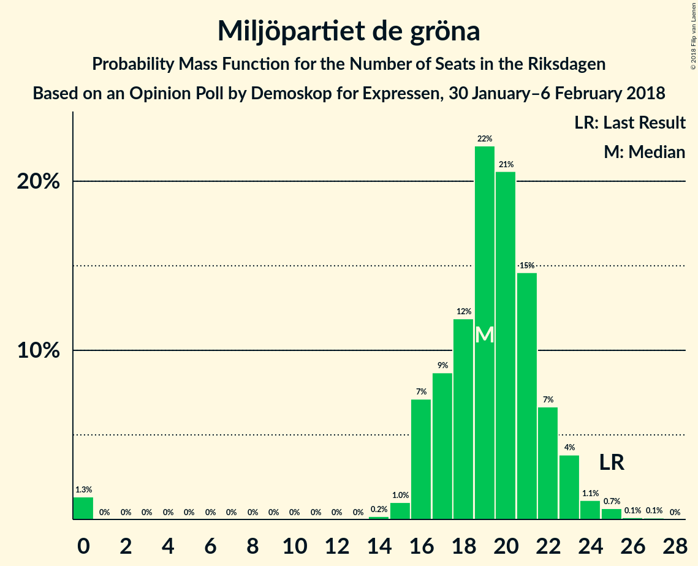
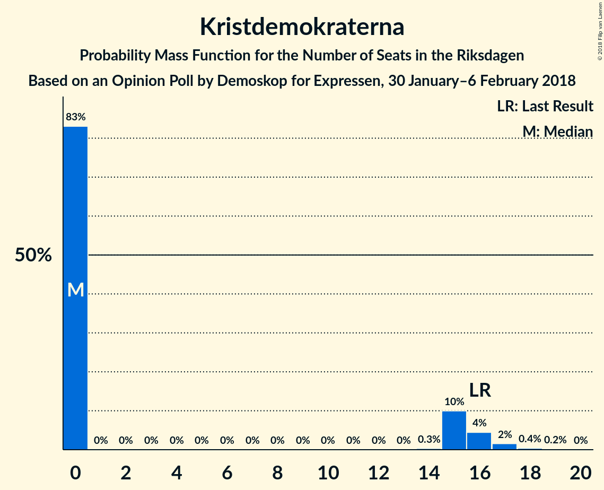
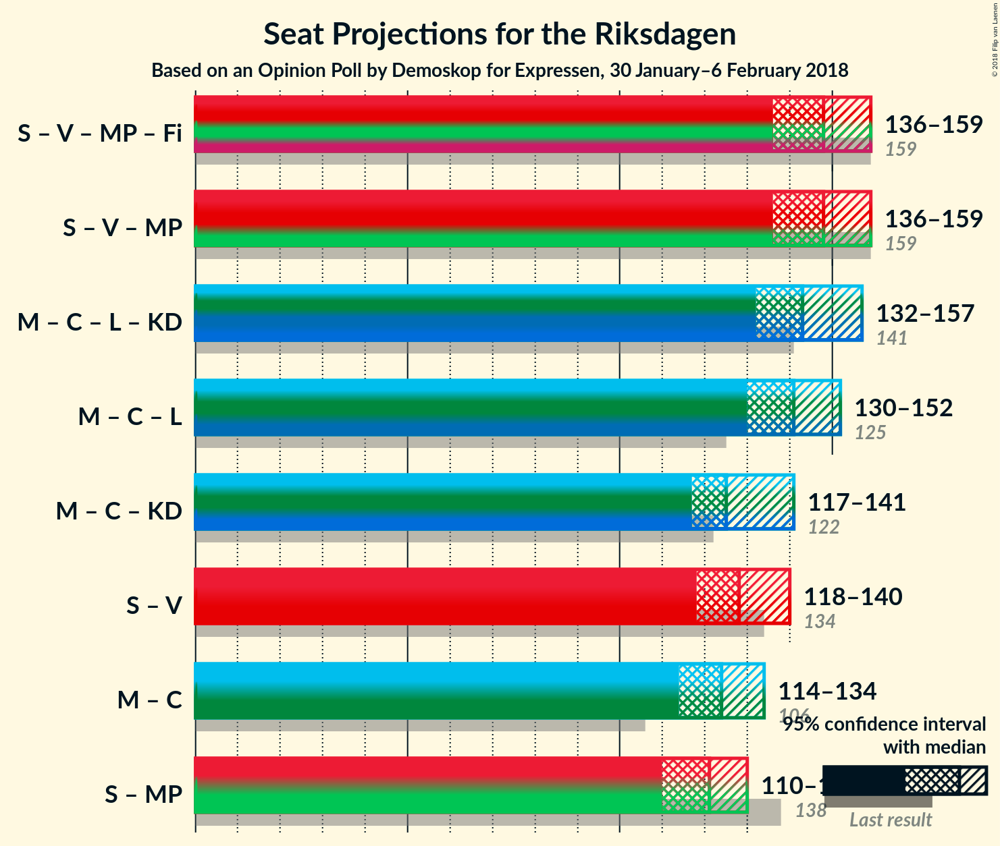

# Opinion Poll by Demoskop for Expressen, 30 January–6 February 2018

<a href="#voting-intentions">Voting Intentions</a> | <a href="#seats">Seats</a> | <a href="#coalitions">Coalitions</a> | <a href="#technical-information">Technical Information</a>

## Voting Intentions

### Confidence Intervals

| Party | Last Result | Poll Result | 80% Confidence Interval | 90% Confidence Interval | 95% Confidence Interval | 99% Confidence Interval |
|:-----:|:-----------:|:-----------:|:-----------------------:|:-----------------------:|:-----------------------:|:-----------------------:|
| Sveriges socialdemokratiska arbetareparti | 31.0% | 27.3% | 25.9–28.8% |25.5–29.2% |25.2–29.5% |24.5–30.2% |
| Moderata samlingspartiet | 23.3% | 23.9% | 22.6–25.3% |22.2–25.7% |21.9–26.0% |21.3–26.7% |
| Sverigedemokraterna | 12.9% | 15.4% | 14.3–16.6% |14.0–16.9% |13.7–17.2% |13.2–17.8% |
| Centerpartiet | 6.1% | 9.3% | 8.5–10.3% |8.2–10.6% |8.0–10.9% |7.6–11.3% |
| Vänsterpartiet | 5.7% | 7.2% | 6.5–8.1% |6.2–8.4% |6.1–8.6% |5.7–9.1% |
| Miljöpartiet de gröna | 6.9% | 5.1% | 4.5–5.9% |4.3–6.1% |4.1–6.3% |3.9–6.7% |
| Liberalerna | 5.4% | 4.9% | 4.3–5.6% |4.1–5.9% |3.9–6.1% |3.6–6.4% |
| Kristdemokraterna | 4.6% | 3.5% | 3.0–4.2% |2.9–4.4% |2.7–4.5% |2.5–4.9% |
| Feministiskt initiativ | 3.1% | 2.1% | 1.7–2.6% |1.6–2.8% |1.5–2.9% |1.3–3.2% |

*Note:* The poll result column reflects the actual value used in the calculations. Published results may vary slightly, and in addition be rounded to fewer digits.

## Seats

### Confidence Intervals

| Party | Last Result | Median | 80% Confidence Interval | 90% Confidence Interval | 95% Confidence Interval | 99% Confidence Interval |
|:-----:|:-----------:|:------:|:-----------------------:|:-----------------------:|:-----------------------:|:-----------------------:|
| <a href="#sveriges-socialdemokratiska-arbetareparti">Sveriges socialdemokratiska arbetareparti</a> | 113 | 101 | 96–108 |95–109 |93–111 |90–114 |
| <a href="#moderata-samlingspartiet">Moderata samlingspartiet</a> | 84 | 89 | 84–94 |82–96 |80–98 |78–101 |
| <a href="#sverigedemokraterna">Sverigedemokraterna</a> | 49 | 58 | 51–62 |51–63 |50–64 |49–66 |
| <a href="#centerpartiet">Centerpartiet</a> | 22 | 35 | 32–39 |30–40 |30–41 |28–42 |
| <a href="#vänsterpartiet">Vänsterpartiet</a> | 21 | 27 | 24–30 |23–31 |23–32 |21–34 |
| <a href="#miljöpartiet-de-gröna">Miljöpartiet de gröna</a> | 25 | 19 | 17–22 |16–23 |15–23 |0–25 |
| <a href="#liberalerna">Liberalerna</a> | 19 | 19 | 15–21 |0–22 |0–23 |0–24 |
| <a href="#kristdemokraterna">Kristdemokraterna</a> | 16 | 0 | 0–15 |0–16 |0–16 |0–18 |
| <a href="#feministiskt-initiativ">Feministiskt initiativ</a> | 0 | 0 | 0 |0 |0 |0 |

### Sveriges socialdemokratiska arbetareparti

*For a full overview of the results for this party, see the [Sveriges socialdemokratiska arbetareparti](party-sverigessocialdemokratiskaarbetareparti.html) page.*

| Number of Seats | Probability | Accumulated | Special Marks |
|:---------------:|:-----------:|:-----------:|:-------------:|
| 87 | 0.1% | 100% |  |
| 88 | 0.1% | 99.9% |  |
| 89 | 0.3% | 99.8% |  |
| 90 | 0.4% | 99.5% |  |
| 91 | 0.4% | 99.2% |  |
| 92 | 0.8% | 98.8% |  |
| 93 | 1.1% | 98% |  |
| 94 | 2% | 97% |  |
| 95 | 4% | 95% |  |
| 96 | 3% | 92% |  |
| 97 | 11% | 89% |  |
| 98 | 6% | 78% |  |
| 99 | 9% | 72% |  |
| 100 | 10% | 63% |  |
| 101 | 4% | 54% | Median |
| 102 | 6% | 50% |  |
| 103 | 8% | 44% |  |
| 104 | 4% | 35% |  |
| 105 | 10% | 32% |  |
| 106 | 5% | 21% |  |
| 107 | 6% | 16% |  |
| 108 | 3% | 10% |  |
| 109 | 2% | 7% |  |
| 110 | 0.8% | 5% |  |
| 111 | 2% | 4% |  |
| 112 | 1.2% | 2% |  |
| 113 | 0.3% | 0.9% | Last Result |
| 114 | 0.3% | 0.6% |  |
| 115 | 0.1% | 0.3% |  |
| 116 | 0.1% | 0.2% |  |
| 117 | 0% | 0.1% |  |
| 118 | 0% | 0.1% |  |
| 119 | 0% | 0% |  |

### Moderata samlingspartiet

*For a full overview of the results for this party, see the [Moderata samlingspartiet](party-moderatasamlingspartiet.html) page.*

| Number of Seats | Probability | Accumulated | Special Marks |
|:---------------:|:-----------:|:-----------:|:-------------:|
| 75 | 0.1% | 100% |  |
| 76 | 0.1% | 99.9% |  |
| 77 | 0.3% | 99.9% |  |
| 78 | 0.4% | 99.6% |  |
| 79 | 0.5% | 99.2% |  |
| 80 | 1.3% | 98.6% |  |
| 81 | 1.1% | 97% |  |
| 82 | 2% | 96% |  |
| 83 | 2% | 94% |  |
| 84 | 4% | 93% | Last Result |
| 85 | 12% | 89% |  |
| 86 | 9% | 76% |  |
| 87 | 9% | 68% |  |
| 88 | 7% | 59% |  |
| 89 | 10% | 52% | Median |
| 90 | 5% | 42% |  |
| 91 | 6% | 37% |  |
| 92 | 8% | 31% |  |
| 93 | 7% | 23% |  |
| 94 | 8% | 16% |  |
| 95 | 2% | 8% |  |
| 96 | 2% | 6% |  |
| 97 | 1.1% | 4% |  |
| 98 | 0.9% | 3% |  |
| 99 | 1.2% | 2% |  |
| 100 | 0.4% | 1.2% |  |
| 101 | 0.4% | 0.8% |  |
| 102 | 0.3% | 0.4% |  |
| 103 | 0% | 0.1% |  |
| 104 | 0% | 0.1% |  |
| 105 | 0.1% | 0.1% |  |
| 106 | 0% | 0% |  |

### Sverigedemokraterna

*For a full overview of the results for this party, see the [Sverigedemokraterna](party-sverigedemokraterna.html) page.*

| Number of Seats | Probability | Accumulated | Special Marks |
|:---------------:|:-----------:|:-----------:|:-------------:|
| 47 | 0.1% | 100% |  |
| 48 | 0.3% | 99.8% |  |
| 49 | 0.4% | 99.5% | Last Result |
| 50 | 2% | 99.1% |  |
| 51 | 8% | 97% |  |
| 52 | 5% | 90% |  |
| 53 | 5% | 84% |  |
| 54 | 6% | 79% |  |
| 55 | 4% | 73% |  |
| 56 | 5% | 69% |  |
| 57 | 13% | 64% |  |
| 58 | 8% | 51% | Median |
| 59 | 10% | 43% |  |
| 60 | 7% | 33% |  |
| 61 | 11% | 26% |  |
| 62 | 6% | 15% |  |
| 63 | 5% | 8% |  |
| 64 | 2% | 4% |  |
| 65 | 1.1% | 2% |  |
| 66 | 0.4% | 0.9% |  |
| 67 | 0.2% | 0.4% |  |
| 68 | 0.1% | 0.2% |  |
| 69 | 0.1% | 0.1% |  |
| 70 | 0% | 0.1% |  |
| 71 | 0% | 0% |  |

### Centerpartiet

*For a full overview of the results for this party, see the [Centerpartiet](party-centerpartiet.html) page.*

| Number of Seats | Probability | Accumulated | Special Marks |
|:---------------:|:-----------:|:-----------:|:-------------:|
| 22 | 0% | 100% | Last Result |
| 23 | 0% | 100% |  |
| 24 | 0% | 100% |  |
| 25 | 0% | 100% |  |
| 26 | 0% | 100% |  |
| 27 | 0.2% | 99.9% |  |
| 28 | 0.5% | 99.8% |  |
| 29 | 1.4% | 99.3% |  |
| 30 | 4% | 98% |  |
| 31 | 2% | 94% |  |
| 32 | 10% | 91% |  |
| 33 | 19% | 81% |  |
| 34 | 11% | 62% |  |
| 35 | 15% | 51% | Median |
| 36 | 10% | 36% |  |
| 37 | 10% | 26% |  |
| 38 | 5% | 16% |  |
| 39 | 4% | 11% |  |
| 40 | 4% | 7% |  |
| 41 | 2% | 3% |  |
| 42 | 0.6% | 1.1% |  |
| 43 | 0.2% | 0.4% |  |
| 44 | 0.1% | 0.2% |  |
| 45 | 0% | 0% |  |

### Vänsterpartiet

*For a full overview of the results for this party, see the [Vänsterpartiet](party-vänsterpartiet.html) page.*

| Number of Seats | Probability | Accumulated | Special Marks |
|:---------------:|:-----------:|:-----------:|:-------------:|
| 20 | 0.2% | 100% |  |
| 21 | 0.4% | 99.8% | Last Result |
| 22 | 2% | 99.4% |  |
| 23 | 5% | 98% |  |
| 24 | 10% | 93% |  |
| 25 | 11% | 83% |  |
| 26 | 19% | 72% |  |
| 27 | 13% | 53% | Median |
| 28 | 9% | 40% |  |
| 29 | 14% | 31% |  |
| 30 | 9% | 17% |  |
| 31 | 5% | 8% |  |
| 32 | 2% | 4% |  |
| 33 | 1.4% | 2% |  |
| 34 | 0.5% | 0.6% |  |
| 35 | 0.1% | 0.1% |  |
| 36 | 0.1% | 0.1% |  |
| 37 | 0% | 0% |  |

### Miljöpartiet de gröna

*For a full overview of the results for this party, see the [Miljöpartiet de gröna](party-miljöpartietdegröna.html) page.*

| Number of Seats | Probability | Accumulated | Special Marks |
|:---------------:|:-----------:|:-----------:|:-------------:|
| 0 | 1.3% | 100% |  |
| 1 | 0% | 98.7% |  |
| 2 | 0% | 98.7% |  |
| 3 | 0% | 98.7% |  |
| 4 | 0% | 98.7% |  |
| 5 | 0% | 98.7% |  |
| 6 | 0% | 98.7% |  |
| 7 | 0% | 98.7% |  |
| 8 | 0% | 98.7% |  |
| 9 | 0% | 98.7% |  |
| 10 | 0% | 98.7% |  |
| 11 | 0% | 98.7% |  |
| 12 | 0% | 98.7% |  |
| 13 | 0% | 98.7% |  |
| 14 | 0.2% | 98.7% |  |
| 15 | 1.0% | 98% |  |
| 16 | 7% | 97% |  |
| 17 | 9% | 90% |  |
| 18 | 12% | 82% |  |
| 19 | 22% | 70% | Median |
| 20 | 21% | 48% |  |
| 21 | 15% | 27% |  |
| 22 | 7% | 12% |  |
| 23 | 4% | 6% |  |
| 24 | 1.1% | 2% |  |
| 25 | 0.7% | 0.9% | Last Result |
| 26 | 0.1% | 0.2% |  |
| 27 | 0.1% | 0.1% |  |
| 28 | 0% | 0% |  |

### Liberalerna

*For a full overview of the results for this party, see the [Liberalerna](party-liberalerna.html) page.*

| Number of Seats | Probability | Accumulated | Special Marks |
|:---------------:|:-----------:|:-----------:|:-------------:|
| 0 | 6% | 100% |  |
| 1 | 0% | 94% |  |
| 2 | 0% | 94% |  |
| 3 | 0% | 94% |  |
| 4 | 0% | 94% |  |
| 5 | 0% | 94% |  |
| 6 | 0% | 94% |  |
| 7 | 0% | 94% |  |
| 8 | 0% | 94% |  |
| 9 | 0% | 94% |  |
| 10 | 0% | 94% |  |
| 11 | 0% | 94% |  |
| 12 | 0% | 94% |  |
| 13 | 0% | 94% |  |
| 14 | 0.2% | 94% |  |
| 15 | 5% | 94% |  |
| 16 | 10% | 88% |  |
| 17 | 10% | 78% |  |
| 18 | 13% | 68% |  |
| 19 | 29% | 55% | Last Result, Median |
| 20 | 11% | 27% |  |
| 21 | 9% | 15% |  |
| 22 | 4% | 7% |  |
| 23 | 2% | 3% |  |
| 24 | 0.6% | 0.7% |  |
| 25 | 0.1% | 0.2% |  |
| 26 | 0% | 0% |  |

### Kristdemokraterna

*For a full overview of the results for this party, see the [Kristdemokraterna](party-kristdemokraterna.html) page.*

| Number of Seats | Probability | Accumulated | Special Marks |
|:---------------:|:-----------:|:-----------:|:-------------:|
| 0 | 83% | 100% | Median |
| 1 | 0% | 17% |  |
| 2 | 0% | 17% |  |
| 3 | 0% | 17% |  |
| 4 | 0% | 17% |  |
| 5 | 0% | 17% |  |
| 6 | 0% | 17% |  |
| 7 | 0% | 17% |  |
| 8 | 0% | 17% |  |
| 9 | 0% | 17% |  |
| 10 | 0% | 17% |  |
| 11 | 0% | 17% |  |
| 12 | 0% | 17% |  |
| 13 | 0% | 17% |  |
| 14 | 0.3% | 17% |  |
| 15 | 10% | 17% |  |
| 16 | 4% | 7% | Last Result |
| 17 | 2% | 2% |  |
| 18 | 0.4% | 0.6% |  |
| 19 | 0.2% | 0.2% |  |
| 20 | 0% | 0% |  |

### Feministiskt initiativ

*For a full overview of the results for this party, see the [Feministiskt initiativ](party-feministisktinitiativ.html) page.*

| Number of Seats | Probability | Accumulated | Special Marks |
|:---------------:|:-----------:|:-----------:|:-------------:|
| 0 | 100% | 100% | Last Result, Median |

## Coalitions

### Confidence Intervals

| Coalition | Last Result | Median | Majority? | 80% Confidence Interval | 90% Confidence Interval | 95% Confidence Interval | 99% Confidence Interval |
|:---------:|:-----------:|:------:|:---------:|:-----------------------:|:-----------------------:|:-----------------------:|:-----------------------:|
| Sveriges socialdemokratiska arbetareparti – Vänsterpartiet – Miljöpartiet de gröna – Feministiskt initiativ | 159 | 148 | 0% | 140–156 | 139–157 | 136–159 | 132–162 |
| Sveriges socialdemokratiska arbetareparti – Vänsterpartiet – Miljöpartiet de gröna | 159 | 148 | 0% | 140–156 | 139–157 | 136–159 | 132–162 |
| Moderata samlingspartiet – Centerpartiet – Liberalerna – Kristdemokraterna | 141 | 143 | 0% | 137–152 | 134–155 | 132–157 | 126–160 |
| Moderata samlingspartiet – Centerpartiet – Liberalerna | 125 | 141 | 0% | 134–148 | 132–150 | 130–152 | 125–154 |
| Moderata samlingspartiet – Centerpartiet – Kristdemokraterna | 122 | 125 | 0% | 119–135 | 118–138 | 117–141 | 114–144 |
| Sveriges socialdemokratiska arbetareparti – Vänsterpartiet | 134 | 128 | 0% | 122–136 | 120–138 | 118–140 | 116–143 |
| Moderata samlingspartiet – Centerpartiet | 106 | 124 | 0% | 118–130 | 116–133 | 114–134 | 111–138 |
| Sveriges socialdemokratiska arbetareparti – Miljöpartiet de gröna | 138 | 121 | 0% | 115–127 | 112–129 | 110–130 | 104–134 |

