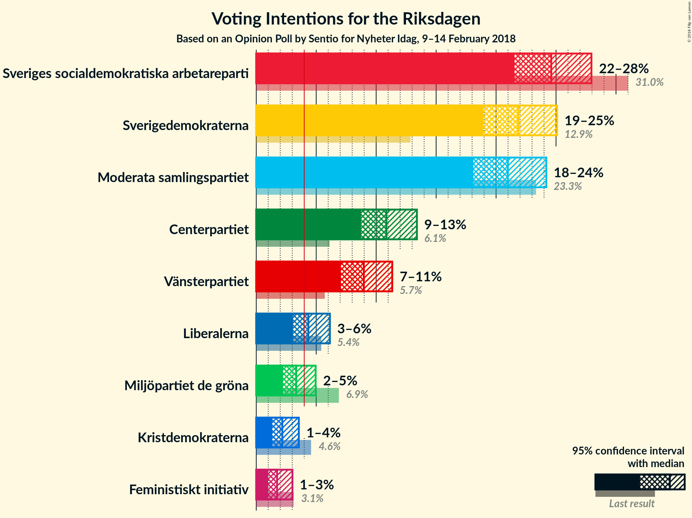

# Opinion Poll by Sentio for Nyheter Idag, 9–14 February 2018

<a href="#voting-intentions">Voting Intentions</a> | <a href="#seats">Seats</a> | <a href="#coalitions">Coalitions</a> | <a href="#technical-information">Technical Information</a>

## Voting Intentions

### Confidence Intervals

| Party | Last Result | Poll Result | 80% Confidence Interval | 90% Confidence Interval | 95% Confidence Interval | 99% Confidence Interval |
|:-----:|:-----------:|:-----------:|:-----------------------:|:-----------------------:|:-----------------------:|:-----------------------:|
| Sveriges socialdemokratiska arbetareparti | 31.0% | 24.6% | 22.2–27.2% |21.0–28.4% |21.0–28.4% |19.8–29.6% |
| Sverigedemokraterna | 12.9% | 21.9% | 19.8–24.7% |18.5–24.7% |18.5–25.9% |17.3–27.2% |
| Moderata samlingspartiet | 23.3% | 21.0% | 18.5–23.5% |18.5–24.7% |17.3–24.7% |17.3–25.9% |
| Centerpartiet | 6.1% | 10.9% | 8.6–13.6% |8.6–13.6% |8.6–13.6% |7.4–14.8% |
| Vänsterpartiet | 5.7% | 9.0% | 7.4–11.1% |7.4–11.1% |6.2–12.3% |6.2–12.3% |
| Liberalerna | 5.4% | 4.3% | 2.5–6.2% |2.5–6.2% |2.5–6.2% |2.5–7.4% |
| Miljöpartiet de gröna | 6.9% | 3.3% | 2.5–4.9% |2.5–4.9% |2.5–4.9% |1.2–6.2% |
| Kristdemokraterna | 4.6% | 2.2% | 1.2–3.7% |1.2–3.7% |1.2–3.7% |1.2–4.9% |
| Feministiskt initiativ | 3.1% | 1.7% | 1.2–2.5% |1.2–3.7% |1.2–3.7% |0.0–3.7% |

*Note:* The poll result column reflects the actual value used in the calculations. Published results may vary slightly, and in addition be rounded to fewer digits.

## Seats

### Confidence Intervals

| Party | Last Result | Median | 80% Confidence Interval | 90% Confidence Interval | 95% Confidence Interval | 99% Confidence Interval |
|:-----:|:-----------:|:------:|:-----------------------:|:-----------------------:|:-----------------------:|:-----------------------:|
| <a href="#sveriges-socialdemokratiska-arbetareparti">Sveriges socialdemokratiska arbetareparti</a> | 113 | 99 | 86–102 |83–102 |81–103 |79–109 |
| <a href="#sverigedemokraterna">Sverigedemokraterna</a> | 49 | 83 | 77–88 |74–90 |73–92 |70–97 |
| <a href="#moderata-samlingspartiet">Moderata samlingspartiet</a> | 84 | 77 | 73–89 |72–91 |71–94 |66–98 |
| <a href="#centerpartiet">Centerpartiet</a> | 22 | 41 | 36–45 |35–47 |33–49 |31–54 |
| <a href="#vänsterpartiet">Vänsterpartiet</a> | 21 | 35 | 30–40 |29–42 |27–43 |25–46 |
| <a href="#liberalerna">Liberalerna</a> | 19 | 16 | 0–20 |0–21 |0–22 |0–25 |
| <a href="#miljöpartiet-de-gröna">Miljöpartiet de gröna</a> | 25 | 0 | 0–15 |0–17 |0–18 |0–21 |
| <a href="#kristdemokraterna">Kristdemokraterna</a> | 16 | 0 | 0 |0 |0 |0 |
| <a href="#feministiskt-initiativ">Feministiskt initiativ</a> | 0 | 0 | 0 |0 |0 |0 |

### Sveriges socialdemokratiska arbetareparti

*For a full overview of the results for this party, see the [Sveriges socialdemokratiska arbetareparti](party-sverigessocialdemokratiskaarbetareparti.html) page.*

| Number of Seats | Probability | Accumulated | Special Marks |
|:---------------:|:-----------:|:-----------:|:-------------:|
| 73 | 0% | 100% |  |
| 74 | 0.1% | 99.9% |  |
| 75 | 0% | 99.9% |  |
| 76 | 0% | 99.9% |  |
| 77 | 0.1% | 99.8% |  |
| 78 | 0.2% | 99.7% |  |
| 79 | 0.1% | 99.5% |  |
| 80 | 0.7% | 99.4% |  |
| 81 | 3% | 98.8% |  |
| 82 | 0.2% | 96% |  |
| 83 | 1.0% | 96% |  |
| 84 | 0.4% | 95% |  |
| 85 | 1.4% | 95% |  |
| 86 | 4% | 93% |  |
| 87 | 2% | 89% |  |
| 88 | 2% | 88% |  |
| 89 | 3% | 86% |  |
| 90 | 4% | 84% |  |
| 91 | 0.8% | 80% |  |
| 92 | 6% | 79% |  |
| 93 | 5% | 73% |  |
| 94 | 4% | 68% |  |
| 95 | 2% | 64% |  |
| 96 | 3% | 63% |  |
| 97 | 2% | 59% |  |
| 98 | 0.6% | 57% |  |
| 99 | 22% | 56% | Median |
| 100 | 6% | 34% |  |
| 101 | 14% | 28% |  |
| 102 | 9% | 13% |  |
| 103 | 2% | 4% |  |
| 104 | 0.5% | 2% |  |
| 105 | 0.2% | 2% |  |
| 106 | 0.3% | 2% |  |
| 107 | 0.2% | 1.2% |  |
| 108 | 0.3% | 1.1% |  |
| 109 | 0.5% | 0.8% |  |
| 110 | 0.1% | 0.3% |  |
| 111 | 0% | 0.2% |  |
| 112 | 0% | 0.2% |  |
| 113 | 0.1% | 0.1% | Last Result |
| 114 | 0% | 0.1% |  |
| 115 | 0% | 0.1% |  |
| 116 | 0% | 0.1% |  |
| 117 | 0% | 0.1% |  |
| 118 | 0% | 0% |  |

### Sverigedemokraterna

*For a full overview of the results for this party, see the [Sverigedemokraterna](party-sverigedemokraterna.html) page.*

| Number of Seats | Probability | Accumulated | Special Marks |
|:---------------:|:-----------:|:-----------:|:-------------:|
| 49 | 0% | 100% | Last Result |
| 50 | 0% | 100% |  |
| 51 | 0% | 100% |  |
| 52 | 0% | 100% |  |
| 53 | 0% | 100% |  |
| 54 | 0% | 100% |  |
| 55 | 0% | 100% |  |
| 56 | 0% | 100% |  |
| 57 | 0% | 100% |  |
| 58 | 0% | 100% |  |
| 59 | 0% | 100% |  |
| 60 | 0% | 100% |  |
| 61 | 0% | 100% |  |
| 62 | 0% | 100% |  |
| 63 | 0% | 100% |  |
| 64 | 0% | 100% |  |
| 65 | 0% | 99.9% |  |
| 66 | 0.1% | 99.9% |  |
| 67 | 0.1% | 99.8% |  |
| 68 | 0.1% | 99.7% |  |
| 69 | 0.1% | 99.7% |  |
| 70 | 0.5% | 99.5% |  |
| 71 | 0.7% | 99.1% |  |
| 72 | 0.3% | 98% |  |
| 73 | 2% | 98% |  |
| 74 | 2% | 96% |  |
| 75 | 2% | 94% |  |
| 76 | 0.7% | 92% |  |
| 77 | 7% | 92% |  |
| 78 | 22% | 85% |  |
| 79 | 0.5% | 63% |  |
| 80 | 5% | 63% |  |
| 81 | 6% | 58% |  |
| 82 | 1.1% | 52% |  |
| 83 | 9% | 51% | Median |
| 84 | 5% | 42% |  |
| 85 | 10% | 37% |  |
| 86 | 13% | 26% |  |
| 87 | 3% | 14% |  |
| 88 | 5% | 11% |  |
| 89 | 1.1% | 6% |  |
| 90 | 1.4% | 5% |  |
| 91 | 0.3% | 4% |  |
| 92 | 1.2% | 4% |  |
| 93 | 0.3% | 2% |  |
| 94 | 0.5% | 2% |  |
| 95 | 0.3% | 2% |  |
| 96 | 0.7% | 1.3% |  |
| 97 | 0.3% | 0.6% |  |
| 98 | 0% | 0.4% |  |
| 99 | 0% | 0.3% |  |
| 100 | 0.1% | 0.3% |  |
| 101 | 0.1% | 0.2% |  |
| 102 | 0% | 0.1% |  |
| 103 | 0% | 0.1% |  |
| 104 | 0% | 0.1% |  |
| 105 | 0% | 0.1% |  |
| 106 | 0% | 0.1% |  |
| 107 | 0% | 0.1% |  |
| 108 | 0% | 0.1% |  |
| 109 | 0% | 0% |  |

### Moderata samlingspartiet

*For a full overview of the results for this party, see the [Moderata samlingspartiet](party-moderatasamlingspartiet.html) page.*

| Number of Seats | Probability | Accumulated | Special Marks |
|:---------------:|:-----------:|:-----------:|:-------------:|
| 61 | 0% | 100% |  |
| 62 | 0% | 99.9% |  |
| 63 | 0% | 99.9% |  |
| 64 | 0.1% | 99.9% |  |
| 65 | 0.2% | 99.8% |  |
| 66 | 0.1% | 99.6% |  |
| 67 | 0.2% | 99.5% |  |
| 68 | 0.3% | 99.3% |  |
| 69 | 0.4% | 99.0% |  |
| 70 | 0.8% | 98.6% |  |
| 71 | 3% | 98% |  |
| 72 | 2% | 95% |  |
| 73 | 12% | 94% |  |
| 74 | 3% | 82% |  |
| 75 | 2% | 79% |  |
| 76 | 1.0% | 77% |  |
| 77 | 33% | 76% | Median |
| 78 | 2% | 43% |  |
| 79 | 3% | 40% |  |
| 80 | 3% | 38% |  |
| 81 | 7% | 35% |  |
| 82 | 4% | 28% |  |
| 83 | 0.9% | 24% |  |
| 84 | 1.1% | 23% | Last Result |
| 85 | 0.8% | 22% |  |
| 86 | 2% | 21% |  |
| 87 | 4% | 19% |  |
| 88 | 3% | 15% |  |
| 89 | 3% | 12% |  |
| 90 | 2% | 8% |  |
| 91 | 2% | 6% |  |
| 92 | 0.2% | 4% |  |
| 93 | 1.2% | 4% |  |
| 94 | 2% | 3% |  |
| 95 | 0.5% | 1.2% |  |
| 96 | 0% | 0.7% |  |
| 97 | 0% | 0.7% |  |
| 98 | 0.6% | 0.7% |  |
| 99 | 0% | 0.1% |  |
| 100 | 0% | 0.1% |  |
| 101 | 0% | 0.1% |  |
| 102 | 0% | 0.1% |  |
| 103 | 0% | 0% |  |

### Centerpartiet

*For a full overview of the results for this party, see the [Centerpartiet](party-centerpartiet.html) page.*

| Number of Seats | Probability | Accumulated | Special Marks |
|:---------------:|:-----------:|:-----------:|:-------------:|
| 22 | 0% | 100% | Last Result |
| 23 | 0% | 100% |  |
| 24 | 0% | 100% |  |
| 25 | 0% | 100% |  |
| 26 | 0% | 100% |  |
| 27 | 0% | 100% |  |
| 28 | 0% | 100% |  |
| 29 | 0% | 100% |  |
| 30 | 0.4% | 99.9% |  |
| 31 | 0.3% | 99.6% |  |
| 32 | 0.4% | 99.2% |  |
| 33 | 1.4% | 98.8% |  |
| 34 | 0.7% | 97% |  |
| 35 | 4% | 97% |  |
| 36 | 9% | 92% |  |
| 37 | 11% | 84% |  |
| 38 | 14% | 73% |  |
| 39 | 5% | 59% |  |
| 40 | 3% | 54% |  |
| 41 | 8% | 51% | Median |
| 42 | 28% | 43% |  |
| 43 | 2% | 15% |  |
| 44 | 3% | 13% |  |
| 45 | 2% | 10% |  |
| 46 | 2% | 8% |  |
| 47 | 2% | 7% |  |
| 48 | 1.5% | 5% |  |
| 49 | 1.1% | 3% |  |
| 50 | 0.1% | 2% |  |
| 51 | 0.7% | 2% |  |
| 52 | 0.3% | 1.1% |  |
| 53 | 0.2% | 0.8% |  |
| 54 | 0.4% | 0.5% |  |
| 55 | 0% | 0.1% |  |
| 56 | 0% | 0.1% |  |
| 57 | 0% | 0.1% |  |
| 58 | 0% | 0% |  |

### Vänsterpartiet

*For a full overview of the results for this party, see the [Vänsterpartiet](party-vänsterpartiet.html) page.*

| Number of Seats | Probability | Accumulated | Special Marks |
|:---------------:|:-----------:|:-----------:|:-------------:|
| 21 | 0% | 100% | Last Result |
| 22 | 0% | 100% |  |
| 23 | 0.1% | 99.9% |  |
| 24 | 0.2% | 99.9% |  |
| 25 | 0.3% | 99.7% |  |
| 26 | 1.2% | 99.3% |  |
| 27 | 1.5% | 98% |  |
| 28 | 0.7% | 97% |  |
| 29 | 1.4% | 96% |  |
| 30 | 14% | 95% |  |
| 31 | 4% | 80% |  |
| 32 | 7% | 77% |  |
| 33 | 5% | 69% |  |
| 34 | 6% | 65% |  |
| 35 | 13% | 58% | Median |
| 36 | 3% | 45% |  |
| 37 | 22% | 42% |  |
| 38 | 5% | 19% |  |
| 39 | 4% | 15% |  |
| 40 | 4% | 11% |  |
| 41 | 0.8% | 8% |  |
| 42 | 3% | 7% |  |
| 43 | 3% | 4% |  |
| 44 | 0.4% | 1.3% |  |
| 45 | 0.4% | 0.9% |  |
| 46 | 0% | 0.5% |  |
| 47 | 0.2% | 0.5% |  |
| 48 | 0.2% | 0.3% |  |
| 49 | 0% | 0.1% |  |
| 50 | 0% | 0.1% |  |
| 51 | 0% | 0.1% |  |
| 52 | 0% | 0% |  |

### Liberalerna

*For a full overview of the results for this party, see the [Liberalerna](party-liberalerna.html) page.*

| Number of Seats | Probability | Accumulated | Special Marks |
|:---------------:|:-----------:|:-----------:|:-------------:|
| 0 | 18% | 100% |  |
| 1 | 0% | 82% |  |
| 2 | 0% | 82% |  |
| 3 | 0% | 82% |  |
| 4 | 0% | 82% |  |
| 5 | 0% | 82% |  |
| 6 | 0% | 82% |  |
| 7 | 0% | 82% |  |
| 8 | 0% | 82% |  |
| 9 | 0% | 82% |  |
| 10 | 0% | 82% |  |
| 11 | 0% | 82% |  |
| 12 | 0% | 82% |  |
| 13 | 0% | 82% |  |
| 14 | 0% | 82% |  |
| 15 | 4% | 82% |  |
| 16 | 39% | 78% | Median |
| 17 | 4% | 39% |  |
| 18 | 17% | 35% |  |
| 19 | 5% | 17% | Last Result |
| 20 | 4% | 12% |  |
| 21 | 4% | 9% |  |
| 22 | 3% | 5% |  |
| 23 | 0.5% | 2% |  |
| 24 | 0.3% | 1.1% |  |
| 25 | 0.4% | 0.8% |  |
| 26 | 0.1% | 0.4% |  |
| 27 | 0.2% | 0.4% |  |
| 28 | 0.1% | 0.2% |  |
| 29 | 0.1% | 0.1% |  |
| 30 | 0% | 0% |  |

### Miljöpartiet de gröna

*For a full overview of the results for this party, see the [Miljöpartiet de gröna](party-miljöpartietdegröna.html) page.*

| Number of Seats | Probability | Accumulated | Special Marks |
|:---------------:|:-----------:|:-----------:|:-------------:|
| 0 | 87% | 100% | Median |
| 1 | 0% | 13% |  |
| 2 | 0% | 13% |  |
| 3 | 0% | 13% |  |
| 4 | 0% | 13% |  |
| 5 | 0% | 13% |  |
| 6 | 0% | 13% |  |
| 7 | 0% | 13% |  |
| 8 | 0% | 13% |  |
| 9 | 0% | 13% |  |
| 10 | 0% | 13% |  |
| 11 | 0% | 13% |  |
| 12 | 0% | 13% |  |
| 13 | 0% | 13% |  |
| 14 | 0.1% | 13% |  |
| 15 | 4% | 13% |  |
| 16 | 0.6% | 9% |  |
| 17 | 3% | 8% |  |
| 18 | 3% | 5% |  |
| 19 | 0.2% | 1.5% |  |
| 20 | 0.6% | 1.3% |  |
| 21 | 0.6% | 0.8% |  |
| 22 | 0.1% | 0.1% |  |
| 23 | 0% | 0% |  |
| 24 | 0% | 0% |  |
| 25 | 0% | 0% | Last Result |

### Kristdemokraterna

*For a full overview of the results for this party, see the [Kristdemokraterna](party-kristdemokraterna.html) page.*

| Number of Seats | Probability | Accumulated | Special Marks |
|:---------------:|:-----------:|:-----------:|:-------------:|
| 0 | 99.7% | 100% | Median |
| 1 | 0% | 0.3% |  |
| 2 | 0% | 0.3% |  |
| 3 | 0% | 0.3% |  |
| 4 | 0% | 0.3% |  |
| 5 | 0% | 0.3% |  |
| 6 | 0% | 0.3% |  |
| 7 | 0% | 0.3% |  |
| 8 | 0% | 0.3% |  |
| 9 | 0% | 0.3% |  |
| 10 | 0% | 0.3% |  |
| 11 | 0% | 0.3% |  |
| 12 | 0% | 0.3% |  |
| 13 | 0% | 0.3% |  |
| 14 | 0.1% | 0.3% |  |
| 15 | 0.1% | 0.3% |  |
| 16 | 0.1% | 0.2% | Last Result |
| 17 | 0% | 0.1% |  |
| 18 | 0.1% | 0.1% |  |
| 19 | 0% | 0% |  |

### Feministiskt initiativ

*For a full overview of the results for this party, see the [Feministiskt initiativ](party-feministisktinitiativ.html) page.*

| Number of Seats | Probability | Accumulated | Special Marks |
|:---------------:|:-----------:|:-----------:|:-------------:|
| 0 | 100% | 100% | Last Result, Median |

## Coalitions

### Confidence Intervals

| Coalition | Last Result | Median | Majority? | 80% Confidence Interval | 90% Confidence Interval | 95% Confidence Interval | 99% Confidence Interval |
|:---------:|:-----------:|:------:|:---------:|:-----------------------:|:-----------------------:|:-----------------------:|:-----------------------:|
| Moderata samlingspartiet – Centerpartiet – Liberalerna – Kristdemokraterna | 141 | 135 | 0% | 127–143 | 123–145 | 120–147 | 114–153 |
| Moderata samlingspartiet – Centerpartiet – Liberalerna | 125 | 135 | 0% | 127–143 | 123–145 | 120–147 | 114–152 |
| Sveriges socialdemokratiska arbetareparti – Vänsterpartiet – Miljöpartiet de gröna – Feministiskt initiativ | 159 | 135 | 0% | 124–138 | 123–142 | 120–143 | 113–149 |
| Sveriges socialdemokratiska arbetareparti – Vänsterpartiet – Miljöpartiet de gröna | 159 | 135 | 0% | 124–138 | 123–142 | 120–143 | 113–149 |
| Sveriges socialdemokratiska arbetareparti – Vänsterpartiet | 134 | 132 | 0% | 120–136 | 115–139 | 114–143 | 111–146 |
| Moderata samlingspartiet – Centerpartiet – Kristdemokraterna | 122 | 119 | 0% | 111–129 | 111–131 | 109–135 | 104–140 |
| Moderata samlingspartiet – Centerpartiet | 106 | 119 | 0% | 111–129 | 111–131 | 109–135 | 104–139 |

### Moderata samlingspartiet – Centerpartiet – Liberalerna – Kristdemokraterna

| Number of Seats | Probability | Accumulated | Special Marks |
|:---------------:|:-----------:|:-----------:|:-------------:|
| 108 | 0.1% | 100% |  |
| 109 | 0% | 99.9% |  |
| 110 | 0.1% | 99.9% |  |
| 111 | 0.1% | 99.7% |  |
| 112 | 0.1% | 99.7% |  |
| 113 | 0% | 99.6% |  |
| 114 | 0.2% | 99.6% |  |
| 115 | 0.9% | 99.4% |  |
| 116 | 0.4% | 98% |  |
| 117 | 0.1% | 98% |  |
| 118 | 0.3% | 98% |  |
| 119 | 0.2% | 98% |  |
| 120 | 0.2% | 98% |  |
| 121 | 0.2% | 97% |  |
| 122 | 0.6% | 97% |  |
| 123 | 2% | 96% |  |
| 124 | 0.6% | 95% |  |
| 125 | 1.4% | 94% |  |
| 126 | 0.3% | 93% |  |
| 127 | 14% | 93% |  |
| 128 | 2% | 79% |  |
| 129 | 5% | 77% |  |
| 130 | 2% | 72% |  |
| 131 | 3% | 71% |  |
| 132 | 9% | 68% |  |
| 133 | 1.5% | 59% |  |
| 134 | 1.4% | 57% | Median |
| 135 | 24% | 56% |  |
| 136 | 5% | 32% |  |
| 137 | 3% | 27% |  |
| 138 | 1.0% | 25% |  |
| 139 | 1.3% | 24% |  |
| 140 | 6% | 22% |  |
| 141 | 1.0% | 16% | Last Result |
| 142 | 4% | 15% |  |
| 143 | 3% | 11% |  |
| 144 | 0.4% | 7% |  |
| 145 | 2% | 7% |  |
| 146 | 2% | 5% |  |
| 147 | 0.6% | 3% |  |
| 148 | 0.5% | 2% |  |
| 149 | 0.2% | 2% |  |
| 150 | 0.5% | 1.4% |  |
| 151 | 0.2% | 0.9% |  |
| 152 | 0.2% | 0.7% |  |
| 153 | 0.1% | 0.5% |  |
| 154 | 0.2% | 0.4% |  |
| 155 | 0.1% | 0.2% |  |
| 156 | 0.1% | 0.2% |  |
| 157 | 0% | 0.1% |  |
| 158 | 0% | 0% |  |

### Moderata samlingspartiet – Centerpartiet – Liberalerna

| Number of Seats | Probability | Accumulated | Special Marks |
|:---------------:|:-----------:|:-----------:|:-------------:|
| 108 | 0.1% | 100% |  |
| 109 | 0.1% | 99.9% |  |
| 110 | 0.1% | 99.8% |  |
| 111 | 0.1% | 99.7% |  |
| 112 | 0.1% | 99.6% |  |
| 113 | 0% | 99.5% |  |
| 114 | 0.2% | 99.5% |  |
| 115 | 0.9% | 99.3% |  |
| 116 | 0.4% | 98% |  |
| 117 | 0.1% | 98% |  |
| 118 | 0.3% | 98% |  |
| 119 | 0.2% | 98% |  |
| 120 | 0.2% | 98% |  |
| 121 | 0.3% | 97% |  |
| 122 | 0.6% | 97% |  |
| 123 | 2% | 96% |  |
| 124 | 0.5% | 95% |  |
| 125 | 1.4% | 94% | Last Result |
| 126 | 0.3% | 93% |  |
| 127 | 14% | 93% |  |
| 128 | 2% | 79% |  |
| 129 | 5% | 77% |  |
| 130 | 2% | 72% |  |
| 131 | 3% | 70% |  |
| 132 | 9% | 67% |  |
| 133 | 1.5% | 59% |  |
| 134 | 1.4% | 57% | Median |
| 135 | 24% | 56% |  |
| 136 | 5% | 32% |  |
| 137 | 3% | 27% |  |
| 138 | 1.0% | 24% |  |
| 139 | 1.2% | 23% |  |
| 140 | 6% | 22% |  |
| 141 | 1.0% | 16% |  |
| 142 | 4% | 15% |  |
| 143 | 3% | 11% |  |
| 144 | 0.4% | 7% |  |
| 145 | 2% | 7% |  |
| 146 | 2% | 5% |  |
| 147 | 0.6% | 3% |  |
| 148 | 0.5% | 2% |  |
| 149 | 0.2% | 1.5% |  |
| 150 | 0.4% | 1.3% |  |
| 151 | 0.2% | 0.9% |  |
| 152 | 0.2% | 0.7% |  |
| 153 | 0.1% | 0.5% |  |
| 154 | 0.2% | 0.4% |  |
| 155 | 0% | 0.2% |  |
| 156 | 0.1% | 0.2% |  |
| 157 | 0% | 0% |  |

### Sveriges socialdemokratiska arbetareparti – Vänsterpartiet – Miljöpartiet de gröna – Feministiskt initiativ

| Number of Seats | Probability | Accumulated | Special Marks |
|:---------------:|:-----------:|:-----------:|:-------------:|
| 108 | 0% | 100% |  |
| 109 | 0.1% | 99.9% |  |
| 110 | 0.1% | 99.9% |  |
| 111 | 0.1% | 99.7% |  |
| 112 | 0.1% | 99.6% |  |
| 113 | 0.1% | 99.5% |  |
| 114 | 0.9% | 99.4% |  |
| 115 | 0.2% | 98.5% |  |
| 116 | 0.3% | 98% |  |
| 117 | 0.1% | 98% |  |
| 118 | 0% | 98% |  |
| 119 | 0.1% | 98% |  |
| 120 | 0.9% | 98% |  |
| 121 | 0.9% | 97% |  |
| 122 | 0.2% | 96% |  |
| 123 | 3% | 96% |  |
| 124 | 4% | 93% |  |
| 125 | 1.2% | 89% |  |
| 126 | 1.4% | 88% |  |
| 127 | 0.8% | 87% |  |
| 128 | 2% | 86% |  |
| 129 | 0.6% | 84% |  |
| 130 | 5% | 83% |  |
| 131 | 3% | 77% |  |
| 132 | 21% | 75% |  |
| 133 | 0.7% | 54% |  |
| 134 | 3% | 53% | Median |
| 135 | 3% | 50% |  |
| 136 | 34% | 47% |  |
| 137 | 1.3% | 13% |  |
| 138 | 2% | 11% |  |
| 139 | 3% | 10% |  |
| 140 | 0.4% | 7% |  |
| 141 | 1.3% | 7% |  |
| 142 | 1.5% | 5% |  |
| 143 | 2% | 4% |  |
| 144 | 0.2% | 2% |  |
| 145 | 0.4% | 2% |  |
| 146 | 0.5% | 1.4% |  |
| 147 | 0.1% | 0.9% |  |
| 148 | 0.2% | 0.8% |  |
| 149 | 0.1% | 0.6% |  |
| 150 | 0.1% | 0.5% |  |
| 151 | 0.1% | 0.3% |  |
| 152 | 0% | 0.3% |  |
| 153 | 0% | 0.2% |  |
| 154 | 0% | 0.2% |  |
| 155 | 0% | 0.2% |  |
| 156 | 0% | 0.1% |  |
| 157 | 0% | 0.1% |  |
| 158 | 0% | 0.1% |  |
| 159 | 0% | 0.1% | Last Result |
| 160 | 0% | 0.1% |  |
| 161 | 0% | 0.1% |  |
| 162 | 0% | 0% |  |

### Sveriges socialdemokratiska arbetareparti – Vänsterpartiet – Miljöpartiet de gröna

| Number of Seats | Probability | Accumulated | Special Marks |
|:---------------:|:-----------:|:-----------:|:-------------:|
| 108 | 0% | 100% |  |
| 109 | 0.1% | 99.9% |  |
| 110 | 0.1% | 99.9% |  |
| 111 | 0.1% | 99.7% |  |
| 112 | 0.1% | 99.6% |  |
| 113 | 0.1% | 99.5% |  |
| 114 | 0.9% | 99.4% |  |
| 115 | 0.2% | 98.5% |  |
| 116 | 0.3% | 98% |  |
| 117 | 0.1% | 98% |  |
| 118 | 0% | 98% |  |
| 119 | 0.1% | 98% |  |
| 120 | 0.9% | 98% |  |
| 121 | 0.9% | 97% |  |
| 122 | 0.2% | 96% |  |
| 123 | 3% | 96% |  |
| 124 | 4% | 93% |  |
| 125 | 1.2% | 89% |  |
| 126 | 1.4% | 88% |  |
| 127 | 0.8% | 87% |  |
| 128 | 2% | 86% |  |
| 129 | 0.6% | 83% |  |
| 130 | 5% | 83% |  |
| 131 | 3% | 77% |  |
| 132 | 21% | 75% |  |
| 133 | 0.7% | 54% |  |
| 134 | 3% | 53% | Median |
| 135 | 3% | 50% |  |
| 136 | 34% | 47% |  |
| 137 | 1.3% | 13% |  |
| 138 | 2% | 11% |  |
| 139 | 3% | 10% |  |
| 140 | 0.4% | 7% |  |
| 141 | 1.3% | 7% |  |
| 142 | 1.5% | 5% |  |
| 143 | 2% | 4% |  |
| 144 | 0.2% | 2% |  |
| 145 | 0.4% | 2% |  |
| 146 | 0.5% | 1.4% |  |
| 147 | 0.1% | 0.8% |  |
| 148 | 0.2% | 0.8% |  |
| 149 | 0.1% | 0.6% |  |
| 150 | 0.1% | 0.5% |  |
| 151 | 0.1% | 0.3% |  |
| 152 | 0% | 0.3% |  |
| 153 | 0% | 0.2% |  |
| 154 | 0% | 0.2% |  |
| 155 | 0% | 0.2% |  |
| 156 | 0% | 0.1% |  |
| 157 | 0% | 0.1% |  |
| 158 | 0% | 0.1% |  |
| 159 | 0% | 0.1% | Last Result |
| 160 | 0% | 0.1% |  |
| 161 | 0% | 0.1% |  |
| 162 | 0% | 0% |  |

### Sveriges socialdemokratiska arbetareparti – Vänsterpartiet

| Number of Seats | Probability | Accumulated | Special Marks |
|:---------------:|:-----------:|:-----------:|:-------------:|
| 106 | 0% | 100% |  |
| 107 | 0% | 99.9% |  |
| 108 | 0% | 99.9% |  |
| 109 | 0.1% | 99.9% |  |
| 110 | 0.3% | 99.8% |  |
| 111 | 0.2% | 99.5% |  |
| 112 | 0.2% | 99.3% |  |
| 113 | 0.2% | 99.1% |  |
| 114 | 3% | 98.9% |  |
| 115 | 1.4% | 96% |  |
| 116 | 2% | 95% |  |
| 117 | 0.2% | 93% |  |
| 118 | 1.3% | 93% |  |
| 119 | 0.9% | 91% |  |
| 120 | 1.2% | 90% |  |
| 121 | 1.2% | 89% |  |
| 122 | 0.2% | 88% |  |
| 123 | 3% | 88% |  |
| 124 | 5% | 85% |  |
| 125 | 2% | 80% |  |
| 126 | 3% | 78% |  |
| 127 | 0.9% | 75% |  |
| 128 | 2% | 74% |  |
| 129 | 0.7% | 72% |  |
| 130 | 4% | 71% |  |
| 131 | 2% | 67% |  |
| 132 | 20% | 65% |  |
| 133 | 0.6% | 46% |  |
| 134 | 2% | 45% | Last Result, Median |
| 135 | 2% | 43% |  |
| 136 | 34% | 41% |  |
| 137 | 0.8% | 7% |  |
| 138 | 1.0% | 6% |  |
| 139 | 2% | 5% |  |
| 140 | 0.1% | 3% |  |
| 141 | 0.1% | 3% |  |
| 142 | 0.1% | 3% |  |
| 143 | 2% | 3% |  |
| 144 | 0.1% | 0.6% |  |
| 145 | 0% | 0.5% |  |
| 146 | 0.2% | 0.5% |  |
| 147 | 0% | 0.3% |  |
| 148 | 0.2% | 0.3% |  |
| 149 | 0% | 0.1% |  |
| 150 | 0% | 0.1% |  |
| 151 | 0% | 0.1% |  |
| 152 | 0% | 0.1% |  |
| 153 | 0% | 0% |  |

### Moderata samlingspartiet – Centerpartiet – Kristdemokraterna

| Number of Seats | Probability | Accumulated | Special Marks |
|:---------------:|:-----------:|:-----------:|:-------------:|
| 99 | 0.1% | 100% |  |
| 100 | 0% | 99.9% |  |
| 101 | 0.1% | 99.9% |  |
| 102 | 0% | 99.8% |  |
| 103 | 0.1% | 99.7% |  |
| 104 | 0.2% | 99.7% |  |
| 105 | 0.1% | 99.5% |  |
| 106 | 0.1% | 99.4% |  |
| 107 | 0.2% | 99.3% |  |
| 108 | 1.3% | 99.0% |  |
| 109 | 0.4% | 98% |  |
| 110 | 2% | 97% |  |
| 111 | 12% | 96% |  |
| 112 | 0.3% | 84% |  |
| 113 | 5% | 83% |  |
| 114 | 10% | 79% |  |
| 115 | 3% | 69% |  |
| 116 | 2% | 66% |  |
| 117 | 1.1% | 64% |  |
| 118 | 2% | 63% | Median |
| 119 | 21% | 61% |  |
| 120 | 0.7% | 40% |  |
| 121 | 3% | 39% |  |
| 122 | 6% | 36% | Last Result |
| 123 | 1.3% | 30% |  |
| 124 | 2% | 29% |  |
| 125 | 2% | 27% |  |
| 126 | 6% | 25% |  |
| 127 | 5% | 19% |  |
| 128 | 2% | 14% |  |
| 129 | 4% | 12% |  |
| 130 | 2% | 8% |  |
| 131 | 2% | 7% |  |
| 132 | 0.4% | 4% |  |
| 133 | 0.4% | 4% |  |
| 134 | 0.2% | 4% |  |
| 135 | 1.3% | 3% |  |
| 136 | 0.1% | 2% |  |
| 137 | 0.7% | 2% |  |
| 138 | 0% | 1.4% |  |
| 139 | 0.8% | 1.3% |  |
| 140 | 0.1% | 0.5% |  |
| 141 | 0.1% | 0.5% |  |
| 142 | 0.2% | 0.4% |  |
| 143 | 0.1% | 0.2% |  |
| 144 | 0% | 0.1% |  |
| 145 | 0% | 0.1% |  |
| 146 | 0% | 0.1% |  |
| 147 | 0% | 0% |  |

### Moderata samlingspartiet – Centerpartiet

| Number of Seats | Probability | Accumulated | Special Marks |
|:---------------:|:-----------:|:-----------:|:-------------:|
| 99 | 0.1% | 100% |  |
| 100 | 0% | 99.9% |  |
| 101 | 0.1% | 99.9% |  |
| 102 | 0% | 99.8% |  |
| 103 | 0.1% | 99.7% |  |
| 104 | 0.2% | 99.7% |  |
| 105 | 0.1% | 99.5% |  |
| 106 | 0.1% | 99.3% | Last Result |
| 107 | 0.3% | 99.3% |  |
| 108 | 1.4% | 99.0% |  |
| 109 | 0.4% | 98% |  |
| 110 | 2% | 97% |  |
| 111 | 12% | 95% |  |
| 112 | 0.4% | 83% |  |
| 113 | 5% | 83% |  |
| 114 | 10% | 78% |  |
| 115 | 3% | 69% |  |
| 116 | 2% | 66% |  |
| 117 | 1.1% | 64% |  |
| 118 | 2% | 63% | Median |
| 119 | 21% | 60% |  |
| 120 | 0.7% | 40% |  |
| 121 | 3% | 39% |  |
| 122 | 6% | 36% |  |
| 123 | 1.3% | 30% |  |
| 124 | 2% | 29% |  |
| 125 | 2% | 27% |  |
| 126 | 6% | 24% |  |
| 127 | 5% | 19% |  |
| 128 | 2% | 13% |  |
| 129 | 4% | 12% |  |
| 130 | 2% | 8% |  |
| 131 | 2% | 6% |  |
| 132 | 0.4% | 4% |  |
| 133 | 0.4% | 4% |  |
| 134 | 0.2% | 3% |  |
| 135 | 1.3% | 3% |  |
| 136 | 0.1% | 2% |  |
| 137 | 0.7% | 2% |  |
| 138 | 0% | 1.3% |  |
| 139 | 0.7% | 1.2% |  |
| 140 | 0.1% | 0.5% |  |
| 141 | 0% | 0.4% |  |
| 142 | 0.2% | 0.4% |  |
| 143 | 0.1% | 0.2% |  |
| 144 | 0% | 0.1% |  |
| 145 | 0% | 0.1% |  |
| 146 | 0% | 0% |  |

## Technical Information

### Opinion Poll

+ **Polling firm:** Sentio
+ **Commissioner(s):** Nyheter Idag
+ **Fieldwork period:** 9–14 February 2018

### Calculations

+ **Sample size:** 691
+ **Simulations done:** 262,144
+ **Error estimate:** 1.91%

