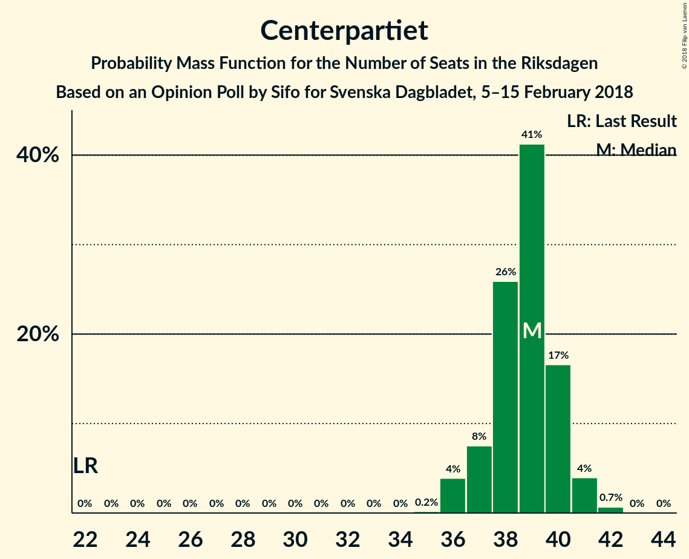
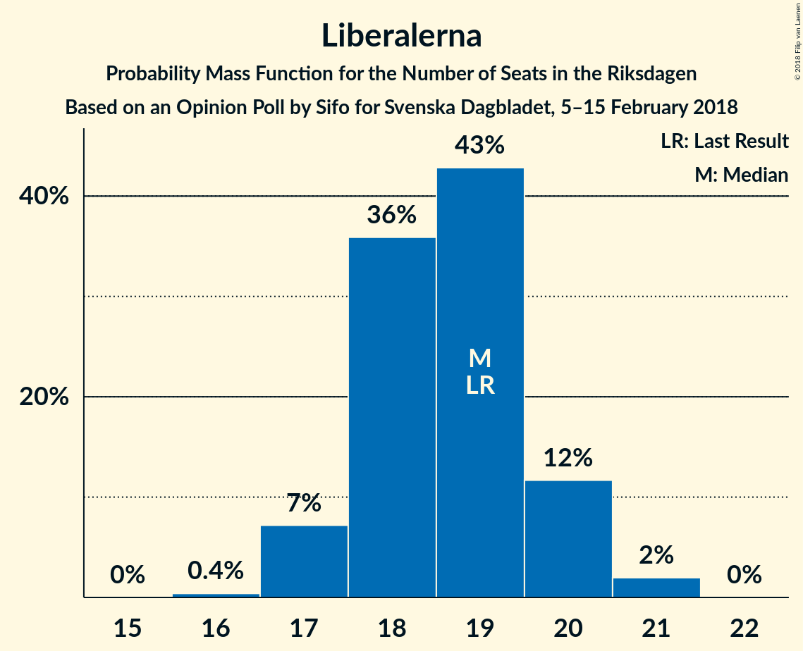

# Opinion Poll by Sifo for Svenska Dagbladet, 5–15 February 2018

<a href="#voting-intentions">Voting Intentions</a> | <a href="#seats">Seats</a> | <a href="#coalitions">Coalitions</a> | <a href="#technical-information">Technical Information</a>

## Voting Intentions

### Confidence Intervals

| Party | Last Result | Poll Result | 80% Confidence Interval | 90% Confidence Interval | 95% Confidence Interval | 99% Confidence Interval |
|:-----:|:-----------:|:-----------:|:-----------------------:|:-----------------------:|:-----------------------:|:-----------------------:|
| Sveriges socialdemokratiska arbetareparti | 31.0% | 27.2% | 26.7–27.8% |26.5–28.0% |26.4–28.1% |26.1–28.4% |
| Moderata samlingspartiet | 23.3% | 23.7% | 23.2–24.3% |23.0–24.5% |22.9–24.6% |22.6–24.9% |
| Sverigedemokraterna | 12.9% | 16.2% | 15.7–16.7% |15.6–16.8% |15.5–16.9% |15.2–17.1% |
| Centerpartiet | 6.1% | 10.5% | 10.1–10.9% |10.0–11.0% |9.9–11.1% |9.7–11.3% |
| Vänsterpartiet | 5.7% | 7.2% | 6.9–7.5% |6.8–7.6% |6.7–7.7% |6.5–7.9% |
| Liberalerna | 5.4% | 5.0% | 4.7–5.3% |4.6–5.4% |4.6–5.4% |4.5–5.6% |
| Miljöpartiet de gröna | 6.9% | 4.6% | 4.3–4.9% |4.3–5.0% |4.2–5.0% |4.1–5.2% |
| Kristdemokraterna | 4.6% | 2.8% | 2.6–3.0% |2.5–3.1% |2.5–3.1% |2.4–3.3% |
| Feministiskt initiativ | 3.1% | 1.4% | 1.2–1.6% |1.2–1.6% |1.2–1.7% |1.1–1.7% |

*Note:* The poll result column reflects the actual value used in the calculations. Published results may vary slightly, and in addition be rounded to fewer digits.

## Seats

### Confidence Intervals

| Party | Last Result | Median | 80% Confidence Interval | 90% Confidence Interval | 95% Confidence Interval | 99% Confidence Interval |
|:-----:|:-----------:|:------:|:-----------------------:|:-----------------------:|:-----------------------:|:-----------------------:|
| <a href="#sveriges-socialdemokratiska-arbetareparti">Sveriges socialdemokratiska arbetareparti</a> | 113 | 101 | 99–102 |99–102 |98–103 |97–105 |
| <a href="#moderata-samlingspartiet">Moderata samlingspartiet</a> | 84 | 87 | 86–89 |86–89 |86–90 |85–91 |
| <a href="#sverigedemokraterna">Sverigedemokraterna</a> | 49 | 61 | 59–61 |58–62 |57–62 |57–63 |
| <a href="#centerpartiet">Centerpartiet</a> | 22 | 38 | 38–40 |37–40 |37–41 |36–41 |
| <a href="#vänsterpartiet">Vänsterpartiet</a> | 21 | 27 | 25–27 |25–27 |25–28 |24–28 |
| <a href="#liberalerna">Liberalerna</a> | 19 | 19 | 18–20 |17–20 |17–20 |17–20 |
| <a href="#miljöpartiet-de-gröna">Miljöpartiet de gröna</a> | 25 | 16 | 16–17 |16–17 |16–17 |16–18 |
| <a href="#kristdemokraterna">Kristdemokraterna</a> | 16 | 0 | 0 |0 |0 |0 |
| <a href="#feministiskt-initiativ">Feministiskt initiativ</a> | 0 | 0 | 0 |0 |0 |0 |

### Sveriges socialdemokratiska arbetareparti

*For a full overview of the results for this party, see the [Sveriges socialdemokratiska arbetareparti](party-sverigessocialdemokratiskaarbetareparti.html) page.*

| Number of Seats | Probability | Accumulated | Special Marks |
|:---------------:|:-----------:|:-----------:|:-------------:|
| 96 | 0.2% | 100% |  |
| 97 | 1.3% | 99.8% |  |
| 98 | 3% | 98% |  |
| 99 | 8% | 95% |  |
| 100 | 14% | 88% |  |
| 101 | 24% | 74% | Median |
| 102 | 46% | 50% |  |
| 103 | 2% | 4% |  |
| 104 | 1.0% | 2% |  |
| 105 | 0.3% | 0.6% |  |
| 106 | 0.3% | 0.3% |  |
| 107 | 0% | 0% |  |
| 108 | 0% | 0% |  |
| 109 | 0% | 0% |  |
| 110 | 0% | 0% |  |
| 111 | 0% | 0% |  |
| 112 | 0% | 0% |  |
| 113 | 0% | 0% | Last Result |

### Moderata samlingspartiet

*For a full overview of the results for this party, see the [Moderata samlingspartiet](party-moderatasamlingspartiet.html) page.*

| Number of Seats | Probability | Accumulated | Special Marks |
|:---------------:|:-----------:|:-----------:|:-------------:|
| 83 | 0.1% | 100% |  |
| 84 | 0.3% | 99.9% | Last Result |
| 85 | 1.0% | 99.6% |  |
| 86 | 48% | 98.6% |  |
| 87 | 9% | 51% | Median |
| 88 | 24% | 41% |  |
| 89 | 13% | 17% |  |
| 90 | 3% | 4% |  |
| 91 | 0.5% | 0.7% |  |
| 92 | 0.1% | 0.2% |  |
| 93 | 0% | 0% |  |

### Sverigedemokraterna

*For a full overview of the results for this party, see the [Sverigedemokraterna](party-sverigedemokraterna.html) page.*

| Number of Seats | Probability | Accumulated | Special Marks |
|:---------------:|:-----------:|:-----------:|:-------------:|
| 49 | 0% | 100% | Last Result |
| 50 | 0% | 100% |  |
| 51 | 0% | 100% |  |
| 52 | 0% | 100% |  |
| 53 | 0% | 100% |  |
| 54 | 0% | 100% |  |
| 55 | 0% | 100% |  |
| 56 | 0.2% | 100% |  |
| 57 | 3% | 99.8% |  |
| 58 | 7% | 97% |  |
| 59 | 14% | 90% |  |
| 60 | 8% | 76% |  |
| 61 | 59% | 68% | Median |
| 62 | 8% | 10% |  |
| 63 | 1.1% | 1.4% |  |
| 64 | 0.3% | 0.3% |  |
| 65 | 0% | 0% |  |

### Centerpartiet

*For a full overview of the results for this party, see the [Centerpartiet](party-centerpartiet.html) page.*

| Number of Seats | Probability | Accumulated | Special Marks |
|:---------------:|:-----------:|:-----------:|:-------------:|
| 22 | 0% | 100% | Last Result |
| 23 | 0% | 100% |  |
| 24 | 0% | 100% |  |
| 25 | 0% | 100% |  |
| 26 | 0% | 100% |  |
| 27 | 0% | 100% |  |
| 28 | 0% | 100% |  |
| 29 | 0% | 100% |  |
| 30 | 0% | 100% |  |
| 31 | 0% | 100% |  |
| 32 | 0% | 100% |  |
| 33 | 0% | 100% |  |
| 34 | 0% | 100% |  |
| 35 | 0.4% | 100% |  |
| 36 | 0.6% | 99.6% |  |
| 37 | 5% | 99.0% |  |
| 38 | 50% | 94% | Median |
| 39 | 17% | 44% |  |
| 40 | 24% | 27% |  |
| 41 | 3% | 3% |  |
| 42 | 0.2% | 0.2% |  |
| 43 | 0% | 0% |  |

### Vänsterpartiet

*For a full overview of the results for this party, see the [Vänsterpartiet](party-vänsterpartiet.html) page.*

| Number of Seats | Probability | Accumulated | Special Marks |
|:---------------:|:-----------:|:-----------:|:-------------:|
| 21 | 0% | 100% | Last Result |
| 22 | 0% | 100% |  |
| 23 | 0% | 100% |  |
| 24 | 0.7% | 100% |  |
| 25 | 15% | 99.3% |  |
| 26 | 17% | 85% |  |
| 27 | 63% | 67% | Median |
| 28 | 4% | 4% |  |
| 29 | 0.3% | 0.3% |  |
| 30 | 0% | 0% |  |

### Liberalerna

*For a full overview of the results for this party, see the [Liberalerna](party-liberalerna.html) page.*

| Number of Seats | Probability | Accumulated | Special Marks |
|:---------------:|:-----------:|:-----------:|:-------------:|
| 16 | 0.1% | 100% |  |
| 17 | 8% | 99.9% |  |
| 18 | 25% | 92% |  |
| 19 | 47% | 67% | Last Result, Median |
| 20 | 20% | 20% |  |
| 21 | 0.3% | 0.3% |  |
| 22 | 0% | 0% |  |

### Miljöpartiet de gröna

*For a full overview of the results for this party, see the [Miljöpartiet de gröna](party-miljöpartietdegröna.html) page.*

| Number of Seats | Probability | Accumulated | Special Marks |
|:---------------:|:-----------:|:-----------:|:-------------:|
| 15 | 0.2% | 100% |  |
| 16 | 71% | 99.8% | Median |
| 17 | 27% | 29% |  |
| 18 | 2% | 2% |  |
| 19 | 0.4% | 0.4% |  |
| 20 | 0.1% | 0.1% |  |
| 21 | 0% | 0% |  |
| 22 | 0% | 0% |  |
| 23 | 0% | 0% |  |
| 24 | 0% | 0% |  |
| 25 | 0% | 0% | Last Result |

### Kristdemokraterna

*For a full overview of the results for this party, see the [Kristdemokraterna](party-kristdemokraterna.html) page.*

| Number of Seats | Probability | Accumulated | Special Marks |
|:---------------:|:-----------:|:-----------:|:-------------:|
| 0 | 100% | 100% | Median |
| 1 | 0% | 0% |  |
| 2 | 0% | 0% |  |
| 3 | 0% | 0% |  |
| 4 | 0% | 0% |  |
| 5 | 0% | 0% |  |
| 6 | 0% | 0% |  |
| 7 | 0% | 0% |  |
| 8 | 0% | 0% |  |
| 9 | 0% | 0% |  |
| 10 | 0% | 0% |  |
| 11 | 0% | 0% |  |
| 12 | 0% | 0% |  |
| 13 | 0% | 0% |  |
| 14 | 0% | 0% |  |
| 15 | 0% | 0% |  |
| 16 | 0% | 0% | Last Result |

### Feministiskt initiativ

*For a full overview of the results for this party, see the [Feministiskt initiativ](party-feministisktinitiativ.html) page.*

| Number of Seats | Probability | Accumulated | Special Marks |
|:---------------:|:-----------:|:-----------:|:-------------:|
| 0 | 100% | 100% | Last Result, Median |

## Coalitions

### Confidence Intervals

| Coalition | Last Result | Median | Majority? | 80% Confidence Interval | 90% Confidence Interval | 95% Confidence Interval | 99% Confidence Interval |
|:---------:|:-----------:|:------:|:---------:|:-----------------------:|:-----------------------:|:-----------------------:|:-----------------------:|
| Moderata samlingspartiet – Centerpartiet – Liberalerna – Kristdemokraterna | 141 | 144 | 0% | 143–147 | 143–147 | 142–148 | 141–148 |
| Moderata samlingspartiet – Centerpartiet – Liberalerna | 125 | 144 | 0% | 143–147 | 143–147 | 142–148 | 141–148 |
| Sveriges socialdemokratiska arbetareparti – Vänsterpartiet – Miljöpartiet de gröna – Feministiskt initiativ | 159 | 145 | 0% | 142–145 | 142–145 | 141–147 | 140–149 |
| Sveriges socialdemokratiska arbetareparti – Vänsterpartiet – Miljöpartiet de gröna | 159 | 145 | 0% | 142–145 | 142–145 | 141–147 | 140–149 |
| Sveriges socialdemokratiska arbetareparti – Vänsterpartiet | 134 | 128 | 0% | 126–129 | 126–129 | 125–130 | 123–132 |
| Moderata samlingspartiet – Centerpartiet – Kristdemokraterna | 122 | 126 | 0% | 124–128 | 124–129 | 124–129 | 123–130 |
| Moderata samlingspartiet – Centerpartiet | 106 | 126 | 0% | 124–128 | 124–129 | 124–129 | 123–130 |

### Moderata samlingspartiet – Centerpartiet – Liberalerna – Kristdemokraterna

| Number of Seats | Probability | Accumulated | Special Marks |
|:---------------:|:-----------:|:-----------:|:-------------:|
| 140 | 0.1% | 100% |  |
| 141 | 2% | 99.9% | Last Result |
| 142 | 2% | 98% |  |
| 143 | 44% | 97% |  |
| 144 | 6% | 52% | Median |
| 145 | 9% | 47% |  |
| 146 | 15% | 38% |  |
| 147 | 20% | 23% |  |
| 148 | 3% | 3% |  |
| 149 | 0.3% | 0.4% |  |
| 150 | 0.1% | 0.1% |  |
| 151 | 0% | 0.1% |  |
| 152 | 0% | 0% |  |

### Moderata samlingspartiet – Centerpartiet – Liberalerna

| Number of Seats | Probability | Accumulated | Special Marks |
|:---------------:|:-----------:|:-----------:|:-------------:|
| 125 | 0% | 100% | Last Result |
| 126 | 0% | 100% |  |
| 127 | 0% | 100% |  |
| 128 | 0% | 100% |  |
| 129 | 0% | 100% |  |
| 130 | 0% | 100% |  |
| 131 | 0% | 100% |  |
| 132 | 0% | 100% |  |
| 133 | 0% | 100% |  |
| 134 | 0% | 100% |  |
| 135 | 0% | 100% |  |
| 136 | 0% | 100% |  |
| 137 | 0% | 100% |  |
| 138 | 0% | 100% |  |
| 139 | 0% | 100% |  |
| 140 | 0.1% | 100% |  |
| 141 | 2% | 99.9% |  |
| 142 | 2% | 98% |  |
| 143 | 44% | 97% |  |
| 144 | 6% | 52% | Median |
| 145 | 9% | 47% |  |
| 146 | 15% | 38% |  |
| 147 | 20% | 23% |  |
| 148 | 3% | 3% |  |
| 149 | 0.3% | 0.4% |  |
| 150 | 0.1% | 0.1% |  |
| 151 | 0% | 0.1% |  |
| 152 | 0% | 0% |  |

### Sveriges socialdemokratiska arbetareparti – Vänsterpartiet – Miljöpartiet de gröna – Feministiskt initiativ

| Number of Seats | Probability | Accumulated | Special Marks |
|:---------------:|:-----------:|:-----------:|:-------------:|
| 139 | 0.2% | 100% |  |
| 140 | 0.8% | 99.8% |  |
| 141 | 3% | 99.0% |  |
| 142 | 15% | 96% |  |
| 143 | 17% | 80% |  |
| 144 | 12% | 63% | Median |
| 145 | 46% | 51% |  |
| 146 | 1.1% | 5% |  |
| 147 | 3% | 4% |  |
| 148 | 0.1% | 0.9% |  |
| 149 | 0.5% | 0.8% |  |
| 150 | 0.3% | 0.3% |  |
| 151 | 0% | 0% |  |
| 152 | 0% | 0% |  |
| 153 | 0% | 0% |  |
| 154 | 0% | 0% |  |
| 155 | 0% | 0% |  |
| 156 | 0% | 0% |  |
| 157 | 0% | 0% |  |
| 158 | 0% | 0% |  |
| 159 | 0% | 0% | Last Result |

### Sveriges socialdemokratiska arbetareparti – Vänsterpartiet – Miljöpartiet de gröna

| Number of Seats | Probability | Accumulated | Special Marks |
|:---------------:|:-----------:|:-----------:|:-------------:|
| 139 | 0.2% | 100% |  |
| 140 | 0.8% | 99.8% |  |
| 141 | 3% | 99.0% |  |
| 142 | 15% | 96% |  |
| 143 | 17% | 80% |  |
| 144 | 12% | 63% | Median |
| 145 | 46% | 51% |  |
| 146 | 1.1% | 5% |  |
| 147 | 3% | 4% |  |
| 148 | 0.1% | 0.9% |  |
| 149 | 0.5% | 0.8% |  |
| 150 | 0.3% | 0.3% |  |
| 151 | 0% | 0% |  |
| 152 | 0% | 0% |  |
| 153 | 0% | 0% |  |
| 154 | 0% | 0% |  |
| 155 | 0% | 0% |  |
| 156 | 0% | 0% |  |
| 157 | 0% | 0% |  |
| 158 | 0% | 0% |  |
| 159 | 0% | 0% | Last Result |

### Sveriges socialdemokratiska arbetareparti – Vänsterpartiet

| Number of Seats | Probability | Accumulated | Special Marks |
|:---------------:|:-----------:|:-----------:|:-------------:|
| 123 | 0.9% | 100% |  |
| 124 | 0.7% | 99.0% |  |
| 125 | 3% | 98% |  |
| 126 | 30% | 95% |  |
| 127 | 12% | 66% |  |
| 128 | 4% | 54% | Median |
| 129 | 46% | 50% |  |
| 130 | 3% | 4% |  |
| 131 | 0.1% | 1.0% |  |
| 132 | 0.5% | 0.8% |  |
| 133 | 0.3% | 0.3% |  |
| 134 | 0% | 0% | Last Result |

### Moderata samlingspartiet – Centerpartiet – Kristdemokraterna

| Number of Seats | Probability | Accumulated | Special Marks |
|:---------------:|:-----------:|:-----------:|:-------------:|
| 122 | 0.2% | 100% | Last Result |
| 123 | 0.6% | 99.8% |  |
| 124 | 43% | 99.1% |  |
| 125 | 1.4% | 56% | Median |
| 126 | 12% | 55% |  |
| 127 | 24% | 43% |  |
| 128 | 13% | 19% |  |
| 129 | 4% | 6% |  |
| 130 | 2% | 2% |  |
| 131 | 0.1% | 0.2% |  |
| 132 | 0.1% | 0.1% |  |
| 133 | 0% | 0% |  |

### Moderata samlingspartiet – Centerpartiet

| Number of Seats | Probability | Accumulated | Special Marks |
|:---------------:|:-----------:|:-----------:|:-------------:|
| 106 | 0% | 100% | Last Result |
| 107 | 0% | 100% |  |
| 108 | 0% | 100% |  |
| 109 | 0% | 100% |  |
| 110 | 0% | 100% |  |
| 111 | 0% | 100% |  |
| 112 | 0% | 100% |  |
| 113 | 0% | 100% |  |
| 114 | 0% | 100% |  |
| 115 | 0% | 100% |  |
| 116 | 0% | 100% |  |
| 117 | 0% | 100% |  |
| 118 | 0% | 100% |  |
| 119 | 0% | 100% |  |
| 120 | 0% | 100% |  |
| 121 | 0% | 100% |  |
| 122 | 0.2% | 100% |  |
| 123 | 0.6% | 99.8% |  |
| 124 | 43% | 99.1% |  |
| 125 | 1.4% | 56% | Median |
| 126 | 12% | 55% |  |
| 127 | 24% | 43% |  |
| 128 | 13% | 19% |  |
| 129 | 4% | 6% |  |
| 130 | 2% | 2% |  |
| 131 | 0.1% | 0.2% |  |
| 132 | 0.1% | 0.1% |  |
| 133 | 0% | 0% |  |

## Technical Information

### Opinion Poll

+ **Polling firm:** Sifo
+ **Commissioner(s):** Svenska Dagbladet
+ **Fieldwork period:** 5–15 February 2018

### Calculations

+ **Sample size:** 9878
+ **Simulations done:** 131,072
+ **Error estimate:** 0.58%

