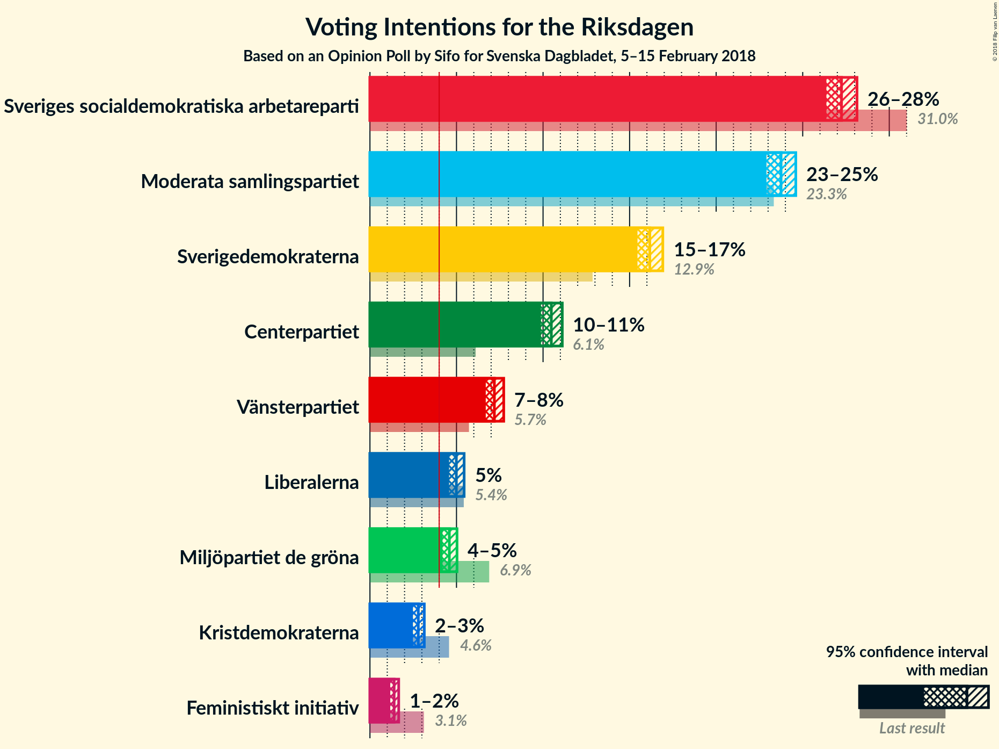
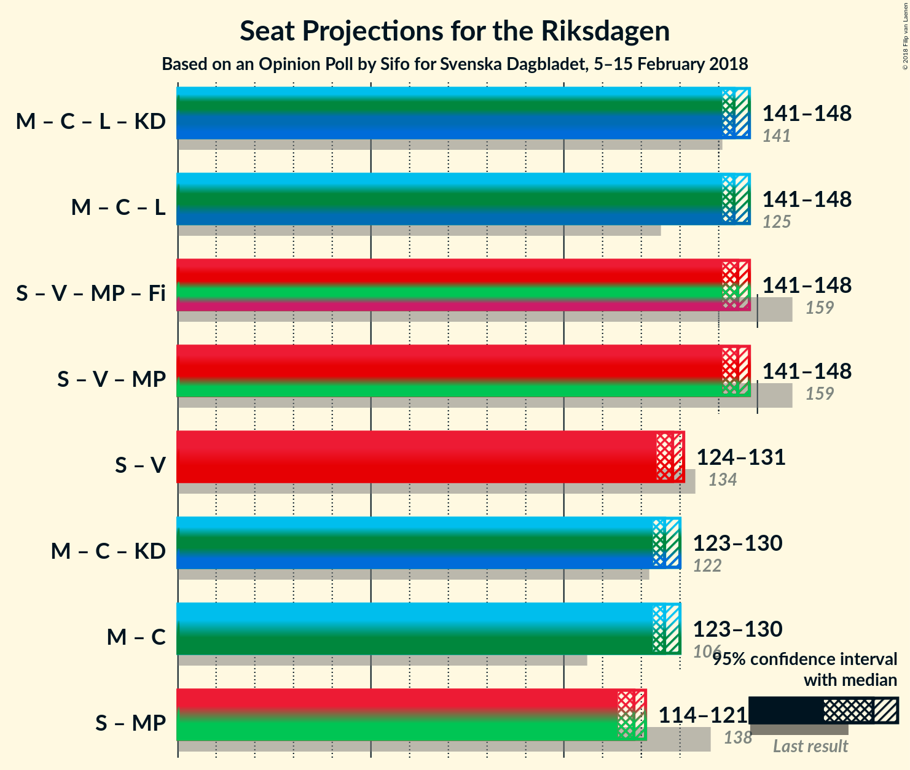

# Opinion Poll by Sifo for Svenska Dagbladet, 5–15 February 2018

<a href="#voting-intentions">Voting Intentions</a> | <a href="#seats">Seats</a> | <a href="#coalitions">Coalitions</a> | <a href="#technical-information">Technical Information</a>

## Voting Intentions

### Confidence Intervals

| Party | Last Result | Poll Result | 80% Confidence Interval | 90% Confidence Interval | 95% Confidence Interval | 99% Confidence Interval |
|:-----:|:-----------:|:-----------:|:-----------------------:|:-----------------------:|:-----------------------:|:-----------------------:|
| Sveriges socialdemokratiska arbetareparti | 31.0% | 27.2% | 26.7–27.8% |26.5–28.0% |26.4–28.1% |26.1–28.4% |
| Moderata samlingspartiet | 23.3% | 23.7% | 23.2–24.3% |23.0–24.5% |22.9–24.6% |22.6–24.9% |
| Sverigedemokraterna | 12.9% | 16.2% | 15.7–16.7% |15.6–16.8% |15.5–16.9% |15.2–17.1% |
| Centerpartiet | 6.1% | 10.5% | 10.1–10.9% |10.0–11.0% |9.9–11.1% |9.7–11.3% |
| Vänsterpartiet | 5.7% | 7.2% | 6.9–7.5% |6.8–7.6% |6.7–7.7% |6.5–7.9% |
| Liberalerna | 5.4% | 5.0% | 4.7–5.3% |4.6–5.4% |4.6–5.4% |4.5–5.6% |
| Miljöpartiet de gröna | 6.9% | 4.6% | 4.3–4.9% |4.3–5.0% |4.2–5.0% |4.1–5.2% |
| Kristdemokraterna | 4.6% | 2.8% | 2.6–3.0% |2.5–3.1% |2.5–3.1% |2.4–3.3% |
| Feministiskt initiativ | 3.1% | 1.4% | 1.2–1.6% |1.2–1.6% |1.2–1.7% |1.1–1.7% |

*Note:* The poll result column reflects the actual value used in the calculations. Published results may vary slightly, and in addition be rounded to fewer digits.

## Seats

### Confidence Intervals

| Party | Last Result | Median | 80% Confidence Interval | 90% Confidence Interval | 95% Confidence Interval | 99% Confidence Interval |
|:-----:|:-----------:|:------:|:-----------------------:|:-----------------------:|:-----------------------:|:-----------------------:|
| <a href="#sveriges-socialdemokratiska-arbetareparti">Sveriges socialdemokratiska arbetareparti</a> | 113 | 101 | 99–102 |98–104 |98–104 |97–105 |
| <a href="#moderata-samlingspartiet">Moderata samlingspartiet</a> | 84 | 87 | 85–89 |85–90 |85–91 |84–92 |
| <a href="#sverigedemokraterna">Sverigedemokraterna</a> | 49 | 60 | 58–61 |58–62 |57–63 |57–63 |
| <a href="#centerpartiet">Centerpartiet</a> | 22 | 39 | 37–40 |37–40 |36–41 |36–42 |
| <a href="#vänsterpartiet">Vänsterpartiet</a> | 21 | 27 | 25–28 |25–28 |25–29 |24–29 |
| <a href="#liberalerna">Liberalerna</a> | 19 | 19 | 18–20 |17–20 |17–20 |17–21 |
| <a href="#miljöpartiet-de-gröna">Miljöpartiet de gröna</a> | 25 | 17 | 16–18 |16–18 |16–19 |15–19 |
| <a href="#kristdemokraterna">Kristdemokraterna</a> | 16 | 0 | 0 |0 |0 |0 |
| <a href="#feministiskt-initiativ">Feministiskt initiativ</a> | 0 | 0 | 0 |0 |0 |0 |

### Sveriges socialdemokratiska arbetareparti

*For a full overview of the results for this party, see the [Sveriges socialdemokratiska arbetareparti](party-sverigessocialdemokratiskaarbetareparti.html) page.*

| Number of Seats | Probability | Accumulated | Special Marks |
|:---------------:|:-----------:|:-----------:|:-------------:|
| 95 | 0.1% | 100% |  |
| 96 | 0.3% | 99.9% |  |
| 97 | 2% | 99.6% |  |
| 98 | 4% | 98% |  |
| 99 | 12% | 94% |  |
| 100 | 16% | 82% |  |
| 101 | 36% | 66% | Median |
| 102 | 20% | 30% |  |
| 103 | 4% | 9% |  |
| 104 | 4% | 5% |  |
| 105 | 0.5% | 0.9% |  |
| 106 | 0.3% | 0.3% |  |
| 107 | 0% | 0% |  |
| 108 | 0% | 0% |  |
| 109 | 0% | 0% |  |
| 110 | 0% | 0% |  |
| 111 | 0% | 0% |  |
| 112 | 0% | 0% |  |
| 113 | 0% | 0% | Last Result |

### Moderata samlingspartiet

*For a full overview of the results for this party, see the [Moderata samlingspartiet](party-moderatasamlingspartiet.html) page.*

| Number of Seats | Probability | Accumulated | Special Marks |
|:---------------:|:-----------:|:-----------:|:-------------:|
| 83 | 0.4% | 100% |  |
| 84 | 1.2% | 99.5% | Last Result |
| 85 | 10% | 98% |  |
| 86 | 28% | 89% |  |
| 87 | 30% | 61% | Median |
| 88 | 13% | 31% |  |
| 89 | 10% | 18% |  |
| 90 | 5% | 9% |  |
| 91 | 3% | 3% |  |
| 92 | 0.4% | 0.5% |  |
| 93 | 0.1% | 0.1% |  |
| 94 | 0% | 0% |  |

### Sverigedemokraterna

*For a full overview of the results for this party, see the [Sverigedemokraterna](party-sverigedemokraterna.html) page.*

| Number of Seats | Probability | Accumulated | Special Marks |
|:---------------:|:-----------:|:-----------:|:-------------:|
| 49 | 0% | 100% | Last Result |
| 50 | 0% | 100% |  |
| 51 | 0% | 100% |  |
| 52 | 0% | 100% |  |
| 53 | 0% | 100% |  |
| 54 | 0% | 100% |  |
| 55 | 0.1% | 100% |  |
| 56 | 0.4% | 99.9% |  |
| 57 | 3% | 99.6% |  |
| 58 | 8% | 97% |  |
| 59 | 19% | 89% |  |
| 60 | 30% | 70% | Median |
| 61 | 31% | 40% |  |
| 62 | 7% | 9% |  |
| 63 | 2% | 3% |  |
| 64 | 0.4% | 0.5% |  |
| 65 | 0.1% | 0.1% |  |
| 66 | 0% | 0% |  |

### Centerpartiet

*For a full overview of the results for this party, see the [Centerpartiet](party-centerpartiet.html) page.*

| Number of Seats | Probability | Accumulated | Special Marks |
|:---------------:|:-----------:|:-----------:|:-------------:|
| 22 | 0% | 100% | Last Result |
| 23 | 0% | 100% |  |
| 24 | 0% | 100% |  |
| 25 | 0% | 100% |  |
| 26 | 0% | 100% |  |
| 27 | 0% | 100% |  |
| 28 | 0% | 100% |  |
| 29 | 0% | 100% |  |
| 30 | 0% | 100% |  |
| 31 | 0% | 100% |  |
| 32 | 0% | 100% |  |
| 33 | 0% | 100% |  |
| 34 | 0% | 100% |  |
| 35 | 0.2% | 100% |  |
| 36 | 4% | 99.8% |  |
| 37 | 8% | 96% |  |
| 38 | 26% | 88% |  |
| 39 | 41% | 63% | Median |
| 40 | 17% | 21% |  |
| 41 | 4% | 5% |  |
| 42 | 0.7% | 0.7% |  |
| 43 | 0% | 0% |  |

### Vänsterpartiet

*For a full overview of the results for this party, see the [Vänsterpartiet](party-vänsterpartiet.html) page.*

| Number of Seats | Probability | Accumulated | Special Marks |
|:---------------:|:-----------:|:-----------:|:-------------:|
| 21 | 0% | 100% | Last Result |
| 22 | 0% | 100% |  |
| 23 | 0% | 100% |  |
| 24 | 0.9% | 100% |  |
| 25 | 10% | 99.1% |  |
| 26 | 22% | 89% |  |
| 27 | 55% | 67% | Median |
| 28 | 9% | 12% |  |
| 29 | 3% | 4% |  |
| 30 | 0.2% | 0.2% |  |
| 31 | 0% | 0% |  |

### Liberalerna

*For a full overview of the results for this party, see the [Liberalerna](party-liberalerna.html) page.*

| Number of Seats | Probability | Accumulated | Special Marks |
|:---------------:|:-----------:|:-----------:|:-------------:|
| 16 | 0.4% | 100% |  |
| 17 | 7% | 99.6% |  |
| 18 | 36% | 92% |  |
| 19 | 43% | 57% | Last Result, Median |
| 20 | 12% | 14% |  |
| 21 | 2% | 2% |  |
| 22 | 0% | 0% |  |

### Miljöpartiet de gröna

*For a full overview of the results for this party, see the [Miljöpartiet de gröna](party-miljöpartietdegröna.html) page.*

| Number of Seats | Probability | Accumulated | Special Marks |
|:---------------:|:-----------:|:-----------:|:-------------:|
| 0 | 0.1% | 100% |  |
| 1 | 0% | 99.9% |  |
| 2 | 0% | 99.9% |  |
| 3 | 0% | 99.9% |  |
| 4 | 0% | 99.9% |  |
| 5 | 0% | 99.9% |  |
| 6 | 0% | 99.9% |  |
| 7 | 0% | 99.9% |  |
| 8 | 0% | 99.9% |  |
| 9 | 0% | 99.9% |  |
| 10 | 0% | 99.9% |  |
| 11 | 0% | 99.9% |  |
| 12 | 0% | 99.9% |  |
| 13 | 0% | 99.9% |  |
| 14 | 0% | 99.9% |  |
| 15 | 2% | 99.9% |  |
| 16 | 24% | 98% |  |
| 17 | 57% | 73% | Median |
| 18 | 12% | 16% |  |
| 19 | 3% | 4% |  |
| 20 | 0.1% | 0.1% |  |
| 21 | 0% | 0% |  |
| 22 | 0% | 0% |  |
| 23 | 0% | 0% |  |
| 24 | 0% | 0% |  |
| 25 | 0% | 0% | Last Result |

### Kristdemokraterna

*For a full overview of the results for this party, see the [Kristdemokraterna](party-kristdemokraterna.html) page.*

| Number of Seats | Probability | Accumulated | Special Marks |
|:---------------:|:-----------:|:-----------:|:-------------:|
| 0 | 100% | 100% | Median |
| 1 | 0% | 0% |  |
| 2 | 0% | 0% |  |
| 3 | 0% | 0% |  |
| 4 | 0% | 0% |  |
| 5 | 0% | 0% |  |
| 6 | 0% | 0% |  |
| 7 | 0% | 0% |  |
| 8 | 0% | 0% |  |
| 9 | 0% | 0% |  |
| 10 | 0% | 0% |  |
| 11 | 0% | 0% |  |
| 12 | 0% | 0% |  |
| 13 | 0% | 0% |  |
| 14 | 0% | 0% |  |
| 15 | 0% | 0% |  |
| 16 | 0% | 0% | Last Result |

### Feministiskt initiativ

*For a full overview of the results for this party, see the [Feministiskt initiativ](party-feministisktinitiativ.html) page.*

| Number of Seats | Probability | Accumulated | Special Marks |
|:---------------:|:-----------:|:-----------:|:-------------:|
| 0 | 100% | 100% | Last Result, Median |

## Coalitions

### Confidence Intervals

| Coalition | Last Result | Median | Majority? | 80% Confidence Interval | 90% Confidence Interval | 95% Confidence Interval | 99% Confidence Interval |
|:---------:|:-----------:|:------:|:---------:|:-----------------------:|:-----------------------:|:-----------------------:|:-----------------------:|
| Moderata samlingspartiet – Centerpartiet – Liberalerna – Kristdemokraterna | 141 | 144 | 0% | 143–147 | 142–148 | 141–148 | 140–149 |
| Moderata samlingspartiet – Centerpartiet – Liberalerna | 125 | 144 | 0% | 143–147 | 142–148 | 141–148 | 140–149 |
| Sveriges socialdemokratiska arbetareparti – Vänsterpartiet – Miljöpartiet de gröna – Feministiskt initiativ | 159 | 145 | 0% | 142–146 | 142–147 | 141–148 | 140–149 |
| Sveriges socialdemokratiska arbetareparti – Vänsterpartiet – Miljöpartiet de gröna | 159 | 145 | 0% | 142–146 | 142–147 | 141–148 | 140–149 |
| Sveriges socialdemokratiska arbetareparti – Vänsterpartiet | 134 | 128 | 0% | 126–129 | 125–130 | 124–131 | 123–132 |
| Moderata samlingspartiet – Centerpartiet – Kristdemokraterna | 122 | 126 | 0% | 124–128 | 123–129 | 123–130 | 122–130 |
| Moderata samlingspartiet – Centerpartiet | 106 | 126 | 0% | 124–128 | 123–129 | 123–130 | 122–130 |
| Sveriges socialdemokratiska arbetareparti – Miljöpartiet de gröna | 138 | 118 | 0% | 116–119 | 115–121 | 114–121 | 113–122 |

