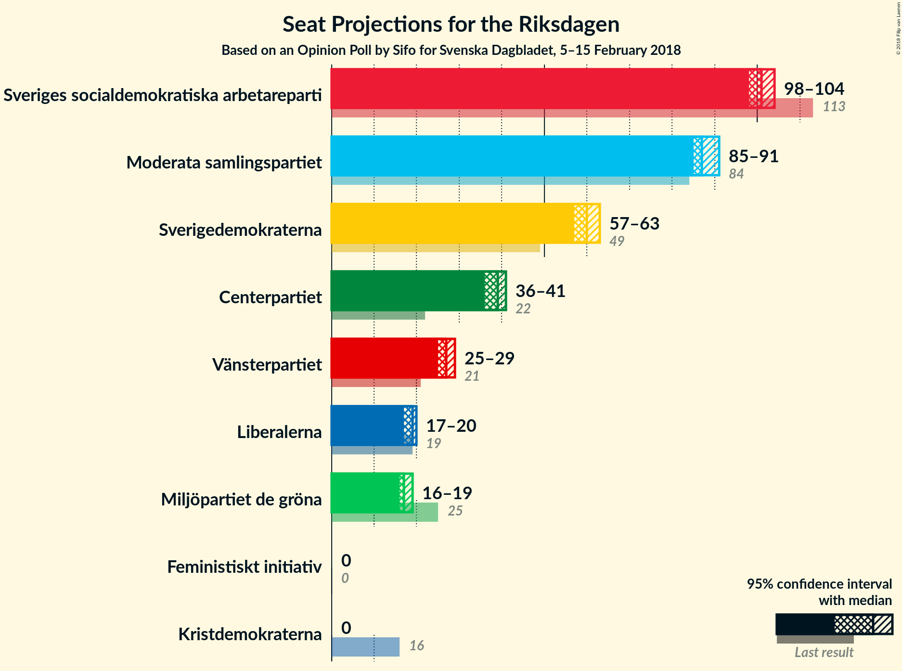
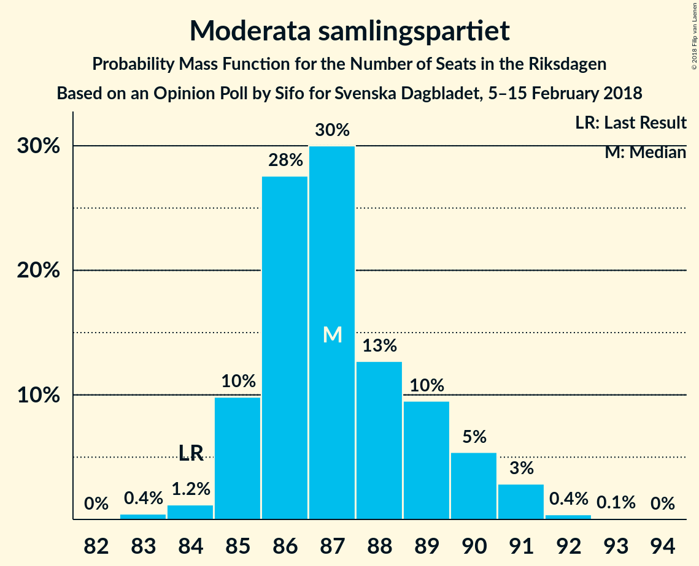
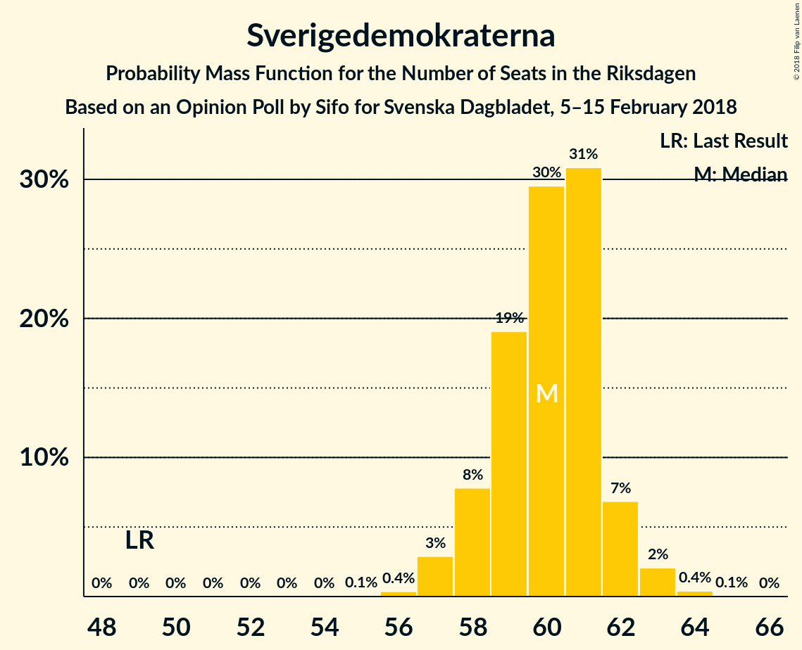
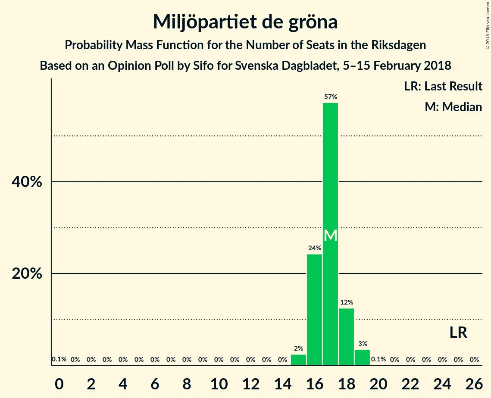
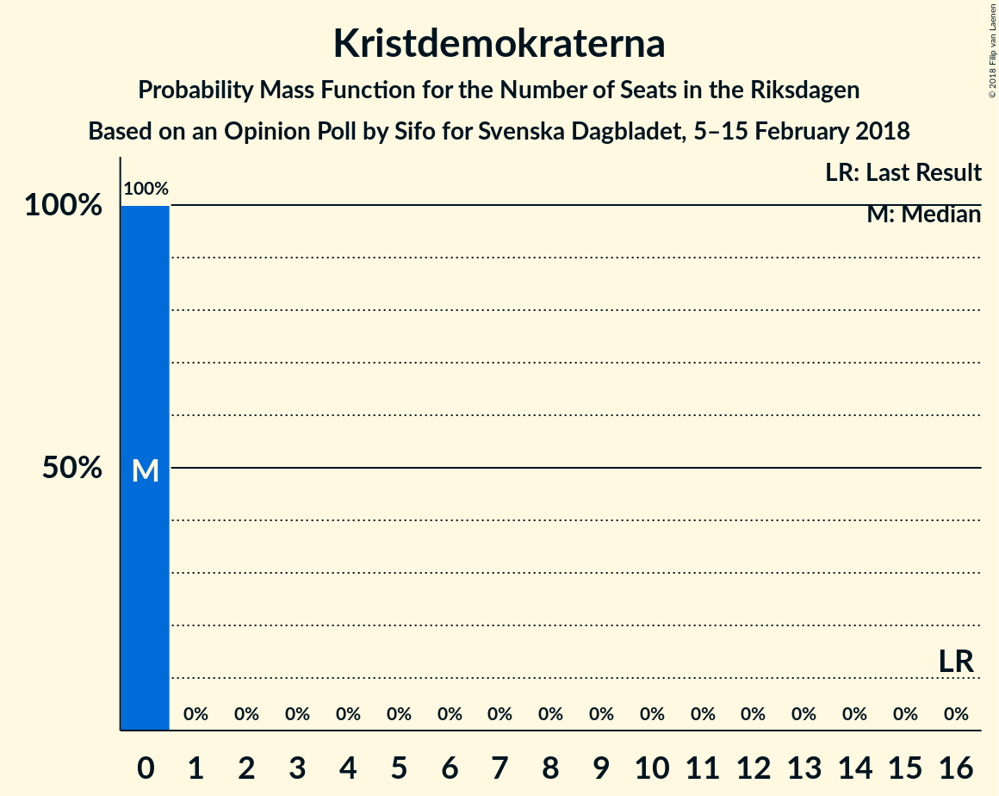

# Opinion Poll by Sifo for Svenska Dagbladet, 5–15 February 2018

<a href="#voting-intentions">Voting Intentions</a> | <a href="#seats">Seats</a> | <a href="#coalitions">Coalitions</a> | <a href="#technical-information">Technical Information</a>

## Voting Intentions

### Confidence Intervals

| Party | Last Result | Poll Result | 80% Confidence Interval | 90% Confidence Interval | 95% Confidence Interval | 99% Confidence Interval |
|:-----:|:-----------:|:-----------:|:-----------------------:|:-----------------------:|:-----------------------:|:-----------------------:|
| Sveriges socialdemokratiska arbetareparti | 31.0% | 27.2% | 26.7–27.8% |26.5–28.0% |26.4–28.1% |26.1–28.4% |
| Moderata samlingspartiet | 23.3% | 23.7% | 23.2–24.3% |23.0–24.5% |22.9–24.6% |22.6–24.9% |
| Sverigedemokraterna | 12.9% | 16.2% | 15.7–16.7% |15.6–16.8% |15.5–16.9% |15.2–17.1% |
| Centerpartiet | 6.1% | 10.5% | 10.1–10.9% |10.0–11.0% |9.9–11.1% |9.7–11.3% |
| Vänsterpartiet | 5.7% | 7.2% | 6.9–7.5% |6.8–7.6% |6.7–7.7% |6.5–7.9% |
| Liberalerna | 5.4% | 5.0% | 4.7–5.3% |4.6–5.4% |4.6–5.4% |4.5–5.6% |
| Miljöpartiet de gröna | 6.9% | 4.6% | 4.3–4.9% |4.3–5.0% |4.2–5.0% |4.1–5.2% |
| Kristdemokraterna | 4.6% | 2.8% | 2.6–3.0% |2.5–3.1% |2.5–3.1% |2.4–3.3% |
| Feministiskt initiativ | 3.1% | 1.4% | 1.2–1.6% |1.2–1.6% |1.2–1.7% |1.1–1.7% |

*Note:* The poll result column reflects the actual value used in the calculations. Published results may vary slightly, and in addition be rounded to fewer digits.

## Seats

### Confidence Intervals

| Party | Last Result | Median | 80% Confidence Interval | 90% Confidence Interval | 95% Confidence Interval | 99% Confidence Interval |
|:-----:|:-----------:|:------:|:-----------------------:|:-----------------------:|:-----------------------:|:-----------------------:|
| <a href="#sveriges-socialdemokratiska-arbetareparti">Sveriges socialdemokratiska arbetareparti</a> | 113 | 99 | 99–105 |99–105 |99–105 |99–105 |
| <a href="#moderata-samlingspartiet">Moderata samlingspartiet</a> | 84 | 84 | 84–88 |84–89 |84–89 |83–89 |
| <a href="#sverigedemokraterna">Sverigedemokraterna</a> | 49 | 61 | 57–61 |57–61 |57–61 |57–61 |
| <a href="#centerpartiet">Centerpartiet</a> | 22 | 40 | 38–40 |38–40 |38–43 |35–43 |
| <a href="#vänsterpartiet">Vänsterpartiet</a> | 21 | 28 | 27–28 |27–28 |27–28 |25–28 |
| <a href="#liberalerna">Liberalerna</a> | 19 | 18 | 16–18 |16–21 |16–21 |16–21 |
| <a href="#miljöpartiet-de-gröna">Miljöpartiet de gröna</a> | 25 | 19 | 17–19 |17–19 |16–19 |16–20 |
| <a href="#kristdemokraterna">Kristdemokraterna</a> | 16 | 0 | 0 |0 |0 |0 |
| <a href="#feministiskt-initiativ">Feministiskt initiativ</a> | 0 | 0 | 0 |0 |0 |0 |

### Sveriges socialdemokratiska arbetareparti

*For a full overview of the results for this party, see the [Sveriges socialdemokratiska arbetareparti](party-sverigessocialdemokratiskaarbetareparti.html) page.*

| Number of Seats | Probability | Accumulated | Special Marks |
|:---------------:|:-----------:|:-----------:|:-------------:|
| 99 | 70% | 100% | Median |
| 100 | 0.7% | 30% |  |
| 101 | 0.2% | 29% |  |
| 102 | 5% | 29% |  |
| 103 | 5% | 24% |  |
| 104 | 0.1% | 19% |  |
| 105 | 19% | 19% |  |
| 106 | 0.2% | 0.3% |  |
| 107 | 0% | 0.1% |  |
| 108 | 0% | 0.1% |  |
| 109 | 0.1% | 0.1% |  |
| 110 | 0% | 0% |  |
| 111 | 0% | 0% |  |
| 112 | 0% | 0% |  |
| 113 | 0% | 0% | Last Result |

### Moderata samlingspartiet

*For a full overview of the results for this party, see the [Moderata samlingspartiet](party-moderatasamlingspartiet.html) page.*

| Number of Seats | Probability | Accumulated | Special Marks |
|:---------------:|:-----------:|:-----------:|:-------------:|
| 83 | 0.6% | 100% |  |
| 84 | 65% | 99.4% | Last Result, Median |
| 85 | 0% | 34% |  |
| 86 | 8% | 34% |  |
| 87 | 1.0% | 27% |  |
| 88 | 20% | 26% |  |
| 89 | 5% | 5% |  |
| 90 | 0% | 0.3% |  |
| 91 | 0.1% | 0.3% |  |
| 92 | 0% | 0.1% |  |
| 93 | 0.1% | 0.1% |  |
| 94 | 0% | 0% |  |

### Sverigedemokraterna

*For a full overview of the results for this party, see the [Sverigedemokraterna](party-sverigedemokraterna.html) page.*

| Number of Seats | Probability | Accumulated | Special Marks |
|:---------------:|:-----------:|:-----------:|:-------------:|
| 49 | 0% | 100% | Last Result |
| 50 | 0% | 100% |  |
| 51 | 0% | 100% |  |
| 52 | 0% | 100% |  |
| 53 | 0% | 100% |  |
| 54 | 0.2% | 100% |  |
| 55 | 0% | 99.8% |  |
| 56 | 0% | 99.8% |  |
| 57 | 32% | 99.8% |  |
| 58 | 1.4% | 68% |  |
| 59 | 0.8% | 67% |  |
| 60 | 0.6% | 66% |  |
| 61 | 65% | 65% | Median |
| 62 | 0% | 0.3% |  |
| 63 | 0.2% | 0.3% |  |
| 64 | 0% | 0% |  |

### Centerpartiet

*For a full overview of the results for this party, see the [Centerpartiet](party-centerpartiet.html) page.*

| Number of Seats | Probability | Accumulated | Special Marks |
|:---------------:|:-----------:|:-----------:|:-------------:|
| 22 | 0% | 100% | Last Result |
| 23 | 0% | 100% |  |
| 24 | 0% | 100% |  |
| 25 | 0% | 100% |  |
| 26 | 0% | 100% |  |
| 27 | 0% | 100% |  |
| 28 | 0% | 100% |  |
| 29 | 0% | 100% |  |
| 30 | 0% | 100% |  |
| 31 | 0% | 100% |  |
| 32 | 0% | 100% |  |
| 33 | 0% | 100% |  |
| 34 | 0.2% | 100% |  |
| 35 | 1.3% | 99.8% |  |
| 36 | 0% | 98% |  |
| 37 | 0% | 98% |  |
| 38 | 20% | 98% |  |
| 39 | 6% | 79% |  |
| 40 | 70% | 73% | Median |
| 41 | 0.2% | 3% |  |
| 42 | 0.1% | 3% |  |
| 43 | 3% | 3% |  |
| 44 | 0% | 0% |  |

### Vänsterpartiet

*For a full overview of the results for this party, see the [Vänsterpartiet](party-vänsterpartiet.html) page.*

| Number of Seats | Probability | Accumulated | Special Marks |
|:---------------:|:-----------:|:-----------:|:-------------:|
| 21 | 0% | 100% | Last Result |
| 22 | 0% | 100% |  |
| 23 | 0% | 100% |  |
| 24 | 0.2% | 100% |  |
| 25 | 1.0% | 99.8% |  |
| 26 | 0.5% | 98.8% |  |
| 27 | 13% | 98% |  |
| 28 | 85% | 86% | Median |
| 29 | 0.1% | 0.2% |  |
| 30 | 0% | 0.1% |  |
| 31 | 0.1% | 0.1% |  |
| 32 | 0% | 0% |  |

### Liberalerna

*For a full overview of the results for this party, see the [Liberalerna](party-liberalerna.html) page.*

| Number of Seats | Probability | Accumulated | Special Marks |
|:---------------:|:-----------:|:-----------:|:-------------:|
| 16 | 19% | 100% |  |
| 17 | 5% | 81% |  |
| 18 | 69% | 76% | Median |
| 19 | 0.3% | 7% | Last Result |
| 20 | 0.1% | 6% |  |
| 21 | 6% | 6% |  |
| 22 | 0% | 0% |  |

### Miljöpartiet de gröna

*For a full overview of the results for this party, see the [Miljöpartiet de gröna](party-miljöpartietdegröna.html) page.*

| Number of Seats | Probability | Accumulated | Special Marks |
|:---------------:|:-----------:|:-----------:|:-------------:|
| 0 | 0.1% | 100% |  |
| 1 | 0% | 99.9% |  |
| 2 | 0% | 99.9% |  |
| 3 | 0% | 99.9% |  |
| 4 | 0% | 99.9% |  |
| 5 | 0% | 99.9% |  |
| 6 | 0% | 99.9% |  |
| 7 | 0% | 99.9% |  |
| 8 | 0% | 99.9% |  |
| 9 | 0% | 99.9% |  |
| 10 | 0% | 99.9% |  |
| 11 | 0% | 99.9% |  |
| 12 | 0% | 99.9% |  |
| 13 | 0% | 99.9% |  |
| 14 | 0% | 99.9% |  |
| 15 | 0% | 99.9% |  |
| 16 | 3% | 99.9% |  |
| 17 | 25% | 97% |  |
| 18 | 0% | 72% |  |
| 19 | 70% | 72% | Median |
| 20 | 2% | 2% |  |
| 21 | 0% | 0% |  |
| 22 | 0% | 0% |  |
| 23 | 0% | 0% |  |
| 24 | 0% | 0% |  |
| 25 | 0% | 0% | Last Result |

### Kristdemokraterna

*For a full overview of the results for this party, see the [Kristdemokraterna](party-kristdemokraterna.html) page.*

| Number of Seats | Probability | Accumulated | Special Marks |
|:---------------:|:-----------:|:-----------:|:-------------:|
| 0 | 100% | 100% | Median |
| 1 | 0% | 0% |  |
| 2 | 0% | 0% |  |
| 3 | 0% | 0% |  |
| 4 | 0% | 0% |  |
| 5 | 0% | 0% |  |
| 6 | 0% | 0% |  |
| 7 | 0% | 0% |  |
| 8 | 0% | 0% |  |
| 9 | 0% | 0% |  |
| 10 | 0% | 0% |  |
| 11 | 0% | 0% |  |
| 12 | 0% | 0% |  |
| 13 | 0% | 0% |  |
| 14 | 0% | 0% |  |
| 15 | 0% | 0% |  |
| 16 | 0% | 0% | Last Result |

### Feministiskt initiativ

*For a full overview of the results for this party, see the [Feministiskt initiativ](party-feministisktinitiativ.html) page.*

| Number of Seats | Probability | Accumulated | Special Marks |
|:---------------:|:-----------:|:-----------:|:-------------:|
| 0 | 100% | 100% | Last Result, Median |

## Coalitions

### Confidence Intervals

| Coalition | Last Result | Median | Majority? | 80% Confidence Interval | 90% Confidence Interval | 95% Confidence Interval | 99% Confidence Interval |
|:---------:|:-----------:|:------:|:---------:|:-----------------------:|:-----------------------:|:-----------------------:|:-----------------------:|
| Sveriges socialdemokratiska arbetareparti – Vänsterpartiet – Miljöpartiet de gröna – Feministiskt initiativ | 159 | 146 | 0% | 146–150 | 145–150 | 145–150 | 144–150 |
| Sveriges socialdemokratiska arbetareparti – Vänsterpartiet – Miljöpartiet de gröna | 159 | 146 | 0% | 146–150 | 145–150 | 145–150 | 144–150 |
| Moderata samlingspartiet – Centerpartiet – Liberalerna – Kristdemokraterna | 141 | 142 | 0% | 142–145 | 142–147 | 142–147 | 141–147 |
| Moderata samlingspartiet – Centerpartiet – Liberalerna | 125 | 142 | 0% | 142–145 | 142–147 | 142–147 | 141–147 |
| Sveriges socialdemokratiska arbetareparti – Vänsterpartiet | 134 | 127 | 0% | 127–133 | 126–133 | 126–133 | 126–133 |
| Moderata samlingspartiet – Centerpartiet – Kristdemokraterna | 122 | 124 | 0% | 124–126 | 124–128 | 124–129 | 122–129 |
| Moderata samlingspartiet – Centerpartiet | 106 | 124 | 0% | 124–126 | 124–128 | 124–129 | 122–129 |

### Sveriges socialdemokratiska arbetareparti – Vänsterpartiet – Miljöpartiet de gröna – Feministiskt initiativ

| Number of Seats | Probability | Accumulated | Special Marks |
|:---------------:|:-----------:|:-----------:|:-------------:|
| 138 | 0.1% | 100% |  |
| 139 | 0% | 99.9% |  |
| 140 | 0% | 99.9% |  |
| 141 | 0% | 99.9% |  |
| 142 | 0% | 99.8% |  |
| 143 | 0% | 99.8% |  |
| 144 | 0.9% | 99.8% |  |
| 145 | 8% | 99.0% |  |
| 146 | 66% | 91% | Median |
| 147 | 5% | 26% |  |
| 148 | 0.3% | 20% |  |
| 149 | 0% | 20% |  |
| 150 | 20% | 20% |  |
| 151 | 0% | 0% |  |
| 152 | 0% | 0% |  |
| 153 | 0% | 0% |  |
| 154 | 0% | 0% |  |
| 155 | 0% | 0% |  |
| 156 | 0% | 0% |  |
| 157 | 0% | 0% |  |
| 158 | 0% | 0% |  |
| 159 | 0% | 0% | Last Result |

### Sveriges socialdemokratiska arbetareparti – Vänsterpartiet – Miljöpartiet de gröna

| Number of Seats | Probability | Accumulated | Special Marks |
|:---------------:|:-----------:|:-----------:|:-------------:|
| 138 | 0.1% | 100% |  |
| 139 | 0% | 99.9% |  |
| 140 | 0% | 99.9% |  |
| 141 | 0% | 99.9% |  |
| 142 | 0% | 99.8% |  |
| 143 | 0% | 99.8% |  |
| 144 | 0.9% | 99.8% |  |
| 145 | 8% | 99.0% |  |
| 146 | 66% | 91% | Median |
| 147 | 5% | 26% |  |
| 148 | 0.3% | 20% |  |
| 149 | 0% | 20% |  |
| 150 | 20% | 20% |  |
| 151 | 0% | 0% |  |
| 152 | 0% | 0% |  |
| 153 | 0% | 0% |  |
| 154 | 0% | 0% |  |
| 155 | 0% | 0% |  |
| 156 | 0% | 0% |  |
| 157 | 0% | 0% |  |
| 158 | 0% | 0% |  |
| 159 | 0% | 0% | Last Result |

### Moderata samlingspartiet – Centerpartiet – Liberalerna – Kristdemokraterna

| Number of Seats | Probability | Accumulated | Special Marks |
|:---------------:|:-----------:|:-----------:|:-------------:|
| 140 | 0.2% | 100% |  |
| 141 | 1.3% | 99.8% | Last Result |
| 142 | 84% | 98% | Median |
| 143 | 0.6% | 15% |  |
| 144 | 0% | 14% |  |
| 145 | 5% | 14% |  |
| 146 | 0.8% | 9% |  |
| 147 | 8% | 8% |  |
| 148 | 0% | 0.1% |  |
| 149 | 0% | 0.1% |  |
| 150 | 0.1% | 0.1% |  |
| 151 | 0% | 0% |  |

### Moderata samlingspartiet – Centerpartiet – Liberalerna

| Number of Seats | Probability | Accumulated | Special Marks |
|:---------------:|:-----------:|:-----------:|:-------------:|
| 125 | 0% | 100% | Last Result |
| 126 | 0% | 100% |  |
| 127 | 0% | 100% |  |
| 128 | 0% | 100% |  |
| 129 | 0% | 100% |  |
| 130 | 0% | 100% |  |
| 131 | 0% | 100% |  |
| 132 | 0% | 100% |  |
| 133 | 0% | 100% |  |
| 134 | 0% | 100% |  |
| 135 | 0% | 100% |  |
| 136 | 0% | 100% |  |
| 137 | 0% | 100% |  |
| 138 | 0% | 100% |  |
| 139 | 0% | 100% |  |
| 140 | 0.2% | 100% |  |
| 141 | 1.3% | 99.8% |  |
| 142 | 84% | 98% | Median |
| 143 | 0.6% | 15% |  |
| 144 | 0% | 14% |  |
| 145 | 5% | 14% |  |
| 146 | 0.8% | 9% |  |
| 147 | 8% | 8% |  |
| 148 | 0% | 0.1% |  |
| 149 | 0% | 0.1% |  |
| 150 | 0.1% | 0.1% |  |
| 151 | 0% | 0% |  |

### Sveriges socialdemokratiska arbetareparti – Vänsterpartiet

| Number of Seats | Probability | Accumulated | Special Marks |
|:---------------:|:-----------:|:-----------:|:-------------:|
| 126 | 6% | 100% |  |
| 127 | 66% | 94% | Median |
| 128 | 0.2% | 29% |  |
| 129 | 3% | 29% |  |
| 130 | 7% | 26% |  |
| 131 | 0.3% | 19% |  |
| 132 | 0% | 19% |  |
| 133 | 19% | 19% |  |
| 134 | 0% | 0.1% | Last Result |
| 135 | 0% | 0.1% |  |
| 136 | 0% | 0.1% |  |
| 137 | 0% | 0.1% |  |
| 138 | 0.1% | 0.1% |  |
| 139 | 0% | 0% |  |

### Moderata samlingspartiet – Centerpartiet – Kristdemokraterna

| Number of Seats | Probability | Accumulated | Special Marks |
|:---------------:|:-----------:|:-----------:|:-------------:|
| 122 | 0.9% | 100% | Last Result |
| 123 | 1.3% | 99.1% |  |
| 124 | 65% | 98% | Median |
| 125 | 0.8% | 33% |  |
| 126 | 24% | 32% |  |
| 127 | 0% | 8% |  |
| 128 | 5% | 8% |  |
| 129 | 3% | 3% |  |
| 130 | 0% | 0.1% |  |
| 131 | 0.1% | 0.1% |  |
| 132 | 0% | 0% |  |

### Moderata samlingspartiet – Centerpartiet

| Number of Seats | Probability | Accumulated | Special Marks |
|:---------------:|:-----------:|:-----------:|:-------------:|
| 106 | 0% | 100% | Last Result |
| 107 | 0% | 100% |  |
| 108 | 0% | 100% |  |
| 109 | 0% | 100% |  |
| 110 | 0% | 100% |  |
| 111 | 0% | 100% |  |
| 112 | 0% | 100% |  |
| 113 | 0% | 100% |  |
| 114 | 0% | 100% |  |
| 115 | 0% | 100% |  |
| 116 | 0% | 100% |  |
| 117 | 0% | 100% |  |
| 118 | 0% | 100% |  |
| 119 | 0% | 100% |  |
| 120 | 0% | 100% |  |
| 121 | 0% | 100% |  |
| 122 | 0.9% | 100% |  |
| 123 | 1.3% | 99.1% |  |
| 124 | 65% | 98% | Median |
| 125 | 0.8% | 33% |  |
| 126 | 24% | 32% |  |
| 127 | 0% | 8% |  |
| 128 | 5% | 8% |  |
| 129 | 3% | 3% |  |
| 130 | 0% | 0.1% |  |
| 131 | 0.1% | 0.1% |  |
| 132 | 0% | 0% |  |

## Technical Information

### Opinion Poll

+ **Polling firm:** Sifo
+ **Commissioner(s):** Svenska Dagbladet
+ **Fieldwork period:** 5–15 February 2018

### Calculations

+ **Sample size:** 9878
+ **Simulations done:** 1,024
+ **Error estimate:** 1.91%

