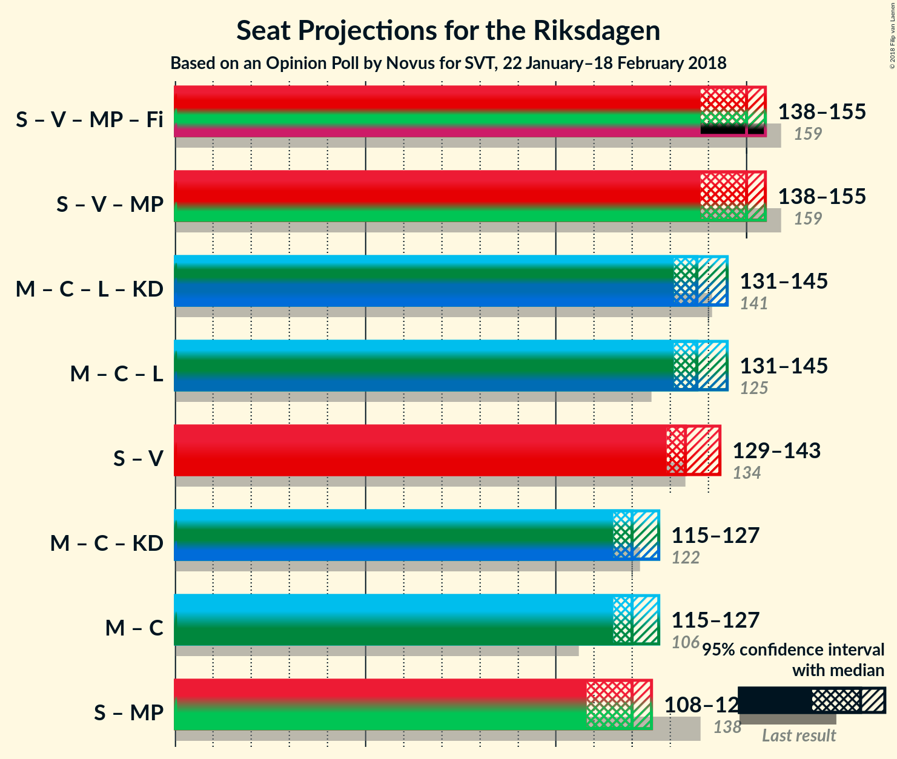

# Opinion Poll by Novus for SVT, 22 January–18 February 2018

<a href="#voting-intentions">Voting Intentions</a> | <a href="#seats">Seats</a> | <a href="#coalitions">Coalitions</a> | <a href="#technical-information">Technical Information</a>

## Voting Intentions

### Confidence Intervals

| Party | Last Result | Poll Result | 80% Confidence Interval | 90% Confidence Interval | 95% Confidence Interval | 99% Confidence Interval |
|:-----:|:-----------:|:-----------:|:-----------------------:|:-----------------------:|:-----------------------:|:-----------------------:|
| Sveriges socialdemokratiska arbetareparti | 31.0% | 28.4% | 27.6–29.2% |27.4–29.5% |27.2–29.7% |26.8–30.1% |
| Moderata samlingspartiet | 23.3% | 23.7% | 22.9–24.5% |22.7–24.7% |22.5–24.9% |22.2–25.3% |
| Sverigedemokraterna | 12.9% | 17.1% | 16.4–17.8% |16.2–18.0% |16.1–18.2% |15.8–18.5% |
| Centerpartiet | 6.1% | 8.8% | 8.3–9.3% |8.2–9.5% |8.0–9.6% |7.8–9.9% |
| Vänsterpartiet | 5.7% | 8.1% | 7.6–8.6% |7.5–8.8% |7.4–8.9% |7.1–9.1% |
| Liberalerna | 5.4% | 4.6% | 4.2–5.0% |4.1–5.1% |4.0–5.2% |3.9–5.4% |
| Miljöpartiet de gröna | 6.9% | 4.3% | 3.9–4.7% |3.8–4.8% |3.8–4.9% |3.6–5.1% |
| Kristdemokraterna | 4.6% | 2.7% | 2.4–3.0% |2.3–3.1% |2.3–3.2% |2.1–3.4% |

*Note:* The poll result column reflects the actual value used in the calculations. Published results may vary slightly, and in addition be rounded to fewer digits.

## Seats

### Confidence Intervals

| Party | Last Result | Median | 80% Confidence Interval | 90% Confidence Interval | 95% Confidence Interval | 99% Confidence Interval |
|:-----:|:-----------:|:------:|:-----------------------:|:-----------------------:|:-----------------------:|:-----------------------:|
| <a href="#sveriges-socialdemokratiska-arbetareparti">Sveriges socialdemokratiska arbetareparti</a> | 113 | 112 | 104–112 |101–112 |101–112 |99–113 |
| <a href="#moderata-samlingspartiet">Moderata samlingspartiet</a> | 84 | 100 | 89–100 |85–100 |82–100 |82–100 |
| <a href="#sverigedemokraterna">Sverigedemokraterna</a> | 49 | 70 | 67–70 |66–70 |66–70 |63–70 |
| <a href="#centerpartiet">Centerpartiet</a> | 22 | 35 | 32–36 |31–36 |31–36 |31–36 |
| <a href="#vänsterpartiet">Vänsterpartiet</a> | 21 | 32 | 30–32 |30–32 |30–32 |27–32 |
| <a href="#liberalerna">Liberalerna</a> | 19 | 0 | 0–19 |0–19 |0–19 |0–19 |
| <a href="#miljöpartiet-de-gröna">Miljöpartiet de gröna</a> | 25 | 0 | 0 |0–18 |0–18 |0–18 |
| <a href="#kristdemokraterna">Kristdemokraterna</a> | 16 | 0 | 0 |0 |0 |0 |

### Sveriges socialdemokratiska arbetareparti

*For a full overview of the results for this party, see the [Sveriges socialdemokratiska arbetareparti](party-sverigessocialdemokratiskaarbetareparti.html) page.*

| Number of Seats | Probability | Accumulated | Special Marks |
|:---------------:|:-----------:|:-----------:|:-------------:|
| 99 | 1.3% | 100% |  |
| 100 | 0% | 98.7% |  |
| 101 | 5% | 98.7% |  |
| 102 | 0% | 94% |  |
| 103 | 0% | 94% |  |
| 104 | 11% | 94% |  |
| 105 | 0% | 83% |  |
| 106 | 0% | 83% |  |
| 107 | 0.1% | 83% |  |
| 108 | 0% | 83% |  |
| 109 | 0% | 83% |  |
| 110 | 7% | 83% |  |
| 111 | 0% | 76% |  |
| 112 | 75% | 76% | Median |
| 113 | 1.2% | 1.2% | Last Result |
| 114 | 0% | 0% |  |

### Moderata samlingspartiet

*For a full overview of the results for this party, see the [Moderata samlingspartiet](party-moderatasamlingspartiet.html) page.*

| Number of Seats | Probability | Accumulated | Special Marks |
|:---------------:|:-----------:|:-----------:|:-------------:|
| 82 | 5% | 100% |  |
| 83 | 0% | 95% |  |
| 84 | 0.1% | 95% | Last Result |
| 85 | 1.3% | 95% |  |
| 86 | 0% | 94% |  |
| 87 | 0% | 94% |  |
| 88 | 0.2% | 94% |  |
| 89 | 7% | 94% |  |
| 90 | 0% | 87% |  |
| 91 | 0% | 87% |  |
| 92 | 0% | 87% |  |
| 93 | 11% | 87% |  |
| 94 | 0% | 76% |  |
| 95 | 1.1% | 76% |  |
| 96 | 0% | 75% |  |
| 97 | 0% | 75% |  |
| 98 | 0% | 75% |  |
| 99 | 0% | 75% |  |
| 100 | 75% | 75% | Median |
| 101 | 0% | 0% |  |

### Sverigedemokraterna

*For a full overview of the results for this party, see the [Sverigedemokraterna](party-sverigedemokraterna.html) page.*

| Number of Seats | Probability | Accumulated | Special Marks |
|:---------------:|:-----------:|:-----------:|:-------------:|
| 49 | 0% | 100% | Last Result |
| 50 | 0% | 100% |  |
| 51 | 0% | 100% |  |
| 52 | 0% | 100% |  |
| 53 | 0% | 100% |  |
| 54 | 0% | 100% |  |
| 55 | 0% | 100% |  |
| 56 | 0% | 100% |  |
| 57 | 0% | 100% |  |
| 58 | 0% | 100% |  |
| 59 | 0% | 100% |  |
| 60 | 0.1% | 100% |  |
| 61 | 0% | 99.9% |  |
| 62 | 0% | 99.9% |  |
| 63 | 1.1% | 99.9% |  |
| 64 | 0.2% | 98.8% |  |
| 65 | 0% | 98.6% |  |
| 66 | 5% | 98.6% |  |
| 67 | 11% | 94% |  |
| 68 | 0% | 83% |  |
| 69 | 0% | 83% |  |
| 70 | 83% | 83% | Median |
| 71 | 0% | 0% |  |

### Centerpartiet

*For a full overview of the results for this party, see the [Centerpartiet](party-centerpartiet.html) page.*

| Number of Seats | Probability | Accumulated | Special Marks |
|:---------------:|:-----------:|:-----------:|:-------------:|
| 22 | 0% | 100% | Last Result |
| 23 | 0% | 100% |  |
| 24 | 0% | 100% |  |
| 25 | 0% | 100% |  |
| 26 | 0% | 100% |  |
| 27 | 0% | 100% |  |
| 28 | 0% | 100% |  |
| 29 | 0% | 100% |  |
| 30 | 0% | 100% |  |
| 31 | 6% | 100% |  |
| 32 | 7% | 94% |  |
| 33 | 0% | 87% |  |
| 34 | 0.1% | 87% |  |
| 35 | 76% | 87% | Median |
| 36 | 11% | 11% |  |
| 37 | 0% | 0% |  |

### Vänsterpartiet

*For a full overview of the results for this party, see the [Vänsterpartiet](party-vänsterpartiet.html) page.*

| Number of Seats | Probability | Accumulated | Special Marks |
|:---------------:|:-----------:|:-----------:|:-------------:|
| 21 | 0% | 100% | Last Result |
| 22 | 0% | 100% |  |
| 23 | 0% | 100% |  |
| 24 | 0% | 100% |  |
| 25 | 0.1% | 100% |  |
| 26 | 0% | 99.9% |  |
| 27 | 1.1% | 99.9% |  |
| 28 | 1.2% | 98.9% |  |
| 29 | 0.1% | 98% |  |
| 30 | 18% | 98% |  |
| 31 | 0% | 80% |  |
| 32 | 80% | 80% | Median |
| 33 | 0.1% | 0.1% |  |
| 34 | 0% | 0% |  |

### Liberalerna

*For a full overview of the results for this party, see the [Liberalerna](party-liberalerna.html) page.*

| Number of Seats | Probability | Accumulated | Special Marks |
|:---------------:|:-----------:|:-----------:|:-------------:|
| 0 | 75% | 100% | Median |
| 1 | 0% | 25% |  |
| 2 | 0% | 25% |  |
| 3 | 0% | 25% |  |
| 4 | 0% | 25% |  |
| 5 | 0% | 25% |  |
| 6 | 0% | 25% |  |
| 7 | 0% | 25% |  |
| 8 | 0% | 25% |  |
| 9 | 0% | 25% |  |
| 10 | 0% | 25% |  |
| 11 | 0% | 25% |  |
| 12 | 0% | 25% |  |
| 13 | 0% | 25% |  |
| 14 | 0% | 25% |  |
| 15 | 0.1% | 25% |  |
| 16 | 1.3% | 25% |  |
| 17 | 0% | 24% |  |
| 18 | 8% | 24% |  |
| 19 | 16% | 16% | Last Result |
| 20 | 0% | 0.1% |  |
| 21 | 0% | 0% |  |

### Miljöpartiet de gröna

*For a full overview of the results for this party, see the [Miljöpartiet de gröna](party-miljöpartietdegröna.html) page.*

| Number of Seats | Probability | Accumulated | Special Marks |
|:---------------:|:-----------:|:-----------:|:-------------:|
| 0 | 94% | 100% | Median |
| 1 | 0% | 6% |  |
| 2 | 0% | 6% |  |
| 3 | 0% | 6% |  |
| 4 | 0% | 6% |  |
| 5 | 0% | 6% |  |
| 6 | 0% | 6% |  |
| 7 | 0% | 6% |  |
| 8 | 0% | 6% |  |
| 9 | 0% | 6% |  |
| 10 | 0% | 6% |  |
| 11 | 0% | 6% |  |
| 12 | 0% | 6% |  |
| 13 | 0% | 6% |  |
| 14 | 0% | 6% |  |
| 15 | 0.1% | 6% |  |
| 16 | 0% | 6% |  |
| 17 | 0% | 6% |  |
| 18 | 6% | 6% |  |
| 19 | 0.1% | 0.1% |  |
| 20 | 0% | 0% |  |
| 21 | 0% | 0% |  |
| 22 | 0% | 0% |  |
| 23 | 0% | 0% |  |
| 24 | 0% | 0% |  |
| 25 | 0% | 0% | Last Result |

### Kristdemokraterna

*For a full overview of the results for this party, see the [Kristdemokraterna](party-kristdemokraterna.html) page.*

| Number of Seats | Probability | Accumulated | Special Marks |
|:---------------:|:-----------:|:-----------:|:-------------:|
| 0 | 100% | 100% | Median |
| 1 | 0% | 0% |  |
| 2 | 0% | 0% |  |
| 3 | 0% | 0% |  |
| 4 | 0% | 0% |  |
| 5 | 0% | 0% |  |
| 6 | 0% | 0% |  |
| 7 | 0% | 0% |  |
| 8 | 0% | 0% |  |
| 9 | 0% | 0% |  |
| 10 | 0% | 0% |  |
| 11 | 0% | 0% |  |
| 12 | 0% | 0% |  |
| 13 | 0% | 0% |  |
| 14 | 0% | 0% |  |
| 15 | 0% | 0% |  |
| 16 | 0% | 0% | Last Result |

## Coalitions

### Confidence Intervals

| Coalition | Last Result | Median | Majority? | 80% Confidence Interval | 90% Confidence Interval | 95% Confidence Interval | 99% Confidence Interval |
|:---------:|:-----------:|:------:|:---------:|:-----------------------:|:-----------------------:|:-----------------------:|:-----------------------:|
| Sveriges socialdemokratiska arbetareparti – Vänsterpartiet – Miljöpartiet de gröna | 159 | 144 | 0% | 134–144 | 134–149 | 134–151 | 134–151 |
| Moderata samlingspartiet – Centerpartiet – Liberalerna – Kristdemokraterna | 141 | 135 | 0% | 135–148 | 135–148 | 132–148 | 132–148 |
| Moderata samlingspartiet – Centerpartiet – Liberalerna | 125 | 135 | 0% | 135–148 | 135–148 | 132–148 | 132–148 |
| Sveriges socialdemokratiska arbetareparti – Vänsterpartiet | 134 | 144 | 0% | 134–144 | 133–144 | 133–144 | 126–144 |
| Moderata samlingspartiet – Centerpartiet – Kristdemokraterna | 122 | 135 | 0% | 121–135 | 120–135 | 113–135 | 113–135 |
| Moderata samlingspartiet – Centerpartiet | 106 | 135 | 0% | 121–135 | 120–135 | 113–135 | 113–135 |

### Sveriges socialdemokratiska arbetareparti – Vänsterpartiet – Miljöpartiet de gröna

| Number of Seats | Probability | Accumulated | Special Marks |
|:---------------:|:-----------:|:-----------:|:-------------:|
| 134 | 11% | 100% |  |
| 135 | 0% | 89% |  |
| 136 | 0% | 89% |  |
| 137 | 0% | 89% |  |
| 138 | 0% | 89% |  |
| 139 | 0% | 89% |  |
| 140 | 7% | 89% |  |
| 141 | 1.2% | 82% |  |
| 142 | 0% | 81% |  |
| 143 | 0% | 81% |  |
| 144 | 76% | 81% | Median |
| 145 | 0% | 5% |  |
| 146 | 0% | 5% |  |
| 147 | 0% | 5% |  |
| 148 | 0% | 5% |  |
| 149 | 0.2% | 5% |  |
| 150 | 0% | 5% |  |
| 151 | 5% | 5% |  |
| 152 | 0% | 0.2% |  |
| 153 | 0% | 0.1% |  |
| 154 | 0% | 0.1% |  |
| 155 | 0.1% | 0.1% |  |
| 156 | 0% | 0% |  |
| 157 | 0% | 0% |  |
| 158 | 0% | 0% |  |
| 159 | 0% | 0% | Last Result |

### Moderata samlingspartiet – Centerpartiet – Liberalerna – Kristdemokraterna

| Number of Seats | Probability | Accumulated | Special Marks |
|:---------------:|:-----------:|:-----------:|:-------------:|
| 130 | 0% | 100% |  |
| 131 | 0% | 99.9% |  |
| 132 | 5% | 99.9% |  |
| 133 | 0% | 95% |  |
| 134 | 0.1% | 95% |  |
| 135 | 75% | 95% | Median |
| 136 | 0.3% | 20% |  |
| 137 | 0% | 20% |  |
| 138 | 1.2% | 20% |  |
| 139 | 7% | 19% |  |
| 140 | 0% | 12% |  |
| 141 | 0% | 12% | Last Result |
| 142 | 1.1% | 12% |  |
| 143 | 0% | 11% |  |
| 144 | 0% | 11% |  |
| 145 | 0% | 11% |  |
| 146 | 0% | 11% |  |
| 147 | 0% | 11% |  |
| 148 | 11% | 11% |  |
| 149 | 0% | 0% |  |

### Moderata samlingspartiet – Centerpartiet – Liberalerna

| Number of Seats | Probability | Accumulated | Special Marks |
|:---------------:|:-----------:|:-----------:|:-------------:|
| 125 | 0% | 100% | Last Result |
| 126 | 0% | 100% |  |
| 127 | 0% | 100% |  |
| 128 | 0% | 100% |  |
| 129 | 0% | 100% |  |
| 130 | 0% | 100% |  |
| 131 | 0% | 99.9% |  |
| 132 | 5% | 99.9% |  |
| 133 | 0% | 95% |  |
| 134 | 0.1% | 95% |  |
| 135 | 75% | 95% | Median |
| 136 | 0.3% | 20% |  |
| 137 | 0% | 20% |  |
| 138 | 1.2% | 20% |  |
| 139 | 7% | 19% |  |
| 140 | 0% | 12% |  |
| 141 | 0% | 12% |  |
| 142 | 1.1% | 12% |  |
| 143 | 0% | 11% |  |
| 144 | 0% | 11% |  |
| 145 | 0% | 11% |  |
| 146 | 0% | 11% |  |
| 147 | 0% | 11% |  |
| 148 | 11% | 11% |  |
| 149 | 0% | 0% |  |

### Sveriges socialdemokratiska arbetareparti – Vänsterpartiet

| Number of Seats | Probability | Accumulated | Special Marks |
|:---------------:|:-----------:|:-----------:|:-------------:|
| 126 | 1.1% | 100% |  |
| 127 | 0% | 98.9% |  |
| 128 | 0% | 98.9% |  |
| 129 | 0% | 98.9% |  |
| 130 | 0% | 98.9% |  |
| 131 | 0.2% | 98.9% |  |
| 132 | 0% | 98.7% |  |
| 133 | 5% | 98.7% |  |
| 134 | 11% | 94% | Last Result |
| 135 | 0% | 83% |  |
| 136 | 0.1% | 83% |  |
| 137 | 0% | 83% |  |
| 138 | 0% | 83% |  |
| 139 | 0% | 83% |  |
| 140 | 7% | 83% |  |
| 141 | 1.2% | 76% |  |
| 142 | 0% | 75% |  |
| 143 | 0% | 75% |  |
| 144 | 75% | 75% | Median |
| 145 | 0% | 0% |  |

### Moderata samlingspartiet – Centerpartiet – Kristdemokraterna

| Number of Seats | Probability | Accumulated | Special Marks |
|:---------------:|:-----------:|:-----------:|:-------------:|
| 113 | 5% | 100% |  |
| 114 | 0% | 95% |  |
| 115 | 0% | 95% |  |
| 116 | 0% | 95% |  |
| 117 | 0% | 95% |  |
| 118 | 0% | 95% |  |
| 119 | 0.1% | 95% |  |
| 120 | 1.5% | 95% |  |
| 121 | 7% | 94% |  |
| 122 | 0% | 87% | Last Result |
| 123 | 0% | 87% |  |
| 124 | 0% | 87% |  |
| 125 | 0% | 87% |  |
| 126 | 1.1% | 87% |  |
| 127 | 0% | 86% |  |
| 128 | 0% | 86% |  |
| 129 | 11% | 86% |  |
| 130 | 0% | 75% |  |
| 131 | 0% | 75% |  |
| 132 | 0% | 75% |  |
| 133 | 0% | 75% |  |
| 134 | 0% | 75% |  |
| 135 | 75% | 75% | Median |
| 136 | 0% | 0% |  |

### Moderata samlingspartiet – Centerpartiet

| Number of Seats | Probability | Accumulated | Special Marks |
|:---------------:|:-----------:|:-----------:|:-------------:|
| 106 | 0% | 100% | Last Result |
| 107 | 0% | 100% |  |
| 108 | 0% | 100% |  |
| 109 | 0% | 100% |  |
| 110 | 0% | 100% |  |
| 111 | 0% | 100% |  |
| 112 | 0% | 100% |  |
| 113 | 5% | 100% |  |
| 114 | 0% | 95% |  |
| 115 | 0% | 95% |  |
| 116 | 0% | 95% |  |
| 117 | 0% | 95% |  |
| 118 | 0% | 95% |  |
| 119 | 0.1% | 95% |  |
| 120 | 1.5% | 95% |  |
| 121 | 7% | 94% |  |
| 122 | 0% | 87% |  |
| 123 | 0% | 87% |  |
| 124 | 0% | 87% |  |
| 125 | 0% | 87% |  |
| 126 | 1.1% | 87% |  |
| 127 | 0% | 86% |  |
| 128 | 0% | 86% |  |
| 129 | 11% | 86% |  |
| 130 | 0% | 75% |  |
| 131 | 0% | 75% |  |
| 132 | 0% | 75% |  |
| 133 | 0% | 75% |  |
| 134 | 0% | 75% |  |
| 135 | 75% | 75% | Median |
| 136 | 0% | 0% |  |

## Technical Information

### Opinion Poll

+ **Polling firm:** Novus
+ **Commissioner(s):** SVT
+ **Fieldwork period:** 22 January–18 February 2018

### Calculations

+ **Sample size:** 5002
+ **Simulations done:** 1,024
+ **Error estimate:** 1.89%

