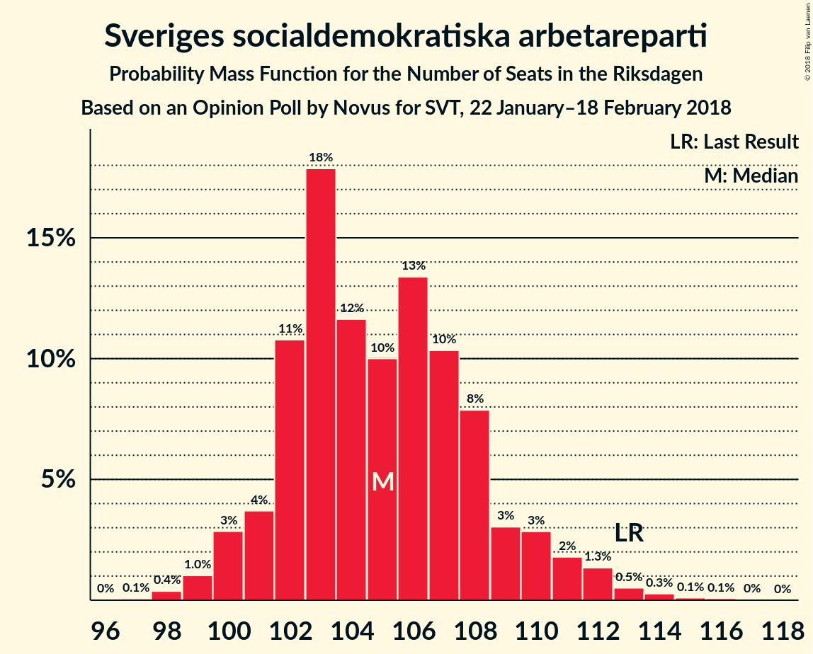
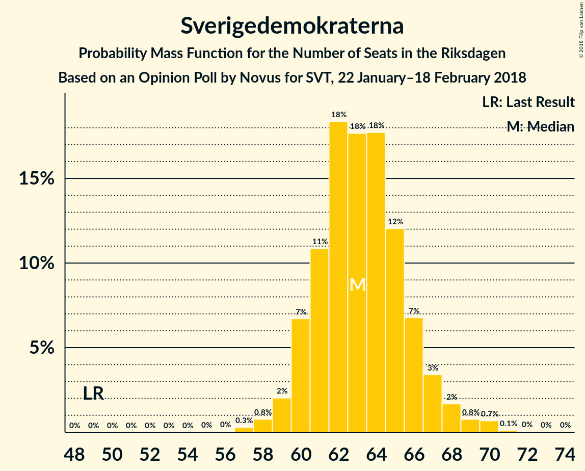
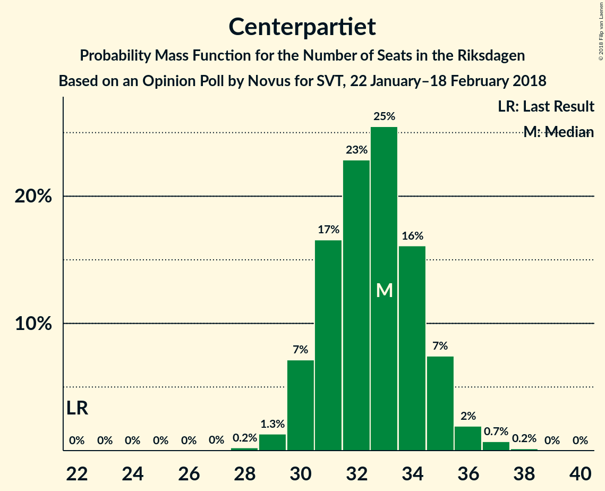
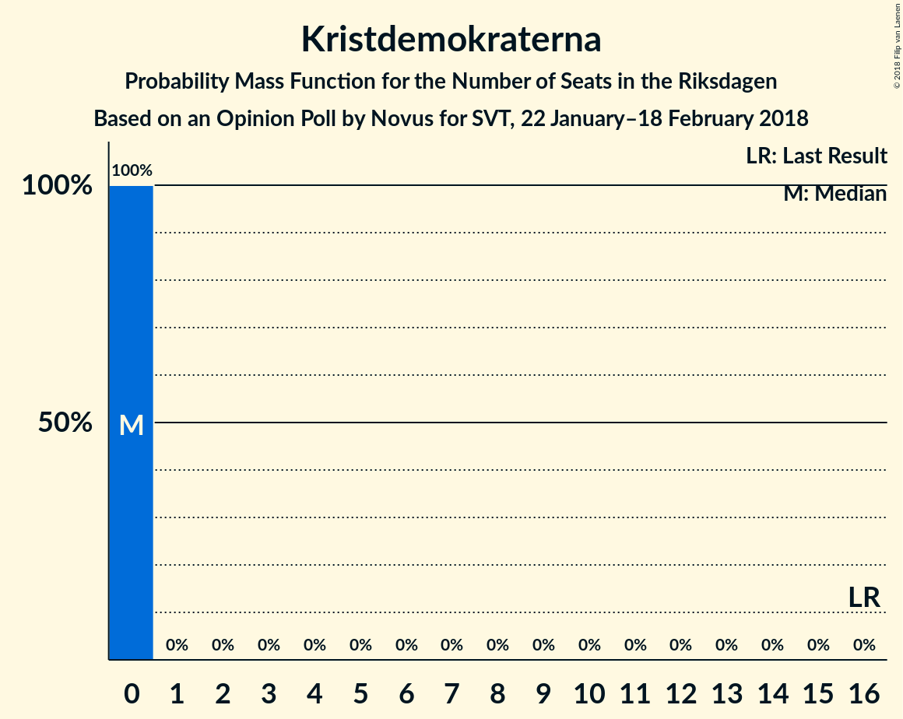

# Opinion Poll by Novus for SVT, 22 January–18 February 2018

<a href="#voting-intentions">Voting Intentions</a> | <a href="#seats">Seats</a> | <a href="#coalitions">Coalitions</a> | <a href="#technical-information">Technical Information</a>

## Voting Intentions

### Confidence Intervals

| Party | Last Result | Poll Result | 80% Confidence Interval | 90% Confidence Interval | 95% Confidence Interval | 99% Confidence Interval |
|:-----:|:-----------:|:-----------:|:-----------------------:|:-----------------------:|:-----------------------:|:-----------------------:|
| Sveriges socialdemokratiska arbetareparti | 31.0% | 28.4% | 27.6–29.2% |27.4–29.5% |27.2–29.7% |26.8–30.1% |
| Moderata samlingspartiet | 23.3% | 23.7% | 22.9–24.5% |22.7–24.7% |22.5–24.9% |22.2–25.3% |
| Sverigedemokraterna | 12.9% | 17.1% | 16.4–17.8% |16.2–18.0% |16.1–18.2% |15.8–18.5% |
| Centerpartiet | 6.1% | 8.8% | 8.3–9.3% |8.2–9.5% |8.0–9.6% |7.8–9.9% |
| Vänsterpartiet | 5.7% | 8.1% | 7.6–8.6% |7.5–8.8% |7.4–8.9% |7.1–9.1% |
| Liberalerna | 5.4% | 4.6% | 4.2–5.0% |4.1–5.1% |4.0–5.2% |3.9–5.4% |
| Miljöpartiet de gröna | 6.9% | 4.3% | 3.9–4.7% |3.8–4.8% |3.8–4.9% |3.6–5.1% |
| Kristdemokraterna | 4.6% | 2.7% | 2.4–3.0% |2.3–3.1% |2.3–3.2% |2.1–3.4% |

*Note:* The poll result column reflects the actual value used in the calculations. Published results may vary slightly, and in addition be rounded to fewer digits.

## Seats

### Confidence Intervals

| Party | Last Result | Median | 80% Confidence Interval | 90% Confidence Interval | 95% Confidence Interval | 99% Confidence Interval |
|:-----:|:-----------:|:------:|:-----------------------:|:-----------------------:|:-----------------------:|:-----------------------:|
| <a href="#sveriges-socialdemokratiska-arbetareparti">Sveriges socialdemokratiska arbetareparti</a> | 113 | 104 | 102–108 |101–111 |99–112 |98–113 |
| <a href="#moderata-samlingspartiet">Moderata samlingspartiet</a> | 84 | 88 | 85–90 |84–92 |83–93 |81–95 |
| <a href="#sverigedemokraterna">Sverigedemokraterna</a> | 49 | 63 | 61–65 |60–67 |60–68 |58–70 |
| <a href="#centerpartiet">Centerpartiet</a> | 22 | 33 | 31–35 |30–35 |30–35 |29–37 |
| <a href="#vänsterpartiet">Vänsterpartiet</a> | 21 | 30 | 28–32 |28–33 |27–33 |26–34 |
| <a href="#liberalerna">Liberalerna</a> | 19 | 17 | 15–18 |15–19 |15–19 |0–20 |
| <a href="#miljöpartiet-de-gröna">Miljöpartiet de gröna</a> | 25 | 16 | 0–17 |0–18 |0–18 |0–19 |
| <a href="#kristdemokraterna">Kristdemokraterna</a> | 16 | 0 | 0 |0 |0 |0 |

### Sveriges socialdemokratiska arbetareparti

*For a full overview of the results for this party, see the [Sveriges socialdemokratiska arbetareparti](party-sverigessocialdemokratiskaarbetareparti.html) page.*

| Number of Seats | Probability | Accumulated | Special Marks |
|:---------------:|:-----------:|:-----------:|:-------------:|
| 97 | 0.1% | 100% |  |
| 98 | 0.5% | 99.9% |  |
| 99 | 2% | 99.5% |  |
| 100 | 0.6% | 97% |  |
| 101 | 2% | 97% |  |
| 102 | 25% | 95% |  |
| 103 | 11% | 69% |  |
| 104 | 23% | 59% | Median |
| 105 | 13% | 35% |  |
| 106 | 3% | 22% |  |
| 107 | 6% | 19% |  |
| 108 | 4% | 13% |  |
| 109 | 2% | 9% |  |
| 110 | 1.2% | 7% |  |
| 111 | 1.2% | 6% |  |
| 112 | 4% | 5% |  |
| 113 | 0.5% | 0.8% | Last Result |
| 114 | 0.1% | 0.3% |  |
| 115 | 0.1% | 0.2% |  |
| 116 | 0% | 0.1% |  |
| 117 | 0% | 0% |  |

### Moderata samlingspartiet

*For a full overview of the results for this party, see the [Moderata samlingspartiet](party-moderatasamlingspartiet.html) page.*

| Number of Seats | Probability | Accumulated | Special Marks |
|:---------------:|:-----------:|:-----------:|:-------------:|
| 80 | 0.1% | 100% |  |
| 81 | 1.0% | 99.9% |  |
| 82 | 0.7% | 98.9% |  |
| 83 | 1.0% | 98% |  |
| 84 | 4% | 97% | Last Result |
| 85 | 7% | 93% |  |
| 86 | 10% | 86% |  |
| 87 | 16% | 76% |  |
| 88 | 33% | 60% | Median |
| 89 | 16% | 27% |  |
| 90 | 2% | 11% |  |
| 91 | 4% | 9% |  |
| 92 | 2% | 5% |  |
| 93 | 2% | 4% |  |
| 94 | 1.0% | 2% |  |
| 95 | 0.5% | 0.8% |  |
| 96 | 0.1% | 0.3% |  |
| 97 | 0% | 0.2% |  |
| 98 | 0% | 0.2% |  |
| 99 | 0% | 0.2% |  |
| 100 | 0.2% | 0.2% |  |
| 101 | 0% | 0% |  |

### Sverigedemokraterna

*For a full overview of the results for this party, see the [Sverigedemokraterna](party-sverigedemokraterna.html) page.*

| Number of Seats | Probability | Accumulated | Special Marks |
|:---------------:|:-----------:|:-----------:|:-------------:|
| 49 | 0% | 100% | Last Result |
| 50 | 0% | 100% |  |
| 51 | 0% | 100% |  |
| 52 | 0% | 100% |  |
| 53 | 0% | 100% |  |
| 54 | 0% | 100% |  |
| 55 | 0% | 100% |  |
| 56 | 0% | 100% |  |
| 57 | 0.3% | 100% |  |
| 58 | 0.3% | 99.7% |  |
| 59 | 2% | 99.5% |  |
| 60 | 6% | 98% |  |
| 61 | 16% | 91% |  |
| 62 | 11% | 76% |  |
| 63 | 17% | 64% | Median |
| 64 | 29% | 47% |  |
| 65 | 10% | 18% |  |
| 66 | 2% | 8% |  |
| 67 | 3% | 6% |  |
| 68 | 0.9% | 3% |  |
| 69 | 0.6% | 2% |  |
| 70 | 0.8% | 1.1% |  |
| 71 | 0.2% | 0.3% |  |
| 72 | 0% | 0% |  |

### Centerpartiet

*For a full overview of the results for this party, see the [Centerpartiet](party-centerpartiet.html) page.*

| Number of Seats | Probability | Accumulated | Special Marks |
|:---------------:|:-----------:|:-----------:|:-------------:|
| 22 | 0% | 100% | Last Result |
| 23 | 0% | 100% |  |
| 24 | 0% | 100% |  |
| 25 | 0% | 100% |  |
| 26 | 0% | 100% |  |
| 27 | 0% | 100% |  |
| 28 | 0.2% | 100% |  |
| 29 | 1.1% | 99.8% |  |
| 30 | 5% | 98.6% |  |
| 31 | 24% | 94% |  |
| 32 | 12% | 70% |  |
| 33 | 32% | 58% | Median |
| 34 | 13% | 26% |  |
| 35 | 11% | 12% |  |
| 36 | 0.7% | 2% |  |
| 37 | 0.7% | 0.9% |  |
| 38 | 0.2% | 0.2% |  |
| 39 | 0% | 0% |  |

### Vänsterpartiet

*For a full overview of the results for this party, see the [Vänsterpartiet](party-vänsterpartiet.html) page.*

| Number of Seats | Probability | Accumulated | Special Marks |
|:---------------:|:-----------:|:-----------:|:-------------:|
| 21 | 0% | 100% | Last Result |
| 22 | 0% | 100% |  |
| 23 | 0% | 100% |  |
| 24 | 0% | 100% |  |
| 25 | 0.1% | 100% |  |
| 26 | 0.5% | 99.9% |  |
| 27 | 3% | 99.4% |  |
| 28 | 13% | 96% |  |
| 29 | 9% | 83% |  |
| 30 | 55% | 75% | Median |
| 31 | 7% | 20% |  |
| 32 | 6% | 13% |  |
| 33 | 6% | 7% |  |
| 34 | 0.6% | 1.0% |  |
| 35 | 0.4% | 0.4% |  |
| 36 | 0% | 0% |  |

### Liberalerna

*For a full overview of the results for this party, see the [Liberalerna](party-liberalerna.html) page.*

| Number of Seats | Probability | Accumulated | Special Marks |
|:---------------:|:-----------:|:-----------:|:-------------:|
| 0 | 1.4% | 100% |  |
| 1 | 0% | 98.6% |  |
| 2 | 0% | 98.6% |  |
| 3 | 0% | 98.6% |  |
| 4 | 0% | 98.6% |  |
| 5 | 0% | 98.6% |  |
| 6 | 0% | 98.6% |  |
| 7 | 0% | 98.6% |  |
| 8 | 0% | 98.6% |  |
| 9 | 0% | 98.6% |  |
| 10 | 0% | 98.6% |  |
| 11 | 0% | 98.6% |  |
| 12 | 0% | 98.6% |  |
| 13 | 0% | 98.6% |  |
| 14 | 0% | 98.6% |  |
| 15 | 12% | 98.6% |  |
| 16 | 20% | 86% |  |
| 17 | 37% | 66% | Median |
| 18 | 20% | 29% |  |
| 19 | 7% | 9% | Last Result |
| 20 | 2% | 2% |  |
| 21 | 0.1% | 0.1% |  |
| 22 | 0% | 0% |  |

### Miljöpartiet de gröna

*For a full overview of the results for this party, see the [Miljöpartiet de gröna](party-miljöpartietdegröna.html) page.*

| Number of Seats | Probability | Accumulated | Special Marks |
|:---------------:|:-----------:|:-----------:|:-------------:|
| 0 | 10% | 100% |  |
| 1 | 0% | 90% |  |
| 2 | 0% | 90% |  |
| 3 | 0% | 90% |  |
| 4 | 0% | 90% |  |
| 5 | 0% | 90% |  |
| 6 | 0% | 90% |  |
| 7 | 0% | 90% |  |
| 8 | 0% | 90% |  |
| 9 | 0% | 90% |  |
| 10 | 0% | 90% |  |
| 11 | 0% | 90% |  |
| 12 | 0% | 90% |  |
| 13 | 0% | 90% |  |
| 14 | 0% | 90% |  |
| 15 | 31% | 90% |  |
| 16 | 13% | 59% | Median |
| 17 | 41% | 46% |  |
| 18 | 4% | 5% |  |
| 19 | 1.3% | 1.3% |  |
| 20 | 0% | 0% |  |
| 21 | 0% | 0% |  |
| 22 | 0% | 0% |  |
| 23 | 0% | 0% |  |
| 24 | 0% | 0% |  |
| 25 | 0% | 0% | Last Result |

### Kristdemokraterna

*For a full overview of the results for this party, see the [Kristdemokraterna](party-kristdemokraterna.html) page.*

| Number of Seats | Probability | Accumulated | Special Marks |
|:---------------:|:-----------:|:-----------:|:-------------:|
| 0 | 100% | 100% | Median |
| 1 | 0% | 0% |  |
| 2 | 0% | 0% |  |
| 3 | 0% | 0% |  |
| 4 | 0% | 0% |  |
| 5 | 0% | 0% |  |
| 6 | 0% | 0% |  |
| 7 | 0% | 0% |  |
| 8 | 0% | 0% |  |
| 9 | 0% | 0% |  |
| 10 | 0% | 0% |  |
| 11 | 0% | 0% |  |
| 12 | 0% | 0% |  |
| 13 | 0% | 0% |  |
| 14 | 0% | 0% |  |
| 15 | 0% | 0% |  |
| 16 | 0% | 0% | Last Result |

## Coalitions

### Confidence Intervals

| Coalition | Last Result | Median | Majority? | 80% Confidence Interval | 90% Confidence Interval | 95% Confidence Interval | 99% Confidence Interval |
|:---------:|:-----------:|:------:|:---------:|:-----------------------:|:-----------------------:|:-----------------------:|:-----------------------:|
| Sveriges socialdemokratiska arbetareparti – Vänsterpartiet – Miljöpartiet de gröna | 159 | 149 | 0% | 145–152 | 141–154 | 138–155 | 135–159 |
| Moderata samlingspartiet – Centerpartiet – Liberalerna – Kristdemokraterna | 141 | 137 | 0% | 133–140 | 132–142 | 131–145 | 126–147 |
| Moderata samlingspartiet – Centerpartiet – Liberalerna | 125 | 137 | 0% | 133–140 | 132–142 | 131–145 | 126–147 |
| Sveriges socialdemokratiska arbetareparti – Vänsterpartiet | 134 | 134 | 0% | 132–138 | 130–143 | 130–145 | 128–145 |
| Moderata samlingspartiet – Centerpartiet – Kristdemokraterna | 122 | 120 | 0% | 117–122 | 116–125 | 114–127 | 113–129 |
| Moderata samlingspartiet – Centerpartiet | 106 | 120 | 0% | 117–122 | 116–125 | 114–127 | 113–129 |

### Sveriges socialdemokratiska arbetareparti – Vänsterpartiet – Miljöpartiet de gröna

| Number of Seats | Probability | Accumulated | Special Marks |
|:---------------:|:-----------:|:-----------:|:-------------:|
| 134 | 0.4% | 100% |  |
| 135 | 0.3% | 99.6% |  |
| 136 | 0.5% | 99.3% |  |
| 137 | 0.2% | 98.8% |  |
| 138 | 2% | 98.6% |  |
| 139 | 1.2% | 97% |  |
| 140 | 0.3% | 96% |  |
| 141 | 0.6% | 96% |  |
| 142 | 0.6% | 95% |  |
| 143 | 0.7% | 94% |  |
| 144 | 1.0% | 94% |  |
| 145 | 5% | 93% |  |
| 146 | 2% | 88% |  |
| 147 | 5% | 86% |  |
| 148 | 14% | 81% |  |
| 149 | 27% | 66% |  |
| 150 | 10% | 39% | Median |
| 151 | 17% | 29% |  |
| 152 | 3% | 12% |  |
| 153 | 3% | 9% |  |
| 154 | 2% | 6% |  |
| 155 | 2% | 3% |  |
| 156 | 0.3% | 1.4% |  |
| 157 | 0.2% | 1.2% |  |
| 158 | 0.2% | 0.9% |  |
| 159 | 0.4% | 0.7% | Last Result |
| 160 | 0.1% | 0.3% |  |
| 161 | 0.1% | 0.2% |  |
| 162 | 0% | 0% |  |

### Moderata samlingspartiet – Centerpartiet – Liberalerna – Kristdemokraterna

| Number of Seats | Probability | Accumulated | Special Marks |
|:---------------:|:-----------:|:-----------:|:-------------:|
| 120 | 0.1% | 100% |  |
| 121 | 0.2% | 99.9% |  |
| 122 | 0.1% | 99.8% |  |
| 123 | 0.1% | 99.7% |  |
| 124 | 0% | 99.6% |  |
| 125 | 0% | 99.6% |  |
| 126 | 0.2% | 99.6% |  |
| 127 | 0.3% | 99.3% |  |
| 128 | 0.3% | 99.1% |  |
| 129 | 0.1% | 98.7% |  |
| 130 | 0.9% | 98.7% |  |
| 131 | 2% | 98% |  |
| 132 | 2% | 96% |  |
| 133 | 5% | 94% |  |
| 134 | 1.4% | 90% |  |
| 135 | 16% | 88% |  |
| 136 | 21% | 72% |  |
| 137 | 6% | 52% |  |
| 138 | 21% | 46% | Median |
| 139 | 4% | 24% |  |
| 140 | 14% | 21% |  |
| 141 | 0.9% | 6% | Last Result |
| 142 | 0.9% | 6% |  |
| 143 | 0.3% | 5% |  |
| 144 | 0.5% | 4% |  |
| 145 | 2% | 4% |  |
| 146 | 0.6% | 2% |  |
| 147 | 0.5% | 1.0% |  |
| 148 | 0.4% | 0.5% |  |
| 149 | 0% | 0% |  |

### Moderata samlingspartiet – Centerpartiet – Liberalerna

| Number of Seats | Probability | Accumulated | Special Marks |
|:---------------:|:-----------:|:-----------:|:-------------:|
| 120 | 0.1% | 100% |  |
| 121 | 0.2% | 99.9% |  |
| 122 | 0.1% | 99.8% |  |
| 123 | 0.1% | 99.7% |  |
| 124 | 0% | 99.6% |  |
| 125 | 0% | 99.6% | Last Result |
| 126 | 0.2% | 99.6% |  |
| 127 | 0.3% | 99.3% |  |
| 128 | 0.3% | 99.1% |  |
| 129 | 0.1% | 98.7% |  |
| 130 | 0.9% | 98.7% |  |
| 131 | 2% | 98% |  |
| 132 | 2% | 96% |  |
| 133 | 5% | 94% |  |
| 134 | 1.4% | 90% |  |
| 135 | 16% | 88% |  |
| 136 | 21% | 72% |  |
| 137 | 6% | 52% |  |
| 138 | 21% | 46% | Median |
| 139 | 4% | 24% |  |
| 140 | 14% | 21% |  |
| 141 | 0.9% | 6% |  |
| 142 | 0.9% | 6% |  |
| 143 | 0.3% | 5% |  |
| 144 | 0.5% | 4% |  |
| 145 | 2% | 4% |  |
| 146 | 0.6% | 2% |  |
| 147 | 0.5% | 1.0% |  |
| 148 | 0.4% | 0.5% |  |
| 149 | 0% | 0% |  |

### Sveriges socialdemokratiska arbetareparti – Vänsterpartiet

| Number of Seats | Probability | Accumulated | Special Marks |
|:---------------:|:-----------:|:-----------:|:-------------:|
| 126 | 0% | 100% |  |
| 127 | 0.2% | 99.9% |  |
| 128 | 0.3% | 99.8% |  |
| 129 | 1.4% | 99.4% |  |
| 130 | 6% | 98% |  |
| 131 | 2% | 92% |  |
| 132 | 22% | 90% |  |
| 133 | 16% | 68% |  |
| 134 | 23% | 52% | Last Result, Median |
| 135 | 6% | 30% |  |
| 136 | 6% | 23% |  |
| 137 | 5% | 17% |  |
| 138 | 2% | 12% |  |
| 139 | 2% | 10% |  |
| 140 | 1.3% | 8% |  |
| 141 | 0.9% | 7% |  |
| 142 | 0.8% | 6% |  |
| 143 | 1.0% | 5% |  |
| 144 | 0.5% | 4% |  |
| 145 | 4% | 4% |  |
| 146 | 0.2% | 0.3% |  |
| 147 | 0% | 0.1% |  |
| 148 | 0% | 0.1% |  |
| 149 | 0% | 0% |  |

### Moderata samlingspartiet – Centerpartiet – Kristdemokraterna

| Number of Seats | Probability | Accumulated | Special Marks |
|:---------------:|:-----------:|:-----------:|:-------------:|
| 112 | 0.1% | 100% |  |
| 113 | 0.6% | 99.9% |  |
| 114 | 2% | 99.2% |  |
| 115 | 2% | 97% |  |
| 116 | 1.4% | 96% |  |
| 117 | 5% | 94% |  |
| 118 | 10% | 90% |  |
| 119 | 21% | 80% |  |
| 120 | 14% | 59% |  |
| 121 | 10% | 45% | Median |
| 122 | 26% | 35% | Last Result |
| 123 | 1.4% | 9% |  |
| 124 | 1.3% | 8% |  |
| 125 | 1.4% | 6% |  |
| 126 | 2% | 5% |  |
| 127 | 1.3% | 3% |  |
| 128 | 0.7% | 2% |  |
| 129 | 0.8% | 1.2% |  |
| 130 | 0.1% | 0.4% |  |
| 131 | 0.1% | 0.3% |  |
| 132 | 0% | 0.2% |  |
| 133 | 0% | 0.2% |  |
| 134 | 0% | 0.2% |  |
| 135 | 0.2% | 0.2% |  |
| 136 | 0% | 0% |  |

### Moderata samlingspartiet – Centerpartiet

| Number of Seats | Probability | Accumulated | Special Marks |
|:---------------:|:-----------:|:-----------:|:-------------:|
| 106 | 0% | 100% | Last Result |
| 107 | 0% | 100% |  |
| 108 | 0% | 100% |  |
| 109 | 0% | 100% |  |
| 110 | 0% | 100% |  |
| 111 | 0% | 100% |  |
| 112 | 0.1% | 100% |  |
| 113 | 0.6% | 99.9% |  |
| 114 | 2% | 99.2% |  |
| 115 | 2% | 97% |  |
| 116 | 1.4% | 96% |  |
| 117 | 5% | 94% |  |
| 118 | 10% | 90% |  |
| 119 | 21% | 80% |  |
| 120 | 14% | 59% |  |
| 121 | 10% | 45% | Median |
| 122 | 26% | 35% |  |
| 123 | 1.4% | 9% |  |
| 124 | 1.3% | 8% |  |
| 125 | 1.4% | 6% |  |
| 126 | 2% | 5% |  |
| 127 | 1.3% | 3% |  |
| 128 | 0.7% | 2% |  |
| 129 | 0.8% | 1.2% |  |
| 130 | 0.1% | 0.4% |  |
| 131 | 0.1% | 0.3% |  |
| 132 | 0% | 0.2% |  |
| 133 | 0% | 0.2% |  |
| 134 | 0% | 0.2% |  |
| 135 | 0.2% | 0.2% |  |
| 136 | 0% | 0% |  |

## Technical Information

### Opinion Poll

+ **Polling firm:** Novus
+ **Commissioner(s):** SVT
+ **Fieldwork period:** 22 January–18 February 2018

### Calculations

+ **Sample size:** 5002
+ **Simulations done:** 131,072
+ **Error estimate:** 0.84%

