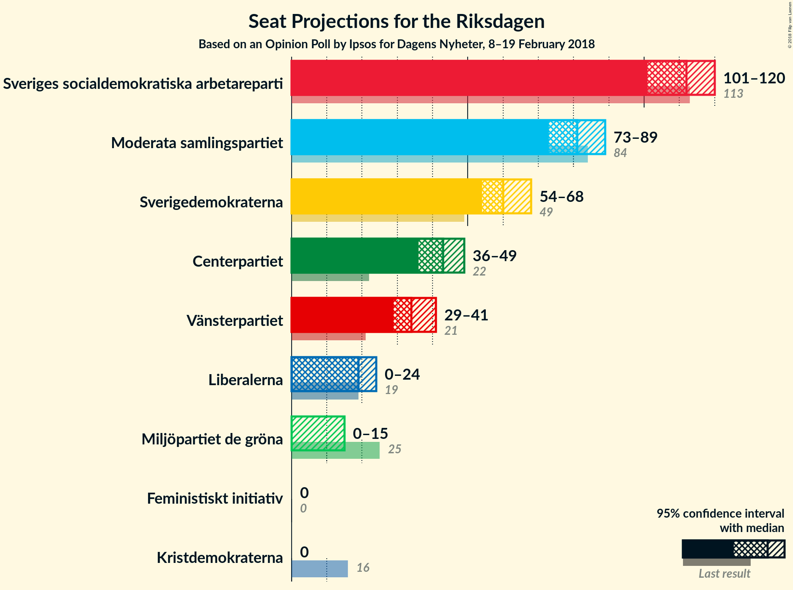
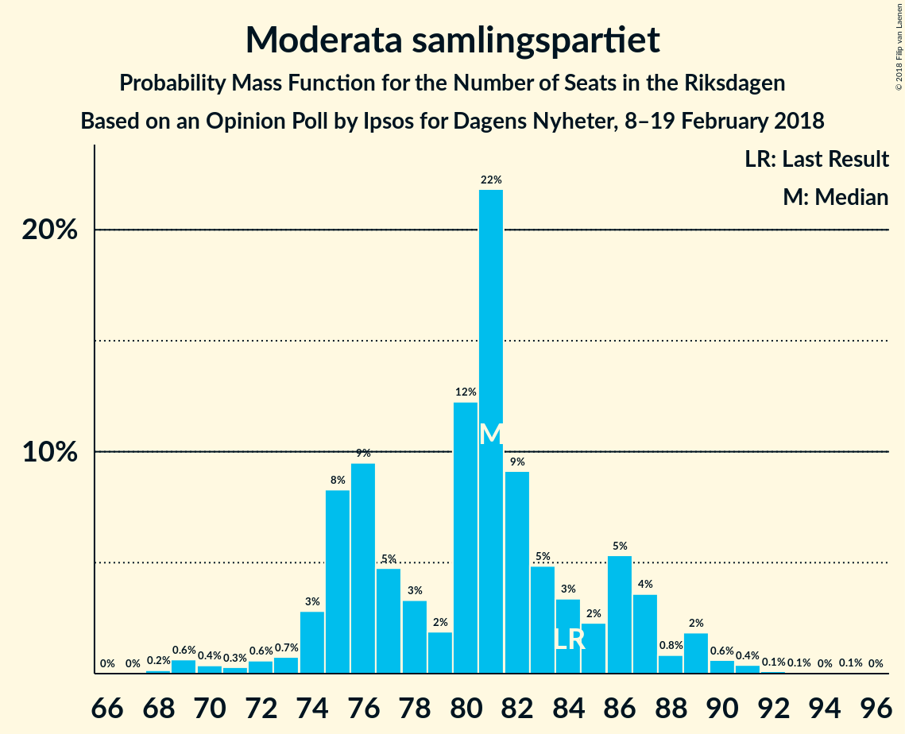
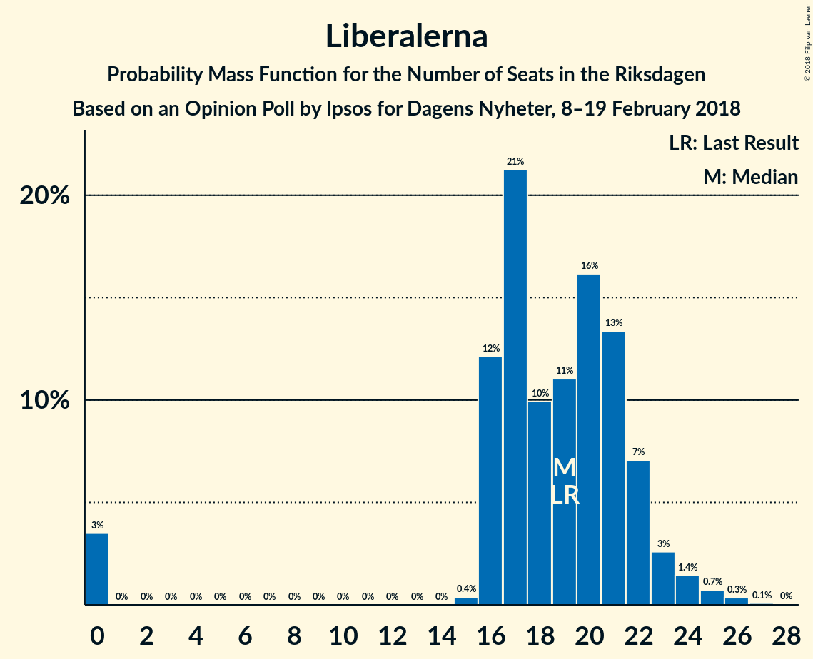

# Opinion Poll by Ipsos for Dagens Nyheter, 8–19 February 2018

<a href="#voting-intentions">Voting Intentions</a> | <a href="#seats">Seats</a> | <a href="#coalitions">Coalitions</a> | <a href="#technical-information">Technical Information</a>

## Voting Intentions

### Confidence Intervals

| Party | Last Result | Poll Result | 80% Confidence Interval | 90% Confidence Interval | 95% Confidence Interval | 99% Confidence Interval |
|:-----:|:-----------:|:-----------:|:-----------------------:|:-----------------------:|:-----------------------:|:-----------------------:|
| Sveriges socialdemokratiska arbetareparti | 31.0% | 29.0% | 27.5–30.6% |27.1–31.1% |26.7–31.5% |26.0–32.2% |
| Moderata samlingspartiet | 23.3% | 21.0% | 19.7–22.5% |19.3–22.9% |19.0–23.2% |18.3–23.9% |
| Sverigedemokraterna | 12.9% | 16.0% | 14.8–17.3% |14.4–17.6% |14.1–18.0% |13.6–18.6% |
| Centerpartiet | 6.1% | 11.0% | 10.0–12.1% |9.7–12.5% |9.5–12.8% |9.0–13.3% |
| Vänsterpartiet | 5.7% | 9.0% | 8.1–10.1% |7.8–10.4% |7.6–10.6% |7.2–11.2% |
| Liberalerna | 5.4% | 5.0% | 4.3–5.8% |4.1–6.0% |3.9–6.2% |3.6–6.7% |
| Miljöpartiet de gröna | 6.9% | 3.0% | 2.5–3.7% |2.3–3.8% |2.2–4.0% |2.0–4.4% |
| Kristdemokraterna | 4.6% | 3.0% | 2.5–3.7% |2.3–3.8% |2.2–4.0% |2.0–4.4% |
| Feministiskt initiativ | 3.1% | 2.0% | 1.6–2.6% |1.5–2.7% |1.4–2.9% |1.2–3.2% |

*Note:* The poll result column reflects the actual value used in the calculations. Published results may vary slightly, and in addition be rounded to fewer digits.

## Seats

### Confidence Intervals

| Party | Last Result | Median | 80% Confidence Interval | 90% Confidence Interval | 95% Confidence Interval | 99% Confidence Interval |
|:-----:|:-----------:|:------:|:-----------------------:|:-----------------------:|:-----------------------:|:-----------------------:|
| <a href="#sveriges-socialdemokratiska-arbetareparti">Sveriges socialdemokratiska arbetareparti</a> | 113 | 109 | 104–118 |100–121 |99–122 |99–124 |
| <a href="#moderata-samlingspartiet">Moderata samlingspartiet</a> | 84 | 81 | 75–87 |74–89 |71–89 |69–91 |
| <a href="#sverigedemokraterna">Sverigedemokraterna</a> | 49 | 59 | 54–66 |53–67 |53–69 |51–72 |
| <a href="#centerpartiet">Centerpartiet</a> | 22 | 43 | 39–46 |37–47 |36–49 |34–52 |
| <a href="#vänsterpartiet">Vänsterpartiet</a> | 21 | 35 | 30–39 |29–41 |29–42 |27–43 |
| <a href="#liberalerna">Liberalerna</a> | 19 | 20 | 16–22 |16–23 |0–24 |0–26 |
| <a href="#miljöpartiet-de-gröna">Miljöpartiet de gröna</a> | 25 | 0 | 0 |0 |0–15 |0–16 |
| <a href="#kristdemokraterna">Kristdemokraterna</a> | 16 | 0 | 0 |0–15 |0–15 |0–16 |
| <a href="#feministiskt-initiativ">Feministiskt initiativ</a> | 0 | 0 | 0 |0 |0 |0 |

### Sveriges socialdemokratiska arbetareparti

*For a full overview of the results for this party, see the [Sveriges socialdemokratiska arbetareparti](party-sverigessocialdemokratiskaarbetareparti.html) page.*

| Number of Seats | Probability | Accumulated | Special Marks |
|:---------------:|:-----------:|:-----------:|:-------------:|
| 94 | 0% | 100% |  |
| 95 | 0% | 99.9% |  |
| 96 | 0.1% | 99.9% |  |
| 97 | 0.1% | 99.8% |  |
| 98 | 0.1% | 99.8% |  |
| 99 | 2% | 99.7% |  |
| 100 | 3% | 97% |  |
| 101 | 1.0% | 95% |  |
| 102 | 2% | 94% |  |
| 103 | 0.8% | 92% |  |
| 104 | 4% | 91% |  |
| 105 | 5% | 87% |  |
| 106 | 1.0% | 82% |  |
| 107 | 12% | 81% |  |
| 108 | 5% | 69% |  |
| 109 | 16% | 64% | Median |
| 110 | 9% | 48% |  |
| 111 | 1.2% | 39% |  |
| 112 | 9% | 38% |  |
| 113 | 3% | 29% | Last Result |
| 114 | 0.4% | 26% |  |
| 115 | 3% | 26% |  |
| 116 | 10% | 23% |  |
| 117 | 3% | 13% |  |
| 118 | 0.6% | 10% |  |
| 119 | 4% | 10% |  |
| 120 | 0.5% | 6% |  |
| 121 | 3% | 6% |  |
| 122 | 0.5% | 3% |  |
| 123 | 0.7% | 2% |  |
| 124 | 1.1% | 1.4% |  |
| 125 | 0% | 0.2% |  |
| 126 | 0% | 0.2% |  |
| 127 | 0% | 0.2% |  |
| 128 | 0% | 0.2% |  |
| 129 | 0% | 0.1% |  |
| 130 | 0.1% | 0.1% |  |
| 131 | 0% | 0% |  |

### Moderata samlingspartiet

*For a full overview of the results for this party, see the [Moderata samlingspartiet](party-moderatasamlingspartiet.html) page.*

| Number of Seats | Probability | Accumulated | Special Marks |
|:---------------:|:-----------:|:-----------:|:-------------:|
| 68 | 0.2% | 100% |  |
| 69 | 1.0% | 99.8% |  |
| 70 | 0.4% | 98.7% |  |
| 71 | 0.9% | 98% |  |
| 72 | 0.7% | 97% |  |
| 73 | 1.3% | 97% |  |
| 74 | 1.2% | 95% |  |
| 75 | 15% | 94% |  |
| 76 | 2% | 79% |  |
| 77 | 5% | 77% |  |
| 78 | 7% | 72% |  |
| 79 | 3% | 65% |  |
| 80 | 5% | 62% |  |
| 81 | 15% | 57% | Median |
| 82 | 10% | 41% |  |
| 83 | 7% | 32% |  |
| 84 | 3% | 25% | Last Result |
| 85 | 9% | 22% |  |
| 86 | 2% | 13% |  |
| 87 | 2% | 11% |  |
| 88 | 2% | 9% |  |
| 89 | 5% | 7% |  |
| 90 | 2% | 2% |  |
| 91 | 0.3% | 0.7% |  |
| 92 | 0.1% | 0.3% |  |
| 93 | 0.1% | 0.3% |  |
| 94 | 0% | 0.2% |  |
| 95 | 0.1% | 0.1% |  |
| 96 | 0% | 0% |  |

### Sverigedemokraterna

*For a full overview of the results for this party, see the [Sverigedemokraterna](party-sverigedemokraterna.html) page.*

| Number of Seats | Probability | Accumulated | Special Marks |
|:---------------:|:-----------:|:-----------:|:-------------:|
| 49 | 0% | 100% | Last Result |
| 50 | 0% | 99.9% |  |
| 51 | 0.5% | 99.9% |  |
| 52 | 1.4% | 99.4% |  |
| 53 | 5% | 98% |  |
| 54 | 4% | 93% |  |
| 55 | 11% | 89% |  |
| 56 | 1.3% | 78% |  |
| 57 | 12% | 76% |  |
| 58 | 13% | 65% |  |
| 59 | 3% | 52% | Median |
| 60 | 6% | 49% |  |
| 61 | 5% | 43% |  |
| 62 | 0.5% | 38% |  |
| 63 | 7% | 37% |  |
| 64 | 6% | 31% |  |
| 65 | 14% | 25% |  |
| 66 | 5% | 12% |  |
| 67 | 3% | 7% |  |
| 68 | 1.0% | 4% |  |
| 69 | 0.7% | 3% |  |
| 70 | 0.7% | 2% |  |
| 71 | 0.9% | 1.5% |  |
| 72 | 0.3% | 0.6% |  |
| 73 | 0.1% | 0.2% |  |
| 74 | 0% | 0.1% |  |
| 75 | 0% | 0.1% |  |
| 76 | 0% | 0% |  |

### Centerpartiet

*For a full overview of the results for this party, see the [Centerpartiet](party-centerpartiet.html) page.*

| Number of Seats | Probability | Accumulated | Special Marks |
|:---------------:|:-----------:|:-----------:|:-------------:|
| 22 | 0% | 100% | Last Result |
| 23 | 0% | 100% |  |
| 24 | 0% | 100% |  |
| 25 | 0% | 100% |  |
| 26 | 0% | 100% |  |
| 27 | 0% | 100% |  |
| 28 | 0% | 100% |  |
| 29 | 0% | 100% |  |
| 30 | 0% | 100% |  |
| 31 | 0.1% | 100% |  |
| 32 | 0% | 99.9% |  |
| 33 | 0.1% | 99.8% |  |
| 34 | 1.1% | 99.8% |  |
| 35 | 1.0% | 98.7% |  |
| 36 | 2% | 98% |  |
| 37 | 1.1% | 96% |  |
| 38 | 2% | 94% |  |
| 39 | 7% | 93% |  |
| 40 | 4% | 86% |  |
| 41 | 18% | 82% |  |
| 42 | 7% | 64% |  |
| 43 | 10% | 57% | Median |
| 44 | 14% | 46% |  |
| 45 | 14% | 33% |  |
| 46 | 9% | 19% |  |
| 47 | 6% | 10% |  |
| 48 | 0.6% | 4% |  |
| 49 | 0.5% | 3% |  |
| 50 | 0.4% | 2% |  |
| 51 | 0.1% | 2% |  |
| 52 | 2% | 2% |  |
| 53 | 0.1% | 0.3% |  |
| 54 | 0.1% | 0.2% |  |
| 55 | 0.1% | 0.1% |  |
| 56 | 0% | 0% |  |

### Vänsterpartiet

*For a full overview of the results for this party, see the [Vänsterpartiet](party-vänsterpartiet.html) page.*

| Number of Seats | Probability | Accumulated | Special Marks |
|:---------------:|:-----------:|:-----------:|:-------------:|
| 21 | 0% | 100% | Last Result |
| 22 | 0% | 100% |  |
| 23 | 0% | 100% |  |
| 24 | 0% | 100% |  |
| 25 | 0% | 100% |  |
| 26 | 0.1% | 100% |  |
| 27 | 0.9% | 99.8% |  |
| 28 | 1.0% | 99.0% |  |
| 29 | 3% | 98% |  |
| 30 | 5% | 95% |  |
| 31 | 7% | 90% |  |
| 32 | 8% | 83% |  |
| 33 | 11% | 75% |  |
| 34 | 8% | 64% |  |
| 35 | 14% | 55% | Median |
| 36 | 18% | 42% |  |
| 37 | 2% | 24% |  |
| 38 | 5% | 21% |  |
| 39 | 10% | 17% |  |
| 40 | 2% | 7% |  |
| 41 | 2% | 5% |  |
| 42 | 3% | 3% |  |
| 43 | 0.3% | 0.7% |  |
| 44 | 0.3% | 0.4% |  |
| 45 | 0% | 0.1% |  |
| 46 | 0.1% | 0.1% |  |
| 47 | 0% | 0% |  |

### Liberalerna

*For a full overview of the results for this party, see the [Liberalerna](party-liberalerna.html) page.*

| Number of Seats | Probability | Accumulated | Special Marks |
|:---------------:|:-----------:|:-----------:|:-------------:|
| 0 | 4% | 100% |  |
| 1 | 0% | 96% |  |
| 2 | 0% | 96% |  |
| 3 | 0% | 96% |  |
| 4 | 0% | 96% |  |
| 5 | 0% | 96% |  |
| 6 | 0% | 96% |  |
| 7 | 0% | 96% |  |
| 8 | 0% | 96% |  |
| 9 | 0% | 96% |  |
| 10 | 0% | 96% |  |
| 11 | 0% | 96% |  |
| 12 | 0% | 96% |  |
| 13 | 0% | 96% |  |
| 14 | 0% | 96% |  |
| 15 | 0.8% | 96% |  |
| 16 | 7% | 95% |  |
| 17 | 11% | 88% |  |
| 18 | 9% | 78% |  |
| 19 | 13% | 68% | Last Result |
| 20 | 20% | 55% | Median |
| 21 | 14% | 35% |  |
| 22 | 15% | 21% |  |
| 23 | 2% | 6% |  |
| 24 | 3% | 4% |  |
| 25 | 0.2% | 1.5% |  |
| 26 | 1.1% | 1.3% |  |
| 27 | 0.1% | 0.2% |  |
| 28 | 0.1% | 0.1% |  |
| 29 | 0% | 0% |  |

### Miljöpartiet de gröna

*For a full overview of the results for this party, see the [Miljöpartiet de gröna](party-miljöpartietdegröna.html) page.*

| Number of Seats | Probability | Accumulated | Special Marks |
|:---------------:|:-----------:|:-----------:|:-------------:|
| 0 | 96% | 100% | Median |
| 1 | 0% | 4% |  |
| 2 | 0% | 4% |  |
| 3 | 0% | 4% |  |
| 4 | 0% | 4% |  |
| 5 | 0% | 4% |  |
| 6 | 0% | 4% |  |
| 7 | 0% | 4% |  |
| 8 | 0% | 4% |  |
| 9 | 0% | 4% |  |
| 10 | 0% | 4% |  |
| 11 | 0% | 4% |  |
| 12 | 0% | 4% |  |
| 13 | 0% | 4% |  |
| 14 | 0% | 4% |  |
| 15 | 3% | 4% |  |
| 16 | 0.6% | 0.9% |  |
| 17 | 0.3% | 0.3% |  |
| 18 | 0% | 0.1% |  |
| 19 | 0% | 0% |  |
| 20 | 0% | 0% |  |
| 21 | 0% | 0% |  |
| 22 | 0% | 0% |  |
| 23 | 0% | 0% |  |
| 24 | 0% | 0% |  |
| 25 | 0% | 0% | Last Result |

### Kristdemokraterna

*For a full overview of the results for this party, see the [Kristdemokraterna](party-kristdemokraterna.html) page.*

| Number of Seats | Probability | Accumulated | Special Marks |
|:---------------:|:-----------:|:-----------:|:-------------:|
| 0 | 95% | 100% | Median |
| 1 | 0% | 5% |  |
| 2 | 0% | 5% |  |
| 3 | 0% | 5% |  |
| 4 | 0% | 5% |  |
| 5 | 0% | 5% |  |
| 6 | 0% | 5% |  |
| 7 | 0% | 5% |  |
| 8 | 0% | 5% |  |
| 9 | 0% | 5% |  |
| 10 | 0% | 5% |  |
| 11 | 0% | 5% |  |
| 12 | 0% | 5% |  |
| 13 | 0% | 5% |  |
| 14 | 0% | 5% |  |
| 15 | 4% | 5% |  |
| 16 | 0.6% | 0.9% | Last Result |
| 17 | 0.3% | 0.3% |  |
| 18 | 0% | 0% |  |

### Feministiskt initiativ

*For a full overview of the results for this party, see the [Feministiskt initiativ](party-feministisktinitiativ.html) page.*

| Number of Seats | Probability | Accumulated | Special Marks |
|:---------------:|:-----------:|:-----------:|:-------------:|
| 0 | 100% | 100% | Last Result, Median |

## Coalitions

### Confidence Intervals

| Coalition | Last Result | Median | Majority? | 80% Confidence Interval | 90% Confidence Interval | 95% Confidence Interval | 99% Confidence Interval |
|:---------:|:-----------:|:------:|:---------:|:-----------------------:|:-----------------------:|:-----------------------:|:-----------------------:|
| Sveriges socialdemokratiska arbetareparti – Vänsterpartiet – Miljöpartiet de gröna – Feministiskt initiativ | 159 | 145 | 0% | 138–152 | 137–156 | 133–158 | 133–162 |
| Sveriges socialdemokratiska arbetareparti – Vänsterpartiet – Miljöpartiet de gröna | 159 | 145 | 0% | 138–152 | 137–156 | 133–158 | 133–162 |
| Sveriges socialdemokratiska arbetareparti – Vänsterpartiet | 134 | 145 | 0% | 138–152 | 133–155 | 133–158 | 132–162 |
| Moderata samlingspartiet – Centerpartiet – Liberalerna – Kristdemokraterna | 141 | 145 | 0% | 133–151 | 133–152 | 128–154 | 121–155 |
| Moderata samlingspartiet – Centerpartiet – Liberalerna | 125 | 145 | 0% | 133–150 | 132–151 | 128–152 | 121–155 |
| Moderata samlingspartiet – Centerpartiet – Kristdemokraterna | 122 | 125 | 0% | 116–132 | 116–133 | 113–138 | 110–141 |
| Moderata samlingspartiet – Centerpartiet | 106 | 125 | 0% | 116–130 | 115–133 | 112–133 | 108–141 |

### Sveriges socialdemokratiska arbetareparti – Vänsterpartiet – Miljöpartiet de gröna – Feministiskt initiativ

| Number of Seats | Probability | Accumulated | Special Marks |
|:---------------:|:-----------:|:-----------:|:-------------:|
| 131 | 0% | 100% |  |
| 132 | 0.1% | 99.9% |  |
| 133 | 3% | 99.8% |  |
| 134 | 0.1% | 97% |  |
| 135 | 0.1% | 97% |  |
| 136 | 0.7% | 97% |  |
| 137 | 1.4% | 96% |  |
| 138 | 7% | 95% |  |
| 139 | 3% | 87% |  |
| 140 | 6% | 84% |  |
| 141 | 1.4% | 79% |  |
| 142 | 3% | 77% |  |
| 143 | 4% | 74% |  |
| 144 | 9% | 70% | Median |
| 145 | 14% | 61% |  |
| 146 | 10% | 47% |  |
| 147 | 4% | 37% |  |
| 148 | 3% | 34% |  |
| 149 | 0.7% | 31% |  |
| 150 | 8% | 30% |  |
| 151 | 10% | 22% |  |
| 152 | 3% | 12% |  |
| 153 | 0.6% | 10% |  |
| 154 | 0.5% | 9% |  |
| 155 | 4% | 9% |  |
| 156 | 0.5% | 5% |  |
| 157 | 2% | 5% |  |
| 158 | 2% | 3% |  |
| 159 | 0.1% | 1.5% | Last Result |
| 160 | 0.2% | 1.4% |  |
| 161 | 0.1% | 1.2% |  |
| 162 | 0.6% | 1.0% |  |
| 163 | 0.2% | 0.4% |  |
| 164 | 0.1% | 0.2% |  |
| 165 | 0% | 0.2% |  |
| 166 | 0.1% | 0.1% |  |
| 167 | 0% | 0% |  |

### Sveriges socialdemokratiska arbetareparti – Vänsterpartiet – Miljöpartiet de gröna

| Number of Seats | Probability | Accumulated | Special Marks |
|:---------------:|:-----------:|:-----------:|:-------------:|
| 131 | 0% | 100% |  |
| 132 | 0.1% | 99.9% |  |
| 133 | 3% | 99.8% |  |
| 134 | 0.1% | 97% |  |
| 135 | 0.1% | 97% |  |
| 136 | 0.7% | 97% |  |
| 137 | 1.4% | 96% |  |
| 138 | 7% | 95% |  |
| 139 | 3% | 87% |  |
| 140 | 6% | 84% |  |
| 141 | 1.4% | 79% |  |
| 142 | 3% | 77% |  |
| 143 | 4% | 74% |  |
| 144 | 9% | 70% | Median |
| 145 | 14% | 61% |  |
| 146 | 10% | 47% |  |
| 147 | 4% | 37% |  |
| 148 | 3% | 34% |  |
| 149 | 0.7% | 31% |  |
| 150 | 8% | 30% |  |
| 151 | 10% | 22% |  |
| 152 | 3% | 12% |  |
| 153 | 0.6% | 10% |  |
| 154 | 0.5% | 9% |  |
| 155 | 4% | 9% |  |
| 156 | 0.5% | 5% |  |
| 157 | 2% | 5% |  |
| 158 | 2% | 3% |  |
| 159 | 0.1% | 1.5% | Last Result |
| 160 | 0.2% | 1.4% |  |
| 161 | 0.1% | 1.2% |  |
| 162 | 0.6% | 1.0% |  |
| 163 | 0.2% | 0.4% |  |
| 164 | 0.1% | 0.2% |  |
| 165 | 0% | 0.2% |  |
| 166 | 0.1% | 0.1% |  |
| 167 | 0% | 0% |  |

### Sveriges socialdemokratiska arbetareparti – Vänsterpartiet

| Number of Seats | Probability | Accumulated | Special Marks |
|:---------------:|:-----------:|:-----------:|:-------------:|
| 127 | 0% | 100% |  |
| 128 | 0% | 99.9% |  |
| 129 | 0% | 99.9% |  |
| 130 | 0.1% | 99.9% |  |
| 131 | 0% | 99.8% |  |
| 132 | 0.3% | 99.8% |  |
| 133 | 5% | 99.5% |  |
| 134 | 0.2% | 94% | Last Result |
| 135 | 0.1% | 94% |  |
| 136 | 1.1% | 94% |  |
| 137 | 2% | 93% |  |
| 138 | 8% | 91% |  |
| 139 | 3% | 83% |  |
| 140 | 6% | 81% |  |
| 141 | 1.4% | 75% |  |
| 142 | 3% | 74% |  |
| 143 | 4% | 70% |  |
| 144 | 9% | 66% | Median |
| 145 | 14% | 58% |  |
| 146 | 10% | 43% |  |
| 147 | 4% | 33% |  |
| 148 | 0.4% | 30% |  |
| 149 | 0.6% | 29% |  |
| 150 | 8% | 29% |  |
| 151 | 10% | 21% |  |
| 152 | 2% | 11% |  |
| 153 | 0.4% | 9% |  |
| 154 | 0.5% | 9% |  |
| 155 | 4% | 8% |  |
| 156 | 0.4% | 5% |  |
| 157 | 2% | 4% |  |
| 158 | 1.5% | 3% |  |
| 159 | 0.1% | 1.2% |  |
| 160 | 0.1% | 1.1% |  |
| 161 | 0.1% | 1.0% |  |
| 162 | 0.6% | 0.9% |  |
| 163 | 0.1% | 0.3% |  |
| 164 | 0% | 0.1% |  |
| 165 | 0% | 0.1% |  |
| 166 | 0.1% | 0.1% |  |
| 167 | 0% | 0% |  |

### Moderata samlingspartiet – Centerpartiet – Liberalerna – Kristdemokraterna

| Number of Seats | Probability | Accumulated | Special Marks |
|:---------------:|:-----------:|:-----------:|:-------------:|
| 121 | 0.6% | 100% |  |
| 122 | 0.1% | 99.4% |  |
| 123 | 0.3% | 99.3% |  |
| 124 | 0.1% | 99.0% |  |
| 125 | 0% | 98.9% |  |
| 126 | 0.1% | 98.9% |  |
| 127 | 1.0% | 98.8% |  |
| 128 | 0.7% | 98% |  |
| 129 | 0.3% | 97% |  |
| 130 | 0.6% | 97% |  |
| 131 | 0.3% | 96% |  |
| 132 | 0.7% | 96% |  |
| 133 | 10% | 95% |  |
| 134 | 0.5% | 85% |  |
| 135 | 0.6% | 85% |  |
| 136 | 3% | 84% |  |
| 137 | 0.6% | 81% |  |
| 138 | 2% | 81% |  |
| 139 | 7% | 79% |  |
| 140 | 2% | 72% |  |
| 141 | 8% | 70% | Last Result |
| 142 | 3% | 62% |  |
| 143 | 1.2% | 59% |  |
| 144 | 2% | 58% | Median |
| 145 | 15% | 56% |  |
| 146 | 5% | 41% |  |
| 147 | 10% | 36% |  |
| 148 | 1.3% | 26% |  |
| 149 | 3% | 24% |  |
| 150 | 10% | 21% |  |
| 151 | 4% | 11% |  |
| 152 | 2% | 7% |  |
| 153 | 0.2% | 5% |  |
| 154 | 3% | 5% |  |
| 155 | 1.0% | 1.5% |  |
| 156 | 0.2% | 0.5% |  |
| 157 | 0.2% | 0.3% |  |
| 158 | 0% | 0.1% |  |
| 159 | 0% | 0% |  |

### Moderata samlingspartiet – Centerpartiet – Liberalerna

| Number of Seats | Probability | Accumulated | Special Marks |
|:---------------:|:-----------:|:-----------:|:-------------:|
| 119 | 0% | 100% |  |
| 120 | 0% | 99.9% |  |
| 121 | 0.6% | 99.9% |  |
| 122 | 0.1% | 99.3% |  |
| 123 | 0.3% | 99.2% |  |
| 124 | 0.1% | 99.0% |  |
| 125 | 0% | 98.9% | Last Result |
| 126 | 0.1% | 98.9% |  |
| 127 | 1.2% | 98.8% |  |
| 128 | 0.7% | 98% |  |
| 129 | 0.3% | 97% |  |
| 130 | 1.0% | 97% |  |
| 131 | 0.3% | 96% |  |
| 132 | 0.7% | 95% |  |
| 133 | 10% | 95% |  |
| 134 | 0.6% | 84% |  |
| 135 | 1.3% | 84% |  |
| 136 | 3% | 83% |  |
| 137 | 0.6% | 79% |  |
| 138 | 2% | 79% |  |
| 139 | 10% | 77% |  |
| 140 | 3% | 67% |  |
| 141 | 8% | 64% |  |
| 142 | 2% | 57% |  |
| 143 | 1.2% | 54% |  |
| 144 | 2% | 53% | Median |
| 145 | 15% | 51% |  |
| 146 | 5% | 36% |  |
| 147 | 10% | 31% |  |
| 148 | 1.0% | 21% |  |
| 149 | 3% | 20% |  |
| 150 | 9% | 17% |  |
| 151 | 4% | 8% |  |
| 152 | 2% | 4% |  |
| 153 | 0.2% | 1.5% |  |
| 154 | 0.3% | 1.3% |  |
| 155 | 1.0% | 1.1% |  |
| 156 | 0% | 0.1% |  |
| 157 | 0% | 0.1% |  |
| 158 | 0% | 0% |  |

### Moderata samlingspartiet – Centerpartiet – Kristdemokraterna

| Number of Seats | Probability | Accumulated | Special Marks |
|:---------------:|:-----------:|:-----------:|:-------------:|
| 106 | 0.1% | 100% |  |
| 107 | 0% | 99.9% |  |
| 108 | 0.3% | 99.9% |  |
| 109 | 0.1% | 99.6% |  |
| 110 | 0.4% | 99.5% |  |
| 111 | 1.0% | 99.1% |  |
| 112 | 0.4% | 98% |  |
| 113 | 0.5% | 98% |  |
| 114 | 0.9% | 97% |  |
| 115 | 0.1% | 96% |  |
| 116 | 13% | 96% |  |
| 117 | 0.1% | 83% |  |
| 118 | 2% | 83% |  |
| 119 | 7% | 82% |  |
| 120 | 2% | 75% |  |
| 121 | 4% | 73% |  |
| 122 | 4% | 69% | Last Result |
| 123 | 5% | 65% |  |
| 124 | 2% | 60% | Median |
| 125 | 16% | 59% |  |
| 126 | 14% | 43% |  |
| 127 | 2% | 29% |  |
| 128 | 4% | 27% |  |
| 129 | 7% | 23% |  |
| 130 | 3% | 16% |  |
| 131 | 0.7% | 12% |  |
| 132 | 2% | 12% |  |
| 133 | 6% | 10% |  |
| 134 | 0.2% | 4% |  |
| 135 | 0.1% | 3% |  |
| 136 | 0.3% | 3% |  |
| 137 | 0.4% | 3% |  |
| 138 | 0.9% | 3% |  |
| 139 | 0% | 2% |  |
| 140 | 0% | 2% |  |
| 141 | 2% | 2% |  |
| 142 | 0% | 0.1% |  |
| 143 | 0% | 0.1% |  |
| 144 | 0% | 0.1% |  |
| 145 | 0% | 0% |  |

### Moderata samlingspartiet – Centerpartiet

| Number of Seats | Probability | Accumulated | Special Marks |
|:---------------:|:-----------:|:-----------:|:-------------:|
| 106 | 0.1% | 100% | Last Result |
| 107 | 0% | 99.9% |  |
| 108 | 0.5% | 99.9% |  |
| 109 | 0.1% | 99.4% |  |
| 110 | 0.4% | 99.3% |  |
| 111 | 1.4% | 98.9% |  |
| 112 | 0.4% | 98% |  |
| 113 | 0.8% | 97% |  |
| 114 | 0.9% | 96% |  |
| 115 | 0.8% | 95% |  |
| 116 | 13% | 95% |  |
| 117 | 0.2% | 82% |  |
| 118 | 4% | 81% |  |
| 119 | 7% | 78% |  |
| 120 | 2% | 71% |  |
| 121 | 5% | 69% |  |
| 122 | 4% | 64% |  |
| 123 | 5% | 60% |  |
| 124 | 2% | 55% | Median |
| 125 | 16% | 54% |  |
| 126 | 13% | 38% |  |
| 127 | 2% | 24% |  |
| 128 | 4% | 22% |  |
| 129 | 7% | 18% |  |
| 130 | 3% | 11% |  |
| 131 | 0.7% | 9% |  |
| 132 | 2% | 8% |  |
| 133 | 4% | 6% |  |
| 134 | 0.1% | 2% |  |
| 135 | 0.1% | 2% |  |
| 136 | 0.1% | 2% |  |
| 137 | 0.1% | 2% |  |
| 138 | 0.1% | 2% |  |
| 139 | 0% | 2% |  |
| 140 | 0% | 2% |  |
| 141 | 2% | 2% |  |
| 142 | 0% | 0% |  |

## Technical Information

### Opinion Poll

+ **Polling firm:** Ipsos
+ **Commissioner(s):** Dagens Nyheter
+ **Fieldwork period:** 8–19 February 2018

### Calculations

+ **Sample size:** 1409
+ **Simulations done:** 131,072
+ **Error estimate:** 2.27%

