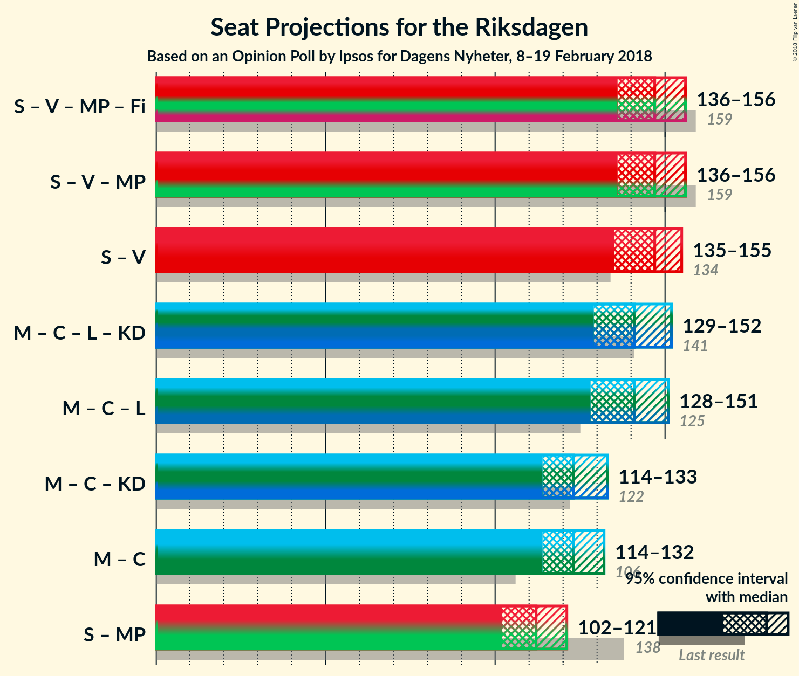

# Opinion Poll by Ipsos for Dagens Nyheter, 8–19 February 2018

<a href="#voting-intentions">Voting Intentions</a> | <a href="#seats">Seats</a> | <a href="#coalitions">Coalitions</a> | <a href="#technical-information">Technical Information</a>

## Voting Intentions

### Confidence Intervals

| Party | Last Result | Poll Result | 80% Confidence Interval | 90% Confidence Interval | 95% Confidence Interval | 99% Confidence Interval |
|:-----:|:-----------:|:-----------:|:-----------------------:|:-----------------------:|:-----------------------:|:-----------------------:|
| Sveriges socialdemokratiska arbetareparti | 31.0% | 29.0% | 27.5–30.6% |27.1–31.1% |26.7–31.5% |26.0–32.2% |
| Moderata samlingspartiet | 23.3% | 21.0% | 19.7–22.5% |19.3–22.9% |18.9–23.2% |18.3–24.0% |
| Sverigedemokraterna | 12.9% | 16.0% | 14.8–17.3% |14.4–17.6% |14.1–18.0% |13.6–18.7% |
| Centerpartiet | 6.1% | 11.0% | 10.0–12.2% |9.7–12.5% |9.5–12.8% |9.0–13.4% |
| Vänsterpartiet | 5.7% | 9.0% | 8.1–10.1% |7.8–10.4% |7.6–10.7% |7.2–11.2% |
| Liberalerna | 5.4% | 5.0% | 4.3–5.8% |4.1–6.0% |3.9–6.3% |3.6–6.7% |
| Miljöpartiet de gröna | 6.9% | 3.0% | 2.5–3.7% |2.3–3.8% |2.2–4.0% |2.0–4.4% |
| Kristdemokraterna | 4.6% | 3.0% | 2.5–3.7% |2.3–3.8% |2.2–4.0% |2.0–4.4% |
| Feministiskt initiativ | 3.1% | 2.0% | 1.6–2.6% |1.5–2.7% |1.4–2.9% |1.2–3.2% |

*Note:* The poll result column reflects the actual value used in the calculations. Published results may vary slightly, and in addition be rounded to fewer digits.

## Seats

### Confidence Intervals

| Party | Last Result | Median | 80% Confidence Interval | 90% Confidence Interval | 95% Confidence Interval | 99% Confidence Interval |
|:-----:|:-----------:|:------:|:-----------------------:|:-----------------------:|:-----------------------:|:-----------------------:|
| <a href="#sveriges-socialdemokratiska-arbetareparti">Sveriges socialdemokratiska arbetareparti</a> | 113 | N/A | N/A |N/A |N/A |N/A |
| <a href="#moderata-samlingspartiet">Moderata samlingspartiet</a> | 84 | N/A | N/A |N/A |N/A |N/A |
| <a href="#sverigedemokraterna">Sverigedemokraterna</a> | 49 | N/A | N/A |N/A |N/A |N/A |
| <a href="#centerpartiet">Centerpartiet</a> | 22 | N/A | N/A |N/A |N/A |N/A |
| <a href="#vänsterpartiet">Vänsterpartiet</a> | 21 | N/A | N/A |N/A |N/A |N/A |
| <a href="#liberalerna">Liberalerna</a> | 19 | N/A | N/A |N/A |N/A |N/A |
| <a href="#miljöpartiet-de-gröna">Miljöpartiet de gröna</a> | 25 | N/A | N/A |N/A |N/A |N/A |
| <a href="#kristdemokraterna">Kristdemokraterna</a> | 16 | N/A | N/A |N/A |N/A |N/A |
| <a href="#feministiskt-initiativ">Feministiskt initiativ</a> | 0 | N/A | N/A |N/A |N/A |N/A |

## Coalitions

## Technical Information

### Opinion Poll

+ **Polling firm:** Ipsos
+ **Commissioner(s):** Dagens Nyheter
+ **Fieldwork period:** 8–19 February 2018

### Calculations

+ **Sample size:** 1409
+ **Simulations done:** 0
+ **Error estimate:** 100.00%

