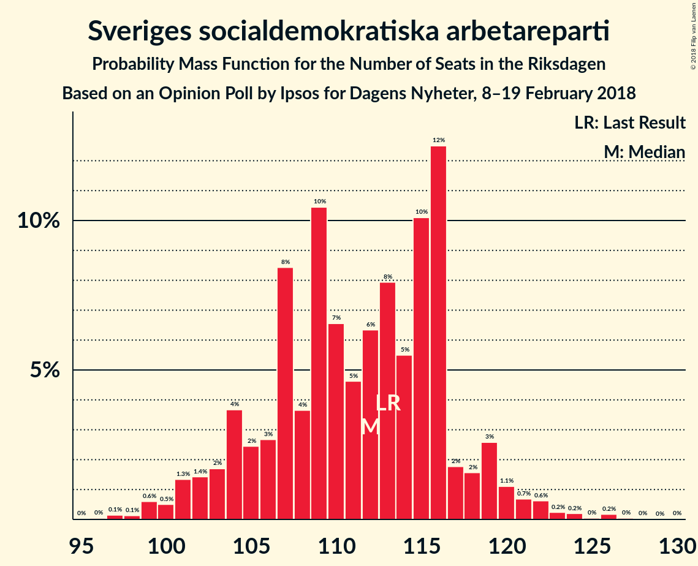
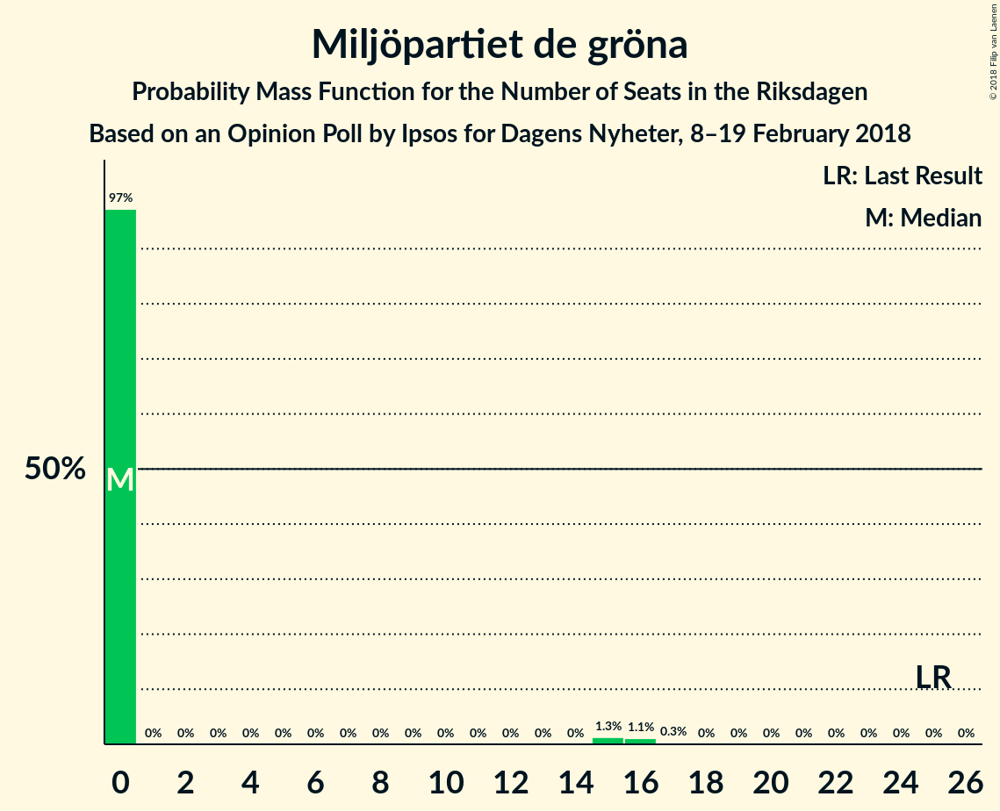

# Opinion Poll by Ipsos for Dagens Nyheter, 8–19 February 2018

<a href="#voting-intentions">Voting Intentions</a> | <a href="#seats">Seats</a> | <a href="#coalitions">Coalitions</a> | <a href="#technical-information">Technical Information</a>

## Voting Intentions

### Confidence Intervals

| Party | Last Result | Poll Result | 80% Confidence Interval | 90% Confidence Interval | 95% Confidence Interval | 99% Confidence Interval |
|:-----:|:-----------:|:-----------:|:-----------------------:|:-----------------------:|:-----------------------:|:-----------------------:|
| Sveriges socialdemokratiska arbetareparti | 31.0% | 29.0% | 27.5–30.6% |27.1–31.1% |26.7–31.5% |26.0–32.2% |
| Moderata samlingspartiet | 23.3% | 21.0% | 19.7–22.5% |19.3–22.9% |19.0–23.2% |18.3–23.9% |
| Sverigedemokraterna | 12.9% | 16.0% | 14.8–17.3% |14.4–17.6% |14.1–18.0% |13.6–18.6% |
| Centerpartiet | 6.1% | 11.0% | 10.0–12.1% |9.7–12.5% |9.5–12.8% |9.0–13.3% |
| Vänsterpartiet | 5.7% | 9.0% | 8.1–10.1% |7.8–10.4% |7.6–10.6% |7.2–11.2% |
| Liberalerna | 5.4% | 5.0% | 4.3–5.8% |4.1–6.0% |3.9–6.2% |3.6–6.7% |
| Miljöpartiet de gröna | 6.9% | 3.0% | 2.5–3.7% |2.3–3.8% |2.2–4.0% |2.0–4.4% |
| Kristdemokraterna | 4.6% | 3.0% | 2.5–3.7% |2.3–3.8% |2.2–4.0% |2.0–4.4% |
| Feministiskt initiativ | 3.1% | 2.0% | 1.6–2.6% |1.5–2.7% |1.4–2.9% |1.2–3.2% |

*Note:* The poll result column reflects the actual value used in the calculations. Published results may vary slightly, and in addition be rounded to fewer digits.

## Seats

### Confidence Intervals

| Party | Last Result | Median | 80% Confidence Interval | 90% Confidence Interval | 95% Confidence Interval | 99% Confidence Interval |
|:-----:|:-----------:|:------:|:-----------------------:|:-----------------------:|:-----------------------:|:-----------------------:|
| <a href="#sveriges-socialdemokratiska-arbetareparti">Sveriges socialdemokratiska arbetareparti</a> | 113 | 115 | 112–129 |112–129 |112–129 |106–129 |
| <a href="#moderata-samlingspartiet">Moderata samlingspartiet</a> | 84 | 73 | 73–81 |73–81 |73–81 |66–92 |
| <a href="#sverigedemokraterna">Sverigedemokraterna</a> | 49 | 57 | 57–72 |57–72 |57–72 |51–72 |
| <a href="#centerpartiet">Centerpartiet</a> | 22 | 40 | 40–44 |40–44 |40–44 |37–44 |
| <a href="#vänsterpartiet">Vänsterpartiet</a> | 21 | 27 | 26–34 |26–34 |26–34 |26–43 |
| <a href="#liberalerna">Liberalerna</a> | 19 | 22 | 0–22 |0–22 |0–22 |0–24 |
| <a href="#miljöpartiet-de-gröna">Miljöpartiet de gröna</a> | 25 | 0 | 0 |0 |0 |0 |
| <a href="#kristdemokraterna">Kristdemokraterna</a> | 16 | 15 | 0–15 |0–15 |0–15 |0–15 |
| <a href="#feministiskt-initiativ">Feministiskt initiativ</a> | 0 | 0 | 0 |0 |0 |0 |

### Sveriges socialdemokratiska arbetareparti

*For a full overview of the results for this party, see the [Sveriges socialdemokratiska arbetareparti](party-sverigessocialdemokratiskaarbetareparti.html) page.*

| Number of Seats | Probability | Accumulated | Special Marks |
|:---------------:|:-----------:|:-----------:|:-------------:|
| 104 | 0% | 100% |  |
| 105 | 0% | 99.9% |  |
| 106 | 0.7% | 99.9% |  |
| 107 | 0% | 99.2% |  |
| 108 | 0% | 99.2% |  |
| 109 | 0% | 99.2% |  |
| 110 | 0% | 99.2% |  |
| 111 | 0.1% | 99.2% |  |
| 112 | 24% | 99.1% |  |
| 113 | 0% | 75% | Last Result |
| 114 | 0.2% | 75% |  |
| 115 | 61% | 75% | Median |
| 116 | 0% | 14% |  |
| 117 | 1.0% | 14% |  |
| 118 | 0% | 13% |  |
| 119 | 0% | 13% |  |
| 120 | 1.1% | 13% |  |
| 121 | 0% | 12% |  |
| 122 | 0% | 12% |  |
| 123 | 0% | 12% |  |
| 124 | 0% | 12% |  |
| 125 | 0% | 12% |  |
| 126 | 0% | 12% |  |
| 127 | 0% | 12% |  |
| 128 | 0% | 12% |  |
| 129 | 12% | 12% |  |
| 130 | 0% | 0% |  |

### Moderata samlingspartiet

*For a full overview of the results for this party, see the [Moderata samlingspartiet](party-moderatasamlingspartiet.html) page.*

| Number of Seats | Probability | Accumulated | Special Marks |
|:---------------:|:-----------:|:-----------:|:-------------:|
| 66 | 1.0% | 100% |  |
| 67 | 0% | 99.0% |  |
| 68 | 0% | 99.0% |  |
| 69 | 0.2% | 99.0% |  |
| 70 | 0% | 98.8% |  |
| 71 | 0% | 98.8% |  |
| 72 | 0% | 98.8% |  |
| 73 | 61% | 98.8% | Median |
| 74 | 0% | 38% |  |
| 75 | 0% | 38% |  |
| 76 | 0% | 38% |  |
| 77 | 0% | 38% |  |
| 78 | 12% | 38% |  |
| 79 | 0.7% | 26% |  |
| 80 | 10% | 25% |  |
| 81 | 14% | 15% |  |
| 82 | 0% | 1.2% |  |
| 83 | 0% | 1.1% |  |
| 84 | 0% | 1.1% | Last Result |
| 85 | 0% | 1.1% |  |
| 86 | 0% | 1.1% |  |
| 87 | 0.1% | 1.1% |  |
| 88 | 0% | 1.1% |  |
| 89 | 0% | 1.1% |  |
| 90 | 0% | 1.1% |  |
| 91 | 0% | 1.1% |  |
| 92 | 1.1% | 1.1% |  |
| 93 | 0% | 0% |  |

### Sverigedemokraterna

*For a full overview of the results for this party, see the [Sverigedemokraterna](party-sverigedemokraterna.html) page.*

| Number of Seats | Probability | Accumulated | Special Marks |
|:---------------:|:-----------:|:-----------:|:-------------:|
| 49 | 0% | 100% | Last Result |
| 50 | 0% | 100% |  |
| 51 | 1.1% | 100% |  |
| 52 | 0% | 98.9% |  |
| 53 | 0% | 98.9% |  |
| 54 | 0% | 98.9% |  |
| 55 | 0% | 98.9% |  |
| 56 | 0.2% | 98.9% |  |
| 57 | 61% | 98.7% | Median |
| 58 | 0.7% | 38% |  |
| 59 | 0% | 37% |  |
| 60 | 14% | 37% |  |
| 61 | 0% | 24% |  |
| 62 | 0% | 23% |  |
| 63 | 1.0% | 23% |  |
| 64 | 0% | 22% |  |
| 65 | 0% | 22% |  |
| 66 | 0.1% | 22% |  |
| 67 | 0.3% | 22% |  |
| 68 | 12% | 22% |  |
| 69 | 0% | 10% |  |
| 70 | 0% | 10% |  |
| 71 | 0% | 10% |  |
| 72 | 10% | 10% |  |
| 73 | 0% | 0% |  |

### Centerpartiet

*For a full overview of the results for this party, see the [Centerpartiet](party-centerpartiet.html) page.*

| Number of Seats | Probability | Accumulated | Special Marks |
|:---------------:|:-----------:|:-----------:|:-------------:|
| 22 | 0% | 100% | Last Result |
| 23 | 0% | 100% |  |
| 24 | 0% | 100% |  |
| 25 | 0% | 100% |  |
| 26 | 0% | 100% |  |
| 27 | 0% | 100% |  |
| 28 | 0% | 100% |  |
| 29 | 0% | 100% |  |
| 30 | 0% | 100% |  |
| 31 | 0% | 100% |  |
| 32 | 0% | 100% |  |
| 33 | 0% | 100% |  |
| 34 | 0% | 100% |  |
| 35 | 0% | 100% |  |
| 36 | 0% | 100% |  |
| 37 | 1.1% | 100% |  |
| 38 | 0% | 98.9% |  |
| 39 | 0.3% | 98.9% |  |
| 40 | 73% | 98.6% | Median |
| 41 | 1.0% | 26% |  |
| 42 | 0.1% | 25% |  |
| 43 | 14% | 25% |  |
| 44 | 10% | 10% |  |
| 45 | 0.2% | 0.3% |  |
| 46 | 0% | 0.1% |  |
| 47 | 0% | 0.1% |  |
| 48 | 0% | 0% |  |

### Vänsterpartiet

*For a full overview of the results for this party, see the [Vänsterpartiet](party-vänsterpartiet.html) page.*

| Number of Seats | Probability | Accumulated | Special Marks |
|:---------------:|:-----------:|:-----------:|:-------------:|
| 21 | 0% | 100% | Last Result |
| 22 | 0% | 100% |  |
| 23 | 0% | 100% |  |
| 24 | 0% | 100% |  |
| 25 | 0% | 100% |  |
| 26 | 10% | 100% |  |
| 27 | 61% | 90% | Median |
| 28 | 1.1% | 29% |  |
| 29 | 0% | 28% |  |
| 30 | 0% | 28% |  |
| 31 | 0.3% | 28% |  |
| 32 | 0% | 28% |  |
| 33 | 0% | 28% |  |
| 34 | 26% | 28% |  |
| 35 | 0% | 2% |  |
| 36 | 0% | 2% |  |
| 37 | 0% | 2% |  |
| 38 | 1.0% | 2% |  |
| 39 | 0% | 1.1% |  |
| 40 | 0% | 1.1% |  |
| 41 | 0.2% | 1.1% |  |
| 42 | 0% | 0.8% |  |
| 43 | 0.8% | 0.8% |  |
| 44 | 0% | 0% |  |

### Liberalerna

*For a full overview of the results for this party, see the [Liberalerna](party-liberalerna.html) page.*

| Number of Seats | Probability | Accumulated | Special Marks |
|:---------------:|:-----------:|:-----------:|:-------------:|
| 0 | 12% | 100% |  |
| 1 | 0% | 88% |  |
| 2 | 0% | 88% |  |
| 3 | 0% | 88% |  |
| 4 | 0% | 88% |  |
| 5 | 0% | 88% |  |
| 6 | 0% | 88% |  |
| 7 | 0% | 88% |  |
| 8 | 0% | 88% |  |
| 9 | 0% | 88% |  |
| 10 | 0% | 88% |  |
| 11 | 0% | 88% |  |
| 12 | 0% | 88% |  |
| 13 | 0% | 88% |  |
| 14 | 0% | 88% |  |
| 15 | 10% | 88% |  |
| 16 | 0% | 78% |  |
| 17 | 0% | 78% |  |
| 18 | 0% | 78% |  |
| 19 | 14% | 78% | Last Result |
| 20 | 0.7% | 64% |  |
| 21 | 1.1% | 63% |  |
| 22 | 61% | 62% | Median |
| 23 | 0% | 1.2% |  |
| 24 | 1.2% | 1.2% |  |
| 25 | 0% | 0% |  |

### Miljöpartiet de gröna

*For a full overview of the results for this party, see the [Miljöpartiet de gröna](party-miljöpartietdegröna.html) page.*

| Number of Seats | Probability | Accumulated | Special Marks |
|:---------------:|:-----------:|:-----------:|:-------------:|
| 0 | 100% | 100% | Median |
| 1 | 0% | 0% |  |
| 2 | 0% | 0% |  |
| 3 | 0% | 0% |  |
| 4 | 0% | 0% |  |
| 5 | 0% | 0% |  |
| 6 | 0% | 0% |  |
| 7 | 0% | 0% |  |
| 8 | 0% | 0% |  |
| 9 | 0% | 0% |  |
| 10 | 0% | 0% |  |
| 11 | 0% | 0% |  |
| 12 | 0% | 0% |  |
| 13 | 0% | 0% |  |
| 14 | 0% | 0% |  |
| 15 | 0% | 0% |  |
| 16 | 0% | 0% |  |
| 17 | 0% | 0% |  |
| 18 | 0% | 0% |  |
| 19 | 0% | 0% |  |
| 20 | 0% | 0% |  |
| 21 | 0% | 0% |  |
| 22 | 0% | 0% |  |
| 23 | 0% | 0% |  |
| 24 | 0% | 0% |  |
| 25 | 0% | 0% | Last Result |

### Kristdemokraterna

*For a full overview of the results for this party, see the [Kristdemokraterna](party-kristdemokraterna.html) page.*

| Number of Seats | Probability | Accumulated | Special Marks |
|:---------------:|:-----------:|:-----------:|:-------------:|
| 0 | 39% | 100% |  |
| 1 | 0% | 61% |  |
| 2 | 0% | 61% |  |
| 3 | 0% | 61% |  |
| 4 | 0% | 61% |  |
| 5 | 0% | 61% |  |
| 6 | 0% | 61% |  |
| 7 | 0% | 61% |  |
| 8 | 0% | 61% |  |
| 9 | 0% | 61% |  |
| 10 | 0% | 61% |  |
| 11 | 0% | 61% |  |
| 12 | 0% | 61% |  |
| 13 | 0% | 61% |  |
| 14 | 0% | 61% |  |
| 15 | 61% | 61% | Median |
| 16 | 0% | 0% | Last Result |

### Feministiskt initiativ

*For a full overview of the results for this party, see the [Feministiskt initiativ](party-feministisktinitiativ.html) page.*

| Number of Seats | Probability | Accumulated | Special Marks |
|:---------------:|:-----------:|:-----------:|:-------------:|
| 0 | 100% | 100% | Last Result, Median |

## Coalitions

### Confidence Intervals

| Coalition | Last Result | Median | Majority? | 80% Confidence Interval | 90% Confidence Interval | 95% Confidence Interval | 99% Confidence Interval |
|:---------:|:-----------:|:------:|:---------:|:-----------------------:|:-----------------------:|:-----------------------:|:-----------------------:|
| Sveriges socialdemokratiska arbetareparti – Vänsterpartiet – Miljöpartiet de gröna – Feministiskt initiativ | 159 | 142 | 0% | 138–163 | 138–163 | 138–163 | 138–163 |
| Sveriges socialdemokratiska arbetareparti – Vänsterpartiet – Miljöpartiet de gröna | 159 | 142 | 0% | 138–163 | 138–163 | 138–163 | 138–163 |
| Sveriges socialdemokratiska arbetareparti – Vänsterpartiet | 134 | 142 | 0% | 138–163 | 138–163 | 138–163 | 138–163 |
| Moderata samlingspartiet – Centerpartiet – Liberalerna – Kristdemokraterna | 141 | 150 | 0% | 118–150 | 118–150 | 118–150 | 118–150 |
| Moderata samlingspartiet – Centerpartiet – Liberalerna | 125 | 135 | 0% | 118–143 | 118–143 | 118–143 | 118–150 |
| Moderata samlingspartiet – Centerpartiet – Kristdemokraterna | 122 | 128 | 0% | 118–128 | 118–128 | 118–128 | 107–129 |
| Moderata samlingspartiet – Centerpartiet | 106 | 113 | 0% | 113–124 | 113–124 | 113–124 | 107–129 |

### Sveriges socialdemokratiska arbetareparti – Vänsterpartiet – Miljöpartiet de gröna – Feministiskt initiativ

| Number of Seats | Probability | Accumulated | Special Marks |
|:---------------:|:-----------:|:-----------:|:-------------:|
| 138 | 10% | 100% |  |
| 139 | 0% | 90% |  |
| 140 | 0% | 90% |  |
| 141 | 0% | 90% |  |
| 142 | 61% | 90% | Median |
| 143 | 0% | 29% |  |
| 144 | 0% | 29% |  |
| 145 | 0% | 29% |  |
| 146 | 14% | 29% |  |
| 147 | 0% | 15% |  |
| 148 | 1.1% | 15% |  |
| 149 | 0.7% | 14% |  |
| 150 | 0% | 13% |  |
| 151 | 0% | 13% |  |
| 152 | 0% | 13% |  |
| 153 | 0% | 13% |  |
| 154 | 0.1% | 13% |  |
| 155 | 1.2% | 13% |  |
| 156 | 0% | 12% |  |
| 157 | 0% | 12% |  |
| 158 | 0% | 12% |  |
| 159 | 0% | 12% | Last Result |
| 160 | 0% | 12% |  |
| 161 | 0% | 12% |  |
| 162 | 0% | 12% |  |
| 163 | 12% | 12% |  |
| 164 | 0% | 0% |  |

### Sveriges socialdemokratiska arbetareparti – Vänsterpartiet – Miljöpartiet de gröna

| Number of Seats | Probability | Accumulated | Special Marks |
|:---------------:|:-----------:|:-----------:|:-------------:|
| 138 | 10% | 100% |  |
| 139 | 0% | 90% |  |
| 140 | 0% | 90% |  |
| 141 | 0% | 90% |  |
| 142 | 61% | 90% | Median |
| 143 | 0% | 29% |  |
| 144 | 0% | 29% |  |
| 145 | 0% | 29% |  |
| 146 | 14% | 29% |  |
| 147 | 0% | 15% |  |
| 148 | 1.1% | 15% |  |
| 149 | 0.7% | 14% |  |
| 150 | 0% | 13% |  |
| 151 | 0% | 13% |  |
| 152 | 0% | 13% |  |
| 153 | 0% | 13% |  |
| 154 | 0.1% | 13% |  |
| 155 | 1.2% | 13% |  |
| 156 | 0% | 12% |  |
| 157 | 0% | 12% |  |
| 158 | 0% | 12% |  |
| 159 | 0% | 12% | Last Result |
| 160 | 0% | 12% |  |
| 161 | 0% | 12% |  |
| 162 | 0% | 12% |  |
| 163 | 12% | 12% |  |
| 164 | 0% | 0% |  |

### Sveriges socialdemokratiska arbetareparti – Vänsterpartiet

| Number of Seats | Probability | Accumulated | Special Marks |
|:---------------:|:-----------:|:-----------:|:-------------:|
| 134 | 0% | 100% | Last Result |
| 135 | 0% | 100% |  |
| 136 | 0% | 100% |  |
| 137 | 0% | 100% |  |
| 138 | 10% | 100% |  |
| 139 | 0% | 90% |  |
| 140 | 0% | 90% |  |
| 141 | 0% | 90% |  |
| 142 | 61% | 90% | Median |
| 143 | 0% | 29% |  |
| 144 | 0% | 29% |  |
| 145 | 0% | 29% |  |
| 146 | 14% | 29% |  |
| 147 | 0% | 15% |  |
| 148 | 1.1% | 15% |  |
| 149 | 0.7% | 14% |  |
| 150 | 0% | 13% |  |
| 151 | 0% | 13% |  |
| 152 | 0% | 13% |  |
| 153 | 0% | 13% |  |
| 154 | 0.1% | 13% |  |
| 155 | 1.2% | 13% |  |
| 156 | 0% | 12% |  |
| 157 | 0% | 12% |  |
| 158 | 0% | 12% |  |
| 159 | 0% | 12% |  |
| 160 | 0% | 12% |  |
| 161 | 0% | 12% |  |
| 162 | 0% | 12% |  |
| 163 | 12% | 12% |  |
| 164 | 0% | 0% |  |

### Moderata samlingspartiet – Centerpartiet – Liberalerna – Kristdemokraterna

| Number of Seats | Probability | Accumulated | Special Marks |
|:---------------:|:-----------:|:-----------:|:-------------:|
| 118 | 12% | 100% |  |
| 119 | 0% | 88% |  |
| 120 | 0% | 88% |  |
| 121 | 0% | 88% |  |
| 122 | 0% | 88% |  |
| 123 | 0% | 88% |  |
| 124 | 0% | 88% |  |
| 125 | 0% | 88% |  |
| 126 | 0% | 88% |  |
| 127 | 0% | 88% |  |
| 128 | 0% | 88% |  |
| 129 | 0.1% | 88% |  |
| 130 | 0% | 88% |  |
| 131 | 1.0% | 88% |  |
| 132 | 0% | 87% |  |
| 133 | 0% | 87% |  |
| 134 | 0% | 87% |  |
| 135 | 0% | 87% |  |
| 136 | 0.3% | 87% |  |
| 137 | 0% | 87% |  |
| 138 | 0.2% | 87% |  |
| 139 | 10% | 86% |  |
| 140 | 0% | 76% |  |
| 141 | 0% | 76% | Last Result |
| 142 | 0.7% | 76% |  |
| 143 | 14% | 76% |  |
| 144 | 0% | 62% |  |
| 145 | 0% | 62% |  |
| 146 | 0% | 62% |  |
| 147 | 0% | 62% |  |
| 148 | 0% | 62% |  |
| 149 | 0% | 62% |  |
| 150 | 62% | 62% | Median |
| 151 | 0% | 0% |  |

### Moderata samlingspartiet – Centerpartiet – Liberalerna

| Number of Seats | Probability | Accumulated | Special Marks |
|:---------------:|:-----------:|:-----------:|:-------------:|
| 118 | 12% | 100% |  |
| 119 | 0% | 88% |  |
| 120 | 0% | 88% |  |
| 121 | 0% | 88% |  |
| 122 | 0% | 88% |  |
| 123 | 0% | 88% |  |
| 124 | 0% | 88% |  |
| 125 | 0% | 88% | Last Result |
| 126 | 0% | 88% |  |
| 127 | 0% | 88% |  |
| 128 | 0% | 88% |  |
| 129 | 0.1% | 88% |  |
| 130 | 0% | 88% |  |
| 131 | 1.0% | 88% |  |
| 132 | 0% | 87% |  |
| 133 | 0% | 87% |  |
| 134 | 0% | 87% |  |
| 135 | 61% | 87% | Median |
| 136 | 0.3% | 26% |  |
| 137 | 0% | 26% |  |
| 138 | 0.2% | 26% |  |
| 139 | 10% | 26% |  |
| 140 | 0% | 16% |  |
| 141 | 0% | 16% |  |
| 142 | 0.7% | 16% |  |
| 143 | 14% | 15% |  |
| 144 | 0% | 1.1% |  |
| 145 | 0% | 1.1% |  |
| 146 | 0% | 1.1% |  |
| 147 | 0% | 1.1% |  |
| 148 | 0% | 1.1% |  |
| 149 | 0% | 1.1% |  |
| 150 | 1.1% | 1.1% |  |
| 151 | 0% | 0% |  |

### Moderata samlingspartiet – Centerpartiet – Kristdemokraterna

| Number of Seats | Probability | Accumulated | Special Marks |
|:---------------:|:-----------:|:-----------:|:-------------:|
| 107 | 1.0% | 100% |  |
| 108 | 0% | 99.0% |  |
| 109 | 0% | 99.0% |  |
| 110 | 0% | 99.0% |  |
| 111 | 0% | 99.0% |  |
| 112 | 0% | 99.0% |  |
| 113 | 0% | 99.0% |  |
| 114 | 0.2% | 99.0% |  |
| 115 | 0% | 98.8% |  |
| 116 | 0% | 98.8% |  |
| 117 | 0.3% | 98.7% |  |
| 118 | 12% | 98% |  |
| 119 | 0% | 86% |  |
| 120 | 0% | 86% |  |
| 121 | 0% | 86% |  |
| 122 | 0.7% | 86% | Last Result |
| 123 | 0% | 86% |  |
| 124 | 24% | 86% |  |
| 125 | 0% | 62% |  |
| 126 | 0% | 62% |  |
| 127 | 0% | 62% |  |
| 128 | 61% | 62% | Median |
| 129 | 1.1% | 1.2% |  |
| 130 | 0% | 0.1% |  |
| 131 | 0% | 0.1% |  |
| 132 | 0% | 0% |  |

### Moderata samlingspartiet – Centerpartiet

| Number of Seats | Probability | Accumulated | Special Marks |
|:---------------:|:-----------:|:-----------:|:-------------:|
| 106 | 0% | 100% | Last Result |
| 107 | 1.0% | 100% |  |
| 108 | 0% | 99.0% |  |
| 109 | 0% | 99.0% |  |
| 110 | 0% | 99.0% |  |
| 111 | 0% | 99.0% |  |
| 112 | 0% | 99.0% |  |
| 113 | 61% | 99.0% | Median |
| 114 | 0.2% | 38% |  |
| 115 | 0% | 38% |  |
| 116 | 0% | 38% |  |
| 117 | 0.3% | 38% |  |
| 118 | 12% | 38% |  |
| 119 | 0% | 26% |  |
| 120 | 0% | 26% |  |
| 121 | 0% | 26% |  |
| 122 | 0.7% | 26% |  |
| 123 | 0% | 25% |  |
| 124 | 24% | 25% |  |
| 125 | 0% | 1.2% |  |
| 126 | 0% | 1.2% |  |
| 127 | 0% | 1.2% |  |
| 128 | 0% | 1.2% |  |
| 129 | 1.1% | 1.2% |  |
| 130 | 0% | 0% |  |

## Technical Information

### Opinion Poll

+ **Polling firm:** Ipsos
+ **Commissioner(s):** Dagens Nyheter
+ **Fieldwork period:** 8–19 February 2018

### Calculations

+ **Sample size:** 1409
+ **Simulations done:** 1,024
+ **Error estimate:** 2.01%

