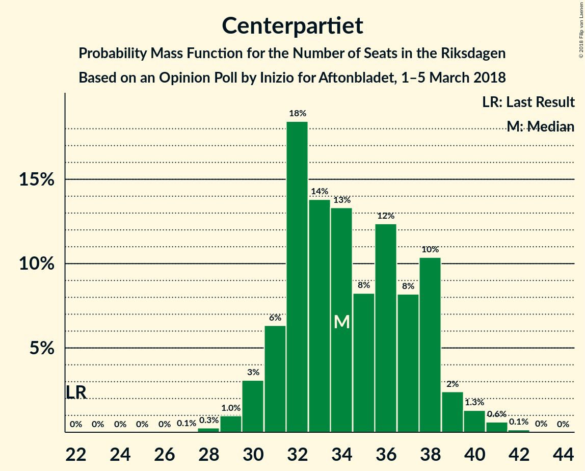
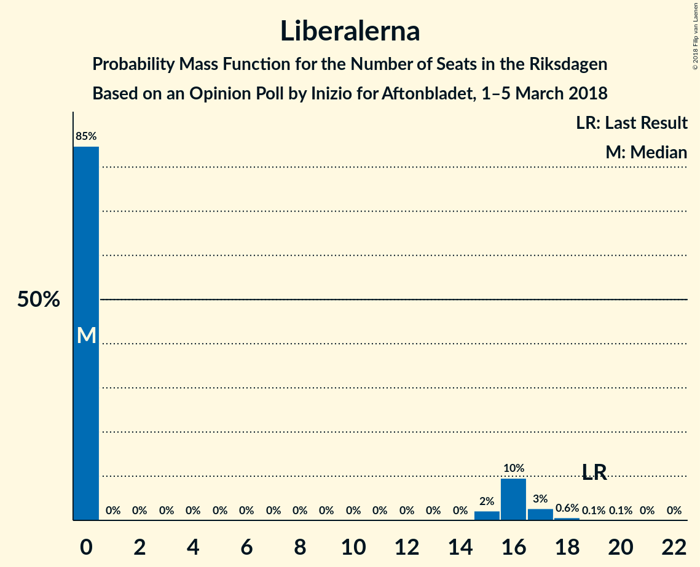

# Opinion Poll by Inizio for Aftonbladet, 1–5 March 2018

<a href="#voting-intentions">Voting Intentions</a> | <a href="#seats">Seats</a> | <a href="#coalitions">Coalitions</a> | <a href="#technical-information">Technical Information</a>

## Voting Intentions

### Confidence Intervals

| Party | Last Result | Poll Result | 80% Confidence Interval | 90% Confidence Interval | 95% Confidence Interval | 99% Confidence Interval |
|:-----:|:-----------:|:-----------:|:-----------------------:|:-----------------------:|:-----------------------:|:-----------------------:|
| Sveriges socialdemokratiska arbetareparti | 31.0% | 26.4% | 25.3–27.6% |24.9–28.0% |24.7–28.3% |24.1–28.8% |
| Moderata samlingspartiet | 23.3% | 24.5% | 23.4–25.7% |23.0–26.0% |22.8–26.3% |22.2–26.9% |
| Sverigedemokraterna | 12.9% | 15.7% | 14.8–16.7% |14.5–17.0% |14.3–17.3% |13.8–17.7% |
| Centerpartiet | 6.1% | 8.8% | 8.1–9.6% |7.9–9.8% |7.7–10.0% |7.4–10.4% |
| Vänsterpartiet | 5.7% | 6.9% | 6.2–7.6% |6.1–7.8% |5.9–8.0% |5.6–8.4% |
| Kristdemokraterna | 4.6% | 5.9% | 5.3–6.6% |5.1–6.8% |5.0–6.9% |4.7–7.3% |
| Liberalerna | 5.4% | 3.6% | 3.2–4.2% |3.0–4.3% |2.9–4.5% |2.7–4.7% |
| Miljöpartiet de gröna | 6.9% | 3.3% | 2.9–3.8% |2.8–4.0% |2.7–4.1% |2.5–4.4% |
| Feministiskt initiativ | 3.1% | 2.6% | 2.2–3.1% |2.1–3.2% |2.0–3.3% |1.8–3.6% |

*Note:* The poll result column reflects the actual value used in the calculations. Published results may vary slightly, and in addition be rounded to fewer digits.

## Seats

### Confidence Intervals

| Party | Last Result | Median | 80% Confidence Interval | 90% Confidence Interval | 95% Confidence Interval | 99% Confidence Interval |
|:-----:|:-----------:|:------:|:-----------------------:|:-----------------------:|:-----------------------:|:-----------------------:|
| <a href="#sveriges-socialdemokratiska-arbetareparti">Sveriges socialdemokratiska arbetareparti</a> | 113 | 104 | 98–108 |97–110 |95–111 |93–113 |
| <a href="#moderata-samlingspartiet">Moderata samlingspartiet</a> | 84 | 96 | 91–101 |89–101 |89–102 |86–105 |
| <a href="#sverigedemokraterna">Sverigedemokraterna</a> | 49 | 61 | 58–66 |57–66 |56–67 |53–69 |
| <a href="#centerpartiet">Centerpartiet</a> | 22 | 34 | 31–38 |31–38 |30–39 |29–41 |
| <a href="#vänsterpartiet">Vänsterpartiet</a> | 21 | 27 | 25–30 |24–31 |23–31 |22–33 |
| <a href="#kristdemokraterna">Kristdemokraterna</a> | 16 | 24 | 21–26 |20–27 |19–27 |18–29 |
| <a href="#liberalerna">Liberalerna</a> | 19 | 0 | 0–16 |0–16 |0–17 |0–18 |
| <a href="#miljöpartiet-de-gröna">Miljöpartiet de gröna</a> | 25 | 0 | 0 |0–15 |0–16 |0–16 |
| <a href="#feministiskt-initiativ">Feministiskt initiativ</a> | 0 | 0 | 0 |0 |0 |0 |

### Sveriges socialdemokratiska arbetareparti

*For a full overview of the results for this party, see the [Sveriges socialdemokratiska arbetareparti](party-sverigessocialdemokratiskaarbetareparti.html) page.*

| Number of Seats | Probability | Accumulated | Special Marks |
|:---------------:|:-----------:|:-----------:|:-------------:|
| 90 | 0% | 100% |  |
| 91 | 0.1% | 99.9% |  |
| 92 | 0.3% | 99.8% |  |
| 93 | 0.7% | 99.5% |  |
| 94 | 0.6% | 98.9% |  |
| 95 | 1.1% | 98% |  |
| 96 | 1.3% | 97% |  |
| 97 | 2% | 96% |  |
| 98 | 5% | 94% |  |
| 99 | 7% | 89% |  |
| 100 | 7% | 82% |  |
| 101 | 4% | 75% |  |
| 102 | 9% | 71% |  |
| 103 | 6% | 62% |  |
| 104 | 8% | 57% | Median |
| 105 | 14% | 49% |  |
| 106 | 12% | 35% |  |
| 107 | 5% | 22% |  |
| 108 | 9% | 17% |  |
| 109 | 3% | 8% |  |
| 110 | 2% | 5% |  |
| 111 | 2% | 3% |  |
| 112 | 0.5% | 1.2% |  |
| 113 | 0.3% | 0.7% | Last Result |
| 114 | 0.3% | 0.4% |  |
| 115 | 0.1% | 0.1% |  |
| 116 | 0% | 0.1% |  |
| 117 | 0% | 0% |  |

### Moderata samlingspartiet

*For a full overview of the results for this party, see the [Moderata samlingspartiet](party-moderatasamlingspartiet.html) page.*

| Number of Seats | Probability | Accumulated | Special Marks |
|:---------------:|:-----------:|:-----------:|:-------------:|
| 83 | 0.1% | 100% |  |
| 84 | 0.1% | 99.8% | Last Result |
| 85 | 0.2% | 99.7% |  |
| 86 | 0.4% | 99.6% |  |
| 87 | 0.4% | 99.2% |  |
| 88 | 1.2% | 98.8% |  |
| 89 | 4% | 98% |  |
| 90 | 3% | 94% |  |
| 91 | 5% | 91% |  |
| 92 | 6% | 85% |  |
| 93 | 7% | 79% |  |
| 94 | 4% | 72% |  |
| 95 | 6% | 68% |  |
| 96 | 18% | 62% | Median |
| 97 | 4% | 44% |  |
| 98 | 5% | 40% |  |
| 99 | 13% | 34% |  |
| 100 | 1.0% | 22% |  |
| 101 | 16% | 21% |  |
| 102 | 2% | 4% |  |
| 103 | 0.2% | 2% |  |
| 104 | 1.1% | 2% |  |
| 105 | 0.4% | 0.8% |  |
| 106 | 0.2% | 0.5% |  |
| 107 | 0.2% | 0.2% |  |
| 108 | 0% | 0% |  |

### Sverigedemokraterna

*For a full overview of the results for this party, see the [Sverigedemokraterna](party-sverigedemokraterna.html) page.*

| Number of Seats | Probability | Accumulated | Special Marks |
|:---------------:|:-----------:|:-----------:|:-------------:|
| 49 | 0% | 100% | Last Result |
| 50 | 0% | 100% |  |
| 51 | 0.1% | 100% |  |
| 52 | 0.2% | 99.9% |  |
| 53 | 0.3% | 99.8% |  |
| 54 | 0.5% | 99.5% |  |
| 55 | 1.3% | 99.0% |  |
| 56 | 1.1% | 98% |  |
| 57 | 4% | 97% |  |
| 58 | 6% | 92% |  |
| 59 | 15% | 86% |  |
| 60 | 11% | 71% |  |
| 61 | 19% | 60% | Median |
| 62 | 15% | 41% |  |
| 63 | 7% | 26% |  |
| 64 | 5% | 19% |  |
| 65 | 3% | 13% |  |
| 66 | 6% | 11% |  |
| 67 | 3% | 4% |  |
| 68 | 0.7% | 2% |  |
| 69 | 0.6% | 1.0% |  |
| 70 | 0.1% | 0.4% |  |
| 71 | 0.1% | 0.3% |  |
| 72 | 0.1% | 0.1% |  |
| 73 | 0% | 0% |  |

### Centerpartiet

*For a full overview of the results for this party, see the [Centerpartiet](party-centerpartiet.html) page.*

| Number of Seats | Probability | Accumulated | Special Marks |
|:---------------:|:-----------:|:-----------:|:-------------:|
| 22 | 0% | 100% | Last Result |
| 23 | 0% | 100% |  |
| 24 | 0% | 100% |  |
| 25 | 0% | 100% |  |
| 26 | 0% | 100% |  |
| 27 | 0.1% | 100% |  |
| 28 | 0.3% | 99.9% |  |
| 29 | 1.0% | 99.7% |  |
| 30 | 3% | 98.7% |  |
| 31 | 6% | 96% |  |
| 32 | 18% | 89% |  |
| 33 | 14% | 71% |  |
| 34 | 13% | 57% | Median |
| 35 | 8% | 44% |  |
| 36 | 12% | 35% |  |
| 37 | 8% | 23% |  |
| 38 | 10% | 15% |  |
| 39 | 2% | 5% |  |
| 40 | 1.3% | 2% |  |
| 41 | 0.6% | 0.8% |  |
| 42 | 0.1% | 0.2% |  |
| 43 | 0% | 0.1% |  |
| 44 | 0% | 0% |  |

### Vänsterpartiet

*For a full overview of the results for this party, see the [Vänsterpartiet](party-vänsterpartiet.html) page.*

| Number of Seats | Probability | Accumulated | Special Marks |
|:---------------:|:-----------:|:-----------:|:-------------:|
| 20 | 0.1% | 100% |  |
| 21 | 0.3% | 99.9% | Last Result |
| 22 | 0.8% | 99.6% |  |
| 23 | 2% | 98.8% |  |
| 24 | 6% | 96% |  |
| 25 | 9% | 90% |  |
| 26 | 18% | 81% |  |
| 27 | 16% | 64% | Median |
| 28 | 30% | 48% |  |
| 29 | 7% | 18% |  |
| 30 | 5% | 11% |  |
| 31 | 5% | 6% |  |
| 32 | 1.0% | 2% |  |
| 33 | 0.5% | 0.7% |  |
| 34 | 0.1% | 0.2% |  |
| 35 | 0% | 0.1% |  |
| 36 | 0% | 0% |  |

### Kristdemokraterna

*For a full overview of the results for this party, see the [Kristdemokraterna](party-kristdemokraterna.html) page.*

| Number of Seats | Probability | Accumulated | Special Marks |
|:---------------:|:-----------:|:-----------:|:-------------:|
| 16 | 0% | 100% | Last Result |
| 17 | 0% | 100% |  |
| 18 | 0.8% | 99.9% |  |
| 19 | 2% | 99.2% |  |
| 20 | 2% | 97% |  |
| 21 | 13% | 95% |  |
| 22 | 15% | 82% |  |
| 23 | 16% | 67% |  |
| 24 | 37% | 51% | Median |
| 25 | 4% | 14% |  |
| 26 | 5% | 11% |  |
| 27 | 5% | 6% |  |
| 28 | 0.4% | 1.0% |  |
| 29 | 0.5% | 0.6% |  |
| 30 | 0.1% | 0.1% |  |
| 31 | 0% | 0% |  |

### Liberalerna

*For a full overview of the results for this party, see the [Liberalerna](party-liberalerna.html) page.*

| Number of Seats | Probability | Accumulated | Special Marks |
|:---------------:|:-----------:|:-----------:|:-------------:|
| 0 | 85% | 100% | Median |
| 1 | 0% | 15% |  |
| 2 | 0% | 15% |  |
| 3 | 0% | 15% |  |
| 4 | 0% | 15% |  |
| 5 | 0% | 15% |  |
| 6 | 0% | 15% |  |
| 7 | 0% | 15% |  |
| 8 | 0% | 15% |  |
| 9 | 0% | 15% |  |
| 10 | 0% | 15% |  |
| 11 | 0% | 15% |  |
| 12 | 0% | 15% |  |
| 13 | 0% | 15% |  |
| 14 | 0% | 15% |  |
| 15 | 2% | 15% |  |
| 16 | 10% | 13% |  |
| 17 | 3% | 3% |  |
| 18 | 0.6% | 0.8% |  |
| 19 | 0.1% | 0.1% | Last Result |
| 20 | 0.1% | 0.1% |  |
| 21 | 0% | 0% |  |

### Miljöpartiet de gröna

*For a full overview of the results for this party, see the [Miljöpartiet de gröna](party-miljöpartietdegröna.html) page.*

| Number of Seats | Probability | Accumulated | Special Marks |
|:---------------:|:-----------:|:-----------:|:-------------:|
| 0 | 95% | 100% | Median |
| 1 | 0% | 5% |  |
| 2 | 0% | 5% |  |
| 3 | 0% | 5% |  |
| 4 | 0% | 5% |  |
| 5 | 0% | 5% |  |
| 6 | 0% | 5% |  |
| 7 | 0% | 5% |  |
| 8 | 0% | 5% |  |
| 9 | 0% | 5% |  |
| 10 | 0% | 5% |  |
| 11 | 0% | 5% |  |
| 12 | 0% | 5% |  |
| 13 | 0% | 5% |  |
| 14 | 0% | 5% |  |
| 15 | 1.5% | 5% |  |
| 16 | 3% | 4% |  |
| 17 | 0.3% | 0.5% |  |
| 18 | 0.1% | 0.1% |  |
| 19 | 0% | 0% |  |
| 20 | 0% | 0% |  |
| 21 | 0% | 0% |  |
| 22 | 0% | 0% |  |
| 23 | 0% | 0% |  |
| 24 | 0% | 0% |  |
| 25 | 0% | 0% | Last Result |

### Feministiskt initiativ

*For a full overview of the results for this party, see the [Feministiskt initiativ](party-feministisktinitiativ.html) page.*

| Number of Seats | Probability | Accumulated | Special Marks |
|:---------------:|:-----------:|:-----------:|:-------------:|
| 0 | 100% | 100% | Last Result, Median |

## Coalitions

### Confidence Intervals

| Coalition | Last Result | Median | Majority? | 80% Confidence Interval | 90% Confidence Interval | 95% Confidence Interval | 99% Confidence Interval |
|:---------:|:-----------:|:------:|:---------:|:-----------------------:|:-----------------------:|:-----------------------:|:-----------------------:|
| Moderata samlingspartiet – Centerpartiet – Kristdemokraterna – Liberalerna | 141 | 156 | 0% | 151–162 | 148–165 | 146–167 | 143–171 |
| Moderata samlingspartiet – Centerpartiet – Kristdemokraterna | 122 | 154 | 0% | 146–160 | 145–161 | 143–162 | 141–164 |
| Moderata samlingspartiet – Centerpartiet – Liberalerna | 125 | 133 | 0% | 127–139 | 124–143 | 123–145 | 122–149 |
| Sveriges socialdemokratiska arbetareparti – Vänsterpartiet – Miljöpartiet de gröna – Feministiskt initiativ | 159 | 131 | 0% | 125–137 | 124–139 | 122–142 | 119–144 |
| Sveriges socialdemokratiska arbetareparti – Vänsterpartiet – Miljöpartiet de gröna | 159 | 131 | 0% | 125–137 | 124–139 | 122–142 | 119–144 |
| Moderata samlingspartiet – Centerpartiet | 106 | 131 | 0% | 123–136 | 123–137 | 121–138 | 119–141 |
| Sveriges socialdemokratiska arbetareparti – Vänsterpartiet | 134 | 131 | 0% | 125–136 | 124–137 | 121–138 | 118–141 |
| Sveriges socialdemokratiska arbetareparti – Miljöpartiet de gröna | 138 | 105 | 0% | 99–110 | 97–113 | 96–115 | 93–119 |

### Moderata samlingspartiet – Centerpartiet – Kristdemokraterna – Liberalerna

| Number of Seats | Probability | Accumulated | Special Marks |
|:---------------:|:-----------:|:-----------:|:-------------:|
| 140 | 0% | 100% |  |
| 141 | 0% | 99.9% | Last Result |
| 142 | 0.1% | 99.9% |  |
| 143 | 0.5% | 99.8% |  |
| 144 | 0.2% | 99.3% |  |
| 145 | 0.2% | 99.1% |  |
| 146 | 3% | 98.9% |  |
| 147 | 0.7% | 96% |  |
| 148 | 2% | 95% |  |
| 149 | 2% | 93% |  |
| 150 | 1.2% | 92% |  |
| 151 | 5% | 90% |  |
| 152 | 2% | 85% |  |
| 153 | 17% | 83% |  |
| 154 | 4% | 66% | Median |
| 155 | 10% | 62% |  |
| 156 | 4% | 53% |  |
| 157 | 12% | 49% |  |
| 158 | 7% | 37% |  |
| 159 | 6% | 31% |  |
| 160 | 8% | 25% |  |
| 161 | 3% | 17% |  |
| 162 | 5% | 14% |  |
| 163 | 1.4% | 9% |  |
| 164 | 2% | 7% |  |
| 165 | 2% | 6% |  |
| 166 | 1.3% | 4% |  |
| 167 | 0.8% | 3% |  |
| 168 | 0.5% | 2% |  |
| 169 | 0.6% | 2% |  |
| 170 | 0.2% | 1.0% |  |
| 171 | 0.4% | 0.7% |  |
| 172 | 0.2% | 0.4% |  |
| 173 | 0.1% | 0.2% |  |
| 174 | 0% | 0.1% |  |
| 175 | 0% | 0% | Majority |

### Moderata samlingspartiet – Centerpartiet – Kristdemokraterna

| Number of Seats | Probability | Accumulated | Special Marks |
|:---------------:|:-----------:|:-----------:|:-------------:|
| 122 | 0% | 100% | Last Result |
| 123 | 0% | 100% |  |
| 124 | 0% | 100% |  |
| 125 | 0% | 100% |  |
| 126 | 0% | 100% |  |
| 127 | 0% | 100% |  |
| 128 | 0% | 100% |  |
| 129 | 0% | 100% |  |
| 130 | 0% | 100% |  |
| 131 | 0% | 100% |  |
| 132 | 0% | 100% |  |
| 133 | 0% | 100% |  |
| 134 | 0% | 100% |  |
| 135 | 0% | 100% |  |
| 136 | 0% | 100% |  |
| 137 | 0.1% | 99.9% |  |
| 138 | 0.1% | 99.9% |  |
| 139 | 0.1% | 99.8% |  |
| 140 | 0.2% | 99.7% |  |
| 141 | 0.3% | 99.5% |  |
| 142 | 0.8% | 99.2% |  |
| 143 | 1.2% | 98% |  |
| 144 | 2% | 97% |  |
| 145 | 0.8% | 96% |  |
| 146 | 7% | 95% |  |
| 147 | 1.3% | 88% |  |
| 148 | 4% | 87% |  |
| 149 | 2% | 83% |  |
| 150 | 3% | 81% |  |
| 151 | 6% | 77% |  |
| 152 | 3% | 71% |  |
| 153 | 17% | 69% |  |
| 154 | 4% | 52% | Median |
| 155 | 10% | 48% |  |
| 156 | 4% | 38% |  |
| 157 | 11% | 34% |  |
| 158 | 7% | 23% |  |
| 159 | 5% | 16% |  |
| 160 | 6% | 12% |  |
| 161 | 3% | 5% |  |
| 162 | 1.2% | 3% |  |
| 163 | 0.7% | 2% |  |
| 164 | 0.4% | 0.8% |  |
| 165 | 0.2% | 0.4% |  |
| 166 | 0.1% | 0.2% |  |
| 167 | 0.1% | 0.1% |  |
| 168 | 0% | 0% |  |

### Moderata samlingspartiet – Centerpartiet – Liberalerna

| Number of Seats | Probability | Accumulated | Special Marks |
|:---------------:|:-----------:|:-----------:|:-------------:|
| 118 | 0% | 100% |  |
| 119 | 0.1% | 99.9% |  |
| 120 | 0.1% | 99.8% |  |
| 121 | 0.1% | 99.7% |  |
| 122 | 0.6% | 99.5% |  |
| 123 | 3% | 98.9% |  |
| 124 | 2% | 96% |  |
| 125 | 1.0% | 94% | Last Result |
| 126 | 2% | 93% |  |
| 127 | 3% | 91% |  |
| 128 | 3% | 88% |  |
| 129 | 11% | 85% |  |
| 130 | 4% | 74% | Median |
| 131 | 12% | 71% |  |
| 132 | 4% | 58% |  |
| 133 | 15% | 54% |  |
| 134 | 6% | 38% |  |
| 135 | 2% | 32% |  |
| 136 | 6% | 30% |  |
| 137 | 8% | 24% |  |
| 138 | 2% | 16% |  |
| 139 | 4% | 14% |  |
| 140 | 2% | 10% |  |
| 141 | 2% | 8% |  |
| 142 | 0.8% | 6% |  |
| 143 | 2% | 5% |  |
| 144 | 1.1% | 4% |  |
| 145 | 0.8% | 3% |  |
| 146 | 0.4% | 2% |  |
| 147 | 0.4% | 1.4% |  |
| 148 | 0.3% | 1.0% |  |
| 149 | 0.5% | 0.7% |  |
| 150 | 0.1% | 0.2% |  |
| 151 | 0% | 0.1% |  |
| 152 | 0.1% | 0.1% |  |
| 153 | 0% | 0% |  |

### Sveriges socialdemokratiska arbetareparti – Vänsterpartiet – Miljöpartiet de gröna – Feministiskt initiativ

| Number of Seats | Probability | Accumulated | Special Marks |
|:---------------:|:-----------:|:-----------:|:-------------:|
| 117 | 0.1% | 100% |  |
| 118 | 0.2% | 99.8% |  |
| 119 | 0.3% | 99.6% |  |
| 120 | 0.4% | 99.4% |  |
| 121 | 0.9% | 99.0% |  |
| 122 | 0.9% | 98% |  |
| 123 | 1.2% | 97% |  |
| 124 | 2% | 96% |  |
| 125 | 5% | 94% |  |
| 126 | 3% | 90% |  |
| 127 | 6% | 87% |  |
| 128 | 6% | 81% |  |
| 129 | 7% | 74% |  |
| 130 | 7% | 67% |  |
| 131 | 11% | 61% | Median |
| 132 | 8% | 50% |  |
| 133 | 3% | 42% |  |
| 134 | 14% | 39% |  |
| 135 | 5% | 25% |  |
| 136 | 9% | 20% |  |
| 137 | 3% | 11% |  |
| 138 | 1.4% | 8% |  |
| 139 | 2% | 7% |  |
| 140 | 0.6% | 5% |  |
| 141 | 0.5% | 4% |  |
| 142 | 3% | 4% |  |
| 143 | 0.2% | 1.3% |  |
| 144 | 0.6% | 1.1% |  |
| 145 | 0.1% | 0.5% |  |
| 146 | 0.1% | 0.3% |  |
| 147 | 0.1% | 0.2% |  |
| 148 | 0% | 0.1% |  |
| 149 | 0.1% | 0.1% |  |
| 150 | 0% | 0% |  |
| 151 | 0% | 0% |  |
| 152 | 0% | 0% |  |
| 153 | 0% | 0% |  |
| 154 | 0% | 0% |  |
| 155 | 0% | 0% |  |
| 156 | 0% | 0% |  |
| 157 | 0% | 0% |  |
| 158 | 0% | 0% |  |
| 159 | 0% | 0% | Last Result |

### Sveriges socialdemokratiska arbetareparti – Vänsterpartiet – Miljöpartiet de gröna

| Number of Seats | Probability | Accumulated | Special Marks |
|:---------------:|:-----------:|:-----------:|:-------------:|
| 117 | 0.1% | 100% |  |
| 118 | 0.2% | 99.8% |  |
| 119 | 0.3% | 99.6% |  |
| 120 | 0.4% | 99.4% |  |
| 121 | 0.9% | 99.0% |  |
| 122 | 0.9% | 98% |  |
| 123 | 1.2% | 97% |  |
| 124 | 2% | 96% |  |
| 125 | 5% | 94% |  |
| 126 | 3% | 90% |  |
| 127 | 6% | 87% |  |
| 128 | 6% | 80% |  |
| 129 | 7% | 74% |  |
| 130 | 7% | 67% |  |
| 131 | 11% | 61% | Median |
| 132 | 8% | 50% |  |
| 133 | 3% | 42% |  |
| 134 | 14% | 39% |  |
| 135 | 5% | 25% |  |
| 136 | 9% | 20% |  |
| 137 | 3% | 11% |  |
| 138 | 1.4% | 8% |  |
| 139 | 2% | 7% |  |
| 140 | 0.6% | 5% |  |
| 141 | 0.4% | 4% |  |
| 142 | 3% | 4% |  |
| 143 | 0.2% | 1.3% |  |
| 144 | 0.6% | 1.1% |  |
| 145 | 0.1% | 0.5% |  |
| 146 | 0.1% | 0.3% |  |
| 147 | 0.1% | 0.2% |  |
| 148 | 0% | 0.1% |  |
| 149 | 0.1% | 0.1% |  |
| 150 | 0% | 0% |  |
| 151 | 0% | 0% |  |
| 152 | 0% | 0% |  |
| 153 | 0% | 0% |  |
| 154 | 0% | 0% |  |
| 155 | 0% | 0% |  |
| 156 | 0% | 0% |  |
| 157 | 0% | 0% |  |
| 158 | 0% | 0% |  |
| 159 | 0% | 0% | Last Result |

### Moderata samlingspartiet – Centerpartiet

| Number of Seats | Probability | Accumulated | Special Marks |
|:---------------:|:-----------:|:-----------:|:-------------:|
| 106 | 0% | 100% | Last Result |
| 107 | 0% | 100% |  |
| 108 | 0% | 100% |  |
| 109 | 0% | 100% |  |
| 110 | 0% | 100% |  |
| 111 | 0% | 100% |  |
| 112 | 0% | 100% |  |
| 113 | 0% | 100% |  |
| 114 | 0% | 100% |  |
| 115 | 0% | 100% |  |
| 116 | 0.1% | 99.9% |  |
| 117 | 0.2% | 99.9% |  |
| 118 | 0.2% | 99.7% |  |
| 119 | 0.5% | 99.5% |  |
| 120 | 0.6% | 99.0% |  |
| 121 | 2% | 98% |  |
| 122 | 1.2% | 97% |  |
| 123 | 7% | 96% |  |
| 124 | 3% | 89% |  |
| 125 | 3% | 86% |  |
| 126 | 2% | 83% |  |
| 127 | 5% | 81% |  |
| 128 | 4% | 76% |  |
| 129 | 12% | 72% |  |
| 130 | 4% | 61% | Median |
| 131 | 13% | 57% |  |
| 132 | 5% | 44% |  |
| 133 | 15% | 39% |  |
| 134 | 6% | 24% |  |
| 135 | 2% | 17% |  |
| 136 | 6% | 16% |  |
| 137 | 7% | 10% |  |
| 138 | 0.8% | 3% |  |
| 139 | 0.7% | 2% |  |
| 140 | 0.7% | 1.5% |  |
| 141 | 0.5% | 0.8% |  |
| 142 | 0.2% | 0.3% |  |
| 143 | 0.1% | 0.1% |  |
| 144 | 0% | 0.1% |  |
| 145 | 0% | 0% |  |

### Sveriges socialdemokratiska arbetareparti – Vänsterpartiet

| Number of Seats | Probability | Accumulated | Special Marks |
|:---------------:|:-----------:|:-----------:|:-------------:|
| 115 | 0% | 100% |  |
| 116 | 0% | 99.9% |  |
| 117 | 0.2% | 99.9% |  |
| 118 | 0.3% | 99.7% |  |
| 119 | 0.3% | 99.4% |  |
| 120 | 0.5% | 99.1% |  |
| 121 | 1.1% | 98.6% |  |
| 122 | 1.0% | 97% |  |
| 123 | 1.3% | 96% |  |
| 124 | 3% | 95% |  |
| 125 | 5% | 93% |  |
| 126 | 5% | 88% |  |
| 127 | 6% | 82% |  |
| 128 | 6% | 76% |  |
| 129 | 8% | 70% |  |
| 130 | 7% | 62% |  |
| 131 | 11% | 56% | Median |
| 132 | 8% | 45% |  |
| 133 | 3% | 37% |  |
| 134 | 14% | 34% | Last Result |
| 135 | 5% | 20% |  |
| 136 | 8% | 15% |  |
| 137 | 3% | 7% |  |
| 138 | 1.3% | 4% |  |
| 139 | 1.4% | 2% |  |
| 140 | 0.4% | 0.9% |  |
| 141 | 0.3% | 0.5% |  |
| 142 | 0.1% | 0.2% |  |
| 143 | 0.1% | 0.1% |  |
| 144 | 0% | 0% |  |

### Sveriges socialdemokratiska arbetareparti – Miljöpartiet de gröna

| Number of Seats | Probability | Accumulated | Special Marks |
|:---------------:|:-----------:|:-----------:|:-------------:|
| 91 | 0.1% | 100% |  |
| 92 | 0.2% | 99.9% |  |
| 93 | 0.6% | 99.7% |  |
| 94 | 0.5% | 99.1% |  |
| 95 | 0.9% | 98.6% |  |
| 96 | 1.2% | 98% |  |
| 97 | 2% | 97% |  |
| 98 | 5% | 95% |  |
| 99 | 4% | 90% |  |
| 100 | 7% | 86% |  |
| 101 | 4% | 79% |  |
| 102 | 9% | 75% |  |
| 103 | 6% | 67% |  |
| 104 | 7% | 61% | Median |
| 105 | 14% | 54% |  |
| 106 | 12% | 40% |  |
| 107 | 5% | 28% |  |
| 108 | 9% | 22% |  |
| 109 | 3% | 13% |  |
| 110 | 2% | 10% |  |
| 111 | 2% | 8% |  |
| 112 | 0.8% | 6% |  |
| 113 | 0.5% | 5% |  |
| 114 | 0.5% | 5% |  |
| 115 | 3% | 4% |  |
| 116 | 0.6% | 2% |  |
| 117 | 0.2% | 1.1% |  |
| 118 | 0.2% | 1.0% |  |
| 119 | 0.6% | 0.8% |  |
| 120 | 0% | 0.2% |  |
| 121 | 0.1% | 0.2% |  |
| 122 | 0.1% | 0.1% |  |
| 123 | 0% | 0% |  |
| 124 | 0% | 0% |  |
| 125 | 0% | 0% |  |
| 126 | 0% | 0% |  |
| 127 | 0% | 0% |  |
| 128 | 0% | 0% |  |
| 129 | 0% | 0% |  |
| 130 | 0% | 0% |  |
| 131 | 0% | 0% |  |
| 132 | 0% | 0% |  |
| 133 | 0% | 0% |  |
| 134 | 0% | 0% |  |
| 135 | 0% | 0% |  |
| 136 | 0% | 0% |  |
| 137 | 0% | 0% |  |
| 138 | 0% | 0% | Last Result |

## Technical Information

### Opinion Poll

+ **Polling firm:** Inizio
+ **Commissioner(s):** Aftonbladet
+ **Fieldwork period:** 1–5 March 2018

### Calculations

+ **Sample size:** 2324
+ **Simulations done:** 1,048,576
+ **Error estimate:** 0.91%

