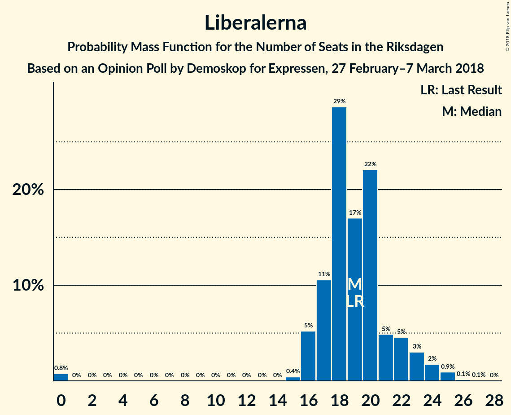

# Opinion Poll by Demoskop for Expressen, 27 February–7 March 2018

<a href="#voting-intentions">Voting Intentions</a> | <a href="#seats">Seats</a> | <a href="#coalitions">Coalitions</a> | <a href="#technical-information">Technical Information</a>

## Voting Intentions

### Confidence Intervals

| Party | Last Result | Poll Result | 80% Confidence Interval | 90% Confidence Interval | 95% Confidence Interval | 99% Confidence Interval |
|:-----:|:-----------:|:-----------:|:-----------------------:|:-----------------------:|:-----------------------:|:-----------------------:|
| Sveriges socialdemokratiska arbetareparti | 31.0% | 27.2% | 25.8–28.7% |25.4–29.1% |25.1–29.4% |24.4–30.1% |
| Moderata samlingspartiet | 23.3% | 21.8% | 20.5–23.2% |20.1–23.5% |19.8–23.9% |19.3–24.5% |
| Sverigedemokraterna | 12.9% | 18.6% | 17.4–19.9% |17.0–20.2% |16.8–20.6% |16.2–21.2% |
| Vänsterpartiet | 5.7% | 8.5% | 7.7–9.5% |7.5–9.8% |7.3–10.0% |6.9–10.5% |
| Centerpartiet | 6.1% | 7.9% | 7.1–8.8% |6.9–9.1% |6.7–9.3% |6.3–9.8% |
| Liberalerna | 5.4% | 5.1% | 4.5–5.9% |4.3–6.1% |4.1–6.3% |3.9–6.7% |
| Miljöpartiet de gröna | 6.9% | 4.6% | 4.0–5.4% |3.8–5.6% |3.7–5.8% |3.4–6.1% |
| Kristdemokraterna | 4.6% | 3.3% | 2.8–3.9% |2.6–4.1% |2.5–4.3% |2.3–4.6% |
| Feministiskt initiativ | 3.1% | 1.8% | 1.4–2.3% |1.3–2.4% |1.2–2.6% |1.1–2.8% |

*Note:* The poll result column reflects the actual value used in the calculations. Published results may vary slightly, and in addition be rounded to fewer digits.

## Seats

### Confidence Intervals

| Party | Last Result | Median | 80% Confidence Interval | 90% Confidence Interval | 95% Confidence Interval | 99% Confidence Interval |
|:-----:|:-----------:|:------:|:-----------------------:|:-----------------------:|:-----------------------:|:-----------------------:|
| <a href="#sveriges-socialdemokratiska-arbetareparti">Sveriges socialdemokratiska arbetareparti</a> | 113 | 100 | 97–106 |97–106 |89–108 |89–110 |
| <a href="#moderata-samlingspartiet">Moderata samlingspartiet</a> | 84 | 75 | 75–79 |75–86 |75–92 |75–92 |
| <a href="#sverigedemokraterna">Sverigedemokraterna</a> | 49 | 70 | 70–76 |69–76 |62–78 |61–85 |
| <a href="#vänsterpartiet">Vänsterpartiet</a> | 21 | 42 | 27–42 |27–42 |27–42 |27–42 |
| <a href="#centerpartiet">Centerpartiet</a> | 22 | 31 | 23–35 |23–35 |23–35 |23–38 |
| <a href="#liberalerna">Liberalerna</a> | 19 | 16 | 16–24 |16–24 |15–24 |0–24 |
| <a href="#miljöpartiet-de-gröna">Miljöpartiet de gröna</a> | 25 | 15 | 0–18 |0–19 |0–20 |0–21 |
| <a href="#kristdemokraterna">Kristdemokraterna</a> | 16 | 0 | 0–16 |0–16 |0–16 |0–16 |
| <a href="#feministiskt-initiativ">Feministiskt initiativ</a> | 0 | 0 | 0 |0 |0 |0 |

### Sveriges socialdemokratiska arbetareparti

*For a full overview of the results for this party, see the [Sveriges socialdemokratiska arbetareparti](party-sverigessocialdemokratiskaarbetareparti.html) page.*

| Number of Seats | Probability | Accumulated | Special Marks |
|:---------------:|:-----------:|:-----------:|:-------------:|
| 89 | 4% | 100% |  |
| 90 | 0% | 96% |  |
| 91 | 0.1% | 96% |  |
| 92 | 0.4% | 96% |  |
| 93 | 0.4% | 96% |  |
| 94 | 0% | 95% |  |
| 95 | 0% | 95% |  |
| 96 | 0% | 95% |  |
| 97 | 11% | 95% |  |
| 98 | 0% | 84% |  |
| 99 | 2% | 84% |  |
| 100 | 60% | 82% | Median |
| 101 | 0% | 23% |  |
| 102 | 0% | 23% |  |
| 103 | 0% | 23% |  |
| 104 | 0% | 23% |  |
| 105 | 0.1% | 23% |  |
| 106 | 18% | 22% |  |
| 107 | 0% | 4% |  |
| 108 | 2% | 4% |  |
| 109 | 0% | 2% |  |
| 110 | 2% | 2% |  |
| 111 | 0.1% | 0.2% |  |
| 112 | 0% | 0.1% |  |
| 113 | 0% | 0.1% | Last Result |
| 114 | 0% | 0.1% |  |
| 115 | 0% | 0.1% |  |
| 116 | 0% | 0.1% |  |
| 117 | 0.1% | 0.1% |  |
| 118 | 0% | 0% |  |

### Moderata samlingspartiet

*For a full overview of the results for this party, see the [Moderata samlingspartiet](party-moderatasamlingspartiet.html) page.*

| Number of Seats | Probability | Accumulated | Special Marks |
|:---------------:|:-----------:|:-----------:|:-------------:|
| 68 | 0.1% | 100% |  |
| 69 | 0% | 99.9% |  |
| 70 | 0% | 99.9% |  |
| 71 | 0% | 99.9% |  |
| 72 | 0% | 99.9% |  |
| 73 | 0% | 99.9% |  |
| 74 | 0% | 99.9% |  |
| 75 | 78% | 99.9% | Median |
| 76 | 0.1% | 22% |  |
| 77 | 0% | 22% |  |
| 78 | 2% | 22% |  |
| 79 | 11% | 20% |  |
| 80 | 0.1% | 9% |  |
| 81 | 2% | 9% |  |
| 82 | 0% | 7% |  |
| 83 | 0% | 7% |  |
| 84 | 0.1% | 7% | Last Result |
| 85 | 0% | 7% |  |
| 86 | 2% | 7% |  |
| 87 | 0.1% | 5% |  |
| 88 | 0% | 5% |  |
| 89 | 0% | 5% |  |
| 90 | 0% | 5% |  |
| 91 | 0.5% | 5% |  |
| 92 | 4% | 4% |  |
| 93 | 0% | 0% |  |

### Sverigedemokraterna

*For a full overview of the results for this party, see the [Sverigedemokraterna](party-sverigedemokraterna.html) page.*

| Number of Seats | Probability | Accumulated | Special Marks |
|:---------------:|:-----------:|:-----------:|:-------------:|
| 49 | 0% | 100% | Last Result |
| 50 | 0% | 100% |  |
| 51 | 0% | 100% |  |
| 52 | 0% | 100% |  |
| 53 | 0% | 100% |  |
| 54 | 0% | 100% |  |
| 55 | 0% | 100% |  |
| 56 | 0.1% | 100% |  |
| 57 | 0% | 99.9% |  |
| 58 | 0% | 99.9% |  |
| 59 | 0.1% | 99.9% |  |
| 60 | 0% | 99.9% |  |
| 61 | 0.4% | 99.8% |  |
| 62 | 4% | 99.4% |  |
| 63 | 0% | 95% |  |
| 64 | 0% | 95% |  |
| 65 | 0% | 95% |  |
| 66 | 0% | 95% |  |
| 67 | 0% | 95% |  |
| 68 | 0% | 95% |  |
| 69 | 2% | 95% |  |
| 70 | 59% | 93% | Median |
| 71 | 0.6% | 34% |  |
| 72 | 0% | 33% |  |
| 73 | 0% | 33% |  |
| 74 | 0% | 33% |  |
| 75 | 11% | 33% |  |
| 76 | 18% | 22% |  |
| 77 | 0.5% | 4% |  |
| 78 | 2% | 4% |  |
| 79 | 0% | 2% |  |
| 80 | 0% | 2% |  |
| 81 | 0% | 2% |  |
| 82 | 0% | 2% |  |
| 83 | 0% | 2% |  |
| 84 | 0% | 2% |  |
| 85 | 2% | 2% |  |
| 86 | 0% | 0% |  |

### Vänsterpartiet

*For a full overview of the results for this party, see the [Vänsterpartiet](party-vänsterpartiet.html) page.*

| Number of Seats | Probability | Accumulated | Special Marks |
|:---------------:|:-----------:|:-----------:|:-------------:|
| 21 | 0% | 100% | Last Result |
| 22 | 0% | 100% |  |
| 23 | 0% | 100% |  |
| 24 | 0% | 100% |  |
| 25 | 0% | 100% |  |
| 26 | 0% | 100% |  |
| 27 | 21% | 100% |  |
| 28 | 11% | 79% |  |
| 29 | 0% | 68% |  |
| 30 | 0% | 68% |  |
| 31 | 0% | 68% |  |
| 32 | 2% | 68% |  |
| 33 | 4% | 66% |  |
| 34 | 2% | 62% |  |
| 35 | 0% | 60% |  |
| 36 | 0.1% | 60% |  |
| 37 | 0.4% | 60% |  |
| 38 | 0.1% | 59% |  |
| 39 | 0% | 59% |  |
| 40 | 0% | 59% |  |
| 41 | 0% | 59% |  |
| 42 | 59% | 59% | Median |
| 43 | 0% | 0% |  |

### Centerpartiet

*For a full overview of the results for this party, see the [Centerpartiet](party-centerpartiet.html) page.*

| Number of Seats | Probability | Accumulated | Special Marks |
|:---------------:|:-----------:|:-----------:|:-------------:|
| 22 | 0% | 100% | Last Result |
| 23 | 18% | 100% |  |
| 24 | 0.4% | 82% |  |
| 25 | 0% | 81% |  |
| 26 | 0% | 81% |  |
| 27 | 2% | 81% |  |
| 28 | 0% | 79% |  |
| 29 | 2% | 79% |  |
| 30 | 2% | 77% |  |
| 31 | 59% | 75% | Median |
| 32 | 4% | 16% |  |
| 33 | 0% | 12% |  |
| 34 | 0% | 12% |  |
| 35 | 11% | 12% |  |
| 36 | 0% | 1.1% |  |
| 37 | 0.6% | 1.1% |  |
| 38 | 0.4% | 0.5% |  |
| 39 | 0.1% | 0.1% |  |
| 40 | 0% | 0% |  |

### Liberalerna

*For a full overview of the results for this party, see the [Liberalerna](party-liberalerna.html) page.*

| Number of Seats | Probability | Accumulated | Special Marks |
|:---------------:|:-----------:|:-----------:|:-------------:|
| 0 | 2% | 100% |  |
| 1 | 0% | 98% |  |
| 2 | 0% | 98% |  |
| 3 | 0% | 98% |  |
| 4 | 0% | 98% |  |
| 5 | 0% | 98% |  |
| 6 | 0% | 98% |  |
| 7 | 0% | 98% |  |
| 8 | 0% | 98% |  |
| 9 | 0% | 98% |  |
| 10 | 0% | 98% |  |
| 11 | 0% | 98% |  |
| 12 | 0% | 98% |  |
| 13 | 0% | 98% |  |
| 14 | 0% | 98% |  |
| 15 | 2% | 98% |  |
| 16 | 60% | 96% | Median |
| 17 | 0.2% | 36% |  |
| 18 | 0.5% | 36% |  |
| 19 | 11% | 35% | Last Result |
| 20 | 0.4% | 25% |  |
| 21 | 0.1% | 24% |  |
| 22 | 6% | 24% |  |
| 23 | 0% | 18% |  |
| 24 | 18% | 18% |  |
| 25 | 0% | 0% |  |

### Miljöpartiet de gröna

*For a full overview of the results for this party, see the [Miljöpartiet de gröna](party-miljöpartietdegröna.html) page.*

| Number of Seats | Probability | Accumulated | Special Marks |
|:---------------:|:-----------:|:-----------:|:-------------:|
| 0 | 13% | 100% |  |
| 1 | 0% | 87% |  |
| 2 | 0% | 87% |  |
| 3 | 0% | 87% |  |
| 4 | 0% | 87% |  |
| 5 | 0% | 87% |  |
| 6 | 0% | 87% |  |
| 7 | 0% | 87% |  |
| 8 | 0% | 87% |  |
| 9 | 0% | 87% |  |
| 10 | 0% | 87% |  |
| 11 | 0% | 87% |  |
| 12 | 0% | 87% |  |
| 13 | 0% | 87% |  |
| 14 | 0% | 87% |  |
| 15 | 59% | 87% | Median |
| 16 | 0.1% | 28% |  |
| 17 | 2% | 28% |  |
| 18 | 18% | 25% |  |
| 19 | 4% | 7% |  |
| 20 | 2% | 3% |  |
| 21 | 0.4% | 0.6% |  |
| 22 | 0.1% | 0.2% |  |
| 23 | 0% | 0.2% |  |
| 24 | 0.2% | 0.2% |  |
| 25 | 0% | 0% | Last Result |

### Kristdemokraterna

*For a full overview of the results for this party, see the [Kristdemokraterna](party-kristdemokraterna.html) page.*

| Number of Seats | Probability | Accumulated | Special Marks |
|:---------------:|:-----------:|:-----------:|:-------------:|
| 0 | 89% | 100% | Median |
| 1 | 0% | 11% |  |
| 2 | 0% | 11% |  |
| 3 | 0% | 11% |  |
| 4 | 0% | 11% |  |
| 5 | 0% | 11% |  |
| 6 | 0% | 11% |  |
| 7 | 0% | 11% |  |
| 8 | 0% | 11% |  |
| 9 | 0% | 11% |  |
| 10 | 0% | 11% |  |
| 11 | 0% | 11% |  |
| 12 | 0% | 11% |  |
| 13 | 0% | 11% |  |
| 14 | 0% | 11% |  |
| 15 | 0% | 11% |  |
| 16 | 11% | 11% | Last Result |
| 17 | 0% | 0.4% |  |
| 18 | 0.4% | 0.4% |  |
| 19 | 0% | 0% |  |

### Feministiskt initiativ

*For a full overview of the results for this party, see the [Feministiskt initiativ](party-feministisktinitiativ.html) page.*

| Number of Seats | Probability | Accumulated | Special Marks |
|:---------------:|:-----------:|:-----------:|:-------------:|
| 0 | 100% | 100% | Last Result, Median |

## Coalitions

### Confidence Intervals

| Coalition | Last Result | Median | Majority? | 80% Confidence Interval | 90% Confidence Interval | 95% Confidence Interval | 99% Confidence Interval |
|:---------:|:-----------:|:------:|:---------:|:-----------------------:|:-----------------------:|:-----------------------:|:-----------------------:|
| Sveriges socialdemokratiska arbetareparti – Vänsterpartiet – Miljöpartiet de gröna – Feministiskt initiativ | 159 | 157 | 0% | 125–157 | 125–157 | 125–157 | 125–157 |
| Sveriges socialdemokratiska arbetareparti – Vänsterpartiet – Miljöpartiet de gröna | 159 | 157 | 0% | 125–157 | 125–157 | 125–157 | 125–157 |
| Moderata samlingspartiet – Centerpartiet – Liberalerna – Kristdemokraterna | 141 | 122 | 0% | 122–149 | 122–149 | 122–149 | 111–149 |
| Moderata samlingspartiet – Centerpartiet – Liberalerna | 125 | 122 | 0% | 122–133 | 122–133 | 122–146 | 111–146 |
| Sveriges socialdemokratiska arbetareparti – Vänsterpartiet | 134 | 142 | 0% | 125–142 | 125–142 | 122–142 | 122–142 |
| Moderata samlingspartiet – Centerpartiet – Kristdemokraterna | 122 | 106 | 0% | 98–130 | 98–130 | 98–130 | 98–130 |
| Moderata samlingspartiet – Centerpartiet | 106 | 106 | 0% | 98–114 | 98–114 | 98–124 | 98–128 |

### Sveriges socialdemokratiska arbetareparti – Vänsterpartiet – Miljöpartiet de gröna – Feministiskt initiativ

| Number of Seats | Probability | Accumulated | Special Marks |
|:---------------:|:-----------:|:-----------:|:-------------:|
| 125 | 11% | 100% |  |
| 126 | 0% | 89% |  |
| 127 | 0% | 89% |  |
| 128 | 0% | 89% |  |
| 129 | 0% | 89% |  |
| 130 | 0% | 89% |  |
| 131 | 0% | 89% |  |
| 132 | 0.5% | 89% |  |
| 133 | 0% | 89% |  |
| 134 | 0% | 89% |  |
| 135 | 0% | 89% |  |
| 136 | 0% | 89% |  |
| 137 | 0% | 89% |  |
| 138 | 0% | 89% |  |
| 139 | 0.4% | 89% |  |
| 140 | 0% | 88% |  |
| 141 | 4% | 88% |  |
| 142 | 2% | 84% |  |
| 143 | 0.1% | 82% |  |
| 144 | 0% | 82% |  |
| 145 | 0% | 82% |  |
| 146 | 0% | 82% |  |
| 147 | 0% | 82% |  |
| 148 | 0% | 82% |  |
| 149 | 0% | 82% |  |
| 150 | 0% | 82% |  |
| 151 | 19% | 82% |  |
| 152 | 2% | 64% |  |
| 153 | 2% | 61% |  |
| 154 | 0% | 60% |  |
| 155 | 0.1% | 60% |  |
| 156 | 0% | 59% |  |
| 157 | 59% | 59% | Median |
| 158 | 0% | 0.2% |  |
| 159 | 0% | 0.2% | Last Result |
| 160 | 0.1% | 0.2% |  |
| 161 | 0% | 0.1% |  |
| 162 | 0% | 0.1% |  |
| 163 | 0% | 0.1% |  |
| 164 | 0% | 0.1% |  |
| 165 | 0% | 0.1% |  |
| 166 | 0% | 0.1% |  |
| 167 | 0% | 0.1% |  |
| 168 | 0% | 0% |  |

### Sveriges socialdemokratiska arbetareparti – Vänsterpartiet – Miljöpartiet de gröna

| Number of Seats | Probability | Accumulated | Special Marks |
|:---------------:|:-----------:|:-----------:|:-------------:|
| 125 | 11% | 100% |  |
| 126 | 0% | 89% |  |
| 127 | 0% | 89% |  |
| 128 | 0% | 89% |  |
| 129 | 0% | 89% |  |
| 130 | 0% | 89% |  |
| 131 | 0% | 89% |  |
| 132 | 0.5% | 89% |  |
| 133 | 0% | 89% |  |
| 134 | 0% | 89% |  |
| 135 | 0% | 89% |  |
| 136 | 0% | 89% |  |
| 137 | 0% | 89% |  |
| 138 | 0% | 89% |  |
| 139 | 0.4% | 89% |  |
| 140 | 0% | 88% |  |
| 141 | 4% | 88% |  |
| 142 | 2% | 84% |  |
| 143 | 0.1% | 82% |  |
| 144 | 0% | 82% |  |
| 145 | 0% | 82% |  |
| 146 | 0% | 82% |  |
| 147 | 0% | 82% |  |
| 148 | 0% | 82% |  |
| 149 | 0% | 82% |  |
| 150 | 0% | 82% |  |
| 151 | 19% | 82% |  |
| 152 | 2% | 64% |  |
| 153 | 2% | 61% |  |
| 154 | 0% | 60% |  |
| 155 | 0.1% | 60% |  |
| 156 | 0% | 59% |  |
| 157 | 59% | 59% | Median |
| 158 | 0% | 0.2% |  |
| 159 | 0% | 0.2% | Last Result |
| 160 | 0.1% | 0.2% |  |
| 161 | 0% | 0.1% |  |
| 162 | 0% | 0.1% |  |
| 163 | 0% | 0.1% |  |
| 164 | 0% | 0.1% |  |
| 165 | 0% | 0.1% |  |
| 166 | 0% | 0.1% |  |
| 167 | 0% | 0.1% |  |
| 168 | 0% | 0% |  |

### Moderata samlingspartiet – Centerpartiet – Liberalerna – Kristdemokraterna

| Number of Seats | Probability | Accumulated | Special Marks |
|:---------------:|:-----------:|:-----------:|:-------------:|
| 111 | 2% | 100% |  |
| 112 | 0.1% | 98% |  |
| 113 | 0% | 98% |  |
| 114 | 0% | 98% |  |
| 115 | 0% | 98% |  |
| 116 | 0% | 98% |  |
| 117 | 0% | 98% |  |
| 118 | 0% | 98% |  |
| 119 | 0% | 98% |  |
| 120 | 0% | 98% |  |
| 121 | 0.1% | 98% |  |
| 122 | 77% | 98% | Median |
| 123 | 0% | 21% |  |
| 124 | 0% | 21% |  |
| 125 | 0% | 21% |  |
| 126 | 0% | 21% |  |
| 127 | 0% | 21% |  |
| 128 | 2% | 20% |  |
| 129 | 2% | 18% |  |
| 130 | 0% | 16% |  |
| 131 | 0% | 16% |  |
| 132 | 0% | 16% |  |
| 133 | 0.4% | 16% |  |
| 134 | 0% | 16% |  |
| 135 | 0.1% | 16% |  |
| 136 | 0% | 16% |  |
| 137 | 0.4% | 16% |  |
| 138 | 0% | 15% |  |
| 139 | 0% | 15% |  |
| 140 | 0% | 15% |  |
| 141 | 0% | 15% | Last Result |
| 142 | 0% | 15% |  |
| 143 | 0% | 15% |  |
| 144 | 0% | 15% |  |
| 145 | 0% | 15% |  |
| 146 | 5% | 15% |  |
| 147 | 0% | 11% |  |
| 148 | 0% | 11% |  |
| 149 | 11% | 11% |  |
| 150 | 0.1% | 0.1% |  |
| 151 | 0% | 0% |  |

### Moderata samlingspartiet – Centerpartiet – Liberalerna

| Number of Seats | Probability | Accumulated | Special Marks |
|:---------------:|:-----------:|:-----------:|:-------------:|
| 111 | 2% | 100% |  |
| 112 | 0.1% | 98% |  |
| 113 | 0% | 98% |  |
| 114 | 0% | 98% |  |
| 115 | 0% | 98% |  |
| 116 | 0% | 98% |  |
| 117 | 0% | 98% |  |
| 118 | 0% | 98% |  |
| 119 | 0.4% | 98% |  |
| 120 | 0% | 98% |  |
| 121 | 0.1% | 98% |  |
| 122 | 77% | 98% | Median |
| 123 | 0% | 20% |  |
| 124 | 0% | 20% |  |
| 125 | 0% | 20% | Last Result |
| 126 | 0% | 20% |  |
| 127 | 0% | 20% |  |
| 128 | 2% | 20% |  |
| 129 | 2% | 18% |  |
| 130 | 0% | 16% |  |
| 131 | 0% | 16% |  |
| 132 | 0% | 16% |  |
| 133 | 11% | 16% |  |
| 134 | 0.1% | 5% |  |
| 135 | 0.1% | 5% |  |
| 136 | 0% | 5% |  |
| 137 | 0% | 5% |  |
| 138 | 0% | 5% |  |
| 139 | 0% | 5% |  |
| 140 | 0% | 5% |  |
| 141 | 0% | 5% |  |
| 142 | 0% | 5% |  |
| 143 | 0% | 5% |  |
| 144 | 0% | 5% |  |
| 145 | 0% | 5% |  |
| 146 | 5% | 5% |  |
| 147 | 0% | 0% |  |

### Sveriges socialdemokratiska arbetareparti – Vänsterpartiet

| Number of Seats | Probability | Accumulated | Special Marks |
|:---------------:|:-----------:|:-----------:|:-------------:|
| 120 | 0.4% | 100% |  |
| 121 | 0% | 99.6% |  |
| 122 | 4% | 99.6% |  |
| 123 | 0% | 96% |  |
| 124 | 0% | 96% |  |
| 125 | 11% | 96% |  |
| 126 | 0% | 85% |  |
| 127 | 0.2% | 85% |  |
| 128 | 0% | 85% |  |
| 129 | 0% | 85% |  |
| 130 | 0.4% | 85% |  |
| 131 | 0% | 84% |  |
| 132 | 0.6% | 84% |  |
| 133 | 20% | 84% |  |
| 134 | 0% | 64% | Last Result |
| 135 | 2% | 64% |  |
| 136 | 0% | 61% |  |
| 137 | 0.1% | 61% |  |
| 138 | 0.1% | 61% |  |
| 139 | 0% | 61% |  |
| 140 | 0% | 61% |  |
| 141 | 0% | 61% |  |
| 142 | 61% | 61% | Median |
| 143 | 0% | 0.2% |  |
| 144 | 0% | 0.2% |  |
| 145 | 0% | 0.1% |  |
| 146 | 0% | 0.1% |  |
| 147 | 0% | 0.1% |  |
| 148 | 0% | 0.1% |  |
| 149 | 0% | 0.1% |  |
| 150 | 0% | 0.1% |  |
| 151 | 0% | 0.1% |  |
| 152 | 0% | 0.1% |  |
| 153 | 0% | 0.1% |  |
| 154 | 0% | 0.1% |  |
| 155 | 0.1% | 0.1% |  |
| 156 | 0% | 0% |  |

### Moderata samlingspartiet – Centerpartiet – Kristdemokraterna

| Number of Seats | Probability | Accumulated | Special Marks |
|:---------------:|:-----------:|:-----------:|:-------------:|
| 91 | 0.1% | 100% |  |
| 92 | 0% | 99.9% |  |
| 93 | 0% | 99.9% |  |
| 94 | 0% | 99.9% |  |
| 95 | 0% | 99.9% |  |
| 96 | 0% | 99.9% |  |
| 97 | 0% | 99.9% |  |
| 98 | 18% | 99.9% |  |
| 99 | 0% | 82% |  |
| 100 | 0% | 82% |  |
| 101 | 0% | 82% |  |
| 102 | 0% | 82% |  |
| 103 | 0% | 82% |  |
| 104 | 0% | 82% |  |
| 105 | 0% | 82% |  |
| 106 | 59% | 82% | Median |
| 107 | 2% | 22% |  |
| 108 | 0% | 21% |  |
| 109 | 0% | 21% |  |
| 110 | 0% | 21% |  |
| 111 | 2% | 21% |  |
| 112 | 0% | 19% |  |
| 113 | 3% | 19% |  |
| 114 | 0% | 16% |  |
| 115 | 0% | 16% |  |
| 116 | 0.1% | 16% |  |
| 117 | 0% | 16% |  |
| 118 | 0% | 16% |  |
| 119 | 0% | 16% |  |
| 120 | 0% | 16% |  |
| 121 | 0.5% | 16% |  |
| 122 | 0% | 15% | Last Result |
| 123 | 0% | 15% |  |
| 124 | 4% | 15% |  |
| 125 | 0% | 11% |  |
| 126 | 0% | 11% |  |
| 127 | 0% | 11% |  |
| 128 | 0.5% | 11% |  |
| 129 | 0% | 11% |  |
| 130 | 11% | 11% |  |
| 131 | 0.1% | 0.1% |  |
| 132 | 0% | 0% |  |

### Moderata samlingspartiet – Centerpartiet

| Number of Seats | Probability | Accumulated | Special Marks |
|:---------------:|:-----------:|:-----------:|:-------------:|
| 91 | 0.1% | 100% |  |
| 92 | 0% | 99.9% |  |
| 93 | 0% | 99.9% |  |
| 94 | 0% | 99.9% |  |
| 95 | 0% | 99.9% |  |
| 96 | 0% | 99.9% |  |
| 97 | 0% | 99.9% |  |
| 98 | 18% | 99.9% |  |
| 99 | 0% | 82% |  |
| 100 | 0% | 82% |  |
| 101 | 0% | 82% |  |
| 102 | 0% | 82% |  |
| 103 | 0.4% | 82% |  |
| 104 | 0% | 81% |  |
| 105 | 0% | 81% |  |
| 106 | 59% | 81% | Last Result, Median |
| 107 | 2% | 22% |  |
| 108 | 0.1% | 20% |  |
| 109 | 0% | 20% |  |
| 110 | 0% | 20% |  |
| 111 | 2% | 20% |  |
| 112 | 0% | 18% |  |
| 113 | 3% | 18% |  |
| 114 | 11% | 16% |  |
| 115 | 0.1% | 5% |  |
| 116 | 0.1% | 5% |  |
| 117 | 0% | 5% |  |
| 118 | 0% | 5% |  |
| 119 | 0% | 5% |  |
| 120 | 0% | 5% |  |
| 121 | 0.1% | 5% |  |
| 122 | 0% | 5% |  |
| 123 | 0% | 5% |  |
| 124 | 4% | 5% |  |
| 125 | 0% | 0.5% |  |
| 126 | 0% | 0.5% |  |
| 127 | 0% | 0.5% |  |
| 128 | 0.5% | 0.5% |  |
| 129 | 0% | 0% |  |

## Technical Information

### Opinion Poll

+ **Polling firm:** Demoskop
+ **Commissioner(s):** Expressen
+ **Fieldwork period:** 27 February–7 March 2018

### Calculations

+ **Sample size:** 1620
+ **Simulations done:** 1,024
+ **Error estimate:** 3.98%

