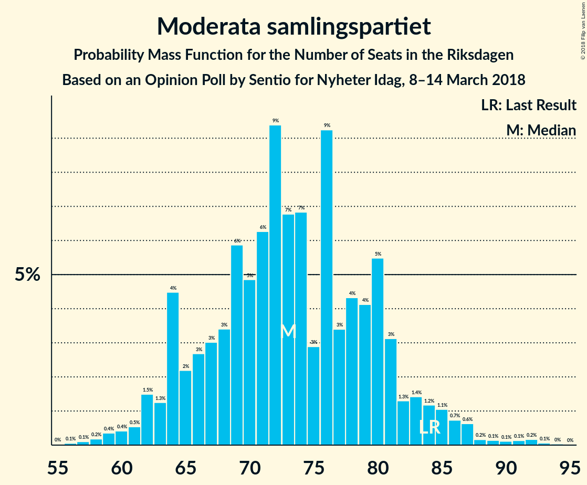
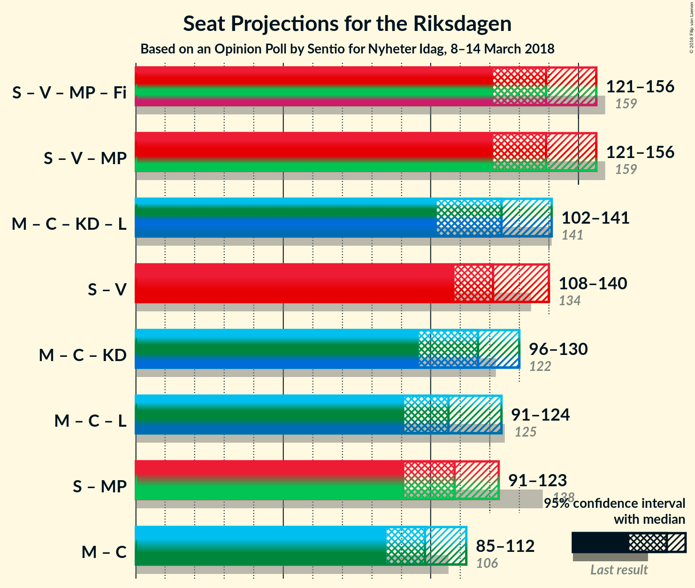

# Opinion Poll by Sentio for Nyheter Idag, 8–14 March 2018

<a href="#voting-intentions">Voting Intentions</a> | <a href="#seats">Seats</a> | <a href="#coalitions">Coalitions</a> | <a href="#technical-information">Technical Information</a>

## Voting Intentions

### Confidence Intervals

| Party | Last Result | Poll Result | 80% Confidence Interval | 90% Confidence Interval | 95% Confidence Interval | 99% Confidence Interval |
|:-----:|:-----------:|:-----------:|:-----------------------:|:-----------------------:|:-----------------------:|:-----------------------:|
| Sveriges socialdemokratiska arbetareparti | 31.0% | 24.6% | 22.6–26.7% |22.1–27.3% |21.6–27.8% |20.7–28.8% |
| Sverigedemokraterna | 12.9% | 23.0% | 21.1–25.0% |20.5–25.6% |20.1–26.1% |19.2–27.1% |
| Moderata samlingspartiet | 23.3% | 19.5% | 17.7–21.4% |17.2–22.0% |16.8–22.5% |16.0–23.4% |
| Vänsterpartiet | 5.7% | 8.1% | 6.9–9.5% |6.6–9.9% |6.3–10.2% |5.8–11.0% |
| Centerpartiet | 6.1% | 6.4% | 5.4–7.7% |5.1–8.1% |4.9–8.4% |4.4–9.1% |
| Kristdemokraterna | 4.6% | 4.8% | 4.0–6.0% |3.7–6.3% |3.5–6.6% |3.1–7.2% |
| Miljöpartiet de gröna | 6.9% | 4.7% | 3.8–5.9% |3.6–6.2% |3.4–6.5% |3.0–7.1% |
| Liberalerna | 5.4% | 3.9% | 3.1–5.0% |2.9–5.3% |2.7–5.5% |2.4–6.1% |
| Feministiskt initiativ | 3.1% | 2.0% | 1.5–2.9% |1.3–3.1% |1.2–3.3% |1.0–3.7% |

*Note:* The poll result column reflects the actual value used in the calculations. Published results may vary slightly, and in addition be rounded to fewer digits.

## Seats

### Confidence Intervals

| Party | Last Result | Median | 80% Confidence Interval | 90% Confidence Interval | 95% Confidence Interval | 99% Confidence Interval |
|:-----:|:-----------:|:------:|:-----------------------:|:-----------------------:|:-----------------------:|:-----------------------:|
| <a href="#sveriges-socialdemokratiska-arbetareparti">Sveriges socialdemokratiska arbetareparti</a> | 113 | 91 | 87–98 |83–100 |83–103 |81–105 |
| <a href="#sverigedemokraterna">Sverigedemokraterna</a> | 49 | 88 | 76–96 |76–96 |71–96 |70–102 |
| <a href="#moderata-samlingspartiet">Moderata samlingspartiet</a> | 84 | 70 | 67–75 |67–79 |65–83 |62–85 |
| <a href="#vänsterpartiet">Vänsterpartiet</a> | 21 | 32 | 29–38 |26–39 |25–39 |21–39 |
| <a href="#centerpartiet">Centerpartiet</a> | 22 | 26 | 21–27 |19–27 |19–30 |18–32 |
| <a href="#kristdemokraterna">Kristdemokraterna</a> | 16 | 15 | 15–20 |0–21 |0–24 |0–27 |
| <a href="#miljöpartiet-de-gröna">Miljöpartiet de gröna</a> | 25 | 19 | 0–24 |0–25 |0–25 |0–27 |
| <a href="#liberalerna">Liberalerna</a> | 19 | 0 | 0–17 |0–19 |0–20 |0–23 |
| <a href="#feministiskt-initiativ">Feministiskt initiativ</a> | 0 | 0 | 0 |0 |0 |0 |

### Sveriges socialdemokratiska arbetareparti

*For a full overview of the results for this party, see the [Sveriges socialdemokratiska arbetareparti](party-sverigessocialdemokratiskaarbetareparti.html) page.*

| Number of Seats | Probability | Accumulated | Special Marks |
|:---------------:|:-----------:|:-----------:|:-------------:|
| 72 | 0% | 100% |  |
| 73 | 0% | 99.9% |  |
| 74 | 0% | 99.9% |  |
| 75 | 0.3% | 99.9% |  |
| 76 | 0.1% | 99.7% |  |
| 77 | 0.1% | 99.6% |  |
| 78 | 0% | 99.6% |  |
| 79 | 0% | 99.5% |  |
| 80 | 0% | 99.5% |  |
| 81 | 0% | 99.5% |  |
| 82 | 0.3% | 99.5% |  |
| 83 | 4% | 99.1% |  |
| 84 | 2% | 95% |  |
| 85 | 0.5% | 93% |  |
| 86 | 0% | 92% |  |
| 87 | 3% | 92% |  |
| 88 | 1.1% | 90% |  |
| 89 | 0.5% | 89% |  |
| 90 | 1.1% | 88% |  |
| 91 | 59% | 87% | Median |
| 92 | 0.1% | 28% |  |
| 93 | 5% | 28% |  |
| 94 | 9% | 22% |  |
| 95 | 0.8% | 13% |  |
| 96 | 2% | 13% |  |
| 97 | 0.2% | 11% |  |
| 98 | 0.9% | 10% |  |
| 99 | 0.2% | 9% |  |
| 100 | 4% | 9% |  |
| 101 | 0.2% | 5% |  |
| 102 | 0% | 5% |  |
| 103 | 4% | 5% |  |
| 104 | 0% | 0.8% |  |
| 105 | 0.6% | 0.8% |  |
| 106 | 0.1% | 0.1% |  |
| 107 | 0% | 0.1% |  |
| 108 | 0% | 0% |  |
| 109 | 0% | 0% |  |
| 110 | 0% | 0% |  |
| 111 | 0% | 0% |  |
| 112 | 0% | 0% |  |
| 113 | 0% | 0% | Last Result |

### Sverigedemokraterna

*For a full overview of the results for this party, see the [Sverigedemokraterna](party-sverigedemokraterna.html) page.*

| Number of Seats | Probability | Accumulated | Special Marks |
|:---------------:|:-----------:|:-----------:|:-------------:|
| 49 | 0% | 100% | Last Result |
| 50 | 0% | 100% |  |
| 51 | 0% | 100% |  |
| 52 | 0% | 100% |  |
| 53 | 0% | 100% |  |
| 54 | 0% | 100% |  |
| 55 | 0% | 100% |  |
| 56 | 0% | 100% |  |
| 57 | 0% | 100% |  |
| 58 | 0% | 100% |  |
| 59 | 0% | 100% |  |
| 60 | 0% | 100% |  |
| 61 | 0% | 100% |  |
| 62 | 0% | 100% |  |
| 63 | 0% | 100% |  |
| 64 | 0% | 100% |  |
| 65 | 0% | 100% |  |
| 66 | 0% | 100% |  |
| 67 | 0% | 100% |  |
| 68 | 0% | 100% |  |
| 69 | 0% | 100% |  |
| 70 | 0.6% | 100% |  |
| 71 | 2% | 99.3% |  |
| 72 | 0.9% | 97% |  |
| 73 | 0% | 96% |  |
| 74 | 0.1% | 96% |  |
| 75 | 0.1% | 96% |  |
| 76 | 6% | 96% |  |
| 77 | 0.9% | 90% |  |
| 78 | 0% | 89% |  |
| 79 | 13% | 89% |  |
| 80 | 0.3% | 76% |  |
| 81 | 0% | 75% |  |
| 82 | 0.8% | 75% |  |
| 83 | 1.1% | 74% |  |
| 84 | 0.1% | 73% |  |
| 85 | 2% | 73% |  |
| 86 | 9% | 71% |  |
| 87 | 9% | 62% |  |
| 88 | 5% | 53% | Median |
| 89 | 0.1% | 49% |  |
| 90 | 0.2% | 49% |  |
| 91 | 0.4% | 49% |  |
| 92 | 0% | 48% |  |
| 93 | 0.1% | 48% |  |
| 94 | 0.5% | 48% |  |
| 95 | 2% | 48% |  |
| 96 | 44% | 46% |  |
| 97 | 0.2% | 2% |  |
| 98 | 0% | 1.5% |  |
| 99 | 0% | 1.5% |  |
| 100 | 0.1% | 1.4% |  |
| 101 | 0% | 1.3% |  |
| 102 | 1.1% | 1.3% |  |
| 103 | 0% | 0.2% |  |
| 104 | 0% | 0.2% |  |
| 105 | 0% | 0.2% |  |
| 106 | 0% | 0.2% |  |
| 107 | 0% | 0.2% |  |
| 108 | 0% | 0.2% |  |
| 109 | 0% | 0.2% |  |
| 110 | 0.2% | 0.2% |  |
| 111 | 0% | 0% |  |

### Moderata samlingspartiet

*For a full overview of the results for this party, see the [Moderata samlingspartiet](party-moderatasamlingspartiet.html) page.*

| Number of Seats | Probability | Accumulated | Special Marks |
|:---------------:|:-----------:|:-----------:|:-------------:|
| 52 | 0.1% | 100% |  |
| 53 | 0% | 99.9% |  |
| 54 | 0.1% | 99.9% |  |
| 55 | 0% | 99.9% |  |
| 56 | 0% | 99.9% |  |
| 57 | 0% | 99.9% |  |
| 58 | 0% | 99.9% |  |
| 59 | 0% | 99.8% |  |
| 60 | 0% | 99.8% |  |
| 61 | 0.3% | 99.8% |  |
| 62 | 0% | 99.5% |  |
| 63 | 0.1% | 99.5% |  |
| 64 | 0% | 99.4% |  |
| 65 | 3% | 99.4% |  |
| 66 | 0.2% | 96% |  |
| 67 | 13% | 96% |  |
| 68 | 0.3% | 83% |  |
| 69 | 0% | 83% |  |
| 70 | 46% | 83% | Median |
| 71 | 0.4% | 37% |  |
| 72 | 0.7% | 37% |  |
| 73 | 23% | 36% |  |
| 74 | 3% | 13% |  |
| 75 | 1.1% | 10% |  |
| 76 | 0% | 9% |  |
| 77 | 0.1% | 9% |  |
| 78 | 0.1% | 9% |  |
| 79 | 5% | 9% |  |
| 80 | 0.5% | 4% |  |
| 81 | 0.2% | 4% |  |
| 82 | 0.2% | 3% |  |
| 83 | 3% | 3% |  |
| 84 | 0% | 0.6% | Last Result |
| 85 | 0.3% | 0.6% |  |
| 86 | 0% | 0.3% |  |
| 87 | 0% | 0.2% |  |
| 88 | 0% | 0.2% |  |
| 89 | 0.1% | 0.2% |  |
| 90 | 0.1% | 0.1% |  |
| 91 | 0% | 0% |  |

### Vänsterpartiet

*For a full overview of the results for this party, see the [Vänsterpartiet](party-vänsterpartiet.html) page.*

| Number of Seats | Probability | Accumulated | Special Marks |
|:---------------:|:-----------:|:-----------:|:-------------:|
| 19 | 0.3% | 100% |  |
| 20 | 0% | 99.7% |  |
| 21 | 1.4% | 99.7% | Last Result |
| 22 | 0% | 98% |  |
| 23 | 0.6% | 98% |  |
| 24 | 0.1% | 98% |  |
| 25 | 0.8% | 98% |  |
| 26 | 5% | 97% |  |
| 27 | 0.1% | 92% |  |
| 28 | 0.9% | 92% |  |
| 29 | 1.1% | 91% |  |
| 30 | 0.7% | 90% |  |
| 31 | 6% | 89% |  |
| 32 | 54% | 83% | Median |
| 33 | 5% | 29% |  |
| 34 | 13% | 24% |  |
| 35 | 0.1% | 11% |  |
| 36 | 1.0% | 11% |  |
| 37 | 0% | 10% |  |
| 38 | 0.2% | 10% |  |
| 39 | 9% | 10% |  |
| 40 | 0.1% | 0.3% |  |
| 41 | 0.2% | 0.2% |  |
| 42 | 0% | 0.1% |  |
| 43 | 0% | 0.1% |  |
| 44 | 0% | 0% |  |

### Centerpartiet

*For a full overview of the results for this party, see the [Centerpartiet](party-centerpartiet.html) page.*

| Number of Seats | Probability | Accumulated | Special Marks |
|:---------------:|:-----------:|:-----------:|:-------------:|
| 15 | 0% | 100% |  |
| 16 | 0.1% | 99.9% |  |
| 17 | 0.1% | 99.9% |  |
| 18 | 2% | 99.7% |  |
| 19 | 6% | 98% |  |
| 20 | 0.1% | 92% |  |
| 21 | 14% | 92% |  |
| 22 | 4% | 78% | Last Result |
| 23 | 5% | 74% |  |
| 24 | 6% | 69% |  |
| 25 | 0% | 63% |  |
| 26 | 49% | 63% | Median |
| 27 | 10% | 13% |  |
| 28 | 0.2% | 4% |  |
| 29 | 0.1% | 4% |  |
| 30 | 2% | 4% |  |
| 31 | 0.1% | 1.4% |  |
| 32 | 0.9% | 1.3% |  |
| 33 | 0.1% | 0.4% |  |
| 34 | 0.3% | 0.4% |  |
| 35 | 0% | 0.1% |  |
| 36 | 0.1% | 0.1% |  |
| 37 | 0% | 0% |  |

### Kristdemokraterna

*For a full overview of the results for this party, see the [Kristdemokraterna](party-kristdemokraterna.html) page.*

| Number of Seats | Probability | Accumulated | Special Marks |
|:---------------:|:-----------:|:-----------:|:-------------:|
| 0 | 6% | 100% |  |
| 1 | 0% | 94% |  |
| 2 | 0% | 94% |  |
| 3 | 0% | 94% |  |
| 4 | 0% | 94% |  |
| 5 | 0% | 94% |  |
| 6 | 0% | 94% |  |
| 7 | 0% | 94% |  |
| 8 | 0% | 94% |  |
| 9 | 0% | 94% |  |
| 10 | 0% | 94% |  |
| 11 | 0% | 94% |  |
| 12 | 0% | 94% |  |
| 13 | 0% | 94% |  |
| 14 | 0% | 94% |  |
| 15 | 50% | 94% | Median |
| 16 | 0.2% | 44% | Last Result |
| 17 | 3% | 44% |  |
| 18 | 27% | 41% |  |
| 19 | 1.0% | 14% |  |
| 20 | 5% | 13% |  |
| 21 | 4% | 8% |  |
| 22 | 0.8% | 4% |  |
| 23 | 0.6% | 3% |  |
| 24 | 1.3% | 3% |  |
| 25 | 0.4% | 1.3% |  |
| 26 | 0.1% | 0.9% |  |
| 27 | 0.8% | 0.8% |  |
| 28 | 0% | 0.1% |  |
| 29 | 0% | 0.1% |  |
| 30 | 0% | 0.1% |  |
| 31 | 0% | 0% |  |

### Miljöpartiet de gröna

*For a full overview of the results for this party, see the [Miljöpartiet de gröna](party-miljöpartietdegröna.html) page.*

| Number of Seats | Probability | Accumulated | Special Marks |
|:---------------:|:-----------:|:-----------:|:-------------:|
| 0 | 16% | 100% |  |
| 1 | 0% | 84% |  |
| 2 | 0% | 84% |  |
| 3 | 0% | 84% |  |
| 4 | 0% | 84% |  |
| 5 | 0% | 84% |  |
| 6 | 0% | 84% |  |
| 7 | 0% | 84% |  |
| 8 | 0% | 84% |  |
| 9 | 0% | 84% |  |
| 10 | 0% | 84% |  |
| 11 | 0% | 84% |  |
| 12 | 0% | 84% |  |
| 13 | 0% | 84% |  |
| 14 | 0.8% | 84% |  |
| 15 | 0.5% | 83% |  |
| 16 | 13% | 83% |  |
| 17 | 1.0% | 69% |  |
| 18 | 3% | 68% |  |
| 19 | 48% | 65% | Median |
| 20 | 0.9% | 17% |  |
| 21 | 1.3% | 16% |  |
| 22 | 3% | 15% |  |
| 23 | 0.1% | 12% |  |
| 24 | 6% | 12% |  |
| 25 | 4% | 7% | Last Result |
| 26 | 0.6% | 2% |  |
| 27 | 2% | 2% |  |
| 28 | 0% | 0.1% |  |
| 29 | 0% | 0.1% |  |
| 30 | 0% | 0.1% |  |
| 31 | 0.1% | 0.1% |  |
| 32 | 0% | 0% |  |

### Liberalerna

*For a full overview of the results for this party, see the [Liberalerna](party-liberalerna.html) page.*

| Number of Seats | Probability | Accumulated | Special Marks |
|:---------------:|:-----------:|:-----------:|:-------------:|
| 0 | 60% | 100% | Median |
| 1 | 0% | 40% |  |
| 2 | 0% | 40% |  |
| 3 | 0% | 40% |  |
| 4 | 0% | 40% |  |
| 5 | 0% | 40% |  |
| 6 | 0% | 40% |  |
| 7 | 0% | 40% |  |
| 8 | 0% | 40% |  |
| 9 | 0% | 40% |  |
| 10 | 0% | 40% |  |
| 11 | 0% | 40% |  |
| 12 | 0% | 40% |  |
| 13 | 0% | 40% |  |
| 14 | 0% | 40% |  |
| 15 | 0.1% | 40% |  |
| 16 | 1.0% | 40% |  |
| 17 | 30% | 39% |  |
| 18 | 0.2% | 9% |  |
| 19 | 5% | 9% | Last Result |
| 20 | 2% | 3% |  |
| 21 | 0.1% | 1.2% |  |
| 22 | 0.1% | 1.2% |  |
| 23 | 0.9% | 1.1% |  |
| 24 | 0% | 0.1% |  |
| 25 | 0.1% | 0.1% |  |
| 26 | 0% | 0% |  |

### Feministiskt initiativ

*For a full overview of the results for this party, see the [Feministiskt initiativ](party-feministisktinitiativ.html) page.*

| Number of Seats | Probability | Accumulated | Special Marks |
|:---------------:|:-----------:|:-----------:|:-------------:|
| 0 | 99.9% | 100% | Last Result, Median |
| 1 | 0% | 0.1% |  |
| 2 | 0% | 0.1% |  |
| 3 | 0% | 0.1% |  |
| 4 | 0% | 0.1% |  |
| 5 | 0% | 0.1% |  |
| 6 | 0% | 0.1% |  |
| 7 | 0% | 0.1% |  |
| 8 | 0% | 0.1% |  |
| 9 | 0% | 0.1% |  |
| 10 | 0% | 0.1% |  |
| 11 | 0% | 0.1% |  |
| 12 | 0% | 0.1% |  |
| 13 | 0% | 0.1% |  |
| 14 | 0% | 0.1% |  |
| 15 | 0% | 0.1% |  |
| 16 | 0% | 0.1% |  |
| 17 | 0% | 0% |  |

## Coalitions

### Confidence Intervals

| Coalition | Last Result | Median | Majority? | 80% Confidence Interval | 90% Confidence Interval | 95% Confidence Interval | 99% Confidence Interval |
|:---------:|:-----------:|:------:|:---------:|:-----------------------:|:-----------------------:|:-----------------------:|:-----------------------:|
| Sveriges socialdemokratiska arbetareparti – Vänsterpartiet – Miljöpartiet de gröna – Feministiskt initiativ | 159 | 142 | 0% | 131–149 | 131–154 | 124–155 | 119–155 |
| Sveriges socialdemokratiska arbetareparti – Vänsterpartiet – Miljöpartiet de gröna | 159 | 142 | 0% | 131–149 | 131–154 | 124–155 | 119–155 |
| Moderata samlingspartiet – Centerpartiet – Kristdemokraterna – Liberalerna | 141 | 111 | 0% | 111–129 | 108–132 | 103–147 | 100–149 |
| Sveriges socialdemokratiska arbetareparti – Vänsterpartiet | 134 | 123 | 0% | 115–133 | 113–133 | 110–136 | 107–136 |
| Moderata samlingspartiet – Centerpartiet – Kristdemokraterna | 122 | 111 | 0% | 107–121 | 100–123 | 89–130 | 89–132 |
| Moderata samlingspartiet – Centerpartiet – Liberalerna | 125 | 96 | 0% | 96–111 | 96–115 | 96–126 | 88–128 |
| Moderata samlingspartiet – Centerpartiet | 106 | 96 | 0% | 92–100 | 89–103 | 89–109 | 86–115 |

### Sveriges socialdemokratiska arbetareparti – Vänsterpartiet – Miljöpartiet de gröna – Feministiskt initiativ

| Number of Seats | Probability | Accumulated | Special Marks |
|:---------------:|:-----------:|:-----------:|:-------------:|
| 108 | 0.3% | 100% |  |
| 109 | 0% | 99.7% |  |
| 110 | 0% | 99.7% |  |
| 111 | 0% | 99.7% |  |
| 112 | 0% | 99.7% |  |
| 113 | 0% | 99.7% |  |
| 114 | 0% | 99.7% |  |
| 115 | 0% | 99.6% |  |
| 116 | 0% | 99.6% |  |
| 117 | 0% | 99.6% |  |
| 118 | 0.1% | 99.6% |  |
| 119 | 0% | 99.5% |  |
| 120 | 0% | 99.5% |  |
| 121 | 0.5% | 99.5% |  |
| 122 | 0.3% | 98.9% |  |
| 123 | 0% | 98.7% |  |
| 124 | 1.2% | 98.7% |  |
| 125 | 0.3% | 97% |  |
| 126 | 0% | 97% |  |
| 127 | 0% | 97% |  |
| 128 | 0% | 97% |  |
| 129 | 0% | 97% |  |
| 130 | 0.1% | 97% |  |
| 131 | 7% | 97% |  |
| 132 | 3% | 90% |  |
| 133 | 10% | 87% |  |
| 134 | 0% | 77% |  |
| 135 | 0% | 77% |  |
| 136 | 0% | 77% |  |
| 137 | 0.3% | 77% |  |
| 138 | 1.1% | 77% |  |
| 139 | 0.1% | 75% |  |
| 140 | 4% | 75% |  |
| 141 | 13% | 71% |  |
| 142 | 44% | 58% | Median |
| 143 | 0.1% | 14% |  |
| 144 | 0% | 14% |  |
| 145 | 0.1% | 14% |  |
| 146 | 0.1% | 14% |  |
| 147 | 0.5% | 14% |  |
| 148 | 1.3% | 13% |  |
| 149 | 5% | 12% |  |
| 150 | 0% | 6% |  |
| 151 | 0% | 6% |  |
| 152 | 0% | 6% |  |
| 153 | 0% | 6% |  |
| 154 | 2% | 6% |  |
| 155 | 5% | 5% |  |
| 156 | 0.1% | 0.2% |  |
| 157 | 0% | 0.1% |  |
| 158 | 0% | 0.1% |  |
| 159 | 0% | 0.1% | Last Result |
| 160 | 0% | 0.1% |  |
| 161 | 0% | 0.1% |  |
| 162 | 0% | 0.1% |  |
| 163 | 0% | 0.1% |  |
| 164 | 0.1% | 0.1% |  |
| 165 | 0% | 0% |  |

### Sveriges socialdemokratiska arbetareparti – Vänsterpartiet – Miljöpartiet de gröna

| Number of Seats | Probability | Accumulated | Special Marks |
|:---------------:|:-----------:|:-----------:|:-------------:|
| 108 | 0.3% | 100% |  |
| 109 | 0% | 99.7% |  |
| 110 | 0% | 99.7% |  |
| 111 | 0% | 99.7% |  |
| 112 | 0% | 99.7% |  |
| 113 | 0% | 99.7% |  |
| 114 | 0% | 99.7% |  |
| 115 | 0% | 99.6% |  |
| 116 | 0% | 99.6% |  |
| 117 | 0% | 99.6% |  |
| 118 | 0.1% | 99.6% |  |
| 119 | 0% | 99.5% |  |
| 120 | 0% | 99.5% |  |
| 121 | 0.5% | 99.5% |  |
| 122 | 0.3% | 98.9% |  |
| 123 | 0% | 98.7% |  |
| 124 | 1.2% | 98.6% |  |
| 125 | 0.3% | 97% |  |
| 126 | 0% | 97% |  |
| 127 | 0% | 97% |  |
| 128 | 0% | 97% |  |
| 129 | 0% | 97% |  |
| 130 | 0.1% | 97% |  |
| 131 | 7% | 97% |  |
| 132 | 3% | 90% |  |
| 133 | 10% | 87% |  |
| 134 | 0% | 77% |  |
| 135 | 0% | 77% |  |
| 136 | 0% | 77% |  |
| 137 | 0.3% | 77% |  |
| 138 | 1.1% | 77% |  |
| 139 | 0.1% | 75% |  |
| 140 | 4% | 75% |  |
| 141 | 13% | 71% |  |
| 142 | 44% | 58% | Median |
| 143 | 0.1% | 14% |  |
| 144 | 0% | 14% |  |
| 145 | 0.1% | 14% |  |
| 146 | 0.1% | 14% |  |
| 147 | 0.5% | 14% |  |
| 148 | 1.3% | 13% |  |
| 149 | 5% | 12% |  |
| 150 | 0% | 6% |  |
| 151 | 0% | 6% |  |
| 152 | 0% | 6% |  |
| 153 | 0% | 6% |  |
| 154 | 2% | 6% |  |
| 155 | 4% | 5% |  |
| 156 | 0.1% | 0.2% |  |
| 157 | 0% | 0.1% |  |
| 158 | 0% | 0.1% |  |
| 159 | 0% | 0.1% | Last Result |
| 160 | 0% | 0.1% |  |
| 161 | 0% | 0.1% |  |
| 162 | 0% | 0.1% |  |
| 163 | 0% | 0.1% |  |
| 164 | 0.1% | 0.1% |  |
| 165 | 0% | 0% |  |

### Moderata samlingspartiet – Centerpartiet – Kristdemokraterna – Liberalerna

| Number of Seats | Probability | Accumulated | Special Marks |
|:---------------:|:-----------:|:-----------:|:-------------:|
| 95 | 0.1% | 100% |  |
| 96 | 0% | 99.9% |  |
| 97 | 0.1% | 99.9% |  |
| 98 | 0% | 99.8% |  |
| 99 | 0% | 99.8% |  |
| 100 | 2% | 99.8% |  |
| 101 | 0% | 98% |  |
| 102 | 0.2% | 98% |  |
| 103 | 0.7% | 98% |  |
| 104 | 0% | 97% |  |
| 105 | 0.1% | 97% |  |
| 106 | 0% | 97% |  |
| 107 | 0% | 97% |  |
| 108 | 4% | 97% |  |
| 109 | 0% | 93% |  |
| 110 | 0% | 93% |  |
| 111 | 44% | 93% | Median |
| 112 | 0.1% | 49% |  |
| 113 | 0.2% | 49% |  |
| 114 | 0% | 49% |  |
| 115 | 0% | 49% |  |
| 116 | 4% | 49% |  |
| 117 | 0.4% | 44% |  |
| 118 | 0.7% | 44% |  |
| 119 | 0.8% | 43% |  |
| 120 | 0.1% | 43% |  |
| 121 | 4% | 42% |  |
| 122 | 0.6% | 38% |  |
| 123 | 1.1% | 37% |  |
| 124 | 6% | 36% |  |
| 125 | 0.9% | 31% |  |
| 126 | 0.2% | 30% |  |
| 127 | 0% | 30% |  |
| 128 | 0% | 30% |  |
| 129 | 22% | 30% |  |
| 130 | 0% | 8% |  |
| 131 | 0.1% | 8% |  |
| 132 | 3% | 7% |  |
| 133 | 0% | 5% |  |
| 134 | 0.1% | 5% |  |
| 135 | 0% | 5% |  |
| 136 | 0% | 5% |  |
| 137 | 0% | 5% |  |
| 138 | 0% | 5% |  |
| 139 | 0.9% | 5% |  |
| 140 | 0.1% | 4% |  |
| 141 | 0.3% | 4% | Last Result |
| 142 | 0% | 3% |  |
| 143 | 0% | 3% |  |
| 144 | 0% | 3% |  |
| 145 | 0% | 3% |  |
| 146 | 0% | 3% |  |
| 147 | 2% | 3% |  |
| 148 | 0% | 0.9% |  |
| 149 | 0.5% | 0.8% |  |
| 150 | 0.3% | 0.4% |  |
| 151 | 0% | 0% |  |

### Sveriges socialdemokratiska arbetareparti – Vänsterpartiet

| Number of Seats | Probability | Accumulated | Special Marks |
|:---------------:|:-----------:|:-----------:|:-------------:|
| 100 | 0% | 100% |  |
| 101 | 0% | 99.9% |  |
| 102 | 0% | 99.9% |  |
| 103 | 0% | 99.9% |  |
| 104 | 0% | 99.9% |  |
| 105 | 0.3% | 99.9% |  |
| 106 | 0.1% | 99.6% |  |
| 107 | 0.3% | 99.6% |  |
| 108 | 0.3% | 99.3% |  |
| 109 | 0.4% | 98.9% |  |
| 110 | 2% | 98.5% |  |
| 111 | 0% | 96% |  |
| 112 | 0.6% | 96% |  |
| 113 | 2% | 96% |  |
| 114 | 0% | 93% |  |
| 115 | 4% | 93% |  |
| 116 | 0.1% | 89% |  |
| 117 | 1.4% | 89% |  |
| 118 | 0.1% | 87% |  |
| 119 | 0.8% | 87% |  |
| 120 | 0.1% | 87% |  |
| 121 | 0.5% | 87% |  |
| 122 | 0.2% | 86% |  |
| 123 | 44% | 86% | Median |
| 124 | 1.2% | 41% |  |
| 125 | 18% | 40% |  |
| 126 | 0.1% | 22% |  |
| 127 | 2% | 22% |  |
| 128 | 0% | 20% |  |
| 129 | 0.9% | 20% |  |
| 130 | 0.6% | 19% |  |
| 131 | 5% | 19% |  |
| 132 | 0.3% | 13% |  |
| 133 | 9% | 13% |  |
| 134 | 0.1% | 4% | Last Result |
| 135 | 0% | 4% |  |
| 136 | 4% | 4% |  |
| 137 | 0.2% | 0.4% |  |
| 138 | 0.1% | 0.2% |  |
| 139 | 0% | 0.1% |  |
| 140 | 0% | 0.1% |  |
| 141 | 0% | 0.1% |  |
| 142 | 0% | 0.1% |  |
| 143 | 0.1% | 0.1% |  |
| 144 | 0% | 0% |  |

### Moderata samlingspartiet – Centerpartiet – Kristdemokraterna

| Number of Seats | Probability | Accumulated | Special Marks |
|:---------------:|:-----------:|:-----------:|:-------------:|
| 89 | 4% | 100% |  |
| 90 | 0% | 96% |  |
| 91 | 0% | 96% |  |
| 92 | 0% | 96% |  |
| 93 | 0% | 96% |  |
| 94 | 0% | 96% |  |
| 95 | 0.1% | 96% |  |
| 96 | 0.1% | 96% |  |
| 97 | 0.1% | 96% |  |
| 98 | 0% | 96% |  |
| 99 | 0% | 96% |  |
| 100 | 2% | 96% |  |
| 101 | 0.1% | 94% |  |
| 102 | 0.2% | 94% |  |
| 103 | 0.7% | 94% |  |
| 104 | 0% | 93% |  |
| 105 | 0.4% | 93% |  |
| 106 | 0.9% | 93% |  |
| 107 | 5% | 92% |  |
| 108 | 0% | 86% |  |
| 109 | 0% | 86% |  |
| 110 | 0% | 86% |  |
| 111 | 44% | 86% | Median |
| 112 | 24% | 42% |  |
| 113 | 0.1% | 18% |  |
| 114 | 0% | 18% |  |
| 115 | 0.1% | 18% |  |
| 116 | 6% | 18% |  |
| 117 | 0.4% | 12% |  |
| 118 | 0.6% | 12% |  |
| 119 | 0.8% | 11% |  |
| 120 | 0.1% | 10% |  |
| 121 | 4% | 10% |  |
| 122 | 0.9% | 6% | Last Result |
| 123 | 1.1% | 5% |  |
| 124 | 0% | 4% |  |
| 125 | 0.1% | 4% |  |
| 126 | 0.2% | 4% |  |
| 127 | 0.1% | 4% |  |
| 128 | 0% | 4% |  |
| 129 | 0.3% | 4% |  |
| 130 | 2% | 3% |  |
| 131 | 0% | 1.0% |  |
| 132 | 0.5% | 0.9% |  |
| 133 | 0% | 0.5% |  |
| 134 | 0.4% | 0.5% |  |
| 135 | 0% | 0.1% |  |
| 136 | 0% | 0.1% |  |
| 137 | 0% | 0.1% |  |
| 138 | 0% | 0.1% |  |
| 139 | 0% | 0.1% |  |
| 140 | 0.1% | 0.1% |  |
| 141 | 0% | 0% |  |

### Moderata samlingspartiet – Centerpartiet – Liberalerna

| Number of Seats | Probability | Accumulated | Special Marks |
|:---------------:|:-----------:|:-----------:|:-------------:|
| 76 | 0.1% | 100% |  |
| 77 | 0% | 99.9% |  |
| 78 | 0% | 99.9% |  |
| 79 | 0% | 99.9% |  |
| 80 | 0.1% | 99.9% |  |
| 81 | 0% | 99.8% |  |
| 82 | 0% | 99.8% |  |
| 83 | 0% | 99.8% |  |
| 84 | 0% | 99.8% |  |
| 85 | 0% | 99.8% |  |
| 86 | 0% | 99.8% |  |
| 87 | 0% | 99.8% |  |
| 88 | 0.6% | 99.8% |  |
| 89 | 0% | 99.2% |  |
| 90 | 0% | 99.2% |  |
| 91 | 0.1% | 99.2% |  |
| 92 | 0.7% | 99.1% |  |
| 93 | 0% | 98% |  |
| 94 | 0.1% | 98% |  |
| 95 | 0.1% | 98% |  |
| 96 | 49% | 98% | Median |
| 97 | 0.1% | 49% |  |
| 98 | 0.6% | 49% |  |
| 99 | 2% | 48% |  |
| 100 | 2% | 47% |  |
| 101 | 0.1% | 45% |  |
| 102 | 0.2% | 45% |  |
| 103 | 4% | 45% |  |
| 104 | 0% | 40% |  |
| 105 | 0.3% | 40% |  |
| 106 | 0% | 40% |  |
| 107 | 0.8% | 40% |  |
| 108 | 4% | 39% |  |
| 109 | 5% | 35% |  |
| 110 | 0.3% | 30% |  |
| 111 | 22% | 30% |  |
| 112 | 0% | 7% |  |
| 113 | 0.1% | 7% |  |
| 114 | 0.1% | 7% |  |
| 115 | 2% | 7% |  |
| 116 | 0.3% | 5% |  |
| 117 | 0.1% | 4% |  |
| 118 | 0.1% | 4% |  |
| 119 | 1.0% | 4% |  |
| 120 | 0% | 3% |  |
| 121 | 0% | 3% |  |
| 122 | 0% | 3% |  |
| 123 | 0% | 3% |  |
| 124 | 0% | 3% |  |
| 125 | 0% | 3% | Last Result |
| 126 | 2% | 3% |  |
| 127 | 0% | 0.9% |  |
| 128 | 0.5% | 0.9% |  |
| 129 | 0% | 0.4% |  |
| 130 | 0% | 0.4% |  |
| 131 | 0% | 0.4% |  |
| 132 | 0% | 0.4% |  |
| 133 | 0.4% | 0.4% |  |
| 134 | 0% | 0% |  |

### Moderata samlingspartiet – Centerpartiet

| Number of Seats | Probability | Accumulated | Special Marks |
|:---------------:|:-----------:|:-----------:|:-------------:|
| 74 | 0.1% | 100% |  |
| 75 | 0% | 99.9% |  |
| 76 | 0.1% | 99.9% |  |
| 77 | 0% | 99.8% |  |
| 78 | 0% | 99.8% |  |
| 79 | 0% | 99.8% |  |
| 80 | 0.1% | 99.8% |  |
| 81 | 0% | 99.7% |  |
| 82 | 0% | 99.7% |  |
| 83 | 0% | 99.7% |  |
| 84 | 0% | 99.6% |  |
| 85 | 0.1% | 99.6% |  |
| 86 | 0.3% | 99.6% |  |
| 87 | 0% | 99.3% |  |
| 88 | 1.4% | 99.3% |  |
| 89 | 4% | 98% |  |
| 90 | 0% | 94% |  |
| 91 | 0.1% | 94% |  |
| 92 | 6% | 94% |  |
| 93 | 0% | 88% |  |
| 94 | 22% | 88% |  |
| 95 | 3% | 66% |  |
| 96 | 50% | 63% | Median |
| 97 | 0.4% | 13% |  |
| 98 | 0.6% | 13% |  |
| 99 | 2% | 12% |  |
| 100 | 2% | 10% |  |
| 101 | 0.1% | 9% |  |
| 102 | 0.2% | 9% |  |
| 103 | 4% | 8% |  |
| 104 | 0% | 4% |  |
| 105 | 0.1% | 4% |  |
| 106 | 0% | 4% | Last Result |
| 107 | 0% | 4% |  |
| 108 | 0% | 4% |  |
| 109 | 3% | 4% |  |
| 110 | 0.3% | 1.4% |  |
| 111 | 0.5% | 1.1% |  |
| 112 | 0% | 0.6% |  |
| 113 | 0% | 0.6% |  |
| 114 | 0% | 0.5% |  |
| 115 | 0% | 0.5% |  |
| 116 | 0% | 0.5% |  |
| 117 | 0.4% | 0.5% |  |
| 118 | 0% | 0.1% |  |
| 119 | 0% | 0% |  |

## Technical Information

### Opinion Poll

+ **Polling firm:** Sentio
+ **Commissioner(s):** Nyheter Idag
+ **Fieldwork period:** 8–14 March 2018

### Calculations

+ **Sample size:** 745
+ **Simulations done:** 16,384
+ **Error estimate:** 2.47%

