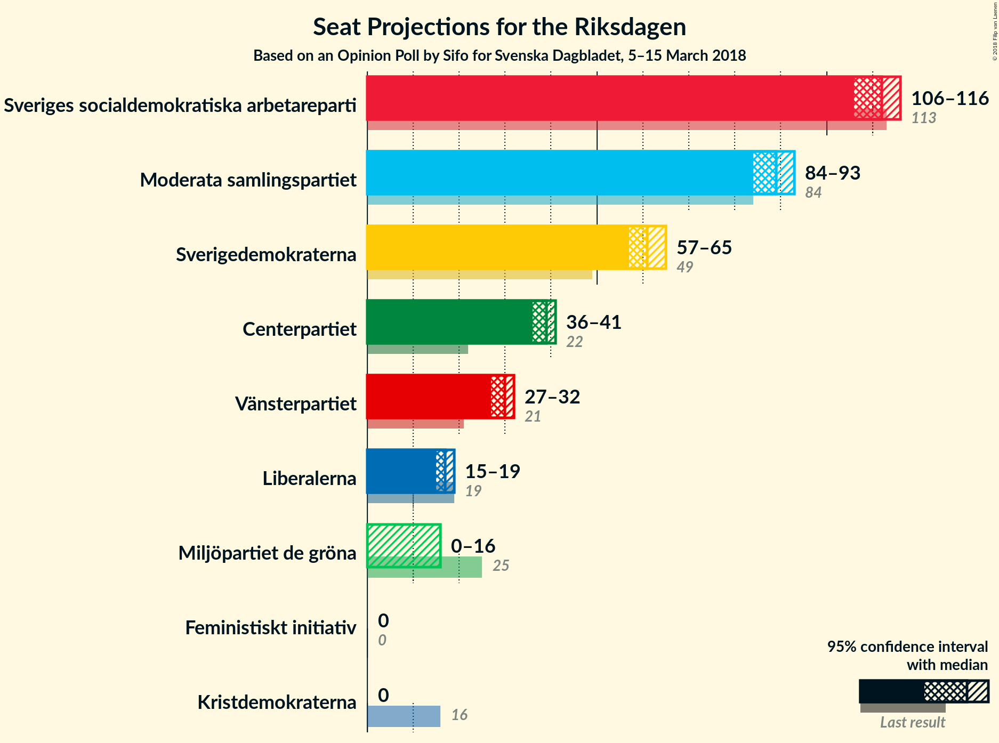

# Opinion Poll by Sifo for Svenska Dagbladet, 5–15 March 2018

<a href="#voting-intentions">Voting Intentions</a> | <a href="#seats">Seats</a> | <a href="#coalitions">Coalitions</a> | <a href="#technical-information">Technical Information</a>

## Voting Intentions

### Confidence Intervals

| Party | Last Result | Poll Result | 80% Confidence Interval | 90% Confidence Interval | 95% Confidence Interval | 99% Confidence Interval |
|:-----:|:-----------:|:-----------:|:-----------------------:|:-----------------------:|:-----------------------:|:-----------------------:|
| Sveriges socialdemokratiska arbetareparti | 31.0% | 29.0% | 28.4–29.6% |28.2–29.8% |28.1–29.9% |27.8–30.2% |
| Moderata samlingspartiet | 23.3% | 23.1% | 22.5–23.7% |22.4–23.8% |22.3–24.0% |22.0–24.2% |
| Sverigedemokraterna | 12.9% | 15.9% | 15.4–16.4% |15.3–16.5% |15.2–16.6% |15.0–16.9% |
| Centerpartiet | 6.1% | 10.0% | 9.6–10.4% |9.5–10.5% |9.4–10.6% |9.2–10.8% |
| Vänsterpartiet | 5.7% | 7.7% | 7.4–8.1% |7.3–8.2% |7.2–8.3% |7.0–8.4% |
| Liberalerna | 5.4% | 4.4% | 4.1–4.7% |4.1–4.8% |4.0–4.8% |3.9–5.0% |
| Miljöpartiet de gröna | 6.9% | 3.8% | 3.6–4.1% |3.5–4.1% |3.4–4.2% |3.3–4.3% |
| Kristdemokraterna | 4.6% | 3.0% | 2.8–3.2% |2.7–3.3% |2.7–3.4% |2.6–3.5% |
| Feministiskt initiativ | 3.1% | 1.8% | 1.6–2.0% |1.6–2.0% |1.5–2.1% |1.5–2.2% |

*Note:* The poll result column reflects the actual value used in the calculations. Published results may vary slightly, and in addition be rounded to fewer digits.

## Seats

### Confidence Intervals

| Party | Last Result | Median | 80% Confidence Interval | 90% Confidence Interval | 95% Confidence Interval | 99% Confidence Interval |
|:-----:|:-----------:|:------:|:-----------------------:|:-----------------------:|:-----------------------:|:-----------------------:|
| <a href="#sveriges-socialdemokratiska-arbetareparti">Sveriges socialdemokratiska arbetareparti</a> | 113 | 112 | 108–114 |107–115 |106–116 |105–119 |
| <a href="#moderata-samlingspartiet">Moderata samlingspartiet</a> | 84 | 89 | 85–92 |84–92 |84–93 |82–95 |
| <a href="#sverigedemokraterna">Sverigedemokraterna</a> | 49 | 61 | 58–63 |57–64 |57–65 |56–66 |
| <a href="#centerpartiet">Centerpartiet</a> | 22 | 39 | 37–40 |36–41 |36–41 |35–42 |
| <a href="#vänsterpartiet">Vänsterpartiet</a> | 21 | 30 | 28–31 |28–32 |27–32 |27–33 |
| <a href="#liberalerna">Liberalerna</a> | 19 | 17 | 16–18 |16–19 |15–19 |0–19 |
| <a href="#miljöpartiet-de-gröna">Miljöpartiet de gröna</a> | 25 | 0 | 0–15 |0–15 |0–16 |0–16 |
| <a href="#kristdemokraterna">Kristdemokraterna</a> | 16 | 0 | 0 |0 |0 |0 |
| <a href="#feministiskt-initiativ">Feministiskt initiativ</a> | 0 | 0 | 0 |0 |0 |0 |

### Sveriges socialdemokratiska arbetareparti

*For a full overview of the results for this party, see the [Sveriges socialdemokratiska arbetareparti](party-sverigessocialdemokratiskaarbetareparti.html) page.*

| Number of Seats | Probability | Accumulated | Special Marks |
|:---------------:|:-----------:|:-----------:|:-------------:|
| 103 | 0.1% | 100% |  |
| 104 | 0.2% | 99.8% |  |
| 105 | 0.7% | 99.7% |  |
| 106 | 3% | 98.9% |  |
| 107 | 2% | 96% |  |
| 108 | 7% | 94% |  |
| 109 | 7% | 86% |  |
| 110 | 9% | 79% |  |
| 111 | 14% | 70% |  |
| 112 | 30% | 56% | Median |
| 113 | 7% | 26% | Last Result |
| 114 | 10% | 20% |  |
| 115 | 6% | 10% |  |
| 116 | 2% | 4% |  |
| 117 | 0.6% | 2% |  |
| 118 | 0.6% | 1.1% |  |
| 119 | 0.3% | 0.5% |  |
| 120 | 0.1% | 0.2% |  |
| 121 | 0.1% | 0.1% |  |
| 122 | 0% | 0% |  |

### Moderata samlingspartiet

*For a full overview of the results for this party, see the [Moderata samlingspartiet](party-moderatasamlingspartiet.html) page.*

| Number of Seats | Probability | Accumulated | Special Marks |
|:---------------:|:-----------:|:-----------:|:-------------:|
| 81 | 0.1% | 100% |  |
| 82 | 1.0% | 99.9% |  |
| 83 | 1.2% | 98.9% |  |
| 84 | 4% | 98% | Last Result |
| 85 | 6% | 94% |  |
| 86 | 5% | 88% |  |
| 87 | 9% | 84% |  |
| 88 | 17% | 75% |  |
| 89 | 16% | 58% | Median |
| 90 | 21% | 42% |  |
| 91 | 10% | 21% |  |
| 92 | 9% | 12% |  |
| 93 | 2% | 3% |  |
| 94 | 0.6% | 1.2% |  |
| 95 | 0.1% | 0.5% |  |
| 96 | 0.4% | 0.4% |  |
| 97 | 0.1% | 0.1% |  |
| 98 | 0% | 0% |  |

### Sverigedemokraterna

*For a full overview of the results for this party, see the [Sverigedemokraterna](party-sverigedemokraterna.html) page.*

| Number of Seats | Probability | Accumulated | Special Marks |
|:---------------:|:-----------:|:-----------:|:-------------:|
| 49 | 0% | 100% | Last Result |
| 50 | 0% | 100% |  |
| 51 | 0% | 100% |  |
| 52 | 0% | 100% |  |
| 53 | 0% | 100% |  |
| 54 | 0% | 100% |  |
| 55 | 0.2% | 100% |  |
| 56 | 0.4% | 99.8% |  |
| 57 | 5% | 99.5% |  |
| 58 | 6% | 95% |  |
| 59 | 9% | 89% |  |
| 60 | 20% | 80% |  |
| 61 | 15% | 61% | Median |
| 62 | 27% | 46% |  |
| 63 | 10% | 19% |  |
| 64 | 5% | 8% |  |
| 65 | 3% | 4% |  |
| 66 | 0.6% | 0.7% |  |
| 67 | 0.1% | 0.1% |  |
| 68 | 0% | 0% |  |

### Centerpartiet

*For a full overview of the results for this party, see the [Centerpartiet](party-centerpartiet.html) page.*

| Number of Seats | Probability | Accumulated | Special Marks |
|:---------------:|:-----------:|:-----------:|:-------------:|
| 22 | 0% | 100% | Last Result |
| 23 | 0% | 100% |  |
| 24 | 0% | 100% |  |
| 25 | 0% | 100% |  |
| 26 | 0% | 100% |  |
| 27 | 0% | 100% |  |
| 28 | 0% | 100% |  |
| 29 | 0% | 100% |  |
| 30 | 0% | 100% |  |
| 31 | 0% | 100% |  |
| 32 | 0% | 100% |  |
| 33 | 0% | 100% |  |
| 34 | 0.1% | 100% |  |
| 35 | 1.1% | 99.8% |  |
| 36 | 5% | 98.7% |  |
| 37 | 14% | 94% |  |
| 38 | 27% | 80% |  |
| 39 | 40% | 53% | Median |
| 40 | 8% | 13% |  |
| 41 | 4% | 5% |  |
| 42 | 1.4% | 2% |  |
| 43 | 0.3% | 0.4% |  |
| 44 | 0.1% | 0.1% |  |
| 45 | 0% | 0% |  |

### Vänsterpartiet

*For a full overview of the results for this party, see the [Vänsterpartiet](party-vänsterpartiet.html) page.*

| Number of Seats | Probability | Accumulated | Special Marks |
|:---------------:|:-----------:|:-----------:|:-------------:|
| 21 | 0% | 100% | Last Result |
| 22 | 0% | 100% |  |
| 23 | 0% | 100% |  |
| 24 | 0% | 100% |  |
| 25 | 0% | 100% |  |
| 26 | 0.3% | 100% |  |
| 27 | 3% | 99.7% |  |
| 28 | 12% | 97% |  |
| 29 | 25% | 85% |  |
| 30 | 40% | 60% | Median |
| 31 | 13% | 20% |  |
| 32 | 6% | 7% |  |
| 33 | 0.9% | 0.9% |  |
| 34 | 0% | 0% |  |

### Liberalerna

*For a full overview of the results for this party, see the [Liberalerna](party-liberalerna.html) page.*

| Number of Seats | Probability | Accumulated | Special Marks |
|:---------------:|:-----------:|:-----------:|:-------------:|
| 0 | 2% | 100% |  |
| 1 | 0% | 98% |  |
| 2 | 0% | 98% |  |
| 3 | 0% | 98% |  |
| 4 | 0% | 98% |  |
| 5 | 0% | 98% |  |
| 6 | 0% | 98% |  |
| 7 | 0% | 98% |  |
| 8 | 0% | 98% |  |
| 9 | 0% | 98% |  |
| 10 | 0% | 98% |  |
| 11 | 0% | 98% |  |
| 12 | 0% | 98% |  |
| 13 | 0% | 98% |  |
| 14 | 0% | 98% |  |
| 15 | 3% | 98% |  |
| 16 | 28% | 95% |  |
| 17 | 27% | 67% | Median |
| 18 | 34% | 41% |  |
| 19 | 6% | 6% | Last Result |
| 20 | 0.1% | 0.1% |  |
| 21 | 0% | 0% |  |

### Miljöpartiet de gröna

*For a full overview of the results for this party, see the [Miljöpartiet de gröna](party-miljöpartietdegröna.html) page.*

| Number of Seats | Probability | Accumulated | Special Marks |
|:---------------:|:-----------:|:-----------:|:-------------:|
| 0 | 81% | 100% | Median |
| 1 | 0% | 19% |  |
| 2 | 0% | 19% |  |
| 3 | 0% | 19% |  |
| 4 | 0% | 19% |  |
| 5 | 0% | 19% |  |
| 6 | 0% | 19% |  |
| 7 | 0% | 19% |  |
| 8 | 0% | 19% |  |
| 9 | 0% | 19% |  |
| 10 | 0% | 19% |  |
| 11 | 0% | 19% |  |
| 12 | 0% | 19% |  |
| 13 | 0% | 19% |  |
| 14 | 0% | 19% |  |
| 15 | 14% | 19% |  |
| 16 | 5% | 5% |  |
| 17 | 0.1% | 0.1% |  |
| 18 | 0% | 0% |  |
| 19 | 0% | 0% |  |
| 20 | 0% | 0% |  |
| 21 | 0% | 0% |  |
| 22 | 0% | 0% |  |
| 23 | 0% | 0% |  |
| 24 | 0% | 0% |  |
| 25 | 0% | 0% | Last Result |

### Kristdemokraterna

*For a full overview of the results for this party, see the [Kristdemokraterna](party-kristdemokraterna.html) page.*

| Number of Seats | Probability | Accumulated | Special Marks |
|:---------------:|:-----------:|:-----------:|:-------------:|
| 0 | 100% | 100% | Median |
| 1 | 0% | 0% |  |
| 2 | 0% | 0% |  |
| 3 | 0% | 0% |  |
| 4 | 0% | 0% |  |
| 5 | 0% | 0% |  |
| 6 | 0% | 0% |  |
| 7 | 0% | 0% |  |
| 8 | 0% | 0% |  |
| 9 | 0% | 0% |  |
| 10 | 0% | 0% |  |
| 11 | 0% | 0% |  |
| 12 | 0% | 0% |  |
| 13 | 0% | 0% |  |
| 14 | 0% | 0% |  |
| 15 | 0% | 0% |  |
| 16 | 0% | 0% | Last Result |

### Feministiskt initiativ

*For a full overview of the results for this party, see the [Feministiskt initiativ](party-feministisktinitiativ.html) page.*

| Number of Seats | Probability | Accumulated | Special Marks |
|:---------------:|:-----------:|:-----------:|:-------------:|
| 0 | 100% | 100% | Last Result, Median |

## Coalitions

### Confidence Intervals

| Coalition | Last Result | Median | Majority? | 80% Confidence Interval | 90% Confidence Interval | 95% Confidence Interval | 99% Confidence Interval |
|:---------:|:-----------:|:------:|:---------:|:-----------------------:|:-----------------------:|:-----------------------:|:-----------------------:|
| Sveriges socialdemokratiska arbetareparti – Vänsterpartiet – Miljöpartiet de gröna – Feministiskt initiativ | 159 | 142 | 0% | 140–151 | 139–153 | 138–153 | 137–156 |
| Sveriges socialdemokratiska arbetareparti – Vänsterpartiet – Miljöpartiet de gröna | 159 | 142 | 0% | 140–151 | 139–153 | 138–153 | 137–156 |
| Moderata samlingspartiet – Centerpartiet – Liberalerna – Kristdemokraterna | 141 | 145 | 0% | 139–148 | 138–148 | 136–149 | 131–150 |
| Moderata samlingspartiet – Centerpartiet – Liberalerna | 125 | 145 | 0% | 139–148 | 138–148 | 136–149 | 131–150 |
| Sveriges socialdemokratiska arbetareparti – Vänsterpartiet | 134 | 142 | 0% | 136–145 | 135–145 | 135–147 | 133–151 |
| Moderata samlingspartiet – Centerpartiet – Kristdemokraterna | 122 | 127 | 0% | 123–130 | 122–132 | 121–132 | 119–137 |
| Moderata samlingspartiet – Centerpartiet | 106 | 127 | 0% | 123–130 | 122–132 | 121–132 | 119–137 |
| Sveriges socialdemokratiska arbetareparti – Miljöpartiet de gröna | 138 | 112 | 0% | 110–123 | 110–124 | 109–124 | 108–127 |

### Sveriges socialdemokratiska arbetareparti – Vänsterpartiet – Miljöpartiet de gröna – Feministiskt initiativ

| Number of Seats | Probability | Accumulated | Special Marks |
|:---------------:|:-----------:|:-----------:|:-------------:|
| 136 | 0.1% | 100% |  |
| 137 | 0.6% | 99.9% |  |
| 138 | 2% | 99.3% |  |
| 139 | 4% | 97% |  |
| 140 | 9% | 93% |  |
| 141 | 12% | 84% |  |
| 142 | 26% | 73% | Median |
| 143 | 8% | 46% |  |
| 144 | 9% | 38% |  |
| 145 | 6% | 29% |  |
| 146 | 1.4% | 23% |  |
| 147 | 2% | 22% |  |
| 148 | 0.4% | 20% |  |
| 149 | 1.1% | 19% |  |
| 150 | 3% | 18% |  |
| 151 | 7% | 15% |  |
| 152 | 3% | 8% |  |
| 153 | 4% | 6% |  |
| 154 | 0.5% | 2% |  |
| 155 | 0.3% | 1.1% |  |
| 156 | 0.4% | 0.8% |  |
| 157 | 0% | 0.5% |  |
| 158 | 0.2% | 0.4% |  |
| 159 | 0% | 0.2% | Last Result |
| 160 | 0.1% | 0.2% |  |
| 161 | 0.1% | 0.1% |  |
| 162 | 0% | 0% |  |

### Sveriges socialdemokratiska arbetareparti – Vänsterpartiet – Miljöpartiet de gröna

| Number of Seats | Probability | Accumulated | Special Marks |
|:---------------:|:-----------:|:-----------:|:-------------:|
| 136 | 0.1% | 100% |  |
| 137 | 0.6% | 99.9% |  |
| 138 | 2% | 99.3% |  |
| 139 | 4% | 97% |  |
| 140 | 9% | 93% |  |
| 141 | 12% | 84% |  |
| 142 | 26% | 73% | Median |
| 143 | 8% | 46% |  |
| 144 | 9% | 38% |  |
| 145 | 6% | 29% |  |
| 146 | 1.4% | 23% |  |
| 147 | 2% | 22% |  |
| 148 | 0.4% | 20% |  |
| 149 | 1.1% | 19% |  |
| 150 | 3% | 18% |  |
| 151 | 7% | 15% |  |
| 152 | 3% | 8% |  |
| 153 | 4% | 6% |  |
| 154 | 0.5% | 2% |  |
| 155 | 0.3% | 1.1% |  |
| 156 | 0.4% | 0.8% |  |
| 157 | 0% | 0.5% |  |
| 158 | 0.2% | 0.4% |  |
| 159 | 0% | 0.2% | Last Result |
| 160 | 0.1% | 0.2% |  |
| 161 | 0.1% | 0.1% |  |
| 162 | 0% | 0% |  |

### Moderata samlingspartiet – Centerpartiet – Liberalerna – Kristdemokraterna

| Number of Seats | Probability | Accumulated | Special Marks |
|:---------------:|:-----------:|:-----------:|:-------------:|
| 125 | 0.1% | 100% |  |
| 126 | 0% | 99.9% |  |
| 127 | 0% | 99.9% |  |
| 128 | 0% | 99.9% |  |
| 129 | 0.1% | 99.9% |  |
| 130 | 0.2% | 99.8% |  |
| 131 | 0.3% | 99.6% |  |
| 132 | 0.1% | 99.3% |  |
| 133 | 0.1% | 99.3% |  |
| 134 | 0.6% | 99.2% |  |
| 135 | 0.7% | 98.6% |  |
| 136 | 0.9% | 98% |  |
| 137 | 1.4% | 97% |  |
| 138 | 3% | 96% |  |
| 139 | 4% | 92% |  |
| 140 | 6% | 88% |  |
| 141 | 2% | 82% | Last Result |
| 142 | 4% | 79% |  |
| 143 | 8% | 75% |  |
| 144 | 11% | 67% |  |
| 145 | 21% | 56% | Median |
| 146 | 11% | 35% |  |
| 147 | 13% | 24% |  |
| 148 | 6% | 11% |  |
| 149 | 3% | 4% |  |
| 150 | 1.1% | 1.3% |  |
| 151 | 0.1% | 0.2% |  |
| 152 | 0% | 0% |  |

### Moderata samlingspartiet – Centerpartiet – Liberalerna

| Number of Seats | Probability | Accumulated | Special Marks |
|:---------------:|:-----------:|:-----------:|:-------------:|
| 125 | 0.1% | 100% | Last Result |
| 126 | 0% | 99.9% |  |
| 127 | 0% | 99.9% |  |
| 128 | 0% | 99.9% |  |
| 129 | 0.1% | 99.9% |  |
| 130 | 0.2% | 99.8% |  |
| 131 | 0.3% | 99.6% |  |
| 132 | 0.1% | 99.3% |  |
| 133 | 0.1% | 99.3% |  |
| 134 | 0.6% | 99.2% |  |
| 135 | 0.7% | 98.6% |  |
| 136 | 0.9% | 98% |  |
| 137 | 1.4% | 97% |  |
| 138 | 3% | 96% |  |
| 139 | 4% | 92% |  |
| 140 | 6% | 88% |  |
| 141 | 2% | 82% |  |
| 142 | 4% | 79% |  |
| 143 | 8% | 75% |  |
| 144 | 11% | 67% |  |
| 145 | 21% | 56% | Median |
| 146 | 11% | 35% |  |
| 147 | 13% | 24% |  |
| 148 | 6% | 11% |  |
| 149 | 3% | 4% |  |
| 150 | 1.1% | 1.3% |  |
| 151 | 0.1% | 0.2% |  |
| 152 | 0% | 0% |  |

### Sveriges socialdemokratiska arbetareparti – Vänsterpartiet

| Number of Seats | Probability | Accumulated | Special Marks |
|:---------------:|:-----------:|:-----------:|:-------------:|
| 131 | 0.1% | 100% |  |
| 132 | 0.1% | 99.9% |  |
| 133 | 0.4% | 99.8% |  |
| 134 | 1.0% | 99.4% | Last Result |
| 135 | 4% | 98% |  |
| 136 | 6% | 95% |  |
| 137 | 3% | 88% |  |
| 138 | 5% | 85% |  |
| 139 | 5% | 80% |  |
| 140 | 9% | 76% |  |
| 141 | 12% | 66% |  |
| 142 | 26% | 54% | Median |
| 143 | 8% | 28% |  |
| 144 | 9% | 20% |  |
| 145 | 6% | 11% |  |
| 146 | 1.4% | 5% |  |
| 147 | 2% | 3% |  |
| 148 | 0.2% | 1.1% |  |
| 149 | 0.2% | 0.9% |  |
| 150 | 0.2% | 0.7% |  |
| 151 | 0.4% | 0.5% |  |
| 152 | 0.1% | 0.1% |  |
| 153 | 0% | 0% |  |

### Moderata samlingspartiet – Centerpartiet – Kristdemokraterna

| Number of Seats | Probability | Accumulated | Special Marks |
|:---------------:|:-----------:|:-----------:|:-------------:|
| 118 | 0.2% | 100% |  |
| 119 | 0.5% | 99.8% |  |
| 120 | 2% | 99.3% |  |
| 121 | 2% | 98% |  |
| 122 | 4% | 96% | Last Result |
| 123 | 7% | 92% |  |
| 124 | 4% | 85% |  |
| 125 | 3% | 82% |  |
| 126 | 13% | 79% |  |
| 127 | 15% | 65% |  |
| 128 | 13% | 50% | Median |
| 129 | 18% | 37% |  |
| 130 | 11% | 19% |  |
| 131 | 3% | 8% |  |
| 132 | 4% | 5% |  |
| 133 | 0.2% | 2% |  |
| 134 | 0.6% | 1.3% |  |
| 135 | 0.1% | 0.7% |  |
| 136 | 0.1% | 0.6% |  |
| 137 | 0.2% | 0.5% |  |
| 138 | 0.3% | 0.4% |  |
| 139 | 0% | 0% |  |

### Moderata samlingspartiet – Centerpartiet

| Number of Seats | Probability | Accumulated | Special Marks |
|:---------------:|:-----------:|:-----------:|:-------------:|
| 106 | 0% | 100% | Last Result |
| 107 | 0% | 100% |  |
| 108 | 0% | 100% |  |
| 109 | 0% | 100% |  |
| 110 | 0% | 100% |  |
| 111 | 0% | 100% |  |
| 112 | 0% | 100% |  |
| 113 | 0% | 100% |  |
| 114 | 0% | 100% |  |
| 115 | 0% | 100% |  |
| 116 | 0% | 100% |  |
| 117 | 0% | 100% |  |
| 118 | 0.2% | 100% |  |
| 119 | 0.5% | 99.8% |  |
| 120 | 2% | 99.3% |  |
| 121 | 2% | 98% |  |
| 122 | 4% | 96% |  |
| 123 | 7% | 92% |  |
| 124 | 4% | 85% |  |
| 125 | 3% | 82% |  |
| 126 | 13% | 79% |  |
| 127 | 15% | 65% |  |
| 128 | 13% | 50% | Median |
| 129 | 18% | 37% |  |
| 130 | 11% | 19% |  |
| 131 | 3% | 8% |  |
| 132 | 4% | 5% |  |
| 133 | 0.2% | 2% |  |
| 134 | 0.6% | 1.3% |  |
| 135 | 0.1% | 0.7% |  |
| 136 | 0.1% | 0.6% |  |
| 137 | 0.2% | 0.5% |  |
| 138 | 0.3% | 0.4% |  |
| 139 | 0% | 0% |  |

### Sveriges socialdemokratiska arbetareparti – Miljöpartiet de gröna

| Number of Seats | Probability | Accumulated | Special Marks |
|:---------------:|:-----------:|:-----------:|:-------------:|
| 107 | 0.3% | 100% |  |
| 108 | 0.8% | 99.7% |  |
| 109 | 3% | 98.9% |  |
| 110 | 8% | 96% |  |
| 111 | 14% | 88% |  |
| 112 | 30% | 74% | Median |
| 113 | 6% | 44% |  |
| 114 | 10% | 38% |  |
| 115 | 6% | 28% |  |
| 116 | 2% | 23% |  |
| 117 | 0.6% | 20% |  |
| 118 | 0.7% | 20% |  |
| 119 | 0.4% | 19% |  |
| 120 | 0.8% | 19% |  |
| 121 | 3% | 18% |  |
| 122 | 2% | 15% |  |
| 123 | 5% | 13% |  |
| 124 | 6% | 8% |  |
| 125 | 1.4% | 2% |  |
| 126 | 0.1% | 0.9% |  |
| 127 | 0.3% | 0.8% |  |
| 128 | 0.3% | 0.5% |  |
| 129 | 0% | 0.2% |  |
| 130 | 0.1% | 0.2% |  |
| 131 | 0% | 0.1% |  |
| 132 | 0% | 0% |  |
| 133 | 0% | 0% |  |
| 134 | 0% | 0% |  |
| 135 | 0% | 0% |  |
| 136 | 0% | 0% |  |
| 137 | 0% | 0% |  |
| 138 | 0% | 0% | Last Result |

## Technical Information

### Opinion Poll

+ **Polling firm:** Sifo
+ **Commissioner(s):** Svenska Dagbladet
+ **Fieldwork period:** 5–15 March 2018

### Calculations

+ **Sample size:** 9724
+ **Simulations done:** 1,048,576
+ **Error estimate:** 0.27%

