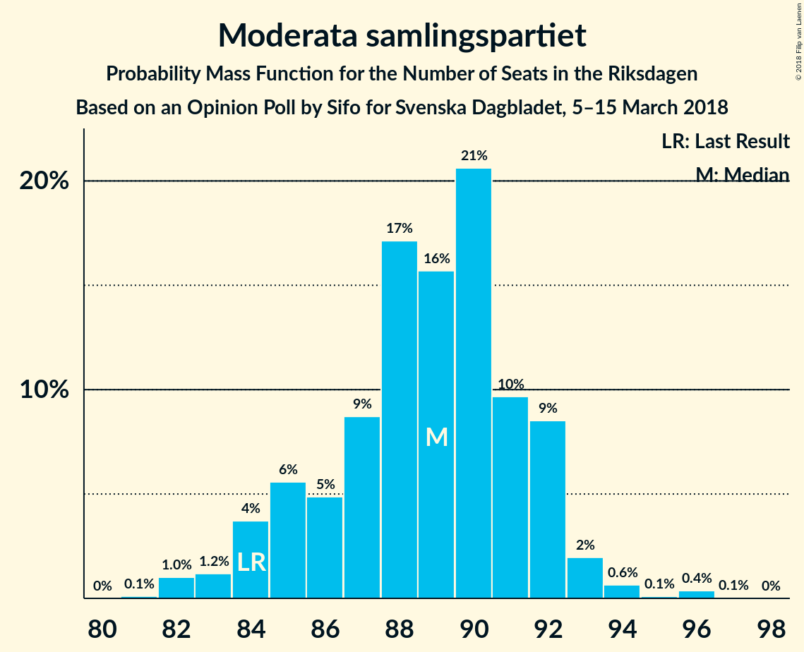
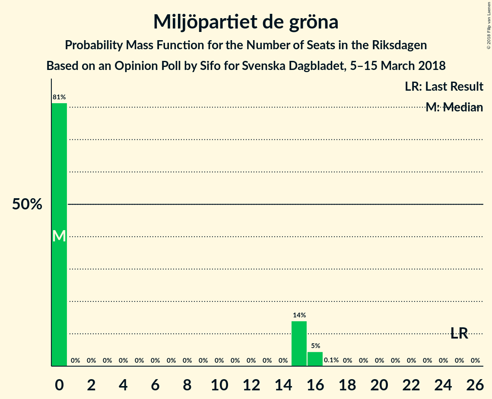
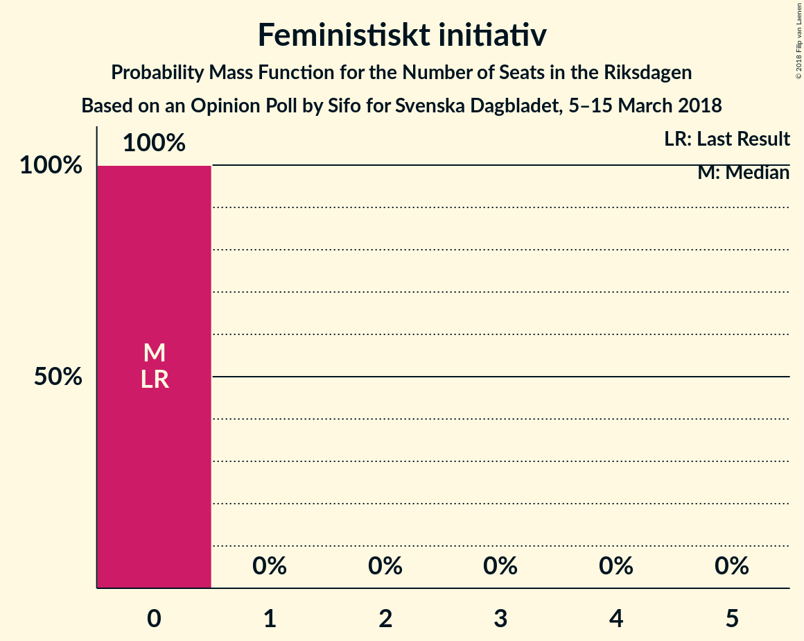

# Opinion Poll by Sifo for Svenska Dagbladet, 5–15 March 2018

<a href="#voting-intentions">Voting Intentions</a> | <a href="#seats">Seats</a> | <a href="#coalitions">Coalitions</a> | <a href="#technical-information">Technical Information</a>

## Voting Intentions

### Confidence Intervals

| Party | Last Result | Poll Result | 80% Confidence Interval | 90% Confidence Interval | 95% Confidence Interval | 99% Confidence Interval |
|:-----:|:-----------:|:-----------:|:-----------------------:|:-----------------------:|:-----------------------:|:-----------------------:|
| Sveriges socialdemokratiska arbetareparti | 31.0% | 29.0% | 28.4–29.6% |28.2–29.8% |28.1–29.9% |27.8–30.2% |
| Moderata samlingspartiet | 23.3% | 23.1% | 22.5–23.7% |22.4–23.8% |22.3–24.0% |22.0–24.2% |
| Sverigedemokraterna | 12.9% | 15.9% | 15.4–16.4% |15.3–16.5% |15.2–16.6% |15.0–16.9% |
| Centerpartiet | 6.1% | 10.0% | 9.6–10.4% |9.5–10.5% |9.4–10.6% |9.2–10.8% |
| Vänsterpartiet | 5.7% | 7.7% | 7.4–8.1% |7.3–8.2% |7.2–8.3% |7.0–8.4% |
| Liberalerna | 5.4% | 4.4% | 4.1–4.7% |4.1–4.8% |4.0–4.8% |3.9–5.0% |
| Miljöpartiet de gröna | 6.9% | 3.8% | 3.6–4.1% |3.5–4.1% |3.4–4.2% |3.3–4.3% |
| Kristdemokraterna | 4.6% | 3.0% | 2.8–3.2% |2.7–3.3% |2.7–3.4% |2.6–3.5% |
| Feministiskt initiativ | 3.1% | 1.8% | 1.6–2.0% |1.6–2.0% |1.5–2.1% |1.5–2.2% |

*Note:* The poll result column reflects the actual value used in the calculations. Published results may vary slightly, and in addition be rounded to fewer digits.

## Seats

### Confidence Intervals

| Party | Last Result | Median | 80% Confidence Interval | 90% Confidence Interval | 95% Confidence Interval | 99% Confidence Interval |
|:-----:|:-----------:|:------:|:-----------------------:|:-----------------------:|:-----------------------:|:-----------------------:|
| <a href="#sveriges-socialdemokratiska-arbetareparti">Sveriges socialdemokratiska arbetareparti</a> | 113 | 112 | 111–115 |105–115 |105–115 |105–115 |
| <a href="#moderata-samlingspartiet">Moderata samlingspartiet</a> | 84 | 87 | 84–91 |84–91 |84–91 |82–91 |
| <a href="#sverigedemokraterna">Sverigedemokraterna</a> | 49 | 61 | 57–62 |57–62 |57–62 |57–62 |
| <a href="#centerpartiet">Centerpartiet</a> | 22 | 38 | 35–38 |35–39 |35–39 |35–39 |
| <a href="#vänsterpartiet">Vänsterpartiet</a> | 21 | 31 | 29–33 |29–33 |29–33 |29–33 |
| <a href="#liberalerna">Liberalerna</a> | 19 | 16 | 15–17 |15–17 |15–17 |15–18 |
| <a href="#miljöpartiet-de-gröna">Miljöpartiet de gröna</a> | 25 | 0 | 0–16 |0–17 |0–17 |0–17 |
| <a href="#kristdemokraterna">Kristdemokraterna</a> | 16 | 0 | 0 |0 |0 |0 |
| <a href="#feministiskt-initiativ">Feministiskt initiativ</a> | 0 | 0 | 0 |0 |0 |0 |

### Sveriges socialdemokratiska arbetareparti

*For a full overview of the results for this party, see the [Sveriges socialdemokratiska arbetareparti](party-sverigessocialdemokratiskaarbetareparti.html) page.*

| Number of Seats | Probability | Accumulated | Special Marks |
|:---------------:|:-----------:|:-----------:|:-------------:|
| 105 | 7% | 100% |  |
| 106 | 0.3% | 93% |  |
| 107 | 0% | 93% |  |
| 108 | 0% | 93% |  |
| 109 | 0% | 93% |  |
| 110 | 0% | 93% |  |
| 111 | 32% | 93% |  |
| 112 | 17% | 61% | Median |
| 113 | 0% | 44% | Last Result |
| 114 | 0% | 44% |  |
| 115 | 44% | 44% |  |
| 116 | 0.1% | 0.1% |  |
| 117 | 0% | 0.1% |  |
| 118 | 0% | 0% |  |

### Moderata samlingspartiet

*For a full overview of the results for this party, see the [Moderata samlingspartiet](party-moderatasamlingspartiet.html) page.*

| Number of Seats | Probability | Accumulated | Special Marks |
|:---------------:|:-----------:|:-----------:|:-------------:|
| 81 | 0.2% | 100% |  |
| 82 | 0.5% | 99.8% |  |
| 83 | 0.1% | 99.3% |  |
| 84 | 31% | 99.2% | Last Result |
| 85 | 7% | 68% |  |
| 86 | 0% | 61% |  |
| 87 | 44% | 61% | Median |
| 88 | 0% | 17% |  |
| 89 | 0% | 17% |  |
| 90 | 0% | 17% |  |
| 91 | 17% | 17% |  |
| 92 | 0% | 0.1% |  |
| 93 | 0% | 0.1% |  |
| 94 | 0% | 0.1% |  |
| 95 | 0.1% | 0.1% |  |
| 96 | 0% | 0% |  |

### Sverigedemokraterna

*For a full overview of the results for this party, see the [Sverigedemokraterna](party-sverigedemokraterna.html) page.*

| Number of Seats | Probability | Accumulated | Special Marks |
|:---------------:|:-----------:|:-----------:|:-------------:|
| 49 | 0% | 100% | Last Result |
| 50 | 0% | 100% |  |
| 51 | 0% | 100% |  |
| 52 | 0% | 100% |  |
| 53 | 0% | 100% |  |
| 54 | 0% | 100% |  |
| 55 | 0% | 100% |  |
| 56 | 0% | 100% |  |
| 57 | 38% | 100% |  |
| 58 | 0% | 62% |  |
| 59 | 0% | 62% |  |
| 60 | 0.3% | 62% |  |
| 61 | 17% | 61% | Median |
| 62 | 44% | 44% |  |
| 63 | 0% | 0.1% |  |
| 64 | 0% | 0.1% |  |
| 65 | 0% | 0.1% |  |
| 66 | 0.1% | 0.1% |  |
| 67 | 0% | 0% |  |

### Centerpartiet

*For a full overview of the results for this party, see the [Centerpartiet](party-centerpartiet.html) page.*

| Number of Seats | Probability | Accumulated | Special Marks |
|:---------------:|:-----------:|:-----------:|:-------------:|
| 22 | 0% | 100% | Last Result |
| 23 | 0% | 100% |  |
| 24 | 0% | 100% |  |
| 25 | 0% | 100% |  |
| 26 | 0% | 100% |  |
| 27 | 0% | 100% |  |
| 28 | 0% | 100% |  |
| 29 | 0% | 100% |  |
| 30 | 0% | 100% |  |
| 31 | 0% | 100% |  |
| 32 | 0% | 100% |  |
| 33 | 0% | 100% |  |
| 34 | 0% | 100% |  |
| 35 | 17% | 100% |  |
| 36 | 0% | 83% |  |
| 37 | 31% | 83% |  |
| 38 | 44% | 51% | Median |
| 39 | 7% | 7% |  |
| 40 | 0.1% | 0.1% |  |
| 41 | 0% | 0% |  |

### Vänsterpartiet

*For a full overview of the results for this party, see the [Vänsterpartiet](party-vänsterpartiet.html) page.*

| Number of Seats | Probability | Accumulated | Special Marks |
|:---------------:|:-----------:|:-----------:|:-------------:|
| 21 | 0% | 100% | Last Result |
| 22 | 0% | 100% |  |
| 23 | 0% | 100% |  |
| 24 | 0% | 100% |  |
| 25 | 0% | 100% |  |
| 26 | 0% | 100% |  |
| 27 | 0% | 100% |  |
| 28 | 0% | 100% |  |
| 29 | 38% | 100% |  |
| 30 | 0% | 62% |  |
| 31 | 45% | 62% | Median |
| 32 | 0% | 17% |  |
| 33 | 17% | 17% |  |
| 34 | 0% | 0% |  |

### Liberalerna

*For a full overview of the results for this party, see the [Liberalerna](party-liberalerna.html) page.*

| Number of Seats | Probability | Accumulated | Special Marks |
|:---------------:|:-----------:|:-----------:|:-------------:|
| 0 | 0.1% | 100% |  |
| 1 | 0% | 99.9% |  |
| 2 | 0% | 99.9% |  |
| 3 | 0% | 99.9% |  |
| 4 | 0% | 99.9% |  |
| 5 | 0% | 99.9% |  |
| 6 | 0% | 99.9% |  |
| 7 | 0% | 99.9% |  |
| 8 | 0% | 99.9% |  |
| 9 | 0% | 99.9% |  |
| 10 | 0% | 99.9% |  |
| 11 | 0% | 99.9% |  |
| 12 | 0% | 99.9% |  |
| 13 | 0% | 99.9% |  |
| 14 | 0% | 99.9% |  |
| 15 | 31% | 99.9% |  |
| 16 | 44% | 69% | Median |
| 17 | 24% | 24% |  |
| 18 | 0.7% | 0.7% |  |
| 19 | 0% | 0% | Last Result |

### Miljöpartiet de gröna

*For a full overview of the results for this party, see the [Miljöpartiet de gröna](party-miljöpartietdegröna.html) page.*

| Number of Seats | Probability | Accumulated | Special Marks |
|:---------------:|:-----------:|:-----------:|:-------------:|
| 0 | 61% | 100% | Median |
| 1 | 0% | 39% |  |
| 2 | 0% | 39% |  |
| 3 | 0% | 39% |  |
| 4 | 0% | 39% |  |
| 5 | 0% | 39% |  |
| 6 | 0% | 39% |  |
| 7 | 0% | 39% |  |
| 8 | 0% | 39% |  |
| 9 | 0% | 39% |  |
| 10 | 0% | 39% |  |
| 11 | 0% | 39% |  |
| 12 | 0% | 39% |  |
| 13 | 0% | 39% |  |
| 14 | 0% | 39% |  |
| 15 | 0.5% | 39% |  |
| 16 | 31% | 38% |  |
| 17 | 7% | 7% |  |
| 18 | 0% | 0% |  |
| 19 | 0% | 0% |  |
| 20 | 0% | 0% |  |
| 21 | 0% | 0% |  |
| 22 | 0% | 0% |  |
| 23 | 0% | 0% |  |
| 24 | 0% | 0% |  |
| 25 | 0% | 0% | Last Result |

### Kristdemokraterna

*For a full overview of the results for this party, see the [Kristdemokraterna](party-kristdemokraterna.html) page.*

| Number of Seats | Probability | Accumulated | Special Marks |
|:---------------:|:-----------:|:-----------:|:-------------:|
| 0 | 100% | 100% | Median |
| 1 | 0% | 0% |  |
| 2 | 0% | 0% |  |
| 3 | 0% | 0% |  |
| 4 | 0% | 0% |  |
| 5 | 0% | 0% |  |
| 6 | 0% | 0% |  |
| 7 | 0% | 0% |  |
| 8 | 0% | 0% |  |
| 9 | 0% | 0% |  |
| 10 | 0% | 0% |  |
| 11 | 0% | 0% |  |
| 12 | 0% | 0% |  |
| 13 | 0% | 0% |  |
| 14 | 0% | 0% |  |
| 15 | 0% | 0% |  |
| 16 | 0% | 0% | Last Result |

### Feministiskt initiativ

*For a full overview of the results for this party, see the [Feministiskt initiativ](party-feministisktinitiativ.html) page.*

| Number of Seats | Probability | Accumulated | Special Marks |
|:---------------:|:-----------:|:-----------:|:-------------:|
| 0 | 100% | 100% | Last Result, Median |

## Coalitions

### Confidence Intervals

| Coalition | Last Result | Median | Majority? | 80% Confidence Interval | 90% Confidence Interval | 95% Confidence Interval | 99% Confidence Interval |
|:---------:|:-----------:|:------:|:---------:|:-----------------------:|:-----------------------:|:-----------------------:|:-----------------------:|
| Sveriges socialdemokratiska arbetareparti – Vänsterpartiet – Miljöpartiet de gröna – Feministiskt initiativ | 159 | 146 | 0% | 145–156 | 145–156 | 145–156 | 145–156 |
| Sveriges socialdemokratiska arbetareparti – Vänsterpartiet – Miljöpartiet de gröna | 159 | 146 | 0% | 145–156 | 145–156 | 145–156 | 145–156 |
| Sveriges socialdemokratiska arbetareparti – Vänsterpartiet | 134 | 145 | 0% | 140–146 | 134–146 | 134–146 | 134–146 |
| Moderata samlingspartiet – Centerpartiet – Liberalerna – Kristdemokraterna | 141 | 141 | 0% | 136–143 | 136–143 | 136–143 | 135–143 |
| Moderata samlingspartiet – Centerpartiet – Liberalerna | 125 | 141 | 0% | 136–143 | 136–143 | 136–143 | 135–143 |
| Moderata samlingspartiet – Centerpartiet – Kristdemokraterna | 122 | 125 | 0% | 121–126 | 121–126 | 121–126 | 118–126 |
| Moderata samlingspartiet – Centerpartiet | 106 | 125 | 0% | 121–126 | 121–126 | 121–126 | 118–126 |

### Sveriges socialdemokratiska arbetareparti – Vänsterpartiet – Miljöpartiet de gröna – Feministiskt initiativ

| Number of Seats | Probability | Accumulated | Special Marks |
|:---------------:|:-----------:|:-----------:|:-------------:|
| 144 | 0% | 100% |  |
| 145 | 17% | 99.9% |  |
| 146 | 44% | 83% |  |
| 147 | 0% | 39% |  |
| 148 | 0% | 39% |  |
| 149 | 0.1% | 39% |  |
| 150 | 0% | 39% |  |
| 151 | 7% | 39% |  |
| 152 | 0% | 32% |  |
| 153 | 0.2% | 32% |  |
| 154 | 0% | 32% |  |
| 155 | 0% | 32% |  |
| 156 | 31% | 32% |  |
| 157 | 0.5% | 0.5% |  |
| 158 | 0% | 0% |  |
| 159 | 0% | 0% | Last Result |

### Sveriges socialdemokratiska arbetareparti – Vänsterpartiet – Miljöpartiet de gröna

| Number of Seats | Probability | Accumulated | Special Marks |
|:---------------:|:-----------:|:-----------:|:-------------:|
| 144 | 0% | 100% |  |
| 145 | 17% | 99.9% |  |
| 146 | 44% | 83% |  |
| 147 | 0% | 39% |  |
| 148 | 0% | 39% |  |
| 149 | 0.1% | 39% |  |
| 150 | 0% | 39% |  |
| 151 | 7% | 39% |  |
| 152 | 0% | 32% |  |
| 153 | 0.2% | 32% |  |
| 154 | 0% | 32% |  |
| 155 | 0% | 32% |  |
| 156 | 31% | 32% |  |
| 157 | 0.5% | 0.5% |  |
| 158 | 0% | 0% |  |
| 159 | 0% | 0% | Last Result |

### Sveriges socialdemokratiska arbetareparti – Vänsterpartiet

| Number of Seats | Probability | Accumulated | Special Marks |
|:---------------:|:-----------:|:-----------:|:-------------:|
| 134 | 7% | 100% | Last Result |
| 135 | 0.1% | 93% |  |
| 136 | 0% | 93% |  |
| 137 | 0.2% | 93% |  |
| 138 | 0% | 93% |  |
| 139 | 0% | 93% |  |
| 140 | 31% | 93% |  |
| 141 | 0% | 62% |  |
| 142 | 0.5% | 62% |  |
| 143 | 0% | 61% | Median |
| 144 | 0% | 61% |  |
| 145 | 17% | 61% |  |
| 146 | 44% | 44% |  |
| 147 | 0% | 0.1% |  |
| 148 | 0% | 0.1% |  |
| 149 | 0.1% | 0.1% |  |
| 150 | 0% | 0% |  |

### Moderata samlingspartiet – Centerpartiet – Liberalerna – Kristdemokraterna

| Number of Seats | Probability | Accumulated | Special Marks |
|:---------------:|:-----------:|:-----------:|:-------------:|
| 134 | 0.1% | 100% |  |
| 135 | 0.5% | 99.9% |  |
| 136 | 31% | 99.5% |  |
| 137 | 0% | 68% |  |
| 138 | 0.1% | 68% |  |
| 139 | 0% | 68% |  |
| 140 | 0% | 68% |  |
| 141 | 51% | 68% | Last Result, Median |
| 142 | 0% | 17% |  |
| 143 | 17% | 17% |  |
| 144 | 0% | 0.1% |  |
| 145 | 0% | 0.1% |  |
| 146 | 0% | 0.1% |  |
| 147 | 0% | 0.1% |  |
| 148 | 0% | 0.1% |  |
| 149 | 0% | 0% |  |

### Moderata samlingspartiet – Centerpartiet – Liberalerna

| Number of Seats | Probability | Accumulated | Special Marks |
|:---------------:|:-----------:|:-----------:|:-------------:|
| 125 | 0% | 100% | Last Result |
| 126 | 0% | 100% |  |
| 127 | 0% | 100% |  |
| 128 | 0% | 100% |  |
| 129 | 0% | 100% |  |
| 130 | 0% | 100% |  |
| 131 | 0% | 100% |  |
| 132 | 0% | 100% |  |
| 133 | 0% | 100% |  |
| 134 | 0.1% | 100% |  |
| 135 | 0.5% | 99.9% |  |
| 136 | 31% | 99.5% |  |
| 137 | 0% | 68% |  |
| 138 | 0.1% | 68% |  |
| 139 | 0% | 68% |  |
| 140 | 0% | 68% |  |
| 141 | 51% | 68% | Median |
| 142 | 0% | 17% |  |
| 143 | 17% | 17% |  |
| 144 | 0% | 0.1% |  |
| 145 | 0% | 0.1% |  |
| 146 | 0% | 0.1% |  |
| 147 | 0% | 0.1% |  |
| 148 | 0% | 0.1% |  |
| 149 | 0% | 0% |  |

### Moderata samlingspartiet – Centerpartiet – Kristdemokraterna

| Number of Seats | Probability | Accumulated | Special Marks |
|:---------------:|:-----------:|:-----------:|:-------------:|
| 117 | 0.5% | 100% |  |
| 118 | 0.2% | 99.5% |  |
| 119 | 0% | 99.3% |  |
| 120 | 0% | 99.3% |  |
| 121 | 31% | 99.3% |  |
| 122 | 0% | 68% | Last Result |
| 123 | 0.1% | 68% |  |
| 124 | 7% | 68% |  |
| 125 | 44% | 61% | Median |
| 126 | 17% | 17% |  |
| 127 | 0% | 0.1% |  |
| 128 | 0% | 0.1% |  |
| 129 | 0% | 0.1% |  |
| 130 | 0% | 0.1% |  |
| 131 | 0% | 0.1% |  |
| 132 | 0% | 0.1% |  |
| 133 | 0% | 0.1% |  |
| 134 | 0.1% | 0.1% |  |
| 135 | 0% | 0% |  |

### Moderata samlingspartiet – Centerpartiet

| Number of Seats | Probability | Accumulated | Special Marks |
|:---------------:|:-----------:|:-----------:|:-------------:|
| 106 | 0% | 100% | Last Result |
| 107 | 0% | 100% |  |
| 108 | 0% | 100% |  |
| 109 | 0% | 100% |  |
| 110 | 0% | 100% |  |
| 111 | 0% | 100% |  |
| 112 | 0% | 100% |  |
| 113 | 0% | 100% |  |
| 114 | 0% | 100% |  |
| 115 | 0% | 100% |  |
| 116 | 0% | 100% |  |
| 117 | 0.5% | 100% |  |
| 118 | 0.2% | 99.5% |  |
| 119 | 0% | 99.3% |  |
| 120 | 0% | 99.3% |  |
| 121 | 31% | 99.3% |  |
| 122 | 0% | 68% |  |
| 123 | 0.1% | 68% |  |
| 124 | 7% | 68% |  |
| 125 | 44% | 61% | Median |
| 126 | 17% | 17% |  |
| 127 | 0% | 0.1% |  |
| 128 | 0% | 0.1% |  |
| 129 | 0% | 0.1% |  |
| 130 | 0% | 0.1% |  |
| 131 | 0% | 0.1% |  |
| 132 | 0% | 0.1% |  |
| 133 | 0% | 0.1% |  |
| 134 | 0.1% | 0.1% |  |
| 135 | 0% | 0% |  |

## Technical Information

### Opinion Poll

+ **Polling firm:** Sifo
+ **Commissioner(s):** Svenska Dagbladet
+ **Fieldwork period:** 5–15 March 2018

### Calculations

+ **Sample size:** 9724
+ **Simulations done:** 1,024
+ **Error estimate:** 1.23%

