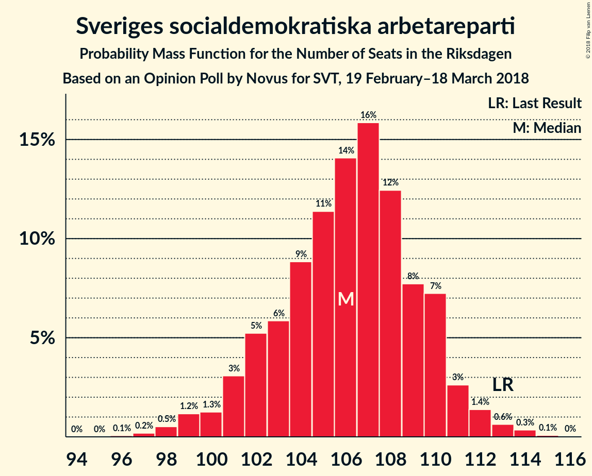
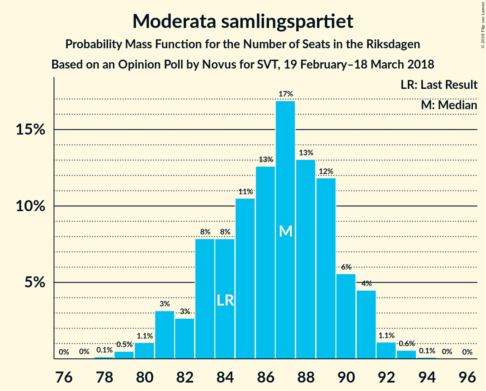

# Opinion Poll by Novus for SVT, 19 February–18 March 2018

<a href="#voting-intentions">Voting Intentions</a> | <a href="#seats">Seats</a> | <a href="#coalitions">Coalitions</a> | <a href="#technical-information">Technical Information</a>

## Voting Intentions

### Confidence Intervals

| Party | Last Result | Poll Result | 80% Confidence Interval | 90% Confidence Interval | 95% Confidence Interval | 99% Confidence Interval |
|:-----:|:-----------:|:-----------:|:-----------------------:|:-----------------------:|:-----------------------:|:-----------------------:|
| Sveriges socialdemokratiska arbetareparti | 31.0% | 27.8% | 27.0–28.6% |26.8–28.8% |26.6–29.0% |26.2–29.4% |
| Moderata samlingspartiet | 23.3% | 22.6% | 21.9–23.3% |21.7–23.5% |21.5–23.7% |21.2–24.1% |
| Sverigedemokraterna | 12.9% | 17.8% | 17.1–18.5% |17.0–18.7% |16.8–18.9% |16.5–19.2% |
| Centerpartiet | 6.1% | 9.3% | 8.8–9.8% |8.7–10.0% |8.6–10.1% |8.3–10.4% |
| Vänsterpartiet | 5.7% | 7.8% | 7.3–8.3% |7.2–8.4% |7.1–8.6% |6.9–8.8% |
| Liberalerna | 5.4% | 5.0% | 4.6–5.4% |4.5–5.5% |4.4–5.6% |4.3–5.8% |
| Miljöpartiet de gröna | 6.9% | 3.8% | 3.5–4.2% |3.4–4.3% |3.3–4.3% |3.2–4.5% |
| Kristdemokraterna | 4.6% | 3.2% | 2.9–3.5% |2.8–3.6% |2.8–3.7% |2.6–3.9% |

*Note:* The poll result column reflects the actual value used in the calculations. Published results may vary slightly, and in addition be rounded to fewer digits.

## Seats

### Confidence Intervals

| Party | Last Result | Median | 80% Confidence Interval | 90% Confidence Interval | 95% Confidence Interval | 99% Confidence Interval |
|:-----:|:-----------:|:------:|:-----------------------:|:-----------------------:|:-----------------------:|:-----------------------:|
| <a href="#sveriges-socialdemokratiska-arbetareparti">Sveriges socialdemokratiska arbetareparti</a> | 113 | 102 | 102–108 |102–108 |102–108 |102–108 |
| <a href="#moderata-samlingspartiet">Moderata samlingspartiet</a> | 84 | 84 | 84–90 |84–90 |84–90 |84–90 |
| <a href="#sverigedemokraterna">Sverigedemokraterna</a> | 49 | 66 | 66–68 |66–68 |66–68 |66–68 |
| <a href="#centerpartiet">Centerpartiet</a> | 22 | 33 | 33–34 |33–34 |33–34 |33–34 |
| <a href="#vänsterpartiet">Vänsterpartiet</a> | 21 | 32 | 31–32 |31–32 |31–32 |31–32 |
| <a href="#liberalerna">Liberalerna</a> | 19 | 17 | 17–18 |17–18 |17–18 |17–18 |
| <a href="#miljöpartiet-de-gröna">Miljöpartiet de gröna</a> | 25 | 15 | 0–15 |0–15 |0–15 |0–15 |
| <a href="#kristdemokraterna">Kristdemokraterna</a> | 16 | 0 | 0 |0 |0 |0 |

### Sveriges socialdemokratiska arbetareparti

*For a full overview of the results for this party, see the [Sveriges socialdemokratiska arbetareparti](party-sverigessocialdemokratiskaarbetareparti.html) page.*

| Number of Seats | Probability | Accumulated | Special Marks |
|:---------------:|:-----------:|:-----------:|:-------------:|
| 100 | 0% | 100% |  |
| 101 | 0% | 99.9% |  |
| 102 | 55% | 99.9% | Median |
| 103 | 0% | 45% |  |
| 104 | 0% | 45% |  |
| 105 | 0.1% | 45% |  |
| 106 | 0.1% | 45% |  |
| 107 | 0% | 45% |  |
| 108 | 45% | 45% |  |
| 109 | 0% | 0% |  |
| 110 | 0% | 0% |  |
| 111 | 0% | 0% |  |
| 112 | 0% | 0% |  |
| 113 | 0% | 0% | Last Result |

### Moderata samlingspartiet

*For a full overview of the results for this party, see the [Moderata samlingspartiet](party-moderatasamlingspartiet.html) page.*

| Number of Seats | Probability | Accumulated | Special Marks |
|:---------------:|:-----------:|:-----------:|:-------------:|
| 81 | 0% | 100% |  |
| 82 | 0% | 99.9% |  |
| 83 | 0% | 99.9% |  |
| 84 | 55% | 99.9% | Last Result, Median |
| 85 | 0.1% | 45% |  |
| 86 | 0% | 45% |  |
| 87 | 0% | 45% |  |
| 88 | 0% | 45% |  |
| 89 | 0% | 45% |  |
| 90 | 45% | 45% |  |
| 91 | 0% | 0.1% |  |
| 92 | 0% | 0.1% |  |
| 93 | 0.1% | 0.1% |  |
| 94 | 0% | 0% |  |

### Sverigedemokraterna

*For a full overview of the results for this party, see the [Sverigedemokraterna](party-sverigedemokraterna.html) page.*

| Number of Seats | Probability | Accumulated | Special Marks |
|:---------------:|:-----------:|:-----------:|:-------------:|
| 49 | 0% | 100% | Last Result |
| 50 | 0% | 100% |  |
| 51 | 0% | 100% |  |
| 52 | 0% | 100% |  |
| 53 | 0% | 100% |  |
| 54 | 0% | 100% |  |
| 55 | 0% | 100% |  |
| 56 | 0% | 100% |  |
| 57 | 0% | 100% |  |
| 58 | 0% | 100% |  |
| 59 | 0% | 100% |  |
| 60 | 0% | 100% |  |
| 61 | 0% | 100% |  |
| 62 | 0% | 100% |  |
| 63 | 0% | 100% |  |
| 64 | 0% | 100% |  |
| 65 | 0% | 100% |  |
| 66 | 55% | 100% | Median |
| 67 | 0% | 45% |  |
| 68 | 45% | 45% |  |
| 69 | 0% | 0.1% |  |
| 70 | 0.1% | 0.1% |  |
| 71 | 0% | 0% |  |

### Centerpartiet

*For a full overview of the results for this party, see the [Centerpartiet](party-centerpartiet.html) page.*

| Number of Seats | Probability | Accumulated | Special Marks |
|:---------------:|:-----------:|:-----------:|:-------------:|
| 22 | 0% | 100% | Last Result |
| 23 | 0% | 100% |  |
| 24 | 0% | 100% |  |
| 25 | 0% | 100% |  |
| 26 | 0% | 100% |  |
| 27 | 0% | 100% |  |
| 28 | 0% | 100% |  |
| 29 | 0% | 100% |  |
| 30 | 0.1% | 100% |  |
| 31 | 0% | 99.9% |  |
| 32 | 0% | 99.9% |  |
| 33 | 55% | 99.9% | Median |
| 34 | 45% | 45% |  |
| 35 | 0% | 0.2% |  |
| 36 | 0% | 0.2% |  |
| 37 | 0% | 0.1% |  |
| 38 | 0.1% | 0.1% |  |
| 39 | 0% | 0% |  |

### Vänsterpartiet

*For a full overview of the results for this party, see the [Vänsterpartiet](party-vänsterpartiet.html) page.*

| Number of Seats | Probability | Accumulated | Special Marks |
|:---------------:|:-----------:|:-----------:|:-------------:|
| 21 | 0% | 100% | Last Result |
| 22 | 0% | 100% |  |
| 23 | 0% | 100% |  |
| 24 | 0% | 100% |  |
| 25 | 0% | 100% |  |
| 26 | 0% | 100% |  |
| 27 | 0% | 100% |  |
| 28 | 0% | 100% |  |
| 29 | 0.1% | 100% |  |
| 30 | 0% | 99.9% |  |
| 31 | 45% | 99.9% |  |
| 32 | 55% | 55% | Median |
| 33 | 0.1% | 0.1% |  |
| 34 | 0% | 0% |  |

### Liberalerna

*For a full overview of the results for this party, see the [Liberalerna](party-liberalerna.html) page.*

| Number of Seats | Probability | Accumulated | Special Marks |
|:---------------:|:-----------:|:-----------:|:-------------:|
| 17 | 55% | 100% | Median |
| 18 | 45% | 45% |  |
| 19 | 0.1% | 0.2% | Last Result |
| 20 | 0% | 0.1% |  |
| 21 | 0.1% | 0.1% |  |
| 22 | 0% | 0% |  |

### Miljöpartiet de gröna

*For a full overview of the results for this party, see the [Miljöpartiet de gröna](party-miljöpartietdegröna.html) page.*

| Number of Seats | Probability | Accumulated | Special Marks |
|:---------------:|:-----------:|:-----------:|:-------------:|
| 0 | 45% | 100% |  |
| 1 | 0% | 55% |  |
| 2 | 0% | 55% |  |
| 3 | 0% | 55% |  |
| 4 | 0% | 55% |  |
| 5 | 0% | 55% |  |
| 6 | 0% | 55% |  |
| 7 | 0% | 55% |  |
| 8 | 0% | 55% |  |
| 9 | 0% | 55% |  |
| 10 | 0% | 55% |  |
| 11 | 0% | 55% |  |
| 12 | 0% | 55% |  |
| 13 | 0% | 55% |  |
| 14 | 0% | 55% |  |
| 15 | 55% | 55% | Median |
| 16 | 0.1% | 0.1% |  |
| 17 | 0% | 0% |  |
| 18 | 0% | 0% |  |
| 19 | 0% | 0% |  |
| 20 | 0% | 0% |  |
| 21 | 0% | 0% |  |
| 22 | 0% | 0% |  |
| 23 | 0% | 0% |  |
| 24 | 0% | 0% |  |
| 25 | 0% | 0% | Last Result |

### Kristdemokraterna

*For a full overview of the results for this party, see the [Kristdemokraterna](party-kristdemokraterna.html) page.*

| Number of Seats | Probability | Accumulated | Special Marks |
|:---------------:|:-----------:|:-----------:|:-------------:|
| 0 | 100% | 100% | Median |
| 1 | 0% | 0% |  |
| 2 | 0% | 0% |  |
| 3 | 0% | 0% |  |
| 4 | 0% | 0% |  |
| 5 | 0% | 0% |  |
| 6 | 0% | 0% |  |
| 7 | 0% | 0% |  |
| 8 | 0% | 0% |  |
| 9 | 0% | 0% |  |
| 10 | 0% | 0% |  |
| 11 | 0% | 0% |  |
| 12 | 0% | 0% |  |
| 13 | 0% | 0% |  |
| 14 | 0% | 0% |  |
| 15 | 0% | 0% |  |
| 16 | 0% | 0% | Last Result |

## Coalitions

### Confidence Intervals

| Coalition | Last Result | Median | Majority? | 80% Confidence Interval | 90% Confidence Interval | 95% Confidence Interval | 99% Confidence Interval |
|:---------:|:-----------:|:------:|:---------:|:-----------------------:|:-----------------------:|:-----------------------:|:-----------------------:|
| Sveriges socialdemokratiska arbetareparti – Vänsterpartiet – Miljöpartiet de gröna | 159 | 149 | 0% | 139–149 | 139–149 | 139–149 | 139–149 |
| Moderata samlingspartiet – Centerpartiet – Liberalerna – Kristdemokraterna | 141 | 134 | 0% | 134–142 | 134–142 | 134–142 | 134–142 |
| Moderata samlingspartiet – Centerpartiet – Liberalerna | 125 | 134 | 0% | 134–142 | 134–142 | 134–142 | 134–142 |
| Sveriges socialdemokratiska arbetareparti – Vänsterpartiet | 134 | 134 | 0% | 134–139 | 134–139 | 134–139 | 134–139 |
| Moderata samlingspartiet – Centerpartiet – Kristdemokraterna | 122 | 117 | 0% | 117–124 | 117–124 | 117–124 | 117–124 |
| Moderata samlingspartiet – Centerpartiet | 106 | 117 | 0% | 117–124 | 117–124 | 117–124 | 117–124 |

### Sveriges socialdemokratiska arbetareparti – Vänsterpartiet – Miljöpartiet de gröna

| Number of Seats | Probability | Accumulated | Special Marks |
|:---------------:|:-----------:|:-----------:|:-------------:|
| 137 | 0.1% | 100% |  |
| 138 | 0.1% | 99.9% |  |
| 139 | 45% | 99.8% |  |
| 140 | 0% | 55% |  |
| 141 | 0% | 55% |  |
| 142 | 0% | 55% |  |
| 143 | 0% | 55% |  |
| 144 | 0% | 55% |  |
| 145 | 0% | 55% |  |
| 146 | 0% | 55% |  |
| 147 | 0% | 55% |  |
| 148 | 0% | 55% |  |
| 149 | 55% | 55% | Median |
| 150 | 0% | 0% |  |
| 151 | 0% | 0% |  |
| 152 | 0% | 0% |  |
| 153 | 0% | 0% |  |
| 154 | 0% | 0% |  |
| 155 | 0% | 0% |  |
| 156 | 0% | 0% |  |
| 157 | 0% | 0% |  |
| 158 | 0% | 0% |  |
| 159 | 0% | 0% | Last Result |

### Moderata samlingspartiet – Centerpartiet – Liberalerna – Kristdemokraterna

| Number of Seats | Probability | Accumulated | Special Marks |
|:---------------:|:-----------:|:-----------:|:-------------:|
| 134 | 55% | 100% | Median |
| 135 | 0% | 45% |  |
| 136 | 0% | 45% |  |
| 137 | 0% | 45% |  |
| 138 | 0% | 45% |  |
| 139 | 0% | 45% |  |
| 140 | 0% | 45% |  |
| 141 | 0.1% | 45% | Last Result |
| 142 | 45% | 45% |  |
| 143 | 0% | 0.1% |  |
| 144 | 0.1% | 0.1% |  |
| 145 | 0% | 0% |  |

### Moderata samlingspartiet – Centerpartiet – Liberalerna

| Number of Seats | Probability | Accumulated | Special Marks |
|:---------------:|:-----------:|:-----------:|:-------------:|
| 125 | 0% | 100% | Last Result |
| 126 | 0% | 100% |  |
| 127 | 0% | 100% |  |
| 128 | 0% | 100% |  |
| 129 | 0% | 100% |  |
| 130 | 0% | 100% |  |
| 131 | 0% | 100% |  |
| 132 | 0% | 100% |  |
| 133 | 0% | 100% |  |
| 134 | 55% | 100% | Median |
| 135 | 0% | 45% |  |
| 136 | 0.1% | 45% |  |
| 137 | 0% | 45% |  |
| 138 | 0% | 45% |  |
| 139 | 0% | 45% |  |
| 140 | 0% | 45% |  |
| 141 | 0.1% | 45% |  |
| 142 | 45% | 45% |  |
| 143 | 0% | 0.1% |  |
| 144 | 0.1% | 0.1% |  |
| 145 | 0% | 0% |  |

### Sveriges socialdemokratiska arbetareparti – Vänsterpartiet

| Number of Seats | Probability | Accumulated | Special Marks |
|:---------------:|:-----------:|:-----------:|:-------------:|
| 131 | 0% | 100% |  |
| 132 | 0% | 99.9% |  |
| 133 | 0% | 99.9% |  |
| 134 | 55% | 99.9% | Last Result, Median |
| 135 | 0% | 45% |  |
| 136 | 0% | 45% |  |
| 137 | 0.1% | 45% |  |
| 138 | 0.1% | 45% |  |
| 139 | 45% | 45% |  |
| 140 | 0% | 0% |  |

### Moderata samlingspartiet – Centerpartiet – Kristdemokraterna

| Number of Seats | Probability | Accumulated | Special Marks |
|:---------------:|:-----------:|:-----------:|:-------------:|
| 117 | 55% | 100% | Median |
| 118 | 0% | 45% |  |
| 119 | 0% | 45% |  |
| 120 | 0% | 45% |  |
| 121 | 0% | 45% |  |
| 122 | 0% | 45% | Last Result |
| 123 | 0.1% | 45% |  |
| 124 | 45% | 45% |  |
| 125 | 0% | 0% |  |

### Moderata samlingspartiet – Centerpartiet

| Number of Seats | Probability | Accumulated | Special Marks |
|:---------------:|:-----------:|:-----------:|:-------------:|
| 106 | 0% | 100% | Last Result |
| 107 | 0% | 100% |  |
| 108 | 0% | 100% |  |
| 109 | 0% | 100% |  |
| 110 | 0% | 100% |  |
| 111 | 0% | 100% |  |
| 112 | 0% | 100% |  |
| 113 | 0% | 100% |  |
| 114 | 0% | 100% |  |
| 115 | 0% | 100% |  |
| 116 | 0% | 100% |  |
| 117 | 55% | 100% | Median |
| 118 | 0% | 45% |  |
| 119 | 0% | 45% |  |
| 120 | 0% | 45% |  |
| 121 | 0% | 45% |  |
| 122 | 0% | 45% |  |
| 123 | 0.1% | 45% |  |
| 124 | 45% | 45% |  |
| 125 | 0% | 0% |  |

## Technical Information

### Opinion Poll

+ **Polling firm:** Novus
+ **Commissioner(s):** SVT
+ **Fieldwork period:** 19 February–18 March 2018

### Calculations

+ **Sample size:** 5426
+ **Simulations done:** 1,024
+ **Error estimate:** 1.05%

