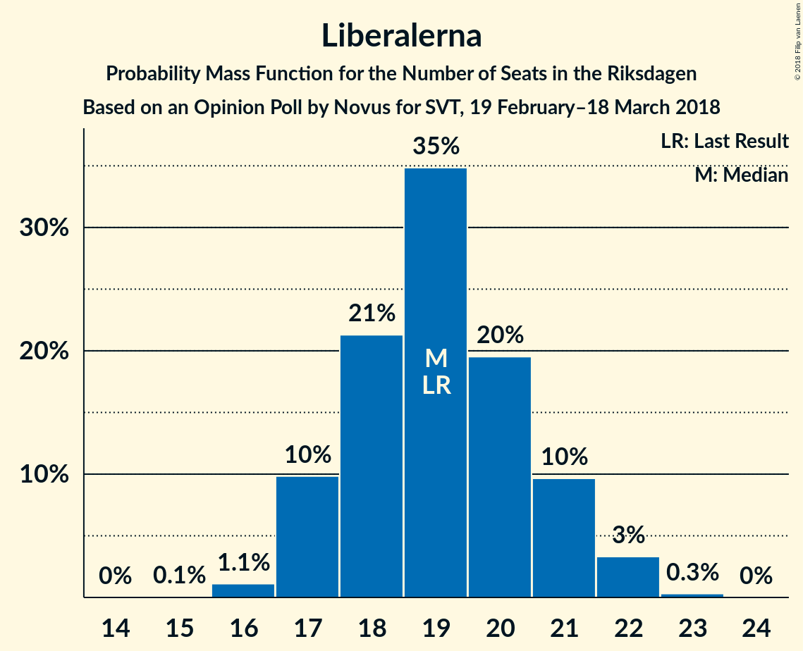

# Opinion Poll by Novus for SVT, 19 February–18 March 2018

<a href="#voting-intentions">Voting Intentions</a> | <a href="#seats">Seats</a> | <a href="#coalitions">Coalitions</a> | <a href="#technical-information">Technical Information</a>

## Voting Intentions

### Confidence Intervals

| Party | Last Result | Poll Result | 80% Confidence Interval | 90% Confidence Interval | 95% Confidence Interval | 99% Confidence Interval |
|:-----:|:-----------:|:-----------:|:-----------------------:|:-----------------------:|:-----------------------:|:-----------------------:|
| Sveriges socialdemokratiska arbetareparti | 31.0% | 27.8% | 27.0–28.6% |26.8–28.8% |26.6–29.0% |26.2–29.4% |
| Moderata samlingspartiet | 23.3% | 22.6% | 21.9–23.3% |21.7–23.5% |21.5–23.7% |21.2–24.1% |
| Sverigedemokraterna | 12.9% | 17.8% | 17.1–18.5% |17.0–18.7% |16.8–18.9% |16.5–19.2% |
| Centerpartiet | 6.1% | 9.3% | 8.8–9.8% |8.7–10.0% |8.6–10.1% |8.3–10.4% |
| Vänsterpartiet | 5.7% | 7.8% | 7.3–8.3% |7.2–8.4% |7.1–8.6% |6.9–8.8% |
| Liberalerna | 5.4% | 5.0% | 4.6–5.4% |4.5–5.5% |4.4–5.6% |4.3–5.8% |
| Miljöpartiet de gröna | 6.9% | 3.8% | 3.5–4.2% |3.4–4.3% |3.3–4.3% |3.2–4.5% |
| Kristdemokraterna | 4.6% | 3.2% | 2.9–3.5% |2.8–3.6% |2.8–3.7% |2.6–3.9% |

*Note:* The poll result column reflects the actual value used in the calculations. Published results may vary slightly, and in addition be rounded to fewer digits.

## Seats

### Confidence Intervals

| Party | Last Result | Median | 80% Confidence Interval | 90% Confidence Interval | 95% Confidence Interval | 99% Confidence Interval |
|:-----:|:-----------:|:------:|:-----------------------:|:-----------------------:|:-----------------------:|:-----------------------:|
| <a href="#sveriges-socialdemokratiska-arbetareparti">Sveriges socialdemokratiska arbetareparti</a> | 113 | 107 | 102–110 |100–111 |99–111 |99–113 |
| <a href="#moderata-samlingspartiet">Moderata samlingspartiet</a> | 84 | 87 | 83–90 |82–91 |81–91 |79–93 |
| <a href="#sverigedemokraterna">Sverigedemokraterna</a> | 49 | 68 | 66–70 |65–72 |64–73 |62–74 |
| <a href="#centerpartiet">Centerpartiet</a> | 22 | 36 | 34–38 |33–38 |33–39 |31–40 |
| <a href="#vänsterpartiet">Vänsterpartiet</a> | 21 | 30 | 28–32 |27–32 |27–33 |26–33 |
| <a href="#liberalerna">Liberalerna</a> | 19 | 19 | 17–20 |17–21 |16–21 |16–22 |
| <a href="#miljöpartiet-de-gröna">Miljöpartiet de gröna</a> | 25 | 0 | 0–15 |0–15 |0–16 |0–17 |
| <a href="#kristdemokraterna">Kristdemokraterna</a> | 16 | 0 | 0 |0 |0 |0 |

### Sveriges socialdemokratiska arbetareparti

*For a full overview of the results for this party, see the [Sveriges socialdemokratiska arbetareparti](party-sverigessocialdemokratiskaarbetareparti.html) page.*

| Number of Seats | Probability | Accumulated | Special Marks |
|:---------------:|:-----------:|:-----------:|:-------------:|
| 97 | 0.1% | 100% |  |
| 98 | 0.3% | 99.8% |  |
| 99 | 3% | 99.6% |  |
| 100 | 2% | 97% |  |
| 101 | 4% | 95% |  |
| 102 | 3% | 91% |  |
| 103 | 2% | 88% |  |
| 104 | 3% | 86% |  |
| 105 | 10% | 83% |  |
| 106 | 7% | 73% |  |
| 107 | 17% | 66% | Median |
| 108 | 28% | 49% |  |
| 109 | 9% | 21% |  |
| 110 | 5% | 12% |  |
| 111 | 6% | 7% |  |
| 112 | 0.3% | 1.2% |  |
| 113 | 0.9% | 0.9% | Last Result |
| 114 | 0% | 0.1% |  |
| 115 | 0% | 0% |  |

### Moderata samlingspartiet

*For a full overview of the results for this party, see the [Moderata samlingspartiet](party-moderatasamlingspartiet.html) page.*

| Number of Seats | Probability | Accumulated | Special Marks |
|:---------------:|:-----------:|:-----------:|:-------------:|
| 78 | 0.1% | 100% |  |
| 79 | 0.8% | 99.9% |  |
| 80 | 0.5% | 99.1% |  |
| 81 | 3% | 98.7% |  |
| 82 | 2% | 95% |  |
| 83 | 8% | 93% |  |
| 84 | 7% | 85% | Last Result |
| 85 | 14% | 78% |  |
| 86 | 6% | 64% |  |
| 87 | 22% | 58% | Median |
| 88 | 16% | 35% |  |
| 89 | 8% | 20% |  |
| 90 | 6% | 11% |  |
| 91 | 4% | 5% |  |
| 92 | 1.1% | 2% |  |
| 93 | 0.4% | 0.5% |  |
| 94 | 0.1% | 0.1% |  |
| 95 | 0% | 0% |  |

### Sverigedemokraterna

*For a full overview of the results for this party, see the [Sverigedemokraterna](party-sverigedemokraterna.html) page.*

| Number of Seats | Probability | Accumulated | Special Marks |
|:---------------:|:-----------:|:-----------:|:-------------:|
| 49 | 0% | 100% | Last Result |
| 50 | 0% | 100% |  |
| 51 | 0% | 100% |  |
| 52 | 0% | 100% |  |
| 53 | 0% | 100% |  |
| 54 | 0% | 100% |  |
| 55 | 0% | 100% |  |
| 56 | 0% | 100% |  |
| 57 | 0% | 100% |  |
| 58 | 0% | 100% |  |
| 59 | 0% | 100% |  |
| 60 | 0% | 100% |  |
| 61 | 0.2% | 100% |  |
| 62 | 0.5% | 99.8% |  |
| 63 | 1.1% | 99.3% |  |
| 64 | 3% | 98% |  |
| 65 | 3% | 95% |  |
| 66 | 13% | 92% |  |
| 67 | 16% | 79% |  |
| 68 | 16% | 63% | Median |
| 69 | 24% | 47% |  |
| 70 | 15% | 23% |  |
| 71 | 2% | 8% |  |
| 72 | 3% | 6% |  |
| 73 | 2% | 3% |  |
| 74 | 0.9% | 1.1% |  |
| 75 | 0.1% | 0.1% |  |
| 76 | 0% | 0% |  |

### Centerpartiet

*For a full overview of the results for this party, see the [Centerpartiet](party-centerpartiet.html) page.*

| Number of Seats | Probability | Accumulated | Special Marks |
|:---------------:|:-----------:|:-----------:|:-------------:|
| 22 | 0% | 100% | Last Result |
| 23 | 0% | 100% |  |
| 24 | 0% | 100% |  |
| 25 | 0% | 100% |  |
| 26 | 0% | 100% |  |
| 27 | 0% | 100% |  |
| 28 | 0% | 100% |  |
| 29 | 0% | 100% |  |
| 30 | 0.1% | 100% |  |
| 31 | 0.7% | 99.9% |  |
| 32 | 2% | 99.2% |  |
| 33 | 7% | 98% |  |
| 34 | 12% | 91% |  |
| 35 | 15% | 79% |  |
| 36 | 26% | 64% | Median |
| 37 | 15% | 38% |  |
| 38 | 19% | 22% |  |
| 39 | 1.4% | 3% |  |
| 40 | 1.3% | 2% |  |
| 41 | 0.3% | 0.3% |  |
| 42 | 0% | 0% |  |

### Vänsterpartiet

*For a full overview of the results for this party, see the [Vänsterpartiet](party-vänsterpartiet.html) page.*

| Number of Seats | Probability | Accumulated | Special Marks |
|:---------------:|:-----------:|:-----------:|:-------------:|
| 21 | 0% | 100% | Last Result |
| 22 | 0% | 100% |  |
| 23 | 0% | 100% |  |
| 24 | 0% | 100% |  |
| 25 | 0.1% | 100% |  |
| 26 | 0.5% | 99.9% |  |
| 27 | 8% | 99.3% |  |
| 28 | 9% | 92% |  |
| 29 | 26% | 83% |  |
| 30 | 21% | 57% | Median |
| 31 | 19% | 36% |  |
| 32 | 14% | 17% |  |
| 33 | 3% | 3% |  |
| 34 | 0.2% | 0.3% |  |
| 35 | 0.1% | 0.1% |  |
| 36 | 0% | 0% |  |

### Liberalerna

*For a full overview of the results for this party, see the [Liberalerna](party-liberalerna.html) page.*

| Number of Seats | Probability | Accumulated | Special Marks |
|:---------------:|:-----------:|:-----------:|:-------------:|
| 15 | 0.1% | 100% |  |
| 16 | 3% | 99.9% |  |
| 17 | 8% | 97% |  |
| 18 | 32% | 89% |  |
| 19 | 32% | 56% | Last Result, Median |
| 20 | 15% | 24% |  |
| 21 | 7% | 9% |  |
| 22 | 2% | 2% |  |
| 23 | 0.4% | 0.4% |  |
| 24 | 0% | 0% |  |

### Miljöpartiet de gröna

*For a full overview of the results for this party, see the [Miljöpartiet de gröna](party-miljöpartietdegröna.html) page.*

| Number of Seats | Probability | Accumulated | Special Marks |
|:---------------:|:-----------:|:-----------:|:-------------:|
| 0 | 80% | 100% | Median |
| 1 | 0% | 20% |  |
| 2 | 0% | 20% |  |
| 3 | 0% | 20% |  |
| 4 | 0% | 20% |  |
| 5 | 0% | 20% |  |
| 6 | 0% | 20% |  |
| 7 | 0% | 20% |  |
| 8 | 0% | 20% |  |
| 9 | 0% | 20% |  |
| 10 | 0% | 20% |  |
| 11 | 0% | 20% |  |
| 12 | 0% | 20% |  |
| 13 | 0% | 20% |  |
| 14 | 0% | 20% |  |
| 15 | 16% | 20% |  |
| 16 | 3% | 4% |  |
| 17 | 0.9% | 1.0% |  |
| 18 | 0.1% | 0.1% |  |
| 19 | 0% | 0% |  |
| 20 | 0% | 0% |  |
| 21 | 0% | 0% |  |
| 22 | 0% | 0% |  |
| 23 | 0% | 0% |  |
| 24 | 0% | 0% |  |
| 25 | 0% | 0% | Last Result |

### Kristdemokraterna

*For a full overview of the results for this party, see the [Kristdemokraterna](party-kristdemokraterna.html) page.*

| Number of Seats | Probability | Accumulated | Special Marks |
|:---------------:|:-----------:|:-----------:|:-------------:|
| 0 | 99.9% | 100% | Median |
| 1 | 0% | 0.1% |  |
| 2 | 0% | 0.1% |  |
| 3 | 0% | 0.1% |  |
| 4 | 0% | 0.1% |  |
| 5 | 0% | 0.1% |  |
| 6 | 0% | 0.1% |  |
| 7 | 0% | 0.1% |  |
| 8 | 0% | 0.1% |  |
| 9 | 0% | 0.1% |  |
| 10 | 0% | 0.1% |  |
| 11 | 0% | 0.1% |  |
| 12 | 0% | 0.1% |  |
| 13 | 0% | 0.1% |  |
| 14 | 0% | 0.1% |  |
| 15 | 0.1% | 0.1% |  |
| 16 | 0% | 0% | Last Result |

## Coalitions

### Confidence Intervals

| Coalition | Last Result | Median | Majority? | 80% Confidence Interval | 90% Confidence Interval | 95% Confidence Interval | 99% Confidence Interval |
|:---------:|:-----------:|:------:|:---------:|:-----------------------:|:-----------------------:|:-----------------------:|:-----------------------:|
| Sveriges socialdemokratiska arbetareparti – Vänsterpartiet – Miljöpartiet de gröna | 159 | 139 | 0% | 135–147 | 134–149 | 134–149 | 133–152 |
| Moderata samlingspartiet – Centerpartiet – Liberalerna – Kristdemokraterna | 141 | 142 | 0% | 136–145 | 134–146 | 134–147 | 132–148 |
| Moderata samlingspartiet – Centerpartiet – Liberalerna | 125 | 142 | 0% | 136–145 | 134–146 | 134–147 | 132–148 |
| Sveriges socialdemokratiska arbetareparti – Vänsterpartiet | 134 | 137 | 0% | 132–141 | 129–141 | 129–142 | 127–143 |
| Moderata samlingspartiet – Centerpartiet – Kristdemokraterna | 122 | 123 | 0% | 117–126 | 116–127 | 116–128 | 114–130 |
| Moderata samlingspartiet – Centerpartiet | 106 | 123 | 0% | 117–126 | 116–127 | 116–128 | 114–130 |

### Sveriges socialdemokratiska arbetareparti – Vänsterpartiet – Miljöpartiet de gröna

| Number of Seats | Probability | Accumulated | Special Marks |
|:---------------:|:-----------:|:-----------:|:-------------:|
| 130 | 0% | 100% |  |
| 131 | 0.1% | 99.9% |  |
| 132 | 0.3% | 99.9% |  |
| 133 | 2% | 99.6% |  |
| 134 | 5% | 98% |  |
| 135 | 6% | 93% |  |
| 136 | 17% | 87% |  |
| 137 | 9% | 71% | Median |
| 138 | 3% | 61% |  |
| 139 | 14% | 59% |  |
| 140 | 14% | 45% |  |
| 141 | 7% | 31% |  |
| 142 | 2% | 24% |  |
| 143 | 2% | 22% |  |
| 144 | 6% | 20% |  |
| 145 | 0.5% | 14% |  |
| 146 | 2% | 14% |  |
| 147 | 5% | 12% |  |
| 148 | 0.3% | 7% |  |
| 149 | 4% | 6% |  |
| 150 | 0.3% | 2% |  |
| 151 | 0.6% | 2% |  |
| 152 | 1.1% | 1.2% |  |
| 153 | 0.1% | 0.2% |  |
| 154 | 0.1% | 0.1% |  |
| 155 | 0% | 0% |  |
| 156 | 0% | 0% |  |
| 157 | 0% | 0% |  |
| 158 | 0% | 0% |  |
| 159 | 0% | 0% | Last Result |

### Moderata samlingspartiet – Centerpartiet – Liberalerna – Kristdemokraterna

| Number of Seats | Probability | Accumulated | Special Marks |
|:---------------:|:-----------:|:-----------:|:-------------:|
| 130 | 0% | 100% |  |
| 131 | 0.1% | 99.9% |  |
| 132 | 0.4% | 99.8% |  |
| 133 | 1.3% | 99.4% |  |
| 134 | 4% | 98% |  |
| 135 | 3% | 95% |  |
| 136 | 6% | 92% |  |
| 137 | 4% | 86% |  |
| 138 | 2% | 82% |  |
| 139 | 4% | 80% |  |
| 140 | 7% | 76% |  |
| 141 | 14% | 69% | Last Result |
| 142 | 14% | 55% | Median |
| 143 | 20% | 41% |  |
| 144 | 9% | 21% |  |
| 145 | 5% | 12% |  |
| 146 | 3% | 7% |  |
| 147 | 3% | 4% |  |
| 148 | 0.7% | 1.1% |  |
| 149 | 0.1% | 0.4% |  |
| 150 | 0.2% | 0.3% |  |
| 151 | 0.1% | 0.1% |  |
| 152 | 0% | 0% |  |

### Moderata samlingspartiet – Centerpartiet – Liberalerna

| Number of Seats | Probability | Accumulated | Special Marks |
|:---------------:|:-----------:|:-----------:|:-------------:|
| 125 | 0% | 100% | Last Result |
| 126 | 0% | 100% |  |
| 127 | 0% | 100% |  |
| 128 | 0% | 100% |  |
| 129 | 0% | 100% |  |
| 130 | 0% | 99.9% |  |
| 131 | 0.2% | 99.9% |  |
| 132 | 0.4% | 99.7% |  |
| 133 | 1.3% | 99.4% |  |
| 134 | 4% | 98% |  |
| 135 | 3% | 95% |  |
| 136 | 6% | 92% |  |
| 137 | 4% | 86% |  |
| 138 | 2% | 82% |  |
| 139 | 4% | 80% |  |
| 140 | 7% | 76% |  |
| 141 | 14% | 69% |  |
| 142 | 14% | 55% | Median |
| 143 | 20% | 40% |  |
| 144 | 9% | 21% |  |
| 145 | 5% | 12% |  |
| 146 | 3% | 7% |  |
| 147 | 3% | 4% |  |
| 148 | 0.6% | 1.0% |  |
| 149 | 0.1% | 0.3% |  |
| 150 | 0.1% | 0.2% |  |
| 151 | 0% | 0.1% |  |
| 152 | 0% | 0% |  |

### Sveriges socialdemokratiska arbetareparti – Vänsterpartiet

| Number of Seats | Probability | Accumulated | Special Marks |
|:---------------:|:-----------:|:-----------:|:-------------:|
| 125 | 0% | 100% |  |
| 126 | 0.2% | 99.9% |  |
| 127 | 0.4% | 99.8% |  |
| 128 | 0.3% | 99.4% |  |
| 129 | 6% | 99.0% |  |
| 130 | 2% | 93% |  |
| 131 | 1.2% | 92% |  |
| 132 | 5% | 91% |  |
| 133 | 2% | 85% |  |
| 134 | 8% | 83% | Last Result |
| 135 | 6% | 75% |  |
| 136 | 17% | 69% |  |
| 137 | 10% | 51% | Median |
| 138 | 3% | 41% |  |
| 139 | 14% | 38% |  |
| 140 | 14% | 24% |  |
| 141 | 7% | 11% |  |
| 142 | 2% | 4% |  |
| 143 | 2% | 2% |  |
| 144 | 0.2% | 0.2% |  |
| 145 | 0% | 0.1% |  |
| 146 | 0% | 0% |  |

### Moderata samlingspartiet – Centerpartiet – Kristdemokraterna

| Number of Seats | Probability | Accumulated | Special Marks |
|:---------------:|:-----------:|:-----------:|:-------------:|
| 112 | 0.1% | 100% |  |
| 113 | 0.4% | 99.9% |  |
| 114 | 0.5% | 99.5% |  |
| 115 | 0.6% | 99.1% |  |
| 116 | 4% | 98% |  |
| 117 | 7% | 94% |  |
| 118 | 4% | 88% |  |
| 119 | 5% | 83% |  |
| 120 | 6% | 78% |  |
| 121 | 4% | 72% |  |
| 122 | 3% | 68% | Last Result |
| 123 | 24% | 65% | Median |
| 124 | 8% | 40% |  |
| 125 | 22% | 33% |  |
| 126 | 5% | 11% |  |
| 127 | 2% | 6% |  |
| 128 | 4% | 4% |  |
| 129 | 0.2% | 0.9% |  |
| 130 | 0.4% | 0.7% |  |
| 131 | 0.2% | 0.3% |  |
| 132 | 0% | 0.1% |  |
| 133 | 0% | 0.1% |  |
| 134 | 0% | 0% |  |

### Moderata samlingspartiet – Centerpartiet

| Number of Seats | Probability | Accumulated | Special Marks |
|:---------------:|:-----------:|:-----------:|:-------------:|
| 106 | 0% | 100% | Last Result |
| 107 | 0% | 100% |  |
| 108 | 0% | 100% |  |
| 109 | 0% | 100% |  |
| 110 | 0% | 100% |  |
| 111 | 0% | 100% |  |
| 112 | 0.1% | 100% |  |
| 113 | 0.4% | 99.9% |  |
| 114 | 0.5% | 99.5% |  |
| 115 | 0.6% | 99.0% |  |
| 116 | 4% | 98% |  |
| 117 | 7% | 94% |  |
| 118 | 4% | 88% |  |
| 119 | 6% | 83% |  |
| 120 | 6% | 78% |  |
| 121 | 4% | 72% |  |
| 122 | 3% | 68% |  |
| 123 | 24% | 64% | Median |
| 124 | 8% | 40% |  |
| 125 | 22% | 33% |  |
| 126 | 5% | 11% |  |
| 127 | 2% | 6% |  |
| 128 | 4% | 4% |  |
| 129 | 0.2% | 0.8% |  |
| 130 | 0.4% | 0.6% |  |
| 131 | 0.2% | 0.2% |  |
| 132 | 0% | 0% |  |

## Technical Information

### Opinion Poll

+ **Polling firm:** Novus
+ **Commissioner(s):** SVT
+ **Fieldwork period:** 19 February–18 March 2018

### Calculations

+ **Sample size:** 5426
+ **Simulations done:** 131,072
+ **Error estimate:** 0.50%

