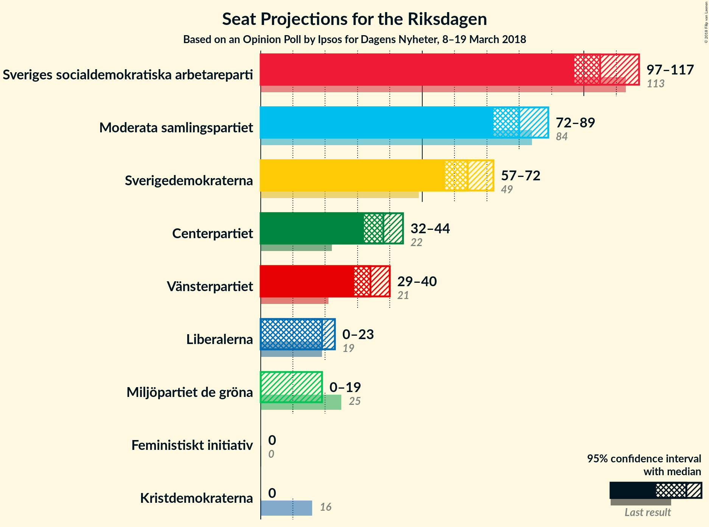
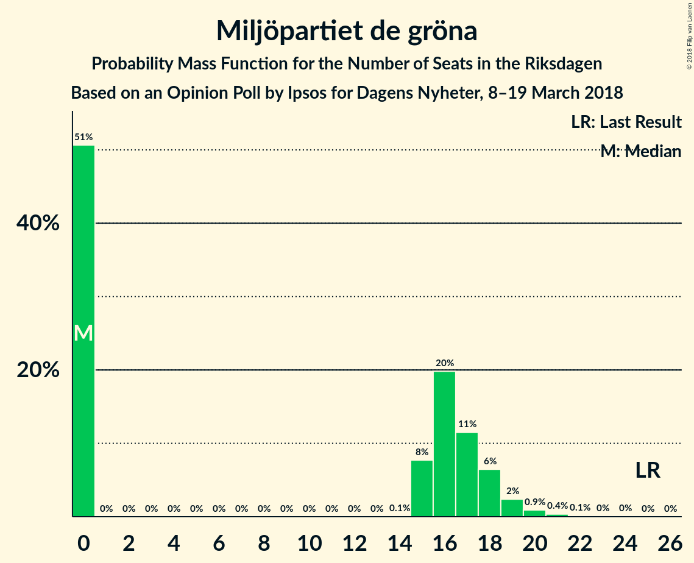

# Opinion Poll by Ipsos for Dagens Nyheter, 8–19 March 2018

<a href="#voting-intentions">Voting Intentions</a> | <a href="#seats">Seats</a> | <a href="#coalitions">Coalitions</a> | <a href="#technical-information">Technical Information</a>

## Voting Intentions

### Confidence Intervals

| Party | Last Result | Poll Result | 80% Confidence Interval | 90% Confidence Interval | 95% Confidence Interval | 99% Confidence Interval |
|:-----:|:-----------:|:-----------:|:-----------------------:|:-----------------------:|:-----------------------:|:-----------------------:|
| Sveriges socialdemokratiska arbetareparti | 31.0% | 27.7% | 26.3–29.2% |25.9–29.7% |25.5–30.0% |24.9–30.8% |
| Moderata samlingspartiet | 23.3% | 20.8% | 19.5–22.2% |19.2–22.6% |18.9–22.9% |18.3–23.6% |
| Sverigedemokraterna | 12.9% | 16.8% | 15.7–18.1% |15.3–18.5% |15.0–18.8% |14.5–19.4% |
| Centerpartiet | 6.1% | 9.9% | 9.0–11.0% |8.7–11.3% |8.5–11.5% |8.1–12.0% |
| Vänsterpartiet | 5.7% | 8.9% | 8.1–10.0% |7.8–10.2% |7.6–10.5% |7.2–11.0% |
| Liberalerna | 5.4% | 5.0% | 4.3–5.7% |4.1–6.0% |4.0–6.2% |3.7–6.6% |
| Miljöpartiet de gröna | 6.9% | 4.0% | 3.4–4.7% |3.2–4.9% |3.1–5.1% |2.9–5.5% |
| Kristdemokraterna | 4.6% | 3.0% | 2.5–3.6% |2.4–3.8% |2.3–4.0% |2.0–4.3% |
| Feministiskt initiativ | 3.1% | 2.0% | 1.6–2.5% |1.5–2.7% |1.4–2.8% |1.2–3.1% |

*Note:* The poll result column reflects the actual value used in the calculations. Published results may vary slightly, and in addition be rounded to fewer digits.

## Seats

### Confidence Intervals

| Party | Last Result | Median | 80% Confidence Interval | 90% Confidence Interval | 95% Confidence Interval | 99% Confidence Interval |
|:-----:|:-----------:|:------:|:-----------------------:|:-----------------------:|:-----------------------:|:-----------------------:|
| <a href="#sveriges-socialdemokratiska-arbetareparti">Sveriges socialdemokratiska arbetareparti</a> | 113 | 103 | 99–114 |99–114 |98–116 |92–121 |
| <a href="#moderata-samlingspartiet">Moderata samlingspartiet</a> | 84 | 78 | 73–84 |72–86 |71–87 |67–91 |
| <a href="#sverigedemokraterna">Sverigedemokraterna</a> | 49 | 65 | 60–68 |59–69 |57–71 |54–76 |
| <a href="#centerpartiet">Centerpartiet</a> | 22 | 39 | 35–41 |33–44 |32–44 |31–49 |
| <a href="#vänsterpartiet">Vänsterpartiet</a> | 21 | 35 | 31–38 |29–39 |29–40 |27–42 |
| <a href="#liberalerna">Liberalerna</a> | 19 | 20 | 16–23 |15–23 |0–24 |0–24 |
| <a href="#miljöpartiet-de-gröna">Miljöpartiet de gröna</a> | 25 | 15 | 0–18 |0–19 |0–19 |0–20 |
| <a href="#kristdemokraterna">Kristdemokraterna</a> | 16 | 0 | 0 |0 |0 |0–16 |
| <a href="#feministiskt-initiativ">Feministiskt initiativ</a> | 0 | 0 | 0 |0 |0 |0 |

### Sveriges socialdemokratiska arbetareparti

*For a full overview of the results for this party, see the [Sveriges socialdemokratiska arbetareparti](party-sverigessocialdemokratiskaarbetareparti.html) page.*

| Number of Seats | Probability | Accumulated | Special Marks |
|:---------------:|:-----------:|:-----------:|:-------------:|
| 89 | 0% | 100% |  |
| 90 | 0.1% | 99.9% |  |
| 91 | 0% | 99.9% |  |
| 92 | 0.6% | 99.9% |  |
| 93 | 0.1% | 99.2% |  |
| 94 | 0.3% | 99.1% |  |
| 95 | 0.3% | 98.9% |  |
| 96 | 0.4% | 98.6% |  |
| 97 | 0.7% | 98% |  |
| 98 | 2% | 98% |  |
| 99 | 8% | 95% |  |
| 100 | 8% | 87% |  |
| 101 | 12% | 78% |  |
| 102 | 14% | 66% |  |
| 103 | 3% | 52% | Median |
| 104 | 2% | 49% |  |
| 105 | 4% | 47% |  |
| 106 | 2% | 43% |  |
| 107 | 6% | 41% |  |
| 108 | 1.0% | 35% |  |
| 109 | 1.2% | 34% |  |
| 110 | 1.2% | 32% |  |
| 111 | 9% | 31% |  |
| 112 | 1.1% | 22% |  |
| 113 | 3% | 21% | Last Result |
| 114 | 13% | 18% |  |
| 115 | 1.0% | 5% |  |
| 116 | 2% | 4% |  |
| 117 | 0.2% | 2% |  |
| 118 | 0.2% | 2% |  |
| 119 | 0.8% | 2% |  |
| 120 | 0.2% | 0.8% |  |
| 121 | 0.3% | 0.6% |  |
| 122 | 0.2% | 0.2% |  |
| 123 | 0% | 0% |  |

### Moderata samlingspartiet

*For a full overview of the results for this party, see the [Moderata samlingspartiet](party-moderatasamlingspartiet.html) page.*

| Number of Seats | Probability | Accumulated | Special Marks |
|:---------------:|:-----------:|:-----------:|:-------------:|
| 66 | 0.1% | 100% |  |
| 67 | 0.4% | 99.9% |  |
| 68 | 0.5% | 99.5% |  |
| 69 | 0.9% | 99.0% |  |
| 70 | 0.3% | 98% |  |
| 71 | 0.7% | 98% |  |
| 72 | 7% | 97% |  |
| 73 | 10% | 91% |  |
| 74 | 4% | 80% |  |
| 75 | 7% | 76% |  |
| 76 | 12% | 69% |  |
| 77 | 3% | 57% |  |
| 78 | 11% | 53% | Median |
| 79 | 2% | 43% |  |
| 80 | 3% | 40% |  |
| 81 | 12% | 38% |  |
| 82 | 4% | 26% |  |
| 83 | 4% | 22% |  |
| 84 | 9% | 18% | Last Result |
| 85 | 3% | 9% |  |
| 86 | 3% | 6% |  |
| 87 | 0.7% | 3% |  |
| 88 | 0.3% | 2% |  |
| 89 | 0.3% | 2% |  |
| 90 | 0.6% | 1.5% |  |
| 91 | 0.7% | 0.9% |  |
| 92 | 0.2% | 0.2% |  |
| 93 | 0% | 0.1% |  |
| 94 | 0% | 0.1% |  |
| 95 | 0% | 0% |  |

### Sverigedemokraterna

*For a full overview of the results for this party, see the [Sverigedemokraterna](party-sverigedemokraterna.html) page.*

| Number of Seats | Probability | Accumulated | Special Marks |
|:---------------:|:-----------:|:-----------:|:-------------:|
| 49 | 0% | 100% | Last Result |
| 50 | 0% | 100% |  |
| 51 | 0% | 100% |  |
| 52 | 0% | 100% |  |
| 53 | 0.1% | 99.9% |  |
| 54 | 0.8% | 99.8% |  |
| 55 | 0.5% | 99.0% |  |
| 56 | 0.8% | 98.5% |  |
| 57 | 1.2% | 98% |  |
| 58 | 1.0% | 96% |  |
| 59 | 1.4% | 96% |  |
| 60 | 8% | 94% |  |
| 61 | 7% | 87% |  |
| 62 | 12% | 79% |  |
| 63 | 11% | 67% |  |
| 64 | 5% | 56% |  |
| 65 | 16% | 51% | Median |
| 66 | 11% | 35% |  |
| 67 | 7% | 24% |  |
| 68 | 12% | 17% |  |
| 69 | 2% | 5% |  |
| 70 | 0.8% | 4% |  |
| 71 | 0.5% | 3% |  |
| 72 | 0.3% | 2% |  |
| 73 | 0.6% | 2% |  |
| 74 | 0.5% | 2% |  |
| 75 | 0.4% | 1.0% |  |
| 76 | 0.4% | 0.6% |  |
| 77 | 0.2% | 0.2% |  |
| 78 | 0% | 0% |  |

### Centerpartiet

*For a full overview of the results for this party, see the [Centerpartiet](party-centerpartiet.html) page.*

| Number of Seats | Probability | Accumulated | Special Marks |
|:---------------:|:-----------:|:-----------:|:-------------:|
| 22 | 0% | 100% | Last Result |
| 23 | 0% | 100% |  |
| 24 | 0% | 100% |  |
| 25 | 0% | 100% |  |
| 26 | 0% | 100% |  |
| 27 | 0% | 100% |  |
| 28 | 0.1% | 100% |  |
| 29 | 0.1% | 99.9% |  |
| 30 | 0.2% | 99.8% |  |
| 31 | 0.4% | 99.6% |  |
| 32 | 2% | 99.2% |  |
| 33 | 3% | 97% |  |
| 34 | 3% | 94% |  |
| 35 | 8% | 91% |  |
| 36 | 6% | 83% |  |
| 37 | 5% | 77% |  |
| 38 | 19% | 72% |  |
| 39 | 19% | 53% | Median |
| 40 | 11% | 34% |  |
| 41 | 13% | 23% |  |
| 42 | 2% | 10% |  |
| 43 | 1.4% | 7% |  |
| 44 | 4% | 6% |  |
| 45 | 0.5% | 2% |  |
| 46 | 0.8% | 2% |  |
| 47 | 0.1% | 0.8% |  |
| 48 | 0.2% | 0.7% |  |
| 49 | 0.5% | 0.5% |  |
| 50 | 0% | 0% |  |

### Vänsterpartiet

*For a full overview of the results for this party, see the [Vänsterpartiet](party-vänsterpartiet.html) page.*

| Number of Seats | Probability | Accumulated | Special Marks |
|:---------------:|:-----------:|:-----------:|:-------------:|
| 21 | 0% | 100% | Last Result |
| 22 | 0% | 100% |  |
| 23 | 0% | 100% |  |
| 24 | 0% | 100% |  |
| 25 | 0% | 100% |  |
| 26 | 0.3% | 100% |  |
| 27 | 0.3% | 99.6% |  |
| 28 | 0.9% | 99.3% |  |
| 29 | 4% | 98% |  |
| 30 | 2% | 95% |  |
| 31 | 3% | 92% |  |
| 32 | 15% | 89% |  |
| 33 | 7% | 74% |  |
| 34 | 11% | 67% |  |
| 35 | 23% | 56% | Median |
| 36 | 18% | 33% |  |
| 37 | 5% | 15% |  |
| 38 | 3% | 10% |  |
| 39 | 4% | 7% |  |
| 40 | 1.5% | 3% |  |
| 41 | 0.5% | 1.4% |  |
| 42 | 0.5% | 0.9% |  |
| 43 | 0.3% | 0.4% |  |
| 44 | 0% | 0.1% |  |
| 45 | 0% | 0.1% |  |
| 46 | 0% | 0% |  |

### Liberalerna

*For a full overview of the results for this party, see the [Liberalerna](party-liberalerna.html) page.*

| Number of Seats | Probability | Accumulated | Special Marks |
|:---------------:|:-----------:|:-----------:|:-------------:|
| 0 | 3% | 100% |  |
| 1 | 0% | 97% |  |
| 2 | 0% | 97% |  |
| 3 | 0% | 97% |  |
| 4 | 0% | 97% |  |
| 5 | 0% | 97% |  |
| 6 | 0% | 97% |  |
| 7 | 0% | 97% |  |
| 8 | 0% | 97% |  |
| 9 | 0% | 97% |  |
| 10 | 0% | 97% |  |
| 11 | 0% | 97% |  |
| 12 | 0% | 97% |  |
| 13 | 0% | 97% |  |
| 14 | 0% | 97% |  |
| 15 | 3% | 97% |  |
| 16 | 15% | 94% |  |
| 17 | 14% | 79% |  |
| 18 | 8% | 65% |  |
| 19 | 4% | 57% | Last Result |
| 20 | 11% | 53% | Median |
| 21 | 12% | 41% |  |
| 22 | 19% | 30% |  |
| 23 | 8% | 11% |  |
| 24 | 3% | 3% |  |
| 25 | 0.1% | 0.3% |  |
| 26 | 0.1% | 0.2% |  |
| 27 | 0% | 0.1% |  |
| 28 | 0% | 0% |  |

### Miljöpartiet de gröna

*For a full overview of the results for this party, see the [Miljöpartiet de gröna](party-miljöpartietdegröna.html) page.*

| Number of Seats | Probability | Accumulated | Special Marks |
|:---------------:|:-----------:|:-----------:|:-------------:|
| 0 | 47% | 100% |  |
| 1 | 0% | 53% |  |
| 2 | 0% | 53% |  |
| 3 | 0% | 53% |  |
| 4 | 0% | 53% |  |
| 5 | 0% | 53% |  |
| 6 | 0% | 53% |  |
| 7 | 0% | 53% |  |
| 8 | 0% | 53% |  |
| 9 | 0% | 53% |  |
| 10 | 0% | 53% |  |
| 11 | 0% | 53% |  |
| 12 | 0% | 53% |  |
| 13 | 0% | 53% |  |
| 14 | 0% | 53% |  |
| 15 | 9% | 53% | Median |
| 16 | 25% | 44% |  |
| 17 | 7% | 18% |  |
| 18 | 4% | 11% |  |
| 19 | 6% | 7% |  |
| 20 | 0.7% | 0.9% |  |
| 21 | 0.2% | 0.3% |  |
| 22 | 0% | 0.1% |  |
| 23 | 0% | 0% |  |
| 24 | 0% | 0% |  |
| 25 | 0% | 0% | Last Result |

### Kristdemokraterna

*For a full overview of the results for this party, see the [Kristdemokraterna](party-kristdemokraterna.html) page.*

| Number of Seats | Probability | Accumulated | Special Marks |
|:---------------:|:-----------:|:-----------:|:-------------:|
| 0 | 98% | 100% | Median |
| 1 | 0% | 2% |  |
| 2 | 0% | 2% |  |
| 3 | 0% | 2% |  |
| 4 | 0% | 2% |  |
| 5 | 0% | 2% |  |
| 6 | 0% | 2% |  |
| 7 | 0% | 2% |  |
| 8 | 0% | 2% |  |
| 9 | 0% | 2% |  |
| 10 | 0% | 2% |  |
| 11 | 0% | 2% |  |
| 12 | 0% | 2% |  |
| 13 | 0% | 2% |  |
| 14 | 0% | 2% |  |
| 15 | 1.1% | 2% |  |
| 16 | 1.0% | 1.2% | Last Result |
| 17 | 0.1% | 0.2% |  |
| 18 | 0% | 0% |  |

### Feministiskt initiativ

*For a full overview of the results for this party, see the [Feministiskt initiativ](party-feministisktinitiativ.html) page.*

| Number of Seats | Probability | Accumulated | Special Marks |
|:---------------:|:-----------:|:-----------:|:-------------:|
| 0 | 100% | 100% | Last Result, Median |

## Coalitions

### Confidence Intervals

| Coalition | Last Result | Median | Majority? | 80% Confidence Interval | 90% Confidence Interval | 95% Confidence Interval | 99% Confidence Interval |
|:---------:|:-----------:|:------:|:---------:|:-----------------------:|:-----------------------:|:-----------------------:|:-----------------------:|
| Sveriges socialdemokratiska arbetareparti – Vänsterpartiet – Miljöpartiet de gröna – Feministiskt initiativ | 159 | 149 | 0% | 137–155 | 137–157 | 134–159 | 133–165 |
| Sveriges socialdemokratiska arbetareparti – Vänsterpartiet – Miljöpartiet de gröna | 159 | 149 | 0% | 137–155 | 137–157 | 134–159 | 133–165 |
| Sveriges socialdemokratiska arbetareparti – Vänsterpartiet | 134 | 138 | 0% | 132–149 | 130–151 | 128–152 | 125–159 |
| Moderata samlingspartiet – Centerpartiet – Liberalerna – Kristdemokraterna | 141 | 135 | 0% | 129–146 | 127–146 | 122–150 | 119–151 |
| Moderata samlingspartiet – Centerpartiet – Liberalerna | 125 | 135 | 0% | 129–146 | 127–146 | 121–149 | 118–150 |
| Moderata samlingspartiet – Centerpartiet – Kristdemokraterna | 122 | 117 | 0% | 110–124 | 109–126 | 108–128 | 104–134 |
| Moderata samlingspartiet – Centerpartiet | 106 | 117 | 0% | 109–123 | 109–126 | 107–127 | 103–130 |
| Sveriges socialdemokratiska arbetareparti – Miljöpartiet de gröna | 138 | 115 | 0% | 102–122 | 101–122 | 101–125 | 99–132 |

### Sveriges socialdemokratiska arbetareparti – Vänsterpartiet – Miljöpartiet de gröna – Feministiskt initiativ

| Number of Seats | Probability | Accumulated | Special Marks |
|:---------------:|:-----------:|:-----------:|:-------------:|
| 129 | 0% | 100% |  |
| 130 | 0.2% | 99.9% |  |
| 131 | 0.1% | 99.8% |  |
| 132 | 0.1% | 99.7% |  |
| 133 | 0.4% | 99.6% |  |
| 134 | 2% | 99.1% |  |
| 135 | 0.9% | 97% |  |
| 136 | 0.7% | 96% |  |
| 137 | 6% | 95% |  |
| 138 | 0.8% | 89% |  |
| 139 | 0.3% | 89% |  |
| 140 | 1.5% | 88% |  |
| 141 | 0.4% | 87% |  |
| 142 | 0.8% | 86% |  |
| 143 | 3% | 86% |  |
| 144 | 3% | 83% |  |
| 145 | 2% | 80% |  |
| 146 | 2% | 78% |  |
| 147 | 10% | 76% |  |
| 148 | 4% | 66% |  |
| 149 | 12% | 61% |  |
| 150 | 7% | 50% |  |
| 151 | 6% | 43% |  |
| 152 | 7% | 37% |  |
| 153 | 11% | 30% | Median |
| 154 | 8% | 19% |  |
| 155 | 3% | 11% |  |
| 156 | 2% | 8% |  |
| 157 | 2% | 6% |  |
| 158 | 1.2% | 4% |  |
| 159 | 0.7% | 3% | Last Result |
| 160 | 0.5% | 2% |  |
| 161 | 0.3% | 2% |  |
| 162 | 0.3% | 2% |  |
| 163 | 0.1% | 1.3% |  |
| 164 | 0.1% | 1.2% |  |
| 165 | 0.9% | 1.1% |  |
| 166 | 0.1% | 0.3% |  |
| 167 | 0.1% | 0.2% |  |
| 168 | 0.1% | 0.1% |  |
| 169 | 0% | 0% |  |

### Sveriges socialdemokratiska arbetareparti – Vänsterpartiet – Miljöpartiet de gröna

| Number of Seats | Probability | Accumulated | Special Marks |
|:---------------:|:-----------:|:-----------:|:-------------:|
| 129 | 0% | 100% |  |
| 130 | 0.2% | 99.9% |  |
| 131 | 0.1% | 99.8% |  |
| 132 | 0.1% | 99.7% |  |
| 133 | 0.4% | 99.6% |  |
| 134 | 2% | 99.1% |  |
| 135 | 0.9% | 97% |  |
| 136 | 0.7% | 96% |  |
| 137 | 6% | 95% |  |
| 138 | 0.8% | 89% |  |
| 139 | 0.3% | 89% |  |
| 140 | 1.5% | 88% |  |
| 141 | 0.4% | 87% |  |
| 142 | 0.8% | 86% |  |
| 143 | 3% | 86% |  |
| 144 | 3% | 83% |  |
| 145 | 2% | 80% |  |
| 146 | 2% | 78% |  |
| 147 | 10% | 76% |  |
| 148 | 4% | 66% |  |
| 149 | 12% | 61% |  |
| 150 | 7% | 50% |  |
| 151 | 6% | 43% |  |
| 152 | 7% | 37% |  |
| 153 | 11% | 30% | Median |
| 154 | 8% | 19% |  |
| 155 | 3% | 11% |  |
| 156 | 2% | 8% |  |
| 157 | 2% | 6% |  |
| 158 | 1.2% | 4% |  |
| 159 | 0.7% | 3% | Last Result |
| 160 | 0.5% | 2% |  |
| 161 | 0.3% | 2% |  |
| 162 | 0.3% | 2% |  |
| 163 | 0.1% | 1.3% |  |
| 164 | 0.1% | 1.2% |  |
| 165 | 0.9% | 1.1% |  |
| 166 | 0.1% | 0.3% |  |
| 167 | 0.1% | 0.2% |  |
| 168 | 0.1% | 0.1% |  |
| 169 | 0% | 0% |  |

### Sveriges socialdemokratiska arbetareparti – Vänsterpartiet

| Number of Seats | Probability | Accumulated | Special Marks |
|:---------------:|:-----------:|:-----------:|:-------------:|
| 121 | 0% | 100% |  |
| 122 | 0% | 99.9% |  |
| 123 | 0.1% | 99.9% |  |
| 124 | 0.2% | 99.8% |  |
| 125 | 0.3% | 99.6% |  |
| 126 | 0.1% | 99.3% |  |
| 127 | 0.3% | 99.2% |  |
| 128 | 2% | 98.9% |  |
| 129 | 2% | 97% |  |
| 130 | 1.3% | 95% |  |
| 131 | 0.4% | 94% |  |
| 132 | 4% | 93% |  |
| 133 | 0.9% | 90% |  |
| 134 | 15% | 89% | Last Result |
| 135 | 1.4% | 74% |  |
| 136 | 7% | 73% |  |
| 137 | 16% | 66% |  |
| 138 | 3% | 50% | Median |
| 139 | 7% | 48% |  |
| 140 | 1.5% | 40% |  |
| 141 | 2% | 39% |  |
| 142 | 1.1% | 37% |  |
| 143 | 2% | 36% |  |
| 144 | 1.5% | 34% |  |
| 145 | 2% | 32% |  |
| 146 | 2% | 30% |  |
| 147 | 9% | 28% |  |
| 148 | 2% | 19% |  |
| 149 | 11% | 17% |  |
| 150 | 0.2% | 6% |  |
| 151 | 0.9% | 6% |  |
| 152 | 3% | 5% |  |
| 153 | 0.5% | 2% |  |
| 154 | 0.2% | 2% |  |
| 155 | 0.5% | 2% |  |
| 156 | 0.1% | 1.0% |  |
| 157 | 0% | 0.9% |  |
| 158 | 0.4% | 0.9% |  |
| 159 | 0.5% | 0.5% |  |
| 160 | 0% | 0% |  |

### Moderata samlingspartiet – Centerpartiet – Liberalerna – Kristdemokraterna

| Number of Seats | Probability | Accumulated | Special Marks |
|:---------------:|:-----------:|:-----------:|:-------------:|
| 113 | 0% | 100% |  |
| 114 | 0% | 99.9% |  |
| 115 | 0.1% | 99.9% |  |
| 116 | 0% | 99.8% |  |
| 117 | 0.2% | 99.8% |  |
| 118 | 0.1% | 99.6% |  |
| 119 | 0.7% | 99.5% |  |
| 120 | 0.1% | 98.9% |  |
| 121 | 0.9% | 98.8% |  |
| 122 | 0.6% | 98% |  |
| 123 | 0.1% | 97% |  |
| 124 | 0.5% | 97% |  |
| 125 | 0.2% | 97% |  |
| 126 | 0.2% | 97% |  |
| 127 | 2% | 96% |  |
| 128 | 1.0% | 94% |  |
| 129 | 6% | 93% |  |
| 130 | 0.4% | 87% |  |
| 131 | 10% | 87% |  |
| 132 | 3% | 77% |  |
| 133 | 1.4% | 74% |  |
| 134 | 10% | 73% |  |
| 135 | 17% | 62% |  |
| 136 | 3% | 45% |  |
| 137 | 5% | 43% | Median |
| 138 | 6% | 38% |  |
| 139 | 10% | 32% |  |
| 140 | 3% | 22% |  |
| 141 | 2% | 19% | Last Result |
| 142 | 2% | 17% |  |
| 143 | 2% | 15% |  |
| 144 | 1.1% | 13% |  |
| 145 | 0.9% | 12% |  |
| 146 | 6% | 11% |  |
| 147 | 1.0% | 5% |  |
| 148 | 0.3% | 4% |  |
| 149 | 0.7% | 3% |  |
| 150 | 2% | 3% |  |
| 151 | 0.2% | 0.6% |  |
| 152 | 0.1% | 0.4% |  |
| 153 | 0% | 0.3% |  |
| 154 | 0.2% | 0.3% |  |
| 155 | 0% | 0.1% |  |
| 156 | 0% | 0% |  |

### Moderata samlingspartiet – Centerpartiet – Liberalerna

| Number of Seats | Probability | Accumulated | Special Marks |
|:---------------:|:-----------:|:-----------:|:-------------:|
| 112 | 0% | 100% |  |
| 113 | 0% | 99.9% |  |
| 114 | 0% | 99.9% |  |
| 115 | 0.1% | 99.9% |  |
| 116 | 0.1% | 99.8% |  |
| 117 | 0.2% | 99.7% |  |
| 118 | 0.5% | 99.5% |  |
| 119 | 0.7% | 99.0% |  |
| 120 | 0.1% | 98% |  |
| 121 | 0.9% | 98% |  |
| 122 | 0.6% | 97% |  |
| 123 | 0.1% | 97% |  |
| 124 | 0.9% | 97% |  |
| 125 | 0.3% | 96% | Last Result |
| 126 | 0.2% | 95% |  |
| 127 | 2% | 95% |  |
| 128 | 1.0% | 93% |  |
| 129 | 7% | 92% |  |
| 130 | 0.4% | 85% |  |
| 131 | 10% | 85% |  |
| 132 | 3% | 75% |  |
| 133 | 1.4% | 72% |  |
| 134 | 10% | 71% |  |
| 135 | 17% | 61% |  |
| 136 | 3% | 44% |  |
| 137 | 5% | 41% | Median |
| 138 | 6% | 36% |  |
| 139 | 10% | 30% |  |
| 140 | 3% | 20% |  |
| 141 | 2% | 18% |  |
| 142 | 2% | 15% |  |
| 143 | 2% | 14% |  |
| 144 | 0.7% | 12% |  |
| 145 | 0.9% | 11% |  |
| 146 | 6% | 10% |  |
| 147 | 1.0% | 4% |  |
| 148 | 0.2% | 3% |  |
| 149 | 0.7% | 3% |  |
| 150 | 2% | 2% |  |
| 151 | 0.1% | 0.2% |  |
| 152 | 0.1% | 0.1% |  |
| 153 | 0% | 0.1% |  |
| 154 | 0% | 0.1% |  |
| 155 | 0% | 0% |  |

### Moderata samlingspartiet – Centerpartiet – Kristdemokraterna

| Number of Seats | Probability | Accumulated | Special Marks |
|:---------------:|:-----------:|:-----------:|:-------------:|
| 102 | 0.2% | 100% |  |
| 103 | 0.2% | 99.8% |  |
| 104 | 0.5% | 99.5% |  |
| 105 | 0.2% | 99.1% |  |
| 106 | 0.9% | 98.9% |  |
| 107 | 0.3% | 98% |  |
| 108 | 2% | 98% |  |
| 109 | 5% | 96% |  |
| 110 | 6% | 90% |  |
| 111 | 3% | 84% |  |
| 112 | 2% | 81% |  |
| 113 | 9% | 79% |  |
| 114 | 3% | 71% |  |
| 115 | 1.0% | 68% |  |
| 116 | 3% | 67% |  |
| 117 | 21% | 64% | Median |
| 118 | 1.1% | 44% |  |
| 119 | 14% | 42% |  |
| 120 | 2% | 28% |  |
| 121 | 4% | 27% |  |
| 122 | 4% | 23% | Last Result |
| 123 | 8% | 19% |  |
| 124 | 2% | 11% |  |
| 125 | 2% | 9% |  |
| 126 | 2% | 6% |  |
| 127 | 1.2% | 4% |  |
| 128 | 0.8% | 3% |  |
| 129 | 0.5% | 2% |  |
| 130 | 0.4% | 2% |  |
| 131 | 0.1% | 1.3% |  |
| 132 | 0.3% | 1.2% |  |
| 133 | 0.1% | 0.8% |  |
| 134 | 0.5% | 0.8% |  |
| 135 | 0.1% | 0.3% |  |
| 136 | 0.1% | 0.2% |  |
| 137 | 0% | 0.1% |  |
| 138 | 0% | 0.1% |  |
| 139 | 0% | 0.1% |  |
| 140 | 0% | 0% |  |

### Moderata samlingspartiet – Centerpartiet

| Number of Seats | Probability | Accumulated | Special Marks |
|:---------------:|:-----------:|:-----------:|:-------------:|
| 101 | 0% | 100% |  |
| 102 | 0.3% | 99.9% |  |
| 103 | 0.2% | 99.7% |  |
| 104 | 0.5% | 99.4% |  |
| 105 | 0.2% | 98.9% |  |
| 106 | 1.2% | 98.7% | Last Result |
| 107 | 0.3% | 98% |  |
| 108 | 2% | 97% |  |
| 109 | 6% | 95% |  |
| 110 | 6% | 89% |  |
| 111 | 3% | 83% |  |
| 112 | 2% | 80% |  |
| 113 | 9% | 78% |  |
| 114 | 3% | 70% |  |
| 115 | 1.0% | 67% |  |
| 116 | 3% | 66% |  |
| 117 | 21% | 63% | Median |
| 118 | 2% | 42% |  |
| 119 | 14% | 41% |  |
| 120 | 2% | 26% |  |
| 121 | 4% | 25% |  |
| 122 | 4% | 21% |  |
| 123 | 8% | 17% |  |
| 124 | 2% | 9% |  |
| 125 | 2% | 7% |  |
| 126 | 2% | 5% |  |
| 127 | 1.1% | 3% |  |
| 128 | 0.7% | 2% |  |
| 129 | 0.4% | 1.1% |  |
| 130 | 0.2% | 0.7% |  |
| 131 | 0% | 0.4% |  |
| 132 | 0.3% | 0.4% |  |
| 133 | 0% | 0.1% |  |
| 134 | 0% | 0.1% |  |
| 135 | 0% | 0% |  |

### Sveriges socialdemokratiska arbetareparti – Miljöpartiet de gröna

| Number of Seats | Probability | Accumulated | Special Marks |
|:---------------:|:-----------:|:-----------:|:-------------:|
| 95 | 0.1% | 100% |  |
| 96 | 0% | 99.9% |  |
| 97 | 0.1% | 99.8% |  |
| 98 | 0.1% | 99.7% |  |
| 99 | 0.4% | 99.7% |  |
| 100 | 1.0% | 99.3% |  |
| 101 | 8% | 98% |  |
| 102 | 1.0% | 90% |  |
| 103 | 0.5% | 89% |  |
| 104 | 0.5% | 89% |  |
| 105 | 2% | 88% |  |
| 106 | 0.3% | 86% |  |
| 107 | 0.8% | 85% |  |
| 108 | 1.0% | 85% |  |
| 109 | 0.7% | 84% |  |
| 110 | 0.9% | 83% |  |
| 111 | 9% | 82% |  |
| 112 | 1.1% | 73% |  |
| 113 | 3% | 71% |  |
| 114 | 17% | 68% |  |
| 115 | 5% | 51% |  |
| 116 | 9% | 46% |  |
| 117 | 1.2% | 38% |  |
| 118 | 9% | 36% | Median |
| 119 | 9% | 27% |  |
| 120 | 4% | 18% |  |
| 121 | 2% | 14% |  |
| 122 | 8% | 13% |  |
| 123 | 1.2% | 5% |  |
| 124 | 0.8% | 4% |  |
| 125 | 0.7% | 3% |  |
| 126 | 0.2% | 2% |  |
| 127 | 0.2% | 2% |  |
| 128 | 0.2% | 2% |  |
| 129 | 0.1% | 1.4% |  |
| 130 | 0.3% | 1.4% |  |
| 131 | 0.2% | 1.1% |  |
| 132 | 0.6% | 0.9% |  |
| 133 | 0.2% | 0.3% |  |
| 134 | 0.1% | 0.1% |  |
| 135 | 0% | 0% |  |
| 136 | 0% | 0% |  |
| 137 | 0% | 0% |  |
| 138 | 0% | 0% | Last Result |

## Technical Information

### Opinion Poll

+ **Polling firm:** Ipsos
+ **Commissioner(s):** Dagens Nyheter
+ **Fieldwork period:** 8–19 March 2018

### Calculations

+ **Sample size:** 1532
+ **Simulations done:** 262,144
+ **Error estimate:** 1.86%

