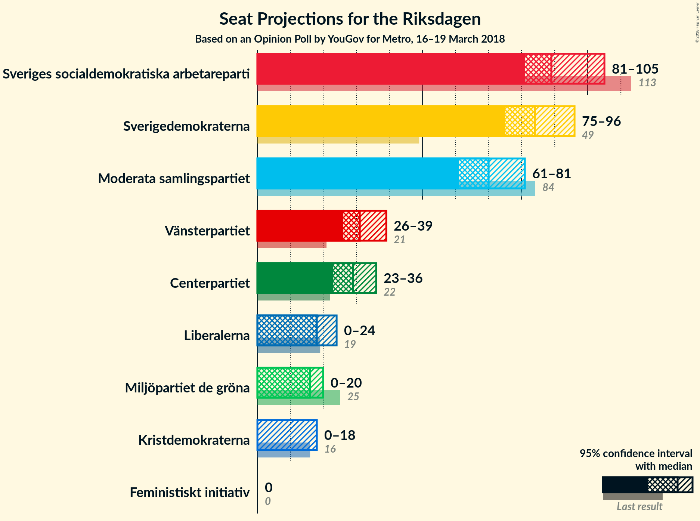
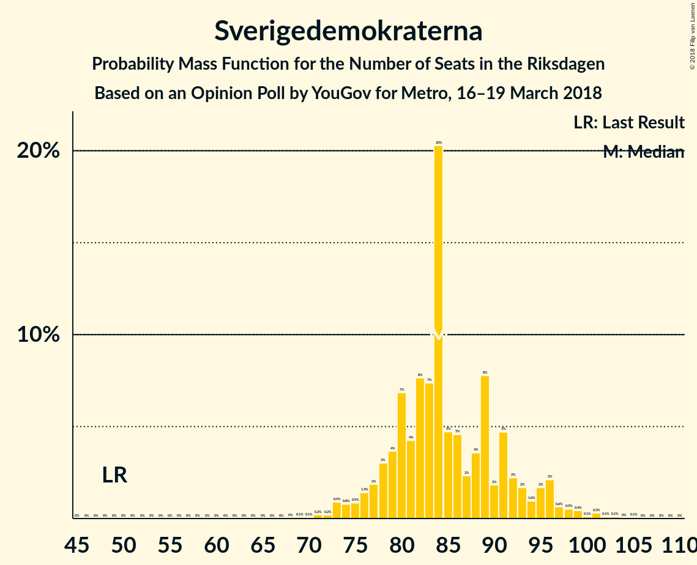
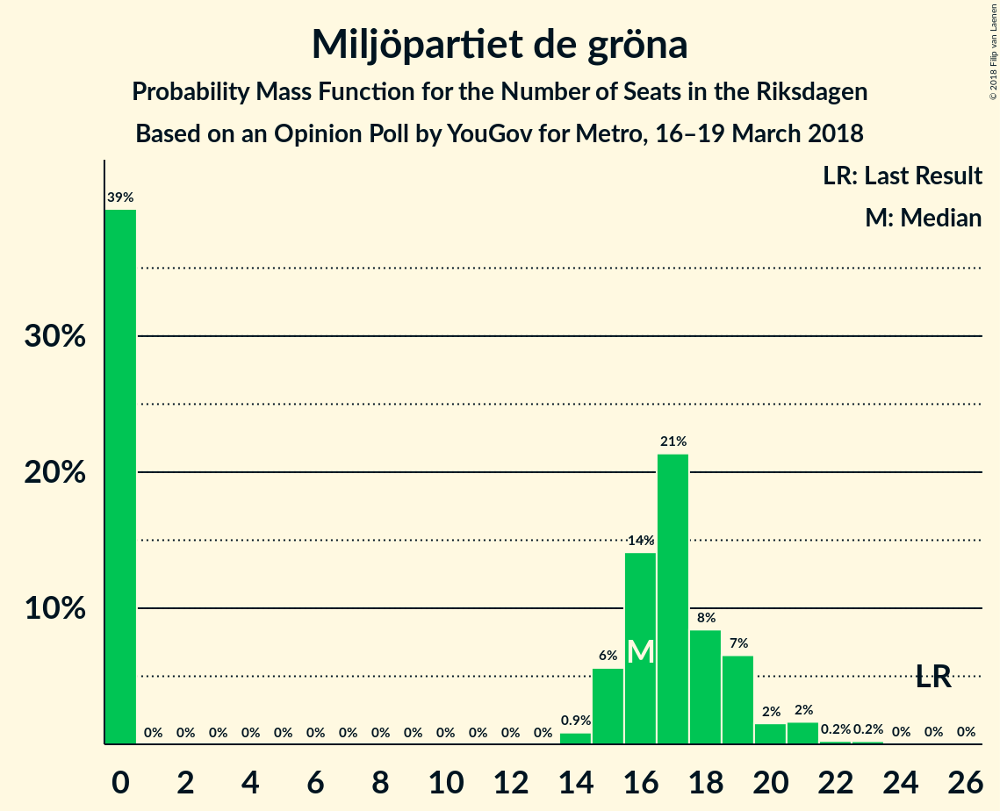

# Opinion Poll by YouGov for Metro, 16–19 March 2018

<a href="#voting-intentions">Voting Intentions</a> | <a href="#seats">Seats</a> | <a href="#coalitions">Coalitions</a> | <a href="#technical-information">Technical Information</a>

## Voting Intentions

### Confidence Intervals

| Party | Last Result | Poll Result | 80% Confidence Interval | 90% Confidence Interval | 95% Confidence Interval | 99% Confidence Interval |
|:-----:|:-----------:|:-----------:|:-----------------------:|:-----------------------:|:-----------------------:|:-----------------------:|
| Sveriges socialdemokratiska arbetareparti | 31.0% | 24.0% | 22.5–25.7% |22.0–26.2% |21.6–26.6% |20.9–27.4% |
| Sverigedemokraterna | 12.9% | 22.4% | 20.8–24.0% |20.4–24.5% |20.0–24.9% |19.3–25.7% |
| Moderata samlingspartiet | 23.3% | 18.8% | 17.3–20.3% |16.9–20.8% |16.6–21.2% |15.9–21.9% |
| Vänsterpartiet | 5.7% | 8.3% | 7.4–9.5% |7.1–9.8% |6.9–10.1% |6.4–10.7% |
| Centerpartiet | 6.1% | 7.6% | 6.7–8.7% |6.4–9.1% |6.2–9.3% |5.8–9.9% |
| Liberalerna | 5.4% | 4.7% | 4.0–5.7% |3.8–5.9% |3.6–6.1% |3.3–6.6% |
| Miljöpartiet de gröna | 6.9% | 4.0% | 3.4–4.9% |3.2–5.1% |3.0–5.3% |2.7–5.8% |
| Kristdemokraterna | 4.6% | 3.6% | 3.0–4.4% |2.8–4.6% |2.7–4.8% |2.4–5.3% |
| Feministiskt initiativ | 3.1% | 2.5% | 2.0–3.3% |1.9–3.5% |1.8–3.6% |1.6–4.0% |

*Note:* The poll result column reflects the actual value used in the calculations. Published results may vary slightly, and in addition be rounded to fewer digits.

## Seats

### Confidence Intervals

| Party | Last Result | Median | 80% Confidence Interval | 90% Confidence Interval | 95% Confidence Interval | 99% Confidence Interval |
|:-----:|:-----------:|:------:|:-----------------------:|:-----------------------:|:-----------------------:|:-----------------------:|
| <a href="#sveriges-socialdemokratiska-arbetareparti">Sveriges socialdemokratiska arbetareparti</a> | 113 | 89 | 84–99 |83–103 |81–105 |77–111 |
| <a href="#sverigedemokraterna">Sverigedemokraterna</a> | 49 | 84 | 79–92 |77–95 |75–96 |72–101 |
| <a href="#moderata-samlingspartiet">Moderata samlingspartiet</a> | 84 | 70 | 65–78 |61–80 |61–81 |59–86 |
| <a href="#vänsterpartiet">Vänsterpartiet</a> | 21 | 31 | 28–36 |27–38 |26–39 |24–41 |
| <a href="#centerpartiet">Centerpartiet</a> | 22 | 29 | 26–33 |24–35 |23–36 |22–38 |
| <a href="#liberalerna">Liberalerna</a> | 19 | 18 | 16–21 |0–23 |0–24 |0–25 |
| <a href="#miljöpartiet-de-gröna">Miljöpartiet de gröna</a> | 25 | 16 | 0–19 |0–19 |0–20 |0–22 |
| <a href="#kristdemokraterna">Kristdemokraterna</a> | 16 | 0 | 0–16 |0–17 |0–18 |0–19 |
| <a href="#feministiskt-initiativ">Feministiskt initiativ</a> | 0 | 0 | 0 |0 |0 |0–14 |

### Sveriges socialdemokratiska arbetareparti

*For a full overview of the results for this party, see the [Sveriges socialdemokratiska arbetareparti](party-sverigessocialdemokratiskaarbetareparti.html) page.*

| Number of Seats | Probability | Accumulated | Special Marks |
|:---------------:|:-----------:|:-----------:|:-------------:|
| 74 | 0% | 100% |  |
| 75 | 0.2% | 99.9% |  |
| 76 | 0.2% | 99.7% |  |
| 77 | 0.5% | 99.5% |  |
| 78 | 0.3% | 99.1% |  |
| 79 | 0.5% | 98.7% |  |
| 80 | 0.7% | 98% |  |
| 81 | 0.7% | 98% |  |
| 82 | 2% | 97% |  |
| 83 | 2% | 95% |  |
| 84 | 5% | 93% |  |
| 85 | 4% | 88% |  |
| 86 | 5% | 84% |  |
| 87 | 11% | 79% |  |
| 88 | 8% | 68% |  |
| 89 | 18% | 60% | Median |
| 90 | 6% | 43% |  |
| 91 | 3% | 36% |  |
| 92 | 7% | 34% |  |
| 93 | 2% | 26% |  |
| 94 | 3% | 24% |  |
| 95 | 3% | 21% |  |
| 96 | 2% | 18% |  |
| 97 | 2% | 17% |  |
| 98 | 4% | 14% |  |
| 99 | 3% | 11% |  |
| 100 | 0.7% | 8% |  |
| 101 | 2% | 7% |  |
| 102 | 0.4% | 6% |  |
| 103 | 1.0% | 5% |  |
| 104 | 0.9% | 4% |  |
| 105 | 1.4% | 3% |  |
| 106 | 1.1% | 2% |  |
| 107 | 0.2% | 0.9% |  |
| 108 | 0.1% | 0.7% |  |
| 109 | 0% | 0.6% |  |
| 110 | 0% | 0.6% |  |
| 111 | 0.4% | 0.5% |  |
| 112 | 0.1% | 0.1% |  |
| 113 | 0% | 0% | Last Result |

### Sverigedemokraterna

*For a full overview of the results for this party, see the [Sverigedemokraterna](party-sverigedemokraterna.html) page.*

| Number of Seats | Probability | Accumulated | Special Marks |
|:---------------:|:-----------:|:-----------:|:-------------:|
| 49 | 0% | 100% | Last Result |
| 50 | 0% | 100% |  |
| 51 | 0% | 100% |  |
| 52 | 0% | 100% |  |
| 53 | 0% | 100% |  |
| 54 | 0% | 100% |  |
| 55 | 0% | 100% |  |
| 56 | 0% | 100% |  |
| 57 | 0% | 100% |  |
| 58 | 0% | 100% |  |
| 59 | 0% | 100% |  |
| 60 | 0% | 100% |  |
| 61 | 0% | 100% |  |
| 62 | 0% | 100% |  |
| 63 | 0% | 100% |  |
| 64 | 0% | 100% |  |
| 65 | 0% | 100% |  |
| 66 | 0% | 100% |  |
| 67 | 0% | 100% |  |
| 68 | 0% | 100% |  |
| 69 | 0.1% | 99.9% |  |
| 70 | 0.1% | 99.9% |  |
| 71 | 0.2% | 99.8% |  |
| 72 | 0.2% | 99.6% |  |
| 73 | 0.9% | 99.4% |  |
| 74 | 0.8% | 98% |  |
| 75 | 0.9% | 98% |  |
| 76 | 1.4% | 97% |  |
| 77 | 2% | 95% |  |
| 78 | 3% | 94% |  |
| 79 | 4% | 91% |  |
| 80 | 7% | 87% |  |
| 81 | 4% | 80% |  |
| 82 | 8% | 76% |  |
| 83 | 7% | 68% |  |
| 84 | 20% | 61% | Median |
| 85 | 5% | 40% |  |
| 86 | 5% | 36% |  |
| 87 | 2% | 31% |  |
| 88 | 4% | 29% |  |
| 89 | 8% | 25% |  |
| 90 | 2% | 17% |  |
| 91 | 5% | 16% |  |
| 92 | 2% | 11% |  |
| 93 | 2% | 9% |  |
| 94 | 1.0% | 7% |  |
| 95 | 2% | 6% |  |
| 96 | 2% | 4% |  |
| 97 | 0.6% | 2% |  |
| 98 | 0.5% | 2% |  |
| 99 | 0.4% | 1.1% |  |
| 100 | 0.1% | 0.7% |  |
| 101 | 0.3% | 0.6% |  |
| 102 | 0.1% | 0.3% |  |
| 103 | 0.1% | 0.2% |  |
| 104 | 0% | 0.1% |  |
| 105 | 0.1% | 0.1% |  |
| 106 | 0% | 0% |  |

### Moderata samlingspartiet

*For a full overview of the results for this party, see the [Moderata samlingspartiet](party-moderatasamlingspartiet.html) page.*

| Number of Seats | Probability | Accumulated | Special Marks |
|:---------------:|:-----------:|:-----------:|:-------------:|
| 56 | 0% | 100% |  |
| 57 | 0% | 99.9% |  |
| 58 | 0.2% | 99.9% |  |
| 59 | 0.3% | 99.7% |  |
| 60 | 0.9% | 99.4% |  |
| 61 | 4% | 98.6% |  |
| 62 | 1.4% | 95% |  |
| 63 | 1.2% | 94% |  |
| 64 | 2% | 92% |  |
| 65 | 2% | 90% |  |
| 66 | 9% | 88% |  |
| 67 | 19% | 80% |  |
| 68 | 3% | 61% |  |
| 69 | 4% | 58% |  |
| 70 | 6% | 53% | Median |
| 71 | 6% | 48% |  |
| 72 | 4% | 41% |  |
| 73 | 5% | 38% |  |
| 74 | 6% | 32% |  |
| 75 | 10% | 26% |  |
| 76 | 3% | 17% |  |
| 77 | 3% | 14% |  |
| 78 | 2% | 11% |  |
| 79 | 3% | 9% |  |
| 80 | 4% | 6% |  |
| 81 | 0.7% | 3% |  |
| 82 | 0.5% | 2% |  |
| 83 | 0.3% | 1.5% |  |
| 84 | 0.2% | 1.2% | Last Result |
| 85 | 0.3% | 1.0% |  |
| 86 | 0.3% | 0.7% |  |
| 87 | 0.1% | 0.4% |  |
| 88 | 0.1% | 0.3% |  |
| 89 | 0.1% | 0.2% |  |
| 90 | 0.1% | 0.2% |  |
| 91 | 0.1% | 0.1% |  |
| 92 | 0% | 0% |  |

### Vänsterpartiet

*For a full overview of the results for this party, see the [Vänsterpartiet](party-vänsterpartiet.html) page.*

| Number of Seats | Probability | Accumulated | Special Marks |
|:---------------:|:-----------:|:-----------:|:-------------:|
| 21 | 0% | 100% | Last Result |
| 22 | 0% | 100% |  |
| 23 | 0.2% | 99.9% |  |
| 24 | 0.4% | 99.7% |  |
| 25 | 0.8% | 99.3% |  |
| 26 | 2% | 98.5% |  |
| 27 | 3% | 96% |  |
| 28 | 7% | 93% |  |
| 29 | 6% | 86% |  |
| 30 | 23% | 80% |  |
| 31 | 11% | 57% | Median |
| 32 | 10% | 46% |  |
| 33 | 6% | 37% |  |
| 34 | 7% | 30% |  |
| 35 | 10% | 24% |  |
| 36 | 5% | 13% |  |
| 37 | 2% | 8% |  |
| 38 | 2% | 6% |  |
| 39 | 2% | 4% |  |
| 40 | 1.1% | 2% |  |
| 41 | 0.3% | 0.7% |  |
| 42 | 0.1% | 0.4% |  |
| 43 | 0.2% | 0.3% |  |
| 44 | 0% | 0.1% |  |
| 45 | 0% | 0% |  |

### Centerpartiet

*For a full overview of the results for this party, see the [Centerpartiet](party-centerpartiet.html) page.*

| Number of Seats | Probability | Accumulated | Special Marks |
|:---------------:|:-----------:|:-----------:|:-------------:|
| 20 | 0.1% | 100% |  |
| 21 | 0.1% | 99.9% |  |
| 22 | 0.7% | 99.8% | Last Result |
| 23 | 2% | 99.0% |  |
| 24 | 3% | 97% |  |
| 25 | 4% | 95% |  |
| 26 | 7% | 91% |  |
| 27 | 9% | 84% |  |
| 28 | 24% | 75% |  |
| 29 | 15% | 51% | Median |
| 30 | 11% | 36% |  |
| 31 | 7% | 25% |  |
| 32 | 7% | 18% |  |
| 33 | 3% | 11% |  |
| 34 | 3% | 8% |  |
| 35 | 2% | 5% |  |
| 36 | 1.3% | 4% |  |
| 37 | 1.3% | 2% |  |
| 38 | 0.8% | 1.0% |  |
| 39 | 0.1% | 0.3% |  |
| 40 | 0.1% | 0.1% |  |
| 41 | 0% | 0.1% |  |
| 42 | 0% | 0% |  |

### Liberalerna

*For a full overview of the results for this party, see the [Liberalerna](party-liberalerna.html) page.*

| Number of Seats | Probability | Accumulated | Special Marks |
|:---------------:|:-----------:|:-----------:|:-------------:|
| 0 | 5% | 100% |  |
| 1 | 0% | 95% |  |
| 2 | 0% | 95% |  |
| 3 | 0% | 95% |  |
| 4 | 0% | 95% |  |
| 5 | 0% | 95% |  |
| 6 | 0% | 95% |  |
| 7 | 0% | 95% |  |
| 8 | 0% | 95% |  |
| 9 | 0% | 95% |  |
| 10 | 0% | 95% |  |
| 11 | 0% | 95% |  |
| 12 | 0% | 95% |  |
| 13 | 0% | 95% |  |
| 14 | 0% | 95% |  |
| 15 | 3% | 94% |  |
| 16 | 8% | 92% |  |
| 17 | 10% | 84% |  |
| 18 | 31% | 74% | Median |
| 19 | 7% | 43% | Last Result |
| 20 | 13% | 36% |  |
| 21 | 14% | 23% |  |
| 22 | 4% | 10% |  |
| 23 | 2% | 6% |  |
| 24 | 2% | 3% |  |
| 25 | 0.7% | 1.0% |  |
| 26 | 0.2% | 0.3% |  |
| 27 | 0.1% | 0.2% |  |
| 28 | 0% | 0% |  |

### Miljöpartiet de gröna

*For a full overview of the results for this party, see the [Miljöpartiet de gröna](party-miljöpartietdegröna.html) page.*

| Number of Seats | Probability | Accumulated | Special Marks |
|:---------------:|:-----------:|:-----------:|:-------------:|
| 0 | 39% | 100% |  |
| 1 | 0% | 61% |  |
| 2 | 0% | 61% |  |
| 3 | 0% | 61% |  |
| 4 | 0% | 61% |  |
| 5 | 0% | 61% |  |
| 6 | 0% | 61% |  |
| 7 | 0% | 61% |  |
| 8 | 0% | 61% |  |
| 9 | 0% | 61% |  |
| 10 | 0% | 61% |  |
| 11 | 0% | 61% |  |
| 12 | 0% | 61% |  |
| 13 | 0% | 61% |  |
| 14 | 0.9% | 61% |  |
| 15 | 6% | 60% |  |
| 16 | 14% | 54% | Median |
| 17 | 21% | 40% |  |
| 18 | 8% | 19% |  |
| 19 | 7% | 10% |  |
| 20 | 2% | 4% |  |
| 21 | 2% | 2% |  |
| 22 | 0.2% | 0.5% |  |
| 23 | 0.2% | 0.3% |  |
| 24 | 0% | 0.1% |  |
| 25 | 0% | 0% | Last Result |

### Kristdemokraterna

*For a full overview of the results for this party, see the [Kristdemokraterna](party-kristdemokraterna.html) page.*

| Number of Seats | Probability | Accumulated | Special Marks |
|:---------------:|:-----------:|:-----------:|:-------------:|
| 0 | 78% | 100% | Median |
| 1 | 0% | 22% |  |
| 2 | 0% | 22% |  |
| 3 | 0% | 22% |  |
| 4 | 0% | 22% |  |
| 5 | 0% | 22% |  |
| 6 | 0% | 22% |  |
| 7 | 0% | 22% |  |
| 8 | 0% | 22% |  |
| 9 | 0% | 22% |  |
| 10 | 0% | 22% |  |
| 11 | 0% | 22% |  |
| 12 | 0% | 22% |  |
| 13 | 0% | 22% |  |
| 14 | 2% | 22% |  |
| 15 | 4% | 20% |  |
| 16 | 7% | 15% | Last Result |
| 17 | 5% | 8% |  |
| 18 | 2% | 3% |  |
| 19 | 0.7% | 1.1% |  |
| 20 | 0.3% | 0.4% |  |
| 21 | 0.1% | 0.2% |  |
| 22 | 0% | 0.1% |  |
| 23 | 0% | 0% |  |

### Feministiskt initiativ

*For a full overview of the results for this party, see the [Feministiskt initiativ](party-feministisktinitiativ.html) page.*

| Number of Seats | Probability | Accumulated | Special Marks |
|:---------------:|:-----------:|:-----------:|:-------------:|
| 0 | 99.5% | 100% | Last Result, Median |
| 1 | 0% | 0.5% |  |
| 2 | 0% | 0.5% |  |
| 3 | 0% | 0.5% |  |
| 4 | 0% | 0.5% |  |
| 5 | 0% | 0.5% |  |
| 6 | 0% | 0.5% |  |
| 7 | 0% | 0.5% |  |
| 8 | 0% | 0.5% |  |
| 9 | 0% | 0.5% |  |
| 10 | 0% | 0.5% |  |
| 11 | 0% | 0.5% |  |
| 12 | 0% | 0.5% |  |
| 13 | 0% | 0.5% |  |
| 14 | 0% | 0.5% |  |
| 15 | 0.2% | 0.5% |  |
| 16 | 0.2% | 0.3% |  |
| 17 | 0.1% | 0.1% |  |
| 18 | 0% | 0% |  |

## Coalitions

### Confidence Intervals

| Coalition | Last Result | Median | Majority? | 80% Confidence Interval | 90% Confidence Interval | 95% Confidence Interval | 99% Confidence Interval |
|:---------:|:-----------:|:------:|:---------:|:-----------------------:|:-----------------------:|:-----------------------:|:-----------------------:|
| Sveriges socialdemokratiska arbetareparti – Vänsterpartiet – Miljöpartiet de gröna – Feministiskt initiativ | 159 | 135 | 0% | 119–142 | 118–145 | 117–149 | 111–156 |
| Sveriges socialdemokratiska arbetareparti – Vänsterpartiet – Miljöpartiet de gröna | 159 | 135 | 0% | 119–142 | 118–145 | 117–148 | 111–156 |
| Sveriges socialdemokratiska arbetareparti – Vänsterpartiet | 134 | 120 | 0% | 115–133 | 113–135 | 111–139 | 106–145 |
| Moderata samlingspartiet – Centerpartiet – Liberalerna – Kristdemokraterna | 141 | 122 | 0% | 112–133 | 109–136 | 107–139 | 101–145 |
| Moderata samlingspartiet – Centerpartiet – Liberalerna | 125 | 117 | 0% | 109–127 | 106–130 | 104–132 | 98–135 |
| Moderata samlingspartiet – Centerpartiet – Kristdemokraterna | 122 | 102 | 0% | 95–115 | 93–119 | 92–122 | 88–128 |
| Sveriges socialdemokratiska arbetareparti – Miljöpartiet de gröna | 138 | 102 | 0% | 88–110 | 87–113 | 85–115 | 82–121 |
| Moderata samlingspartiet – Centerpartiet | 106 | 100 | 0% | 93–109 | 89–111 | 89–113 | 85–119 |

