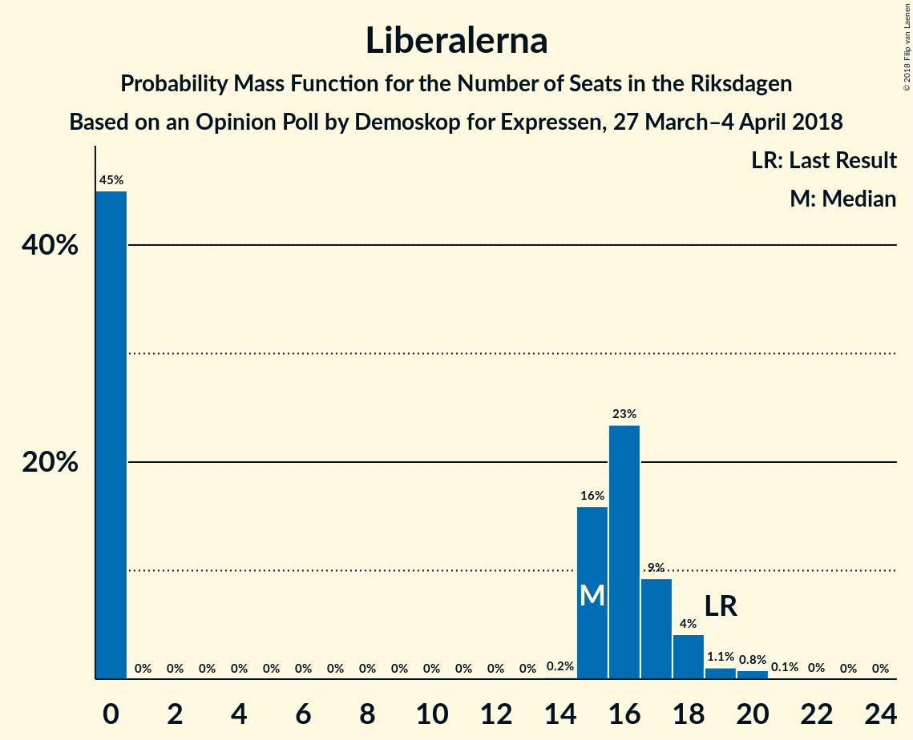

# Opinion Poll by Demoskop for Expressen, 27 March–4 April 2018

<a href="#voting-intentions">Voting Intentions</a> | <a href="#seats">Seats</a> | <a href="#coalitions">Coalitions</a> | <a href="#technical-information">Technical Information</a>

## Voting Intentions

### Confidence Intervals

| Party | Last Result | Poll Result | 80% Confidence Interval | 90% Confidence Interval | 95% Confidence Interval | 99% Confidence Interval |
|:-----:|:-----------:|:-----------:|:-----------------------:|:-----------------------:|:-----------------------:|:-----------------------:|
| Sveriges socialdemokratiska arbetareparti | 31.0% | 25.9% | 24.5–27.3% |24.1–27.7% |23.8–28.1% |23.1–28.8% |
| Moderata samlingspartiet | 23.3% | 22.2% | 20.9–23.6% |20.5–24.0% |20.2–24.3% |19.6–25.0% |
| Sverigedemokraterna | 12.9% | 18.8% | 17.6–20.1% |17.3–20.5% |17.0–20.8% |16.4–21.4% |
| Centerpartiet | 6.1% | 9.5% | 8.6–10.5% |8.4–10.8% |8.2–11.1% |7.7–11.5% |
| Vänsterpartiet | 5.7% | 8.7% | 7.8–9.7% |7.6–9.9% |7.4–10.2% |7.0–10.7% |
| Miljöpartiet de gröna | 6.9% | 5.2% | 4.5–6.0% |4.4–6.2% |4.2–6.4% |3.9–6.8% |
| Liberalerna | 5.4% | 4.0% | 3.4–4.7% |3.3–4.9% |3.1–5.1% |2.9–5.4% |
| Kristdemokraterna | 4.6% | 3.3% | 2.8–4.0% |2.7–4.1% |2.5–4.3% |2.3–4.6% |
| Feministiskt initiativ | 3.1% | 1.3% | 1.0–1.8% |0.9–1.9% |0.9–2.0% |0.7–2.2% |

*Note:* The poll result column reflects the actual value used in the calculations. Published results may vary slightly, and in addition be rounded to fewer digits.

## Seats

### Confidence Intervals

| Party | Last Result | Median | 80% Confidence Interval | 90% Confidence Interval | 95% Confidence Interval | 99% Confidence Interval |
|:-----:|:-----------:|:------:|:-----------------------:|:-----------------------:|:-----------------------:|:-----------------------:|
| <a href="#sveriges-socialdemokratiska-arbetareparti">Sveriges socialdemokratiska arbetareparti</a> | 113 | 90 | 90–99 |90–99 |90–99 |90–100 |
| <a href="#moderata-samlingspartiet">Moderata samlingspartiet</a> | 84 | 81 | 81–89 |76–89 |76–89 |76–89 |
| <a href="#sverigedemokraterna">Sverigedemokraterna</a> | 49 | 69 | 69–83 |68–83 |68–83 |68–83 |
| <a href="#centerpartiet">Centerpartiet</a> | 22 | 37 | 29–38 |29–38 |29–38 |29–39 |
| <a href="#vänsterpartiet">Vänsterpartiet</a> | 21 | 37 | 34–37 |34–37 |34–37 |34–37 |
| <a href="#miljöpartiet-de-gröna">Miljöpartiet de gröna</a> | 25 | 19 | 18–20 |0–24 |0–24 |0–24 |
| <a href="#liberalerna">Liberalerna</a> | 19 | 16 | 0–16 |0–19 |0–19 |0–19 |
| <a href="#kristdemokraterna">Kristdemokraterna</a> | 16 | 0 | 0 |0–15 |0–15 |0–15 |
| <a href="#feministiskt-initiativ">Feministiskt initiativ</a> | 0 | 0 | 0 |0 |0 |0 |

### Sveriges socialdemokratiska arbetareparti

*For a full overview of the results for this party, see the [Sveriges socialdemokratiska arbetareparti](party-sverigessocialdemokratiskaarbetareparti.html) page.*

| Number of Seats | Probability | Accumulated | Special Marks |
|:---------------:|:-----------:|:-----------:|:-------------:|
| 90 | 69% | 100% | Median |
| 91 | 8% | 31% |  |
| 92 | 0% | 23% |  |
| 93 | 0% | 23% |  |
| 94 | 13% | 23% |  |
| 95 | 0% | 11% |  |
| 96 | 0.1% | 11% |  |
| 97 | 0.5% | 11% |  |
| 98 | 0% | 10% |  |
| 99 | 10% | 10% |  |
| 100 | 0.5% | 0.6% |  |
| 101 | 0% | 0% |  |
| 102 | 0% | 0% |  |
| 103 | 0% | 0% |  |
| 104 | 0% | 0% |  |
| 105 | 0% | 0% |  |
| 106 | 0% | 0% |  |
| 107 | 0% | 0% |  |
| 108 | 0% | 0% |  |
| 109 | 0% | 0% |  |
| 110 | 0% | 0% |  |
| 111 | 0% | 0% |  |
| 112 | 0% | 0% |  |
| 113 | 0% | 0% | Last Result |

### Moderata samlingspartiet

*For a full overview of the results for this party, see the [Moderata samlingspartiet](party-moderatasamlingspartiet.html) page.*

| Number of Seats | Probability | Accumulated | Special Marks |
|:---------------:|:-----------:|:-----------:|:-------------:|
| 76 | 8% | 100% |  |
| 77 | 0% | 92% |  |
| 78 | 0% | 92% |  |
| 79 | 0% | 92% |  |
| 80 | 0% | 92% |  |
| 81 | 69% | 92% | Median |
| 82 | 0% | 23% |  |
| 83 | 0% | 23% |  |
| 84 | 0% | 23% | Last Result |
| 85 | 1.0% | 23% |  |
| 86 | 0% | 22% |  |
| 87 | 0% | 22% |  |
| 88 | 0% | 22% |  |
| 89 | 22% | 22% |  |
| 90 | 0.1% | 0.1% |  |
| 91 | 0% | 0% |  |

### Sverigedemokraterna

*For a full overview of the results for this party, see the [Sverigedemokraterna](party-sverigedemokraterna.html) page.*

| Number of Seats | Probability | Accumulated | Special Marks |
|:---------------:|:-----------:|:-----------:|:-------------:|
| 49 | 0% | 100% | Last Result |
| 50 | 0% | 100% |  |
| 51 | 0% | 100% |  |
| 52 | 0% | 100% |  |
| 53 | 0% | 100% |  |
| 54 | 0% | 100% |  |
| 55 | 0% | 100% |  |
| 56 | 0% | 100% |  |
| 57 | 0% | 100% |  |
| 58 | 0% | 100% |  |
| 59 | 0% | 100% |  |
| 60 | 0% | 100% |  |
| 61 | 0% | 100% |  |
| 62 | 0% | 100% |  |
| 63 | 0% | 100% |  |
| 64 | 0% | 100% |  |
| 65 | 0% | 100% |  |
| 66 | 0% | 100% |  |
| 67 | 0% | 100% |  |
| 68 | 10% | 100% |  |
| 69 | 69% | 90% | Median |
| 70 | 0% | 21% |  |
| 71 | 9% | 21% |  |
| 72 | 0% | 13% |  |
| 73 | 0% | 13% |  |
| 74 | 0% | 13% |  |
| 75 | 0% | 13% |  |
| 76 | 0% | 13% |  |
| 77 | 0% | 13% |  |
| 78 | 0% | 13% |  |
| 79 | 0% | 13% |  |
| 80 | 0.1% | 13% |  |
| 81 | 0% | 13% |  |
| 82 | 0% | 13% |  |
| 83 | 13% | 13% |  |
| 84 | 0% | 0% |  |

### Centerpartiet

*For a full overview of the results for this party, see the [Centerpartiet](party-centerpartiet.html) page.*

| Number of Seats | Probability | Accumulated | Special Marks |
|:---------------:|:-----------:|:-----------:|:-------------:|
| 22 | 0% | 100% | Last Result |
| 23 | 0% | 100% |  |
| 24 | 0% | 100% |  |
| 25 | 0% | 100% |  |
| 26 | 0% | 100% |  |
| 27 | 0% | 100% |  |
| 28 | 0% | 100% |  |
| 29 | 13% | 100% |  |
| 30 | 0% | 87% |  |
| 31 | 0% | 87% |  |
| 32 | 0% | 87% |  |
| 33 | 0.1% | 87% |  |
| 34 | 0% | 87% |  |
| 35 | 0% | 87% |  |
| 36 | 0% | 87% |  |
| 37 | 69% | 87% | Median |
| 38 | 18% | 19% |  |
| 39 | 0.5% | 1.0% |  |
| 40 | 0% | 0.5% |  |
| 41 | 0% | 0.5% |  |
| 42 | 0% | 0.5% |  |
| 43 | 0.5% | 0.5% |  |
| 44 | 0% | 0% |  |

### Vänsterpartiet

*For a full overview of the results for this party, see the [Vänsterpartiet](party-vänsterpartiet.html) page.*

| Number of Seats | Probability | Accumulated | Special Marks |
|:---------------:|:-----------:|:-----------:|:-------------:|
| 21 | 0% | 100% | Last Result |
| 22 | 0% | 100% |  |
| 23 | 0% | 100% |  |
| 24 | 0% | 100% |  |
| 25 | 0% | 100% |  |
| 26 | 0% | 100% |  |
| 27 | 0% | 100% |  |
| 28 | 0% | 100% |  |
| 29 | 0% | 100% |  |
| 30 | 0% | 100% |  |
| 31 | 0% | 100% |  |
| 32 | 0% | 100% |  |
| 33 | 0.1% | 100% |  |
| 34 | 21% | 99.9% |  |
| 35 | 0% | 79% |  |
| 36 | 10% | 79% |  |
| 37 | 69% | 69% | Median |
| 38 | 0% | 0% |  |

### Miljöpartiet de gröna

*For a full overview of the results for this party, see the [Miljöpartiet de gröna](party-miljöpartietdegröna.html) page.*

| Number of Seats | Probability | Accumulated | Special Marks |
|:---------------:|:-----------:|:-----------:|:-------------:|
| 0 | 10% | 100% |  |
| 1 | 0% | 90% |  |
| 2 | 0% | 90% |  |
| 3 | 0% | 90% |  |
| 4 | 0% | 90% |  |
| 5 | 0% | 90% |  |
| 6 | 0% | 90% |  |
| 7 | 0% | 90% |  |
| 8 | 0% | 90% |  |
| 9 | 0% | 90% |  |
| 10 | 0% | 90% |  |
| 11 | 0% | 90% |  |
| 12 | 0% | 90% |  |
| 13 | 0% | 90% |  |
| 14 | 0% | 90% |  |
| 15 | 0% | 90% |  |
| 16 | 0% | 90% |  |
| 17 | 0.1% | 90% |  |
| 18 | 0.5% | 90% |  |
| 19 | 69% | 90% | Median |
| 20 | 13% | 21% |  |
| 21 | 0% | 8% |  |
| 22 | 0% | 8% |  |
| 23 | 0% | 8% |  |
| 24 | 8% | 8% |  |
| 25 | 0% | 0% | Last Result |

### Liberalerna

*For a full overview of the results for this party, see the [Liberalerna](party-liberalerna.html) page.*

| Number of Seats | Probability | Accumulated | Special Marks |
|:---------------:|:-----------:|:-----------:|:-------------:|
| 0 | 22% | 100% |  |
| 1 | 0% | 78% |  |
| 2 | 0% | 78% |  |
| 3 | 0% | 78% |  |
| 4 | 0% | 78% |  |
| 5 | 0% | 78% |  |
| 6 | 0% | 78% |  |
| 7 | 0% | 78% |  |
| 8 | 0% | 78% |  |
| 9 | 0% | 78% |  |
| 10 | 0% | 78% |  |
| 11 | 0% | 78% |  |
| 12 | 0% | 78% |  |
| 13 | 0% | 78% |  |
| 14 | 0% | 78% |  |
| 15 | 0% | 78% |  |
| 16 | 69% | 78% | Median |
| 17 | 0% | 10% |  |
| 18 | 0% | 10% |  |
| 19 | 10% | 10% | Last Result |
| 20 | 0% | 0% |  |

### Kristdemokraterna

*For a full overview of the results for this party, see the [Kristdemokraterna](party-kristdemokraterna.html) page.*

| Number of Seats | Probability | Accumulated | Special Marks |
|:---------------:|:-----------:|:-----------:|:-------------:|
| 0 | 92% | 100% | Median |
| 1 | 0% | 8% |  |
| 2 | 0% | 8% |  |
| 3 | 0% | 8% |  |
| 4 | 0% | 8% |  |
| 5 | 0% | 8% |  |
| 6 | 0% | 8% |  |
| 7 | 0% | 8% |  |
| 8 | 0% | 8% |  |
| 9 | 0% | 8% |  |
| 10 | 0% | 8% |  |
| 11 | 0% | 8% |  |
| 12 | 0% | 8% |  |
| 13 | 0% | 8% |  |
| 14 | 0% | 8% |  |
| 15 | 8% | 8% |  |
| 16 | 0% | 0% | Last Result |

### Feministiskt initiativ

*For a full overview of the results for this party, see the [Feministiskt initiativ](party-feministisktinitiativ.html) page.*

| Number of Seats | Probability | Accumulated | Special Marks |
|:---------------:|:-----------:|:-----------:|:-------------:|
| 0 | 100% | 100% | Last Result, Median |

## Coalitions

### Confidence Intervals

| Coalition | Last Result | Median | Majority? | 80% Confidence Interval | 90% Confidence Interval | 95% Confidence Interval | 99% Confidence Interval |
|:---------:|:-----------:|:------:|:---------:|:-----------------------:|:-----------------------:|:-----------------------:|:-----------------------:|
| Sveriges socialdemokratiska arbetareparti – Vänsterpartiet – Miljöpartiet de gröna – Feministiskt initiativ | 159 | 146 | 0% | 146–148 | 135–149 | 135–149 | 135–154 |
| Sveriges socialdemokratiska arbetareparti – Vänsterpartiet – Miljöpartiet de gröna | 159 | 146 | 0% | 146–148 | 135–149 | 135–149 | 135–154 |
| Moderata samlingspartiet – Centerpartiet – Liberalerna – Kristdemokraterna | 141 | 134 | 0% | 118–134 | 118–146 | 118–146 | 118–146 |
| Moderata samlingspartiet – Centerpartiet – Liberalerna | 125 | 134 | 0% | 118–134 | 114–146 | 114–146 | 114–146 |
| Sveriges socialdemokratiska arbetareparti – Vänsterpartiet | 134 | 127 | 0% | 127–134 | 125–135 | 125–135 | 125–135 |
| Moderata samlingspartiet – Centerpartiet – Kristdemokraterna | 122 | 118 | 0% | 118–127 | 118–129 | 118–129 | 118–129 |
| Moderata samlingspartiet – Centerpartiet | 106 | 118 | 0% | 118–127 | 114–127 | 114–127 | 114–127 |

### Sveriges socialdemokratiska arbetareparti – Vänsterpartiet – Miljöpartiet de gröna – Feministiskt initiativ

| Number of Seats | Probability | Accumulated | Special Marks |
|:---------------:|:-----------:|:-----------:|:-------------:|
| 135 | 10% | 100% |  |
| 136 | 0% | 90% |  |
| 137 | 0% | 90% |  |
| 138 | 0% | 90% |  |
| 139 | 0% | 90% |  |
| 140 | 0% | 90% |  |
| 141 | 0% | 90% |  |
| 142 | 0% | 90% |  |
| 143 | 0% | 90% |  |
| 144 | 0% | 90% |  |
| 145 | 0% | 90% |  |
| 146 | 69% | 90% | Median |
| 147 | 0% | 22% |  |
| 148 | 13% | 22% |  |
| 149 | 8% | 9% |  |
| 150 | 0% | 1.1% |  |
| 151 | 0% | 1.1% |  |
| 152 | 0.5% | 1.0% |  |
| 153 | 0% | 0.6% |  |
| 154 | 0.5% | 0.6% |  |
| 155 | 0% | 0% |  |
| 156 | 0% | 0% |  |
| 157 | 0% | 0% |  |
| 158 | 0% | 0% |  |
| 159 | 0% | 0% | Last Result |

### Sveriges socialdemokratiska arbetareparti – Vänsterpartiet – Miljöpartiet de gröna

| Number of Seats | Probability | Accumulated | Special Marks |
|:---------------:|:-----------:|:-----------:|:-------------:|
| 135 | 10% | 100% |  |
| 136 | 0% | 90% |  |
| 137 | 0% | 90% |  |
| 138 | 0% | 90% |  |
| 139 | 0% | 90% |  |
| 140 | 0% | 90% |  |
| 141 | 0% | 90% |  |
| 142 | 0% | 90% |  |
| 143 | 0% | 90% |  |
| 144 | 0% | 90% |  |
| 145 | 0% | 90% |  |
| 146 | 69% | 90% | Median |
| 147 | 0% | 22% |  |
| 148 | 13% | 22% |  |
| 149 | 8% | 9% |  |
| 150 | 0% | 1.1% |  |
| 151 | 0% | 1.1% |  |
| 152 | 0.5% | 1.0% |  |
| 153 | 0% | 0.6% |  |
| 154 | 0.5% | 0.6% |  |
| 155 | 0% | 0% |  |
| 156 | 0% | 0% |  |
| 157 | 0% | 0% |  |
| 158 | 0% | 0% |  |
| 159 | 0% | 0% | Last Result |

### Moderata samlingspartiet – Centerpartiet – Liberalerna – Kristdemokraterna

| Number of Seats | Probability | Accumulated | Special Marks |
|:---------------:|:-----------:|:-----------:|:-------------:|
| 118 | 13% | 100% |  |
| 119 | 0% | 87% |  |
| 120 | 0% | 87% |  |
| 121 | 0% | 87% |  |
| 122 | 0% | 87% |  |
| 123 | 0.1% | 87% |  |
| 124 | 0.5% | 87% |  |
| 125 | 0% | 87% |  |
| 126 | 0% | 87% |  |
| 127 | 0% | 87% |  |
| 128 | 0.5% | 87% |  |
| 129 | 8% | 86% |  |
| 130 | 0% | 78% |  |
| 131 | 0% | 78% |  |
| 132 | 0% | 78% |  |
| 133 | 0% | 78% |  |
| 134 | 69% | 78% | Median |
| 135 | 0% | 10% |  |
| 136 | 0% | 10% |  |
| 137 | 0% | 10% |  |
| 138 | 0% | 10% |  |
| 139 | 0% | 10% |  |
| 140 | 0% | 10% |  |
| 141 | 0% | 10% | Last Result |
| 142 | 0% | 10% |  |
| 143 | 0% | 10% |  |
| 144 | 0% | 10% |  |
| 145 | 0% | 10% |  |
| 146 | 10% | 10% |  |
| 147 | 0% | 0% |  |

### Moderata samlingspartiet – Centerpartiet – Liberalerna

| Number of Seats | Probability | Accumulated | Special Marks |
|:---------------:|:-----------:|:-----------:|:-------------:|
| 114 | 8% | 100% |  |
| 115 | 0% | 92% |  |
| 116 | 0% | 92% |  |
| 117 | 0% | 92% |  |
| 118 | 13% | 92% |  |
| 119 | 0% | 79% |  |
| 120 | 0% | 79% |  |
| 121 | 0% | 79% |  |
| 122 | 0% | 79% |  |
| 123 | 0.1% | 79% |  |
| 124 | 0.5% | 79% |  |
| 125 | 0% | 79% | Last Result |
| 126 | 0% | 79% |  |
| 127 | 0% | 79% |  |
| 128 | 0.5% | 79% |  |
| 129 | 0% | 78% |  |
| 130 | 0% | 78% |  |
| 131 | 0% | 78% |  |
| 132 | 0% | 78% |  |
| 133 | 0% | 78% |  |
| 134 | 69% | 78% | Median |
| 135 | 0% | 10% |  |
| 136 | 0% | 10% |  |
| 137 | 0% | 10% |  |
| 138 | 0% | 10% |  |
| 139 | 0% | 10% |  |
| 140 | 0% | 10% |  |
| 141 | 0% | 10% |  |
| 142 | 0% | 10% |  |
| 143 | 0% | 10% |  |
| 144 | 0% | 10% |  |
| 145 | 0% | 10% |  |
| 146 | 10% | 10% |  |
| 147 | 0% | 0% |  |

### Sveriges socialdemokratiska arbetareparti – Vänsterpartiet

| Number of Seats | Probability | Accumulated | Special Marks |
|:---------------:|:-----------:|:-----------:|:-------------:|
| 125 | 8% | 100% |  |
| 126 | 0% | 92% |  |
| 127 | 69% | 92% | Median |
| 128 | 13% | 23% |  |
| 129 | 0.1% | 11% |  |
| 130 | 0% | 11% |  |
| 131 | 0% | 11% |  |
| 132 | 0% | 11% |  |
| 133 | 0% | 11% |  |
| 134 | 1.0% | 11% | Last Result |
| 135 | 10% | 10% |  |
| 136 | 0% | 0% |  |

### Moderata samlingspartiet – Centerpartiet – Kristdemokraterna

| Number of Seats | Probability | Accumulated | Special Marks |
|:---------------:|:-----------:|:-----------:|:-------------:|
| 118 | 81% | 100% | Median |
| 119 | 0% | 19% |  |
| 120 | 0% | 19% |  |
| 121 | 0% | 19% |  |
| 122 | 0% | 19% | Last Result |
| 123 | 0.1% | 19% |  |
| 124 | 0.5% | 19% |  |
| 125 | 0% | 18% |  |
| 126 | 0% | 18% |  |
| 127 | 10% | 18% |  |
| 128 | 0.5% | 8% |  |
| 129 | 8% | 8% |  |
| 130 | 0% | 0% |  |

### Moderata samlingspartiet – Centerpartiet

| Number of Seats | Probability | Accumulated | Special Marks |
|:---------------:|:-----------:|:-----------:|:-------------:|
| 106 | 0% | 100% | Last Result |
| 107 | 0% | 100% |  |
| 108 | 0% | 100% |  |
| 109 | 0% | 100% |  |
| 110 | 0% | 100% |  |
| 111 | 0% | 100% |  |
| 112 | 0% | 100% |  |
| 113 | 0% | 100% |  |
| 114 | 8% | 100% |  |
| 115 | 0% | 92% |  |
| 116 | 0% | 92% |  |
| 117 | 0% | 92% |  |
| 118 | 81% | 92% | Median |
| 119 | 0% | 11% |  |
| 120 | 0% | 11% |  |
| 121 | 0% | 11% |  |
| 122 | 0% | 11% |  |
| 123 | 0.1% | 11% |  |
| 124 | 0.5% | 11% |  |
| 125 | 0% | 10% |  |
| 126 | 0% | 10% |  |
| 127 | 10% | 10% |  |
| 128 | 0.5% | 0.5% |  |
| 129 | 0% | 0% |  |

## Technical Information

### Opinion Poll

+ **Polling firm:** Demoskop
+ **Commissioner(s):** Expressen
+ **Fieldwork period:** 27 March–4 April 2018

### Calculations

+ **Sample size:** 1600
+ **Simulations done:** 1,024
+ **Error estimate:** 3.17%

