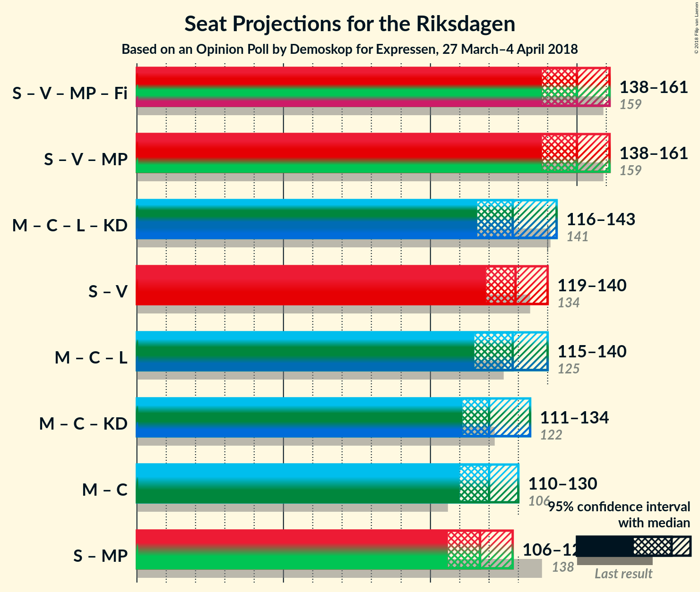

# Opinion Poll by Demoskop for Expressen, 27 March–4 April 2018

<a href="#voting-intentions">Voting Intentions</a> | <a href="#seats">Seats</a> | <a href="#coalitions">Coalitions</a> | <a href="#technical-information">Technical Information</a>

## Voting Intentions

### Confidence Intervals

| Party | Last Result | Poll Result | 80% Confidence Interval | 90% Confidence Interval | 95% Confidence Interval | 99% Confidence Interval |
|:-----:|:-----------:|:-----------:|:-----------------------:|:-----------------------:|:-----------------------:|:-----------------------:|
| Sveriges socialdemokratiska arbetareparti | 31.0% | 25.9% | 24.5–27.3% |24.1–27.7% |23.8–28.1% |23.1–28.8% |
| Moderata samlingspartiet | 23.3% | 22.2% | 20.9–23.6% |20.5–24.0% |20.2–24.3% |19.6–25.0% |
| Sverigedemokraterna | 12.9% | 18.8% | 17.6–20.1% |17.3–20.5% |17.0–20.8% |16.4–21.4% |
| Centerpartiet | 6.1% | 9.5% | 8.6–10.5% |8.4–10.8% |8.2–11.1% |7.7–11.5% |
| Vänsterpartiet | 5.7% | 8.7% | 7.8–9.7% |7.6–9.9% |7.4–10.2% |7.0–10.7% |
| Miljöpartiet de gröna | 6.9% | 5.2% | 4.5–6.0% |4.4–6.2% |4.2–6.4% |3.9–6.8% |
| Liberalerna | 5.4% | 4.0% | 3.4–4.7% |3.3–4.9% |3.1–5.1% |2.9–5.4% |
| Kristdemokraterna | 4.6% | 3.3% | 2.8–4.0% |2.7–4.1% |2.5–4.3% |2.3–4.6% |
| Feministiskt initiativ | 3.1% | 1.3% | 1.0–1.8% |0.9–1.9% |0.9–2.0% |0.7–2.2% |

*Note:* The poll result column reflects the actual value used in the calculations. Published results may vary slightly, and in addition be rounded to fewer digits.

## Seats

### Confidence Intervals

| Party | Last Result | Median | 80% Confidence Interval | 90% Confidence Interval | 95% Confidence Interval | 99% Confidence Interval |
|:-----:|:-----------:|:------:|:-----------------------:|:-----------------------:|:-----------------------:|:-----------------------:|
| <a href="#sveriges-socialdemokratiska-arbetareparti">Sveriges socialdemokratiska arbetareparti</a> | 113 | 97 | 92–103 |89–105 |88–106 |85–109 |
| <a href="#moderata-samlingspartiet">Moderata samlingspartiet</a> | 84 | 84 | 78–89 |77–90 |75–92 |73–94 |
| <a href="#sverigedemokraterna">Sverigedemokraterna</a> | 49 | 70 | 66–76 |64–77 |62–78 |61–82 |
| <a href="#centerpartiet">Centerpartiet</a> | 22 | 35 | 33–40 |31–41 |30–41 |29–44 |
| <a href="#vänsterpartiet">Vänsterpartiet</a> | 21 | 32 | 29–36 |29–37 |28–38 |26–40 |
| <a href="#miljöpartiet-de-gröna">Miljöpartiet de gröna</a> | 25 | 20 | 17–22 |16–23 |16–25 |0–25 |
| <a href="#liberalerna">Liberalerna</a> | 19 | 15 | 0–17 |0–18 |0–18 |0–20 |
| <a href="#kristdemokraterna">Kristdemokraterna</a> | 16 | 0 | 0 |0–15 |0–16 |0–17 |
| <a href="#feministiskt-initiativ">Feministiskt initiativ</a> | 0 | 0 | 0 |0 |0 |0 |

### Sveriges socialdemokratiska arbetareparti

*For a full overview of the results for this party, see the [Sveriges socialdemokratiska arbetareparti](party-sverigessocialdemokratiskaarbetareparti.html) page.*

| Number of Seats | Probability | Accumulated | Special Marks |
|:---------------:|:-----------:|:-----------:|:-------------:|
| 82 | 0.1% | 100% |  |
| 83 | 0.1% | 99.9% |  |
| 84 | 0.1% | 99.8% |  |
| 85 | 0.3% | 99.7% |  |
| 86 | 0.3% | 99.4% |  |
| 87 | 1.2% | 99.0% |  |
| 88 | 0.9% | 98% |  |
| 89 | 2% | 97% |  |
| 90 | 2% | 95% |  |
| 91 | 3% | 93% |  |
| 92 | 7% | 90% |  |
| 93 | 3% | 83% |  |
| 94 | 6% | 79% |  |
| 95 | 6% | 73% |  |
| 96 | 9% | 67% |  |
| 97 | 12% | 58% | Median |
| 98 | 7% | 46% |  |
| 99 | 10% | 39% |  |
| 100 | 9% | 29% |  |
| 101 | 6% | 20% |  |
| 102 | 3% | 15% |  |
| 103 | 3% | 11% |  |
| 104 | 3% | 8% |  |
| 105 | 2% | 5% |  |
| 106 | 2% | 4% |  |
| 107 | 1.0% | 2% |  |
| 108 | 0.5% | 1.2% |  |
| 109 | 0.4% | 0.7% |  |
| 110 | 0.1% | 0.2% |  |
| 111 | 0.1% | 0.2% |  |
| 112 | 0% | 0.1% |  |
| 113 | 0% | 0.1% | Last Result |
| 114 | 0% | 0% |  |

### Moderata samlingspartiet

*For a full overview of the results for this party, see the [Moderata samlingspartiet](party-moderatasamlingspartiet.html) page.*

| Number of Seats | Probability | Accumulated | Special Marks |
|:---------------:|:-----------:|:-----------:|:-------------:|
| 69 | 0% | 100% |  |
| 70 | 0% | 99.9% |  |
| 71 | 0.1% | 99.9% |  |
| 72 | 0.2% | 99.8% |  |
| 73 | 0.5% | 99.6% |  |
| 74 | 0.8% | 99.1% |  |
| 75 | 1.2% | 98% |  |
| 76 | 2% | 97% |  |
| 77 | 3% | 96% |  |
| 78 | 10% | 93% |  |
| 79 | 7% | 82% |  |
| 80 | 4% | 75% |  |
| 81 | 5% | 71% |  |
| 82 | 9% | 66% |  |
| 83 | 5% | 57% |  |
| 84 | 10% | 52% | Last Result, Median |
| 85 | 4% | 42% |  |
| 86 | 4% | 37% |  |
| 87 | 18% | 33% |  |
| 88 | 5% | 15% |  |
| 89 | 4% | 10% |  |
| 90 | 2% | 7% |  |
| 91 | 0.8% | 5% |  |
| 92 | 3% | 4% |  |
| 93 | 0.7% | 1.3% |  |
| 94 | 0.2% | 0.7% |  |
| 95 | 0.1% | 0.4% |  |
| 96 | 0.2% | 0.3% |  |
| 97 | 0.1% | 0.1% |  |
| 98 | 0% | 0.1% |  |
| 99 | 0% | 0% |  |

### Sverigedemokraterna

*For a full overview of the results for this party, see the [Sverigedemokraterna](party-sverigedemokraterna.html) page.*

| Number of Seats | Probability | Accumulated | Special Marks |
|:---------------:|:-----------:|:-----------:|:-------------:|
| 49 | 0% | 100% | Last Result |
| 50 | 0% | 100% |  |
| 51 | 0% | 100% |  |
| 52 | 0% | 100% |  |
| 53 | 0% | 100% |  |
| 54 | 0% | 100% |  |
| 55 | 0% | 100% |  |
| 56 | 0% | 100% |  |
| 57 | 0% | 100% |  |
| 58 | 0% | 100% |  |
| 59 | 0.1% | 99.9% |  |
| 60 | 0.1% | 99.9% |  |
| 61 | 0.6% | 99.8% |  |
| 62 | 2% | 99.1% |  |
| 63 | 2% | 97% |  |
| 64 | 1.4% | 96% |  |
| 65 | 3% | 94% |  |
| 66 | 8% | 92% |  |
| 67 | 2% | 83% |  |
| 68 | 5% | 81% |  |
| 69 | 13% | 76% |  |
| 70 | 14% | 63% | Median |
| 71 | 16% | 49% |  |
| 72 | 4% | 33% |  |
| 73 | 6% | 29% |  |
| 74 | 4% | 22% |  |
| 75 | 5% | 19% |  |
| 76 | 9% | 14% |  |
| 77 | 2% | 5% |  |
| 78 | 1.0% | 3% |  |
| 79 | 0.7% | 2% |  |
| 80 | 1.1% | 2% |  |
| 81 | 0.1% | 0.7% |  |
| 82 | 0.2% | 0.6% |  |
| 83 | 0.2% | 0.3% |  |
| 84 | 0% | 0.1% |  |
| 85 | 0% | 0.1% |  |
| 86 | 0% | 0% |  |

### Centerpartiet

*For a full overview of the results for this party, see the [Centerpartiet](party-centerpartiet.html) page.*

| Number of Seats | Probability | Accumulated | Special Marks |
|:---------------:|:-----------:|:-----------:|:-------------:|
| 22 | 0% | 100% | Last Result |
| 23 | 0% | 100% |  |
| 24 | 0% | 100% |  |
| 25 | 0% | 100% |  |
| 26 | 0% | 100% |  |
| 27 | 0% | 100% |  |
| 28 | 0.2% | 99.9% |  |
| 29 | 1.3% | 99.7% |  |
| 30 | 2% | 98% |  |
| 31 | 2% | 96% |  |
| 32 | 2% | 94% |  |
| 33 | 10% | 92% |  |
| 34 | 18% | 82% |  |
| 35 | 17% | 64% | Median |
| 36 | 11% | 46% |  |
| 37 | 12% | 35% |  |
| 38 | 4% | 23% |  |
| 39 | 5% | 20% |  |
| 40 | 9% | 15% |  |
| 41 | 3% | 6% |  |
| 42 | 1.3% | 2% |  |
| 43 | 0.6% | 1.1% |  |
| 44 | 0.2% | 0.5% |  |
| 45 | 0.2% | 0.3% |  |
| 46 | 0.1% | 0.1% |  |
| 47 | 0% | 0% |  |

### Vänsterpartiet

*For a full overview of the results for this party, see the [Vänsterpartiet](party-vänsterpartiet.html) page.*

| Number of Seats | Probability | Accumulated | Special Marks |
|:---------------:|:-----------:|:-----------:|:-------------:|
| 21 | 0% | 100% | Last Result |
| 22 | 0% | 100% |  |
| 23 | 0% | 100% |  |
| 24 | 0% | 100% |  |
| 25 | 0.3% | 99.9% |  |
| 26 | 0.7% | 99.7% |  |
| 27 | 0.8% | 99.0% |  |
| 28 | 3% | 98% |  |
| 29 | 9% | 96% |  |
| 30 | 23% | 87% |  |
| 31 | 11% | 64% |  |
| 32 | 10% | 53% | Median |
| 33 | 6% | 43% |  |
| 34 | 12% | 37% |  |
| 35 | 11% | 25% |  |
| 36 | 5% | 15% |  |
| 37 | 6% | 10% |  |
| 38 | 2% | 3% |  |
| 39 | 0.7% | 1.4% |  |
| 40 | 0.3% | 0.7% |  |
| 41 | 0.1% | 0.3% |  |
| 42 | 0.2% | 0.2% |  |
| 43 | 0% | 0.1% |  |
| 44 | 0% | 0% |  |

### Miljöpartiet de gröna

*For a full overview of the results for this party, see the [Miljöpartiet de gröna](party-miljöpartietdegröna.html) page.*

| Number of Seats | Probability | Accumulated | Special Marks |
|:---------------:|:-----------:|:-----------:|:-------------:|
| 0 | 0.6% | 100% |  |
| 1 | 0% | 99.4% |  |
| 2 | 0% | 99.4% |  |
| 3 | 0% | 99.4% |  |
| 4 | 0% | 99.4% |  |
| 5 | 0% | 99.4% |  |
| 6 | 0% | 99.4% |  |
| 7 | 0% | 99.4% |  |
| 8 | 0% | 99.4% |  |
| 9 | 0% | 99.4% |  |
| 10 | 0% | 99.4% |  |
| 11 | 0% | 99.4% |  |
| 12 | 0% | 99.4% |  |
| 13 | 0% | 99.4% |  |
| 14 | 0% | 99.4% |  |
| 15 | 2% | 99.4% |  |
| 16 | 3% | 98% |  |
| 17 | 9% | 95% |  |
| 18 | 12% | 86% |  |
| 19 | 13% | 74% |  |
| 20 | 23% | 60% | Median |
| 21 | 9% | 37% |  |
| 22 | 20% | 28% |  |
| 23 | 3% | 8% |  |
| 24 | 1.4% | 5% |  |
| 25 | 3% | 3% | Last Result |
| 26 | 0.2% | 0.4% |  |
| 27 | 0.2% | 0.2% |  |
| 28 | 0% | 0% |  |

### Liberalerna

*For a full overview of the results for this party, see the [Liberalerna](party-liberalerna.html) page.*

| Number of Seats | Probability | Accumulated | Special Marks |
|:---------------:|:-----------:|:-----------:|:-------------:|
| 0 | 45% | 100% |  |
| 1 | 0% | 55% |  |
| 2 | 0% | 55% |  |
| 3 | 0% | 55% |  |
| 4 | 0% | 55% |  |
| 5 | 0% | 55% |  |
| 6 | 0% | 55% |  |
| 7 | 0% | 55% |  |
| 8 | 0% | 55% |  |
| 9 | 0% | 55% |  |
| 10 | 0% | 55% |  |
| 11 | 0% | 55% |  |
| 12 | 0% | 55% |  |
| 13 | 0% | 55% |  |
| 14 | 0.2% | 55% |  |
| 15 | 16% | 55% | Median |
| 16 | 23% | 39% |  |
| 17 | 9% | 15% |  |
| 18 | 4% | 6% |  |
| 19 | 1.1% | 2% | Last Result |
| 20 | 0.8% | 1.0% |  |
| 21 | 0.1% | 0.2% |  |
| 22 | 0% | 0.1% |  |
| 23 | 0% | 0% |  |

### Kristdemokraterna

*For a full overview of the results for this party, see the [Kristdemokraterna](party-kristdemokraterna.html) page.*

| Number of Seats | Probability | Accumulated | Special Marks |
|:---------------:|:-----------:|:-----------:|:-------------:|
| 0 | 93% | 100% | Median |
| 1 | 0% | 7% |  |
| 2 | 0% | 7% |  |
| 3 | 0% | 7% |  |
| 4 | 0% | 7% |  |
| 5 | 0% | 7% |  |
| 6 | 0% | 7% |  |
| 7 | 0% | 7% |  |
| 8 | 0% | 7% |  |
| 9 | 0% | 7% |  |
| 10 | 0% | 7% |  |
| 11 | 0% | 7% |  |
| 12 | 0% | 7% |  |
| 13 | 0% | 7% |  |
| 14 | 0.4% | 7% |  |
| 15 | 3% | 6% |  |
| 16 | 2% | 3% | Last Result |
| 17 | 0.5% | 0.8% |  |
| 18 | 0.2% | 0.2% |  |
| 19 | 0% | 0.1% |  |
| 20 | 0% | 0% |  |

### Feministiskt initiativ

*For a full overview of the results for this party, see the [Feministiskt initiativ](party-feministisktinitiativ.html) page.*

| Number of Seats | Probability | Accumulated | Special Marks |
|:---------------:|:-----------:|:-----------:|:-------------:|
| 0 | 100% | 100% | Last Result, Median |

## Coalitions

### Confidence Intervals

| Coalition | Last Result | Median | Majority? | 80% Confidence Interval | 90% Confidence Interval | 95% Confidence Interval | 99% Confidence Interval |
|:---------:|:-----------:|:------:|:---------:|:-----------------------:|:-----------------------:|:-----------------------:|:-----------------------:|
| Sveriges socialdemokratiska arbetareparti – Vänsterpartiet – Miljöpartiet de gröna – Feministiskt initiativ | 159 | 150 | 0% | 142–156 | 140–159 | 138–161 | 134–163 |
| Sveriges socialdemokratiska arbetareparti – Vänsterpartiet – Miljöpartiet de gröna | 159 | 150 | 0% | 142–156 | 140–159 | 138–161 | 134–163 |
| Moderata samlingspartiet – Centerpartiet – Liberalerna – Kristdemokraterna | 141 | 128 | 0% | 120–138 | 118–140 | 116–143 | 113–149 |
| Sveriges socialdemokratiska arbetareparti – Vänsterpartiet | 134 | 129 | 0% | 122–136 | 121–138 | 119–140 | 117–143 |
| Moderata samlingspartiet – Centerpartiet – Liberalerna | 125 | 128 | 0% | 119–136 | 117–138 | 115–140 | 111–143 |
| Moderata samlingspartiet – Centerpartiet – Kristdemokraterna | 122 | 120 | 0% | 112–127 | 112–130 | 111–134 | 108–138 |
| Moderata samlingspartiet – Centerpartiet | 106 | 120 | 0% | 112–127 | 111–127 | 110–130 | 106–132 |
| Sveriges socialdemokratiska arbetareparti – Miljöpartiet de gröna | 138 | 117 | 0% | 111–123 | 108–126 | 106–128 | 102–129 |

### Sveriges socialdemokratiska arbetareparti – Vänsterpartiet – Miljöpartiet de gröna – Feministiskt initiativ

| Number of Seats | Probability | Accumulated | Special Marks |
|:---------------:|:-----------:|:-----------:|:-------------:|
| 128 | 0% | 100% |  |
| 129 | 0.1% | 99.9% |  |
| 130 | 0% | 99.9% |  |
| 131 | 0.1% | 99.8% |  |
| 132 | 0% | 99.8% |  |
| 133 | 0.1% | 99.7% |  |
| 134 | 0.2% | 99.6% |  |
| 135 | 0.3% | 99.4% |  |
| 136 | 0.9% | 99.1% |  |
| 137 | 0.6% | 98% |  |
| 138 | 0.8% | 98% |  |
| 139 | 0.9% | 97% |  |
| 140 | 2% | 96% |  |
| 141 | 1.4% | 94% |  |
| 142 | 5% | 92% |  |
| 143 | 8% | 87% |  |
| 144 | 2% | 79% |  |
| 145 | 4% | 77% |  |
| 146 | 4% | 73% |  |
| 147 | 6% | 69% |  |
| 148 | 4% | 63% |  |
| 149 | 4% | 59% | Median |
| 150 | 14% | 55% |  |
| 151 | 7% | 42% |  |
| 152 | 5% | 35% |  |
| 153 | 7% | 30% |  |
| 154 | 6% | 22% |  |
| 155 | 4% | 16% |  |
| 156 | 3% | 13% |  |
| 157 | 2% | 9% |  |
| 158 | 0.9% | 7% |  |
| 159 | 1.4% | 6% | Last Result |
| 160 | 1.1% | 5% |  |
| 161 | 2% | 4% |  |
| 162 | 1.3% | 2% |  |
| 163 | 0.3% | 0.7% |  |
| 164 | 0.1% | 0.4% |  |
| 165 | 0.1% | 0.2% |  |
| 166 | 0% | 0.1% |  |
| 167 | 0% | 0.1% |  |
| 168 | 0% | 0.1% |  |
| 169 | 0% | 0% |  |

### Sveriges socialdemokratiska arbetareparti – Vänsterpartiet – Miljöpartiet de gröna

| Number of Seats | Probability | Accumulated | Special Marks |
|:---------------:|:-----------:|:-----------:|:-------------:|
| 128 | 0% | 100% |  |
| 129 | 0.1% | 99.9% |  |
| 130 | 0% | 99.9% |  |
| 131 | 0.1% | 99.8% |  |
| 132 | 0% | 99.8% |  |
| 133 | 0.1% | 99.7% |  |
| 134 | 0.2% | 99.6% |  |
| 135 | 0.3% | 99.4% |  |
| 136 | 0.9% | 99.1% |  |
| 137 | 0.6% | 98% |  |
| 138 | 0.8% | 98% |  |
| 139 | 0.9% | 97% |  |
| 140 | 2% | 96% |  |
| 141 | 1.4% | 94% |  |
| 142 | 5% | 92% |  |
| 143 | 8% | 87% |  |
| 144 | 2% | 79% |  |
| 145 | 4% | 77% |  |
| 146 | 4% | 73% |  |
| 147 | 6% | 69% |  |
| 148 | 4% | 63% |  |
| 149 | 4% | 59% | Median |
| 150 | 14% | 55% |  |
| 151 | 7% | 42% |  |
| 152 | 5% | 35% |  |
| 153 | 7% | 30% |  |
| 154 | 6% | 22% |  |
| 155 | 4% | 16% |  |
| 156 | 3% | 13% |  |
| 157 | 2% | 9% |  |
| 158 | 0.9% | 7% |  |
| 159 | 1.4% | 6% | Last Result |
| 160 | 1.1% | 5% |  |
| 161 | 2% | 4% |  |
| 162 | 1.3% | 2% |  |
| 163 | 0.3% | 0.7% |  |
| 164 | 0.1% | 0.4% |  |
| 165 | 0.1% | 0.2% |  |
| 166 | 0% | 0.1% |  |
| 167 | 0% | 0.1% |  |
| 168 | 0% | 0.1% |  |
| 169 | 0% | 0% |  |

### Moderata samlingspartiet – Centerpartiet – Liberalerna – Kristdemokraterna

| Number of Seats | Probability | Accumulated | Special Marks |
|:---------------:|:-----------:|:-----------:|:-------------:|
| 109 | 0% | 100% |  |
| 110 | 0% | 99.9% |  |
| 111 | 0.1% | 99.9% |  |
| 112 | 0.3% | 99.9% |  |
| 113 | 0.1% | 99.6% |  |
| 114 | 0.8% | 99.4% |  |
| 115 | 0.9% | 98.6% |  |
| 116 | 0.4% | 98% |  |
| 117 | 2% | 97% |  |
| 118 | 3% | 95% |  |
| 119 | 2% | 92% |  |
| 120 | 2% | 91% |  |
| 121 | 2% | 88% |  |
| 122 | 7% | 86% |  |
| 123 | 3% | 79% |  |
| 124 | 2% | 75% |  |
| 125 | 4% | 74% |  |
| 126 | 4% | 70% |  |
| 127 | 8% | 66% |  |
| 128 | 11% | 59% |  |
| 129 | 3% | 48% |  |
| 130 | 4% | 45% |  |
| 131 | 3% | 41% |  |
| 132 | 3% | 38% |  |
| 133 | 6% | 35% |  |
| 134 | 2% | 29% | Median |
| 135 | 3% | 26% |  |
| 136 | 11% | 24% |  |
| 137 | 2% | 13% |  |
| 138 | 3% | 10% |  |
| 139 | 1.5% | 7% |  |
| 140 | 2% | 6% |  |
| 141 | 0.4% | 4% | Last Result |
| 142 | 0.7% | 3% |  |
| 143 | 0.7% | 3% |  |
| 144 | 0.3% | 2% |  |
| 145 | 0.2% | 2% |  |
| 146 | 0.3% | 2% |  |
| 147 | 0.5% | 1.3% |  |
| 148 | 0.1% | 0.8% |  |
| 149 | 0.6% | 0.7% |  |
| 150 | 0% | 0.1% |  |
| 151 | 0% | 0.1% |  |
| 152 | 0% | 0.1% |  |
| 153 | 0% | 0% |  |

### Sveriges socialdemokratiska arbetareparti – Vänsterpartiet

| Number of Seats | Probability | Accumulated | Special Marks |
|:---------------:|:-----------:|:-----------:|:-------------:|
| 112 | 0.1% | 100% |  |
| 113 | 0% | 99.9% |  |
| 114 | 0.1% | 99.9% |  |
| 115 | 0.2% | 99.8% |  |
| 116 | 0.1% | 99.6% |  |
| 117 | 0.9% | 99.5% |  |
| 118 | 0.4% | 98.6% |  |
| 119 | 1.0% | 98% |  |
| 120 | 2% | 97% |  |
| 121 | 1.5% | 96% |  |
| 122 | 6% | 94% |  |
| 123 | 2% | 88% |  |
| 124 | 3% | 86% |  |
| 125 | 8% | 83% |  |
| 126 | 5% | 75% |  |
| 127 | 3% | 70% |  |
| 128 | 9% | 66% |  |
| 129 | 8% | 58% | Median |
| 130 | 8% | 49% |  |
| 131 | 9% | 41% |  |
| 132 | 2% | 33% |  |
| 133 | 8% | 30% |  |
| 134 | 4% | 23% | Last Result |
| 135 | 7% | 19% |  |
| 136 | 3% | 12% |  |
| 137 | 3% | 9% |  |
| 138 | 2% | 7% |  |
| 139 | 0.8% | 4% |  |
| 140 | 2% | 4% |  |
| 141 | 0.5% | 2% |  |
| 142 | 0.2% | 1.4% |  |
| 143 | 0.8% | 1.1% |  |
| 144 | 0.1% | 0.4% |  |
| 145 | 0.1% | 0.3% |  |
| 146 | 0% | 0.1% |  |
| 147 | 0% | 0.1% |  |
| 148 | 0% | 0.1% |  |
| 149 | 0% | 0% |  |

### Moderata samlingspartiet – Centerpartiet – Liberalerna

| Number of Seats | Probability | Accumulated | Special Marks |
|:---------------:|:-----------:|:-----------:|:-------------:|
| 108 | 0% | 100% |  |
| 109 | 0.1% | 99.9% |  |
| 110 | 0.3% | 99.8% |  |
| 111 | 0.2% | 99.6% |  |
| 112 | 0.4% | 99.4% |  |
| 113 | 0.2% | 99.0% |  |
| 114 | 0.9% | 98.8% |  |
| 115 | 1.0% | 98% |  |
| 116 | 0.6% | 97% |  |
| 117 | 2% | 96% |  |
| 118 | 4% | 94% |  |
| 119 | 2% | 90% |  |
| 120 | 2% | 88% |  |
| 121 | 2% | 86% |  |
| 122 | 8% | 84% |  |
| 123 | 4% | 76% |  |
| 124 | 2% | 72% |  |
| 125 | 4% | 70% | Last Result |
| 126 | 4% | 66% |  |
| 127 | 8% | 62% |  |
| 128 | 11% | 54% |  |
| 129 | 3% | 44% |  |
| 130 | 4% | 40% |  |
| 131 | 3% | 37% |  |
| 132 | 3% | 33% |  |
| 133 | 6% | 30% |  |
| 134 | 2% | 24% | Median |
| 135 | 3% | 22% |  |
| 136 | 11% | 19% |  |
| 137 | 2% | 8% |  |
| 138 | 3% | 6% |  |
| 139 | 1.0% | 4% |  |
| 140 | 1.1% | 3% |  |
| 141 | 0.3% | 1.5% |  |
| 142 | 0.3% | 1.2% |  |
| 143 | 0.3% | 0.8% |  |
| 144 | 0.3% | 0.5% |  |
| 145 | 0.1% | 0.2% |  |
| 146 | 0% | 0.1% |  |
| 147 | 0.1% | 0.1% |  |
| 148 | 0% | 0% |  |

### Moderata samlingspartiet – Centerpartiet – Kristdemokraterna

| Number of Seats | Probability | Accumulated | Special Marks |
|:---------------:|:-----------:|:-----------:|:-------------:|
| 105 | 0.1% | 100% |  |
| 106 | 0.1% | 99.8% |  |
| 107 | 0.2% | 99.7% |  |
| 108 | 0.5% | 99.5% |  |
| 109 | 0.5% | 99.0% |  |
| 110 | 0.7% | 98.6% |  |
| 111 | 2% | 98% |  |
| 112 | 7% | 96% |  |
| 113 | 6% | 89% |  |
| 114 | 3% | 83% |  |
| 115 | 4% | 81% |  |
| 116 | 4% | 76% |  |
| 117 | 7% | 73% |  |
| 118 | 5% | 66% |  |
| 119 | 4% | 60% | Median |
| 120 | 8% | 57% |  |
| 121 | 9% | 49% |  |
| 122 | 8% | 40% | Last Result |
| 123 | 6% | 32% |  |
| 124 | 2% | 26% |  |
| 125 | 4% | 23% |  |
| 126 | 4% | 19% |  |
| 127 | 7% | 15% |  |
| 128 | 0.7% | 8% |  |
| 129 | 0.6% | 7% |  |
| 130 | 2% | 7% |  |
| 131 | 0.6% | 4% |  |
| 132 | 0.7% | 4% |  |
| 133 | 0.1% | 3% |  |
| 134 | 2% | 3% |  |
| 135 | 0.2% | 1.2% |  |
| 136 | 0.2% | 1.0% |  |
| 137 | 0.2% | 0.8% |  |
| 138 | 0.3% | 0.6% |  |
| 139 | 0.1% | 0.3% |  |
| 140 | 0% | 0.2% |  |
| 141 | 0.1% | 0.2% |  |
| 142 | 0% | 0.1% |  |
| 143 | 0.1% | 0.1% |  |
| 144 | 0% | 0% |  |

### Moderata samlingspartiet – Centerpartiet

| Number of Seats | Probability | Accumulated | Special Marks |
|:---------------:|:-----------:|:-----------:|:-------------:|
| 102 | 0% | 100% |  |
| 103 | 0% | 99.9% |  |
| 104 | 0.1% | 99.9% |  |
| 105 | 0.2% | 99.8% |  |
| 106 | 0.2% | 99.7% | Last Result |
| 107 | 0.4% | 99.5% |  |
| 108 | 0.8% | 99.0% |  |
| 109 | 0.7% | 98% |  |
| 110 | 2% | 98% |  |
| 111 | 2% | 96% |  |
| 112 | 8% | 94% |  |
| 113 | 6% | 87% |  |
| 114 | 3% | 80% |  |
| 115 | 5% | 78% |  |
| 116 | 4% | 72% |  |
| 117 | 7% | 69% |  |
| 118 | 6% | 62% |  |
| 119 | 4% | 55% | Median |
| 120 | 8% | 51% |  |
| 121 | 9% | 43% |  |
| 122 | 8% | 34% |  |
| 123 | 6% | 26% |  |
| 124 | 2% | 20% |  |
| 125 | 3% | 17% |  |
| 126 | 3% | 14% |  |
| 127 | 7% | 11% |  |
| 128 | 0.6% | 4% |  |
| 129 | 0.3% | 3% |  |
| 130 | 2% | 3% |  |
| 131 | 0.5% | 1.2% |  |
| 132 | 0.4% | 0.7% |  |
| 133 | 0% | 0.3% |  |
| 134 | 0.1% | 0.3% |  |
| 135 | 0.1% | 0.2% |  |
| 136 | 0.1% | 0.1% |  |
| 137 | 0% | 0% |  |

### Sveriges socialdemokratiska arbetareparti – Miljöpartiet de gröna

| Number of Seats | Probability | Accumulated | Special Marks |
|:---------------:|:-----------:|:-----------:|:-------------:|
| 94 | 0% | 100% |  |
| 95 | 0% | 99.9% |  |
| 96 | 0% | 99.9% |  |
| 97 | 0% | 99.9% |  |
| 98 | 0% | 99.9% |  |
| 99 | 0.1% | 99.9% |  |
| 100 | 0.1% | 99.8% |  |
| 101 | 0.1% | 99.7% |  |
| 102 | 0.1% | 99.6% |  |
| 103 | 0.3% | 99.5% |  |
| 104 | 0.2% | 99.2% |  |
| 105 | 0.5% | 98.9% |  |
| 106 | 1.2% | 98% |  |
| 107 | 0.9% | 97% |  |
| 108 | 1.4% | 96% |  |
| 109 | 2% | 95% |  |
| 110 | 2% | 93% |  |
| 111 | 2% | 91% |  |
| 112 | 10% | 89% |  |
| 113 | 3% | 79% |  |
| 114 | 9% | 76% |  |
| 115 | 8% | 67% |  |
| 116 | 4% | 60% |  |
| 117 | 6% | 56% | Median |
| 118 | 6% | 49% |  |
| 119 | 12% | 43% |  |
| 120 | 8% | 31% |  |
| 121 | 8% | 23% |  |
| 122 | 2% | 15% |  |
| 123 | 4% | 13% |  |
| 124 | 2% | 8% |  |
| 125 | 1.2% | 6% |  |
| 126 | 1.4% | 5% |  |
| 127 | 0.6% | 4% |  |
| 128 | 0.8% | 3% |  |
| 129 | 2% | 2% |  |
| 130 | 0.2% | 0.4% |  |
| 131 | 0.1% | 0.2% |  |
| 132 | 0.1% | 0.1% |  |
| 133 | 0% | 0.1% |  |
| 134 | 0% | 0% |  |
| 135 | 0% | 0% |  |
| 136 | 0% | 0% |  |
| 137 | 0% | 0% |  |
| 138 | 0% | 0% | Last Result |

## Technical Information

### Opinion Poll

+ **Polling firm:** Demoskop
+ **Commissioner(s):** Expressen
+ **Fieldwork period:** 27 March–4 April 2018

### Calculations

+ **Sample size:** 1600
+ **Simulations done:** 1,048,576
+ **Error estimate:** 1.48%

