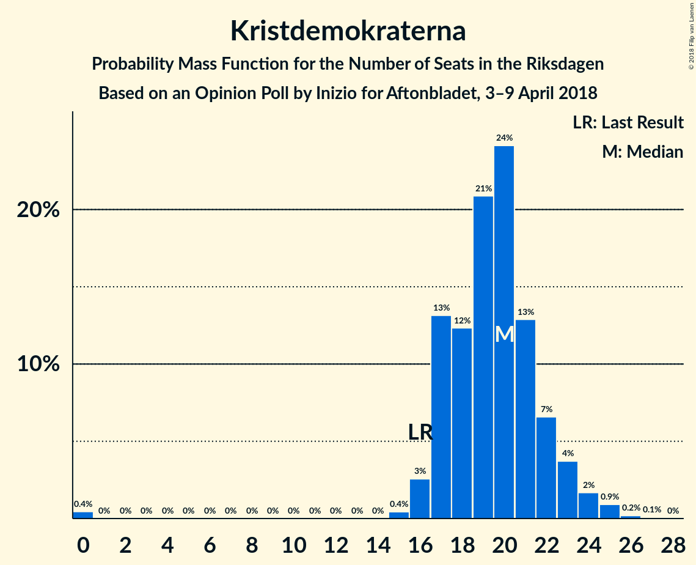

# Opinion Poll by Inizio for Aftonbladet, 3–9 April 2018

<a href="#voting-intentions">Voting Intentions</a> | <a href="#seats">Seats</a> | <a href="#coalitions">Coalitions</a> | <a href="#technical-information">Technical Information</a>

## Voting Intentions

### Confidence Intervals

| Party | Last Result | Poll Result | 80% Confidence Interval | 90% Confidence Interval | 95% Confidence Interval | 99% Confidence Interval |
|:-----:|:-----------:|:-----------:|:-----------------------:|:-----------------------:|:-----------------------:|:-----------------------:|
| Sveriges socialdemokratiska arbetareparti | 31.0% | 27.3% | 26.1–28.6% |25.7–28.9% |25.4–29.3% |24.9–29.9% |
| Moderata samlingspartiet | 23.3% | 23.3% | 22.2–24.5% |21.8–24.9% |21.6–25.2% |21.0–25.8% |
| Sverigedemokraterna | 12.9% | 15.9% | 14.9–17.0% |14.7–17.3% |14.4–17.6% |14.0–18.1% |
| Centerpartiet | 6.1% | 9.0% | 8.2–9.9% |8.0–10.1% |7.8–10.3% |7.5–10.7% |
| Vänsterpartiet | 5.7% | 6.5% | 5.9–7.2% |5.7–7.5% |5.5–7.6% |5.2–8.0% |
| Kristdemokraterna | 4.6% | 5.1% | 4.5–5.8% |4.4–6.0% |4.3–6.2% |4.0–6.5% |
| Miljöpartiet de gröna | 6.9% | 4.0% | 3.5–4.6% |3.3–4.8% |3.2–4.9% |3.0–5.2% |
| Liberalerna | 5.4% | 3.9% | 3.4–4.5% |3.3–4.7% |3.1–4.8% |2.9–5.1% |
| Feministiskt initiativ | 3.1% | 2.3% | 2.0–2.8% |1.8–2.9% |1.8–3.1% |1.6–3.3% |

*Note:* The poll result column reflects the actual value used in the calculations. Published results may vary slightly, and in addition be rounded to fewer digits.

## Seats

### Confidence Intervals

| Party | Last Result | Median | 80% Confidence Interval | 90% Confidence Interval | 95% Confidence Interval | 99% Confidence Interval |
|:-----:|:-----------:|:------:|:-----------------------:|:-----------------------:|:-----------------------:|:-----------------------:|
| <a href="#sveriges-socialdemokratiska-arbetareparti">Sveriges socialdemokratiska arbetareparti</a> | 113 | 103 | 100–110 |100–110 |100–117 |97–117 |
| <a href="#moderata-samlingspartiet">Moderata samlingspartiet</a> | 84 | 81 | 78–92 |78–105 |78–105 |78–105 |
| <a href="#sverigedemokraterna">Sverigedemokraterna</a> | 49 | 64 | 53–72 |53–72 |53–72 |53–72 |
| <a href="#centerpartiet">Centerpartiet</a> | 22 | 34 | 32–40 |32–40 |32–40 |30–43 |
| <a href="#vänsterpartiet">Vänsterpartiet</a> | 21 | 25 | 19–29 |19–29 |19–29 |19–29 |
| <a href="#kristdemokraterna">Kristdemokraterna</a> | 16 | 20 | 0–23 |0–23 |0–23 |0–27 |
| <a href="#miljöpartiet-de-gröna">Miljöpartiet de gröna</a> | 25 | 16 | 0–20 |0–20 |0–20 |0–22 |
| <a href="#liberalerna">Liberalerna</a> | 19 | 15 | 0–18 |0–18 |0–18 |0–18 |
| <a href="#feministiskt-initiativ">Feministiskt initiativ</a> | 0 | 0 | 0 |0 |0 |0 |

### Sveriges socialdemokratiska arbetareparti

*For a full overview of the results for this party, see the [Sveriges socialdemokratiska arbetareparti](party-sverigessocialdemokratiskaarbetareparti.html) page.*

| Number of Seats | Probability | Accumulated | Special Marks |
|:---------------:|:-----------:|:-----------:|:-------------:|
| 92 | 0% | 100% |  |
| 93 | 0.1% | 99.9% |  |
| 94 | 0.1% | 99.8% |  |
| 95 | 0% | 99.7% |  |
| 96 | 0% | 99.7% |  |
| 97 | 0.5% | 99.7% |  |
| 98 | 0.1% | 99.2% |  |
| 99 | 0.1% | 99.1% |  |
| 100 | 26% | 98.9% |  |
| 101 | 0.1% | 73% |  |
| 102 | 0% | 73% |  |
| 103 | 37% | 73% | Median |
| 104 | 0.3% | 36% |  |
| 105 | 0% | 36% |  |
| 106 | 0.2% | 36% |  |
| 107 | 0.6% | 35% |  |
| 108 | 0.2% | 35% |  |
| 109 | 21% | 35% |  |
| 110 | 11% | 14% |  |
| 111 | 0% | 3% |  |
| 112 | 0.1% | 3% |  |
| 113 | 0% | 3% | Last Result |
| 114 | 0% | 3% |  |
| 115 | 0% | 3% |  |
| 116 | 0% | 3% |  |
| 117 | 2% | 3% |  |
| 118 | 0% | 0.1% |  |
| 119 | 0% | 0.1% |  |
| 120 | 0% | 0.1% |  |
| 121 | 0% | 0.1% |  |
| 122 | 0% | 0.1% |  |
| 123 | 0.1% | 0.1% |  |
| 124 | 0% | 0% |  |

### Moderata samlingspartiet

*For a full overview of the results for this party, see the [Moderata samlingspartiet](party-moderatasamlingspartiet.html) page.*

| Number of Seats | Probability | Accumulated | Special Marks |
|:---------------:|:-----------:|:-----------:|:-------------:|
| 76 | 0.1% | 100% |  |
| 77 | 0.2% | 99.9% |  |
| 78 | 26% | 99.7% |  |
| 79 | 0% | 74% |  |
| 80 | 0% | 74% |  |
| 81 | 46% | 74% | Median |
| 82 | 0% | 28% |  |
| 83 | 0% | 28% |  |
| 84 | 0.1% | 28% | Last Result |
| 85 | 0.2% | 28% |  |
| 86 | 0% | 28% |  |
| 87 | 0% | 28% |  |
| 88 | 0.2% | 28% |  |
| 89 | 0.1% | 27% |  |
| 90 | 11% | 27% |  |
| 91 | 3% | 16% |  |
| 92 | 5% | 14% |  |
| 93 | 0% | 8% |  |
| 94 | 0.5% | 8% |  |
| 95 | 0% | 8% |  |
| 96 | 0.6% | 8% |  |
| 97 | 0% | 7% |  |
| 98 | 0.3% | 7% |  |
| 99 | 0.1% | 7% |  |
| 100 | 0.6% | 7% |  |
| 101 | 0% | 6% |  |
| 102 | 0% | 6% |  |
| 103 | 0% | 6% |  |
| 104 | 0% | 6% |  |
| 105 | 6% | 6% |  |
| 106 | 0% | 0% |  |

### Sverigedemokraterna

*For a full overview of the results for this party, see the [Sverigedemokraterna](party-sverigedemokraterna.html) page.*

| Number of Seats | Probability | Accumulated | Special Marks |
|:---------------:|:-----------:|:-----------:|:-------------:|
| 49 | 0% | 100% | Last Result |
| 50 | 0% | 100% |  |
| 51 | 0% | 100% |  |
| 52 | 0.2% | 100% |  |
| 53 | 14% | 99.8% |  |
| 54 | 0.1% | 85% |  |
| 55 | 0% | 85% |  |
| 56 | 2% | 85% |  |
| 57 | 0.2% | 84% |  |
| 58 | 0% | 83% |  |
| 59 | 0.4% | 83% |  |
| 60 | 15% | 83% |  |
| 61 | 0.2% | 68% |  |
| 62 | 0% | 68% |  |
| 63 | 0% | 68% |  |
| 64 | 41% | 68% | Median |
| 65 | 12% | 27% |  |
| 66 | 0% | 15% |  |
| 67 | 3% | 15% |  |
| 68 | 0% | 12% |  |
| 69 | 0% | 12% |  |
| 70 | 0% | 12% |  |
| 71 | 0% | 12% |  |
| 72 | 12% | 12% |  |
| 73 | 0% | 0% |  |

### Centerpartiet

*For a full overview of the results for this party, see the [Centerpartiet](party-centerpartiet.html) page.*

| Number of Seats | Probability | Accumulated | Special Marks |
|:---------------:|:-----------:|:-----------:|:-------------:|
| 22 | 0% | 100% | Last Result |
| 23 | 0% | 100% |  |
| 24 | 0% | 100% |  |
| 25 | 0% | 100% |  |
| 26 | 0% | 100% |  |
| 27 | 0.4% | 100% |  |
| 28 | 0% | 99.5% |  |
| 29 | 0% | 99.5% |  |
| 30 | 0.2% | 99.5% |  |
| 31 | 0% | 99.4% |  |
| 32 | 11% | 99.4% |  |
| 33 | 34% | 88% |  |
| 34 | 6% | 54% | Median |
| 35 | 1.1% | 48% |  |
| 36 | 0.1% | 47% |  |
| 37 | 12% | 47% |  |
| 38 | 20% | 35% |  |
| 39 | 0% | 15% |  |
| 40 | 14% | 15% |  |
| 41 | 0% | 0.6% |  |
| 42 | 0% | 0.6% |  |
| 43 | 0.2% | 0.6% |  |
| 44 | 0.2% | 0.4% |  |
| 45 | 0% | 0.1% |  |
| 46 | 0% | 0.1% |  |
| 47 | 0% | 0.1% |  |
| 48 | 0.1% | 0.1% |  |
| 49 | 0% | 0% |  |

### Vänsterpartiet

*For a full overview of the results for this party, see the [Vänsterpartiet](party-vänsterpartiet.html) page.*

| Number of Seats | Probability | Accumulated | Special Marks |
|:---------------:|:-----------:|:-----------:|:-------------:|
| 19 | 12% | 100% |  |
| 20 | 0.1% | 88% |  |
| 21 | 16% | 88% | Last Result |
| 22 | 0.5% | 73% |  |
| 23 | 0.1% | 72% |  |
| 24 | 15% | 72% |  |
| 25 | 9% | 58% | Median |
| 26 | 31% | 49% |  |
| 27 | 7% | 18% |  |
| 28 | 0% | 11% |  |
| 29 | 11% | 11% |  |
| 30 | 0.2% | 0.2% |  |
| 31 | 0% | 0.1% |  |
| 32 | 0% | 0.1% |  |
| 33 | 0% | 0.1% |  |
| 34 | 0.1% | 0.1% |  |
| 35 | 0% | 0% |  |

### Kristdemokraterna

*For a full overview of the results for this party, see the [Kristdemokraterna](party-kristdemokraterna.html) page.*

| Number of Seats | Probability | Accumulated | Special Marks |
|:---------------:|:-----------:|:-----------:|:-------------:|
| 0 | 18% | 100% |  |
| 1 | 0% | 82% |  |
| 2 | 0% | 82% |  |
| 3 | 0% | 82% |  |
| 4 | 0% | 82% |  |
| 5 | 0% | 82% |  |
| 6 | 0% | 82% |  |
| 7 | 0% | 82% |  |
| 8 | 0% | 82% |  |
| 9 | 0% | 82% |  |
| 10 | 0% | 82% |  |
| 11 | 0% | 82% |  |
| 12 | 0% | 82% |  |
| 13 | 0% | 82% |  |
| 14 | 0% | 82% |  |
| 15 | 0% | 82% |  |
| 16 | 3% | 82% | Last Result |
| 17 | 0.6% | 79% |  |
| 18 | 12% | 78% |  |
| 19 | 5% | 66% |  |
| 20 | 14% | 61% | Median |
| 21 | 0.2% | 47% |  |
| 22 | 30% | 46% |  |
| 23 | 15% | 16% |  |
| 24 | 0.1% | 1.1% |  |
| 25 | 0% | 1.0% |  |
| 26 | 0% | 1.0% |  |
| 27 | 1.0% | 1.0% |  |
| 28 | 0% | 0% |  |

### Miljöpartiet de gröna

*For a full overview of the results for this party, see the [Miljöpartiet de gröna](party-miljöpartietdegröna.html) page.*

| Number of Seats | Probability | Accumulated | Special Marks |
|:---------------:|:-----------:|:-----------:|:-------------:|
| 0 | 36% | 100% |  |
| 1 | 0% | 64% |  |
| 2 | 0% | 64% |  |
| 3 | 0% | 64% |  |
| 4 | 0% | 64% |  |
| 5 | 0% | 64% |  |
| 6 | 0% | 64% |  |
| 7 | 0% | 64% |  |
| 8 | 0% | 64% |  |
| 9 | 0% | 64% |  |
| 10 | 0% | 64% |  |
| 11 | 0% | 64% |  |
| 12 | 0% | 64% |  |
| 13 | 0% | 64% |  |
| 14 | 0% | 64% |  |
| 15 | 0% | 64% |  |
| 16 | 15% | 64% | Median |
| 17 | 12% | 50% |  |
| 18 | 6% | 38% |  |
| 19 | 0.1% | 32% |  |
| 20 | 30% | 31% |  |
| 21 | 0.6% | 1.4% |  |
| 22 | 0.3% | 0.7% |  |
| 23 | 0.5% | 0.5% |  |
| 24 | 0% | 0% |  |
| 25 | 0% | 0% | Last Result |

### Liberalerna

*For a full overview of the results for this party, see the [Liberalerna](party-liberalerna.html) page.*

| Number of Seats | Probability | Accumulated | Special Marks |
|:---------------:|:-----------:|:-----------:|:-------------:|
| 0 | 46% | 100% |  |
| 1 | 0% | 54% |  |
| 2 | 0% | 54% |  |
| 3 | 0% | 54% |  |
| 4 | 0% | 54% |  |
| 5 | 0% | 54% |  |
| 6 | 0% | 54% |  |
| 7 | 0% | 54% |  |
| 8 | 0% | 54% |  |
| 9 | 0% | 54% |  |
| 10 | 0% | 54% |  |
| 11 | 0% | 54% |  |
| 12 | 0% | 54% |  |
| 13 | 0% | 54% |  |
| 14 | 0% | 54% |  |
| 15 | 12% | 54% | Median |
| 16 | 12% | 42% |  |
| 17 | 15% | 30% |  |
| 18 | 15% | 15% |  |
| 19 | 0% | 0.2% | Last Result |
| 20 | 0% | 0.2% |  |
| 21 | 0.2% | 0.2% |  |
| 22 | 0% | 0% |  |

### Feministiskt initiativ

*For a full overview of the results for this party, see the [Feministiskt initiativ](party-feministisktinitiativ.html) page.*

| Number of Seats | Probability | Accumulated | Special Marks |
|:---------------:|:-----------:|:-----------:|:-------------:|
| 0 | 100% | 100% | Last Result, Median |

## Coalitions

### Confidence Intervals

| Coalition | Last Result | Median | Majority? | 80% Confidence Interval | 90% Confidence Interval | 95% Confidence Interval | 99% Confidence Interval |
|:---------:|:-----------:|:------:|:---------:|:-----------------------:|:-----------------------:|:-----------------------:|:-----------------------:|
| Moderata samlingspartiet – Centerpartiet – Kristdemokraterna – Liberalerna | 141 | 140 | 0% | 136–159 | 136–159 | 136–159 | 131–159 |
| Sveriges socialdemokratiska arbetareparti – Vänsterpartiet – Miljöpartiet de gröna – Feministiskt initiativ | 159 | 140 | 0% | 130–149 | 130–149 | 130–149 | 126–151 |
| Sveriges socialdemokratiska arbetareparti – Vänsterpartiet – Miljöpartiet de gröna | 159 | 140 | 0% | 130–149 | 130–149 | 130–149 | 126–151 |
| Moderata samlingspartiet – Centerpartiet – Kristdemokraterna | 122 | 136 | 0% | 122–142 | 122–149 | 122–149 | 122–151 |
| Sveriges socialdemokratiska arbetareparti – Vänsterpartiet | 134 | 129 | 0% | 119–139 | 119–139 | 119–142 | 119–142 |
| Moderata samlingspartiet – Centerpartiet – Liberalerna | 125 | 130 | 0% | 114–138 | 114–139 | 114–139 | 114–142 |
| Moderata samlingspartiet – Centerpartiet | 106 | 118 | 0% | 114–130 | 114–139 | 114–139 | 110–139 |

### Moderata samlingspartiet – Centerpartiet – Kristdemokraterna – Liberalerna

| Number of Seats | Probability | Accumulated | Special Marks |
|:---------------:|:-----------:|:-----------:|:-------------:|
| 131 | 0.6% | 100% |  |
| 132 | 0.1% | 99.4% |  |
| 133 | 0% | 99.3% |  |
| 134 | 0% | 99.3% |  |
| 135 | 0% | 99.3% |  |
| 136 | 30% | 99.3% |  |
| 137 | 0% | 69% |  |
| 138 | 11% | 69% |  |
| 139 | 6% | 58% |  |
| 140 | 3% | 52% |  |
| 141 | 0.3% | 50% | Last Result |
| 142 | 0.2% | 49% |  |
| 143 | 0% | 49% |  |
| 144 | 0.1% | 49% |  |
| 145 | 0.1% | 49% |  |
| 146 | 0.2% | 49% |  |
| 147 | 0% | 49% |  |
| 148 | 12% | 49% |  |
| 149 | 6% | 37% |  |
| 150 | 0% | 31% | Median |
| 151 | 0.8% | 31% |  |
| 152 | 0.1% | 31% |  |
| 153 | 0% | 30% |  |
| 154 | 0% | 30% |  |
| 155 | 0.1% | 30% |  |
| 156 | 14% | 30% |  |
| 157 | 0.8% | 16% |  |
| 158 | 0% | 15% |  |
| 159 | 15% | 15% |  |
| 160 | 0% | 0.3% |  |
| 161 | 0% | 0.3% |  |
| 162 | 0% | 0.3% |  |
| 163 | 0.1% | 0.3% |  |
| 164 | 0% | 0.2% |  |
| 165 | 0% | 0.2% |  |
| 166 | 0.1% | 0.1% |  |
| 167 | 0% | 0% |  |

### Sveriges socialdemokratiska arbetareparti – Vänsterpartiet – Miljöpartiet de gröna – Feministiskt initiativ

| Number of Seats | Probability | Accumulated | Special Marks |
|:---------------:|:-----------:|:-----------:|:-------------:|
| 121 | 0.1% | 100% |  |
| 122 | 0.1% | 99.9% |  |
| 123 | 0% | 99.8% |  |
| 124 | 0% | 99.8% |  |
| 125 | 0% | 99.8% |  |
| 126 | 0.3% | 99.7% |  |
| 127 | 0% | 99.5% |  |
| 128 | 0.6% | 99.5% |  |
| 129 | 0% | 98.9% |  |
| 130 | 15% | 98.9% |  |
| 131 | 0% | 84% |  |
| 132 | 0% | 84% |  |
| 133 | 0.1% | 84% |  |
| 134 | 0% | 84% |  |
| 135 | 0% | 84% |  |
| 136 | 18% | 84% |  |
| 137 | 0.1% | 66% |  |
| 138 | 0% | 66% |  |
| 139 | 11% | 66% |  |
| 140 | 14% | 55% |  |
| 141 | 0.1% | 41% |  |
| 142 | 3% | 40% |  |
| 143 | 0% | 38% |  |
| 144 | 0% | 38% | Median |
| 145 | 0% | 38% |  |
| 146 | 6% | 38% |  |
| 147 | 0.1% | 32% |  |
| 148 | 0.3% | 31% |  |
| 149 | 30% | 31% |  |
| 150 | 0% | 1.1% |  |
| 151 | 0.8% | 1.1% |  |
| 152 | 0.2% | 0.4% |  |
| 153 | 0% | 0.1% |  |
| 154 | 0% | 0.1% |  |
| 155 | 0% | 0.1% |  |
| 156 | 0% | 0.1% |  |
| 157 | 0% | 0.1% |  |
| 158 | 0% | 0.1% |  |
| 159 | 0% | 0.1% | Last Result |
| 160 | 0% | 0.1% |  |
| 161 | 0% | 0.1% |  |
| 162 | 0% | 0.1% |  |
| 163 | 0.1% | 0.1% |  |
| 164 | 0% | 0% |  |

### Sveriges socialdemokratiska arbetareparti – Vänsterpartiet – Miljöpartiet de gröna

| Number of Seats | Probability | Accumulated | Special Marks |
|:---------------:|:-----------:|:-----------:|:-------------:|
| 121 | 0.1% | 100% |  |
| 122 | 0.1% | 99.9% |  |
| 123 | 0% | 99.8% |  |
| 124 | 0% | 99.8% |  |
| 125 | 0% | 99.8% |  |
| 126 | 0.3% | 99.7% |  |
| 127 | 0% | 99.5% |  |
| 128 | 0.6% | 99.5% |  |
| 129 | 0% | 98.9% |  |
| 130 | 15% | 98.9% |  |
| 131 | 0% | 84% |  |
| 132 | 0% | 84% |  |
| 133 | 0.1% | 84% |  |
| 134 | 0% | 84% |  |
| 135 | 0% | 84% |  |
| 136 | 18% | 84% |  |
| 137 | 0.1% | 66% |  |
| 138 | 0% | 66% |  |
| 139 | 11% | 66% |  |
| 140 | 14% | 55% |  |
| 141 | 0.1% | 41% |  |
| 142 | 3% | 40% |  |
| 143 | 0% | 38% |  |
| 144 | 0% | 38% | Median |
| 145 | 0% | 38% |  |
| 146 | 6% | 38% |  |
| 147 | 0.1% | 32% |  |
| 148 | 0.3% | 31% |  |
| 149 | 30% | 31% |  |
| 150 | 0% | 1.1% |  |
| 151 | 0.8% | 1.1% |  |
| 152 | 0.2% | 0.4% |  |
| 153 | 0% | 0.1% |  |
| 154 | 0% | 0.1% |  |
| 155 | 0% | 0.1% |  |
| 156 | 0% | 0.1% |  |
| 157 | 0% | 0.1% |  |
| 158 | 0% | 0.1% |  |
| 159 | 0% | 0.1% | Last Result |
| 160 | 0% | 0.1% |  |
| 161 | 0% | 0.1% |  |
| 162 | 0% | 0.1% |  |
| 163 | 0.1% | 0.1% |  |
| 164 | 0% | 0% |  |

### Moderata samlingspartiet – Centerpartiet – Kristdemokraterna

| Number of Seats | Probability | Accumulated | Special Marks |
|:---------------:|:-----------:|:-----------:|:-------------:|
| 122 | 11% | 100% | Last Result |
| 123 | 0% | 89% |  |
| 124 | 0% | 89% |  |
| 125 | 0.3% | 89% |  |
| 126 | 0% | 89% |  |
| 127 | 0.1% | 89% |  |
| 128 | 0.2% | 89% |  |
| 129 | 0% | 88% |  |
| 130 | 0% | 88% |  |
| 131 | 0.6% | 88% |  |
| 132 | 0.1% | 88% |  |
| 133 | 12% | 88% |  |
| 134 | 0.1% | 76% |  |
| 135 | 0.2% | 76% | Median |
| 136 | 30% | 76% |  |
| 137 | 0% | 46% |  |
| 138 | 14% | 46% |  |
| 139 | 6% | 31% |  |
| 140 | 3% | 25% |  |
| 141 | 0.9% | 23% |  |
| 142 | 15% | 22% |  |
| 143 | 0% | 7% |  |
| 144 | 0.1% | 7% |  |
| 145 | 0.1% | 7% |  |
| 146 | 0% | 7% |  |
| 147 | 0% | 7% |  |
| 148 | 0% | 7% |  |
| 149 | 6% | 7% |  |
| 150 | 0% | 0.7% |  |
| 151 | 0.6% | 0.7% |  |
| 152 | 0% | 0.1% |  |
| 153 | 0% | 0.1% |  |
| 154 | 0% | 0.1% |  |
| 155 | 0.1% | 0.1% |  |
| 156 | 0% | 0% |  |

### Sveriges socialdemokratiska arbetareparti – Vänsterpartiet

| Number of Seats | Probability | Accumulated | Special Marks |
|:---------------:|:-----------:|:-----------:|:-------------:|
| 115 | 0.1% | 100% |  |
| 116 | 0% | 99.9% |  |
| 117 | 0% | 99.9% |  |
| 118 | 0% | 99.9% |  |
| 119 | 12% | 99.8% |  |
| 120 | 0% | 88% |  |
| 121 | 0.1% | 88% |  |
| 122 | 0.2% | 88% |  |
| 123 | 0% | 87% |  |
| 124 | 14% | 87% |  |
| 125 | 0.1% | 73% |  |
| 126 | 0.3% | 73% |  |
| 127 | 0.1% | 73% |  |
| 128 | 7% | 73% | Median |
| 129 | 30% | 66% |  |
| 130 | 16% | 36% |  |
| 131 | 0.2% | 20% |  |
| 132 | 0% | 20% |  |
| 133 | 0% | 20% |  |
| 134 | 0.1% | 20% | Last Result |
| 135 | 0% | 20% |  |
| 136 | 6% | 20% |  |
| 137 | 0% | 14% |  |
| 138 | 0% | 14% |  |
| 139 | 11% | 14% |  |
| 140 | 0% | 3% |  |
| 141 | 0% | 3% |  |
| 142 | 2% | 3% |  |
| 143 | 0% | 0.1% |  |
| 144 | 0% | 0.1% |  |
| 145 | 0% | 0.1% |  |
| 146 | 0.1% | 0.1% |  |
| 147 | 0% | 0% |  |

### Moderata samlingspartiet – Centerpartiet – Liberalerna

| Number of Seats | Probability | Accumulated | Special Marks |
|:---------------:|:-----------:|:-----------:|:-------------:|
| 114 | 30% | 100% |  |
| 115 | 0% | 70% |  |
| 116 | 0% | 70% |  |
| 117 | 0% | 70% |  |
| 118 | 0% | 70% |  |
| 119 | 0% | 70% |  |
| 120 | 0% | 70% |  |
| 121 | 0% | 70% |  |
| 122 | 0% | 70% |  |
| 123 | 0% | 70% |  |
| 124 | 3% | 70% |  |
| 125 | 0.1% | 67% | Last Result |
| 126 | 0.1% | 67% |  |
| 127 | 0% | 67% |  |
| 128 | 0.1% | 67% |  |
| 129 | 0.5% | 67% |  |
| 130 | 18% | 66% | Median |
| 131 | 0.8% | 49% |  |
| 132 | 0.1% | 48% |  |
| 133 | 0.7% | 48% |  |
| 134 | 0% | 47% |  |
| 135 | 0% | 47% |  |
| 136 | 29% | 47% |  |
| 137 | 0% | 18% |  |
| 138 | 11% | 18% |  |
| 139 | 6% | 7% |  |
| 140 | 0% | 0.6% |  |
| 141 | 0% | 0.6% |  |
| 142 | 0.2% | 0.6% |  |
| 143 | 0% | 0.4% |  |
| 144 | 0% | 0.4% |  |
| 145 | 0% | 0.4% |  |
| 146 | 0.1% | 0.4% |  |
| 147 | 0% | 0.3% |  |
| 148 | 0% | 0.3% |  |
| 149 | 0% | 0.2% |  |
| 150 | 0% | 0.2% |  |
| 151 | 0.2% | 0.2% |  |
| 152 | 0% | 0% |  |

### Moderata samlingspartiet – Centerpartiet

| Number of Seats | Probability | Accumulated | Special Marks |
|:---------------:|:-----------:|:-----------:|:-------------:|
| 106 | 0% | 100% | Last Result |
| 107 | 0.2% | 100% |  |
| 108 | 0.2% | 99.8% |  |
| 109 | 0% | 99.6% |  |
| 110 | 0.1% | 99.6% |  |
| 111 | 0.1% | 99.5% |  |
| 112 | 0% | 99.4% |  |
| 113 | 0% | 99.4% |  |
| 114 | 31% | 99.4% |  |
| 115 | 12% | 69% | Median |
| 116 | 0% | 57% |  |
| 117 | 0% | 57% |  |
| 118 | 14% | 57% |  |
| 119 | 15% | 43% |  |
| 120 | 0% | 28% |  |
| 121 | 0% | 28% |  |
| 122 | 11% | 28% |  |
| 123 | 0% | 16% |  |
| 124 | 2% | 16% |  |
| 125 | 0.1% | 14% |  |
| 126 | 0.2% | 14% |  |
| 127 | 0% | 14% |  |
| 128 | 0.1% | 14% |  |
| 129 | 0.5% | 14% |  |
| 130 | 5% | 13% |  |
| 131 | 0.7% | 8% |  |
| 132 | 0.1% | 7% |  |
| 133 | 0.7% | 7% |  |
| 134 | 0% | 6% |  |
| 135 | 0.2% | 6% |  |
| 136 | 0% | 6% |  |
| 137 | 0% | 6% |  |
| 138 | 0% | 6% |  |
| 139 | 6% | 6% |  |
| 140 | 0% | 0.2% |  |
| 141 | 0% | 0.2% |  |
| 142 | 0.2% | 0.2% |  |
| 143 | 0% | 0% |  |

## Technical Information

### Opinion Poll

+ **Polling firm:** Inizio
+ **Commissioner(s):** Aftonbladet
+ **Fieldwork period:** 3–9 April 2018

### Calculations

+ **Sample size:** 2109
+ **Simulations done:** 1,024
+ **Error estimate:** 2.18%

