# Opinion Poll by Sentio for Nyheter Idag, 5–10 April 2018

<a href="#voting-intentions">Voting Intentions</a> | <a href="#seats">Seats</a> | <a href="#coalitions">Coalitions</a> | <a href="#technical-information">Technical Information</a>

## Voting Intentions

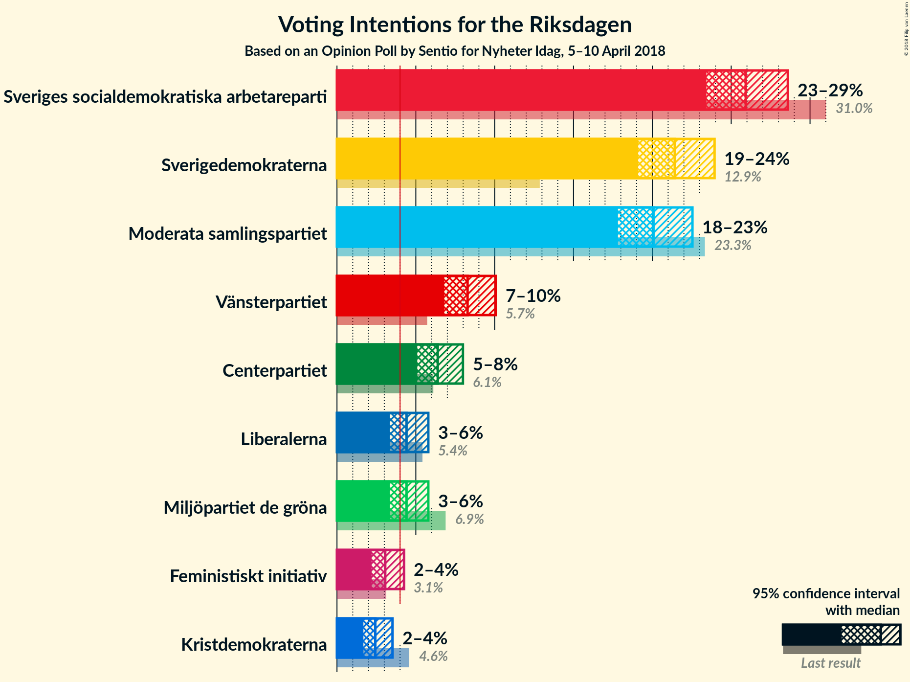

### Confidence Intervals

| Party | Last Result | Poll Result | 80% Confidence Interval | 90% Confidence Interval | 95% Confidence Interval | 99% Confidence Interval |
|:-----:|:-----------:|:-----------:|:-----------------------:|:-----------------------:|:-----------------------:|:-----------------------:|
| Sveriges socialdemokratiska arbetareparti | 31.0% | 25.9% | 24.3–27.7% |23.8–28.2% |23.4–28.6% |22.7–29.4% |
| Sverigedemokraterna | 12.9% | 21.4% | 19.9–23.1% |19.5–23.5% |19.1–23.9% |18.4–24.7% |
| Moderata samlingspartiet | 23.3% | 20.1% | 18.6–21.7% |18.2–22.1% |17.8–22.5% |17.1–23.3% |
| Vänsterpartiet | 5.7% | 8.3% | 7.3–9.4% |7.0–9.8% |6.8–10.1% |6.4–10.6% |
| Centerpartiet | 6.1% | 6.4% | 5.5–7.4% |5.3–7.7% |5.1–8.0% |4.7–8.5% |
| Miljöpartiet de gröna | 6.9% | 4.4% | 3.7–5.3% |3.5–5.6% |3.4–5.8% |3.0–6.2% |
| Liberalerna | 5.4% | 4.4% | 3.7–5.3% |3.5–5.6% |3.4–5.8% |3.0–6.2% |
| Feministiskt initiativ | 3.1% | 3.1% | 2.5–3.8% |2.3–4.1% |2.2–4.3% |2.0–4.6% |
| Kristdemokraterna | 4.6% | 2.4% | 1.9–3.1% |1.8–3.3% |1.7–3.5% |1.5–3.9% |

*Note:* The poll result column reflects the actual value used in the calculations. Published results may vary slightly, and in addition be rounded to fewer digits.

## Seats

### Confidence Intervals

| Party | Last Result | Median | 80% Confidence Interval | 90% Confidence Interval | 95% Confidence Interval | 99% Confidence Interval |
|:-----:|:-----------:|:------:|:-----------------------:|:-----------------------:|:-----------------------:|:-----------------------:|
| <a href="#sveriges-socialdemokratiska-arbetareparti">Sveriges socialdemokratiska arbetareparti</a> | 113 | 99 | 93–109 |90–109 |88–111 |85–117 |
| <a href="#sverigedemokraterna">Sverigedemokraterna</a> | 49 | 82 | 74–89 |73–93 |72–95 |69–97 |
| <a href="#moderata-samlingspartiet">Moderata samlingspartiet</a> | 84 | 77 | 71–83 |68–86 |67–88 |65–92 |
| <a href="#vänsterpartiet">Vänsterpartiet</a> | 21 | 33 | 29–36 |28–38 |27–40 |24–42 |
| <a href="#centerpartiet">Centerpartiet</a> | 22 | 25 | 22–28 |20–29 |19–30 |18–32 |
| <a href="#miljöpartiet-de-gröna">Miljöpartiet de gröna</a> | 25 | 16 | 0–19 |0–21 |0–22 |0–24 |
| <a href="#liberalerna">Liberalerna</a> | 19 | 17 | 0–20 |0–21 |0–22 |0–24 |
| <a href="#feministiskt-initiativ">Feministiskt initiativ</a> | 0 | 0 | 0 |0–15 |0–16 |0–18 |
| <a href="#kristdemokraterna">Kristdemokraterna</a> | 16 | 0 | 0 |0 |0 |0 |

### Sveriges socialdemokratiska arbetareparti

*For a full overview of the results for this party, see the [Sveriges socialdemokratiska arbetareparti](party-sverigessocialdemokratiskaarbetareparti.html) page.*

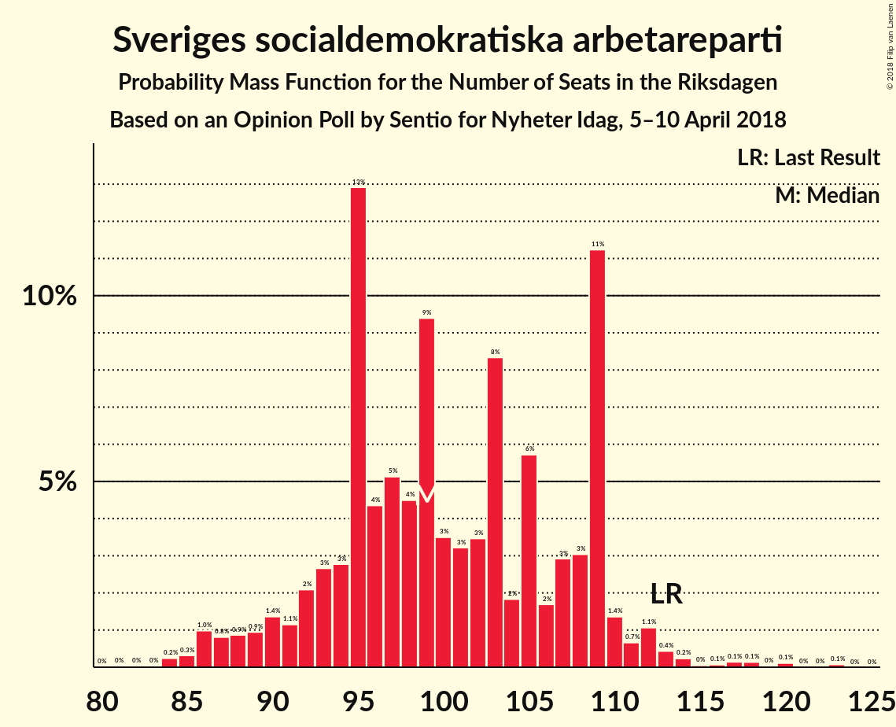

| Number of Seats | Probability | Accumulated | Special Marks |
|:---------------:|:-----------:|:-----------:|:-------------:|
| 81 | 0% | 100% |  |
| 82 | 0% | 99.9% |  |
| 83 | 0% | 99.9% |  |
| 84 | 0.2% | 99.9% |  |
| 85 | 0.3% | 99.6% |  |
| 86 | 1.0% | 99.3% |  |
| 87 | 0.8% | 98% |  |
| 88 | 0.9% | 98% |  |
| 89 | 0.9% | 97% |  |
| 90 | 1.4% | 96% |  |
| 91 | 1.1% | 94% |  |
| 92 | 2% | 93% |  |
| 93 | 3% | 91% |  |
| 94 | 3% | 88% |  |
| 95 | 13% | 86% |  |
| 96 | 4% | 73% |  |
| 97 | 5% | 68% |  |
| 98 | 4% | 63% |  |
| 99 | 9% | 59% | Median |
| 100 | 3% | 49% |  |
| 101 | 3% | 46% |  |
| 102 | 3% | 43% |  |
| 103 | 8% | 39% |  |
| 104 | 2% | 31% |  |
| 105 | 6% | 29% |  |
| 106 | 2% | 23% |  |
| 107 | 3% | 22% |  |
| 108 | 3% | 19% |  |
| 109 | 11% | 16% |  |
| 110 | 1.4% | 4% |  |
| 111 | 0.7% | 3% |  |
| 112 | 1.1% | 2% |  |
| 113 | 0.4% | 1.3% | Last Result |
| 114 | 0.2% | 0.9% |  |
| 115 | 0% | 0.6% |  |
| 116 | 0.1% | 0.6% |  |
| 117 | 0.1% | 0.5% |  |
| 118 | 0.1% | 0.4% |  |
| 119 | 0% | 0.2% |  |
| 120 | 0.1% | 0.2% |  |
| 121 | 0% | 0.1% |  |
| 122 | 0% | 0.1% |  |
| 123 | 0.1% | 0.1% |  |
| 124 | 0% | 0% |  |

### Sverigedemokraterna

*For a full overview of the results for this party, see the [Sverigedemokraterna](party-sverigedemokraterna.html) page.*

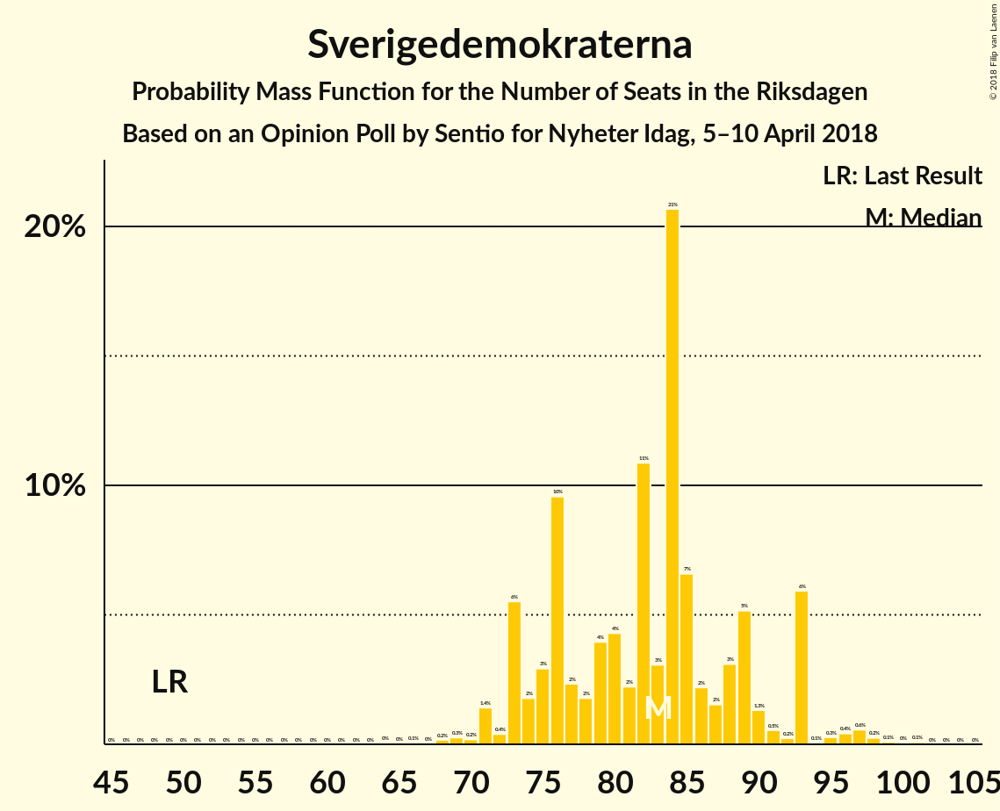

| Number of Seats | Probability | Accumulated | Special Marks |
|:---------------:|:-----------:|:-----------:|:-------------:|
| 49 | 0% | 100% | Last Result |
| 50 | 0% | 100% |  |
| 51 | 0% | 100% |  |
| 52 | 0% | 100% |  |
| 53 | 0% | 100% |  |
| 54 | 0% | 100% |  |
| 55 | 0% | 100% |  |
| 56 | 0% | 100% |  |
| 57 | 0% | 100% |  |
| 58 | 0% | 100% |  |
| 59 | 0% | 100% |  |
| 60 | 0% | 100% |  |
| 61 | 0% | 100% |  |
| 62 | 0% | 100% |  |
| 63 | 0% | 100% |  |
| 64 | 0% | 100% |  |
| 65 | 0% | 100% |  |
| 66 | 0.1% | 100% |  |
| 67 | 0% | 99.9% |  |
| 68 | 0.3% | 99.8% |  |
| 69 | 0.3% | 99.5% |  |
| 70 | 0.2% | 99.3% |  |
| 71 | 0.8% | 99.0% |  |
| 72 | 1.2% | 98% |  |
| 73 | 3% | 97% |  |
| 74 | 7% | 94% |  |
| 75 | 2% | 87% |  |
| 76 | 7% | 85% |  |
| 77 | 2% | 78% |  |
| 78 | 3% | 77% |  |
| 79 | 5% | 74% |  |
| 80 | 4% | 69% |  |
| 81 | 2% | 65% |  |
| 82 | 16% | 62% | Median |
| 83 | 2% | 46% |  |
| 84 | 11% | 44% |  |
| 85 | 3% | 33% |  |
| 86 | 8% | 29% |  |
| 87 | 7% | 21% |  |
| 88 | 3% | 14% |  |
| 89 | 3% | 11% |  |
| 90 | 1.3% | 8% |  |
| 91 | 0.5% | 7% |  |
| 92 | 0.2% | 6% |  |
| 93 | 3% | 6% |  |
| 94 | 0.2% | 3% |  |
| 95 | 0.7% | 3% |  |
| 96 | 0.2% | 2% |  |
| 97 | 1.3% | 2% |  |
| 98 | 0.2% | 0.3% |  |
| 99 | 0.1% | 0.2% |  |
| 100 | 0% | 0.1% |  |
| 101 | 0% | 0.1% |  |
| 102 | 0% | 0% |  |

### Moderata samlingspartiet

*For a full overview of the results for this party, see the [Moderata samlingspartiet](party-moderatasamlingspartiet.html) page.*

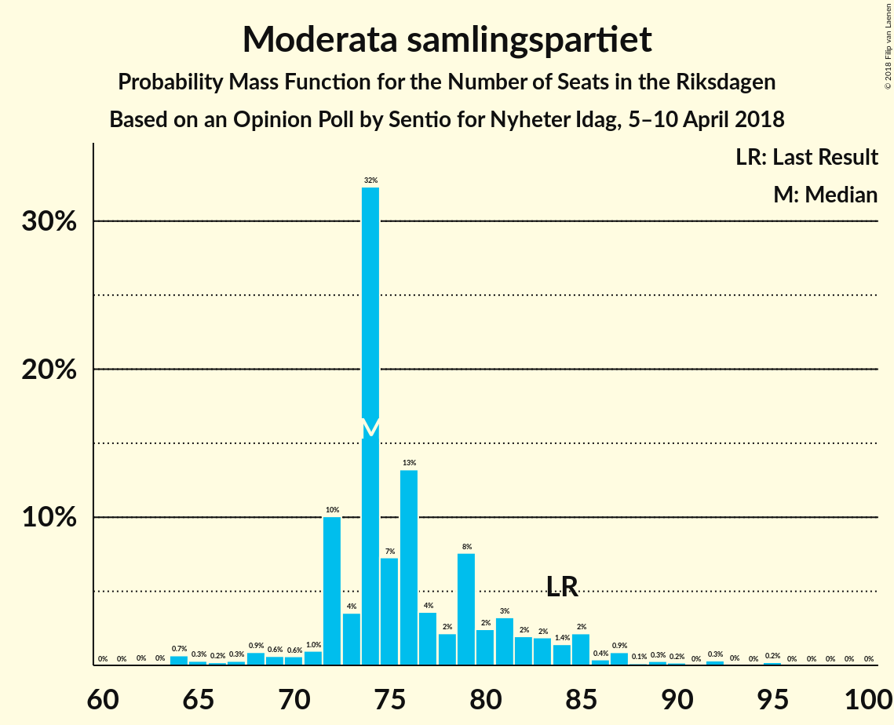

| Number of Seats | Probability | Accumulated | Special Marks |
|:---------------:|:-----------:|:-----------:|:-------------:|
| 62 | 0% | 100% |  |
| 63 | 0.1% | 99.9% |  |
| 64 | 0.3% | 99.9% |  |
| 65 | 0.6% | 99.6% |  |
| 66 | 0.6% | 99.0% |  |
| 67 | 2% | 98% |  |
| 68 | 2% | 97% |  |
| 69 | 1.0% | 95% |  |
| 70 | 1.5% | 94% |  |
| 71 | 3% | 92% |  |
| 72 | 6% | 89% |  |
| 73 | 5% | 82% |  |
| 74 | 11% | 78% |  |
| 75 | 11% | 67% |  |
| 76 | 5% | 56% |  |
| 77 | 4% | 51% | Median |
| 78 | 2% | 47% |  |
| 79 | 11% | 44% |  |
| 80 | 3% | 34% |  |
| 81 | 3% | 31% |  |
| 82 | 13% | 28% |  |
| 83 | 7% | 15% |  |
| 84 | 2% | 9% | Last Result |
| 85 | 2% | 7% |  |
| 86 | 1.5% | 5% |  |
| 87 | 0.6% | 4% |  |
| 88 | 0.8% | 3% |  |
| 89 | 0.9% | 2% |  |
| 90 | 0.3% | 1.3% |  |
| 91 | 0.2% | 1.1% |  |
| 92 | 0.4% | 0.8% |  |
| 93 | 0% | 0.5% |  |
| 94 | 0.3% | 0.5% |  |
| 95 | 0.1% | 0.1% |  |
| 96 | 0% | 0% |  |

### Vänsterpartiet

*For a full overview of the results for this party, see the [Vänsterpartiet](party-vänsterpartiet.html) page.*

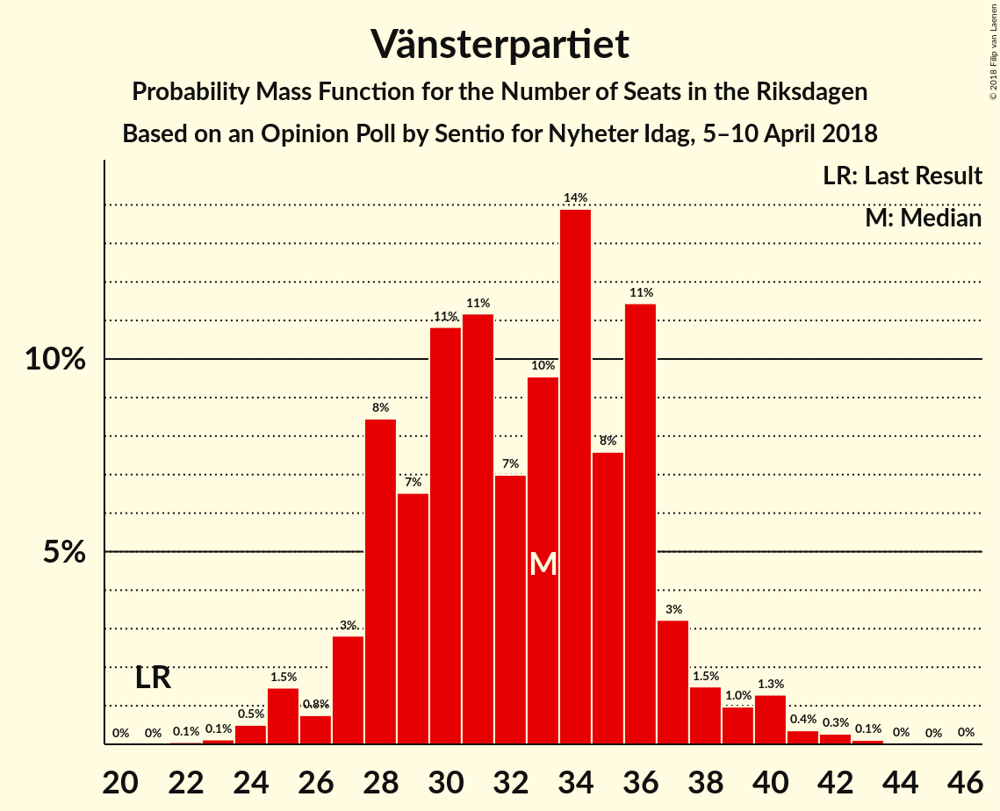

| Number of Seats | Probability | Accumulated | Special Marks |
|:---------------:|:-----------:|:-----------:|:-------------:|
| 21 | 0% | 100% | Last Result |
| 22 | 0.1% | 100% |  |
| 23 | 0.1% | 99.9% |  |
| 24 | 0.4% | 99.8% |  |
| 25 | 1.0% | 99.4% |  |
| 26 | 0.6% | 98% |  |
| 27 | 2% | 98% |  |
| 28 | 5% | 96% |  |
| 29 | 7% | 90% |  |
| 30 | 12% | 84% |  |
| 31 | 13% | 72% |  |
| 32 | 7% | 59% |  |
| 33 | 13% | 52% | Median |
| 34 | 21% | 39% |  |
| 35 | 6% | 17% |  |
| 36 | 3% | 11% |  |
| 37 | 2% | 8% |  |
| 38 | 2% | 6% |  |
| 39 | 1.4% | 4% |  |
| 40 | 2% | 3% |  |
| 41 | 0.4% | 0.9% |  |
| 42 | 0.3% | 0.5% |  |
| 43 | 0.2% | 0.2% |  |
| 44 | 0% | 0.1% |  |
| 45 | 0% | 0% |  |

### Centerpartiet

*For a full overview of the results for this party, see the [Centerpartiet](party-centerpartiet.html) page.*

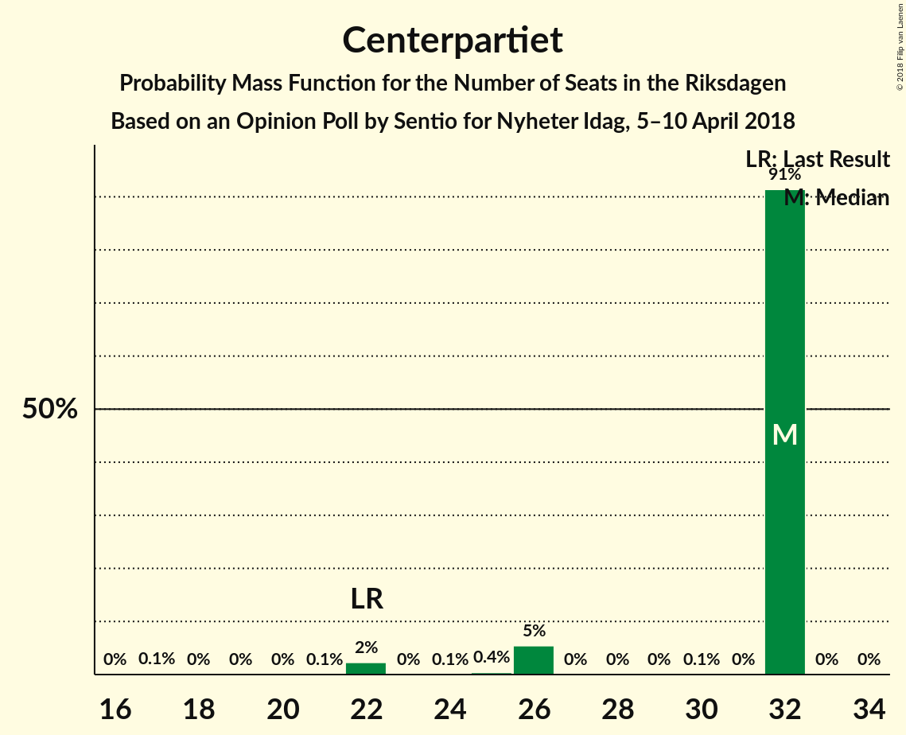

| Number of Seats | Probability | Accumulated | Special Marks |
|:---------------:|:-----------:|:-----------:|:-------------:|
| 17 | 0.3% | 100% |  |
| 18 | 0.4% | 99.7% |  |
| 19 | 2% | 99.2% |  |
| 20 | 2% | 97% |  |
| 21 | 1.3% | 95% |  |
| 22 | 6% | 94% | Last Result |
| 23 | 7% | 88% |  |
| 24 | 12% | 81% |  |
| 25 | 19% | 69% | Median |
| 26 | 17% | 49% |  |
| 27 | 17% | 32% |  |
| 28 | 6% | 16% |  |
| 29 | 5% | 10% |  |
| 30 | 2% | 4% |  |
| 31 | 1.1% | 2% |  |
| 32 | 0.4% | 0.8% |  |
| 33 | 0.2% | 0.4% |  |
| 34 | 0.1% | 0.3% |  |
| 35 | 0.1% | 0.1% |  |
| 36 | 0% | 0.1% |  |
| 37 | 0% | 0% |  |

### Miljöpartiet de gröna

*For a full overview of the results for this party, see the [Miljöpartiet de gröna](party-miljöpartietdegröna.html) page.*

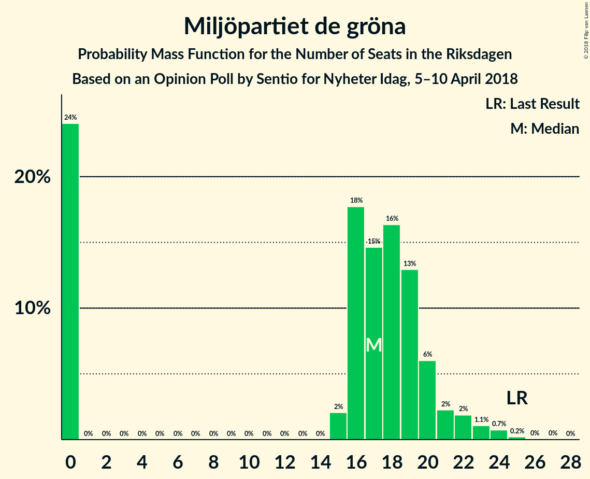

| Number of Seats | Probability | Accumulated | Special Marks |
|:---------------:|:-----------:|:-----------:|:-------------:|
| 0 | 36% | 100% |  |
| 1 | 0% | 64% |  |
| 2 | 0% | 64% |  |
| 3 | 0% | 64% |  |
| 4 | 0% | 64% |  |
| 5 | 0% | 64% |  |
| 6 | 0% | 64% |  |
| 7 | 0% | 64% |  |
| 8 | 0% | 64% |  |
| 9 | 0% | 64% |  |
| 10 | 0% | 64% |  |
| 11 | 0% | 64% |  |
| 12 | 0% | 64% |  |
| 13 | 0% | 64% |  |
| 14 | 0% | 64% |  |
| 15 | 2% | 64% |  |
| 16 | 22% | 62% | Median |
| 17 | 8% | 40% |  |
| 18 | 14% | 32% |  |
| 19 | 9% | 18% |  |
| 20 | 3% | 9% |  |
| 21 | 2% | 6% |  |
| 22 | 2% | 4% |  |
| 23 | 1.3% | 2% |  |
| 24 | 0.7% | 0.9% |  |
| 25 | 0.1% | 0.1% | Last Result |
| 26 | 0% | 0.1% |  |
| 27 | 0% | 0% |  |

### Liberalerna

*For a full overview of the results for this party, see the [Liberalerna](party-liberalerna.html) page.*

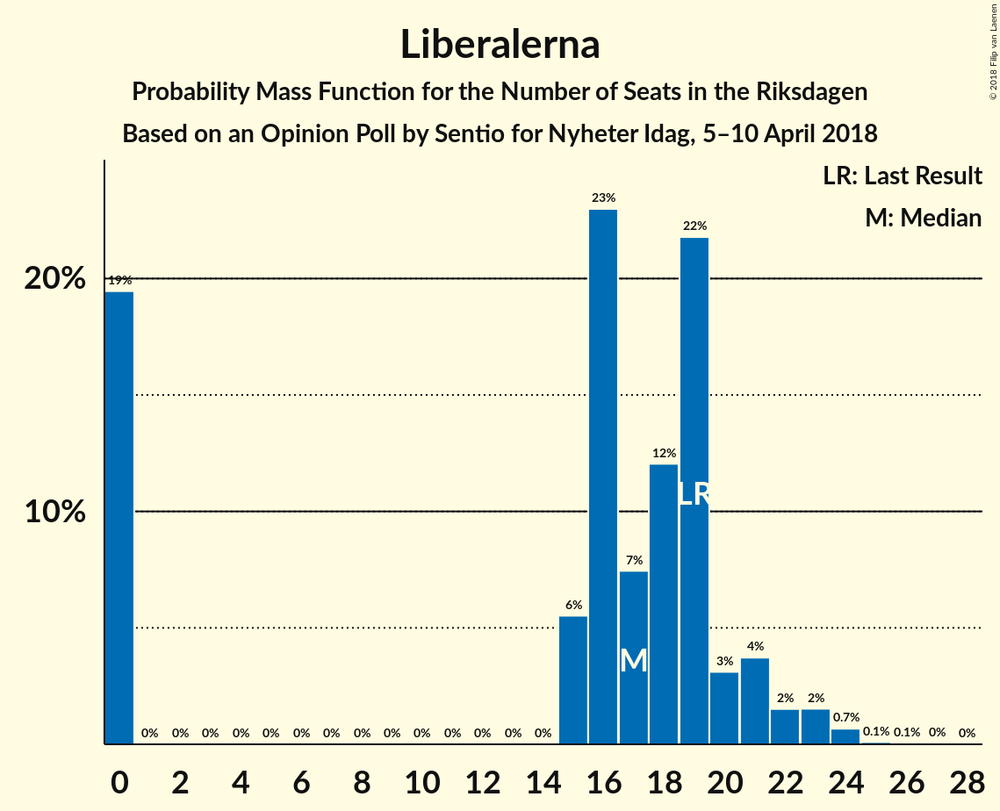

| Number of Seats | Probability | Accumulated | Special Marks |
|:---------------:|:-----------:|:-----------:|:-------------:|
| 0 | 15% | 100% |  |
| 1 | 0% | 85% |  |
| 2 | 0% | 85% |  |
| 3 | 0% | 85% |  |
| 4 | 0% | 85% |  |
| 5 | 0% | 85% |  |
| 6 | 0% | 85% |  |
| 7 | 0% | 85% |  |
| 8 | 0% | 85% |  |
| 9 | 0% | 85% |  |
| 10 | 0% | 85% |  |
| 11 | 0% | 85% |  |
| 12 | 0% | 85% |  |
| 13 | 0% | 85% |  |
| 14 | 0% | 85% |  |
| 15 | 3% | 85% |  |
| 16 | 31% | 82% |  |
| 17 | 7% | 51% | Median |
| 18 | 9% | 44% |  |
| 19 | 24% | 35% | Last Result |
| 20 | 4% | 11% |  |
| 21 | 3% | 7% |  |
| 22 | 3% | 5% |  |
| 23 | 1.0% | 2% |  |
| 24 | 0.5% | 0.7% |  |
| 25 | 0.1% | 0.2% |  |
| 26 | 0.1% | 0.1% |  |
| 27 | 0% | 0% |  |

### Feministiskt initiativ

*For a full overview of the results for this party, see the [Feministiskt initiativ](party-feministisktinitiativ.html) page.*

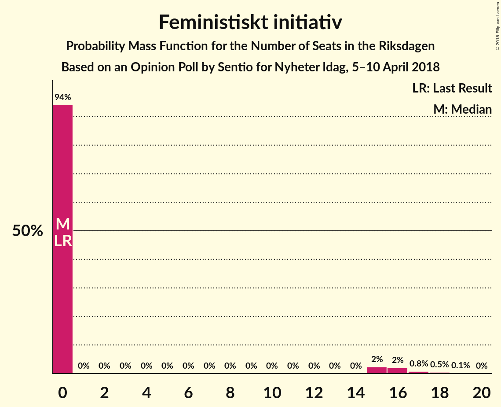

| Number of Seats | Probability | Accumulated | Special Marks |
|:---------------:|:-----------:|:-----------:|:-------------:|
| 0 | 94% | 100% | Last Result, Median |
| 1 | 0% | 6% |  |
| 2 | 0% | 6% |  |
| 3 | 0% | 6% |  |
| 4 | 0% | 6% |  |
| 5 | 0% | 6% |  |
| 6 | 0% | 6% |  |
| 7 | 0% | 6% |  |
| 8 | 0% | 6% |  |
| 9 | 0% | 6% |  |
| 10 | 0% | 6% |  |
| 11 | 0% | 6% |  |
| 12 | 0% | 6% |  |
| 13 | 0% | 6% |  |
| 14 | 0% | 6% |  |
| 15 | 3% | 6% |  |
| 16 | 2% | 3% |  |
| 17 | 0.5% | 1.3% |  |
| 18 | 0.6% | 0.8% |  |
| 19 | 0.1% | 0.2% |  |
| 20 | 0% | 0% |  |

### Kristdemokraterna

*For a full overview of the results for this party, see the [Kristdemokraterna](party-kristdemokraterna.html) page.*

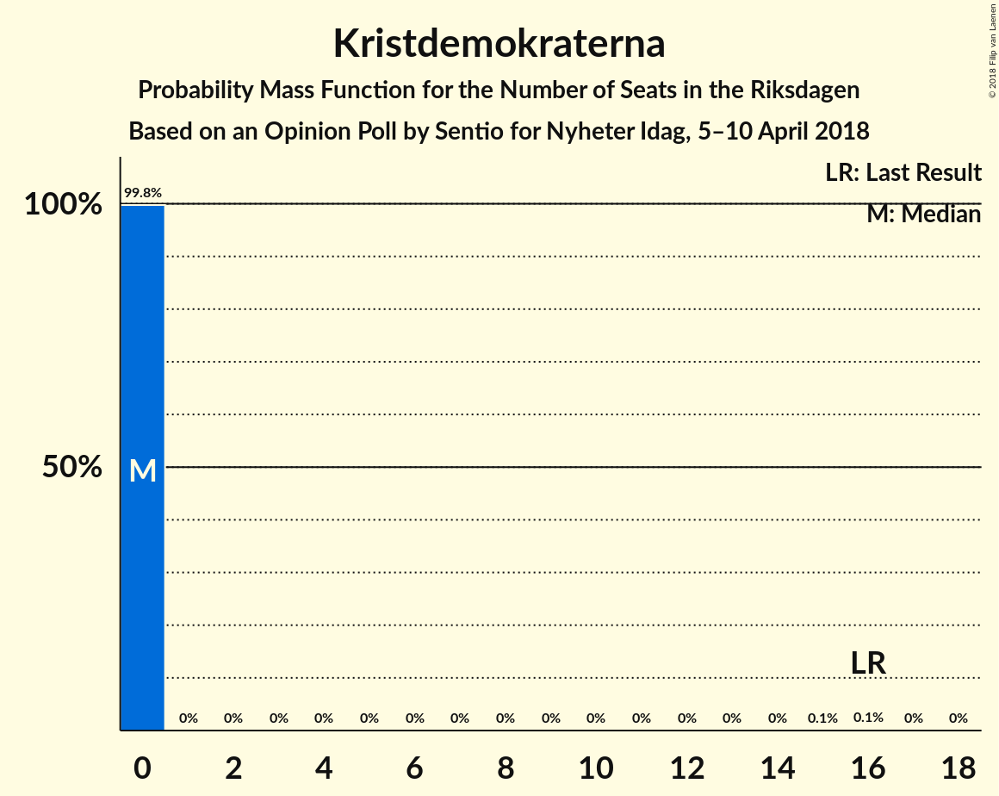

| Number of Seats | Probability | Accumulated | Special Marks |
|:---------------:|:-----------:|:-----------:|:-------------:|
| 0 | 99.8% | 100% | Median |
| 1 | 0% | 0.2% |  |
| 2 | 0% | 0.2% |  |
| 3 | 0% | 0.2% |  |
| 4 | 0% | 0.2% |  |
| 5 | 0% | 0.2% |  |
| 6 | 0% | 0.2% |  |
| 7 | 0% | 0.2% |  |
| 8 | 0% | 0.2% |  |
| 9 | 0% | 0.2% |  |
| 10 | 0% | 0.2% |  |
| 11 | 0% | 0.2% |  |
| 12 | 0% | 0.2% |  |
| 13 | 0% | 0.2% |  |
| 14 | 0% | 0.2% |  |
| 15 | 0.1% | 0.2% |  |
| 16 | 0.1% | 0.2% | Last Result |
| 17 | 0% | 0% |  |

## Coalitions

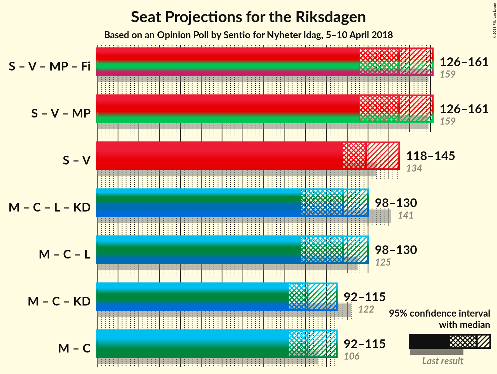

### Confidence Intervals

| Coalition | Last Result | Median | Majority? | 80% Confidence Interval | 90% Confidence Interval | 95% Confidence Interval | 99% Confidence Interval |
|:---------:|:-----------:|:------:|:---------:|:-----------------------:|:-----------------------:|:-----------------------:|:-----------------------:|
| Sveriges socialdemokratiska arbetareparti – Vänsterpartiet – Miljöpartiet de gröna – Feministiskt initiativ | 159 | 145 | 0% | 135–156 | 130–159 | 127–162 | 125–168 |
| Sveriges socialdemokratiska arbetareparti – Vänsterpartiet – Miljöpartiet de gröna | 159 | 144 | 0% | 135–155 | 130–158 | 126–160 | 123–166 |
| Sveriges socialdemokratiska arbetareparti – Vänsterpartiet | 134 | 132 | 0% | 123–143 | 122–143 | 119–145 | 114–151 |
| Moderata samlingspartiet – Centerpartiet – Liberalerna – Kristdemokraterna | 141 | 120 | 0% | 106–127 | 101–128 | 98–130 | 95–134 |
| Moderata samlingspartiet – Centerpartiet – Liberalerna | 125 | 120 | 0% | 106–127 | 101–128 | 98–130 | 95–134 |
| Moderata samlingspartiet – Centerpartiet – Kristdemokraterna | 122 | 102 | 0% | 95–109 | 92–112 | 91–115 | 86–122 |
| Moderata samlingspartiet – Centerpartiet | 106 | 102 | 0% | 95–109 | 92–112 | 91–114 | 86–122 |

### Sveriges socialdemokratiska arbetareparti – Vänsterpartiet – Miljöpartiet de gröna – Feministiskt initiativ

| Number of Seats | Probability | Accumulated | Special Marks |
|:---------------:|:-----------:|:-----------:|:-------------:|
| 120 | 0% | 100% |  |
| 121 | 0% | 99.9% |  |
| 122 | 0% | 99.9% |  |
| 123 | 0.1% | 99.9% |  |
| 124 | 0.2% | 99.8% |  |
| 125 | 0.6% | 99.6% |  |
| 126 | 1.2% | 99.0% |  |
| 127 | 1.3% | 98% |  |
| 128 | 0.1% | 96% |  |
| 129 | 0.3% | 96% |  |
| 130 | 2% | 96% |  |
| 131 | 0.6% | 94% |  |
| 132 | 0.8% | 93% |  |
| 133 | 0.4% | 92% |  |
| 134 | 0.3% | 92% |  |
| 135 | 6% | 92% |  |
| 136 | 6% | 86% |  |
| 137 | 0.6% | 80% |  |
| 138 | 1.2% | 79% |  |
| 139 | 1.5% | 78% |  |
| 140 | 3% | 77% |  |
| 141 | 2% | 74% |  |
| 142 | 6% | 72% |  |
| 143 | 11% | 67% |  |
| 144 | 3% | 55% |  |
| 145 | 11% | 52% |  |
| 146 | 3% | 41% |  |
| 147 | 1.2% | 39% |  |
| 148 | 7% | 38% | Median |
| 149 | 3% | 30% |  |
| 150 | 2% | 28% |  |
| 151 | 2% | 26% |  |
| 152 | 7% | 24% |  |
| 153 | 2% | 17% |  |
| 154 | 0.8% | 15% |  |
| 155 | 3% | 15% |  |
| 156 | 3% | 12% |  |
| 157 | 0.4% | 9% |  |
| 158 | 3% | 8% |  |
| 159 | 0.9% | 5% | Last Result |
| 160 | 0.7% | 4% |  |
| 161 | 0.7% | 4% |  |
| 162 | 0.8% | 3% |  |
| 163 | 0.6% | 2% |  |
| 164 | 0.2% | 2% |  |
| 165 | 0.5% | 1.5% |  |
| 166 | 0.1% | 1.0% |  |
| 167 | 0.2% | 0.9% |  |
| 168 | 0.2% | 0.7% |  |
| 169 | 0.1% | 0.5% |  |
| 170 | 0% | 0.4% |  |
| 171 | 0.1% | 0.3% |  |
| 172 | 0.1% | 0.3% |  |
| 173 | 0% | 0.2% |  |
| 174 | 0.1% | 0.2% |  |
| 175 | 0% | 0% | Majority |

### Sveriges socialdemokratiska arbetareparti – Vänsterpartiet – Miljöpartiet de gröna

| Number of Seats | Probability | Accumulated | Special Marks |
|:---------------:|:-----------:|:-----------:|:-------------:|
| 117 | 0.2% | 100% |  |
| 118 | 0% | 99.8% |  |
| 119 | 0% | 99.8% |  |
| 120 | 0% | 99.8% |  |
| 121 | 0% | 99.7% |  |
| 122 | 0% | 99.7% |  |
| 123 | 0.2% | 99.7% |  |
| 124 | 0.2% | 99.5% |  |
| 125 | 0.6% | 99.3% |  |
| 126 | 1.3% | 98.7% |  |
| 127 | 1.4% | 97% |  |
| 128 | 0.2% | 96% |  |
| 129 | 0.3% | 96% |  |
| 130 | 2% | 96% |  |
| 131 | 0.7% | 93% |  |
| 132 | 0.9% | 93% |  |
| 133 | 0.2% | 92% |  |
| 134 | 0.4% | 92% |  |
| 135 | 6% | 91% |  |
| 136 | 6% | 86% |  |
| 137 | 0.7% | 79% |  |
| 138 | 2% | 79% |  |
| 139 | 2% | 77% |  |
| 140 | 3% | 75% |  |
| 141 | 3% | 73% |  |
| 142 | 6% | 70% |  |
| 143 | 12% | 64% |  |
| 144 | 3% | 51% |  |
| 145 | 11% | 48% |  |
| 146 | 3% | 37% |  |
| 147 | 1.3% | 34% |  |
| 148 | 7% | 33% | Median |
| 149 | 3% | 26% |  |
| 150 | 2% | 23% |  |
| 151 | 2% | 22% |  |
| 152 | 7% | 20% |  |
| 153 | 2% | 13% |  |
| 154 | 0.7% | 11% |  |
| 155 | 3% | 10% |  |
| 156 | 1.4% | 7% |  |
| 157 | 0.4% | 6% |  |
| 158 | 2% | 5% |  |
| 159 | 0.5% | 4% | Last Result |
| 160 | 0.6% | 3% |  |
| 161 | 0.4% | 2% |  |
| 162 | 0.3% | 2% |  |
| 163 | 0.5% | 2% |  |
| 164 | 0.1% | 1.1% |  |
| 165 | 0.5% | 1.0% |  |
| 166 | 0.1% | 0.5% |  |
| 167 | 0% | 0.5% |  |
| 168 | 0.2% | 0.4% |  |
| 169 | 0.1% | 0.2% |  |
| 170 | 0% | 0.1% |  |
| 171 | 0% | 0.1% |  |
| 172 | 0.1% | 0.1% |  |
| 173 | 0% | 0% |  |

### Sveriges socialdemokratiska arbetareparti – Vänsterpartiet

| Number of Seats | Probability | Accumulated | Special Marks |
|:---------------:|:-----------:|:-----------:|:-------------:|
| 111 | 0% | 100% |  |
| 112 | 0.1% | 99.9% |  |
| 113 | 0.1% | 99.9% |  |
| 114 | 0.4% | 99.7% |  |
| 115 | 0.5% | 99.3% |  |
| 116 | 0.1% | 98.8% |  |
| 117 | 0.5% | 98.7% |  |
| 118 | 0.5% | 98% |  |
| 119 | 0.6% | 98% |  |
| 120 | 1.2% | 97% |  |
| 121 | 0.7% | 96% |  |
| 122 | 1.2% | 95% |  |
| 123 | 5% | 94% |  |
| 124 | 2% | 89% |  |
| 125 | 1.4% | 86% |  |
| 126 | 4% | 85% |  |
| 127 | 5% | 81% |  |
| 128 | 3% | 76% |  |
| 129 | 10% | 73% |  |
| 130 | 10% | 63% |  |
| 131 | 3% | 53% |  |
| 132 | 1.0% | 50% | Median |
| 133 | 2% | 49% |  |
| 134 | 3% | 48% | Last Result |
| 135 | 6% | 45% |  |
| 136 | 12% | 39% |  |
| 137 | 2% | 27% |  |
| 138 | 3% | 25% |  |
| 139 | 2% | 22% |  |
| 140 | 3% | 20% |  |
| 141 | 2% | 17% |  |
| 142 | 0.4% | 16% |  |
| 143 | 11% | 15% |  |
| 144 | 1.0% | 5% |  |
| 145 | 1.5% | 4% |  |
| 146 | 0.2% | 2% |  |
| 147 | 0.9% | 2% |  |
| 148 | 0.3% | 1.0% |  |
| 149 | 0.1% | 0.7% |  |
| 150 | 0.1% | 0.7% |  |
| 151 | 0.1% | 0.5% |  |
| 152 | 0.1% | 0.4% |  |
| 153 | 0% | 0.3% |  |
| 154 | 0.1% | 0.3% |  |
| 155 | 0% | 0.1% |  |
| 156 | 0% | 0.1% |  |
| 157 | 0% | 0.1% |  |
| 158 | 0% | 0.1% |  |
| 159 | 0% | 0.1% |  |
| 160 | 0.1% | 0.1% |  |
| 161 | 0% | 0% |  |

### Moderata samlingspartiet – Centerpartiet – Liberalerna – Kristdemokraterna

| Number of Seats | Probability | Accumulated | Special Marks |
|:---------------:|:-----------:|:-----------:|:-------------:|
| 89 | 0.1% | 100% |  |
| 90 | 0% | 99.9% |  |
| 91 | 0% | 99.9% |  |
| 92 | 0.1% | 99.9% |  |
| 93 | 0% | 99.8% |  |
| 94 | 0% | 99.7% |  |
| 95 | 0.5% | 99.7% |  |
| 96 | 0.9% | 99.2% |  |
| 97 | 0.7% | 98% |  |
| 98 | 0.3% | 98% |  |
| 99 | 0.7% | 97% |  |
| 100 | 0.5% | 97% |  |
| 101 | 1.1% | 96% |  |
| 102 | 1.1% | 95% |  |
| 103 | 0.2% | 94% |  |
| 104 | 1.4% | 94% |  |
| 105 | 0.6% | 92% |  |
| 106 | 2% | 92% |  |
| 107 | 0.6% | 90% |  |
| 108 | 1.2% | 89% |  |
| 109 | 0.9% | 88% |  |
| 110 | 4% | 87% |  |
| 111 | 0.7% | 83% |  |
| 112 | 4% | 82% |  |
| 113 | 1.3% | 79% |  |
| 114 | 3% | 77% |  |
| 115 | 11% | 74% |  |
| 116 | 5% | 63% |  |
| 117 | 2% | 58% |  |
| 118 | 4% | 56% |  |
| 119 | 1.4% | 52% | Median |
| 120 | 11% | 51% |  |
| 121 | 3% | 40% |  |
| 122 | 2% | 36% |  |
| 123 | 7% | 35% |  |
| 124 | 13% | 28% |  |
| 125 | 1.5% | 16% |  |
| 126 | 2% | 14% |  |
| 127 | 7% | 12% |  |
| 128 | 2% | 5% |  |
| 129 | 0.7% | 4% |  |
| 130 | 0.7% | 3% |  |
| 131 | 1.2% | 2% |  |
| 132 | 0.2% | 1.2% |  |
| 133 | 0.3% | 1.0% |  |
| 134 | 0.2% | 0.6% |  |
| 135 | 0.2% | 0.4% |  |
| 136 | 0.1% | 0.2% |  |
| 137 | 0% | 0.2% |  |
| 138 | 0% | 0.2% |  |
| 139 | 0% | 0.2% |  |
| 140 | 0% | 0.1% |  |
| 141 | 0.1% | 0.1% | Last Result |
| 142 | 0% | 0% |  |

### Moderata samlingspartiet – Centerpartiet – Liberalerna

| Number of Seats | Probability | Accumulated | Special Marks |
|:---------------:|:-----------:|:-----------:|:-------------:|
| 89 | 0.1% | 100% |  |
| 90 | 0% | 99.9% |  |
| 91 | 0% | 99.9% |  |
| 92 | 0.1% | 99.9% |  |
| 93 | 0% | 99.8% |  |
| 94 | 0.1% | 99.7% |  |
| 95 | 0.5% | 99.7% |  |
| 96 | 0.9% | 99.2% |  |
| 97 | 0.7% | 98% |  |
| 98 | 0.3% | 98% |  |
| 99 | 0.7% | 97% |  |
| 100 | 0.5% | 96% |  |
| 101 | 1.1% | 96% |  |
| 102 | 1.1% | 95% |  |
| 103 | 0.2% | 94% |  |
| 104 | 1.4% | 94% |  |
| 105 | 0.7% | 92% |  |
| 106 | 2% | 91% |  |
| 107 | 0.6% | 90% |  |
| 108 | 1.2% | 89% |  |
| 109 | 0.9% | 88% |  |
| 110 | 4% | 87% |  |
| 111 | 0.7% | 83% |  |
| 112 | 4% | 82% |  |
| 113 | 1.4% | 78% |  |
| 114 | 3% | 77% |  |
| 115 | 11% | 74% |  |
| 116 | 5% | 63% |  |
| 117 | 2% | 58% |  |
| 118 | 4% | 56% |  |
| 119 | 1.4% | 52% | Median |
| 120 | 11% | 51% |  |
| 121 | 3% | 40% |  |
| 122 | 2% | 36% |  |
| 123 | 7% | 35% |  |
| 124 | 12% | 28% |  |
| 125 | 1.4% | 15% | Last Result |
| 126 | 2% | 14% |  |
| 127 | 7% | 12% |  |
| 128 | 2% | 5% |  |
| 129 | 0.7% | 4% |  |
| 130 | 0.7% | 3% |  |
| 131 | 1.2% | 2% |  |
| 132 | 0.2% | 1.1% |  |
| 133 | 0.3% | 0.9% |  |
| 134 | 0.2% | 0.6% |  |
| 135 | 0.2% | 0.4% |  |
| 136 | 0.1% | 0.2% |  |
| 137 | 0% | 0.2% |  |
| 138 | 0% | 0.2% |  |
| 139 | 0% | 0.2% |  |
| 140 | 0% | 0.1% |  |
| 141 | 0.1% | 0.1% |  |
| 142 | 0% | 0% |  |

### Moderata samlingspartiet – Centerpartiet – Kristdemokraterna

| Number of Seats | Probability | Accumulated | Special Marks |
|:---------------:|:-----------:|:-----------:|:-------------:|
| 84 | 0% | 100% |  |
| 85 | 0.2% | 99.9% |  |
| 86 | 0.3% | 99.7% |  |
| 87 | 0.1% | 99.4% |  |
| 88 | 0.3% | 99.3% |  |
| 89 | 0.3% | 99.0% |  |
| 90 | 0.8% | 98.7% |  |
| 91 | 0.6% | 98% |  |
| 92 | 3% | 97% |  |
| 93 | 1.4% | 95% |  |
| 94 | 3% | 93% |  |
| 95 | 3% | 91% |  |
| 96 | 4% | 88% |  |
| 97 | 2% | 84% |  |
| 98 | 3% | 82% |  |
| 99 | 10% | 79% |  |
| 100 | 2% | 69% |  |
| 101 | 12% | 67% |  |
| 102 | 5% | 54% | Median |
| 103 | 2% | 50% |  |
| 104 | 12% | 48% |  |
| 105 | 4% | 35% |  |
| 106 | 3% | 32% |  |
| 107 | 2% | 29% |  |
| 108 | 16% | 28% |  |
| 109 | 1.2% | 11% |  |
| 110 | 2% | 10% |  |
| 111 | 1.0% | 8% |  |
| 112 | 2% | 7% |  |
| 113 | 1.0% | 5% |  |
| 114 | 1.3% | 4% |  |
| 115 | 0.7% | 3% |  |
| 116 | 0.5% | 2% |  |
| 117 | 0.3% | 1.4% |  |
| 118 | 0.2% | 1.1% |  |
| 119 | 0.1% | 0.9% |  |
| 120 | 0.2% | 0.8% |  |
| 121 | 0.1% | 0.6% |  |
| 122 | 0.5% | 0.6% | Last Result |
| 123 | 0% | 0.1% |  |
| 124 | 0% | 0.1% |  |
| 125 | 0% | 0.1% |  |
| 126 | 0% | 0.1% |  |
| 127 | 0.1% | 0.1% |  |
| 128 | 0% | 0% |  |

### Moderata samlingspartiet – Centerpartiet

| Number of Seats | Probability | Accumulated | Special Marks |
|:---------------:|:-----------:|:-----------:|:-------------:|
| 84 | 0% | 100% |  |
| 85 | 0.2% | 99.9% |  |
| 86 | 0.3% | 99.7% |  |
| 87 | 0.1% | 99.4% |  |
| 88 | 0.3% | 99.3% |  |
| 89 | 0.3% | 99.0% |  |
| 90 | 0.8% | 98.7% |  |
| 91 | 0.6% | 98% |  |
| 92 | 3% | 97% |  |
| 93 | 1.4% | 95% |  |
| 94 | 3% | 93% |  |
| 95 | 3% | 91% |  |
| 96 | 4% | 88% |  |
| 97 | 2% | 84% |  |
| 98 | 3% | 82% |  |
| 99 | 10% | 79% |  |
| 100 | 2% | 69% |  |
| 101 | 12% | 67% |  |
| 102 | 5% | 54% | Median |
| 103 | 2% | 50% |  |
| 104 | 12% | 48% |  |
| 105 | 4% | 35% |  |
| 106 | 3% | 32% | Last Result |
| 107 | 2% | 29% |  |
| 108 | 16% | 27% |  |
| 109 | 1.2% | 11% |  |
| 110 | 2% | 10% |  |
| 111 | 1.0% | 7% |  |
| 112 | 2% | 6% |  |
| 113 | 1.0% | 5% |  |
| 114 | 1.3% | 4% |  |
| 115 | 0.7% | 2% |  |
| 116 | 0.5% | 2% |  |
| 117 | 0.3% | 1.3% |  |
| 118 | 0.2% | 1.0% |  |
| 119 | 0.1% | 0.8% |  |
| 120 | 0.2% | 0.7% |  |
| 121 | 0% | 0.6% |  |
| 122 | 0.5% | 0.5% |  |
| 123 | 0% | 0.1% |  |
| 124 | 0% | 0.1% |  |
| 125 | 0% | 0.1% |  |
| 126 | 0% | 0.1% |  |
| 127 | 0.1% | 0.1% |  |
| 128 | 0% | 0% |  |

## Technical Information

### Opinion Poll

+ **Polling firm:** Sentio
+ **Commissioner(s):** Nyheter Idag
+ **Fieldwork period:** 5–10 April 2018

### Calculations

+ **Sample size:** 1111
+ **Simulations done:** 524,288
+ **Error estimate:** 2.44%

