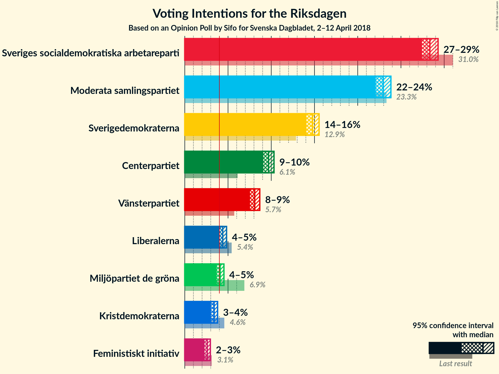

# Opinion Poll by Sifo for Svenska Dagbladet, 2–12 April 2018

<a href="#voting-intentions">Voting Intentions</a> | <a href="#seats">Seats</a> | <a href="#coalitions">Coalitions</a> | <a href="#technical-information">Technical Information</a>

## Voting Intentions

### Confidence Intervals

| Party | Last Result | Poll Result | 80% Confidence Interval | 90% Confidence Interval | 95% Confidence Interval | 99% Confidence Interval |
|:-----:|:-----------:|:-----------:|:-----------------------:|:-----------------------:|:-----------------------:|:-----------------------:|
| Sveriges socialdemokratiska arbetareparti | 31.0% | 28.3% | 27.7–29.0% |27.6–29.2% |27.4–29.3% |27.1–29.6% |
| Moderata samlingspartiet | 23.3% | 23.0% | 22.4–23.5% |22.2–23.7% |22.1–23.9% |21.8–24.1% |
| Sverigedemokraterna | 12.9% | 14.8% | 14.3–15.3% |14.1–15.4% |14.0–15.5% |13.8–15.8% |
| Centerpartiet | 6.1% | 9.7% | 9.3–10.1% |9.1–10.2% |9.1–10.3% |8.9–10.5% |
| Vänsterpartiet | 5.7% | 8.1% | 7.7–8.5% |7.6–8.6% |7.5–8.7% |7.4–8.9% |
| Liberalerna | 5.4% | 4.4% | 4.1–4.7% |4.0–4.8% |4.0–4.8% |3.8–5.0% |
| Miljöpartiet de gröna | 6.9% | 4.1% | 3.8–4.4% |3.7–4.5% |3.7–4.5% |3.6–4.7% |
| Kristdemokraterna | 4.6% | 3.4% | 3.2–3.7% |3.1–3.7% |3.0–3.8% |2.9–3.9% |
| Feministiskt initiativ | 3.1% | 2.6% | 2.4–2.8% |2.3–2.9% |2.3–3.0% |2.2–3.1% |

*Note:* The poll result column reflects the actual value used in the calculations. Published results may vary slightly, and in addition be rounded to fewer digits.

## Seats

### Confidence Intervals

| Party | Last Result | Median | 80% Confidence Interval | 90% Confidence Interval | 95% Confidence Interval | 99% Confidence Interval |
|:-----:|:-----------:|:------:|:-----------------------:|:-----------------------:|:-----------------------:|:-----------------------:|
| <a href="#sveriges-socialdemokratiska-arbetareparti">Sveriges socialdemokratiska arbetareparti</a> | 113 | N/A | N/A |N/A |N/A |N/A |
| <a href="#moderata-samlingspartiet">Moderata samlingspartiet</a> | 84 | N/A | N/A |N/A |N/A |N/A |
| <a href="#sverigedemokraterna">Sverigedemokraterna</a> | 49 | N/A | N/A |N/A |N/A |N/A |
| <a href="#centerpartiet">Centerpartiet</a> | 22 | N/A | N/A |N/A |N/A |N/A |
| <a href="#vänsterpartiet">Vänsterpartiet</a> | 21 | N/A | N/A |N/A |N/A |N/A |
| <a href="#liberalerna">Liberalerna</a> | 19 | N/A | N/A |N/A |N/A |N/A |
| <a href="#miljöpartiet-de-gröna">Miljöpartiet de gröna</a> | 25 | N/A | N/A |N/A |N/A |N/A |
| <a href="#kristdemokraterna">Kristdemokraterna</a> | 16 | N/A | N/A |N/A |N/A |N/A |
| <a href="#feministiskt-initiativ">Feministiskt initiativ</a> | 0 | N/A | N/A |N/A |N/A |N/A |

## Coalitions

## Technical Information

### Opinion Poll

+ **Polling firm:** Sifo
+ **Commissioner(s):** Svenska Dagbladet
+ **Fieldwork period:** 2–12 April 2018

### Calculations

+ **Sample size:** 9049
+ **Simulations done:** 0
+ **Error estimate:** 100.00%

