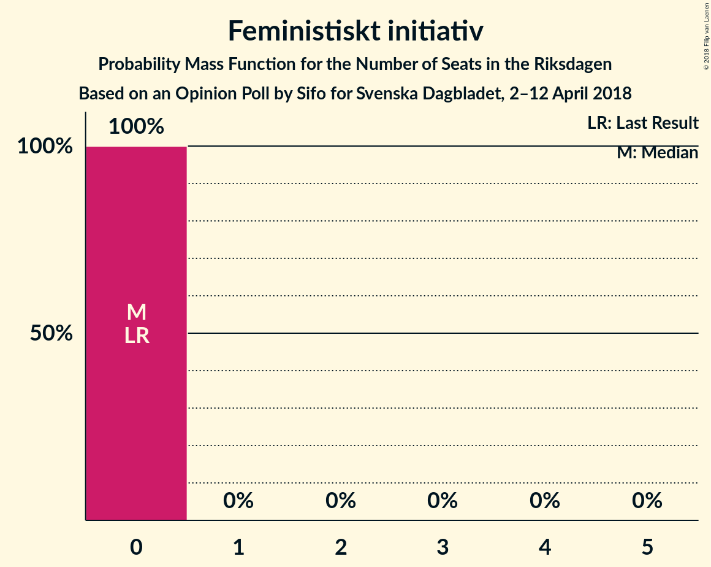

# Opinion Poll by Sifo for Svenska Dagbladet, 2–12 April 2018

<a href="#voting-intentions">Voting Intentions</a> | <a href="#seats">Seats</a> | <a href="#coalitions">Coalitions</a> | <a href="#technical-information">Technical Information</a>

## Voting Intentions

### Confidence Intervals

| Party | Last Result | Poll Result | 80% Confidence Interval | 90% Confidence Interval | 95% Confidence Interval | 99% Confidence Interval |
|:-----:|:-----------:|:-----------:|:-----------------------:|:-----------------------:|:-----------------------:|:-----------------------:|
| Sveriges socialdemokratiska arbetareparti | 31.0% | 28.3% | 27.7–29.0% |27.6–29.1% |27.4–29.3% |27.1–29.6% |
| Moderata samlingspartiet | 23.3% | 23.0% | 22.4–23.5% |22.2–23.7% |22.1–23.8% |21.8–24.1% |
| Sverigedemokraterna | 12.9% | 14.8% | 14.3–15.3% |14.2–15.4% |14.1–15.5% |13.8–15.8% |
| Centerpartiet | 6.1% | 9.7% | 9.3–10.1% |9.2–10.2% |9.1–10.3% |8.9–10.5% |
| Vänsterpartiet | 5.7% | 8.1% | 7.7–8.5% |7.6–8.6% |7.5–8.7% |7.4–8.9% |
| Liberalerna | 5.4% | 4.4% | 4.1–4.7% |4.0–4.8% |4.0–4.8% |3.9–5.0% |
| Miljöpartiet de gröna | 6.9% | 4.1% | 3.8–4.4% |3.7–4.5% |3.7–4.5% |3.6–4.7% |
| Kristdemokraterna | 4.6% | 3.4% | 3.2–3.7% |3.1–3.7% |3.0–3.8% |2.9–3.9% |
| Feministiskt initiativ | 3.1% | 2.6% | 2.4–2.8% |2.3–2.9% |2.3–3.0% |2.2–3.1% |

*Note:* The poll result column reflects the actual value used in the calculations. Published results may vary slightly, and in addition be rounded to fewer digits.

## Seats

### Confidence Intervals

| Party | Last Result | Median | 80% Confidence Interval | 90% Confidence Interval | 95% Confidence Interval | 99% Confidence Interval |
|:-----:|:-----------:|:------:|:-----------------------:|:-----------------------:|:-----------------------:|:-----------------------:|
| <a href="#sveriges-socialdemokratiska-arbetareparti">Sveriges socialdemokratiska arbetareparti</a> | 113 | 108 | 105–114 |104–114 |104–114 |103–117 |
| <a href="#moderata-samlingspartiet">Moderata samlingspartiet</a> | 84 | 88 | 84–92 |84–93 |84–94 |82–96 |
| <a href="#sverigedemokraterna">Sverigedemokraterna</a> | 49 | 56 | 55–59 |54–60 |53–61 |53–62 |
| <a href="#centerpartiet">Centerpartiet</a> | 22 | 37 | 35–40 |34–40 |34–41 |33–41 |
| <a href="#vänsterpartiet">Vänsterpartiet</a> | 21 | 31 | 29–33 |29–34 |28–34 |28–35 |
| <a href="#liberalerna">Liberalerna</a> | 19 | 17 | 16–18 |15–18 |0–19 |0–19 |
| <a href="#miljöpartiet-de-gröna">Miljöpartiet de gröna</a> | 25 | 15 | 0–17 |0–17 |0–17 |0–18 |
| <a href="#kristdemokraterna">Kristdemokraterna</a> | 16 | 0 | 0 |0 |0 |0 |
| <a href="#feministiskt-initiativ">Feministiskt initiativ</a> | 0 | 0 | 0 |0 |0 |0 |

### Sveriges socialdemokratiska arbetareparti

*For a full overview of the results for this party, see the [Sveriges socialdemokratiska arbetareparti](party-sverigessocialdemokratiskaarbetareparti.html) page.*

| Number of Seats | Probability | Accumulated | Special Marks |
|:---------------:|:-----------:|:-----------:|:-------------:|
| 101 | 0.1% | 100% |  |
| 102 | 0.2% | 99.9% |  |
| 103 | 1.3% | 99.7% |  |
| 104 | 5% | 98% |  |
| 105 | 11% | 93% |  |
| 106 | 9% | 83% |  |
| 107 | 18% | 73% |  |
| 108 | 9% | 55% | Median |
| 109 | 5% | 46% |  |
| 110 | 8% | 41% |  |
| 111 | 6% | 34% |  |
| 112 | 7% | 28% |  |
| 113 | 10% | 21% | Last Result |
| 114 | 9% | 11% |  |
| 115 | 1.4% | 2% |  |
| 116 | 0.4% | 1.0% |  |
| 117 | 0.3% | 0.6% |  |
| 118 | 0% | 0.3% |  |
| 119 | 0.1% | 0.3% |  |
| 120 | 0% | 0.2% |  |
| 121 | 0.1% | 0.1% |  |
| 122 | 0% | 0% |  |

### Moderata samlingspartiet

*For a full overview of the results for this party, see the [Moderata samlingspartiet](party-moderatasamlingspartiet.html) page.*

| Number of Seats | Probability | Accumulated | Special Marks |
|:---------------:|:-----------:|:-----------:|:-------------:|
| 81 | 0.1% | 100% |  |
| 82 | 0.5% | 99.9% |  |
| 83 | 1.2% | 99.4% |  |
| 84 | 8% | 98% | Last Result |
| 85 | 9% | 90% |  |
| 86 | 9% | 81% |  |
| 87 | 9% | 72% |  |
| 88 | 17% | 63% | Median |
| 89 | 12% | 46% |  |
| 90 | 10% | 34% |  |
| 91 | 11% | 24% |  |
| 92 | 6% | 13% |  |
| 93 | 3% | 7% |  |
| 94 | 3% | 4% |  |
| 95 | 0.4% | 1.0% |  |
| 96 | 0.4% | 0.6% |  |
| 97 | 0.1% | 0.2% |  |
| 98 | 0.1% | 0.1% |  |
| 99 | 0% | 0% |  |

### Sverigedemokraterna

*For a full overview of the results for this party, see the [Sverigedemokraterna](party-sverigedemokraterna.html) page.*

| Number of Seats | Probability | Accumulated | Special Marks |
|:---------------:|:-----------:|:-----------:|:-------------:|
| 49 | 0% | 100% | Last Result |
| 50 | 0% | 100% |  |
| 51 | 0.1% | 100% |  |
| 52 | 0.4% | 99.9% |  |
| 53 | 4% | 99.6% |  |
| 54 | 5% | 96% |  |
| 55 | 15% | 91% |  |
| 56 | 30% | 76% | Median |
| 57 | 14% | 46% |  |
| 58 | 11% | 32% |  |
| 59 | 11% | 20% |  |
| 60 | 5% | 9% |  |
| 61 | 3% | 4% |  |
| 62 | 0.4% | 0.8% |  |
| 63 | 0.3% | 0.4% |  |
| 64 | 0% | 0.1% |  |
| 65 | 0% | 0.1% |  |
| 66 | 0% | 0% |  |

### Centerpartiet

*For a full overview of the results for this party, see the [Centerpartiet](party-centerpartiet.html) page.*

| Number of Seats | Probability | Accumulated | Special Marks |
|:---------------:|:-----------:|:-----------:|:-------------:|
| 22 | 0% | 100% | Last Result |
| 23 | 0% | 100% |  |
| 24 | 0% | 100% |  |
| 25 | 0% | 100% |  |
| 26 | 0% | 100% |  |
| 27 | 0% | 100% |  |
| 28 | 0% | 100% |  |
| 29 | 0% | 100% |  |
| 30 | 0% | 100% |  |
| 31 | 0% | 100% |  |
| 32 | 0% | 100% |  |
| 33 | 0.5% | 100% |  |
| 34 | 5% | 99.5% |  |
| 35 | 16% | 95% |  |
| 36 | 14% | 78% |  |
| 37 | 26% | 64% | Median |
| 38 | 19% | 38% |  |
| 39 | 8% | 18% |  |
| 40 | 7% | 10% |  |
| 41 | 3% | 3% |  |
| 42 | 0.2% | 0.4% |  |
| 43 | 0.1% | 0.1% |  |
| 44 | 0% | 0% |  |

### Vänsterpartiet

*For a full overview of the results for this party, see the [Vänsterpartiet](party-vänsterpartiet.html) page.*

| Number of Seats | Probability | Accumulated | Special Marks |
|:---------------:|:-----------:|:-----------:|:-------------:|
| 21 | 0% | 100% | Last Result |
| 22 | 0% | 100% |  |
| 23 | 0% | 100% |  |
| 24 | 0% | 100% |  |
| 25 | 0% | 100% |  |
| 26 | 0% | 100% |  |
| 27 | 0.1% | 100% |  |
| 28 | 3% | 99.9% |  |
| 29 | 9% | 97% |  |
| 30 | 13% | 88% |  |
| 31 | 28% | 75% | Median |
| 32 | 27% | 47% |  |
| 33 | 13% | 20% |  |
| 34 | 6% | 7% |  |
| 35 | 1.0% | 1.0% |  |
| 36 | 0% | 0.1% |  |
| 37 | 0% | 0% |  |

### Liberalerna

*For a full overview of the results for this party, see the [Liberalerna](party-liberalerna.html) page.*

| Number of Seats | Probability | Accumulated | Special Marks |
|:---------------:|:-----------:|:-----------:|:-------------:|
| 0 | 3% | 100% |  |
| 1 | 0% | 97% |  |
| 2 | 0% | 97% |  |
| 3 | 0% | 97% |  |
| 4 | 0% | 97% |  |
| 5 | 0% | 97% |  |
| 6 | 0% | 97% |  |
| 7 | 0% | 97% |  |
| 8 | 0% | 97% |  |
| 9 | 0% | 97% |  |
| 10 | 0% | 97% |  |
| 11 | 0% | 97% |  |
| 12 | 0% | 97% |  |
| 13 | 0% | 97% |  |
| 14 | 0% | 97% |  |
| 15 | 3% | 97% |  |
| 16 | 33% | 94% |  |
| 17 | 36% | 61% | Median |
| 18 | 21% | 25% |  |
| 19 | 4% | 4% | Last Result |
| 20 | 0.2% | 0.2% |  |
| 21 | 0% | 0% |  |

### Miljöpartiet de gröna

*For a full overview of the results for this party, see the [Miljöpartiet de gröna](party-miljöpartietdegröna.html) page.*

| Number of Seats | Probability | Accumulated | Special Marks |
|:---------------:|:-----------:|:-----------:|:-------------:|
| 0 | 35% | 100% |  |
| 1 | 0% | 65% |  |
| 2 | 0% | 65% |  |
| 3 | 0% | 65% |  |
| 4 | 0% | 65% |  |
| 5 | 0% | 65% |  |
| 6 | 0% | 65% |  |
| 7 | 0% | 65% |  |
| 8 | 0% | 65% |  |
| 9 | 0% | 65% |  |
| 10 | 0% | 65% |  |
| 11 | 0% | 65% |  |
| 12 | 0% | 65% |  |
| 13 | 0% | 65% |  |
| 14 | 0% | 65% |  |
| 15 | 18% | 65% | Median |
| 16 | 35% | 46% |  |
| 17 | 10% | 12% |  |
| 18 | 1.2% | 1.2% |  |
| 19 | 0% | 0% |  |
| 20 | 0% | 0% |  |
| 21 | 0% | 0% |  |
| 22 | 0% | 0% |  |
| 23 | 0% | 0% |  |
| 24 | 0% | 0% |  |
| 25 | 0% | 0% | Last Result |

### Kristdemokraterna

*For a full overview of the results for this party, see the [Kristdemokraterna](party-kristdemokraterna.html) page.*

| Number of Seats | Probability | Accumulated | Special Marks |
|:---------------:|:-----------:|:-----------:|:-------------:|
| 0 | 99.9% | 100% | Median |
| 1 | 0% | 0.1% |  |
| 2 | 0% | 0.1% |  |
| 3 | 0% | 0.1% |  |
| 4 | 0% | 0.1% |  |
| 5 | 0% | 0.1% |  |
| 6 | 0% | 0.1% |  |
| 7 | 0% | 0.1% |  |
| 8 | 0% | 0.1% |  |
| 9 | 0% | 0.1% |  |
| 10 | 0% | 0.1% |  |
| 11 | 0% | 0.1% |  |
| 12 | 0% | 0.1% |  |
| 13 | 0% | 0.1% |  |
| 14 | 0% | 0.1% |  |
| 15 | 0.1% | 0.1% |  |
| 16 | 0% | 0% | Last Result |

### Feministiskt initiativ

*For a full overview of the results for this party, see the [Feministiskt initiativ](party-feministisktinitiativ.html) page.*

| Number of Seats | Probability | Accumulated | Special Marks |
|:---------------:|:-----------:|:-----------:|:-------------:|
| 0 | 100% | 100% | Last Result, Median |

## Coalitions

### Confidence Intervals

| Coalition | Last Result | Median | Majority? | 80% Confidence Interval | 90% Confidence Interval | 95% Confidence Interval | 99% Confidence Interval |
|:---------:|:-----------:|:------:|:---------:|:-----------------------:|:-----------------------:|:-----------------------:|:-----------------------:|
| Sveriges socialdemokratiska arbetareparti – Vänsterpartiet – Miljöpartiet de gröna – Feministiskt initiativ | 159 | 152 | 0% | 144–156 | 143–157 | 142–159 | 140–163 |
| Sveriges socialdemokratiska arbetareparti – Vänsterpartiet – Miljöpartiet de gröna | 159 | 152 | 0% | 144–156 | 143–157 | 142–159 | 140–163 |
| Moderata samlingspartiet – Centerpartiet – Liberalerna – Kristdemokraterna | 141 | 141 | 0% | 138–147 | 136–148 | 132–149 | 128–151 |
| Moderata samlingspartiet – Centerpartiet – Liberalerna | 125 | 141 | 0% | 137–147 | 136–148 | 131–149 | 128–151 |
| Sveriges socialdemokratiska arbetareparti – Vänsterpartiet | 134 | 139 | 0% | 135–147 | 135–147 | 134–147 | 133–149 |
| Moderata samlingspartiet – Centerpartiet – Kristdemokraterna | 122 | 125 | 0% | 122–130 | 121–131 | 120–132 | 119–135 |
| Moderata samlingspartiet – Centerpartiet | 106 | 125 | 0% | 122–130 | 121–131 | 120–132 | 118–134 |
| Sveriges socialdemokratiska arbetareparti – Miljöpartiet de gröna | 138 | 121 | 0% | 112–125 | 110–126 | 110–127 | 108–130 |

### Sveriges socialdemokratiska arbetareparti – Vänsterpartiet – Miljöpartiet de gröna – Feministiskt initiativ

| Number of Seats | Probability | Accumulated | Special Marks |
|:---------------:|:-----------:|:-----------:|:-------------:|
| 138 | 0% | 100% |  |
| 139 | 0.2% | 99.9% |  |
| 140 | 0.8% | 99.7% |  |
| 141 | 0.8% | 98.9% |  |
| 142 | 3% | 98% |  |
| 143 | 3% | 95% |  |
| 144 | 8% | 92% |  |
| 145 | 6% | 84% |  |
| 146 | 3% | 78% |  |
| 147 | 8% | 74% |  |
| 148 | 1.4% | 66% |  |
| 149 | 2% | 65% |  |
| 150 | 2% | 63% |  |
| 151 | 8% | 60% |  |
| 152 | 8% | 53% |  |
| 153 | 10% | 45% |  |
| 154 | 18% | 35% | Median |
| 155 | 6% | 17% |  |
| 156 | 4% | 11% |  |
| 157 | 3% | 7% |  |
| 158 | 1.0% | 4% |  |
| 159 | 1.4% | 3% | Last Result |
| 160 | 0.4% | 2% |  |
| 161 | 0.3% | 1.2% |  |
| 162 | 0.2% | 0.9% |  |
| 163 | 0.5% | 0.6% |  |
| 164 | 0.1% | 0.1% |  |
| 165 | 0% | 0% |  |

### Sveriges socialdemokratiska arbetareparti – Vänsterpartiet – Miljöpartiet de gröna

| Number of Seats | Probability | Accumulated | Special Marks |
|:---------------:|:-----------:|:-----------:|:-------------:|
| 138 | 0% | 100% |  |
| 139 | 0.2% | 99.9% |  |
| 140 | 0.8% | 99.7% |  |
| 141 | 0.8% | 98.9% |  |
| 142 | 3% | 98% |  |
| 143 | 3% | 95% |  |
| 144 | 8% | 92% |  |
| 145 | 6% | 84% |  |
| 146 | 3% | 78% |  |
| 147 | 8% | 74% |  |
| 148 | 1.4% | 66% |  |
| 149 | 2% | 65% |  |
| 150 | 2% | 63% |  |
| 151 | 8% | 60% |  |
| 152 | 8% | 53% |  |
| 153 | 10% | 45% |  |
| 154 | 18% | 35% | Median |
| 155 | 6% | 17% |  |
| 156 | 4% | 11% |  |
| 157 | 3% | 7% |  |
| 158 | 1.0% | 4% |  |
| 159 | 1.4% | 3% | Last Result |
| 160 | 0.4% | 2% |  |
| 161 | 0.3% | 1.2% |  |
| 162 | 0.2% | 0.9% |  |
| 163 | 0.5% | 0.6% |  |
| 164 | 0.1% | 0.1% |  |
| 165 | 0% | 0% |  |

### Moderata samlingspartiet – Centerpartiet – Liberalerna – Kristdemokraterna

| Number of Seats | Probability | Accumulated | Special Marks |
|:---------------:|:-----------:|:-----------:|:-------------:|
| 126 | 0.1% | 100% |  |
| 127 | 0.1% | 99.9% |  |
| 128 | 0.7% | 99.8% |  |
| 129 | 1.0% | 99.1% |  |
| 130 | 0.5% | 98% |  |
| 131 | 0.2% | 98% |  |
| 132 | 0.3% | 98% |  |
| 133 | 0.2% | 97% |  |
| 134 | 0.4% | 97% |  |
| 135 | 0.6% | 97% |  |
| 136 | 2% | 96% |  |
| 137 | 4% | 94% |  |
| 138 | 6% | 90% |  |
| 139 | 19% | 84% |  |
| 140 | 6% | 65% |  |
| 141 | 13% | 59% | Last Result |
| 142 | 7% | 46% | Median |
| 143 | 5% | 39% |  |
| 144 | 3% | 34% |  |
| 145 | 7% | 31% |  |
| 146 | 8% | 24% |  |
| 147 | 9% | 15% |  |
| 148 | 3% | 6% |  |
| 149 | 2% | 4% |  |
| 150 | 0.8% | 1.4% |  |
| 151 | 0.4% | 0.6% |  |
| 152 | 0.1% | 0.2% |  |
| 153 | 0% | 0.1% |  |
| 154 | 0% | 0% |  |

### Moderata samlingspartiet – Centerpartiet – Liberalerna

| Number of Seats | Probability | Accumulated | Special Marks |
|:---------------:|:-----------:|:-----------:|:-------------:|
| 125 | 0% | 100% | Last Result |
| 126 | 0.1% | 100% |  |
| 127 | 0.1% | 99.9% |  |
| 128 | 0.7% | 99.8% |  |
| 129 | 1.0% | 99.1% |  |
| 130 | 0.5% | 98% |  |
| 131 | 0.2% | 98% |  |
| 132 | 0.3% | 97% |  |
| 133 | 0.2% | 97% |  |
| 134 | 0.5% | 97% |  |
| 135 | 0.6% | 97% |  |
| 136 | 2% | 96% |  |
| 137 | 4% | 94% |  |
| 138 | 6% | 90% |  |
| 139 | 19% | 84% |  |
| 140 | 6% | 65% |  |
| 141 | 13% | 59% |  |
| 142 | 7% | 46% | Median |
| 143 | 5% | 39% |  |
| 144 | 3% | 34% |  |
| 145 | 7% | 30% |  |
| 146 | 8% | 23% |  |
| 147 | 9% | 15% |  |
| 148 | 3% | 6% |  |
| 149 | 2% | 4% |  |
| 150 | 0.7% | 1.3% |  |
| 151 | 0.4% | 0.6% |  |
| 152 | 0.1% | 0.1% |  |
| 153 | 0% | 0% |  |

### Sveriges socialdemokratiska arbetareparti – Vänsterpartiet

| Number of Seats | Probability | Accumulated | Special Marks |
|:---------------:|:-----------:|:-----------:|:-------------:|
| 131 | 0.1% | 100% |  |
| 132 | 0.2% | 99.9% |  |
| 133 | 2% | 99.7% |  |
| 134 | 3% | 98% | Last Result |
| 135 | 5% | 95% |  |
| 136 | 13% | 90% |  |
| 137 | 5% | 76% |  |
| 138 | 11% | 71% |  |
| 139 | 13% | 60% | Median |
| 140 | 6% | 47% |  |
| 141 | 3% | 40% |  |
| 142 | 4% | 38% |  |
| 143 | 5% | 33% |  |
| 144 | 8% | 28% |  |
| 145 | 6% | 20% |  |
| 146 | 4% | 14% |  |
| 147 | 9% | 10% |  |
| 148 | 0.8% | 2% |  |
| 149 | 0.5% | 0.9% |  |
| 150 | 0.1% | 0.4% |  |
| 151 | 0.1% | 0.3% |  |
| 152 | 0.1% | 0.3% |  |
| 153 | 0.1% | 0.1% |  |
| 154 | 0% | 0.1% |  |
| 155 | 0% | 0% |  |

### Moderata samlingspartiet – Centerpartiet – Kristdemokraterna

| Number of Seats | Probability | Accumulated | Special Marks |
|:---------------:|:-----------:|:-----------:|:-------------:|
| 118 | 0.4% | 100% |  |
| 119 | 0.8% | 99.5% |  |
| 120 | 3% | 98.8% |  |
| 121 | 5% | 96% |  |
| 122 | 14% | 91% | Last Result |
| 123 | 16% | 77% |  |
| 124 | 7% | 60% |  |
| 125 | 10% | 54% | Median |
| 126 | 7% | 44% |  |
| 127 | 5% | 37% |  |
| 128 | 10% | 32% |  |
| 129 | 8% | 22% |  |
| 130 | 6% | 14% |  |
| 131 | 5% | 9% |  |
| 132 | 2% | 3% |  |
| 133 | 0.6% | 1.4% |  |
| 134 | 0.3% | 0.8% |  |
| 135 | 0.2% | 0.5% |  |
| 136 | 0.1% | 0.3% |  |
| 137 | 0.1% | 0.2% |  |
| 138 | 0% | 0.2% |  |
| 139 | 0.1% | 0.2% |  |
| 140 | 0% | 0.1% |  |
| 141 | 0% | 0% |  |

### Moderata samlingspartiet – Centerpartiet

| Number of Seats | Probability | Accumulated | Special Marks |
|:---------------:|:-----------:|:-----------:|:-------------:|
| 106 | 0% | 100% | Last Result |
| 107 | 0% | 100% |  |
| 108 | 0% | 100% |  |
| 109 | 0% | 100% |  |
| 110 | 0% | 100% |  |
| 111 | 0% | 100% |  |
| 112 | 0% | 100% |  |
| 113 | 0% | 100% |  |
| 114 | 0% | 100% |  |
| 115 | 0% | 100% |  |
| 116 | 0% | 100% |  |
| 117 | 0% | 100% |  |
| 118 | 0.5% | 99.9% |  |
| 119 | 0.8% | 99.5% |  |
| 120 | 3% | 98.7% |  |
| 121 | 5% | 96% |  |
| 122 | 14% | 91% |  |
| 123 | 16% | 77% |  |
| 124 | 7% | 60% |  |
| 125 | 10% | 54% | Median |
| 126 | 7% | 44% |  |
| 127 | 5% | 36% |  |
| 128 | 10% | 32% |  |
| 129 | 8% | 22% |  |
| 130 | 6% | 14% |  |
| 131 | 5% | 8% |  |
| 132 | 2% | 3% |  |
| 133 | 0.6% | 1.3% |  |
| 134 | 0.3% | 0.7% |  |
| 135 | 0.1% | 0.4% |  |
| 136 | 0.1% | 0.3% |  |
| 137 | 0.1% | 0.2% |  |
| 138 | 0% | 0.1% |  |
| 139 | 0.1% | 0.1% |  |
| 140 | 0% | 0.1% |  |
| 141 | 0% | 0% |  |

### Sveriges socialdemokratiska arbetareparti – Miljöpartiet de gröna

| Number of Seats | Probability | Accumulated | Special Marks |
|:---------------:|:-----------:|:-----------:|:-------------:|
| 106 | 0.1% | 100% |  |
| 107 | 0.1% | 99.9% |  |
| 108 | 0.5% | 99.8% |  |
| 109 | 0.6% | 99.3% |  |
| 110 | 4% | 98.7% |  |
| 111 | 4% | 95% |  |
| 112 | 6% | 91% |  |
| 113 | 10% | 85% |  |
| 114 | 8% | 75% |  |
| 115 | 1.3% | 67% |  |
| 116 | 0.4% | 66% |  |
| 117 | 0.3% | 65% |  |
| 118 | 0.5% | 65% |  |
| 119 | 3% | 64% |  |
| 120 | 5% | 62% |  |
| 121 | 7% | 57% |  |
| 122 | 19% | 50% |  |
| 123 | 11% | 31% | Median |
| 124 | 8% | 20% |  |
| 125 | 4% | 12% |  |
| 126 | 3% | 8% |  |
| 127 | 3% | 4% |  |
| 128 | 0.3% | 2% |  |
| 129 | 0.2% | 1.2% |  |
| 130 | 0.8% | 1.0% |  |
| 131 | 0.1% | 0.2% |  |
| 132 | 0.1% | 0.1% |  |
| 133 | 0% | 0% |  |
| 134 | 0% | 0% |  |
| 135 | 0% | 0% |  |
| 136 | 0% | 0% |  |
| 137 | 0% | 0% |  |
| 138 | 0% | 0% | Last Result |

## Technical Information

### Opinion Poll

+ **Polling firm:** Sifo
+ **Commissioner(s):** Svenska Dagbladet
+ **Fieldwork period:** 2–12 April 2018

### Calculations

+ **Sample size:** 9049
+ **Simulations done:** 1,048,576
+ **Error estimate:** 0.73%

