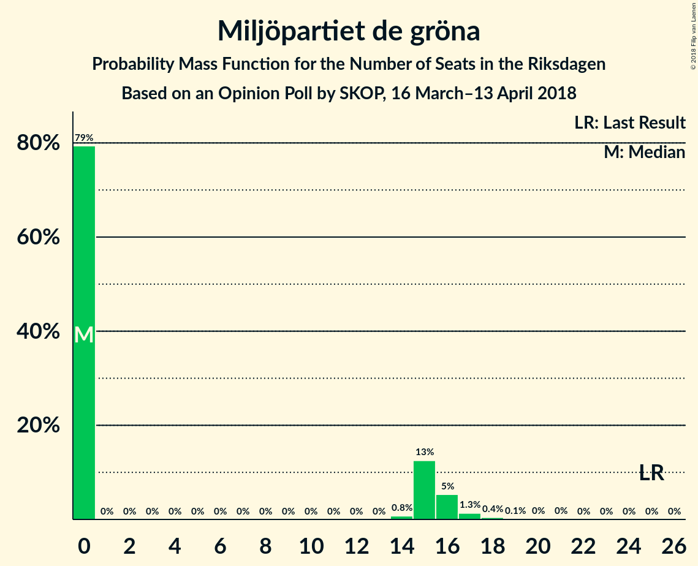

# Opinion Poll by SKOP, 16 March–13 April 2018

<a href="#voting-intentions">Voting Intentions</a> | <a href="#seats">Seats</a> | <a href="#coalitions">Coalitions</a> | <a href="#technical-information">Technical Information</a>

## Voting Intentions

### Confidence Intervals

| Party | Last Result | Poll Result | 80% Confidence Interval | 90% Confidence Interval | 95% Confidence Interval | 99% Confidence Interval |
|:-----:|:-----------:|:-----------:|:-----------------------:|:-----------------------:|:-----------------------:|:-----------------------:|
| Sveriges socialdemokratiska arbetareparti | 31.0% | 26.7% | 25.2–28.3% |24.7–28.7% |24.4–29.1% |23.7–29.9% |
| Moderata samlingspartiet | 23.3% | 25.1% | 23.6–26.7% |23.2–27.1% |22.9–27.5% |22.2–28.3% |
| Sverigedemokraterna | 12.9% | 16.7% | 15.4–18.0% |15.1–18.4% |14.8–18.8% |14.2–19.4% |
| Centerpartiet | 6.1% | 9.0% | 8.1–10.1% |7.8–10.4% |7.6–10.7% |7.2–11.2% |
| Vänsterpartiet | 5.7% | 7.0% | 6.2–8.0% |6.0–8.3% |5.8–8.5% |5.4–9.0% |
| Liberalerna | 5.4% | 5.1% | 4.4–6.0% |4.2–6.2% |4.1–6.4% |3.7–6.9% |
| Kristdemokraterna | 4.6% | 4.3% | 3.7–5.1% |3.5–5.3% |3.3–5.5% |3.0–5.9% |
| Miljöpartiet de gröna | 6.9% | 3.5% | 2.9–4.2% |2.8–4.4% |2.6–4.6% |2.4–5.0% |
| Feministiskt initiativ | 3.1% | 2.3% | 1.8–2.9% |1.7–3.1% |1.6–3.2% |1.4–3.6% |

*Note:* The poll result column reflects the actual value used in the calculations. Published results may vary slightly, and in addition be rounded to fewer digits.

## Seats

### Confidence Intervals

| Party | Last Result | Median | 80% Confidence Interval | 90% Confidence Interval | 95% Confidence Interval | 99% Confidence Interval |
|:-----:|:-----------:|:------:|:-----------------------:|:-----------------------:|:-----------------------:|:-----------------------:|
| <a href="#sveriges-socialdemokratiska-arbetareparti">Sveriges socialdemokratiska arbetareparti</a> | 113 | 101 | 93–105 |91–107 |90–109 |87–117 |
| <a href="#moderata-samlingspartiet">Moderata samlingspartiet</a> | 84 | 96 | 88–99 |86–102 |84–104 |81–107 |
| <a href="#sverigedemokraterna">Sverigedemokraterna</a> | 49 | 65 | 57–68 |57–69 |55–70 |52–74 |
| <a href="#centerpartiet">Centerpartiet</a> | 22 | 35 | 31–37 |29–38 |28–40 |27–42 |
| <a href="#vänsterpartiet">Vänsterpartiet</a> | 21 | 26 | 23–30 |22–31 |21–32 |20–34 |
| <a href="#liberalerna">Liberalerna</a> | 19 | 19 | 17–22 |16–23 |15–24 |0–25 |
| <a href="#kristdemokraterna">Kristdemokraterna</a> | 16 | 0 | 0–18 |0–19 |0–20 |0–21 |
| <a href="#miljöpartiet-de-gröna">Miljöpartiet de gröna</a> | 25 | 0 | 0–15 |0–16 |0–16 |0–18 |
| <a href="#feministiskt-initiativ">Feministiskt initiativ</a> | 0 | 0 | 0 |0 |0 |0 |

### Sveriges socialdemokratiska arbetareparti

*For a full overview of the results for this party, see the [Sveriges socialdemokratiska arbetareparti](party-sverigessocialdemokratiskaarbetareparti.html) page.*

| Number of Seats | Probability | Accumulated | Special Marks |
|:---------------:|:-----------:|:-----------:|:-------------:|
| 84 | 0.1% | 100% |  |
| 85 | 0.1% | 99.9% |  |
| 86 | 0.2% | 99.8% |  |
| 87 | 0.6% | 99.7% |  |
| 88 | 0.4% | 99.1% |  |
| 89 | 0.9% | 98.7% |  |
| 90 | 2% | 98% |  |
| 91 | 3% | 96% |  |
| 92 | 3% | 93% |  |
| 93 | 2% | 91% |  |
| 94 | 1.4% | 89% |  |
| 95 | 1.2% | 88% |  |
| 96 | 2% | 87% |  |
| 97 | 3% | 85% |  |
| 98 | 6% | 82% |  |
| 99 | 6% | 76% |  |
| 100 | 10% | 71% |  |
| 101 | 14% | 61% | Median |
| 102 | 9% | 47% |  |
| 103 | 4% | 38% |  |
| 104 | 2% | 34% |  |
| 105 | 24% | 32% |  |
| 106 | 2% | 8% |  |
| 107 | 3% | 7% |  |
| 108 | 0.9% | 4% |  |
| 109 | 0.7% | 3% |  |
| 110 | 0.5% | 2% |  |
| 111 | 0.4% | 2% |  |
| 112 | 0.3% | 1.4% |  |
| 113 | 0.1% | 1.1% | Last Result |
| 114 | 0.1% | 1.0% |  |
| 115 | 0.1% | 0.9% |  |
| 116 | 0.2% | 0.8% |  |
| 117 | 0.6% | 0.7% |  |
| 118 | 0% | 0.1% |  |
| 119 | 0% | 0% |  |

### Moderata samlingspartiet

*For a full overview of the results for this party, see the [Moderata samlingspartiet](party-moderatasamlingspartiet.html) page.*

| Number of Seats | Probability | Accumulated | Special Marks |
|:---------------:|:-----------:|:-----------:|:-------------:|
| 78 | 0% | 100% |  |
| 79 | 0.1% | 99.9% |  |
| 80 | 0% | 99.8% |  |
| 81 | 0.5% | 99.8% |  |
| 82 | 0.4% | 99.3% |  |
| 83 | 0.9% | 98.9% |  |
| 84 | 0.6% | 98% | Last Result |
| 85 | 1.3% | 97% |  |
| 86 | 1.2% | 96% |  |
| 87 | 4% | 95% |  |
| 88 | 3% | 91% |  |
| 89 | 3% | 88% |  |
| 90 | 7% | 85% |  |
| 91 | 2% | 79% |  |
| 92 | 7% | 76% |  |
| 93 | 7% | 69% |  |
| 94 | 4% | 62% |  |
| 95 | 5% | 58% |  |
| 96 | 5% | 53% | Median |
| 97 | 8% | 48% |  |
| 98 | 4% | 40% |  |
| 99 | 28% | 36% |  |
| 100 | 2% | 8% |  |
| 101 | 0.8% | 6% |  |
| 102 | 2% | 6% |  |
| 103 | 0.8% | 3% |  |
| 104 | 0.5% | 3% |  |
| 105 | 1.3% | 2% |  |
| 106 | 0.1% | 0.8% |  |
| 107 | 0.2% | 0.7% |  |
| 108 | 0% | 0.5% |  |
| 109 | 0.3% | 0.4% |  |
| 110 | 0% | 0.2% |  |
| 111 | 0% | 0.1% |  |
| 112 | 0.1% | 0.1% |  |
| 113 | 0% | 0% |  |

### Sverigedemokraterna

*For a full overview of the results for this party, see the [Sverigedemokraterna](party-sverigedemokraterna.html) page.*

| Number of Seats | Probability | Accumulated | Special Marks |
|:---------------:|:-----------:|:-----------:|:-------------:|
| 49 | 0% | 100% | Last Result |
| 50 | 0.1% | 100% |  |
| 51 | 0.1% | 99.9% |  |
| 52 | 0.3% | 99.8% |  |
| 53 | 0.4% | 99.5% |  |
| 54 | 1.1% | 99.0% |  |
| 55 | 1.0% | 98% |  |
| 56 | 1.2% | 97% |  |
| 57 | 6% | 96% |  |
| 58 | 6% | 90% |  |
| 59 | 4% | 84% |  |
| 60 | 7% | 80% |  |
| 61 | 9% | 74% |  |
| 62 | 5% | 65% |  |
| 63 | 5% | 59% |  |
| 64 | 4% | 54% |  |
| 65 | 29% | 50% | Median |
| 66 | 2% | 21% |  |
| 67 | 7% | 19% |  |
| 68 | 6% | 12% |  |
| 69 | 2% | 6% |  |
| 70 | 2% | 4% |  |
| 71 | 0.4% | 2% |  |
| 72 | 0.7% | 2% |  |
| 73 | 0.7% | 1.4% |  |
| 74 | 0.4% | 0.6% |  |
| 75 | 0% | 0.2% |  |
| 76 | 0.1% | 0.2% |  |
| 77 | 0% | 0% |  |

### Centerpartiet

*For a full overview of the results for this party, see the [Centerpartiet](party-centerpartiet.html) page.*

| Number of Seats | Probability | Accumulated | Special Marks |
|:---------------:|:-----------:|:-----------:|:-------------:|
| 22 | 0% | 100% | Last Result |
| 23 | 0% | 100% |  |
| 24 | 0% | 100% |  |
| 25 | 0.1% | 100% |  |
| 26 | 0.3% | 99.9% |  |
| 27 | 0.7% | 99.5% |  |
| 28 | 2% | 98.8% |  |
| 29 | 3% | 97% |  |
| 30 | 3% | 95% |  |
| 31 | 15% | 92% |  |
| 32 | 4% | 77% |  |
| 33 | 15% | 73% |  |
| 34 | 6% | 59% |  |
| 35 | 7% | 53% | Median |
| 36 | 28% | 46% |  |
| 37 | 9% | 17% |  |
| 38 | 4% | 8% |  |
| 39 | 0.7% | 4% |  |
| 40 | 0.8% | 3% |  |
| 41 | 0.7% | 2% |  |
| 42 | 1.1% | 2% |  |
| 43 | 0.3% | 0.4% |  |
| 44 | 0% | 0.1% |  |
| 45 | 0% | 0% |  |

### Vänsterpartiet

*For a full overview of the results for this party, see the [Vänsterpartiet](party-vänsterpartiet.html) page.*

| Number of Seats | Probability | Accumulated | Special Marks |
|:---------------:|:-----------:|:-----------:|:-------------:|
| 19 | 0.1% | 100% |  |
| 20 | 2% | 99.9% |  |
| 21 | 1.1% | 98% | Last Result |
| 22 | 2% | 97% |  |
| 23 | 16% | 95% |  |
| 24 | 7% | 78% |  |
| 25 | 10% | 71% |  |
| 26 | 29% | 61% | Median |
| 27 | 10% | 32% |  |
| 28 | 6% | 22% |  |
| 29 | 4% | 16% |  |
| 30 | 4% | 12% |  |
| 31 | 4% | 8% |  |
| 32 | 2% | 3% |  |
| 33 | 0.9% | 2% |  |
| 34 | 0.4% | 0.7% |  |
| 35 | 0.2% | 0.3% |  |
| 36 | 0.1% | 0.1% |  |
| 37 | 0% | 0% |  |

### Liberalerna

*For a full overview of the results for this party, see the [Liberalerna](party-liberalerna.html) page.*

| Number of Seats | Probability | Accumulated | Special Marks |
|:---------------:|:-----------:|:-----------:|:-------------:|
| 0 | 2% | 100% |  |
| 1 | 0% | 98% |  |
| 2 | 0% | 98% |  |
| 3 | 0% | 98% |  |
| 4 | 0% | 98% |  |
| 5 | 0% | 98% |  |
| 6 | 0% | 98% |  |
| 7 | 0% | 98% |  |
| 8 | 0% | 98% |  |
| 9 | 0% | 98% |  |
| 10 | 0% | 98% |  |
| 11 | 0% | 98% |  |
| 12 | 0% | 98% |  |
| 13 | 0% | 98% |  |
| 14 | 0.2% | 98% |  |
| 15 | 1.0% | 98% |  |
| 16 | 5% | 97% |  |
| 17 | 10% | 92% |  |
| 18 | 30% | 82% |  |
| 19 | 19% | 52% | Last Result, Median |
| 20 | 10% | 33% |  |
| 21 | 12% | 23% |  |
| 22 | 5% | 11% |  |
| 23 | 3% | 6% |  |
| 24 | 2% | 3% |  |
| 25 | 0.7% | 1.0% |  |
| 26 | 0.2% | 0.3% |  |
| 27 | 0.1% | 0.1% |  |
| 28 | 0% | 0% |  |

### Kristdemokraterna

*For a full overview of the results for this party, see the [Kristdemokraterna](party-kristdemokraterna.html) page.*

| Number of Seats | Probability | Accumulated | Special Marks |
|:---------------:|:-----------:|:-----------:|:-------------:|
| 0 | 55% | 100% | Median |
| 1 | 0% | 45% |  |
| 2 | 0% | 45% |  |
| 3 | 0% | 45% |  |
| 4 | 0% | 45% |  |
| 5 | 0% | 45% |  |
| 6 | 0% | 45% |  |
| 7 | 0% | 45% |  |
| 8 | 0% | 45% |  |
| 9 | 0% | 45% |  |
| 10 | 0% | 45% |  |
| 11 | 0% | 45% |  |
| 12 | 0% | 45% |  |
| 13 | 0% | 45% |  |
| 14 | 0% | 45% |  |
| 15 | 4% | 45% |  |
| 16 | 11% | 41% | Last Result |
| 17 | 17% | 30% |  |
| 18 | 6% | 13% |  |
| 19 | 4% | 7% |  |
| 20 | 2% | 3% |  |
| 21 | 1.2% | 2% |  |
| 22 | 0.3% | 0.4% |  |
| 23 | 0.1% | 0.2% |  |
| 24 | 0% | 0% |  |

### Miljöpartiet de gröna

*For a full overview of the results for this party, see the [Miljöpartiet de gröna](party-miljöpartietdegröna.html) page.*

| Number of Seats | Probability | Accumulated | Special Marks |
|:---------------:|:-----------:|:-----------:|:-------------:|
| 0 | 79% | 100% | Median |
| 1 | 0% | 21% |  |
| 2 | 0% | 21% |  |
| 3 | 0% | 21% |  |
| 4 | 0% | 21% |  |
| 5 | 0% | 21% |  |
| 6 | 0% | 21% |  |
| 7 | 0% | 21% |  |
| 8 | 0% | 21% |  |
| 9 | 0% | 21% |  |
| 10 | 0% | 21% |  |
| 11 | 0% | 21% |  |
| 12 | 0% | 21% |  |
| 13 | 0% | 21% |  |
| 14 | 0.8% | 21% |  |
| 15 | 13% | 20% |  |
| 16 | 5% | 7% |  |
| 17 | 1.3% | 2% |  |
| 18 | 0.4% | 0.6% |  |
| 19 | 0.1% | 0.2% |  |
| 20 | 0% | 0.1% |  |
| 21 | 0% | 0% |  |
| 22 | 0% | 0% |  |
| 23 | 0% | 0% |  |
| 24 | 0% | 0% |  |
| 25 | 0% | 0% | Last Result |

### Feministiskt initiativ

*For a full overview of the results for this party, see the [Feministiskt initiativ](party-feministisktinitiativ.html) page.*

| Number of Seats | Probability | Accumulated | Special Marks |
|:---------------:|:-----------:|:-----------:|:-------------:|
| 0 | 100% | 100% | Last Result, Median |

## Coalitions

### Confidence Intervals

| Coalition | Last Result | Median | Majority? | 80% Confidence Interval | 90% Confidence Interval | 95% Confidence Interval | 99% Confidence Interval |
|:---------:|:-----------:|:------:|:---------:|:-----------------------:|:-----------------------:|:-----------------------:|:-----------------------:|
| Moderata samlingspartiet – Centerpartiet – Liberalerna – Kristdemokraterna | 141 | 153 | 0.3% | 148–167 | 145–168 | 143–171 | 138–174 |
| Moderata samlingspartiet – Centerpartiet – Liberalerna | 125 | 149 | 0% | 140–153 | 136–155 | 133–158 | 129–162 |
| Moderata samlingspartiet – Centerpartiet – Kristdemokraterna | 122 | 135 | 0% | 128–146 | 126–149 | 124–152 | 118–155 |
| Sveriges socialdemokratiska arbetareparti – Vänsterpartiet – Miljöpartiet de gröna – Feministiskt initiativ | 159 | 131 | 0% | 122–139 | 119–144 | 118–144 | 114–146 |
| Sveriges socialdemokratiska arbetareparti – Vänsterpartiet – Miljöpartiet de gröna | 159 | 131 | 0% | 122–139 | 119–144 | 118–144 | 114–146 |
| Moderata samlingspartiet – Centerpartiet | 106 | 130 | 0% | 121–135 | 118–137 | 116–138 | 113–142 |
| Sveriges socialdemokratiska arbetareparti – Vänsterpartiet | 134 | 128 | 0% | 120–131 | 117–133 | 115–137 | 112–143 |
| Sveriges socialdemokratiska arbetareparti – Miljöpartiet de gröna | 138 | 105 | 0% | 97–116 | 92–118 | 91–118 | 89–120 |

### Moderata samlingspartiet – Centerpartiet – Liberalerna – Kristdemokraterna

| Number of Seats | Probability | Accumulated | Special Marks |
|:---------------:|:-----------:|:-----------:|:-------------:|
| 135 | 0% | 100% |  |
| 136 | 0.1% | 99.9% |  |
| 137 | 0.1% | 99.8% |  |
| 138 | 0.9% | 99.8% |  |
| 139 | 0% | 98.9% |  |
| 140 | 0.2% | 98.8% |  |
| 141 | 0.1% | 98.7% | Last Result |
| 142 | 0.9% | 98.6% |  |
| 143 | 0.7% | 98% |  |
| 144 | 0.9% | 97% |  |
| 145 | 1.1% | 96% |  |
| 146 | 1.1% | 95% |  |
| 147 | 3% | 94% |  |
| 148 | 2% | 90% |  |
| 149 | 9% | 89% |  |
| 150 | 2% | 80% | Median |
| 151 | 2% | 78% |  |
| 152 | 3% | 76% |  |
| 153 | 26% | 72% |  |
| 154 | 3% | 47% |  |
| 155 | 0.9% | 44% |  |
| 156 | 3% | 43% |  |
| 157 | 3% | 40% |  |
| 158 | 6% | 37% |  |
| 159 | 1.4% | 30% |  |
| 160 | 3% | 29% |  |
| 161 | 3% | 26% |  |
| 162 | 3% | 23% |  |
| 163 | 4% | 20% |  |
| 164 | 1.4% | 16% |  |
| 165 | 2% | 15% |  |
| 166 | 2% | 14% |  |
| 167 | 5% | 11% |  |
| 168 | 3% | 7% |  |
| 169 | 1.0% | 4% |  |
| 170 | 0.5% | 3% |  |
| 171 | 0.7% | 3% |  |
| 172 | 0.6% | 2% |  |
| 173 | 0.7% | 1.3% |  |
| 174 | 0.3% | 0.6% |  |
| 175 | 0.2% | 0.3% | Majority |
| 176 | 0.1% | 0.2% |  |
| 177 | 0.1% | 0.1% |  |
| 178 | 0% | 0% |  |

### Moderata samlingspartiet – Centerpartiet – Liberalerna

| Number of Seats | Probability | Accumulated | Special Marks |
|:---------------:|:-----------:|:-----------:|:-------------:|
| 123 | 0% | 100% |  |
| 124 | 0% | 99.9% |  |
| 125 | 0% | 99.9% | Last Result |
| 126 | 0.2% | 99.9% |  |
| 127 | 0% | 99.7% |  |
| 128 | 0.1% | 99.7% |  |
| 129 | 0.3% | 99.6% |  |
| 130 | 0.3% | 99.3% |  |
| 131 | 0.5% | 99.0% |  |
| 132 | 0.6% | 98.5% |  |
| 133 | 0.5% | 98% |  |
| 134 | 0.6% | 97% |  |
| 135 | 1.0% | 97% |  |
| 136 | 1.1% | 96% |  |
| 137 | 1.3% | 95% |  |
| 138 | 2% | 93% |  |
| 139 | 1.4% | 92% |  |
| 140 | 4% | 90% |  |
| 141 | 5% | 87% |  |
| 142 | 3% | 81% |  |
| 143 | 2% | 79% |  |
| 144 | 4% | 77% |  |
| 145 | 3% | 73% |  |
| 146 | 5% | 70% |  |
| 147 | 5% | 65% |  |
| 148 | 4% | 61% |  |
| 149 | 9% | 57% |  |
| 150 | 2% | 48% | Median |
| 151 | 6% | 45% |  |
| 152 | 4% | 39% |  |
| 153 | 25% | 35% |  |
| 154 | 4% | 10% |  |
| 155 | 1.1% | 6% |  |
| 156 | 0.9% | 5% |  |
| 157 | 1.0% | 4% |  |
| 158 | 0.5% | 3% |  |
| 159 | 0.6% | 2% |  |
| 160 | 1.0% | 2% |  |
| 161 | 0.3% | 0.8% |  |
| 162 | 0.3% | 0.5% |  |
| 163 | 0.1% | 0.2% |  |
| 164 | 0.1% | 0.1% |  |
| 165 | 0% | 0.1% |  |
| 166 | 0% | 0% |  |

### Moderata samlingspartiet – Centerpartiet – Kristdemokraterna

| Number of Seats | Probability | Accumulated | Special Marks |
|:---------------:|:-----------:|:-----------:|:-------------:|
| 118 | 0.8% | 100% |  |
| 119 | 0.4% | 99.1% |  |
| 120 | 0.1% | 98.7% |  |
| 121 | 0.1% | 98.6% |  |
| 122 | 0.1% | 98.5% | Last Result |
| 123 | 0.2% | 98% |  |
| 124 | 1.0% | 98% |  |
| 125 | 1.0% | 97% |  |
| 126 | 4% | 96% |  |
| 127 | 0.8% | 92% |  |
| 128 | 2% | 92% |  |
| 129 | 2% | 90% |  |
| 130 | 8% | 88% |  |
| 131 | 0.8% | 80% | Median |
| 132 | 2% | 79% |  |
| 133 | 5% | 77% |  |
| 134 | 2% | 73% |  |
| 135 | 25% | 71% |  |
| 136 | 3% | 46% |  |
| 137 | 2% | 43% |  |
| 138 | 7% | 40% |  |
| 139 | 2% | 33% |  |
| 140 | 2% | 32% |  |
| 141 | 3% | 29% |  |
| 142 | 2% | 27% |  |
| 143 | 3% | 25% |  |
| 144 | 2% | 22% |  |
| 145 | 3% | 20% |  |
| 146 | 7% | 17% |  |
| 147 | 3% | 10% |  |
| 148 | 1.0% | 7% |  |
| 149 | 2% | 6% |  |
| 150 | 0.6% | 4% |  |
| 151 | 0.8% | 3% |  |
| 152 | 0.8% | 3% |  |
| 153 | 0.7% | 2% |  |
| 154 | 0.5% | 1.1% |  |
| 155 | 0.1% | 0.6% |  |
| 156 | 0.2% | 0.5% |  |
| 157 | 0% | 0.3% |  |
| 158 | 0.1% | 0.2% |  |
| 159 | 0.1% | 0.1% |  |
| 160 | 0% | 0.1% |  |
| 161 | 0% | 0.1% |  |
| 162 | 0% | 0% |  |

### Sveriges socialdemokratiska arbetareparti – Vänsterpartiet – Miljöpartiet de gröna – Feministiskt initiativ

| Number of Seats | Probability | Accumulated | Special Marks |
|:---------------:|:-----------:|:-----------:|:-------------:|
| 110 | 0.1% | 100% |  |
| 111 | 0% | 99.9% |  |
| 112 | 0% | 99.9% |  |
| 113 | 0.3% | 99.9% |  |
| 114 | 0.5% | 99.6% |  |
| 115 | 0.1% | 99.1% |  |
| 116 | 0.6% | 98.9% |  |
| 117 | 0.6% | 98% |  |
| 118 | 2% | 98% |  |
| 119 | 1.4% | 96% |  |
| 120 | 2% | 94% |  |
| 121 | 2% | 93% |  |
| 122 | 3% | 91% |  |
| 123 | 4% | 88% |  |
| 124 | 6% | 83% |  |
| 125 | 4% | 77% |  |
| 126 | 1.2% | 73% |  |
| 127 | 5% | 72% | Median |
| 128 | 6% | 67% |  |
| 129 | 1.4% | 61% |  |
| 130 | 6% | 60% |  |
| 131 | 26% | 54% |  |
| 132 | 4% | 28% |  |
| 133 | 1.4% | 24% |  |
| 134 | 1.4% | 23% |  |
| 135 | 2% | 21% |  |
| 136 | 1.2% | 20% |  |
| 137 | 0.4% | 18% |  |
| 138 | 0.8% | 18% |  |
| 139 | 8% | 17% |  |
| 140 | 0.7% | 9% |  |
| 141 | 1.4% | 9% |  |
| 142 | 0.5% | 7% |  |
| 143 | 1.2% | 7% |  |
| 144 | 5% | 6% |  |
| 145 | 0.3% | 0.9% |  |
| 146 | 0.1% | 0.6% |  |
| 147 | 0.2% | 0.5% |  |
| 148 | 0.1% | 0.2% |  |
| 149 | 0% | 0.2% |  |
| 150 | 0% | 0.1% |  |
| 151 | 0.1% | 0.1% |  |
| 152 | 0% | 0% |  |
| 153 | 0% | 0% |  |
| 154 | 0% | 0% |  |
| 155 | 0% | 0% |  |
| 156 | 0% | 0% |  |
| 157 | 0% | 0% |  |
| 158 | 0% | 0% |  |
| 159 | 0% | 0% | Last Result |

### Sveriges socialdemokratiska arbetareparti – Vänsterpartiet – Miljöpartiet de gröna

| Number of Seats | Probability | Accumulated | Special Marks |
|:---------------:|:-----------:|:-----------:|:-------------:|
| 110 | 0.1% | 100% |  |
| 111 | 0% | 99.9% |  |
| 112 | 0% | 99.9% |  |
| 113 | 0.3% | 99.9% |  |
| 114 | 0.6% | 99.6% |  |
| 115 | 0.1% | 99.1% |  |
| 116 | 0.6% | 98.9% |  |
| 117 | 0.6% | 98% |  |
| 118 | 2% | 98% |  |
| 119 | 1.4% | 96% |  |
| 120 | 2% | 94% |  |
| 121 | 2% | 93% |  |
| 122 | 3% | 91% |  |
| 123 | 4% | 88% |  |
| 124 | 6% | 83% |  |
| 125 | 4% | 77% |  |
| 126 | 1.2% | 73% |  |
| 127 | 5% | 72% | Median |
| 128 | 6% | 67% |  |
| 129 | 1.4% | 61% |  |
| 130 | 6% | 60% |  |
| 131 | 26% | 54% |  |
| 132 | 4% | 28% |  |
| 133 | 1.4% | 24% |  |
| 134 | 1.4% | 23% |  |
| 135 | 2% | 21% |  |
| 136 | 1.2% | 20% |  |
| 137 | 0.4% | 18% |  |
| 138 | 0.8% | 18% |  |
| 139 | 8% | 17% |  |
| 140 | 0.7% | 9% |  |
| 141 | 1.4% | 9% |  |
| 142 | 0.5% | 7% |  |
| 143 | 1.2% | 7% |  |
| 144 | 5% | 6% |  |
| 145 | 0.3% | 0.9% |  |
| 146 | 0.1% | 0.6% |  |
| 147 | 0.2% | 0.5% |  |
| 148 | 0.1% | 0.2% |  |
| 149 | 0% | 0.2% |  |
| 150 | 0% | 0.1% |  |
| 151 | 0.1% | 0.1% |  |
| 152 | 0% | 0% |  |
| 153 | 0% | 0% |  |
| 154 | 0% | 0% |  |
| 155 | 0% | 0% |  |
| 156 | 0% | 0% |  |
| 157 | 0% | 0% |  |
| 158 | 0% | 0% |  |
| 159 | 0% | 0% | Last Result |

### Moderata samlingspartiet – Centerpartiet

| Number of Seats | Probability | Accumulated | Special Marks |
|:---------------:|:-----------:|:-----------:|:-------------:|
| 106 | 0% | 100% | Last Result |
| 107 | 0% | 100% |  |
| 108 | 0% | 100% |  |
| 109 | 0% | 100% |  |
| 110 | 0% | 99.9% |  |
| 111 | 0.1% | 99.9% |  |
| 112 | 0.1% | 99.8% |  |
| 113 | 0.2% | 99.7% |  |
| 114 | 0.7% | 99.4% |  |
| 115 | 0.2% | 98.7% |  |
| 116 | 2% | 98.6% |  |
| 117 | 0.3% | 97% |  |
| 118 | 3% | 97% |  |
| 119 | 2% | 93% |  |
| 120 | 1.3% | 92% |  |
| 121 | 6% | 90% |  |
| 122 | 2% | 85% |  |
| 123 | 1.1% | 83% |  |
| 124 | 4% | 82% |  |
| 125 | 3% | 78% |  |
| 126 | 6% | 75% |  |
| 127 | 4% | 69% |  |
| 128 | 5% | 65% |  |
| 129 | 6% | 60% |  |
| 130 | 11% | 54% |  |
| 131 | 1.0% | 43% | Median |
| 132 | 3% | 42% |  |
| 133 | 6% | 38% |  |
| 134 | 0.6% | 33% |  |
| 135 | 23% | 32% |  |
| 136 | 4% | 9% |  |
| 137 | 1.2% | 5% |  |
| 138 | 2% | 4% |  |
| 139 | 0.2% | 2% |  |
| 140 | 0.4% | 2% |  |
| 141 | 0.5% | 1.1% |  |
| 142 | 0.1% | 0.6% |  |
| 143 | 0.1% | 0.4% |  |
| 144 | 0.1% | 0.4% |  |
| 145 | 0.1% | 0.2% |  |
| 146 | 0.1% | 0.2% |  |
| 147 | 0% | 0.1% |  |
| 148 | 0% | 0.1% |  |
| 149 | 0.1% | 0.1% |  |
| 150 | 0% | 0% |  |

### Sveriges socialdemokratiska arbetareparti – Vänsterpartiet

| Number of Seats | Probability | Accumulated | Special Marks |
|:---------------:|:-----------:|:-----------:|:-------------:|
| 107 | 0% | 100% |  |
| 108 | 0% | 99.9% |  |
| 109 | 0% | 99.9% |  |
| 110 | 0.2% | 99.9% |  |
| 111 | 0.1% | 99.7% |  |
| 112 | 0.3% | 99.6% |  |
| 113 | 0.6% | 99.3% |  |
| 114 | 1.0% | 98.7% |  |
| 115 | 0.5% | 98% |  |
| 116 | 1.2% | 97% |  |
| 117 | 1.2% | 96% |  |
| 118 | 2% | 95% |  |
| 119 | 2% | 93% |  |
| 120 | 3% | 91% |  |
| 121 | 3% | 88% |  |
| 122 | 3% | 86% |  |
| 123 | 5% | 82% |  |
| 124 | 13% | 77% |  |
| 125 | 4% | 64% |  |
| 126 | 2% | 60% |  |
| 127 | 5% | 58% | Median |
| 128 | 9% | 52% |  |
| 129 | 3% | 43% |  |
| 130 | 5% | 40% |  |
| 131 | 26% | 35% |  |
| 132 | 3% | 9% |  |
| 133 | 1.1% | 6% |  |
| 134 | 0.7% | 5% | Last Result |
| 135 | 1.2% | 4% |  |
| 136 | 0.5% | 3% |  |
| 137 | 0.2% | 3% |  |
| 138 | 0.3% | 2% |  |
| 139 | 0.5% | 2% |  |
| 140 | 0.4% | 1.5% |  |
| 141 | 0.1% | 1.1% |  |
| 142 | 0.1% | 0.9% |  |
| 143 | 0.5% | 0.9% |  |
| 144 | 0.2% | 0.4% |  |
| 145 | 0% | 0.1% |  |
| 146 | 0.1% | 0.1% |  |
| 147 | 0% | 0% |  |

### Sveriges socialdemokratiska arbetareparti – Miljöpartiet de gröna

| Number of Seats | Probability | Accumulated | Special Marks |
|:---------------:|:-----------:|:-----------:|:-------------:|
| 86 | 0.1% | 100% |  |
| 87 | 0.1% | 99.9% |  |
| 88 | 0.1% | 99.8% |  |
| 89 | 0.3% | 99.6% |  |
| 90 | 1.3% | 99.3% |  |
| 91 | 2% | 98% |  |
| 92 | 2% | 96% |  |
| 93 | 1.0% | 94% |  |
| 94 | 0.6% | 93% |  |
| 95 | 0.7% | 92% |  |
| 96 | 0.9% | 91% |  |
| 97 | 2% | 90% |  |
| 98 | 5% | 88% |  |
| 99 | 5% | 83% |  |
| 100 | 9% | 78% |  |
| 101 | 7% | 69% | Median |
| 102 | 5% | 62% |  |
| 103 | 3% | 56% |  |
| 104 | 2% | 53% |  |
| 105 | 24% | 51% |  |
| 106 | 2% | 27% |  |
| 107 | 4% | 25% |  |
| 108 | 1.2% | 22% |  |
| 109 | 2% | 21% |  |
| 110 | 0.8% | 19% |  |
| 111 | 1.5% | 18% |  |
| 112 | 0.9% | 17% |  |
| 113 | 0.5% | 16% |  |
| 114 | 0.9% | 15% |  |
| 115 | 0.4% | 15% |  |
| 116 | 7% | 14% |  |
| 117 | 2% | 7% |  |
| 118 | 4% | 5% |  |
| 119 | 0.8% | 1.4% |  |
| 120 | 0.3% | 0.6% |  |
| 121 | 0.1% | 0.3% |  |
| 122 | 0.1% | 0.2% |  |
| 123 | 0% | 0.1% |  |
| 124 | 0% | 0.1% |  |
| 125 | 0% | 0.1% |  |
| 126 | 0% | 0% |  |
| 127 | 0% | 0% |  |
| 128 | 0% | 0% |  |
| 129 | 0% | 0% |  |
| 130 | 0% | 0% |  |
| 131 | 0% | 0% |  |
| 132 | 0% | 0% |  |
| 133 | 0% | 0% |  |
| 134 | 0% | 0% |  |
| 135 | 0% | 0% |  |
| 136 | 0% | 0% |  |
| 137 | 0% | 0% |  |
| 138 | 0% | 0% | Last Result |

## Technical Information

### Opinion Poll

+ **Polling firm:** SKOP
+ **Commissioner(s):** —
+ **Fieldwork period:** 16 March–13 April 2018

### Calculations

+ **Sample size:** 1350
+ **Simulations done:** 1,048,576
+ **Error estimate:** 0.64%

